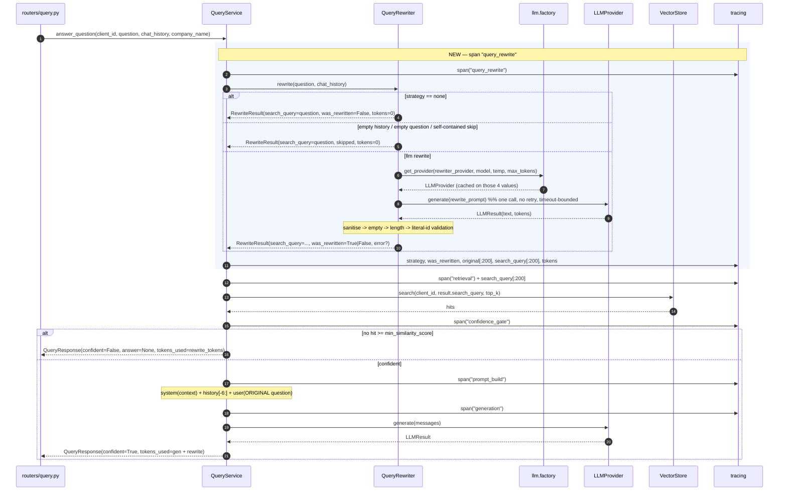
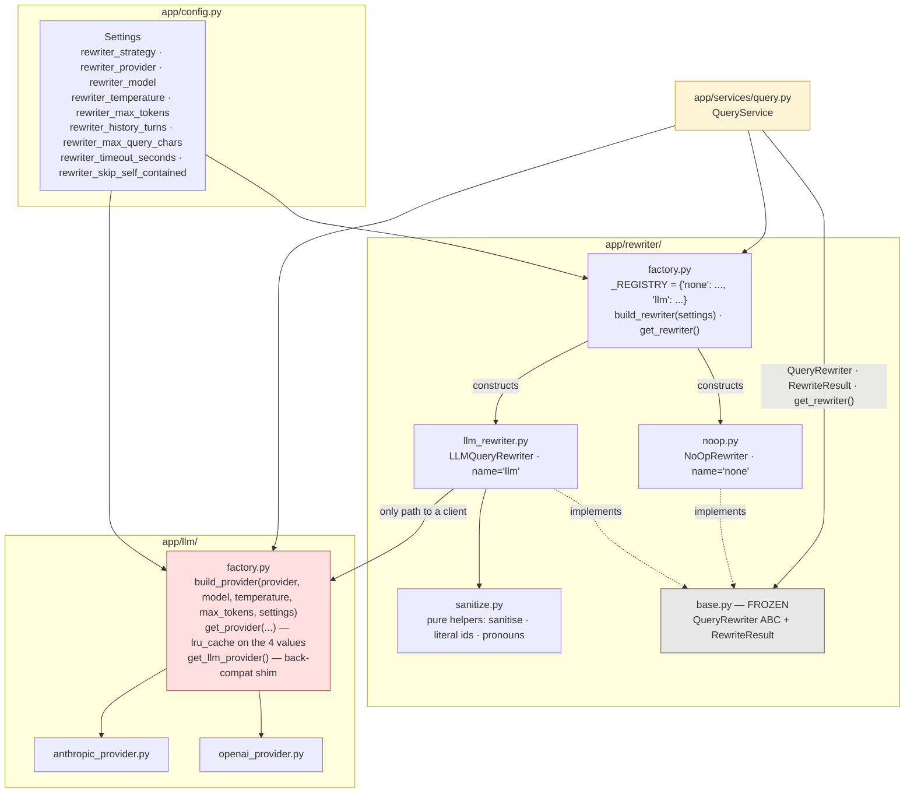

# Design Document

## Overview

Phase 1 inserts one stage into the RAG pipeline: a **query rewriter** that runs before retrieval and converts a context-dependent follow-up into a self-contained search string. Everything downstream of the retriever is unchanged. The user's own words still reach the LLM.

The change is small in surface area and deliberately large in seam quality:

| Area | What changes |
|---|---|
| `app/rewriter/` | 4 new files (`__init__.py`, `noop.py`, `llm_rewriter.py`, `factory.py`). `base.py` already exists and its contract is frozen. |
| `app/llm/factory.py` | Reworked: explicit four-argument construction entry point + a cache keyed on exactly those four values (Req 5 c13/c14). Existing callers keep working. |
| `app/services/query.py` | One new span + one injected collaborator + `search_query` fed to `store.search` + `tokens_used` summation. No concrete strategy referenced (Req 5 c5). |
| `app/config.py` | 9 new `rewriter_*` fields with Pydantic bounds, one validator for the dynamic default. |
| `eval/` | Cost attribution fix, one new dataset case, baseline-subset reporting. |
| `tests/` | New `Fake_Rewriter`, new modules for rewriter/factory/property tests. The 107 existing tests keep their assertions unedited. |
| Vectors / Milvus schema | **Nothing.** No re-ingest, no migration. |

### The defect being fixed

`QueryService.answer_question` embeds the raw question:

```python
hits = self.store.search(client_id, question, top_k=self.settings.retrieval_top_k)
```

"What about weekends?" has almost no standalone semantic content. Its 384-d MiniLM embedding lands nowhere near the `support-hours` chunk, the confidence gate drops everything below `0.15`, and the service declines a question it could answer. Baseline: `multi_turn` recall 0.500, precision 0.208, confidence accuracy 0.500. That is finding L1.

### Three design invariants everything else follows from

1. **`rewrite()` never raises.** Already mandated by `app/rewriter/base.py`. The rewriter is an optimisation; losing it degrades quality and must never produce a 500. Every design choice below — the sanitisation pipeline, the timeout, the fail-open matrix — is downstream of this.
2. **The rewrite is retrieval-only.** `search_query` goes to the embedder. `original` goes to the LLM. These two strings never cross over (Req 4 c1/c2).
3. **Off by default.** `rewriter_strategy` defaults to `none` in every environment. With the default, `NoOpRewriter` returns the original question, `store.search` receives the same string it receives today, and the 107 existing tests pass with unedited assertions (Req 9 c7/c10).

### Research notes that shaped the design

- **Condensed-question rewriting is the standard fix.** LangChain's `create_history_aware_retriever` and LlamaIndex's `CondenseQuestionChatEngine` both do exactly this: one LLM call, history + follow-up in, standalone query out, used for retrieval only. We are not inventing a pattern, we are adopting the one that has converged. ([LangChain history-aware retriever](https://python.langchain.com/docs/tutorials/qa_chat_history/), [LlamaIndex condense-question engine](https://docs.llamaindex.ai/en/stable/examples/chat_engine/chat_engine_condense_question/))
- **Fan-out was rejected on measured evidence, not taste.** `docs/RESEARCH.md` and PLAN.md decision D4 record that multi-query fan-out degraded performance on this corpus. Phase 1 delivers a single rewrite and measures it before anything is added.
- **The OpenAI Python SDK supports a per-client and per-request `timeout`,** and it is the only timeout mechanism that actually stops the socket. This is load-bearing for section 7 below. ([OpenAI Python README — timeouts](https://github.com/openai/openai-python))
- **Hypothesis is the de-facto Python PBT library** and needs no async or plugin machinery for what we need here. ([Hypothesis docs](https://hypothesis.readthedocs.io/en/latest/))

*Content from external sources above was rephrased; no verbatim reproduction.*

---

## Architecture

### Pipeline sequence



Span order is `query_rewrite → retrieval → confidence_gate → prompt_build → generation`. The rewrite span is emitted for every strategy including `none`, and for every result including a failed one (Req 6 c1). The confidence gate stays after retrieval and before generation for every rewrite outcome (Req 7 c9, CLAUDE.md rule 2).

### Module structure and the registry



`QueryService` has edges to `base.py` (types) and `factory.py` (entry point) only. It has **no edge to `noop.py` or `llm_rewriter.py`** — that is Req 5 c5 expressed structurally, and it is what makes "add a strategy" a two-line change.

### Adding a future strategy

Adding HyDE in a later phase is:

1. `app/rewriter/hyde.py` with `class HyDERewriter(QueryRewriter): name = "hyde"`.
2. One entry in `_REGISTRY`: `"hyde": HyDERewriter`.
3. One value added to the `rewriter_strategy` `Literal`.

Zero edits to `app/services/query.py`. Zero edits to `base.py`. The `Literal` widening in step 3 is what gives Req 3 c9 / Req 5 c1 their startup-time rejection, so it is a feature of the design rather than a friction point.

> **Design extension, flagged.** The requirements do not name a `sanitize.py` module. Factoring the pure functions (response sanitisation, `Literal_Identifier` classification, the pronoun list) into their own module is our decision, driven by two requirements that would otherwise be hard to satisfy: Req 11 c3 references "the pronoun and demonstrative list of Requirement 1 criterion 3" — a single shared definition is the only way those cannot drift — and the correctness properties below need these as importable pure functions with no provider dependency.

---

## Components and Interfaces

### 1. `app/rewriter/base.py` — frozen

Unchanged. `RewriteResult` and `QueryRewriter` as they stand today. No field is added, no signature altered. Every design element below fits inside the existing contract.

### 2. `app/rewriter/noop.py`

```python
class NoOpRewriter(QueryRewriter):
    """The off switch. No LLM, no history read, no failure mode."""

    name = "none"

    def rewrite(
        self,
        question: str,
        chat_history: list[ChatMessage] | None = None,
    ) -> RewriteResult:
        return RewriteResult(
            search_query=question,
            original=question,
            was_rewritten=False,
            strategy=self.name,
            tokens_used=0,
            prompt_tokens=0,
            completion_tokens=0,
            model=None,
            error=None,
        )
```

`chat_history` is accepted and ignored. There is no branch, so Req 5 c4 ("for every input including a chat history of 1 to 100 turns") holds by construction rather than by test coverage. The method body has no `try` because it cannot raise: it constructs a dataclass from two already-bound locals.

### 3. `app/rewriter/sanitize.py` — pure helpers, no I/O

Every function here is a pure function of its arguments. No `Settings`, no logger, no provider. This is what makes the property tests cheap and the classifier auditable.

```python
# The single definition. Req 1 c3 and Req 11 c3 both import THIS.
CONTEXT_DEPENDENT_TOKENS: frozenset[str] = frozenset(
    {"it", "they", "them", "that", "this", "those", "these", "one", "there"}
)

SELF_CONTAINED_MIN_TOKENS: int = 8   # "more than 8" in Req 11 c3

def tokens_of(text: str) -> list[str]: ...
def has_context_dependent_token(question: str) -> bool: ...
def is_self_contained(question: str) -> bool: ...

def sanitise_response(raw: str) -> str: ...
def literal_identifiers(text: str) -> list[str]: ...
def validate_literal_identifiers(
    original: str, candidate: str
) -> tuple[bool, str | None]: ...
def restore_history_identifier_case(
    candidate: str, history_text: str
) -> str: ...
```

**Why one shared token set.** Req 1 c3 defines the pronoun/demonstrative list that marks a question as context-dependent. Req 11 c3 defines the skip heuristic as the *negation* of that list plus a token count. The requirements author flagged explicitly that these must not drift. Two copies of a nine-element frozenset will drift; one copy cannot. `is_self_contained` is defined as `not has_context_dependent_token(q) and len(tokens_of(q)) > SELF_CONTAINED_MIN_TOKENS`, so the relationship is expressed in code, not in prose.

### 4. `app/rewriter/llm_rewriter.py`

```python
class LLMQueryRewriter(QueryRewriter):
    name = "llm"

    def __init__(self, settings: Settings) -> None:
        self._settings = settings
        self._provider: LLMProvider | None = None   # resolved on first rewrite

    def rewrite(self, question, chat_history=None) -> RewriteResult: ...
```

`rewrite` is one `try/except Exception` wrapping the entire body, with a second, minimal `except BaseException`-free fallback construction that cannot itself fail (Req 3 c1 explicitly covers "a call in which constructing the fallback `RewriteResult` itself raises" — see the Error Handling section for how that is handled without a recursive failure).

Control flow, in order:

| Step | Condition | Outcome |
|---|---|---|
| 1 | `question` empty or all-ASCII-whitespace | skip, `error` = empty question (Req 2 c8) |
| 2 | history is `Empty_History` (None / `[]` / all `content` blank after strip) | skip, `error=None`, `skipped=True`, reason `empty_history` (Req 2 c1–c4) |
| 3 | `rewriter_skip_self_contained` **and** `is_self_contained(question)` | skip, reason `self_contained` (Req 11 c3/c4) |
| 4 | build `History_Window`: drop blank-content entries **first**, then take last `rewriter_history_turns` (Req 2 c7, Req 7 c3) | — |
| 5 | resolve provider via `app.llm.factory` (first rewrite only) | on failure → `error` names the setting, no key value (Req 3 c3) |
| 6 | exactly one `generate` call, no retry, timeout-bounded | on exception → `error` = `f"{type(exc).__name__}: {exc}"` (Req 3 c2), on timeout → `error` names the timeout + bound (Req 3 c10, Req 7 c12) |
| 7 | sanitise → empty check → length check → literal-id validation, in that order | any rejection → fall back to `original`, `error` set |
| 8 | accept | `search_query` = candidate, `was_rewritten = (candidate != question)` (Req 1 c4/c9) |

Steps 1–3 return before any `LLM_Factory` interaction, which is what makes the no-API-key process viable (Req 2 c2, Req 9 c6).

### 5. `app/rewriter/factory.py`

```python
_REGISTRY: dict[str, Callable[[Settings], QueryRewriter]] = {
    NoOpRewriter.name: lambda _s: NoOpRewriter(),
    LLMQueryRewriter.name: LLMQueryRewriter,
}

def available_strategies() -> tuple[str, ...]:
    return tuple(_REGISTRY)

def build_rewriter(settings: Settings) -> QueryRewriter:
    name = settings.rewriter_strategy.strip().lower()
    ctor = _REGISTRY.get(name)
    if ctor is None:
        raise ValueError(
            f"Unknown rewriter strategy: {name!r}. "
            f"Registered: {', '.join(sorted(_REGISTRY))}"
        )
    return ctor(settings)

@lru_cache
def get_rewriter() -> QueryRewriter:
    return build_rewriter(get_settings())
```

- Keys come from the classes' own `name` attributes, so a class whose `name` disagrees with its registry key is impossible.
- The `ValueError` is raised **before** any provider resolution (Req 3 c8): `LLMQueryRewriter.__init__` stores settings and resolves nothing, so even the `llm` path constructs no client here (Req 5 c7).
- `NoOpRewriter` takes a `lambda _s:` so both registry values share one `Callable[[Settings], QueryRewriter]` signature. A constructor that ignores its argument is cheaper than two call shapes at the call site.
- `get_rewriter()` is `lru_cache`'d, matching the `get_llm_provider` / `get_settings` / `get_embeddings` convention.

### 6. `app/llm/factory.py` — the rework

This is the most consequential change in the phase because it sits under an existing, working code path.

**What Req 5 c13/c14 demand:**
- c14 — provider name, model, temperature, max tokens arrive as **explicit arguments**; none of the four is derived from an ambient `Settings`.
- c13 — at most one instance per distinct four-tuple per process; the cache key is **those four values alone**, with no process-global or tenant-implicit component; a rewriter configuration matching the generation configuration returns the *already-constructed* generation instance.

**What must not change:** `api_key` and `base_url` still come from `Settings` (CLAUDE.md rule 8), and they must **not** enter the cache key — a secret in an `lru_cache` key is both a leak surface and a correctness bug, since two callers with the same four config values must share one instance regardless of how credentials were resolved.

**New shape:**

```python
ProviderName = Literal["openai", "moonshot", "anthropic"]

def build_provider(
    provider: ProviderName | str,
    model: str,
    temperature: float,
    max_tokens: int,
    settings: Settings | None = None,
) -> LLMProvider:
    """Construct a provider. The four config values are explicit; credentials
    are resolved from Settings and are deliberately NOT part of the identity
    of the returned object.
    """
    settings = settings or get_settings()
    name = (provider or "").strip().lower()
    if name == "openai":
        return OpenAICompatibleProvider(
            model=model, temperature=temperature, max_tokens=max_tokens,
            api_key=settings.openai_api_key,
            base_url=settings.openai_base_url,
            provider_name="openai",
        )
    if name == "moonshot": ...
    if name == "anthropic": ...
    raise ValueError(f"Unknown LLM provider: {provider}")


@lru_cache(maxsize=32)
def get_provider(
    provider: str, model: str, temperature: float, max_tokens: int
) -> LLMProvider:
    """Cached on exactly those four values (Req 5 c13). Credentials are read
    inside build_provider and never appear in the key."""
    return build_provider(provider, model, temperature, max_tokens)


def get_llm_provider() -> LLMProvider:
    """Back-compat: the process-default generation provider."""
    s = get_settings()
    return get_provider(
        s.llm_provider, s.llm_model, s.llm_temperature, s.llm_max_tokens
    )
```

**Backward compatibility, concretely.** Two existing call sites go through this module:

| Caller | Today | After | Behaviour |
|---|---|---|---|
| `QueryService.provider` | `get_llm_provider()` | unchanged call | Same singleton per process while config is unchanged. |
| `eval/runner.py` judge | `build_provider(judge_settings)` where `judge_settings` is a `model_copy` with `llm_model=eval_judge_model, llm_temperature=0.0` | `build_provider(s.llm_provider, s.eval_judge_model, 0.0, s.llm_max_tokens)` | Same provider object; the `model_copy` dance disappears. |
| `tests/test_llm_factory.py` | `build_provider(_settings(...))` — a single `Settings` positional | **breaks** | See below. |

`build_provider`'s signature change is not source-compatible with the current single-`Settings` positional call. Two options were considered:

- **A — keep `build_provider(settings)` and add a differently-named four-arg function.** Zero churn, but it leaves the ambient-`Settings` entry point in place, which is exactly what c14 forbids ("SHALL derive none of those four values from a single ambient `Settings` object"). Rejected: it satisfies the letter and misses the point.
- **B (chosen) — change `build_provider` to the four-argument form and update the three call sites.** `eval/runner.py` and `tests/test_llm_factory.py` are edited. `tests/test_llm_factory.py` is the one place where Req 9 c10's "assertions unedited" is in tension with Req 5 c14, and the tension is only apparent: c10 constrains *assertions*, and each test's assertions (`isinstance`, `.name`, `.model`, `pytest.raises(ValueError)`) survive verbatim. Only the construction line in each test changes. This is flagged explicitly rather than glossed: the file is touched, the assertions are not.

**Why the cache lives in a separate function.** `lru_cache` on `build_provider` itself would force `settings` into the key, and `Settings` is a Pydantic model — hashable only by identity, which would make the key process-global-by-the-back-door and defeat c13. Splitting cached-lookup (`get_provider`, four scalars) from construction (`build_provider`, may read credentials) keeps the key provably four scalars. It also keeps `build_provider` directly testable with no cache to clear between tests.

**Why `maxsize=32`.** Unbounded caching keyed on caller-supplied strings is a slow memory leak once Phase 2+ admits per-tenant model selection. 32 distinct provider configurations per process is far beyond anything Phase 1 or Phase 2 will use, and eviction of an LLM client is harmless (it holds an HTTP connection pool, not state).

**The Phase 2+ seam.** The forward-looking note under Req 5 states the intent: per-customer UI-selected model families. With this shape, per-tenant selection is a call-site change — resolve the tenant's four values, call `get_provider(...)` — and nothing in `app/llm/` changes. Per-tenant selection itself is **out of scope now**: nothing in Phase 1 passes a `client_id` anywhere near this module, and `get_llm_provider()` remains the only path that reads process defaults.

### 7. `app/services/query.py` integration

```python
class QueryService:
    def __init__(
        self,
        store: VectorStoreService | None = None,
        provider: LLMProvider | None = None,
        rewriter: QueryRewriter | None = None,     # NEW, keyword-compatible
    ) -> None:
        self.settings = get_settings()
        self.store = store or get_vector_store()
        self._provider = provider
        self._rewriter = rewriter

    @property
    def rewriter(self) -> QueryRewriter:
        # Lazy for the same reason `provider` is lazy: resolving a rewriter must
        # not require an API key, and construction must not touch the network.
        if self._rewriter is None:
            self._rewriter = get_rewriter()
        return self._rewriter
```

`rewriter` is the third parameter, after `store` and `provider`, so every existing positional call (`QueryService()`, `QueryService(store=..., provider=...)`) is unaffected. The lazy property mirrors `provider` exactly and gives Req 5 c6 (explicit instance → no factory call) and c12 (no explicit instance → factory resolved once, reused) in four lines.

The new stage, inserted before the existing retrieval block:

```python
with span("query_rewrite", strategy_config=self.settings.rewriter_strategy) as sp:
    rw = self.rewriter.rewrite(question, chat_history)
    sp.set(
        strategy=rw.strategy,
        was_rewritten=rw.was_rewritten,
        original=question[:200],
        search_query=rw.search_query[:200],
    )
    if rw.tokens_used or rw.prompt_tokens or rw.completion_tokens:
        sp.record_tokens(
            prompt=rw.prompt_tokens,
            completion=rw.completion_tokens,
            total=rw.tokens_used,
            model=rw.model,
        )
    if rw.error:
        sp.set(rewrite_error=rw.error[:500])

if rw.error:
    logger.warning(
        "[AI SERVICE] rewrite failed (strategy=%s): %s", rw.strategy, rw.error[:500]
    )
if debug:
    logger.debug(
        "[AI SERVICE] rewrite strategy=%s original=%r search_query=%r",
        rw.strategy, question[:200], rw.search_query[:200],
    )

search_query = rw.search_query
rewrite_tokens = rw.tokens_used
```

then, in the existing retrieval span:

```python
with span("retrieval", top_k=..., threshold=...) as sp:
    sp.set(search_query=search_query[:200])          # Req 6 c4
    hits = self.store.search(client_id, search_query, top_k=...)
```

`client_id` is passed through untouched, so both the partition key and the explicit `client_id ==` expression filter inside `VectorStoreService.search` stay in force (Req 1 c8, CLAUDE.md rule 1). The rewriter never sees `client_id` and has no Milvus access.

**Token summation.** Two return sites change:

```python
# confident=false fallback (Req 4 c6/c7)
return QueryResponse(
    answer=None, confident=False, sources=[],
    tokens_used=rewrite_tokens,          # was: 0
    provider=self.settings.llm_provider,
    model=self.settings.llm_model,
)

# confident=true (Req 4 c5/c7)
return QueryResponse(
    answer=result.text, confident=True, sources=sources,
    tokens_used=result.tokens_used + rewrite_tokens,
    provider=result.provider, model=result.model,
)
```

The fallback path still reads `settings.llm_provider` / `settings.llm_model` without building a client — that property of the existing code is preserved deliberately (CLAUDE.md rule 4).

**Req 5 c5 compliance is checkable.** `app/services/query.py` will contain exactly these rewriter-related names: `QueryRewriter`, `RewriteResult` (in the type annotation), `get_rewriter`, and the span/attribute string `"query_rewrite"`. It will contain no occurrence of `NoOpRewriter`, `LLMQueryRewriter`, `noop`, or `llm_rewriter`. That is a `grep` assertion, and the test suite makes it one — the same technique `tests/test_eval_isolation.py` already uses to guard the runner's `os.environ` assignment.

### 8. The rewrite prompt

Shape (system + one user message, built from the `History_Window`):

```
SYSTEM:
You rewrite a follow-up question into a standalone search query.

Rules:
- Output ONLY the rewritten query. No preamble, no quotes, no explanation.
- Resolve pronouns and references using the conversation.
- Preserve every identifier exactly as written — product codes, SKUs,
  error codes, version strings, order numbers, email addresses. Do not
  change their capitalisation, spacing, or punctuation.
- If the question is already standalone, return it unchanged.
- Keep it under {rewriter_max_query_chars} characters.

USER:
Conversation:
user: When is support open?
assistant: Monday to Friday, 9am to 5pm Eastern.

Follow-up question: What about weekends?

Standalone search query:
```

**Why `temperature=0.0` (default, Req 7 c4).** Not for output determinism — hosted models are not byte-stable even at 0.0, which is why Req 7 c8 asserts reproducibility on the *prompt* we send rather than on the response we get. Temperature 0 is chosen because rewriting is an extraction task with a single right answer: creative variation is pure downside, and greedy decoding is the closest thing to a deterministic extractor the API offers.

**Why `rewriter_max_tokens=64` (range 16–256).** A standalone query is a dozen words. 64 completion tokens is generous headroom, caps the worst-case cost of the stage at roughly a tenth of a cent per thousand queries on `gpt-4o-mini`, and makes a runaway response structurally impossible rather than merely unlikely. The `rewriter_max_query_chars=500` check is the second, independent bound: `max_tokens` limits what the provider *can* return, `max_query_chars` limits what we *accept*.

**The prompt instructs; validation enforces.** The identifier-preservation rule in the prompt is a hint to the model, nothing more. Req 8 c1–c3 and c6–c8 are satisfied by the programmatic check in step 7 of the pipeline, which runs on every response and discards any response that dropped or re-cased an identifier from the original question. If the two ever disagree, the code wins. Stated plainly because it is the difference between a prompt-engineering wish and a testable guarantee.

### 9. Response sanitisation pipeline — normative ordering

Req 3 c11 makes the order normative, and c4/c5 both say "after the sanitisation required by criterion 11 has been applied". The pipeline, in exactly this order:

```
1. strip leading/trailing ASCII whitespace
2. remove ONE surrounding pair of matching ASCII quotes  ' ... '  or  " ... "
3. remove a surrounding markdown fence ``` ... ``` and the language tag
   on its opening line, then re-strip
4. --- sanitisation ends here; checks begin ---
5. EMPTY CHECK      -> reject (Req 3 c4), error: empty response
6. LENGTH CHECK     -> reject if len > rewriter_max_query_chars
                       (Req 3 c5), error names the bound
7. LITERAL_ID CHECK -> reject if an original-question identifier is
                       missing (Req 8 c2) or case-altered (Req 8 c3);
                       repair history-window identifier casing (Req 8 c8)
8. ACCEPT           -> search_query = candidate,
                       was_rewritten = (candidate != original)
```

Steps 1–3 are the loop body of a small fixed-point pass: models return `"```\n\"query\"\n```"` and `'"```text\nquery```"'` with equal enthusiasm, so a single pass in a fixed order would leave residue depending on nesting. The implementation applies steps 1–3 repeatedly until the string stops changing (bounded at 4 iterations, which is far beyond any observed nesting), which is also what makes `sanitise_response` idempotent — a property asserted below.

**Why the order matters and is not arbitrary.** If the empty check ran before sanitisation, `'""'` would pass as non-empty and become an empty `search_query`, and an empty string is fed straight to the embedder. If the length check ran before fence removal, a query near the bound would be rejected for the six characters of its own fence. If literal-id validation ran before quote removal, `"QM-4471-B"` would be compared with its quotes attached and the byte-for-byte test would fail spuriously. Each step's placement is load-bearing.

### 10. `Literal_Identifier` detection

Req 8 c6 as a pure function. Pre-step: strip leading and trailing characters that are not ASCII letters, digits, `-`, `_`, `.`, or `@`. Then the stripped token must be 2–64 characters and satisfy at least one clause:

| Clause | Rule | Matches | Does not match |
|---|---|---|---|
| (a) | every char in `[A-Za-z0-9_-]`, **and** ≥1 letter **and** ≥1 digit | `QM-4471-B`, `ERR_TIMEOUT_502`, `ORD12345` | `widget` (no digit), `4471` (no letter), `QM.4471` (`.` not permitted in this clause) |
| (b) | exactly one `@`, ≥1 permitted char before, ≥2 `.`-separated groups after | `returns@acme.test` | `@acme.test`, `a@b`, `a@@b.c` |
| (c) | begins `v` or `V`, then ≥2 `.`-separated groups of ASCII digits | `v2.4.15`, `V1.0` | `3.2`, `version2.4`, `v2` |

**Confirmed exclusions.** A bare `3.2` and a currency amount `$249.99` are **not** identifiers. `3.2` fails (a) — `.` is not in the (a) character class — fails (b) — no `@` — and fails (c) — no `v` prefix. `$249.99` strips to `249.99` and fails all three for the same reasons. Req 8's note records this as a reviewed trade-off: a classifier that fired on bare numerics would fire on prices, quantities, and dates, freezing them byte-for-byte and blocking legitimate rewrites far more often than it would save a `v`-less version string. Clause (c)'s `v` prefix is not to be "fixed" without re-deciding that trade-off.

**A consequence worth naming.** Clause (a) is a shape test, not a semantic one, so it fires on tokens that are not identifiers in any human sense — `9am-5pm` has letters and digits and only permitted characters, so it is classified as a `Literal_Identifier`. The effect is conservative: a rewrite that drops `9am-5pm` is rejected and we fall back to the original question. Over-firing costs us rewrites; under-firing costs us the one token that identifies the user's product. Req 8 c6 says "if and only if", so this is the specified behaviour and the implementation does not second-guess it. Flagged because it will show up in tests as a surprising-looking pass.

`literal_identifiers(text)` returns tokens in first-appearance order, preserving original spelling. It never lowercases its output — case preservation is exactly what Req 8 c3 needs to detect a violation, so lowercasing happens only inside the comparison, never in the returned value.

`validate_literal_identifiers(original, candidate)` returns `(ok, reason)`:

- For each identifier in `original`: present in `candidate` byte-for-byte → fine. Present case-insensitively but not byte-for-byte → `(False, "case-altered identifier: ...")` (c3). Absent entirely → `(False, "dropped identifier: ...")` (c2).
- Identifiers appearing only in the `History_Window` are **not** required in the candidate (c7). If such an identifier does appear with altered case, `restore_history_identifier_case` rewrites that occurrence to the history spelling and `was_rewritten` stays `True` (c8). This is the one place the pipeline *repairs* rather than rejects, because the identifier came from the history and the model's re-casing carries no user intent worth preserving.

### 11. The timeout mechanism

Req 7 c11/c12 and Req 3 c10 require a wall-clock bound on the rewrite provider call, defaulting to 5.0 s, with the span duration at most bound + 1.0 s. This is the hardest part of the design, because `LLMProvider.generate(messages)` has no timeout parameter and the OpenAI/Anthropic SDK calls here are synchronous.

**Options considered:**

| Option | How | Actually stops the request? | Cost |
|---|---|---|---|
| **A — SDK-level timeout at client construction** | Pass `timeout=` to `OpenAI(...)` / `Anthropic(...)`; the SDK enforces it on the HTTP layer and raises `APITimeoutError`. | **Yes** — the socket is closed, the request is genuinely abandoned. | Requires threading a `timeout` argument into the provider constructors, i.e. touching `app/llm/`. The timeout becomes a property of the client instance, so a rewriter client and a generation client with different timeouts are different instances. |
| **B — `ThreadPoolExecutor` + `future.result(timeout=…)`** | Submit `generate` to a worker; on `TimeoutError`, stop waiting. | **No.** Python cannot kill a thread. The HTTP request continues to completion in the background; we simply stop caring. The tokens are still spent, the connection still held. | No change to `app/llm/`. One thread per rewrite. A leaked worker on every timeout. |
| **C — `signal.alarm` / `SIGALRM`** | Set an alarm, raise in the handler. | Partially — interrupts the syscall. | **Unusable here.** `signal` only works on the main thread of the main interpreter; under Uvicorn, request handlers run in a threadpool. It would silently never fire, or fire in the wrong place. Rejected outright. |

**Recommendation: A as the primary mechanism, with B as a bounded outer guard.**

A alone is the right answer for the network case and is the only option that makes "abandon that call" (Req 7 c12) literally true. `build_provider` gains an optional `timeout: float | None = None` that is forwarded to the SDK client constructor; `LLMQueryRewriter` requests its provider with `timeout=rewriter_timeout_seconds`. The provider raises `APITimeoutError`, which the rewriter's `except Exception` already catches, and the handler distinguishes it to produce the timeout-specific `error` string that c12 requires.

B is retained as a thin outer wrapper for one reason: A bounds the *HTTP* call, not `generate` as a whole. A provider that hangs in response parsing, in a DNS resolver with its own timeout, or in a retry loop inside the SDK is not bounded by A. The outer `future.result(timeout=rewriter_timeout_seconds + 0.5)` guarantees the span duration bound in Req 3 c10 (`≤ bound + 1.0 s`) regardless of what the SDK does. The 0.5 s of slack lets A fire first in the normal case, so the specific `APITimeoutError` reaches us rather than the generic outer timeout.

**Stated plainly: what happens to an in-flight request.** With A, the SDK closes the socket and the request is aborted — though the provider may already have started generating and may still bill for it, which is why `tokens_used` on a timeout is reported as `0`: we have no usage figures because no response was parsed. If the outer guard B fires instead, the worker thread is *not* killed; it runs to completion and its result is discarded. Python offers no safe thread cancellation, and we will not use `ctypes`-based async exception injection to fake one. The consequence is a bounded number of orphaned worker threads under sustained provider degradation — one per timed-out rewrite, each ending on its own when the SDK gives up. Acceptable because A makes B's path rare, the executor is bounded, and the alternative is an unbounded request latency.

**Deviation flagged.** The requirements never mention `app/llm/` gaining a `timeout` parameter. Option A requires it. This is an extension of the requirements' letter in service of Req 7 c12's intent, and it is confined to an optional keyword argument with a `None` default, so the generation path is byte-identical to today unless a timeout is explicitly requested. CLAUDE.md rule 4 is respected: the SDK client is still constructed only inside `app/llm/`.

### 12. The self-contained skip heuristic

Defaulted **off** (`rewriter_skip_self_contained=False`, Req 11 c1). Req 11 c2 requires that Phase 1 acceptance be measured with it inactive, and Req 11 c5/c6 require any measurement with it on to be reported as a separate, excluded entry.

`is_self_contained(question)` is a single function in `sanitize.py`:

```python
def is_self_contained(question: str) -> bool:
    """Req 11 c3: no listed pronoun/demonstrative AND more than 8 tokens.
    Both halves read from CONTEXT_DEPENDENT_TOKENS, the same frozenset that
    Req 1 c3's context-dependence test uses. One definition, no drift.
    """
    if has_context_dependent_token(question):
        return False
    return len(tokens_of(question)) > SELF_CONTAINED_MIN_TOKENS
```

The skip reason recorded on the span is `"self_contained"`, which differs from the empty-history reason `"empty_history"` as Req 11 c4 requires. Both are recorded alongside `skipped=True`.

**Why it stays off.** The heuristic can skip a genuinely context-dependent question that happens to contain no listed pronoun and run over 8 tokens — "And what does the extended warranty on the second one I mentioned cover" is caught by `one`, but a rephrasing without it is not. It is a cost lever, not a correctness feature, and Req 11 c6 correctly excludes it from acceptance.

---

## Data Models

### `RewriteResult` field semantics per path

`RewriteResult` itself is unchanged. What varies is which combination of values each path produces — this table is the normative reference for both the implementation and the tests.

| Path | `search_query` | `was_rewritten` | `strategy` | `tokens_used` / `prompt` / `completion` | `model` | `error` |
|---|---|---|---|---|---|---|
| `none` strategy (Req 5 c4) | `original` | `False` | `none` | 0 / 0 / 0 | `None` | `None` |
| empty history (Req 2 c1) | `original` | `False` | `llm` | 0 / 0 / 0 | `None` | `None` |
| empty/whitespace question (Req 2 c8) | `original` | `False` | `llm` | 0 / 0 / 0 | `None` | empty question |
| self-contained skip (Req 11 c3) | `original` | `False` | `llm` | 0 / 0 / 0 | `None` | `None` |
| provider unresolvable / no key (Req 3 c3) | `original` | `False` | `llm` | 0 / 0 / 0 | `None` | names the **setting**, never a value |
| provider raised (Req 3 c2) | `original` | `False` | `llm` | 0 / 0 / 0 | `None` | `ClassName: message` |
| timeout (Req 3 c10, Req 7 c12) | `original` | `False` | `llm` | 0 / 0 / 0 | `None` | timeout + configured bound |
| empty after sanitising (Req 3 c4) | `original` | `False` | `llm` | provider-reported | model | empty response |
| too long (Req 3 c5) | `original` | `False` | `llm` | provider-reported | model | length + bound |
| identifier dropped (Req 8 c2) | `original` | `False` | `llm` | provider-reported | model | dropped identifier |
| identifier re-cased (Req 8 c3) | `original` | `False` | `llm` | provider-reported | model | case-altered identifier |
| accepted, changed | sanitised candidate | `True` | `llm` | provider-reported | model | `None` |
| accepted, identical to original (Req 1 c9) | `original` | `False` | `llm` | provider-reported | model | `None` |

Note the split in the tokens column: paths that reject a response the provider *did* return still report that provider's tokens, because the money was spent (Req 3 c7, Req 4 c7). Paths where no provider call completed report 0.

### New `Settings` fields

```python
# ---- Query rewriting (PLAN.md Phase 1) ----
# Default `none` in EVERY environment: no app_env / CI / test-runner sniffing
# (Req 9 c7, CLAUDE.md rule 8). Turning the feature on is a config value.
rewriter_strategy: Literal["none", "llm"] = "none"

# Defaults to the configured llm_provider — see the validator below.
rewriter_provider: Literal["openai", "moonshot", "anthropic"] | None = None
rewriter_model: str = Field("gpt-4o-mini", min_length=1, max_length=100)
rewriter_temperature: float = Field(0.0, ge=0.0, le=1.0)
rewriter_max_tokens: int = Field(64, ge=16, le=256)
rewriter_history_turns: int = Field(6, ge=1, le=20)
rewriter_max_query_chars: int = Field(500, ge=20, le=1000)
rewriter_timeout_seconds: float = Field(5.0, ge=0.5, le=30.0)
rewriter_skip_self_contained: bool = False

@model_validator(mode="after")
def _default_rewriter_provider(self) -> "Settings":
    """rewriter_provider has a *dynamic* default: the configured llm_provider
    (Req 5 c11, Req 7 c10). A class-level default cannot reference another
    field's resolved value, so the None sentinel is filled in here — after
    llm_provider has been read from the environment and validated.
    """
    if self.rewriter_provider is None:
        object.__setattr__(self, "rewriter_provider", self.llm_provider)
    return self
```

| Field | Type | Bound | Default | Requirement |
|---|---|---|---|---|
| `rewriter_strategy` | `Literal["none","llm"]` | registry names | `"none"` | 5 c1, 3 c9, 9 c7 |
| `rewriter_provider` | `Literal["openai","moonshot","anthropic"]` | same as `llm_provider` | `llm_provider` value | 5 c11, 7 c10 |
| `rewriter_model` | `str` | 1–100 chars | `"gpt-4o-mini"` | 7 c5 |
| `rewriter_temperature` | `float` | 0.0–1.0 | `0.0` | 7 c4 |
| `rewriter_max_tokens` | `int` | 16–256 | `64` | 7 c1 |
| `rewriter_history_turns` | `int` | 1–20 | `6` | 7 c2 |
| `rewriter_max_query_chars` | `int` | 20–1000 | `500` | 7 c6 |
| `rewriter_timeout_seconds` | `float` | 0.5–30.0 | `5.0` | 7 c11 |
| `rewriter_skip_self_contained` | `bool` | — | `False` | 11 c1 |

**Why `Field(...)` constraints rather than validators.** Pydantic renders `ge`/`le`/`min_length` violations as startup `ValidationError`s naming the field and the bound, which is precisely the "fail validation at application startup with a message naming that value" that Req 3 c9 and Req 5 c1 ask for. A hand-written validator would be more code and a worse message.

**Why `Literal` for the two enum-ish fields.** Same reason: an unregistered `rewriter_strategy` is rejected before the first query is served, and the error names the offending value. The design consequence is that the `Literal` and `_REGISTRY` must be widened together when a strategy is added — a coupling the factory test asserts (`set(available_strategies()) == set(get_args(...))`) so it cannot be forgotten silently.

**Why the `None` sentinel on `rewriter_provider`.** Pydantic class-level defaults are evaluated without access to sibling field values, so "default to whatever `llm_provider` resolved to" has to happen post-validation. `None` means "not configured"; the validator replaces it. Callers therefore always see a concrete provider name. `object.__setattr__` is used because a `model_validator(mode="after")` on a settings model that may be frozen must not go through normal assignment validation.

### `.env.example` additions

```dotenv
# ---- Query rewriting (Phase 1) ----
# none = off (default, zero behaviour change). llm = one rewrite call per
# multi-turn query.
REWRITER_STRATEGY=none
# Defaults to LLM_PROVIDER when unset.
REWRITER_PROVIDER=
REWRITER_MODEL=gpt-4o-mini
REWRITER_TEMPERATURE=0.0
REWRITER_MAX_TOKENS=64
REWRITER_HISTORY_TURNS=6
REWRITER_MAX_QUERY_CHARS=500
REWRITER_TIMEOUT_SECONDS=5.0
# Cost lever, off for Phase 1 acceptance (Requirement 11).
REWRITER_SKIP_SELF_CONTAINED=false
```

### Eval harness changes

**1. Cost attribution (Req 4 c8).** `eval/runner.py` currently does:

```python
score.cost_usd = estimate_cost_usd(response.model, response.tokens_used, 0)
```

`response.tokens_used` now mixes rewrite tokens into a figure attributed wholly as prompt tokens. `QueryResponse` gains no field (Req 4 c4 forbids it), so the harness cannot split the two from the response alone. Req 4 c8 offers two ways out; we take the second, and make it explicit rather than silent:

- The formula is unchanged.
- The run report gains a `cost_note` in its `config` block: `"conservative: response.tokens_used mixes rewrite completion tokens into a total attributed wholly as prompt tokens; rewrite tokens are bounded by rewriter_max_tokens per query"`.
- The printed report shows the note under the cost line whenever `rewriter_strategy != "none"`.

Rationale: attributing the split properly would require either a response-shape change (forbidden by Req 4 c4) or the harness reaching into the trace (couples the harness to span internals for a cost estimate whose stated purpose is spotting *relative* regressions). With `rewriter_max_tokens=64`, the mis-attribution is bounded at 64 completion tokens priced as prompt tokens per query — well under a cent across the whole run. Recording the reason is worth more than the precision.

**2. New dataset case (Req 8 c5).** One case tagged both `exact_match` and `multi_turn`, question containing a `Literal_Identifier`, ≥2 history turns, ≥1 expected source:

```yaml
- id: EMT-01
  question: Is the QM-4471-B compatible with it?
  chat_history:
    - role: user
      content: My device is on firmware 3.0 — do I need anything extra?
    - role: assistant
      content: Yes, firmware 3.0 needs the QM-ADAPT-1 adapter.
  expect_confident: true
  expected_sources: [product-catalog]
  expected_facts: ["Widget Pro"]
  tags: [exact_match, multi_turn, p1_target]
```

This case exercises the two features together: `it` makes it context-dependent (Req 1 c3), `QM-4471-B` matches clause (a) and must survive byte-for-byte (Req 8 c1), and the history contains a second identifier `QM-ADAPT-1` that the response is *not* required to carry (Req 8 c7). It is the only case in the dataset that can catch a rewriter that resolves the reference correctly while mangling the SKU.

**3. Case-count handling (Req 10 c11).** Adding EMT-01 takes the dataset from 23 to 24 cases, so a whole-dataset comparison against baseline run `1ff70e1e` is no longer like-for-like. The runner gains `--baseline-subset`:

- Read the case ids present in `baseline.json`.
- Compute and report the Req 10 c4/c5 values over that intersection only.
- Report each case id present now but absent from the baseline as a separate `added_cases` block with its own outcome, excluded from the comparison.
- Print both: "vs baseline (23 shared cases)" and "added cases (1): EMT-01 …".

`make eval-compare` passes `--baseline-subset` so the CI gate compares like with like. The full 24-case numbers are still computed and stored in the report; only the *comparison* is restricted. Req 10 c6's caveat is respected — an exit code of 0 with no `baseline.json` present is not evidence, and the runner already prints "no baseline … run with `--baseline` first" in that case.

**4. No Makefile target changes required.** `test`, `eval`, `eval-baseline`, `eval-compare`, `eval-judge`, `eval-multiturn`, `eval-exact` all keep working. `make test` gains `hypothesis` in its quiet pip install line; `eval-compare`'s runner invocation gains `--baseline-subset`.

**5. `requirements-dev.txt`** gains `hypothesis==6.122.3` (pinned, per the exact-version convention already used for `pytest` and `pyyaml`). It is a dev-only dependency: nothing in `app/` imports it.

---

## Correctness Properties

*A property is a characteristic or behavior that should hold true across all valid executions of a system — essentially, a formal statement about what the system should do. Properties serve as the bridge between human-readable specifications and machine-verifiable correctness guarantees.*

**Library: [Hypothesis](https://hypothesis.readthedocs.io/en/latest/)**, pinned in `requirements-dev.txt` as `hypothesis==6.122.3`. Nothing in `app/` imports it. Minimum 100 examples per property (`@settings(max_examples=100)`), and each test carries the tag comment `# Feature: phase-1-query-rewriting, Property N: <property text>`.

**Why this feature suits PBT.** The rewriter's core is pure: response sanitisation, identifier classification, window construction, and token arithmetic are all functions of their arguments with no I/O. The provider is behind an ABC that a fake satisfies, so even the fault paths are cheap to generate. And the headline requirement — `rewrite()` never raises — is a universally quantified statement by construction.

The prework produced ~60 property candidates across 11 requirements; consolidation reduced them to the 18 below, each asserting something no other property implies. The consolidation was mechanical: biconditional halves merged (`was_rewritten` true/false), the six fault modes collapsed into one fallback-fidelity statement, the five span-attribute criteria collapsed into one truncation-and-token rule, and the three cache criteria collapsed into one identity statement. Every merged criterion keeps its link through the `Validates:` annotations.

### Property 1: `rewrite()` never raises

*For any* question string — including the empty string, a single character, a string of exactly `rewriter_max_query_chars` characters, non-ASCII text, and control characters — and *for any* chat history — `None`, an empty list, or a list of 0 to 20 entries with arbitrary roles and arbitrary content — and *for any* injected provider fault (raising an exception of any type, returning an empty string, returning whitespace only, returning a string exceeding `rewriter_max_query_chars`, returning a string that drops a `Literal_Identifier`, an unresolvable provider, or an empty API key), every registered `Query_Rewriter` returns a `RewriteResult` instance and propagates no exception to its caller.

**Validates: Requirements 3.1, 9.8**

### Property 2: Fallback fidelity — a rejected or failed rewrite returns the original byte-for-byte

*For any* question and *for any* rewrite failure or rejection — a provider exception, an unresolvable provider or missing key, a timeout, a response that sanitises to empty, a response longer than `rewriter_max_query_chars`, a response that drops an original-question `Literal_Identifier`, or a response that re-cases one — the returned `RewriteResult` satisfies all three of: `search_query == original` byte-for-byte, `was_rewritten is False`, and `error is not None`.

**Validates: Requirements 3.2, 3.3, 3.4, 3.5, 8.2, 8.3, 9.4, 2.8**

### Property 3: `was_rewritten` is exactly the inequality of the two strings

*For any* accepted rewrite response, `was_rewritten` is `True` if and only if `search_query != original` under byte comparison.

**Validates: Requirements 1.4, 1.9**

### Property 4: An accepted `search_query` is non-empty and within the configured bound

*For any* non-empty, non-whitespace question and *for any* `rewriter_max_query_chars` in 20 to 1000, the returned `search_query` is a non-empty string of at most `rewriter_max_query_chars` characters — for accepted rewrites, for rejected ones, and for skipped ones.

**Validates: Requirements 1.3, 1.10, 3.5**

### Property 5: The skip path spends nothing and touches no provider

*For any* question and *for any* `Empty_History` — `None`, a list of zero entries, or a list in which every entry's `content` is empty after stripping ASCII whitespace, with arbitrary roles and arbitrary whitespace content — the `LLM_Rewriter` returns `search_query == original` byte-for-byte, `was_rewritten is False`, `strategy == "llm"`, `error is None`, `model is None`, and `tokens_used == prompt_tokens == completion_tokens == 0`, having invoked no `LLMProvider` method and resolved no provider through `LLM_Factory`. Conversely, *for any* history containing at least one entry whose `content` is non-whitespace — including a history whose every entry has role `assistant` — the rewrite path is taken and exactly one provider call is made.

**Validates: Requirements 2.1, 2.2, 2.5, 2.6, 11.2**

### Property 6: The history window discards blanks before it caps

*For any* chat history of arbitrary length mixing blank-content and non-blank-content entries, and *for any* `rewriter_history_turns` in 1 to 20, the `History_Window` contains no blank-content entry, contains exactly `min(non_blank_count, rewriter_history_turns)` entries, and equals the last `rewriter_history_turns` non-blank entries in their original relative order.

**Validates: Requirements 2.7, 7.3**

### Property 7: The sanitisation pipeline is idempotent, and decoration is invisible

*For any* payload string, `sanitise_response(sanitise_response(x)) == sanitise_response(x)`; and *for any* payload wrapped in any combination of leading/trailing ASCII whitespace, one surrounding pair of matching ASCII single or double quotes, and one surrounding markdown code fence with or without a language tag, `sanitise_response(wrapped) == sanitise_response(bare)`.

**Validates: Requirements 3.11, 3.4**

### Property 8: `Literal_Identifier` classification is idempotent, case-preserving, and clause-faithful

*For any* string, `literal_identifiers` returns tokens that (a) each carry the spelling they had in the source byte-for-byte, (b) each satisfy at least one of the Requirement 8 criterion 6 clauses and the 2-to-64-character bound, and (c) reproduce themselves under re-classification — `literal_identifiers(" ".join(literal_identifiers(s))) == literal_identifiers(s)`. The classification of any token agrees with an independently written reference predicate over the three clauses, and the confirmed exclusions `3.2` and `$249.99` are never classified as identifiers.

**Validates: Requirements 8.6**

### Property 9: Identifier validation accepts exactly the responses that preserve question identifiers

*For any* question containing generated `Literal_Identifier` tokens and *for any* candidate response, the candidate is accepted if and only if every identifier of the question appears in it byte-for-byte; and *for any* identifier appearing in the `History_Window` but not in the question, the candidate is accepted irrespective of whether that identifier appears in it, with any case-altered occurrence of it rewritten to the history spelling byte-for-byte while `was_rewritten` remains `True`.

**Validates: Requirements 8.1, 8.2, 8.3, 8.7, 8.8**

### Property 10: The store receives exactly the client id and the search query it was given

*For any* `client_id` and *for any* `RewriteResult` — including one whose `error` is populated and one whose `was_rewritten` is `True` on an empty history — `Vector_Store.search` is called exactly once with that same `client_id` and with `result.search_query` byte-for-byte, after the rewriter's `rewrite` call has completed and exactly once per query.

**Validates: Requirements 1.1, 1.2, 1.8, 2.5, 9.2**

### Property 11: The LLM sees the user's words and never the rewrite

*For any* question and *for any* `search_query` that differs from it and does not occur in the retrieved chunk text or the chat history, the message list passed to `LLMProvider.generate` has its final entry equal to `{"role": "user", "content": question}` with `content` byte-for-byte identical to the question, and the `search_query` appears in neither `messages[0]["content"]` nor `messages[-1]["content"]`. The history turns occupy the positions between, preserving each turn's `role` and `content` byte-for-byte and their original relative order, capped at the last 6 — and the resulting message list is identical for every value of `rewriter_history_turns` from 1 to 20.

**Validates: Requirements 4.1, 4.2, 4.3, 9.3**

### Property 12: Reported `tokens_used` is the sum and dominates each addend

*For any* non-negative generation token count and *for any* non-negative rewrite token count, with `error` free to be populated or not, and on both the `confident=true` path and the `confident=false` fallback path, the `QueryResponse` `tokens_used` equals the arithmetic sum of the two and is greater than or equal to each of them individually.

**Validates: Requirements 4.5, 4.6, 4.7**

### Property 13: The response shape is unchanged and leaks nothing about the rewrite

*For any* `RewriteResult` with an arbitrary `error` string and an arbitrary `strategy` name, the returned `QueryResponse` carries exactly the six fields `answer`, `confident`, `sources`, `tokens_used`, `provider`, `model`, and no field value contains the `error` string or the `strategy` name.

**Validates: Requirements 3.6, 4.4**

### Property 14: Observability changes no answer, and failing observability changes no answer

*For any* question, chat history and `RewriteResult`, the `search_query` recorded by the store and every field value of the returned `QueryResponse` are identical whether `tracing_enabled` is true or false, and identical when `Span.set` and `Span.record_tokens` are sabotaged to raise on every call. In the sabotaged case no exception reaches the caller. Separately, *for any* strings longer than 200 characters, the `query_rewrite` span records `original` and `search_query` truncated to their first 200 characters, the `retrieval` span records `search_query` truncated the same way, and the span carries a token block if and only if at least one of the three token counts is greater than 0.

**Validates: Requirements 6.2, 6.3, 6.4, 6.6, 6.8, 6.9**

### Property 15: Provider identity is the four configuration values and nothing else

*For any* two `(provider, model, temperature, max_tokens)` tuples over the registered provider names, `get_provider` returns the identical object for equal tuples and distinct objects for unequal tuples, and the returned provider's `model`, `temperature` and `max_tokens` equal the arguments supplied rather than the corresponding `Settings` values. *For any* number of queries from 1 to 10, a `Query_Service` constructed with an explicit rewriter makes zero `Rewriter_Factory` calls, one constructed without makes exactly one and reuses the result, and no `LLMProvider` is resolved until a rewrite that requires generation occurs.

**Validates: Requirements 5.6, 5.7, 5.9, 5.12, 5.13, 5.14**

### Property 16: With `rewriter_strategy` of `none`, behaviour is byte-for-byte pre-Phase-1

*For any* question and *for any* chat history including a non-empty one, with `rewriter_strategy` set to `none`, the query string recorded by the store equals the submitted question byte-for-byte, the message list recorded by the provider equals the system message followed by the last 6 history turns followed by the question, no `LLMProvider` method is invoked by the rewriter, and the `RewriteResult` reports `strategy == "none"`, `error is None` and all three token counts `0` — for a chat history of 1 to 100 turns.

**Validates: Requirements 5.4, 9.7, 9.9, 9.10**

### Property 17: The baseline comparison set is the intersection of case ids

*For any* set of baseline case ids and *for any* set of current case ids, the harness computes its baseline comparison over exactly the intersection, reports exactly the current-minus-baseline difference as added cases, and no added case id influences any aggregate in the comparison block.

**Validates: Requirements 10.11**

### Property 18: The self-contained skip decision is exactly the shared-list predicate

*For any* question, with `rewriter_skip_self_contained` set to `true` and a non-empty chat history, the skip path is taken if and only if the question contains no token from `CONTEXT_DEPENDENT_TOKENS` under ASCII case-insensitive comparison **and** contains more than 8 whitespace-delimited tokens; and with the flag set to `false`, a rewrite is attempted irrespective of the question's shape. Both halves read the same `CONTEXT_DEPENDENT_TOKENS` definition used by the Requirement 1 criterion 3 context-dependence test.

**Validates: Requirements 11.2, 11.3, 1.3**

### Criteria deliberately not covered by a property

| Criteria | Why not a property | How it is covered instead |
|---|---|---|
| 1.5, 1.6, 1.7, 8.4, 10.1–10.6, 10.10 | Measured outcomes against a real corpus and a hosted model. 100 iterations means 100 paid runs and still cannot make a hosted model deterministic. | Eval harness, deterministic mode, two consecutive runs (Req 10 c10). |
| 1.11, 3.10, 7.12 | Each iteration costs real wall-clock seconds. | Example tests with a deliberately slow fake provider and a small configured bound. |
| 2.4 | A latency budget. Randomised timing assertions flap on shared CI. | The single timing test the criterion itself specifies: 20+ consecutive skip invocations, p95 ≤ 5.0 ms, per-invocation ≤ 25.0 ms. |
| 3.8, 3.9, 5.1, 5.2, 5.3, 5.11, 7.1, 7.2, 7.4, 7.5, 7.6, 7.11, 11.1, 11.4 | Configuration validation and registry enumeration. The domains are 2–3 values wide. | Example tests, plus the structural assertion `set(available_strategies()) == set(get_args(Literal))`. |
| 5.5, 5.8, 5.10, 6.7(namespace), 9.7(no sniffing) | Source-level structural constraints — which identifiers a module may contain. | Source-text assertions, the technique `tests/test_eval_isolation.py` already uses. |
| 9.1, 9.6, 9.10, 10.7–10.9, 10.12, 11.5, 11.6 | Test fixtures, environment constraints, and reporting obligations. | Fixtures, a smoke check, and the acceptance record. |
| 1.3 (subject resolution half) | "Contains that subject name" is a claim about hosted-model output quality. A fake makes the assertion vacuous; a real model makes it non-deterministic. | Property 4 covers the bound; the MT cases in the eval harness measure the resolution. |

---

## Error Handling

Every row below ends in the same client-visible place: **HTTP 200, exactly six `QueryResponse` fields, no leakage of the rewrite attempt** (Req 3 c6). The rewriter has no failure mode that reaches the caller.

| Failure | Detected at | `search_query` | `was_rewritten` | tokens | `model` | `error` | Log | Span | Client sees |
|---|---|---|---|---|---|---|---|---|---|
| Empty / whitespace question | step 1, before any provider work | `original` | `False` | 0 | `None` | empty question | DEBUG only | `skipped=True` | normal 200 |
| Empty history | step 2 | `original` | `False` | 0 | `None` | `None` | none | `skipped=True`, `reason="empty_history"` | normal 200 |
| Self-contained skip (flag on) | step 3 | `original` | `False` | 0 | `None` | `None` | none | `skipped=True`, `reason="self_contained"` | normal 200 |
| No API key for resolved provider | step 5, `build_provider` raises `ValueError` | `original` | `False` | 0 | `None` | names the **setting** (`OPENAI_API_KEY`), never a value | WARNING | `rewrite_error` (truncated 500) | normal 200 |
| Unknown provider name | step 5, `build_provider` raises `ValueError` | `original` | `False` | 0 | `None` | names the provider value | WARNING | `rewrite_error` | normal 200 |
| Provider raised (rate limit, 5xx, network) | step 6, `except Exception` | `original` | `False` | 0 | `None` | `f"{type(exc).__name__}: {exc}"` | WARNING | `rewrite_error` | normal 200 |
| SDK timeout (`APITimeoutError`) | step 6, typed branch | `original` | `False` | 0 | `None` | timeout + `rewriter_timeout_seconds` value | WARNING | `rewrite_error`, `timed_out=True` | normal 200 |
| Outer guard timeout (`concurrent.futures.TimeoutError`) | step 6, outer wrapper | `original` | `False` | 0 | `None` | timeout + bound, notes the outer guard | WARNING | same, `guard="outer"` | normal 200 |
| Response sanitises to empty | step 7.5 | `original` | `False` | **provider-reported** | model | empty response | WARNING | `rewrite_error` + token block | normal 200 |
| Response over `rewriter_max_query_chars` | step 7.6 | `original` | `False` | **provider-reported** | model | length + configured bound | WARNING | `rewrite_error` + token block | normal 200 |
| Question identifier dropped | step 7.7 | `original` | `False` | **provider-reported** | model | names the dropped identifier | WARNING | `rewrite_error` + token block | normal 200 |
| Question identifier re-cased | step 7.7 | `original` | `False` | **provider-reported** | model | names the case-altered identifier | WARNING | `rewrite_error` + token block | normal 200 |
| Unknown `rewriter_strategy` at runtime | `build_rewriter`, before any provider resolution | — | — | — | — | `ValueError` naming the strategy | ERROR | — | 500 — **and this is correct**: it is a deployment fault, not a rewrite fault (Req 3 c8) |
| Invalid `rewriter_*` setting value | Pydantic, at import of `Settings` | — | — | — | — | `ValidationError` naming field and bound | startup failure | — | process does not start (Req 3 c9, Req 5 c1) |
| Tracing/span error | inside `app/tracing.py` | unchanged | unchanged | unchanged | unchanged | unchanged | tracing's own | lost | identical 200 (Req 6 c6) |

**Two failures are deliberately *not* fail-open.** An unregistered strategy name and an out-of-range setting are configuration errors that a human introduced and a human must see. Failing open on them would silently run `none` in an environment configured for `llm`, and the operator would discover it from a metrics regression weeks later. Req 3 c8 and c9 make this explicit and the design honours it: the loud failure is the correct one, and it happens at startup or at first resolution, not per-request.

**The token column's split, restated.** Rows detected in step 6 or earlier report `0` because no provider response was parsed. Rows detected in step 7 report the provider's figures because the call completed and the money was spent (Req 3 c7, Req 4 c7). Reporting `0` there would understate real cost in the trace and in the eval harness, which is exactly the bug Req 4 c6 was written to prevent on the fallback path.

**The "fallback construction itself raises" clause (Req 3 c1).** The outer handler cannot call a helper that could fail. Its body constructs the dataclass from two locals bound before any work began:

```python
def rewrite(self, question, chat_history=None) -> RewriteResult:
    original = question if isinstance(question, str) else str(question)
    try:
        return self._rewrite_inner(original, chat_history)
    except Exception as exc:          # never re-raises
        try:
            detail = f"{type(exc).__name__}: {exc}"
        except Exception:
            detail = "unrepresentable rewriter failure"
        return RewriteResult(
            search_query=original,
            original=original,
            was_rewritten=False,
            strategy=self.name,
            error=detail,
        )
```

`original` is normalised to a `str` on the first line so the fallback can never fail on a non-string input either. The only remaining way to raise is `RewriteResult.__init__` itself, and it is a plain dataclass with no validators. `detail` is computed in its own nested `try` because a pathological exception's `__str__` can raise, and that is the one realistic path by which the fallback construction fails.

**Secret hygiene (Req 3 c3, Req 6 c7, CLAUDE.md rule 9).** `error` strings name settings, never values. `build_provider`'s existing `ValueError` messages already follow this ("provider selected but its API key is not set"). The rewriter never formats a `Settings` object into a message, and the `ai.rewriter` logger passes through `logging_utils`' masking like every other logger. Property 2's generator includes secret-shaped strings and asserts their absence from `error` and from every span attribute.

---

## Testing Strategy

Two complementary layers, per the project convention: example-based tests for specific behaviour and edge cases, property-based tests for universal invariants.

### Constraints the suite must satisfy

- **No Milvus, no API key** (Req 9 c6). The rewriter test modules import nothing from `app/services/vector_store.py`. `conftest.py` blanks every provider key for the rewriter modules so the no-key path is the default, not a special case.
- **No outbound connection.** Fakes only. The rewriter never constructs an SDK client because `build_provider` is never reached with a real key.
- **Under 5 seconds** for the rewrite module (Req 9 c6). The only wall-clock costs are the timeout examples, which use a bound of 0.5 s.
- **The 107 existing tests keep their assertions unedited** (Req 9 c10).

### Why the default guarantees the existing suite stays green

`rewriter_strategy` defaults to `none` in every environment, with no `app_env`, CI, or test-runner inspection (Req 9 c7 — that inspection would also violate CLAUDE.md rule 8). So for every existing test:

1. `QueryService()` resolves `NoOpRewriter` on first query.
2. `NoOpRewriter.rewrite` returns `search_query == question`.
3. `store.search(client_id, question, top_k)` receives the same tuple it receives today — `FakeStore.last_query` is unchanged.
4. The message list is unchanged, so `FakeProvider.last_messages` assertions hold.
5. `tokens_used` gains `+ 0`, so `assert resp.tokens_used == 42` holds.

The one existing file that changes is `tests/test_llm_factory.py`, and only its construction lines — every assertion in it survives verbatim. This is called out in the `build_provider` section above and is the single flagged deviation from a literal reading of Req 9 c10.

### Fakes

```python
class FakeRewriter(QueryRewriter):
    """Req 9 c1. Returns a caller-supplied result; records what it saw."""

    name = "fake"

    def __init__(self, result: RewriteResult | None = None) -> None:
        self._result = result
        self.calls = 0
        self.last_question: str | None = None
        self.last_history: list[ChatMessage] | None = None

    def rewrite(self, question, chat_history=None) -> RewriteResult:
        self.calls += 1
        self.last_question = question
        self.last_history = chat_history
        return self._result or RewriteResult(
            search_query=question, original=question, strategy=self.name
        )
```

`FakeStore` and `FakeProvider` in `tests/test_query.py` need **no signature change** — `FakeStore.search` already records `(client_id, query, top_k)`, which is exactly what Property 10 asserts on, and `FakeProvider.last_messages` is what Property 11 asserts on. Two additive extensions, both backward compatible:

- `FakeProvider` gains a `calls` counter and optional `raises` / `responses` hooks so it can play the fault modes Property 1 and Property 2 need. Its existing `generate` behaviour and its recorded `last_messages` are unchanged, so current tests are unaffected.
- A `SpyLLMFactory` fixture counts provider resolutions, for the laziness half of Property 15 and for Req 5 c3/c7.

### Test modules

| Module | Contents |
|---|---|
| `tests/test_rewriter_noop.py` | Property 16's rewriter half; the `none` field tuple; 1–100 turn histories. |
| `tests/test_rewriter_llm.py` | Skip paths, the fault matrix, sanitisation ordering, timeout examples, one-call/no-retry. |
| `tests/test_rewriter_sanitize.py` | The pure functions: sanitisation, classifier clauses, pronoun list, window construction. |
| `tests/test_rewriter_factory.py` | Registry round-trip per name, `ValueError` on unknown names, `Literal`/registry agreement, no provider constructed. |
| `tests/test_query_rewrite.py` | Pipeline integration with fakes: pass-through, message list, token sums, span order, `none`-strategy equivalence. |
| `tests/test_rewriter_properties.py` | The 18 Hypothesis properties, each tagged with its design property number. |
| `tests/test_llm_factory.py` (existing) | Construction lines updated to the four-argument form; assertions unedited; new cache-identity tests for Property 15. |
| `tests/test_structure.py` | Source-text assertions: `query.py` names no concrete strategy; `app/rewriter/` reads no `os.environ`; `llm_rewriter.py` imports no SDK. |

### Property test configuration

```python
from hypothesis import given, settings, strategies as st

# Feature: phase-1-query-rewriting, Property 1: rewrite() never raises
@settings(max_examples=200, deadline=None)
@given(question=st.text(), history=chat_histories(), fault=provider_faults())
def test_rewrite_never_raises(question, history, fault):
    rewriter = LLMQueryRewriter(_settings())
    rewriter._provider = fault
    result = rewriter.rewrite(question, history)
    assert isinstance(result, RewriteResult)
```

- Minimum 100 examples per property; Property 1 gets 200 because it is the headline invariant and the cheapest to run.
- `deadline=None` on properties whose fakes have deliberate variance; everything else keeps Hypothesis's default deadline.
- Shared generators live in `tests/strategies.py`: `chat_histories()` (mixing blank, whitespace-only and unicode content, `user`/`assistant` roles, lengths 0–20), `literal_identifier_tokens()` (one generator per clause plus the confirmed exclusions), `provider_faults()` (the six named faults), `four_tuples()` (provider config combinations).
- `literal_identifier_tokens()` must generate the confirmed exclusions `3.2` and `$249.99` as *negative* examples explicitly, not leave it to chance — they are the two cases most likely to be "fixed" by a future contributor.

### Eval-level testing

The eval harness is the integration layer for everything a fake cannot measure: whether the rewrite actually resolves references against the real corpus. Per Req 10 c10, acceptance requires **two consecutive deterministic runs** with `rewriter_strategy=llm`, reporting identical retriever and gate metrics. Generator metrics are expected to drift up to 0.02 and are not part of the identity check.

---

## Migration and Rollout

### No data migration

This phase changes no vector, no embedding model, no Milvus schema, and no chunking parameter. The rewriter operates on the query string before embedding. **No re-ingest is required** — CLAUDE.md rule 7 does not apply here. Deploying this change against an existing collection is safe with `rewriter_strategy=none`, which is the default.

### Rollout sequence

1. **Deploy with the default.** `rewriter_strategy=none`. Zero behaviour change: the same string is embedded, the same message list is built, `tokens_used` gains `+ 0`. `make test` green, `make eval-compare` exits 0 against the committed baseline with no metric moved.
2. **Verify the seam is inert.** The `query_rewrite` span appears in traces with `strategy=none`, `was_rewritten=false`, zero tokens, sub-millisecond duration. That span is the deployment's own proof that the stage is wired and costing nothing.
3. **Turn it on in a non-production environment.** `REWRITER_STRATEGY=llm`. Run `make eval-multiturn` first — 4 cases, cheapest possible signal on whether the rewrite works at all.
4. **Measure.** `make eval-baseline`-free: run `make eval-compare` with `--baseline-subset` twice consecutively (Req 10 c10), record the per-case MT-01…MT-04 outcomes, the p50/p95/cost deltas against 1910 ms / 2636 ms / \$0.00086, and the added-case EMT-01 result separately (Req 10 c11).
5. **Accept or reject on the numbers** (Req 10 c12). If any Req 10 c1–c6 value is unmet in either run, Phase 1 is recorded as not accepted with each unmet criterion's measured and target values.
6. **Then production**, and only then.

The rollback is `REWRITER_STRATEGY=none` and a restart. No data to undo, no schema to revert.

### Configuration additions

`.env.example` gains the nine `REWRITER_*` entries listed in the Data Models section, with `REWRITER_STRATEGY=none` and a comment saying so. `.env` is not touched by this change; an existing deployment that never sets these gets the defaults and behaves exactly as it does today.

### Documentation obligations at task completion

Per CLAUDE.md's closing checklist and Req 10 c9: `make test` green, `make eval-compare` exit 0, Phase 1 task statuses updated in PLAN.md §5, a metrics row added to PLAN.md §7 with both run ids and the case count, the `LLM_Factory` rework recorded as an architectural call in PLAN.md §8, and any measurement that contradicted a prediction stated rather than hidden — the `exact_match` precedent applies.

### Flagged deviations and extensions, collected

Everything below extends or reads beyond the literal requirements text. Each is justified above; they are listed together so a reviewer can find them in one place.

| # | Deviation / extension | Why | Requirement touched |
|---|---|---|---|
| 1 | New module `app/rewriter/sanitize.py`, not named in the requirements | Req 11 c3 references Req 1 c3's pronoun list; one shared definition is the only way they cannot drift. Also makes the pure functions importable for PBT. | 1 c3, 11 c3 |
| 2 | `build_provider` gains an optional `timeout` parameter, so `app/llm/` changes beyond the four-argument rework | The only timeout mechanism that genuinely abandons the call is an SDK-level one. Optional with a `None` default, so the generation path is byte-identical today. | 7 c12, 3 c10 |
| 3 | An outer `ThreadPoolExecutor` guard in addition to the SDK timeout | The SDK timeout bounds the HTTP call, not `generate` as a whole. The outer guard is what makes the Req 3 c10 span-duration bound unconditional. Its cost — an orphaned worker per timeout — is stated, not hidden. | 3 c10, 7 c12 |
| 4 | `tests/test_llm_factory.py` construction lines change | Req 5 c14 forbids the ambient-`Settings` entry point that those lines use. Every assertion in the file survives verbatim; only construction changes. | 9 c10 vs 5 c14 |
| 5 | Eval cost attribution takes Req 4 c8's *second* option (record the reason) rather than the first (split the rates) | Splitting properly needs either a new response field (forbidden by Req 4 c4) or the harness reaching into span internals for an estimate whose purpose is relative-regression detection. The mis-attribution is bounded at `rewriter_max_tokens` per query. | 4 c8, 4 c4 |
| 6 | New `--baseline-subset` flag on the eval runner | Req 10 c11 requires a like-for-like comparison once EMT-01 takes the dataset to 24 cases. The requirement states the obligation; the flag is our mechanism. | 10 c11 |
| 7 | Clause (a) of the identifier classifier fires on shape-matching non-identifiers such as `9am-5pm` | Req 8 c6 says "if and only if", so this is specified behaviour. Named here because it looks like a bug in test output and is not. | 8 c6 |
| 8 | Req 1 c3's "produces a `Search_Query` containing that subject" is tested at eval level, not as a property | It is a claim about hosted-model output quality. A fake makes it vacuous; a real model makes it non-deterministic. The length bound half *is* Property 4. | 1 c3 |
