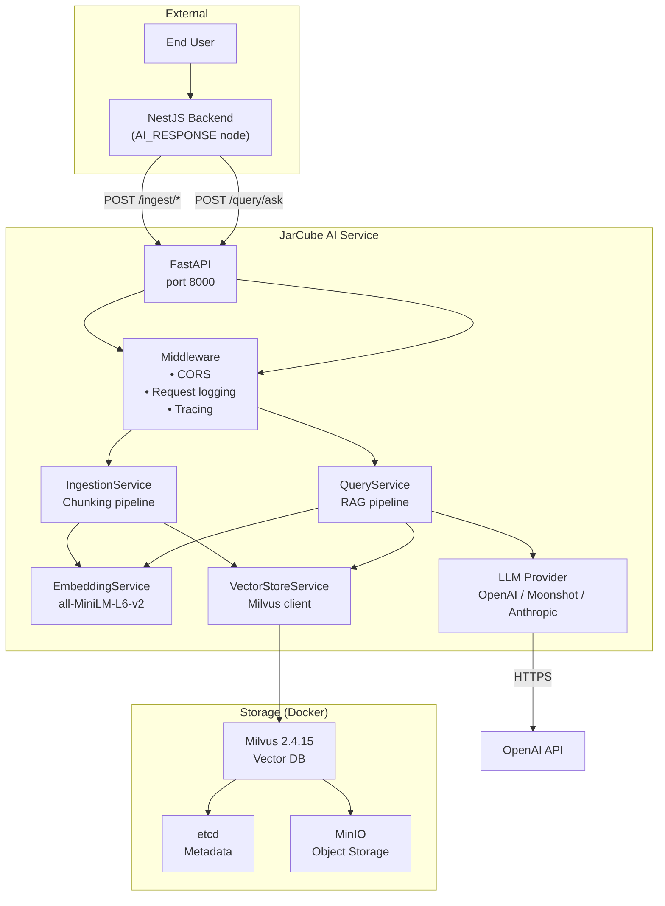
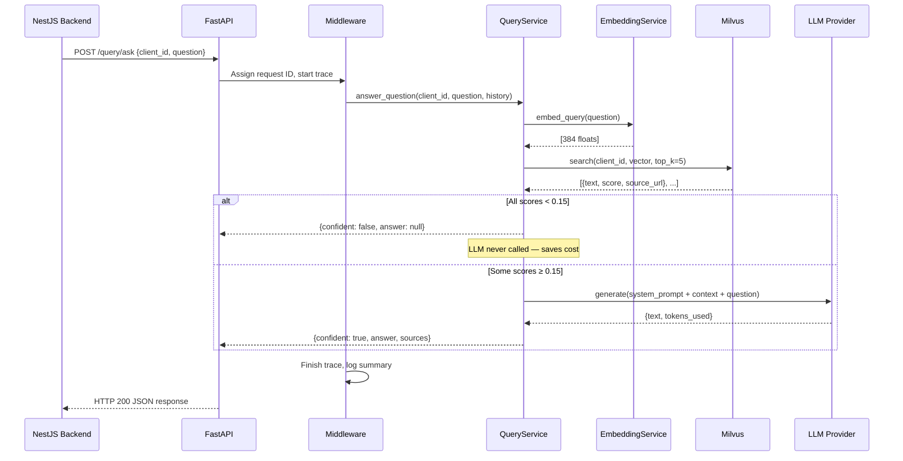
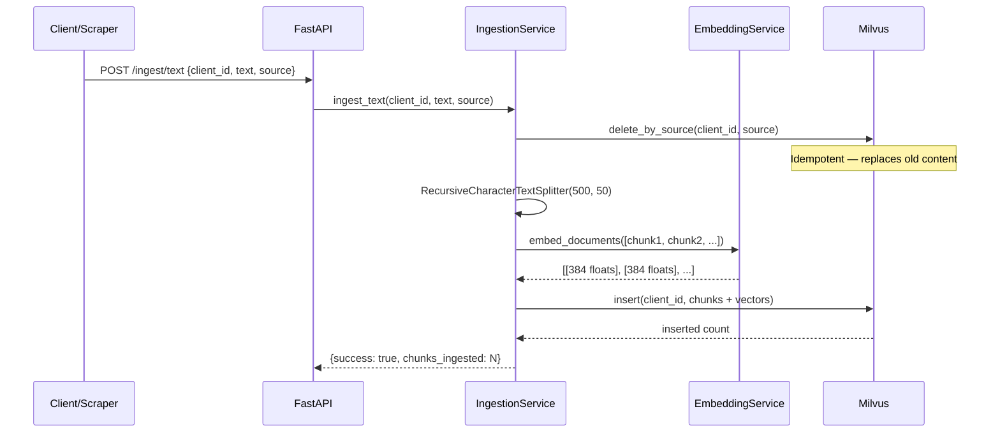
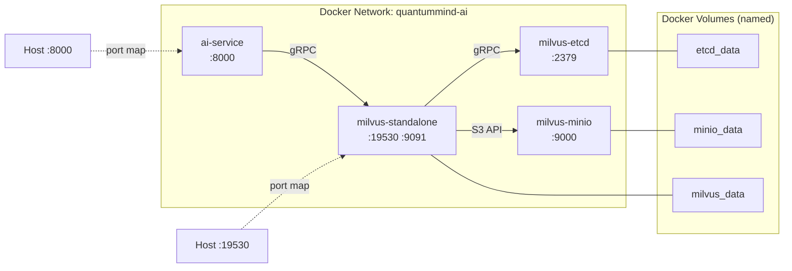
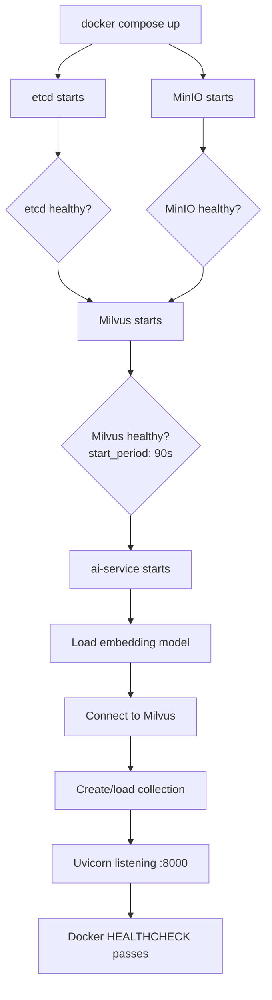
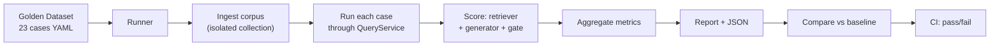
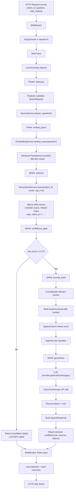

# ARCHITECT.md — System Architecture Document

> **Last updated:** 2026-08-01 (post Phase 0)
>
> **Audience:** A new engineer joining the team tomorrow should fully understand
> the system after reading only this file.
>
> **Companion files:**
> - `CLAUDE.md` — context primer for AI coding assistants
> - `PLAN.md` — improvement roadmap and task tracker
> - `docs/RESEARCH.md` — research papers behind each architectural decision

---

## Table of Contents

1. [Project Overview](#1-project-overview)
2. [High Level Architecture](#2-high-level-architecture)
3. [Repository Structure](#3-repository-structure)
4. [End-to-End Request Lifecycle](#4-end-to-end-request-lifecycle)
5. [Document Ingestion](#5-document-ingestion)
6. [Current RAG Pipeline](#6-current-rag-pipeline)
7. [Evaluation System](#7-evaluation-system)
8. [Package Decisions](#8-package-decisions)
9. [Architecture Decision Records](#9-architecture-decision-records)
10. [Configuration](#10-configuration)
11. [Logging & Observability](#11-logging--observability)
12. [Error Handling](#12-error-handling)
13. [Performance](#13-performance)
14. [Security](#14-security)
15. [Deployment](#15-deployment)
16. [Known Limitations](#16-known-limitations)
17. [Phase Roadmap](#17-phase-roadmap)
18. [Developer Guide](#18-developer-guide)
19. [FAQ](#19-faq)
20. [Glossary](#20-glossary)

---

## 1. Project Overview

### Business Problem

The JarCube chatbot platform serves multiple clients (tenants). Each client
has their own knowledge base — website content, FAQs, product info, policies.
End users ask questions and expect accurate, grounded answers specific to that
client's data — not generic LLM responses.

### Why This Project Exists

The NestJS backend orchestrates chatbot workflows. When a workflow reaches an
**AI_RESPONSE** node, it calls this service. This service exists as a
**standalone microservice** so that:

1. The AI/ML stack (Python, PyTorch, vector DB) stays independent of the Node.js backend
2. The embedding model and vector store can scale separately from the chat infrastructure
3. The RAG pipeline can be iterated on without touching the workflow engine

### Why RAG Was Selected

| Alternative | Why rejected |
|---|---|
| Fine-tuning per client | Expensive, slow to update, doesn't scale to many tenants |
| Long-context LLM (stuff everything in) | Token cost grows linearly with KB size; no tenant isolation |
| Traditional keyword search + LLM | Misses semantic meaning; poor on paraphrased questions |
| **RAG (chosen)** | Scales to many tenants, updatable in seconds, grounded in real data, cost-proportional to question count not KB size |

### System Goals

| Goal | How achieved |
|---|---|
| **Grounded answers** | Only answer from retrieved context; decline if nothing relevant |
| **Multi-tenancy** | Data isolated by `client_id` at the storage layer |
| **Cost efficiency** | Free local embeddings; LLM only called when confident |
| **Updatable** | Re-ingest a source and old content is atomically replaced |
| **Measurable** | Evaluation harness with regression gating in CI |

---

## 2. High Level Architecture

### Component Diagram



### Request Flow (Query)



### Document Ingestion Flow



### Docker Architecture



### Startup Sequence



### Evaluation Pipeline



---

## 3. Repository Structure

```
QuantumMind-ai/
├── app/                        # Application source code
│   ├── __init__.py
│   ├── main.py                 # FastAPI app entrypoint, middleware + router wiring
│   ├── config.py               # ALL configuration (Pydantic Settings, env-driven)
│   ├── schemas.py              # Request/response Pydantic models
│   ├── middleware.py           # Request logging, correlation IDs, tracing
│   ├── logging_utils.py        # Colored formatter, secret masking, banners
│   ├── tracing.py              # Per-stage spans: latency, tokens, cost (Phase 0)
│   ├── routers/                # HTTP endpoint definitions
│   │   ├── health.py           # GET / and GET /healthcheck
│   │   ├── ingest.py           # POST /ingest/{website,text,file,files}, DELETE
│   │   └── query.py            # POST /query/ask
│   ├── services/               # Business logic (no HTTP awareness)
│   │   ├── embeddings.py       # sentence-transformers wrapper + truncation guard
│   │   ├── ingestion.py        # Chunking + ingest orchestration
│   │   ├── query.py            # ⭐ RAG engine: retrieve → gate → prompt → generate
│   │   └── vector_store.py     # ALL Milvus access, tenant isolation, singleton
│   └── llm/                    # LLM provider abstraction
│       ├── base.py             # LLMProvider ABC + LLMResult dataclass
│       ├── factory.py          # Picks provider from config (lru_cache singleton)
│       ├── openai_provider.py  # OpenAI AND Moonshot (same SDK, different base_url)
│       └── anthropic_provider.py # Claude — system prompt → top-level arg
├── eval/                       # Evaluation harness (Phase 0)
│   ├── __init__.py
│   ├── runner.py               # CLI: ingests golden corpus, runs cases, scores, reports
│   ├── metrics.py              # 9 scoring functions (retriever + generator + gate)
│   ├── README.md               # Eval documentation
│   ├── golden/
│   │   └── dataset.yaml        # 23 evaluation cases across 5 documents
│   └── results/                # Generated: run JSONs, baseline, history
├── tests/                      # pytest suite
│   ├── test_query.py           # Unit tests (fake store + fake provider)
│   ├── test_e2e.py             # Integration (real Milvus, fake LLM)
│   ├── test_health.py          # Health endpoint
│   ├── test_ingestion.py       # Ingest pipeline
│   ├── test_vector_store.py    # Tenant isolation
│   ├── test_llm_factory.py     # Provider selection
│   ├── test_tracing.py         # Tracing layer (Phase 0)
│   └── test_eval_metrics.py    # Scoring functions (Phase 0)
├── .github/workflows/
│   └── eval.yml                # CI: unit tests + RAG quality gate
├── PLAN.md                     # Improvement roadmap + task tracker
├── CLAUDE.md                   # Context primer for AI assistants
├── ARCHITECT.md                # THIS FILE
├── docs/RESEARCH.md            # Research papers + reference implementations
├── Dockerfile                  # Python 3.11, CPU torch, pre-baked embedding model
├── docker-compose.yml          # 4-service stack (etcd + MinIO + Milvus + app)
├── Makefile                    # Common tasks: make eval, make test, make up
├── requirements.txt            # Production dependencies
├── requirements-dev.txt        # + pytest + pyyaml
├── .env.example                # Template for .env
└── .env                        # Real config (gitignored)
```

### Directory responsibilities

| Directory | Purpose | Key interactions |
|---|---|---|
| `app/routers/` | HTTP layer — validates input, calls services, formats output | Uses `schemas.py` for validation, delegates to `services/` |
| `app/services/` | Business logic — stateless functions operating on domain objects | Calls `embeddings.py` and `vector_store.py`; never touches HTTP |
| `app/llm/` | LLM abstraction — provider interface + implementations | Only `services/query.py` resolves a provider via `factory.py` |
| `eval/` | Quality measurement — independent of the runtime app | Imports `services/` directly (same code path as HTTP routes) |
| `tests/` | Correctness verification — unit + integration + e2e | Fakes for store and provider; integration needs running Milvus |

---

## 4. End-to-End Request Lifecycle

### Query: `POST /query/ask`



### Step-by-step detail

| # | Stage | Component | What happens | Time |
|---|-------|-----------|--------------|------|
| 1 | **Request arrival** | Uvicorn | TCP accept, HTTP parse, ASGI dispatch | <1ms |
| 2 | **Middleware** | `middleware.py` | Assign request ID, start trace, read body, log | <1ms |
| 3 | **Validation** | Pydantic | Validates JSON against `QueryRequest` schema | <1ms |
| 4 | **Embedding** | `embeddings.py` | Encode question → 384-dim normalized vector | 5-20ms |
| 5 | **Retrieval** | `vector_store.py` | Milvus ANN search with client_id filter | 10-50ms |
| 6 | **Confidence gate** | `query.py` | Filter hits by `min_similarity_score` threshold | <1ms |
| 7 | **Prompt build** | `query.py` | System template + context + history + question | <1ms |
| 8 | **Generation** | `llm/*.py` | API call to OpenAI/Anthropic | 1000-3000ms |
| 9 | **Response** | Router | Serialize `QueryResponse` to JSON | <1ms |
| 10 | **Trace finish** | `middleware.py` | Emit [TRACE] log line with all spans | <1ms |

**Total typical latency:** ~1.5-3.5s (dominated by the LLM call)

---

## 5. Document Ingestion

### Pipeline stages

| # | Stage | Why it exists |
|---|-------|---------------|
| 1 | **Parsing** | Extract plain text from PDFs (pypdf), DOCX (python-docx), or accept raw text |
| 2 | **Idempotent cleanup** | `delete_by_source(client_id, source)` — ensures re-ingesting replaces old chunks, never leaves stale duplicates |
| 3 | **Title prepend** (website only) | The page title is semantically important; prepending it ensures it gets embedded alongside the body |
| 4 | **Chunking** | `RecursiveCharacterTextSplitter(500, 50)` splits on `\n\n → \n → ". " → " " → ""` — natural boundaries first |
| 5 | **Embedding** | `all-MiniLM-L6-v2` encodes each chunk → 384-dim normalized vector |
| 6 | **Storage** | Milvus insert with `client_id` as partition key + metadata fields |
| 7 | **Flush** | Forces Milvus to persist segments to MinIO immediately |

### Chunking parameters

| Parameter | Value | Rationale |
|---|---|---|
| `chunk_size` | 500 chars | ~125 tokens for MiniLM (well under the 256-token limit) |
| `chunk_overlap` | 50 chars | Ensures sentences at split boundaries appear in both adjacent chunks |
| `separators` | `["\n\n", "\n", ". ", " ", ""]` | Splits on paragraph → line → sentence → word boundaries |

### Milvus collection schema

| Field | Type | Purpose |
|---|---|---|
| `pk` | INT64 (auto_id) | Primary key |
| `client_id` | VARCHAR(128), **partition key** | Physical tenant isolation |
| `bot_id` | VARCHAR(128) | Stored but not currently used for filtering |
| `source` | VARCHAR(1024) | Logical source name (for idempotent replace/delete) |
| `source_url` | VARCHAR(2048) | Original URL (website ingestion) |
| `source_type` | VARCHAR(64) | "website" / "manual" / "file" |
| `text` | VARCHAR(65535) | The chunk's plain text |
| `vector` | FLOAT_VECTOR(384) | The embedding |

**Index:** HNSW with COSINE metric, M=8, efConstruction=64

---

## 6. Current RAG Pipeline

The pipeline lives in `app/services/query.py` → `QueryService.answer_question()`.

### Components

| Component | Input | Output | Responsibility | Failure scenario |
|---|---|---|---|---|
| **EmbeddingService** | question string | 384-dim vector | Encode the question for similarity search | Model load failure → 500 on first request |
| **VectorStoreService.search()** | client_id, vector, top_k | list of {text, source_url, score} | Find nearest chunks scoped to tenant | Milvus down → connection error → 500 |
| **Confidence Gate** | list of hits, threshold | filtered list (or empty) | Decide: answer or decline | Threshold too high → false negatives; too low → hallucination |
| **Prompt Builder** | relevant chunks, history, question | messages list | Construct the LLM input | Context too large → token limit exceeded |
| **LLM Provider** | messages | LLMResult(text, tokens) | Generate grounded answer | API error / timeout → 500; quota exceeded → 429 |

### System prompt template

```
You are a helpful customer support assistant for {company}.
Answer using ONLY the context below from {company}'s knowledge base.
Rules:
- Be concise, friendly, accurate.
- If context lacks the answer, say so and offer to connect with a human.
- Never mention "the context" or "the documents".
Context:
{context chunks separated by ---}
```

### Key design decisions in the pipeline

1. **LLM resolved lazily** — `QueryService.provider` is a property. The fallback path (confident=false) works without any API key configured.
2. **History capped at 6 turns** — keeps prompts small and costs low.
3. **Confidence gate runs BEFORE the LLM** — no LLM call on ungrounded questions = cost savings + hallucination prevention.

---

## 7. Evaluation System

### Golden Dataset (`eval/golden/dataset.yaml`)

23 cases across 5 synthetic documents. Each case has:
- `id` — stable identifier, never renumber
- `question` — what we ask
- `chat_history` — optional prior turns
- `expect_confident` — should the pipeline answer or decline?
- `ground_truth` — reference answer
- `expected_sources` — which documents should be retrieved
- `expected_facts` — substrings the answer must contain
- `tags` — for slicing results

### Metrics (9 total, split by layer)

| Layer | Metric | What it measures | Range |
|---|---|---|---|
| Retriever | **Context Recall** | Did we retrieve the sources containing the answer? | 0-1 |
| Retriever | **Context Precision** | Were retrieved chunks actually relevant? | 0-1 |
| Generator | **Faithfulness** | Are the answer's claims supported by context? | 0-1 |
| Generator | **Answer Relevancy** | Does the answer address the question? | 0-1 |
| Generator | **Answer Correctness** | Token F1 against reference answer | 0-1 |
| Generator | **Fact Coverage** | Are required substrings present? | 0-1 |
| Gate | **Confidence Accuracy** | Correct answer/decline decisions | 0-1 |
| Gate | **False Negative Rate** | Wrongly declined (costly escalation) | 0-1 |
| Gate | **False Positive Rate** | Wrongly answered (hallucination risk) | 0-1 |

### Scoring modes

- **Deterministic** (default): No LLM judge. Free. Reproducible. Uses lexical overlap.
- **Judge**: Adds LLM-scored faithfulness and relevancy. Costs money.

### Regression testing

```bash
make eval-baseline    # establish the comparison point
# ... make changes ...
make eval-compare     # exit 1 if any metric regressed > tolerance
```

---

## 8. Package Decisions

| Package | Version | Why it exists | Why chosen | Alternatives considered |
|---|---|---|---|---|
| **fastapi** | 0.115.6 | Web framework | Auto OpenAPI/Swagger, native async, Pydantic validation | Flask (no auto-docs), Django (too heavy) |
| **uvicorn** | 0.34.0 | ASGI server | High performance, uvloop support, standard choice for FastAPI | gunicorn (WSGI), hypercorn |
| **pydantic** | 2.10.4 | Data validation | Type-safe request/response models, JSON Schema generation | marshmallow, attrs |
| **pydantic-settings** | 2.7.1 | Config from env | Reads .env + env vars with type coercion, integrates with pydantic | python-decouple, dynaconf |
| **pymilvus** | 2.4.9 | Vector DB client | Must match Milvus server version (2.4.15). Partition keys for multi-tenancy | qdrant-client, pinecone, weaviate |
| **sentence-transformers** | 3.3.1 | Local embeddings | Free, CPU-friendly, no API key. `all-MiniLM-L6-v2` is tiny (~90MB) | OpenAI embeddings (paid), fastembed |
| **langchain-text-splitters** | 0.3.4 | Text chunking | `RecursiveCharacterTextSplitter` with configurable separators | tiktoken + manual split, unstructured |
| **openai** | 1.59.6 | OpenAI + Moonshot SDK | Official SDK; `base_url` override makes Moonshot work free | litellm, httpx direct |
| **anthropic** | 0.42.0 | Claude SDK | Official; handles the system-prompt-as-arg API difference | litellm |
| **pypdf** | 5.1.0 | PDF text extraction | Pure Python, no system deps, handles most PDFs | pdfplumber, pymupdf (C deps) |
| **python-docx** | 1.1.2 | DOCX text extraction | Simple API, pure Python | docx2txt |
| **httpx** | 0.28.1 | HTTP client | Used by FastAPI TestClient and as transitive dep of OpenAI/Anthropic SDKs | requests (sync only) |
| **marshmallow** | ≥3.13,<4 | **Transitive only** | pymilvus → environs → marshmallow. The `<4` pin is load-bearing: v4 removed `__version_info__` | Cannot be removed |
| **pytest** | 8.3.4 | Test runner | Standard Python testing; dev-only | unittest (no fixtures) |
| **pyyaml** | 6.0.2 | YAML parsing | Reads the golden dataset; dev-only | tomllib (no YAML), ruamel.yaml |

### Key constraint: `marshmallow<4`

This pin exists because `pymilvus` depends on `environs` which reads `marshmallow.__version_info__` at import time. Marshmallow 4.x removed that attribute. **Removing this pin breaks the app on startup with an ImportError.** It stays until pymilvus drops the environs dependency.

---

## 9. Architecture Decision Records

| # | Decision | Context | Options | Trade-offs |
|---|---|---|---|---|
| **ADR-1** | Local CPU embeddings as default | Ingestion must work with no API key | Cloud embeddings (OpenAI), local GPU, local CPU | Lower quality (MTEB ~56) but zero cost and no external dependency |
| **ADR-2** | Eval harness before pipeline changes | Every change was unmeasurable | Ship improvements first, add eval later | "Later" never comes; now every PR is gated |
| **ADR-3** | Upgrade Milvus rather than add BM25 index | Need hybrid search (Phase 3) | Elasticsearch sidecar, standalone BM25, Milvus native | Milvus 2.5+ has native BM25+RRF — far less to operate |
| **ADR-4** | Single query rewrite, not multi-query | Fix multi-turn (Phase 1) | Fan-out to multiple rewrites | SemEval-2026 ablations showed fan-out can degrade performance |
| **ADR-5** | Local open reranker over hosted API | Phase 2 reranking | Cohere Rerank (hosted), bge-reranker (local) | Preserves zero-API-key retrieval path; +50-400ms latency |
| **ADR-6** | Docker-managed volumes for storage | MinIO O_DIRECT fails on bind mounts | Host bind mounts, Docker volumes | Data not visible in project dir but O_DIRECT works correctly |
| **ADR-7** | Confidence gate before LLM call | Save cost + prevent hallucination | Always call LLM, let it decide | Gate costs nothing; LLM calls cost tokens even when declining |
| **ADR-8** | Lazy LLM provider resolution | Fallback path must work with no key | Eager init at startup | `provider` property resolves on first use; fallback never touches it |

---

## 10. Configuration

All config lives in `app/config.py` → `Settings` class. Never read `os.environ` directly.

| Variable | Default | Required | Security | Description |
|---|---|---|---|---|
| `APP_ENV` | development | No | — | Controls auto-reload and debug logging |
| `HOST` | 0.0.0.0 | No | — | Bind address |
| `PORT` | 8000 | No | — | Bind port |
| `CORS_ORIGINS` | * | No | ⚠️ Tighten in prod | Comma-separated allowed origins |
| `LOG_LEVEL` | INFO | No | — | Python logging level |
| `AI_DEBUG_LOGS` | false | No | — | Verbose pipeline logs (prompts, responses) |
| `MILVUS_HOST` | localhost | No | — | Milvus hostname |
| `MILVUS_PORT` | 19530 | No | — | Milvus gRPC port |
| `MILVUS_COLLECTION` | quantummind_knowledge | No | — | Collection name |
| `EMBEDDING_MODEL` | sentence-transformers/all-MiniLM-L6-v2 | No | — | HuggingFace model ID |
| `EMBEDDING_MAX_TOKENS` | 256 | No | — | Warn threshold for truncation |
| `CHUNK_SIZE` | 500 | No | — | Characters per chunk |
| `CHUNK_OVERLAP` | 50 | No | — | Overlap between chunks |
| `RETRIEVAL_TOP_K` | 5 | No | — | Chunks retrieved per query |
| `MIN_SIMILARITY_SCORE` | 0.15 | No | — | Confidence gate threshold |
| `LLM_PROVIDER` | openai | No | — | openai / moonshot / anthropic |
| `LLM_MODEL` | gpt-4o-mini | No | — | Model name for the chosen provider |
| `LLM_TEMPERATURE` | 0.3 | No | — | Generation temperature |
| `LLM_MAX_TOKENS` | 512 | No | — | Max completion tokens |
| `OPENAI_API_KEY` | — | **Yes** (if provider=openai) | 🔑 Secret | Required for answer generation |
| `OPENAI_BASE_URL` | https://api.openai.com/v1 | No | — | Override for compatible APIs |
| `MOONSHOT_API_KEY` | — | If provider=moonshot | 🔑 Secret | Kimi K2 API key |
| `MOONSHOT_BASE_URL` | https://api.moonshot.cn/v1 | No | — | Moonshot endpoint |
| `ANTHROPIC_API_KEY` | — | If provider=anthropic | 🔑 Secret | Claude API key |
| `AI_TRACING` | true | No | — | Emit [TRACE] log lines per request |
| `EVAL_JUDGE_MODEL` | gpt-4o-mini | No | — | Model for LLM-as-judge scoring |

**Security note:** API keys are never logged — `logging_utils.py` has a sensitive-keys set that masks them automatically.

---

## 11. Logging & Observability

### Logging

- **Format:** `YYYY-MM-DD HH:MM:SS [LEVEL] [request-id] logger: message`
- **Colors:** INFO=blue, WARNING=yellow, ERROR=red, DEBUG=grey (auto-detected TTY)
- **Request ID:** injected into every log line via `contextvars`; propagated from `x-request-id` header or auto-generated as `ai-YYYYMMDD-<6hex>`
- **Secret masking:** API keys, tokens, passwords automatically masked in logged headers/bodies
- **Verbose mode:** `AI_DEBUG_LOGS=true` or `APP_ENV=development` enables prompts, raw responses, retrieval scores

### Tracing (Phase 0)

**Module:** `app/tracing.py`

One span per pipeline stage, collected into a trace per request. Each span records:
- `name` (retrieval, confidence_gate, prompt_build, generation, embed_query)
- `duration_ms`
- `attributes` (top_k, hit_count, scores, etc.)
- `prompt_tokens`, `completion_tokens`, `total_tokens`
- `cost_usd` (estimated from a built-in price table)
- `error` (if the span threw)

At request end, one `[TRACE]` JSON line is emitted:
```json
{"trace_id":"ai-20260730-a1b2c3","duration_ms":1847,"total_tokens":313,"total_cost_usd":0.00005,"spans":[...]}
```

### Health endpoints

| Endpoint | What it checks | Current limitation |
|---|---|---|
| `GET /` | Nothing (static response) | — |
| `GET /healthcheck` | Nothing (static 200) | ⚠️ Does NOT check Milvus connectivity (L19) |
| Docker HEALTHCHECK | Curls `/healthcheck` every 30s | Same limitation as above |

---

## 12. Error Handling

| Failure | Where it surfaces | What happens | User sees |
|---|---|---|---|
| Milvus unreachable | `VectorStoreService.__init__` | Connection error at startup or first use | 500 (app won't start or first query fails) |
| Milvus search timeout | `VectorStoreService.search()` | Exception propagates | 500 via router's catch-all |
| LLM API error (timeout, 429, 500) | `provider.generate()` | Exception logged + propagated | 500 |
| LLM API key missing/invalid | `provider.__init__()` (lazy) | `ValueError` on first confident query | 500 on first query that needs generation |
| No relevant context found | Confidence gate in `query.py` | Returns `confident: false` | 200 `{confident: false, answer: null}` — not an error |
| Answer truncated by max_tokens | `finish_reason == "length"` | Warning logged, partial answer returned | 200 but answer may be incomplete |
| File upload parse failure | `_extract_text_from_file()` | 400 or 500 depending on the error | 400 (empty text) or 500 (parse crash) |
| Chunk exceeds embedding token limit | `_warn_on_truncation()` | Warning logged, tail silently lost | Answer may be less accurate (no error) |
| Invalid `client_id` expression chars | `_escape()` in vector_store | Characters escaped before interpolation | No injection; normal operation |
| Pydantic validation failure | Router layer | FastAPI returns 422 with field errors | 422 Unprocessable Entity |

### Design principle

- **Routers** catch broad (`except Exception`), log with `logger.exception()`, re-raise as `HTTPException(500)`
- **Services** let exceptions propagate — they don't know about HTTP
- **Tracing** failures are swallowed — a metrics bug must never break a request

---

## 13. Performance

### Current latency profile (from baseline eval, p50)

| Stage | Time | Notes |
|---|---|---|
| Embedding (query) | ~10ms | Local CPU inference, 384-dim |
| Milvus search | ~30ms | HNSW with ef=64, small collection |
| LLM generation | ~1700ms | gpt-4o-mini, ~300 tokens in + ~100 out |
| **Total** | **~1800ms** | Dominated by the LLM network round-trip |

### Embedding performance

- **Model:** all-MiniLM-L6-v2 (~22M parameters, ~90MB)
- **Single query:** ~5-15ms on CPU
- **Batch (10 chunks):** ~30-60ms on CPU
- **Memory:** ~100MB resident after model load
- **First request:** ~3-5s (model load from disk, cached thereafter)

### Caching (current: none)

No caching exists today. Optimization opportunities:
- **Embedding cache:** same question text → same vector (hash lookup)
- **Semantic answer cache:** similar questions → cached answer (saves LLM call)
- **Model preload:** already done in Dockerfile (baked into image layer)

### Memory usage

| Component | Resident RAM |
|---|---|
| Embedding model | ~100MB |
| Python runtime + app | ~50MB |
| Milvus standalone | ~500MB-2GB (depends on loaded index size) |
| Total container stack | ~1-3GB |

---

## 14. Security

### Current state (⚠️ development-grade)

| Concern | Status | Risk |
|---|---|---|
| **Authentication** | ❌ None | Any caller can ingest/query any tenant |
| **CORS** | `*` (all origins) | Any website can call the API |
| **Rate limiting** | ❌ None | A single caller can exhaust LLM budget |
| **Input validation** | ✅ Pydantic | Malformed JSON rejected with 422 |
| **Secret handling** | ✅ Masked in logs | API keys never appear in log output |
| **Expression injection** | ✅ `_escape()` | Milvus boolean expressions are safe |
| **Prompt injection** | Partial | System prompt instructs "ONLY context"; no input sanitization |
| **File upload** | ⚠️ No size limit | Could accept arbitrarily large files |
| **PII** | ⚠️ None | User questions and KB content are stored as-is |
| **TLS** | ❌ Not configured | Uvicorn serves plain HTTP; expects a reverse proxy |

### Prompt injection mitigation

The system prompt says "Answer using ONLY the context provided" and "Do not invent details." This is a soft defense — a determined attacker could craft questions that override it. A harder defense (output validation against context) is planned for Phase 7.

### Secret management

`logging_utils.py` maintains a set of sensitive key names:
```python
_SENSITIVE_KEYS = {"authorization", "api_key", "openai_api_key", "password", "token", ...}
```
Any header or mapping key matching these is auto-masked to `sk-1...last4`.

---

## 15. Deployment

### Docker Compose (development/staging)

```bash
cp .env.example .env          # set OPENAI_API_KEY
docker compose up -d --build  # starts all 4 services
curl http://localhost:8000/healthcheck
```

### Service dependencies

```
ai-service ──depends_on(healthy)──► milvus ──depends_on──► etcd
                                           ──depends_on──► minio
```

### Volumes (Docker-managed named volumes)

| Volume | Contents | Why named, not bind mount |
|---|---|---|
| `etcd_data` | Milvus metadata | Consistency with Milvus + MinIO |
| `minio_data` | Vector data segments | MinIO O_DIRECT requires native filesystem (ADR-6) |
| `milvus_data` | RocksDB, memory-mapped indexes | Must be consistent with etcd + MinIO state |

**To delete all data:** `docker compose down -v`

### Networking

All 4 containers share Docker network `quantummind-ai`. The ai-service reaches Milvus via the compose service name `milvus` (overridden in the environment section). Host ports exposed: 8000 (API), 19530 (Milvus gRPC), 9091 (Milvus health/metrics).

### Production deployment notes (future)

- Add a reverse proxy (nginx/Caddy) for TLS
- Add authentication middleware
- Set `APP_ENV=production`, `AI_DEBUG_LOGS=false`
- Tighten `CORS_ORIGINS` to specific domains
- Consider Milvus cluster mode for HA
- Add resource limits to compose/k8s

---

## 16. Known Limitations

After Phase 0, these are the documented limitations:

| # | Limitation | Impact | Planned fix |
|---|---|---|---|
| L1 | Chat history never reaches retrieval | Multi-turn conversations fail | Phase 1 |
| L2 | No keyword search (BM25) | SKUs, error codes, exact terms can fail at scale | Phase 3 |
| L3 | No reranker | Context precision is only 0.588 | Phase 2 |
| L4 | Chunks lack document context | Ambiguous chunks retrieve incorrectly | Phase 4 |
| L5 | Embedding model truncates at ~256 tokens | Long chunks lose their tail silently (now warned) | Phase 5 |
| L18 | No authentication | Anyone can read/write any tenant's data | Phase 8 |
| L19 | Healthcheck doesn't verify Milvus | Docker says healthy when DB is down | Phase 8 |
| L14 | No streaming | 1-3s of nothing before the answer appears | Phase 6 |
| L22 | No conversation memory | Only caller-provided last 6 turns | Phase 7 |
| L16 | Structure-blind chunking | Tables, headings destroyed | Phase 6 |

---

## 17. Phase Roadmap

### ✅ Phase 0 — Instrument (COMPLETED)

**Delivered:**
- Evaluation harness with 23 golden cases and 9 metrics
- Baseline captured (Context Recall 0.895, Precision 0.588, Faithfulness 0.828)
- Per-request tracing (latency, tokens, cost per pipeline stage)
- CI quality gate (`.github/workflows/eval.yml`)
- Truncation guard on embeddings (warns, doesn't fix)
- Removed dead `embedding_dim` config
- Fixed README/test threshold mismatch
- Fixed MinIO O_DIRECT crash loop (Docker-managed volumes)
- Makefile with `make eval`, `make test`, etc.
- `LLMResult` enhanced with split token counts + finish_reason
- 107 tests passing (63 existing + 44 new)

### 🟦 Phase 1 — Query Rewriting (NEXT)

**Goal:** Fix L1 — the worst live defect. One cheap LLM call to turn context-dependent follow-ups into standalone queries.

**Plan:**
1. Add `_rewrite_query(question, chat_history)` in `services/query.py`
2. Feed rewritten query to retrieval; keep original in LLM messages
3. Skip when `chat_history` is empty (zero cost on first turn)
4. Fail open on rewrite error
5. Re-run eval; MT-01 and MT-04 should flip from failed to passed

**Expected impact:** multi_turn tag moves from 0.500 → ~1.000

### ⬜ Phase 2 — Reranking

Two-stage retrieval: top-50 → cross-encoder → top-5. Moves context precision.

### ⬜ Phase 3 — Hybrid Search

Upgrade Milvus to 2.5+, add native BM25 + RRF fusion.

### ⬜ Phase 4 — Contextual Chunk Enrichment

LLM-prepended document context at ingest time.

### ⬜ Phase 5 — Better Embeddings

Only if eval shows retrieval is still the bottleneck.

### ⬜ Phase 6 — Quality of Life

Structure-aware chunking, streaming, citations, caching.

### ⬜ Phase 7 — Advanced

Groundedness check, layered conversation memory.

### ⬜ Phase 8 — Production Hardening

Auth, CORS, rate limits, real healthcheck.

---

## 18. Developer Guide

### Initial setup

```bash
# 1. Clone and configure
git clone <repo>
cd QuantumMind-ai
cp .env.example .env
# Edit .env: set OPENAI_API_KEY=sk-...

# 2. Start the stack
docker compose up -d --build
# Wait for healthy (Milvus takes ~90s first time)
curl http://localhost:8000/healthcheck

# 3. Test
make test               # 107 tests, needs running Milvus
make eval               # 23 eval cases (needs API key for generation)
```

### Running locally (IDE/debugger)

```bash
# Start only storage
make up-storage         # etcd + MinIO + Milvus

# Run the app from your IDE with MILVUS_HOST=localhost
python -m app.main      # or use your IDE's run config
```

### Adding a new document source

1. Call `POST /ingest/text` with `client_id`, `text`, and a `source` name
2. Re-calling with the same `source` replaces old content (idempotent)
3. Or use `POST /ingest/file` to upload a PDF/DOCX

### Adding a new API endpoint

1. Create the route in `app/routers/`
2. Define request/response models in `app/schemas.py`
3. Implement business logic in `app/services/` (no HTTP awareness)
4. Register the router in `app/main.py`
5. Add tests in `tests/`

### Running the evaluation

```bash
make eval               # deterministic, no judge cost
make eval-baseline      # save as the comparison baseline
make eval-compare       # fail on regression
make eval-judge         # add LLM-as-judge (costs money)
make eval-multiturn     # only multi-turn cases
```

### Common mistakes

| Mistake | Consequence | Fix |
|---|---|---|
| Forget `--env-file .env` when running ad-hoc containers | MILVUS_HOST=localhost inside container → can't connect | Use the `Makefile` targets, or set `MILVUS_HOST=milvus-standalone` |
| Use `milvus` as MILVUS_HOST in a plain `docker run` | DNS fails (compose aliases don't resolve) | Use the *container name* `milvus-standalone` |
| Remove `marshmallow<4` pin | App crashes on import | The pin is load-bearing; see ADR in PLAN.md |
| Change embedding model without re-ingesting | Mixed vectors → silent quality degradation | Always re-ingest after model change |
| Run eval without `--keep-collection` and wonder where data went | Eval drops its isolated collection in teardown | That's intentional; use `--keep-collection` for debugging |

### Best practices

- All config through `app/config.py` — never `os.environ` in application code
- Services are stateless; singletons are at the dependency level (store, embeddings)
- Unit tests fake the store and LLM provider; no Milvus or API key needed
- Integration tests use a unique collection name and drop it in teardown
- Every pipeline change must show its impact via `make eval-compare`

---

## 19. FAQ

**Q: Do I need an API key to ingest documents?**
No. Embeddings run locally. An API key is only needed when the pipeline generates an answer (i.e., when a confident query reaches the LLM).

**Q: What happens if Milvus is down?**
The first query or ingest will fail with a 500. The `/healthcheck` endpoint will still return 200 (known limitation L19). Docker's health check catches this indirectly when the app container itself crashes.

**Q: Can I use a different LLM?**
Yes. Set `LLM_PROVIDER` and the corresponding API key. Moonshot (Kimi K2) uses the OpenAI SDK with a different `base_url`, so it's just config. Anthropic has its own provider implementation.

**Q: How do I test without spending money?**
Unit tests (`tests/test_query.py`) use a `FakeProvider` that returns a hardcoded answer. The eval harness in `deterministic` mode still needs an LLM for answer *generation*, but the scoring itself is free.

**Q: Why does the eval harness report MT-01 and MT-04 as failures?**
These are multi-turn cases where the question is a pronoun-only follow-up ("What about weekends?"). The pipeline embeds the literal question and retrieves nothing relevant. This is L1 — the confirmed worst defect, fixed in Phase 1.

**Q: Why are `volumes/` gone from the project directory?**
We migrated to Docker-managed named volumes (ADR-6). MinIO's O_DIRECT writes are incompatible with Docker Desktop's file-sharing layer. Data now lives in Docker's VM. Use `docker compose down -v` to reset.

**Q: How much does a query cost?**
With gpt-4o-mini: typically ~300 tokens ($0.000045 prompt) + ~100 tokens ($0.00006 completion) = ~$0.0001 per query. The tracing module estimates this automatically per request.

---

## 20. Glossary

| Term | Definition |
|---|---|
| **RAG** | Retrieval-Augmented Generation — retrieve relevant documents, then generate an answer grounded in them |
| **Embedding** | A fixed-length numeric vector representing the semantic meaning of text |
| **Vector store** | A database optimized for nearest-neighbor search on embedding vectors |
| **Milvus** | Open-source vector database used for storing and searching embeddings |
| **HNSW** | Hierarchical Navigable Small World — the approximate nearest-neighbor algorithm used by our Milvus index |
| **Cosine similarity** | Measures the angle between two vectors; higher = more similar (range -1 to 1 for normalized vectors) |
| **Chunk** | A segment of text split from a larger document for embedding and retrieval |
| **Confidence gate** | The decision point that determines whether to call the LLM or decline |
| **Tenant** | A client identified by `client_id` whose data is isolated from all others |
| **Partition key** | Milvus feature that physically groups rows by a field value (our `client_id`) |
| **Cross-encoder** | A model that scores a query-document pair jointly (more accurate than bi-encoder, but slower) |
| **Bi-encoder** | A model that embeds query and document separately (fast, less accurate) — what we use today |
| **BM25** | Best Matching 25 — a classic keyword relevance algorithm based on term frequency |
| **RRF** | Reciprocal Rank Fusion — merges results from multiple retrieval methods by rank position |
| **Reranker** | A second-pass model that re-scores initial retrieval results for better precision |
| **RAGAS** | Retrieval Augmented Generation Assessment — a framework defining evaluation metrics for RAG |
| **Context recall** | Fraction of expected sources that were actually retrieved |
| **Context precision** | Fraction of retrieved chunks that were actually relevant |
| **Faithfulness** | Whether the answer's claims are supported by the retrieved context |
| **Golden dataset** | A curated set of questions with known-correct answers and expected sources |
| **Deterministic mode** | Evaluation without LLM-as-judge — lexical scoring only, reproducible, free |
| **Judge mode** | Evaluation with LLM scoring faithfulness and relevancy — more accurate, costs money |
| **Compaction** | Summarizing older conversation turns to fit the context window (lossy) |
| **Contextual retrieval** | Anthropic's technique of prepending document context to each chunk before embedding |

---

*End of ARCHITECT.md*
