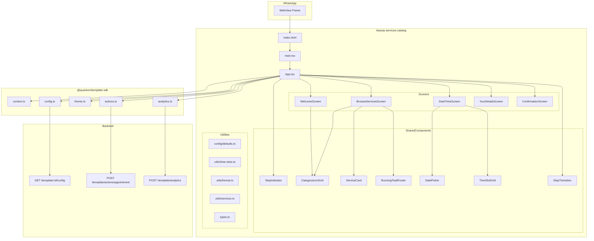
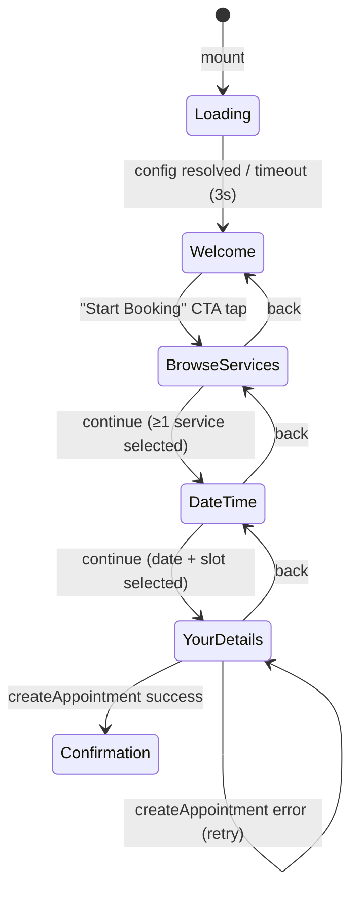

# Design Document: Beauty Services Catalog

## Overview

The Beauty Services Catalog is a 5-step animated stepper form for WhatsApp WebView that provides a category-first beauty service browsing and booking experience. Built with React + Vite, it integrates with `@quantum/template-sdk` and follows the established monorepo conventions while being visually distinct from the salon-booking-template.

The 5-step flow is: **Welcome → Browse Services → Date & Time → Your Details → Confirmation**.

### Key Design Decisions

1. **Single App.tsx with step state** — No routing. A `step` state variable drives the entire flow, matching the `doctor-appointment` and `salon-booking-template` patterns. This keeps the bundle lean and avoids router overhead in a WebView context.

2. **Animated stepper with visible step-indicator** — A segmented progress bar with animated fill replaces the minimal dot-based indicator used in salon-booking-template. CSS `transform` + `opacity` transitions (250–400ms) provide smooth slide/fade between steps.

3. **Category-first browsing with circular icon grid** — Instead of horizontal tab switching, categories render as circular icons in a 2×3 grid. This is the primary visual differentiator from salon-booking-template.

4. **Service cards with Add/Remove toggle** — Rectangular card components with explicit toggle buttons replace list-item selection, providing clearer affordance for multi-service selection.

5. **Persistent Running Total Footer** — During Browse Services, a fixed footer shows cumulative price and count, replacing the generic back/continue footer pattern.

6. **2-column time slot grid** — A CSS grid with `grid-template-columns: repeat(2, 1fr)` instead of the flexible wrap grid or horizontal scroll patterns used in other templates.

7. **Horizontal date picker with day/date pills** — Horizontally scrollable date elements showing day abbreviation + date number, similar to salon-booking but implemented independently.

8. **Config-driven with Demo Mode** — All business data lives in JSON config. Falls back to hardcoded defaults when backend is unreachable.

9. **Mobile-first 375px primary target** — All layouts optimized for 375px with max-width 480px on larger viewports.

10. **Bundle < 200 KB gzipped** — No external UI libraries. Pure CSS with custom properties from the SDK theme system.


---

## Architecture




### Step State Machine



### Directory Structure

```
templates/beauty-services-catalog/
├── index.html
├── manifest.json
├── package.json
├── tsconfig.json
├── vite.config.ts
└── src/
    ├── main.tsx                    # React mount + SDK init
    ├── App.tsx                     # Root component + step state + transitions
    ├── types.ts                    # Shared TypeScript interfaces
    ├── config/
    │   └── defaults.ts            # Default config values for Demo Mode
    ├── components/
    │   ├── StepIndicator.tsx      # Segmented animated progress bar
    │   ├── StepTransition.tsx     # Slide/fade wrapper component
    │   ├── CategoryIconGrid.tsx   # Circular icon grid (2×3 max)
    │   ├── ServiceCard.tsx        # Card with Add/Remove toggle
    │   ├── RunningTotalFooter.tsx # Fixed footer with count + total
    │   ├── DatePicker.tsx         # Horizontal scrollable day pills
    │   ├── TimeSlotGrid.tsx       # 2-column time slot buttons
    │   ├── WelcomeScreen.tsx      # Step 1
    │   ├── BrowseServicesScreen.tsx # Step 2
    │   ├── DateTimeScreen.tsx     # Step 3
    │   ├── YourDetailsScreen.tsx  # Step 4
    │   └── ConfirmationScreen.tsx # Step 5
    ├── utils/
    │   ├── time-slots.ts          # Compute available slots from working_hours
    │   ├── format.ts              # Currency + date formatting with Intl APIs
    │   ├── services.ts            # Filter, truncate, compute totals
    │   └── direction.ts           # RTL/LTR detection
    └── styles.css                 # All styles using CSS custom properties
```


---

## Components and Interfaces

### App (Root Component)

The root component manages global state, step transitions, and animation direction. It follows the single-component architecture pattern established by existing templates.

```typescript
type BeautyStep = 'welcome' | 'browse_services' | 'date_time' | 'your_details' | 'confirmation';

type TransitionDirection = 'forward' | 'backward';

interface AppState {
  step: BeautyStep;
  direction: TransitionDirection;
  config: BeautyConfig;
  loading: boolean;
  selectedServices: Service[];
  selectedCategory: string;       // category ID
  selectedDate: string;           // ISO YYYY-MM-DD
  selectedSlot: string;           // e.g. "10:30 AM"
  customerName: string;
  customerPhone: string;
  customerNotes: string;
  submitting: boolean;
  error: string;
}
```

### StepIndicator

A segmented horizontal progress bar fixed at the top of the viewport. Each segment fills with an animated transition (≥300ms) as the user progresses.

```typescript
interface StepIndicatorProps {
  currentStep: BeautyStep;
  steps: { key: BeautyStep; label: string }[];
}

// Visual states per segment:
// - 'completed': filled background, checkmark icon
// - 'active': primary color highlight with subtle scale/glow
// - 'upcoming': muted/outlined, no fill
```

### StepTransition

A wrapper component that applies CSS slide/fade animations based on navigation direction.

```typescript
interface StepTransitionProps {
  direction: TransitionDirection;
  stepKey: string;              // triggers re-animation on change
  children: React.ReactNode;
}

// CSS implementation:
// Forward:  transform: translateX(100%) → translateX(0), opacity: 0 → 1 (300ms)
// Backward: transform: translateX(-100%) → translateX(0), opacity: 0 → 1 (300ms)
// Uses will-change: transform, opacity for GPU acceleration
```


### CategoryIconGrid

A reusable circular icon grid used on both Welcome and Browse Services screens. Renders categories as tappable circular elements in a 2×3 grid layout.

```typescript
interface CategoryIconGridProps {
  categories: Category[];
  selectedId?: string;
  maxVisible?: number;           // default 6
  onSelect?: (categoryId: string) => void;
  ariaLabel?: string;
}

// Layout: CSS grid with grid-template-columns: repeat(3, 1fr)
// Each icon: min 56px diameter circle, category image/emoji, name label below
// Selected state: primary color border ring + subtle scale(1.05)
```

### ServiceCard

A rectangular card component displaying service details with an Add/Remove toggle button.

```typescript
interface ServiceCardProps {
  service: Service;
  isSelected: boolean;
  currency: string;
  locale: string;
  onToggle: (service: Service) => void;
}

// Card layout:
// - Service name (truncated at 50 chars with ellipsis)
// - Duration in minutes
// - Price formatted with currency
// - Add/Remove button (primary color for Add, muted/danger for Remove)
```

### RunningTotalFooter

A fixed-position footer visible only during Browse Services step, showing selection count and cumulative price.

```typescript
interface RunningTotalFooterProps {
  selectedCount: number;
  totalPrice: number;
  currency: string;
  locale: string;
  canContinue: boolean;
  continueLabel: string;
  onContinue: () => void;
}

// Layout: fixed bottom, full width
// Left: "{count} services · {formattedTotal}"
// Right: Continue button (disabled when count === 0)
// Update animation: brief scale pulse on number change
```


### DatePicker

A horizontal scrollable row of date "pills" showing day abbreviation and date number.

```typescript
interface DatePickerProps {
  days: number;                  // from config advance_booking_days
  selectedDate: string;          // ISO YYYY-MM-DD
  locale: string;
  onSelect: (date: string) => void;
}

// Each pill: day abbreviation (Mon, Tue...) + date number
// Selected pill: primary color background, white text
// Auto-scrolls to today on mount
// Horizontal scroll with overflow-x: auto, no scrollbar visible
```

### TimeSlotGrid

A 2-column grid of tappable time slot buttons.

```typescript
interface TimeSlotGridProps {
  slots: string[];
  selectedSlot: string;
  onSelect: (slot: string) => void;
}

// Layout: CSS grid with grid-template-columns: repeat(2, 1fr), gap: 8px
// Each button: time string in locale format
// Selected: primary color background, contrasting text
// Empty state: "No availability" message replaces grid
```

### Screen Components

Each screen receives props from App and dispatches callbacks:

| Component | Key Props | Emits |
|-----------|-----------|-------|
| WelcomeScreen | config, categories | onStart() |
| BrowseServicesScreen | config, locale, categories, services, selectedServices, selectedCategory | onCategorySelect(id), onServiceToggle(service), onContinue() |
| DateTimeScreen | config, locale, selectedDate, selectedSlot | onDateChange(date), onSlotChange(slot), onContinue() |
| YourDetailsScreen | config, locale, selectedServices, date, slot, name, phone, notes, submitting, error | onNameChange, onPhoneChange, onNotesChange, onConfirm() |
| ConfirmationScreen | config, locale, selectedServices, date, slot | onClose() |


### Utility Modules

**time-slots.ts** — Pure function for computing bookable time slots:

```typescript
function computeTimeSlots(
  date: string,                    // ISO YYYY-MM-DD
  workingHours: WorkingHours,
  intervalMinutes: number,         // default 30
  excludePastSlots: boolean        // true when date === today
): string[];
```

**format.ts** — Locale-aware formatting:

```typescript
function formatCurrency(amount: number, currency: string, locale: string): string;
function formatDate(isoDate: string, locale: string): string;
```

**services.ts** — Service logic utilities:

```typescript
function filterByCategory(services: Service[], categoryId: string): Service[];
function truncateName(name: string, maxLength?: number): string;  // default 50
function computeTotalPrice(services: Service[]): number;
function isSelectionValid(services: Service[]): boolean;  // ≥1 selected
```

**direction.ts** — RTL/LTR detection:

```typescript
const RTL_LANGUAGES = ['ar', 'he', 'fa', 'ur'] as const;
function resolveDirection(lang: string): 'rtl' | 'ltr';
```

---

## Data Models

### BeautyConfig (Full Config Shape)

```typescript
interface BeautyConfig {
  // Branding
  business_name: string;
  business_logo: string;
  hero_image: string;
  hero_title: string;
  hero_subtitle: string;

  // Theme
  primary_color: string;
  secondary_color: string;
  accent_color: string;
  text_color: string;
  background_color: string;
  font_family: string;
  dark_mode: boolean;

  // Categories & Services
  categories: Category[];
  services: Service[];

  // Scheduling
  working_hours: WorkingHours;
  time_slot_interval: number;       // minutes, default 30
  advance_booking_days: number;     // default 14

  // Messages & labels
  success_message: string;
  success_cta_text: string;
  currency: string;
  labels: Labels;
}
```


### Supporting Types

```typescript
interface Category {
  id: string;
  name: string;
  icon: string;              // URL or emoji
  color?: string;            // optional accent color
}

interface Service {
  id: string;
  categoryId: string;
  name: string;
  duration: number;          // minutes
  price: number;
  image?: string;
  description?: string;
}

interface WorkingHours {
  monday?: { open: string; close: string } | null;
  tuesday?: { open: string; close: string } | null;
  wednesday?: { open: string; close: string } | null;
  thursday?: { open: string; close: string } | null;
  friday?: { open: string; close: string } | null;
  saturday?: { open: string; close: string } | null;
  sunday?: { open: string; close: string } | null;
}

interface Labels {
  start_booking: string;
  browse_services: string;
  select_date_time: string;
  your_details: string;
  confirmation: string;
  back: string;
  continue: string;
  add: string;
  remove: string;
  full_name: string;
  phone_number: string;
  notes: string;
  confirm_booking: string;
  no_services: string;
  no_availability: string;
  booking_error: string;
  services_selected: string;    // template: "{count} services"
  total: string;
  retry: string;
  select_different_date: string;
  [key: string]: string;
}
```

### BookingPayload (Submitted to Backend)

```typescript
interface BookingPayload {
  services: { id: string; name: string; price: number; duration: number }[];
  date: string;              // ISO YYYY-MM-DD
  slot: string;              // e.g. "10:30 AM"
  name: string;
  phone: string;
  notes?: string;
  totalPrice: number;
}
```


### Context (From SDK)

Uses `TemplateContext` from `@quantum/template-sdk`:

```typescript
interface TemplateContext {
  visitorId?: string;
  phone?: string;
  name?: string;
  botId?: string;
  conversationId?: string;
  platform?: string;
  templateId?: string;
  leadId?: string;
  lang: string;
  extra: Record<string, string>;
}
```

---

## CSS Architecture and Animations

### Theme Variables

All visual styling uses CSS custom properties set by the SDK `applyTheme` function:

```css
:root {
  --qt-primary: #E91E63;       /* default pink accent */
  --qt-secondary: #9C27B0;    /* default purple */
  --qt-text: #1A1A2E;
  --qt-bg: #FAFAFA;
  --qt-font: system-ui, -apple-system, sans-serif;
  
  /* Template-specific tokens derived from SDK tokens */
  --bsc-step-fill: var(--qt-primary);
  --bsc-card-shadow: 0 2px 8px rgba(0,0,0,0.08);
  --bsc-transition-duration: 300ms;
  --bsc-footer-height: 64px;
}

[data-theme="dark"] {
  --qt-text: #F0F0F0;
  --qt-bg: #1A1A2E;
  --bsc-card-shadow: 0 2px 8px rgba(0,0,0,0.3);
}
```


### Step Transition Animations

```css
/* Forward: slide left + fade in */
.step-enter-forward {
  transform: translateX(30%);
  opacity: 0;
}
.step-enter-forward-active {
  transform: translateX(0);
  opacity: 1;
  transition: transform var(--bsc-transition-duration) ease-out,
              opacity var(--bsc-transition-duration) ease-out;
}

/* Backward: slide right + fade in */
.step-enter-backward {
  transform: translateX(-30%);
  opacity: 0;
}
.step-enter-backward-active {
  transform: translateX(0);
  opacity: 1;
  transition: transform var(--bsc-transition-duration) ease-out,
              opacity var(--bsc-transition-duration) ease-out;
}

/* Exit animations */
.step-exit-forward {
  transform: translateX(0);
  opacity: 1;
}
.step-exit-forward-active {
  transform: translateX(-30%);
  opacity: 0;
  transition: transform var(--bsc-transition-duration) ease-out,
              opacity var(--bsc-transition-duration) ease-out;
}

.step-exit-backward {
  transform: translateX(0);
  opacity: 1;
}
.step-exit-backward-active {
  transform: translateX(30%);
  opacity: 0;
  transition: transform var(--bsc-transition-duration) ease-out,
              opacity var(--bsc-transition-duration) ease-out;
}
```

### Step Indicator Animation

```css
.step-indicator__segment {
  flex: 1;
  height: 4px;
  border-radius: 2px;
  background: var(--qt-bg);
  position: relative;
  overflow: hidden;
}

.step-indicator__fill {
  position: absolute;
  inset: 0;
  background: var(--bsc-step-fill);
  transform: scaleX(0);
  transform-origin: left;
  transition: transform 350ms cubic-bezier(0.4, 0, 0.2, 1);
}

.step-indicator__segment--completed .step-indicator__fill {
  transform: scaleX(1);
}

.step-indicator__segment--active .step-indicator__fill {
  transform: scaleX(1);
  box-shadow: 0 0 8px var(--qt-primary);
}
```

### Running Total Footer Animation

```css
.running-total__value {
  transition: transform 150ms ease;
}

.running-total__value--pulse {
  animation: total-pulse 200ms ease;
}

@keyframes total-pulse {
  50% { transform: scale(1.1); }
}
```


---

## Visual Differentiation from Salon Booking Template

| Aspect | Salon Booking Template | Beauty Services Catalog |
|--------|----------------------|------------------------|
| Progress indicator | Minimal dot-based step tracker in header | Segmented animated bar with fill transitions fixed at top |
| Category browsing | Horizontal tab switcher | Circular icon grid (2×3 layout) |
| Service selection | List items with checkmarks | Rectangular cards with Add/Remove toggle buttons |
| Footer (services step) | Generic back/continue buttons | Persistent Running Total with count + price |
| Step transitions | Immediate screen swap (no animation) | CSS slide/fade (transform + opacity, 300ms) |
| Time slot layout | Flexible wrap grid | Strict 2-column grid |
| Welcome screen | Text hero with single CTA | Hero banner + circular category preview grid + CTA |
| Color palette default | Purple (#7A5CFF) / Pink (#FF6BA8) | Pink (#E91E63) / Purple (#9C27B0) |

---

## Error Handling

### Error Categories

| Category | Trigger | Behavior |
|----------|---------|----------|
| Config fetch failure | Network error, timeout (>3s), invalid template ID | Fall back to Demo Mode defaults; render fully navigable template |
| Context parse failure | Malformed URL query params, missing getContext response | Use defaults: lang="en", empty name, empty phone |
| Booking submission failure | createAppointment API returns error or network timeout | Show inline error on Your Details screen, preserve form data, offer retry |
| Analytics failure | track/trackView call rejects or network unreachable | Silently discard; never block UI flow |
| Theme application failure | applyTheme throws | Fall back to light mode with CSS variable defaults |

### Error Handling Strategy

1. **Config Loading (Demo Mode Fallback)**
   - `loadConfig` is wrapped with a 3-second timeout using `Promise.race`
   - On timeout or rejection, the template renders using `config/defaults.ts` values
   - Skeleton loading state shows for at most 3 seconds before transitioning to Welcome
   - No error UI displayed — the template is fully functional in Demo Mode

2. **Booking Submission (Recoverable Error)**
   - On `createAppointment` failure: re-enable confirm button, hide loading spinner, display inline error message from `labels.booking_error`
   - All form data (name, phone, notes) and selections remain preserved
   - The confirm button uses a `submitting` guard to prevent duplicate submissions
   - A `track('error', { endpoint, message })` event fires for observability

3. **Analytics (Fire-and-Forget)**
   - All `track()` calls are wrapped in try/catch — errors never propagate
   - Failed analytics events are silently discarded without retry
   - Analytics failures never affect user-facing flow or navigation

4. **Context (Graceful Degradation)**
   - If `getContext` throws, default context is used: `{ lang: 'en', name: '', phone: '' }`
   - Template renders in LTR English mode with empty pre-fill fields


---

## Correctness Properties

*A property is a characteristic or behavior that should hold true across all valid executions of a system — essentially, a formal statement about what the system should do. Properties serve as the bridge between human-readable specifications and machine-verifiable correctness guarantees.*

### Property 1: Config merging produces complete configuration

*For any* partial config object containing an arbitrary subset of valid BeautyConfig keys, merging it with the full defaults object SHALL produce a result where every key defined in the defaults resolves to either the fetched value (when present and non-null in partial config) or the default value (when absent), and no key is ever undefined.

**Validates: Requirements 2.5, 2.6**

### Property 2: RTL direction determination

*For any* language code string, the direction resolver SHALL return `"rtl"` if and only if the code is one of `["ar", "he", "fa", "ur"]`, and SHALL return `"ltr"` for all other non-empty strings and for empty/undefined input (which defaults to `"en"`).

**Validates: Requirements 12.2, 12.3**

### Property 3: Service filtering by category

*For any* list of services and any selected category ID, the filtered result SHALL contain only services whose `categoryId` field matches the selected category ID, and SHALL contain every service from the original list that matches that category (no false exclusions).

**Validates: Requirements 5.2**

### Property 4: Service name truncation

*For any* service name string, the truncation function SHALL return the original string unchanged when its length is at most 50 characters, and SHALL return a string of at most 53 characters (50 visible characters plus an ellipsis "…") when the original exceeds 50 characters, and the truncated result SHALL be a prefix of the original.

**Validates: Requirements 5.3**


### Property 5: Running total invariant

*For any* array of selected services with numeric prices, the computed total SHALL equal the arithmetic sum of all service prices rounded to 2 decimal places, and the displayed count SHALL equal the length of the selected services array.

**Validates: Requirements 5.7, 10.1, 10.3**

### Property 6: Time slot computation

*For any* valid working hours definition (open time strictly before close time, both in HH:MM format) and time slot interval (15, 30, 45, or 60 minutes), the computed slots SHALL satisfy: (a) every slot's start time is at or after the open time, (b) every slot's end time (start + interval) is at or before the close time, (c) slots are sorted in ascending time order with uniform spacing equal to the interval, and (d) when the date is today, no slot with a start time before the current local time is included.

**Validates: Requirements 6.4, 6.5**

### Property 7: Step forward navigation guard

*For any* step in the flow and any combination of user selections, the forward navigation control SHALL be enabled if and only if the step's required conditions are met: Browse Services requires at least 1 selected service, Date & Time requires both a date and a time slot selected, and Your Details requires both name and phone fields containing at least 1 non-whitespace character.

**Validates: Requirements 5.8, 5.9, 6.9, 7.6, 9.3**

### Property 8: Form validation for booking confirmation

*For any* pair of name and phone strings, the confirm button SHALL be enabled if and only if both strings contain at least 1 non-whitespace character. Strings that are empty or contain only whitespace characters SHALL result in the button being disabled.

**Validates: Requirements 7.6**


### Property 9: Currency formatting produces 2 decimal places

*For any* finite numeric amount, valid locale string, and valid ISO 4217 currency code, the `formatCurrency` function SHALL produce a string containing exactly 2 fractional digits in the numeric portion of the output.

**Validates: Requirements 12.4**

### Property 10: Date formatting produces non-empty locale string

*For any* valid ISO date string (YYYY-MM-DD format where the date represents a real calendar date) and any valid locale string, the `formatDate` function SHALL produce a non-empty string that differs from the raw ISO input.

**Validates: Requirements 12.5**

### Property 11: Category grid count constraint

*For any* categories array, the CategoryIconGrid component SHALL render at most `maxVisible` items (default 6). When the array length exceeds `maxVisible`, exactly `maxVisible` items are rendered. When the array length is less than or equal to `maxVisible`, exactly `array.length` items are rendered with no placeholder elements.

**Validates: Requirements 4.3, 4.4, 4.5**

### Property 12: Cross-category selection persistence

*For any* sequence of service selections across multiple categories followed by category switches, all previously selected services SHALL remain in the selection set regardless of which category is currently active. The selection set SHALL only change when the user explicitly adds or removes a service.

**Validates: Requirements 5.6**


---

## Testing Strategy

### Testing Approach

This template uses a **dual testing approach**:
- **Unit tests** for specific examples, edge cases, error conditions, and component rendering
- **Property-based tests** for universal properties of pure utility functions and logic

### Technology Stack

- **Test Runner**: Vitest (established in monorepo with Vite)
- **Component Testing**: React Testing Library
- **Property-Based Testing**: fast-check (TypeScript PBT library for Vitest)
- **Minimum PBT iterations**: 100 per property test

### Test Organization

```
templates/beauty-services-catalog/
└── src/
    └── __tests__/
        ├── setup.ts
        ├── utils/
        │   ├── time-slots.property.test.ts   # PBT: Property 6
        │   ├── format.property.test.ts       # PBT: Properties 9, 10
        │   ├── services.property.test.ts     # PBT: Properties 3, 4, 5
        │   ├── direction.property.test.ts    # PBT: Property 2
        │   └── config.property.test.ts       # PBT: Property 1
        ├── logic/
        │   ├── navigation.property.test.ts   # PBT: Property 7
        │   ├── validation.property.test.ts   # PBT: Property 8
        │   ├── category-grid.property.test.ts # PBT: Property 11
        │   └── selection.property.test.ts    # PBT: Property 12
        ├── components/
        │   ├── WelcomeScreen.test.tsx
        │   ├── BrowseServicesScreen.test.tsx
        │   ├── DateTimeScreen.test.tsx
        │   ├── YourDetailsScreen.test.tsx
        │   ├── ConfirmationScreen.test.tsx
        │   ├── StepIndicator.test.tsx
        │   └── StepTransition.test.tsx
        └── integration/
            ├── booking-flow.test.tsx          # Full step navigation
            ├── analytics.test.tsx            # Event tracking
            └── demo-mode.test.tsx            # Offline fallback
```


### Property-Based Tests

Each correctness property is implemented as a property-based test with minimum 100 iterations:

| Property | Test File | Tag |
|----------|-----------|-----|
| Property 1: Config merging | `config.property.test.ts` | Feature: beauty-services-catalog, Property 1: Config merging produces complete configuration |
| Property 2: RTL direction | `direction.property.test.ts` | Feature: beauty-services-catalog, Property 2: RTL direction determination |
| Property 3: Service filtering | `services.property.test.ts` | Feature: beauty-services-catalog, Property 3: Service filtering by category |
| Property 4: Name truncation | `services.property.test.ts` | Feature: beauty-services-catalog, Property 4: Service name truncation |
| Property 5: Running total | `services.property.test.ts` | Feature: beauty-services-catalog, Property 5: Running total invariant |
| Property 6: Time slots | `time-slots.property.test.ts` | Feature: beauty-services-catalog, Property 6: Time slot computation |
| Property 7: Step forward guard | `navigation.property.test.ts` | Feature: beauty-services-catalog, Property 7: Step forward navigation guard |
| Property 8: Form validation | `validation.property.test.ts` | Feature: beauty-services-catalog, Property 8: Form validation for booking confirmation |
| Property 9: Currency format | `format.property.test.ts` | Feature: beauty-services-catalog, Property 9: Currency formatting produces 2 decimal places |
| Property 10: Date format | `format.property.test.ts` | Feature: beauty-services-catalog, Property 10: Date formatting produces non-empty locale string |
| Property 11: Category grid count | `category-grid.property.test.ts` | Feature: beauty-services-catalog, Property 11: Category grid count constraint |
| Property 12: Cross-category persistence | `selection.property.test.ts` | Feature: beauty-services-catalog, Property 12: Cross-category selection persistence |

### Unit Tests (Example-Based)

Unit tests cover:
- **Component rendering**: Each screen renders with various config combinations
- **Step transitions**: Correct animation classes applied for forward/backward
- **Error states**: Failed API calls, timeout fallbacks, Demo Mode activation
- **Edge cases**: Empty categories, closed days, all slots past, empty services
- **Accessibility**: Semantic HTML, ARIA attributes, keyboard navigation, focus indicators
- **Analytics events**: Correct events fire once per trigger with expected payloads
- **Visual differentiation**: Animated step indicator, circular grids, card components present

### Integration Tests

Integration tests cover:
- **Full booking flow**: Navigate Welcome → Browse → Date & Time → Details → Confirmation
- **Back navigation + state preservation**: Selections persist through back/forward navigation
- **Demo Mode**: Full flow works without backend connectivity
- **Context pre-fill**: Name/phone populated from SDK context on Your Details screen

### Smoke Tests

Smoke tests cover:
- **Build output**: Template builds with zero TS errors, bundle < 200 KB gzipped
- **Manifest schema**: All required fields present in manifest.json
- **Directory structure**: Template at correct path with required files
- **CSS variable usage**: No hardcoded colors outside :root fallbacks
- **Animation properties**: Only transform and opacity used in transitions
