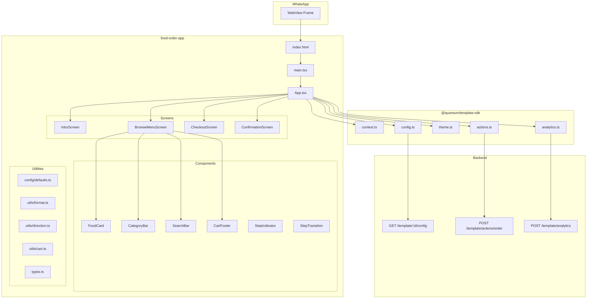
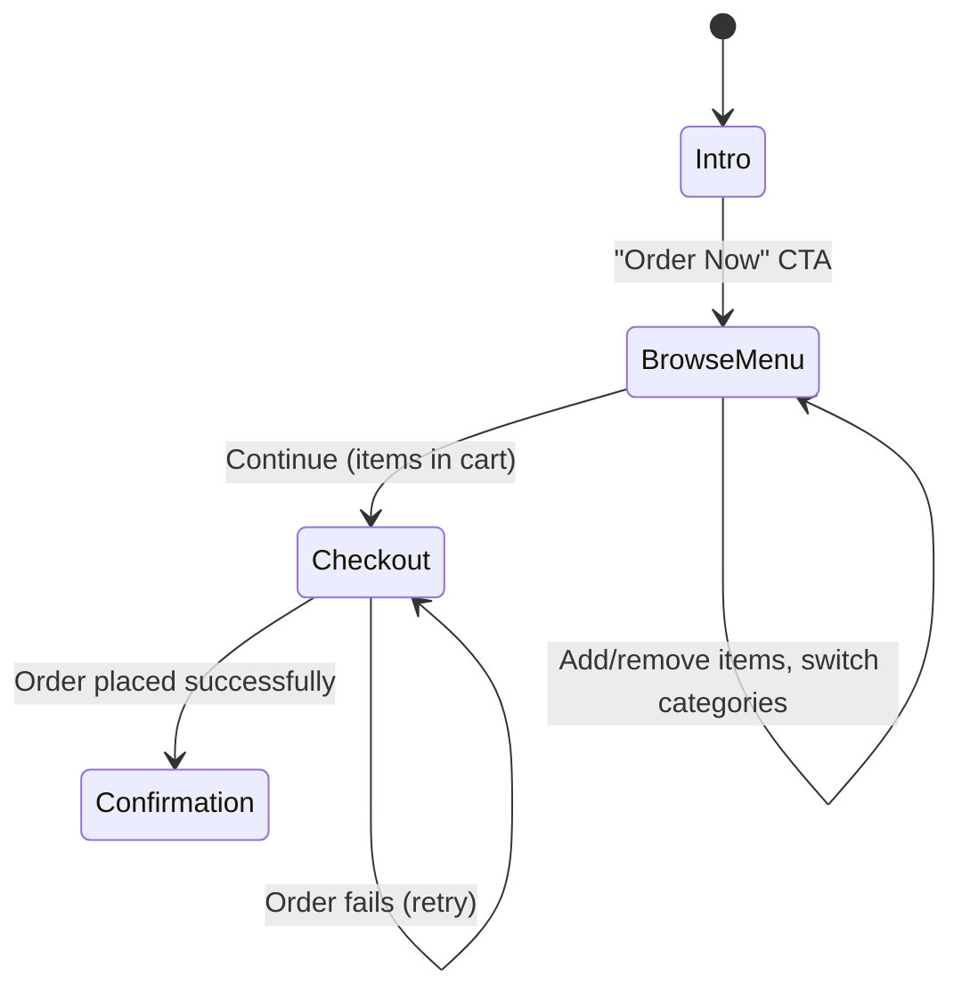

# Design Document: Food Order App Template

## Overview

The Food Order App Template is a configurable WhatsApp WebView mini-app built with React + TypeScript + Vite that provides a minimal multi-step food ordering flow (Intro → Browse Menu → Cart/Checkout → Confirmation). It integrates with the QuantumMind Template SDK (`@quantum/template-sdk`) for configuration loading, theming, analytics tracking, and backend actions.

This is a WhatsApp WebView — not a full standalone app. It opens when a customer taps a product link in the chat, provides a smart UI/UX for browsing food items, adding to cart, and placing an order. The same concept as other templates (beauty-services-catalog, salon-booking) but for the food delivery category.

The template is 100% JSON-configurable — a single codebase serves restaurants, cafes, food trucks, and any food business without code changes. Admin-editable config controls branding, menu items, categories, pricing, and theme tokens.

The design follows the Figma reference with a dark theme (#2D2D3A background), orange accent (#FF6B00), 430px mobile viewport, rounded cards, 2-column food card grid, and smooth step transitions.

### Key Design Decisions

1. **Linear step-based flow (same as other templates)** — The flow is: Intro → Browse Menu (categories + food grid) → Cart/Checkout (order summary) → Confirmation. Uses the same `StepTransition` pattern as beauty-services-catalog.

2. **Config-driven menu data model** — All menu data (categories, menu_items) lives in the JSON config. The template renders whatever config provides at runtime with sensible defaults for Demo Mode.

3. **Cart as running total** — Users add items from the browse screen. A running total footer shows selected items count and total price. The checkout screen shows the order summary with all selected items.

4. **SDK-first integration** — Context reading, config loading, theme application, analytics events, and the `createOrder` action all delegate to `@quantum/template-sdk`.

5. **Progressive enhancement with Demo Mode** — The template renders fully with hardcoded defaults when the backend is unreachable (3-second timeout), enabling preview/development without infrastructure.

6. **Dark-first theming** — The default design is dark mode matching the Figma. Light mode is supported via `dark_mode: false` in config.

---

## Architecture



### Screen Flow (4 Steps — Minimal)



---

## Components and Interfaces

### Screen Components (4 screens only)

| Component | Responsibility | Props |
|-----------|---------------|-------|
| `IntroScreen` | Branded welcome with logo, tagline, food imagery, CTA | `config`, `onStart` |
| `BrowseMenuScreen` | Category tabs, search, 2-col food grid, cart footer | `config`, `locale`, `cart`, `onCartChange`, `onContinue` |
| `CheckoutScreen` | Order summary, delivery info, customer details, place order | `config`, `locale`, `cart`, `customerName`, `customerPhone`, `onConfirm`, `onBack` |
| `ConfirmationScreen` | Success checkmark, order confirmation message, close CTA | `config`, `onClose` |

### Shared UI Components

| Component | Responsibility | Props |
|-----------|---------------|-------|
| `FoodCard` | 2-column grid card with image, name, price, rating, add button | `item`, `quantity`, `onAdd`, `onRemove` |
| `CategoryBar` | Horizontal scrollable category pills | `categories`, `activeId`, `onSelect` |
| `SearchBar` | Search input with icon | `placeholder`, `value`, `onChange` |
| `CartFooter` | Fixed footer showing item count + total + Continue button | `itemCount`, `total`, `currency`, `locale`, `onContinue`, `labels` |
| `StepIndicator` | Horizontal step progress bar | `currentStep`, `steps` |
| `StepTransition` | CSS slide/fade transition wrapper | `stepKey`, `direction`, `children` |

### App.tsx State Shape

```typescript
interface AppState {
  loading: boolean;
  config: FoodOrderConfig;
  locale: string;
  step: FoodStep;
  direction: TransitionDirection;
  
  // Menu browsing
  selectedCategory: string; // "all" | category id
  searchQuery: string;
  
  // Cart — map of itemId → quantity
  cart: Map<string, number>;
  
  // Customer (from context)
  customerName: string;
  customerPhone: string;
  customerNotes: string;
  
  // Order submission
  submitting: boolean;
  error: string;
}

type FoodStep = 'intro' | 'browse_menu' | 'checkout' | 'confirmation';
type TransitionDirection = 'forward' | 'backward';
```

---

## Data Models

### FoodOrderConfig

```typescript
interface FoodOrderConfig {
  // Branding
  brand_name: string;
  brand_logo: string;
  hero_image: string;
  
  // Theme
  primary_color: string;
  secondary_color: string;
  accent_color: string;
  text_color: string;
  background_color: string;
  font_family: string;
  dark_mode: boolean;
  
  // Menu data
  categories: Category[];
  menu_items: MenuItem[];
  
  // Pricing / Delivery
  delivery_fee: number;
  tax_rate: number;
  estimated_delivery_time: string;
  currency: string;
  
  // Content
  success_message: string;
  success_cta_text: string;
  labels: Labels;
}

interface Category {
  id: string;
  name: string;
}

interface MenuItem {
  id: string;
  categoryId: string;
  name: string;
  price: number;
  image?: string;
  rating: number;        // 1.0–5.0
  description?: string;
  deliveryTime?: string; // e.g., "24 mins"
}

interface Labels {
  // Intro
  intro_tagline: string;
  get_started: string;
  // Browse
  home_greeting: string;
  search_placeholder: string;
  no_items: string;
  no_search_results: string;
  // Checkout
  order_summary: string;
  subtotal_label: string;
  tax_label: string;
  delivery_label: string;
  total_label: string;
  delivery_time_label: string;
  place_order: string;
  order_error: string;
  full_name: string;
  phone_number: string;
  notes: string;
  // Confirmation
  success_heading: string;
  // Navigation
  back: string;
  continue: string;
  // General
  add: string;
  remove: string;
  items_in_cart: string; // "{count} items"
  [key: string]: string;
}
```

### Order Payload (sent to `createOrder`)

```typescript
interface OrderPayload {
  items: {
    itemId: string;
    name: string;
    quantity: number;
    unitPrice: number;
    lineTotal: number;
  }[];
  subtotal: number;
  tax: number;
  deliveryFee: number;
  total: number;
  customerName: string;
  customerPhone: string;
  notes?: string;
  currency: string;
}
```

### Cart Computation Functions

```typescript
// Pure functions for cart calculations
function computeSubtotal(cart: Map<string, number>, menuItems: MenuItem[]): number;
function computeTax(subtotal: number, taxRate: number): number;
function computeTotal(subtotal: number, tax: number, deliveryFee: number): number;
function formatCurrency(amount: number, locale: string, currency: string): string;
function getCartItemCount(cart: Map<string, number>): number;
```

---

## Correctness Properties

### Property 1: Config merge completeness

*For any* partial config object containing an arbitrary subset of valid config keys (including empty object, null values, and complete objects), merging it with the default config SHALL produce a result where every key defined in the default config resolves to either the fetched value (if present and non-null) or the default value, and no key is ever undefined or null.

**Validates: Requirements 2.2, 2.4, 2.6**

### Property 2: Direction determination from language code

*For any* language code string, the direction resolver SHALL return `"rtl"` if and only if the code is one of `["ar", "he", "fa", "ur"]`, and `"ltr"` for all other language codes including empty string and undefined.

**Validates: Requirements 3.5, 20.2**

### Property 3: Search filter correctness

*For any* set of menu items and *any* non-empty search string, filtering the items by name SHALL return only items whose name contains the search string (case-insensitive), and filtering with an empty string SHALL return all items unchanged.

**Validates: Requirements 5.3, 5.4**

### Property 4: Category filter correctness

*For any* set of menu items and *any* selected category ID, filtering the items by category SHALL return only items whose `categoryId` matches the selected category, and filtering with the `"all"` category SHALL return all items unchanged.

**Validates: Requirements 6.3**

### Property 5: Cart quantity bounds

*For any* sequence of add/remove operations, the quantity for any item SHALL always be >= 0. Removing from 0 has no effect. Adding increments by 1.

**Validates: Requirements 7.3**

### Property 6: Order total computation

*For any* cart with non-negative item prices and quantities, *any* tax rate in [0, 1], and *any* non-negative delivery fee, the order total SHALL equal `subtotal + (subtotal × taxRate) + deliveryFee`, and the subtotal SHALL equal the sum of (price × quantity) for all cart items.

**Validates: Requirements 11.2**

### Property 7: Currency formatting produces valid output

*For any* numeric amount (≥ 0), *any* valid locale string, and *any* valid ISO 4217 currency code, the `formatCurrency` function SHALL produce a non-empty string containing a representation of the numeric value with exactly 2 fraction digits.

**Validates: Requirements 20.4**

### Property 8: Cart item count equals sum of quantities

*For any* cart state, `getCartItemCount` SHALL return the sum of all quantities in the cart map.

**Validates: Requirements 7.1, 8.1**

---

## Error Handling

### Strategy

All error handling follows: **never show a broken screen**. Graceful degradation at every failure point.

### Error Scenarios

| Scenario | Handling | User Impact |
|----------|----------|-------------|
| Config fetch timeout (> 3s) | Fall back to hardcoded defaults (Demo Mode) | None — renders with demo data |
| Config fetch network error | Same as timeout — Demo Mode | None |
| `getContext` parse failure | Default to `{ lang: "en", name: "", phone: "" }` | No pre-fill, LTR English |
| `applyTheme` throws | Apply default dark theme via hardcoded CSS variables | None — dark theme renders |
| `createOrder` failure | Show inline error on Checkout, re-enable button, preserve data | User sees error, can retry |
| `createOrder` duplicate click | Button disabled during submission | None — single submission |
| Analytics endpoint unreachable | Silently discard event, never retry | None |
| Menu item image missing | Show gradient placeholder | Degraded visual, functional |
| Empty menu_items in config | Show empty-state message | User informed, no crash |
| Search returns no results | Show empty-state message | User informed |

### Demo Mode Behavior

When `demoMode` is `true`:
- All screens render with default config (demo menu items)
- `createOrder` simulates a 1-second delay then resolves successfully
- Analytics events still attempt to fire (silent fail if unreachable)

---

## Testing Strategy

### Testing Framework

- **Unit/Property tests**: Vitest + fast-check
- **Component tests**: @testing-library/react with jsdom
- **Type checking**: `tsc --noEmit`

### Test Structure

```
src/
├── __tests__/
│   ├── setup.ts              # Vitest setup (jsdom, SDK mocks)
│   ├── config.test.ts        # Config merge properties
│   ├── cart.test.ts          # Cart computation properties
│   ├── format.test.ts        # Currency formatting properties
│   ├── direction.test.ts     # RTL/LTR direction properties
│   ├── filter.test.ts        # Search and category filter properties
│   └── integration/
│       └── order-flow.test.tsx
```

### Property-Based Tests (fast-check, minimum 100 iterations each)

- Config merge completeness (Property 1)
- Direction determination (Property 2)
- Search filter correctness (Property 3)
- Category filter correctness (Property 4)
- Cart quantity bounds (Property 5)
- Order total computation (Property 6)
- Currency formatting (Property 7)
- Cart item count (Property 8)

Each tagged with: `Feature: food-order-app, Property {N}: {description}`
