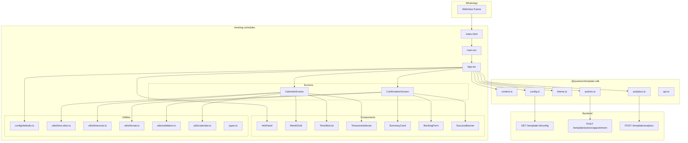
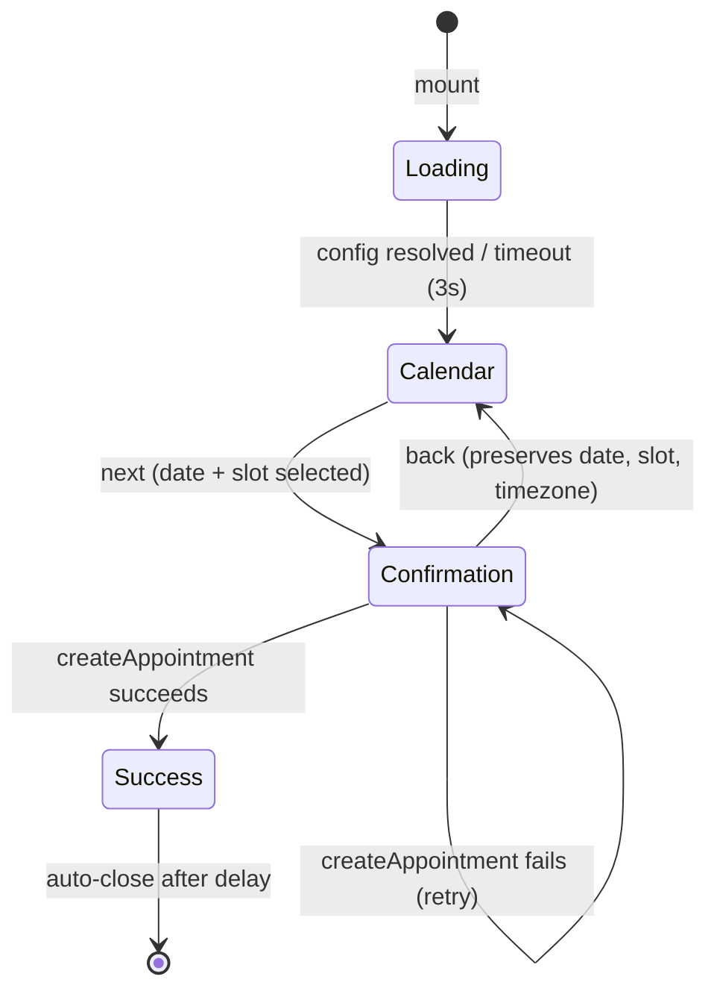

# Design Document: Meeting Scheduler Template

## Overview

The Meeting Scheduler Template is a Calendly-style meeting/demo booking WebView mini-app built with React + Vite that provides a two-step booking flow (Calendar & Time Selection → Confirmation Form) in a responsive two-panel layout. It integrates with the QuantumMind Template SDK for configuration, theming, analytics, and backend actions.

The template is 100% JSON-configurable — a single codebase serves product demos, sales calls, consultations, and any meeting type without code changes. Admin-editable config controls branding, working hours, slot duration, form fields, labels, and theme tokens.

### Key Design Decisions

1. **Two-step flow without step indicator** — Unlike the salon-booking-template's 5-step wizard, this template uses a minimal Calendly-style two-step flow: Calendar Screen → Confirmation Screen. No step indicator dots are shown; navigation is communicated through a back arrow and the "Next" / "Confirm" buttons.

2. **Two-panel layout** — Desktop renders an Info Panel (left, ~1/3 width) alongside an Interactive Panel (right, ~2/3 width). Mobile collapses to a compact header bar + full-width interactive area. The Info Panel displays business branding and meeting metadata.

3. **Full month calendar grid** — A 7-column (SUN–SAT) month view with week rows, not a horizontal day scroller. Users visually browse and tap a day cell to select a date.

4. **Vertical time slot list with pill buttons** — Available times render as a scrollable vertical list of pill-shaped buttons (rounded-full) in 12-hour AM/PM format. Selected pill receives Primary_Color fill; unselected pills show a border-only outline.

5. **Client-side time slot generation** — Slots are computed purely from config `working_hours` and `slot_duration` in the browser. No server call is required to list available times.

6. **Timezone detection via Intl API** — The browser's `Intl.DateTimeFormat().resolvedOptions().timeZone` provides the default timezone. A searchable dropdown lets users override it.

7. **Inline success + auto-close** — After booking, no separate "success screen" renders. The confirmation form hides, an inline banner shows the success message, and the WebView auto-closes after a configurable delay.

8. **No routing — single App.tsx with step state** — Follows the established monorepo pattern. A `step` state variable controls which screen renders. This keeps the bundle small and avoids router overhead in a WebView context.

9. **Primary color #0060E6, Font: Inter** — Default brand accent and font, applied via CSS custom properties through the SDK theme system.

10. **Bundle target < 200 KB gzipped** — Achieved by avoiding routing libraries, using CSS-only styling (no UI framework), tree-shaking, and the shared Vite build config.

---

## Architecture



### Step State Machine



### Directory Structure

```
templates/meeting-scheduler/
├── index.html
├── manifest.json
├── package.json
├── tsconfig.json
├── vite.config.ts
└── src/
    ├── main.tsx                  # React mount + SDK init
    ├── App.tsx                   # Root component + step state machine
    ├── types.ts                  # Shared TypeScript interfaces
    ├── config/
    │   └── defaults.ts           # Default config values for Demo Mode
    ├── components/
    │   ├── InfoPanel.tsx         # Left panel: logo, title, duration, description
    │   ├── CalendarScreen.tsx    # Step 1: month grid + timezone + time slots
    │   ├── MonthGrid.tsx         # Full month calendar grid (7 cols)
    │   ├── TimeSlotList.tsx      # Vertical scrollable time slot pills
    │   ├── TimezoneSelector.tsx  # Searchable timezone dropdown
    │   ├── ConfirmationScreen.tsx# Step 2: summary + form + success
    │   ├── SummaryCard.tsx       # Date/time/timezone summary card
    │   ├── BookingForm.tsx       # Name, email, phone fields + confirm button
    │   └── SuccessBanner.tsx     # Inline success message
    ├── utils/
    │   ├── time-slots.ts         # Compute available slots from working_hours
    │   ├── timezone.ts           # Timezone detection, formatting, offset calc
    │   ├── calendar.ts           # Month grid generation, date selectability
    │   ├── validation.ts         # Form field validation (name, email)
    │   └── format.ts             # Date formatting with Intl APIs
    └── styles.css                # All styles using CSS variables
```

---

## Components and Interfaces

### App (Root Component)

The root component manages global state and step transitions. It follows the salon-booking-template pattern with a simpler two-step flow.

```typescript
// Step type for the booking flow
type SchedulerStep = 'calendar' | 'confirmation';

// Internal step state includes success as a sub-state of confirmation
type InternalStep = 'calendar' | 'confirmation' | 'success';

// App-level state
interface AppState {
  step: InternalStep;
  config: MeetingConfig;
  loading: boolean;
  selectedDate: string;          // ISO YYYY-MM-DD or ''
  selectedSlot: string;          // e.g. "10:30 AM" or ''
  selectedTimezone: string;      // IANA timezone, e.g. "America/New_York"
  customerName: string;
  customerEmail: string;
  customerPhone: string;
  submitting: boolean;
  error: string;
}
```

### InfoPanel

Renders the business branding — always visible as either a left column (desktop) or compact header bar (mobile).

```typescript
interface InfoPanelProps {
  config: MeetingConfig;
  isMobile: boolean;
}
```

**Desktop rendering:** Fixed-width left column (~280px) displaying logo, meeting title, subtitle, duration badge (clock icon + "{N} min"), and meeting description.

**Mobile rendering:** Compact horizontal bar with logo (32px), meeting title, and duration badge. Description hidden or toggle-accessible.

### CalendarScreen

The primary interactive screen combining the month grid, timezone selector, and time slot list.

```typescript
interface CalendarScreenProps {
  config: MeetingConfig;
  selectedDate: string;
  selectedSlot: string;
  selectedTimezone: string;
  onDateChange: (date: string) => void;
  onSlotChange: (slot: string) => void;
  onTimezoneChange: (tz: string) => void;
  onNext: () => void;
}
```

### MonthGrid

A pure presentational component rendering the 7-column calendar.

```typescript
interface MonthGridProps {
  displayedMonth: number;        // 0-11
  displayedYear: number;
  selectedDate: string;          // ISO YYYY-MM-DD
  minDate: string;               // today ISO
  maxDate: string;               // advance_booking_days from today
  onDateSelect: (date: string) => void;
}
```

**Grid layout:** 7 columns (SUN, MON, TUE, WED, THU, FRI, SAT), 4-6 rows depending on month. Each cell is a button with minimum 44×44px tap target.

**States per cell:**
- `disabled`: past date or beyond maxDate → greyed out, not interactive
- `today`: current date → subtle ring/dot indicator
- `selected`: user's chosen date → Primary_Color fill, white text
- `default`: selectable future date → normal styling

### TimeSlotList

Renders available slots as a vertical scrollable list of pill buttons.

```typescript
interface TimeSlotListProps {
  slots: string[];               // e.g. ["9:00 AM", "9:30 AM", ...]
  selectedSlot: string;
  onSlotSelect: (slot: string) => void;
  noAvailabilityMessage: string;
}
```

**Pill styling:**
- Unselected: border with Primary_Color, transparent fill, Primary_Color text
- Selected: Primary_Color fill, white text
- All pills: `border-radius: 9999px`, min-height 44px, horizontally centered text

### TimezoneSelector

A searchable dropdown for timezone selection.

```typescript
interface TimezoneSelectorProps {
  selectedTimezone: string;
  onTimezoneChange: (tz: string) => void;
}
```

**Behavior:** Displays current timezone as "{Area/City} (UTC±HH:MM)". On click/tap, opens a scrollable list of all IANA timezones with a text filter input at the top. Selecting a timezone closes the dropdown and triggers recalculation.

### ConfirmationScreen

The second step: displays summary, form, and handles booking submission.

```typescript
interface ConfirmationScreenProps {
  config: MeetingConfig;
  selectedDate: string;
  selectedSlot: string;
  selectedTimezone: string;
  customerName: string;
  customerEmail: string;
  customerPhone: string;
  submitting: boolean;
  error: string;
  success: boolean;
  onNameChange: (v: string) => void;
  onEmailChange: (v: string) => void;
  onPhoneChange: (v: string) => void;
  onConfirm: () => void;
  onBack: () => void;
}
```

### SummaryCard

Displays the chosen date, time, and timezone with Primary_Color background.

```typescript
interface SummaryCardProps {
  date: string;                  // formatted: "Wednesday, January 15, 2025"
  slot: string;                  // "10:30 AM"
  timezone: string;              // "America/New_York"
}
```

### BookingForm

The name/email/phone form with validation.

```typescript
interface BookingFormProps {
  config: MeetingConfig;
  name: string;
  email: string;
  phone: string;
  submitting: boolean;
  error: string;
  onNameChange: (v: string) => void;
  onEmailChange: (v: string) => void;
  onPhoneChange: (v: string) => void;
  onSubmit: () => void;
}
```

### SuccessBanner

Inline banner shown after successful booking.

```typescript
interface SuccessBannerProps {
  message: string;
  autoCloseDelay: number;        // seconds
}
```

---

## Utility Modules

### time-slots.ts

Pure function computing bookable time slots entirely client-side.

```typescript
interface DayHours {
  open: string;   // "09:00" (24h format)
  close: string;  // "17:00"
}

interface WorkingHours {
  monday?: DayHours | null;
  tuesday?: DayHours | null;
  wednesday?: DayHours | null;
  thursday?: DayHours | null;
  friday?: DayHours | null;
  saturday?: DayHours | null;
  sunday?: DayHours | null;
}

/**
 * Compute available time slots for a given date.
 *
 * @param date - ISO date string (YYYY-MM-DD)
 * @param workingHours - Weekly schedule from config
 * @param slotDuration - Duration in minutes (default 30)
 * @param timezone - IANA timezone string
 * @param now - Current Date object (for excluding past slots on today)
 * @returns Array of time strings in 12-hour format, e.g. ["9:00 AM", "9:30 AM"]
 */
function computeTimeSlots(
  date: string,
  workingHours: WorkingHours,
  slotDuration: number,
  timezone: string,
  now?: Date
): string[];
```

**Algorithm:**
1. Map ISO date to day-of-week name (e.g., "monday")
2. Look up `workingHours[dayName]` — if null/undefined, return `[]`
3. Parse open/close as minutes-since-midnight
4. Generate slots at `slotDuration` intervals from open until slot end ≤ close
5. If `date` equals today (in the given timezone), filter out slots where start time ≤ current time
6. Format each slot start as 12-hour string (e.g., "9:00 AM", "2:30 PM")

### timezone.ts

```typescript
/**
 * Detect the user's current timezone from the browser.
 * Falls back to "UTC" if Intl API is unavailable.
 */
function detectTimezone(): string;

/**
 * Format a timezone for display: "America/New_York (UTC-05:00)"
 */
function formatTimezone(tz: string): string;

/**
 * Get a list of all common IANA timezone identifiers.
 */
function getTimezoneList(): string[];

/**
 * Compute UTC offset string for a timezone at a given date.
 * Returns e.g. "-05:00" or "+05:30"
 */
function getUtcOffset(tz: string, date?: Date): string;
```

### calendar.ts

```typescript
/**
 * Determine if a date is selectable (bookable).
 * A date is selectable iff:
 *   1. It is today or in the future, AND
 *   2. It is within advanceBookingDays from today
 *
 * @param date - ISO date string to check
 * @param today - ISO date string for "today"
 * @param advanceBookingDays - Max days into the future (default 30)
 * @returns true if the date is selectable
 */
function isDateSelectable(
  date: string,
  today: string,
  advanceBookingDays: number
): boolean;

/**
 * Generate the grid cells for a given month.
 * Returns a 2D array of date strings (or null for padding cells).
 */
function generateMonthGrid(year: number, month: number): (string | null)[][];
```

### validation.ts

```typescript
/**
 * Check if the confirmation form is valid.
 * Valid when:
 *   - name contains at least 1 non-whitespace character
 *   - email contains @ with at least one character before and after
 */
function isFormValid(name: string, email: string): boolean;

/**
 * Validate email format (basic check).
 * Must contain @ with at least one char before and one char after.
 */
function isValidEmail(email: string): boolean;
```

### format.ts

```typescript
/**
 * Format a date for display in the summary card.
 * Output: "Wednesday, January 15, 2025"
 */
function formatDateLong(isoDate: string, locale?: string): string;
```

---

## Data Models

### MeetingConfig (Full Config Shape)

```typescript
interface MeetingConfig {
  // Branding
  business_name: string;
  business_logo: string;          // URL or empty string
  meeting_title: string;
  meeting_subtitle: string;
  meeting_description: string;
  meeting_duration: number;       // minutes

  // Theme
  primary_color: string;          // default "#0060E6"
  text_color: string;
  background_color: string;
  font_family: string;            // default "Inter"
  dark_mode: boolean;

  // Scheduling
  working_hours: WorkingHours;
  slot_duration: number;          // minutes, default 30
  advance_booking_days: number;   // default 30

  // Form behavior
  show_phone_field: boolean;

  // Post-booking
  success_message: string;
  auto_close_delay: number;       // seconds, default 3

  // Messages & labels
  labels: MeetingLabels;
}

interface MeetingLabels {
  confirm_heading: string;        // "Confirm Your Booking"
  name_label: string;             // "Name"
  name_placeholder: string;       // "Enter your name"
  email_label: string;            // "Email"
  email_placeholder: string;      // "Enter your email"
  phone_label: string;            // "Phone (optional)"
  phone_placeholder: string;      // "Enter your phone number"
  confirm_button: string;         // "Confirm Booking"
  back: string;                   // "Back"
  next: string;                   // "Next"
  no_availability: string;        // "No available times for this date"
  booking_error: string;          // "Booking could not be completed. Please try again."
  close_instruction: string;      // "You may close this window"
  [key: string]: string;
}
```

### BookingPayload (Submitted to Backend)

```typescript
interface MeetingBookingPayload {
  date: string;                   // ISO YYYY-MM-DD
  slot: string;                   // e.g. "10:30 AM"
  name: string;
  email: string;
  phone?: string;                 // included only if show_phone_field && non-empty
  timezone: string;               // IANA timezone
  meeting_duration: number;       // minutes
}
```

### Context (From SDK)

Reuses `TemplateContext` from `@quantum/template-sdk`:

```typescript
interface TemplateContext {
  visitorId?: string;
  phone?: string;
  name?: string;
  botId?: string;
  conversationId?: string;
  platform?: string;
  templateId?: string;
  leadId?: string;
  lang: string;
  extra: Record<string, string>;
}
```

---

## Error Handling

### Error Categories

| Category | Trigger | Behavior |
|----------|---------|----------|
| Config fetch failure | Network error, timeout (>3s), invalid template ID | Fall back to Demo Mode defaults; render fully navigable template |
| Context parse failure | Malformed URL query params, missing getContext response | Use defaults: lang="en", empty name, empty phone |
| Booking submission failure | createAppointment API returns error or network timeout | Show inline error on Confirmation Screen, preserve form data, enable retry |
| Analytics failure | track/trackView call rejects or network unreachable | Silently discard; never block UI flow |
| Theme application failure | applyTheme throws | Fall back to light mode with configured colors |
| Intl API failure | Browser doesn't support Intl.DateTimeFormat | Default timezone to "UTC" |

### Error Handling Strategy

1. **Config Loading (Demo Mode Fallback)**
   - The `loadConfig` call is wrapped with a 3-second timeout using `Promise.race`
   - On timeout or rejection, the template renders using `config/defaults.ts` values
   - The skeleton loading state is shown for at most 3 seconds
   - Late responses after timeout are ignored — the template stays in Demo Mode
   - No error UI is displayed to the user

2. **Booking Submission (Recoverable Error)**
   - On `createAppointment` failure: re-enable the confirm button, hide loading spinner, display inline error message (from `labels.booking_error`)
   - All form data (name, email, phone) is preserved — user can retry immediately
   - The confirm button uses a `submitting` guard to prevent duplicate submissions

3. **Analytics (Fire-and-Forget)**
   - All `track()` calls are wrapped in try/catch within the SDK — errors never propagate
   - Failed analytics events are discarded without retry
   - Analytics failures never affect user-facing flow or navigation

4. **Network Errors (Observability)**
   - Any API failure (except analytics itself) triggers a `track('error', { endpoint, message })` event
   - This provides backend observability without impacting user experience

5. **Timezone Detection (Graceful Degradation)**
   - If `Intl.DateTimeFormat().resolvedOptions().timeZone` throws or returns undefined, default to "UTC"
   - Time slots are still generated and displayed, just in UTC

---

## Correctness Properties

*A property is a characteristic or behavior that should hold true across all valid executions of a system — essentially, a formal statement about what the system should do. Properties serve as the bridge between human-readable specifications and machine-verifiable correctness guarantees.*

### Property 1: Config merging produces complete configuration

*For any* partial config object containing an arbitrary subset of valid MeetingConfig keys, merging it with the full defaults object SHALL produce a result where every key defined in the defaults resolves to either the fetched value (when present and non-null in the partial config) or the default value (when absent or null), and no key is ever undefined.

**Validates: Requirements 2.4, 2.6**

### Property 2: Date selectability determination

*For any* date string, today string, and positive integer `advanceBookingDays`, the function `isDateSelectable` SHALL return `true` if and only if the date is greater than or equal to today AND the date is at most `advanceBookingDays` days after today. All other dates SHALL return `false`.

**Validates: Requirements 5.5, 5.7**

### Property 3: Timezone display formatting

*For any* valid IANA timezone identifier string, the `formatTimezone` function SHALL produce a string that contains the original timezone identifier AND a parenthesized UTC offset in the format "(UTC±HH:MM)".

**Validates: Requirements 6.2**

### Property 4: Time slot computation

*For any* valid working hours definition where open time is strictly before close time (both in "HH:MM" 24-hour format) and any slot duration that is a positive integer divisor-compatible with the range, the computed slots SHALL satisfy: (a) every slot's start time is at or after the open time, (b) every slot's end time (start + duration) is at or before the close time, (c) consecutive slots are separated by exactly the slot duration with no gaps or overlaps, and (d) when the reference date equals today, no slot whose start time has already passed (relative to the provided `now` timestamp in the given timezone) is included in the result.

**Validates: Requirements 7.1, 7.3**

### Property 5: Confirmation form validation

*For any* pair of (name, email) strings, the function `isFormValid` SHALL return `true` if and only if the name contains at least one non-whitespace character AND the email contains an "@" character with at least one character before it and at least one character after it. All other combinations SHALL return `false`.

**Validates: Requirements 8.7**

---

## Testing Strategy

### Testing Approach

This template uses a **dual testing approach**:
- **Unit tests** for specific examples, edge cases, error conditions, and component rendering
- **Property-based tests** for universal properties of pure utility functions and logic

### Technology Stack

- **Test Runner**: Vitest (already used in the monorepo with Vite)
- **Component Testing**: React Testing Library
- **Property-Based Testing**: fast-check (TypeScript PBT library for Vitest)
- **Minimum PBT iterations**: 100 per property test

### Test Organization

```
templates/meeting-scheduler/
└── src/
    └── __tests__/
        ├── utils/
        │   ├── config.property.test.ts      # PBT: Property 1
        │   ├── calendar.property.test.ts    # PBT: Property 2
        │   ├── timezone.property.test.ts    # PBT: Property 3
        │   ├── time-slots.property.test.ts  # PBT: Property 4
        │   └── validation.property.test.ts  # PBT: Property 5
        ├── components/
        │   ├── InfoPanel.test.tsx
        │   ├── CalendarScreen.test.tsx
        │   ├── MonthGrid.test.tsx
        │   ├── TimeSlotList.test.tsx
        │   ├── TimezoneSelector.test.tsx
        │   ├── ConfirmationScreen.test.tsx
        │   ├── BookingForm.test.tsx
        │   └── SuccessBanner.test.tsx
        ├── integration/
        │   ├── booking-flow.test.tsx         # Full step navigation
        │   └── analytics.test.tsx            # Event tracking verification
        └── setup.ts
```

### Property-Based Tests

Each correctness property is implemented as a property-based test with minimum 100 iterations, tagged with its design reference:

| Property | Test File | Tag |
|----------|-----------|-----|
| Property 1: Config merging | `config.property.test.ts` | Feature: meeting-scheduler, Property 1: Config merging produces complete configuration |
| Property 2: Date selectability | `calendar.property.test.ts` | Feature: meeting-scheduler, Property 2: Date selectability determination |
| Property 3: Timezone formatting | `timezone.property.test.ts` | Feature: meeting-scheduler, Property 3: Timezone display formatting |
| Property 4: Time slot computation | `time-slots.property.test.ts` | Feature: meeting-scheduler, Property 4: Time slot computation |
| Property 5: Form validation | `validation.property.test.ts` | Feature: meeting-scheduler, Property 5: Confirmation form validation |

### Unit Tests (Example-Based)

Unit tests cover:
- **Component rendering**: InfoPanel, CalendarScreen, ConfirmationScreen with various configs
- **Conditional display**: show_phone_field toggle, logo fallback, mobile vs. desktop layout
- **Error states**: Failed API calls, timeout fallbacks, Demo Mode activation
- **Edge cases**: Closed days (no working hours), all slots past, Intl API failure
- **Accessibility**: Semantic elements, ARIA attributes, keyboard navigation, aria-selected
- **Analytics events**: view, start, step, complete, abandon, error events fire correctly
- **State preservation**: Back navigation preserves selections, forward preserves form data

### Integration Tests

Integration tests cover:
- **Full booking flow**: Calendar → select date → select slot → Next → fill form → Confirm → success
- **Back navigation**: Confirmation → Back → Calendar with selections preserved
- **Demo Mode**: Full flow works without backend connectivity
- **Context pre-fill**: Name/phone populated from SDK context on Confirmation screen
- **Auto-close**: Success triggers close mechanism after configured delay

### Smoke Tests

Smoke tests cover:
- **Build output**: Template builds with zero TS errors, bundle < 200 KB gzipped
- **Manifest schema**: All required fields present in manifest.json
- **Directory structure**: Template at correct path with required files
- **CSS variable usage**: No hardcoded colors outside CSS variable fallback defaults
- **Font family**: Inter declared as default
