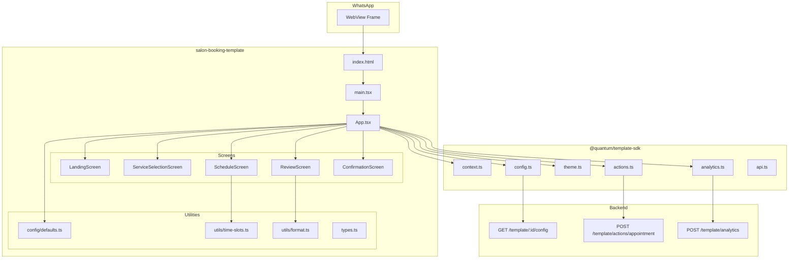
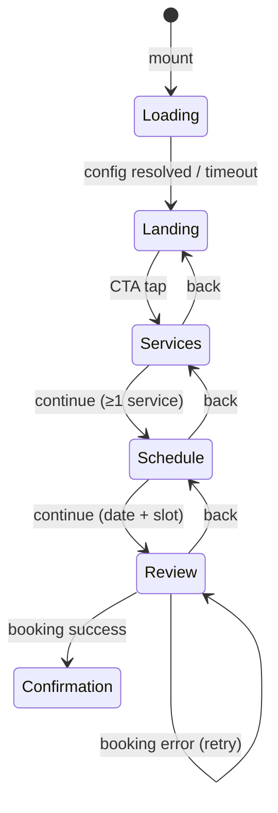

# Design Document: Salon Booking Template

## Overview

The Salon Booking Template is a configurable WhatsApp WebView mini-app built with React + Vite that provides a 5-step appointment booking flow (Landing → Service Selection → Schedule → Review → Confirmation). It integrates with the existing QuantumMind Template SDK for configuration, theming, analytics, and backend actions.

The template is 100% JSON-configurable — a single codebase serves salons, spas, clinics, gyms, and any service-oriented business without code changes. Admin-editable config controls branding, services, staff, working hours, labels, and theme tokens.

### Key Design Decisions

1. **Single-component architecture with step state machine** — follows the established `doctor-appointment` pattern using a single `App.tsx` with a `step` state variable. This keeps the bundle small and avoids router overhead in a WebView context.

2. **Config-driven data model** — all business data (services, staff, categories, working hours) lives in the JSON config rather than hardcoded arrays. The template renders whatever config provides at runtime.

3. **Progressive enhancement with Demo Mode** — the template renders fully with hardcoded defaults when the backend is unreachable, enabling preview/development without infrastructure.

4. **SDK-first integration** — all cross-cutting concerns (context, theming, analytics, API calls) delegate to `@quantum/template-sdk` rather than implementing custom solutions.

---

## Architecture



### Step State Machine



### Directory Structure

```
templates/salon-booking-template/
├── index.html
├── manifest.json
├── package.json
├── tsconfig.json
├── vite.config.ts
└── src/
    ├── main.tsx                 # React mount + SDK init
    ├── App.tsx                  # Root component + step state machine
    ├── types.ts                # Shared TypeScript interfaces
    ├── config/
    │   └── defaults.ts         # Default config values for Demo Mode
    ├── components/
    │   ├── Header.tsx          # Brand logo + step indicator
    │   ├── StepIndicator.tsx   # 5-step progress dots
    │   ├── LandingScreen.tsx
    │   ├── ServiceSelectionScreen.tsx
    │   ├── ScheduleScreen.tsx
    │   ├── ReviewScreen.tsx
    │   └── ConfirmationScreen.tsx
    ├── utils/
    │   ├── time-slots.ts       # Compute available slots from working_hours
    │   └── format.ts           # Currency + date formatting with Intl APIs
    └── styles.css              # All styles using CSS variables
```

---

## Components and Interfaces

### App (Root Component)

The root component manages global state and step transitions. It mirrors the `doctor-appointment` pattern but with richer config-driven behavior.

```typescript
// Step enum for the booking flow
type BookingStep = 'landing' | 'services' | 'schedule' | 'review' | 'confirmation';

// App-level state
interface AppState {
  step: BookingStep;
  config: SalonConfig;
  configLoaded: boolean;
  selectedServices: Service[];
  selectedStaff: Staff | null;
  selectedDate: string;       // ISO YYYY-MM-DD
  selectedSlot: string;       // e.g. "10:30 AM"
  customerName: string;
  customerPhone: string;
  customerNotes: string;
  submitting: boolean;
  error: string;
}
```

### Screen Components

Each screen receives props from App and dispatches events upward:

| Component | Key Props | Emits |
|-----------|-----------|-------|
| LandingScreen | config, reviews | onStart() |
| ServiceSelectionScreen | config, selectedServices | onContinue(services) |
| ScheduleScreen | config, staff, date, slot | onContinue(staff, date, slot) |
| ReviewScreen | config, services, staff, date, slot, name, phone | onConfirm(payload) |
| ConfirmationScreen | config, bookingDetails | onClose() |

### Header + StepIndicator

```typescript
interface StepIndicatorProps {
  currentStep: BookingStep;
  steps: BookingStep[];
}
```

The StepIndicator renders 5 dots/labels with completed/current/upcoming styling. It's hidden on the Confirmation step.

### Utility Modules

**time-slots.ts** — Pure function that computes bookable time slots:

```typescript
interface WorkingHours {
  [dayOfWeek: string]: { open: string; close: string } | null;
}

function computeTimeSlots(
  date: string,                    // ISO date
  workingHours: WorkingHours,
  intervalMinutes: number,         // default 30
  excludePastSlots: boolean        // true when date === today
): string[];
```

**format.ts** — Locale-aware formatting:

```typescript
function formatCurrency(amount: number, currency: string, locale: string): string;
function formatDate(isoDate: string, locale: string): string;
```

---

## Data Models

### SalonConfig (Full Config Shape)

```typescript
interface SalonConfig {
  // Branding
  business_name: string;
  business_logo: string;
  hero_image: string;
  hero_title: string;
  hero_subtitle: string;

  // Theme
  primary_color: string;
  secondary_color: string;
  text_color: string;
  background_color: string;
  font_family: string;
  dark_mode: boolean;

  // Services & Staff
  services: Service[];
  staff: Staff[];
  categories: Category[];

  // Scheduling
  working_hours: WorkingHours;
  time_slot_interval: number;       // minutes

  // Feature toggles
  show_staff_selection: boolean;
  show_reviews: boolean;
  reviews: Review[];

  // Booking behavior
  booking_settings: BookingSettings;

  // Messages & labels
  success_message: string;
  success_cta_text: string;
  currency: string;
  labels: Labels;
}

interface Service {
  id: string;
  name: string;
  category: string;
  price: number;
  duration: number;              // minutes
  image?: string;
}

interface Staff {
  id: string;
  name: string;
  role: string;
  avatar?: string;
  rating: number;                // 1.0–5.0
  experience: string;
}

interface Category {
  id: string;
  name: string;
  icon?: string;
}

interface Review {
  author: string;
  rating: number;
  text: string;
}

interface WorkingHours {
  monday?: { open: string; close: string } | null;
  tuesday?: { open: string; close: string } | null;
  wednesday?: { open: string; close: string } | null;
  thursday?: { open: string; close: string } | null;
  friday?: { open: string; close: string } | null;
  saturday?: { open: string; close: string } | null;
  sunday?: { open: string; close: string } | null;
}

interface BookingSettings {
  allow_multiple_services: boolean;
  require_notes: boolean;
  advance_booking_days: number;   // default 14
}

interface Labels {
  cta_book_now: string;
  select_service: string;
  select_date_time: string;
  your_details: string;
  confirm_booking: string;
  back: string;
  continue: string;
  no_services: string;
  no_availability: string;
  booking_error: string;
  [key: string]: string;
}
```

### BookingPayload (Submitted to Backend)

```typescript
interface BookingPayload {
  services: { id: string; name: string; price: number; duration: number }[];
  staff?: { id: string; name: string };
  date: string;
  slot: string;
  name: string;
  phone: string;
  notes?: string;
  totalPrice: number;
}
```

### Context (From SDK)

Uses `TemplateContext` from `@quantum/template-sdk`:

```typescript
interface TemplateContext {
  visitorId?: string;
  phone?: string;
  name?: string;
  botId?: string;
  conversationId?: string;
  platform?: string;
  templateId?: string;
  leadId?: string;
  lang: string;
  extra: Record<string, string>;
}
```

---

## Correctness Properties

*A property is a characteristic or behavior that should hold true across all valid executions of a system — essentially, a formal statement about what the system should do. Properties serve as the bridge between human-readable specifications and machine-verifiable correctness guarantees.*

### Property 1: Config merging produces complete configuration

*For any* partial config object containing an arbitrary subset of valid config keys, merging it with the full defaults object SHALL produce a result where every key resolves to either the fetched value (when present in partial config) or the default value (when absent), and no key is ever undefined or null.

**Validates: Requirements 2.4, 2.6, 14.1**

### Property 2: RTL direction determination

*For any* language code string, the direction resolver SHALL return `rtl` if and only if the code is one of `["ar", "he", "fa", "ur"]`, and SHALL return `ltr` for all other non-empty strings and for empty/undefined input (which defaults to `"en"`).

**Validates: Requirements 3.6, 14.2, 14.3**

### Property 3: Service filtering by category

*For any* list of services and any selected category ID, the filtered result SHALL contain only services whose `category` field matches the selected category ID, and SHALL contain all services from the original list that match that category.

**Validates: Requirements 5.2**

### Property 4: Service name truncation

*For any* service name string, the truncation function SHALL return the original string unchanged when its length is at most 60 characters, and SHALL return a string of exactly 63 characters (60 characters plus an ellipsis "…") when the original exceeds 60 characters.

**Validates: Requirements 5.3**

### Property 5: Service selection mode enforcement

*For any* sequence of service toggle actions: when `allow_multiple_services` is true, the selected set SHALL contain at most 10 services at any point; when `allow_multiple_services` is false, the selected set SHALL contain at most 1 service at any point, and selecting a new service SHALL deselect any previously selected service.

**Validates: Requirements 5.5, 5.6**

### Property 6: Time slot computation

*For any* valid working hours definition (open time before close time) and time slot interval (15, 30, 45, or 60 minutes), the computed slots SHALL satisfy: (a) every slot's start time falls at or after the open time, (b) every slot's end time (start + interval) falls at or before the close time, (c) slots are evenly spaced by the interval with no gaps, and (d) when the date is today, no slot with a start time before the current local time is included.

**Validates: Requirements 7.4, 7.5**

### Property 7: Total price computation

*For any* array of selected services with numeric prices, the computed total SHALL equal the arithmetic sum of all service prices, formatted to exactly 2 decimal places.

**Validates: Requirements 8.5**

### Property 8: Form validation for booking confirmation

*For any* pair of name and phone strings, the confirm button SHALL be enabled if and only if both strings contain at least 1 non-whitespace character. Strings that are empty or contain only whitespace SHALL result in the button being disabled.

**Validates: Requirements 8.6**

### Property 9: Currency formatting

*For any* numeric amount, valid locale string, and valid ISO 4217 currency code, the `formatCurrency` function SHALL produce a string representation with exactly 2 fraction digits. When the currency code is absent or empty, the function SHALL produce a locale-formatted number without a currency symbol.

**Validates: Requirements 14.4, 14.5**

### Property 10: Date formatting

*For any* valid ISO date string (YYYY-MM-DD) and valid locale string, the `formatDate` function SHALL produce a formatted string that contains day, month, and year components as determined by the locale's conventions.

**Validates: Requirements 14.6**

---

## Error Handling

### Error Categories

| Category | Trigger | Behavior |
|----------|---------|----------|
| Config fetch failure | Network error, timeout (>3s), invalid template ID | Fall back to Demo Mode defaults; render fully navigable template |
| Context parse failure | Malformed URL query params, missing getContext response | Use defaults: lang="en", empty name, empty phone |
| Booking submission failure | createAppointment API returns error or network timeout | Show inline error on Review Screen, preserve form data, offer retry |
| Analytics failure | track/trackView call rejects or network unreachable | Silently discard; never block UI flow |
| Theme application failure | applyTheme throws | Fall back to light mode with configured colors |

### Error Handling Strategy

1. **Config Loading (Demo Mode Fallback)**
   - The `loadConfig` call is wrapped with a 3-second timeout using `Promise.race`
   - On timeout or rejection, the template renders using `config/defaults.ts` values
   - The skeleton loading state is shown for at most 3 seconds before transitioning to Landing
   - No error UI is displayed to the user — the template is fully functional in Demo Mode

2. **Booking Submission (Recoverable Error)**
   - On `createAppointment` failure: re-enable the confirm button, hide loading spinner, display an inline error message (from `labels.booking_error`)
   - A "Retry" button re-submits the same payload without requiring the user to re-enter data or navigate back
   - The confirm button uses a `submitting` guard to prevent duplicate submissions while in-flight

3. **Analytics (Fire-and-Forget)**
   - All `track()` calls are wrapped in try/catch within the SDK — errors never propagate
   - Failed analytics events are discarded without retry
   - Analytics failures never affect user-facing flow or navigation

4. **Network Errors (Observability)**
   - Any API failure (except analytics itself) triggers a `track('error', { endpoint, message })` event
   - This provides backend observability without impacting user experience

5. **Input Validation**
   - Form fields enforce max lengths (name: 100, phone: 20, notes: 500) via `maxLength` attributes
   - The confirm button is disabled until both name and phone contain non-whitespace characters
   - No server-side validation errors are expected for well-formed payloads; if they occur, they are treated as booking submission failures

---

## Testing Strategy

### Testing Approach

This template uses a **dual testing approach**:
- **Unit tests** for specific examples, edge cases, error conditions, and component rendering
- **Property-based tests** for universal properties of pure utility functions and logic

### Technology Stack

- **Test Runner**: Vitest (already used in the monorepo ecosystem with Vite)
- **Component Testing**: React Testing Library
- **Property-Based Testing**: fast-check (TypeScript PBT library for Vitest)
- **Minimum PBT iterations**: 100 per property test

### Test Organization

```
templates/salon-booking-template/
└── src/
    └── __tests__/
        ├── utils/
        │   ├── time-slots.test.ts          # Property tests for slot computation
        │   ├── time-slots.property.test.ts  # PBT: Property 6
        │   ├── format.test.ts              # Property tests for formatting
        │   ├── format.property.test.ts     # PBT: Properties 9, 10
        │   └── config.property.test.ts     # PBT: Property 1
        ├── logic/
        │   ├── direction.property.test.ts  # PBT: Property 2
        │   ├── services.property.test.ts   # PBT: Properties 3, 4, 5, 7
        │   └── validation.property.test.ts # PBT: Property 8
        ├── components/
        │   ├── LandingScreen.test.tsx
        │   ├── ServiceSelectionScreen.test.tsx
        │   ├── ScheduleScreen.test.tsx
        │   ├── ReviewScreen.test.tsx
        │   └── ConfirmationScreen.test.tsx
        └── integration/
            ├── booking-flow.test.tsx        # Full step navigation
            └── analytics.test.tsx           # Event tracking verification
```

### Property-Based Tests

Each correctness property is implemented as a single property-based test with minimum 100 iterations, tagged with its design reference:

| Property | Test File | Tag |
|----------|-----------|-----|
| Property 1: Config merging | `config.property.test.ts` | Feature: salon-booking-template, Property 1: Config merging produces complete configuration |
| Property 2: RTL direction | `direction.property.test.ts` | Feature: salon-booking-template, Property 2: RTL direction determination |
| Property 3: Service filtering | `services.property.test.ts` | Feature: salon-booking-template, Property 3: Service filtering by category |
| Property 4: Name truncation | `services.property.test.ts` | Feature: salon-booking-template, Property 4: Service name truncation |
| Property 5: Selection mode | `services.property.test.ts` | Feature: salon-booking-template, Property 5: Service selection mode enforcement |
| Property 6: Time slots | `time-slots.property.test.ts` | Feature: salon-booking-template, Property 6: Time slot computation |
| Property 7: Total price | `services.property.test.ts` | Feature: salon-booking-template, Property 7: Total price computation |
| Property 8: Form validation | `validation.property.test.ts` | Feature: salon-booking-template, Property 8: Form validation for booking confirmation |
| Property 9: Currency format | `format.property.test.ts` | Feature: salon-booking-template, Property 9: Currency formatting |
| Property 10: Date format | `format.property.test.ts` | Feature: salon-booking-template, Property 10: Date formatting |

### Unit Tests (Example-Based)

Unit tests cover:
- **Component rendering**: Each screen renders correctly with various config combinations
- **Conditional display**: show_reviews, show_staff_selection, require_notes toggles
- **Error states**: Failed API calls, timeout fallbacks, Demo Mode activation
- **Edge cases**: Empty categories, no working hours, all slots past, empty staff array
- **Accessibility**: Semantic elements, ARIA attributes, keyboard navigation, focus management
- **Analytics events**: Correct events fire once per trigger with expected payloads

### Integration Tests

Integration tests cover:
- **Full booking flow**: Navigate Landing → Services → Schedule → Review → Confirmation
- **Back navigation state preservation**: Selections persist when navigating backward
- **Demo Mode**: Full flow works without backend connectivity
- **Context pre-fill**: Name/phone populated from SDK context on Review screen

### Smoke Tests

Smoke tests cover:
- **Build output**: Template builds with zero TS errors, bundle < 200 KB gzipped
- **Manifest schema**: All required fields present in manifest.json
- **Directory structure**: Template at correct path with required files
- **CSS variable usage**: No hardcoded colors outside :root fallbacks
