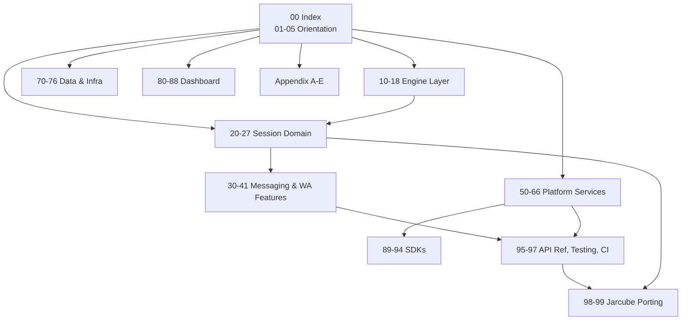

# OpenWA Deep-Analysis Documentation Set

A code-grounded atlas of the OpenWA codebase, written to be loaded as context before porting
OpenWA features into Jarcube (QuantumMind).

| | |
| --- | --- |
| **Subject** | `OpenWA/` — openwa v0.23.3 |
| **Commit analysed** | `33f98b4ca5a56b02603d003aa77280f25e45222e` (2026-09-01) |
| **Measured** | 2026-09-02 |
| **Target** | `QuantumMind-backend/` (Jarcube) |
| **Verifier** | `node verify-docs.mjs` |

## Why this set exists

OpenWA ships 31 documents of its own under `docs/`. That material is written for *users and
contributors of OpenWA*: it explains concepts and API contracts well, but rarely names the file,
class, or call chain that implements them. A port needs the inverse — an atlas of what exists,
where it lives, how it wires together, and what it depends on.

These docs are additive and live outside the OpenWA repo, so upstream pulls stay clean.

## How to use this as context

- **Orienting for the first time** → read 01-executive-summary.md, 02-repository-map.md,
  03-architecture-overview.md in order. Roughly 20 minutes.
- **Porting a specific feature** → open 98-jarcube-porting-analysis.md, find the module row,
  follow it to the band doc named there.
- **Answering a mechanical question** ("what does this env var do", "what's in this payload",
  "what is this file") → go straight to the appendices.
- **Loading into an agent** → load the 2–4 band docs for the subsystem plus
  APPENDIX-A-env-vars.md and APPENDIX-B-events.md. Do not load the whole set; it is far larger
  than any single task needs.

Every band doc follows the same section order (`_TEMPLATE.md`), so once you have read one you
know where to look in all of them.

## Band map



## Scale of the subject

Measured at the commit above. Line counts drift; treat them as magnitude, not gospel.

| Area | Files (`.ts`) | Lines |
| --- | --- | --- |
| `src/engine` | 120 | 39,005 |
| `dashboard/src` | 95 | 21,255 |
| `src/modules/session` | 57 | 17,641 |
| `src/core` (plugins, hooks, agent-tools) | 92 | 15,798 |
| `src/modules/message` | 34 | 10,899 |
| `src/common` | 108 | 9,476 |
| `src/modules/infra` | 23 | 8,386 |
| `src/modules/integration` | 45 | 7,438 |
| `src/config` | 32 | 6,247 |
| `src/modules/webhook` | 33 | 6,234 |
| `src/database` | 69 | 5,181 |
| `sdk` | 29 | 5,019 |
| remaining 24 modules | ~180 | ~19,000 |

Surface totals: 31 feature modules · 33 controllers · 17 entities · 31 data migrations ·
157 API paths / 196 operations / 219 schemas across 24 tags · 28 canonical events ·
~181 environment identifiers · 2 engine adapters behind 1 interface · 41 e2e specs.

## The porting split

`QuantumMind-backend/src/whatsapp/whatsapp.service.ts` speaks Meta's **official Cloud API**:
`hub.verify_token` handshake, per-bot access tokens, no session or QR concept. OpenWA drives
**reverse-engineered clients** (whatsapp-web.js, Baileys) with QR pairing, headless Chromium,
reconnect state machines, and LID identity mapping.

So every subsystem carries one of these labels, declared in its front matter:

| Label | Meaning |
| --- | --- |
| `PORTABLE` | Transport-independent. Copy with minimal adaptation. |
| `ENGINE-COUPLED` | Depends on unofficial-client semantics. Needs a transport in Jarcube, or a Cloud-API reinterpretation. |
| `NEEDS-REDESIGN` | Concept applies, but Jarcube's existing architecture forces a different shape. |
| `SKIP` | Not useful to Jarcube (stub surfaces, OpenWA-specific ops tooling). |
| `MIXED` | Doc covers several subsystems that classify differently; each is labelled inline. |

## Documents

### Orientation (01–05)

| Doc | Subject | Class | Status |
| --- | --- | --- | --- |
| `01-executive-summary.md` | What OpenWA is, stack, scale, ban-risk posture, licence | MIXED | done |
| `02-repository-map.md` | Every top-level directory, annotated | MIXED | done |
| `03-architecture-overview.md` | Layer diagram, module graph, request lifecycle | MIXED | done |
| `04-bootstrap-and-lifecycle.md` | Boot chain, fatal handling, graceful shutdown | PORTABLE | done |
| `05-configuration-and-env.md` | Config loading, validation, precedence, feature flags | PORTABLE | done |

### Engine layer (10–18)

| Doc | Subject | Class | Status |
| --- | --- | --- | --- |
| `10-engine-abstraction.md` | The 1,423-line `IWhatsAppEngine` contract, by domain | ENGINE-COUPLED | done |
| `11-engine-factory-registry.md` | Factory, registry, module wiring, init timeout | ENGINE-COUPLED | done |
| `12-engine-capability-matrix.md` | Per-engine capability table, 501 contract, parity specs | ENGINE-COUPLED | done |
| `13-adapter-wwebjs.md` | whatsapp-web.js adapter and its 21 helper modules | ENGINE-COUPLED | todo |
| `14-adapter-baileys.md` | Baileys adapter and its 18 helper modules | ENGINE-COUPLED | todo |
| `15-engine-events.md` | Raw-library → canonical event translation, both adapters | ENGINE-COUPLED | todo |
| `16-identity-and-lid.md` | JID/LID model, mapping store, resolver | ENGINE-COUPLED | todo |
| `17-message-mapping.md` | Inbound/outbound message normalisation, vcard, previews | ENGINE-COUPLED | todo |
| `18-upstream-patching.md` | 9 runtime patch scripts, upstream drift detection, version pinning | SKIP | todo |

### Session domain (20–27)

| Doc | Subject | Class | Status |
| --- | --- | --- | --- |
| `20-session-lifecycle.md` | State machine, entity, services, controller, 57-file map | ENGINE-COUPLED | todo |
| `21-session-fences-and-races.md` | Concurrency fences and the invariant catalog | ENGINE-COUPLED | todo |
| `22-session-reconnect-and-liveness.md` | Reconnect policy, watchdog, restriction/error stores | ENGINE-COUPLED | todo |
| `23-session-ownership-and-takeover.md` | Ownership leases, takeover, node routing, proxying | NEEDS-REDESIGN | todo |
| `24-qr-and-pairing-flow.md` | QR + pairing-code onboarding, status broadcast | ENGINE-COUPLED | todo |
| `25-presence-and-chat-state.md` | Presence store, subscriptions, typing/recording state | ENGINE-COUPLED | todo |
| `26-chat-operations.md` | List, archive, pin, mute, read/unread, delete, clear | ENGINE-COUPLED | todo |
| `27-message-projection.md` | History vs mutation projectors, local store semantics | NEEDS-REDESIGN | todo |

### Messaging and WhatsApp features (30–41)

| Doc | Subject | Class | Status |
| --- | --- | --- | --- |
| `30-message-send-pipeline.md` | Send service, pacing, sending gate, media caps, retries | MIXED | todo |
| `31-message-types-catalog.md` | Every send endpoint and its DTO | MIXED | todo |
| `32-message-status-acks.md` | Ack ladder, pending reaper, type backfill | MIXED | todo |
| `33-bulk-messaging.md` | Batch model, session-scoped batch ids, concurrency limiter | PORTABLE | todo |
| `34-media-pipeline.md` | Conversion, ffmpeg, inline vs persisted, archive, orphan sweep | PORTABLE | todo |
| `35-templates.md` | Template entity, rendering, send path | PORTABLE | todo |
| `36-status-stories.md` | Status send + inbound status TTL store | ENGINE-COUPLED | todo |
| `37-channels-newsletters.md` | Channel/newsletter surface across both adapters | ENGINE-COUPLED | todo |
| `38-groups.md` | Groups, membership requests, admin controls, invite codes | ENGINE-COUPLED | todo |
| `39-contacts-labels-profile.md` | Contacts, labels, own-profile management | MIXED | todo |
| `40-calls.md` | Call events, reject, auto-reject, call links | ENGINE-COUPLED | todo |
| `41-catalog-products.md` | Catalog surface: defined, 501 on both engines | SKIP | todo |

### Platform services (50–66)

| Doc | Subject | Class | Status |
| --- | --- | --- | --- |
| `50-auth-and-api-keys.md` | API-key model, roles, hashing, guards, session scoping | PORTABLE | todo |
| `51-security-controls.md` | Helmet, CSP, SSRF guard, secret files, non-root chain | PORTABLE | todo |
| `52-rate-limiting.md` | Throttlers, proxy-aware guard, Redis storage, WS + MCP limits | PORTABLE | todo |
| `53-webhooks.md` | Entities, delivery, outbox, reconciler, HMAC, filters | PORTABLE | todo |
| `54-websocket-events.md` | Gateway, subscribe protocol, Redis adapter, WS auth | PORTABLE | todo |
| `55-queue-bullmq.md` | Queue module, processors, Bull Board, degradation path | PORTABLE | todo |
| `56-integration-fabric.md` | Provider ingress, dedup, ordering locks, redrive, retention | PORTABLE | todo |
| `57-plugin-system.md` | Manifest, loader, lifecycle, host ports, install/uninstall | PORTABLE | todo |
| `58-plugin-sandbox.md` | Worker isolation, capability router, protocol, limits | PORTABLE | todo |
| `59-hooks-system.md` | Hook manager, hook points, sending + handover gates | PORTABLE | todo |
| `60-agent-tools-and-mcp.md` | Tool registry, descriptors, invoker, MCP server, tiering | PORTABLE | todo |
| `61-search.md` | Search service, builtin FTS provider, plugin providers | PORTABLE | todo |
| `62-automation-rules.md` | Autoreply rule model and inbound evaluation | PORTABLE | todo |
| `63-audit-logging.md` | Audit entity, service, coverage enforcement | PORTABLE | todo |
| `64-metrics-and-stats.md` | Prometheus metrics, request metrics, stats aggregation | PORTABLE | todo |
| `65-settings-and-health.md` | Settings surface, health/readiness probes | PORTABLE | todo |
| `66-infra-management.md` | Runtime config editing, env generation, import/export, Docker control | NEEDS-REDESIGN | todo |

### Data and infrastructure (70–76)

| Doc | Subject | Class | Status |
| --- | --- | --- | --- |
| `70-database-design.md` | All 17 entities, columns, indexes, relations, ERD | PORTABLE | done |
| `71-migrations.md` | All 31 data + 1 main migrations, dual data sources, boot locking | PORTABLE | done |
| `72-cache-redis.md` | Cache module and service, disabled-by-default posture | PORTABLE | done |
| `73-storage-adapters.md` | Local vs S3/MinIO, transfer, orphan sweep | PORTABLE | done |
| `74-docker-and-compose.md` | Dockerfile stages, entrypoint, 3 compose files, profiles | PORTABLE | done |
| `75-kubernetes-helm.md` | 13 chart templates, StatefulSet rationale, monitoring | PORTABLE | done |
| `76-observability-ops.md` | Logging, request context, runbooks, backup/restore | PORTABLE | done |

### Dashboard (80–88)

| Doc | Subject | Class | Status |
| --- | --- | --- | --- |
| `80-dashboard-architecture.md` | Vite build, routing, layout, roles, API client, CSP | PORTABLE | todo |
| `81-dashboard-sessions.md` | Sessions page, forms, actions, pairing, reconnect state | ENGINE-COUPLED | todo |
| `82-dashboard-chats.md` | Chats page, 9 components, chat utils, scroll + media handling | PORTABLE | todo |
| `83-dashboard-webhooks-and-templates.md` | Webhooks page, templates page, filter builder | PORTABLE | todo |
| `84-dashboard-apikeys-and-logs.md` | API keys page, logs page | PORTABLE | todo |
| `85-dashboard-plugins-and-infrastructure.md` | Plugins page, infrastructure page, restart + backup flows | PORTABLE | todo |
| `86-dashboard-messagetester-and-login.md` | Message tester, login, auth lifecycle, bulk recipients, CSV | PORTABLE | todo |
| `87-dashboard-hooks-and-state.md` | TanStack Query patterns, WebSocket hook, all 20 hooks | PORTABLE | todo |
| `88-dashboard-i18n-a11y-theming.md` | 14 locales, RTL, modal a11y, theming | PORTABLE | todo |

### SDKs (89–94)

Corrected during analysis: the tree carries **five** SDKs, not the three the initial plan assumed
(`sdk/php` and `sdk/python` exist and have their own release workflows).

| Doc | Subject | Class | Status |
| --- | --- | --- | --- |
| `89-sdk-javascript.md` | JS/TS client, http layer, errors, resources | PORTABLE | todo |
| `90-sdk-go.md` | Go client: options, retry, transport, typed resources | PORTABLE | todo |
| `91-sdk-java.md` | Java client and its build | PORTABLE | todo |
| `92-sdk-python.md` | Python client | PORTABLE | todo |
| `93-sdk-php.md` | PHP client and the subtree-split workflow | PORTABLE | todo |
| `94-sdk-parity-checks.md` | The five anti-drift check scripts that keep SDKs aligned to `openapi.json` | PORTABLE | todo |

### API reference, testing, CI (95–97)

| Doc | Subject | Class | Status |
| --- | --- | --- | --- |
| `95-api-reference-index.md` | All 157 paths / 196 operations by tag, with auth and scope | — | todo |
| `96-testing-strategy.md` | Unit + e2e lanes, doc-parity specs, coverage thresholds, 41 specs | PORTABLE | todo |
| `97-ci-cd-and-release-gates.md` | Workflows, check scripts, OpenAPI gate, release parity | PORTABLE | todo |

### Jarcube porting (98–99)

| Doc | Subject | Class | Status |
| --- | --- | --- | --- |
| `98-jarcube-porting-analysis.md` | Module-by-module portability table against real Jarcube files | — | todo |
| `99-jarcube-port-roadmap.md` | Dependency-ordered waves, risks, definition of done | — | todo |

### Appendices

| Doc | Subject | Class | Status |
| --- | --- | --- | --- |
| `APPENDIX-A-env-vars.md` | All ~181 env identifiers: default, validation, consumer, prod impact | — | todo |
| `APPENDIX-B-events.md` | All 28 events: payload shape, delivery channel, filterability | — | todo |
| `APPENDIX-C-errors.md` | Error classes, HTTP status mapping, the 501 engine contract | — | todo |
| `APPENDIX-D-glossary.md` | WhatsApp domain terms and OpenWA-specific vocabulary | — | todo |
| `APPENDIX-E-file-atlas.md` | Every source file: one-line purpose, owning doc | — | todo |

## Verification

```
node verify-docs.mjs           # all enabled checks
node verify-docs.mjs --strict   # also require inventory completeness
```

Checks performed:

| Check | What it catches |
| --- | --- |
| `PATHS` | A cited repo path that does not exist |
| `SYMBOLS` | A `file.ts:Symbol` citation where the symbol is absent from the file |
| `XREF` | A reference to a doc that is not in this set |
| `STATUS` | This index claiming a doc is done when it is missing, or vice versa |
| `TEMPLATE` | A band doc missing a required section |
| `CLASS` | A band doc with no portability label, or an invalid one |
| `COUNTS` | A counted fact in a doc disagreeing with the live source tree |
| `INVENTORY` | A source file never cited anywhere in the set (`--strict`) |

Counted facts are embedded as HTML comments (`<!-- COUNT:operations=196 -->`) so the checker
can compare a doc's claim against the source tree rather than trusting prose.

## Conventions

- **Diagrams:** mermaid only. `stateDiagram-v2` for lifecycles, `sequenceDiagram` for flows,
  `graph TB` for structure.
- **Code excerpts:** only where the shape is non-obvious, capped around 15 lines, always with
  the source path named above the block. Signature tables are preferred over pasted code.
- **Line counts:** as measured at the commit above.
- **Honest gaps:** where behaviour could not be determined from the code alone, the doc says so
  under *Open Questions* rather than guessing.
