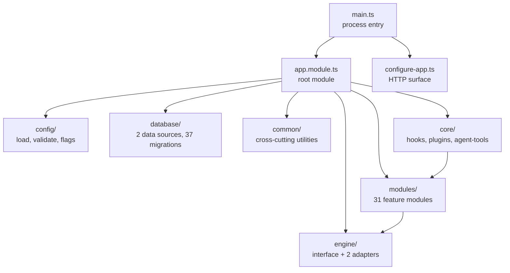

# Repository Map

> **Source of truth:** the `OpenWA/` working tree at commit `33f98b4ca5a56b02603d003aa77280f25e45222e`
> **Band:** Orientation · **Depends on:** 01-executive-summary.md · **Jarcube class:** MIXED

## Purpose

Where everything is. A lookup table from directory to responsibility, so you can navigate the tree
without opening it. Per-file detail lives in APPENDIX-E-file-atlas.md; this is the level above it.

## File Inventory

### Top level

| Path | Role |
| --- | --- |
| `src/` | The NestJS backend. Everything else on this list is support. |
| `dashboard/` | Independent Vite + React + TypeScript SPA with its own `package.json`. Built into `dashboard/dist` and served by the API process in production. |
| `sdk/` | Five hand-maintained client libraries: Go, Java, JavaScript, PHP, Python. Each released by its own workflow. |
| `docs/` | OpenWA's own 31-document set (27,883 lines), numbered `01`–`31`. User- and contributor-facing. |
| `scripts/` | Install-time patchers, contract-drift checkers, backup/restore shell scripts, OpenAPI exporter. |
| `charts/openwa/` | Helm chart: 13 templates, StatefulSet-based. |
| `test/` | 41 e2e specs plus fixtures, mocks, and Jest e2e config. Unit specs live beside their source in `src/`. |
| `data/` | Runtime state (gitignored content): SQLite files, generated env, session auth, media, plugins. |
| `dist/` | Build output. |
| `.github/workflows/` | 9 workflows: CI, release, security scan, SDK CI, and per-language SDK releases. |

### Root files

| Path | Role |
| --- | --- |
| `package.json` | Pins, 60+ scripts. The script list is itself documentation of the quality gates. |
| `openapi.json` | Committed API snapshot. `npm run openapi:check` diffs the live document against it. |
| `Dockerfile` | Multi-stage production image. |
| `docker-entrypoint.sh` | Privilege-dropping entrypoint. |
| `docker-compose.yml` | Production compose with optional profiles (Postgres, Redis, MinIO). |
| `docker-compose.dev.yml` | Development compose. |
| `docker-compose.local.yml` | Local-build compose. |
| `.env.example` | Documented knob reference. Note: it lists far fewer variables than the code reads — see APPENDIX-A-env-vars.md. |
| `.env.minimal` | Smallest working configuration. |
| `eslint.config.mjs` | Flat ESLint config. |
| `.trivyignore` | Accepted vulnerability exceptions for the security scan workflow. |
| `.dockerignore` | Verified by `scripts/check-dockerignore.mjs`. |

### `src/` layout

### `src/config/` — boot-time configuration

| Path | Role |
| --- | --- |
| `src/config/load-env.ts` | Runs on import. Merges three env layers into `process.env` before any module evaluates. |
| `src/config/env-precedence.ts` | The blank-shadowing fix and the two "who supplied this key" snapshots. |
| `src/config/env.validation.ts` | Hand-rolled fail-fast validation wired as ConfigModule's `validate`. |
| `src/config/configuration.ts` | The `ConfigService` namespace tree. |
| `src/config/feature-flags.ts` | Five runtime flags, centralised. |
| `src/config/bootstrap-security.ts` | CORS policy, Swagger gate, CSP upgrade gate, production secret assertions. |
| `src/config/bootstrap-fatal.ts` | Fatal-boot contract: log, bounded teardown, real `exit(1)`. |
| `src/config/process-error-monitor.ts` | Uncaught-exception monitor and unhandled-rejection classifier. |
| `src/config/storage-root.ts` | Writability probe for the media root, with a historical-bug migration. |
| `src/config/http-timeouts.ts` | Explicit `requestTimeout` / `headersTimeout` / `keepAliveTimeout`. |
| `src/config/inflight-body-budget.ts` | Aggregate body-bytes budget with per-client shares and a stall reaper. |
| `src/config/app-validation.ts` | Global prefix and the shared DTO validation contract. |
| `src/config/dashboard-csp.ts` | Per-response CSP nonce injection into the SPA document. |
| `src/config/swagger.config.ts` | Swagger document construction and the two post-processing passes. |

Detail: 04-bootstrap-and-lifecycle.md, 05-configuration-and-env.md.

### `src/engine/` — the WhatsApp abstraction (39,005 lines, the largest area)

| Path | Role |
| --- | --- |
| `src/engine/interfaces/whatsapp-engine.interface.ts` | The whole contract, 1,423 lines. |
| `src/engine/engine-capability-matrix.ts` | Per-adapter capability declarations with evidence. |
| `src/engine/engine.factory.ts` | Adapter selection by `ENGINE_TYPE`. |
| `src/engine/engine-registry.service.ts` | Live engine instances by session. |
| `src/engine/adapters/whatsapp-web-js.adapter.ts` + 21 `wwebjs-*.ts` | Chromium-backed adapter, split by domain. |
| `src/engine/adapters/baileys.adapter.ts` + 18 `baileys-*.ts` | WebSocket adapter, split by domain. |
| `src/engine/identity/` | JID/LID model, mapping entity and store. |
| `src/engine/types/` | Structural types for both upstream libraries. |
| `src/engine/builtin/` | Registration shims for the two built-in engines. |
| `src/engine/wa-web-version.ts` | WhatsApp Web version pinning. |

Detail: 10-engine-abstraction.md through 18-upstream-patching.md.

### `src/core/` — extensibility (15,798 lines)

| Path | Role |
| --- | --- |
| `src/core/hooks/` | Global hook manager, hook interfaces, the sending gate. |
| `src/core/plugins/` | Manifest, loader, lifecycle, host ports, capability context, install/uninstall. |
| `src/core/plugins/sandbox/` | Worker-thread isolation: protocol, capability router, worker-side shims. |
| `src/core/agent-tools/` | Protocol-neutral tool registry, descriptors, invoker, seven tool families. |

Detail: 57-plugin-system.md, 58-plugin-sandbox.md, 59-hooks-system.md, 60-agent-tools-and-mcp.md.

### `src/common/` — cross-cutting (9,476 lines)

| Path | Role |
| --- | --- |
| `src/common/cache/` | Optional Redis-backed cache. |
| `src/common/errors/` | 15 domain error classes mapped to HTTP statuses. |
| `src/common/metrics/` | Five metric families: request, send-pacing, session reconnect, session restriction, webhook delivery. |
| `src/common/middleware/` | Request context (request id) and request metrics. |
| `src/common/security/` | SSRF guard, constant-time compare, proxy-aware throttler guard, Bull Board auth, session scope. |
| `src/common/services/` | Logger, request context store, shutdown service. |
| `src/common/storage/` | Storage service, local-file adapter, transfer, orphan sweep. |
| `src/common/throttler/` | Redis throttler storage and its fail-fast client. |
| `src/common/utils/` | 15 utilities: path safety, secret files, pagination, template render, concurrency limiter, keyed mutation queue, DB error mapping, column types. |
| `src/common/media/` | Remote media loading. |
| `src/common/openapi/` | Shared response decorators for engine-status responses. |
| `src/common/transformers/` | Date column transformer. |

### `src/database/`

| Path | Role |
| --- | --- |
| `src/database/data-source.ts` | CLI data source for the `data` connection. |
| `src/database/data-source-main.ts` | CLI data source for the `main` connection. |
| `src/database/migrations/` | 31 migrations for the `data` connection. |
| `src/database/migrations-main/` | 1 migration for the `main` connection. |
| `src/database/pg-boot-migrations.ts` | Advisory-locked boot migration runner for Postgres. |
| `src/database/sqlite-file-permissions.ts` | Post-boot tightening of SQLite file modes to owner-only. |
| `src/database/load-cli-env.ts` | Env loading for the TypeORM CLI, which never runs ConfigModule. |

Detail: 70-database-design.md, 71-migrations.md.

### `src/modules/` — 31 feature modules

Grouped by what they are for, not alphabetically.

**WhatsApp domain**

| Module | Files | Lines | Subject |
| --- | --- | --- | --- |
| `src/modules/session` | 57 | 17,641 | The central aggregate: lifecycle, ownership, presence, chats, projection |
| `src/modules/message` | 34 | 10,899 | Send pipeline, types, acks, bulk, batches |
| `src/modules/group` | 8 | 2,104 | Groups, participants, membership requests |
| `src/modules/status` | 10 | 1,285 | Outbound status/story posting |
| `src/modules/status-store` | 6 | 1,370 | Inbound status TTL store with media persistence |
| `src/modules/contact` | 7 | 1,044 | Contacts, blocklist |
| `src/modules/channel` | 11 | 718 | Channels / newsletters |
| `src/modules/label` | 7 | 529 | WhatsApp Business labels |
| `src/modules/catalog` | 7 | 508 | Business catalog and products |
| `src/modules/profile` | 8 | 430 | Own profile: name, status, picture |
| `src/modules/call` | 8 | 236 | Incoming call handling |
| `src/modules/chat-media` | 3 | 764 | Opt-in chat media archive with retention |
| `src/modules/media` | 10 | 1,012 | Server-side conversion via ffmpeg |
| `src/modules/takeover` | 3 | 418 | Adopts sessions whose owning node's lease lapsed |

**Platform services**

| Module | Files | Lines | Subject |
| --- | --- | --- | --- |
| `src/modules/integration` | 45 | 7,438 | Integration Fabric: provider ingress, dedup, ordering, redrive |
| `src/modules/webhook` | 33 | 6,234 | Webhooks with HMAC, filters, outbox, reconciler |
| `src/modules/auth` | 25 | 3,814 | API keys, roles, guards, session scoping |
| `src/modules/plugins` | 17 | 3,463 | HTTP API over the plugin system |
| `src/modules/events` | 8 | 2,355 | Socket.IO gateway with Redis adapter |
| `src/modules/search` | 22 | 2,048 | Global message search, pluggable providers |
| `src/modules/mcp` | 8 | 1,063 | MCP Streamable-HTTP server |
| `src/modules/queue` | 10 | 1,057 | BullMQ queues and processors |
| `src/modules/automation` | 7 | 876 | Autoreply rules |
| `src/modules/audit` | 10 | 724 | Audit log with coverage enforcement |
| `src/modules/template` | 8 | 638 | Message templates with rendering |
| `src/modules/metrics` | 4 | 404 | Prometheus endpoint |
| `src/modules/stats` | 7 | 1,047 | Dashboard statistics |
| `src/modules/health` | 4 | 380 | Liveness and readiness |
| `src/modules/settings` | 4 | 185 | Runtime settings surface |

**Infrastructure control**

| Module | Files | Lines | Subject |
| --- | --- | --- | --- |
| `src/modules/infra` | 23 | 8,386 | Runtime config editing, env generation, data import/export, storage transfer |
| `src/modules/docker` | 6 | 1,744 | Sibling-container control via the Docker socket |

### `dashboard/` layout

| Path | Role |
| --- | --- |
| `dashboard/src/pages/` | 11 route-level pages |
| `dashboard/src/components/` | 26 components, 9 of them chat-specific under `dashboard/src/components/chats/` |
| `dashboard/src/hooks/` | 20 hooks: TanStack Query wrappers, WebSocket, session feed, forms |
| `dashboard/src/utils/` | 33 pure utilities |
| `dashboard/src/services/api.ts` | The single HTTP client |
| `dashboard/src/i18n/locales/` | 14 locale files, including RTL (`ar.json`, `he.json`) |
| `dashboard/scripts/` | Build-support scripts |
| `dashboard/tsconfig.*.json` | Four configs: app, node, test, root |

Detail: 80-dashboard-architecture.md through 88-dashboard-i18n-a11y-theming.md.

### `data/` runtime layout

Not source. Documented because its shape is part of the deployment contract.

| Path | Role |
| --- | --- |
| `data/main.sqlite` | The `main` connection: API keys, audit log. Always SQLite. |
| `data/openwa.sqlite` | The `data` connection when `DATABASE_TYPE=sqlite`. |
| `data/.env.generated` | Dashboard-saved configuration. Lowest env precedence. Mode 0600. |
| `data/.api-key` | Raw bootstrap admin key written on first boot. Mode 0600. |
| `data/media/` | Local storage backend root (`STORAGE_LOCAL_PATH`). |
| `data/sessions/` | whatsapp-web.js Chromium profiles and auth state. |
| `data/baileys/` | Baileys auth state. |
| `data/plugins/` | Installed plugin packages and their state. |

## Where the same concern lives in two places

Worth knowing before you go looking, because these pairs cause the most confusion:

| Concern | Locations | Why |
| --- | --- | --- |
| Env loading | `src/config/load-env.ts` and `src/database/load-cli-env.ts` | The TypeORM CLI never runs ConfigModule, so it loads env itself. |
| Migration running | `src/app.module.ts` (`migrationsRun`) and `src/database/pg-boot-migrations.ts` | Postgres runs boot migrations under a cross-replica advisory lock instead of TypeORM's unsynchronised built-in. |
| OpenAPI document | `src/main.ts` and `scripts/export-openapi.ts` | Live `/api/docs` and the committed snapshot are built separately; both apply the same two post-processing passes. |
| SQLite/Postgres path collision guard | `src/config/env.validation.ts:sqliteDataMainPathCollision`, called from both data sources | Same reason as env loading. |
| Puppeteer context-lost detection | `src/config/process-error-monitor.ts` and the wwebjs adapter | Deliberately duplicated so the bootstrap module never eagerly imports whatsapp-web.js. |
| Body parsing limits | `src/configure-app.ts` and `src/modules/mcp/mcp.server.ts` | MCP installs a route-level parser and must carry the same `inflate: false` flag. |

## Jarcube Portability

**Classification:** MIXED

**Rationale:** Structural orientation. The directory-level verdict: `src/engine` is ENGINE-COUPLED,
`src/modules/session` and the WhatsApp-domain modules are ENGINE-COUPLED, everything under
`src/common`, `src/core`, `src/config`, `src/database`, and the platform-service modules is PORTABLE,
`src/modules/docker` and `src/modules/infra` are NEEDS-REDESIGN.

**Prerequisites:** none

**Cloud API caveats:** none at this level.

## Open Questions

- `dist/` is present in the working tree. Whether it is committed or a local build artifact was not
  checked against `.gitignore` in detail.
- `sdk/java` carries 215 files against `sdk/go`'s 48, which suggests the Java SDK is generated or
  vendored rather than hand-written like the Go one. Resolved in the SDK band.
