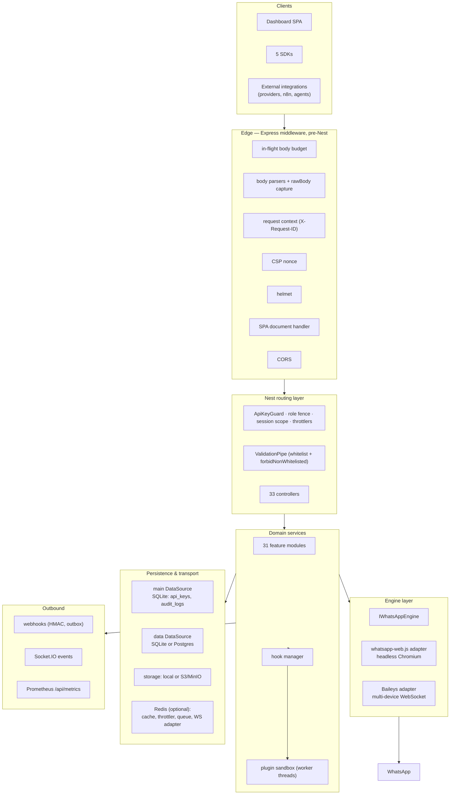
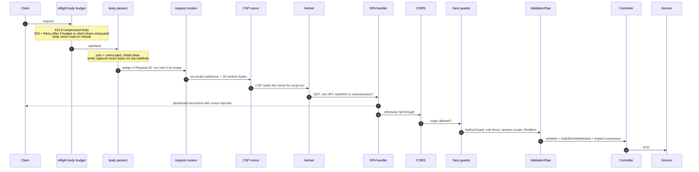
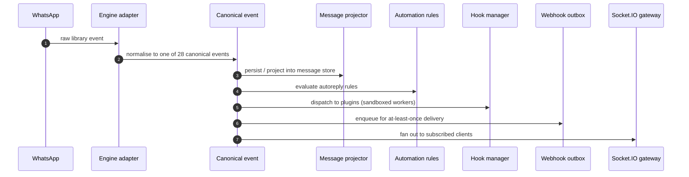

# Architecture Overview

> **Source of truth:** `src/app.module.ts`, `src/main.ts`, `src/configure-app.ts`, `src/engine/engine.module.ts`
> **Band:** Orientation · **Depends on:** 02-repository-map.md · **Jarcube class:** MIXED

## Purpose

How the pieces fit: the layer model, what the root module actually wires (including the four modules
that are conditionally absent), and the exact order a request passes through on its way in. This is the
doc to read before touching any subsystem, because several subsystems only make sense once you know
where they sit in the request path.

## Layer model

Four observations that matter more than the diagram:

1. **The edge is Express, not Nest.** Everything in the `edge` box is raw middleware installed by
   `src/configure-app.ts:configureApp` before Nest's routing layer sees the request. Guards cannot
   protect against anything that happens there, which is why the body budget exists as middleware
   rather than as a guard.
2. **The engine layer is entered only from domain services**, never from controllers directly. The
   registry (`src/engine/engine-registry.service.ts`) owns live instances keyed by session.
3. **Hooks and plugins hang off the domain layer, not the edge.** A plugin cannot intercept HTTP; it
   observes domain events and can gate sends.
4. **Redis is optional in four independent places** — cache, throttler storage, BullMQ, and the
   Socket.IO adapter — each with its own flag and its own degraded mode.

## Module graph

`src/app.module.ts` imports 31 feature modules plus 6 infrastructure modules. Four are **conditional**,
resolved at import time from `process.env` rather than through `ConfigService`, because they must be
absent from the DI graph entirely rather than merely inert:

| Module | Gate | Default | Why conditional |
| --- | --- | --- | --- |
| `QueueModule` | `QUEUE_ENABLED === 'true'` | off | Importing it opens Redis connections; a non-queue deployment must not attempt them. |
| `SearchModule` | `SEARCH_ENABLED !== 'false'` | **on** | Opt-out. Keeps zero-config first boot working while allowing a zero-footprint removal. |
| `McpModule` | `MCP_ENABLED === 'true'` | off | Avoids loading `@modelcontextprotocol/sdk` in non-MCP deployments. |
| `ServeStaticModule` | `SERVE_DASHBOARD !== 'false'` **and** a build exists | on when built | In dev the build is absent, so this stays inert and Vite serves the UI. |

The pattern is a `require()` inside an `if`, pushed into an array spread into `imports`. It is the one
place the codebase deliberately breaks the "read config through ConfigService" rule, and the comments
in `src/app.module.ts` say why.

Import order inside `imports` is load-bearing at the front: `HooksModule` and `PluginsModule` come
first (both global) so that later modules can resolve hook and plugin providers.

## The two DataSources

Not one database with two schemas — two independent TypeORM connections with different policies.

| | `main` | `data` |
| --- | --- | --- |
| Engine | always `better-sqlite3` | `better-sqlite3` or `postgres` (`DATABASE_TYPE`) |
| Owns | `src/modules/auth` + `src/modules/audit` entities | session, webhook, message, template, engine, integration, status-store, automation entities |
| Default file | `data/main.sqlite` | `data/openwa.sqlite` |
| Schema policy | `synchronize` **on** by default (`MAIN_DATABASE_SYNCHRONIZE`) | `synchronize` **off** by default; migrations run |
| Migrations dir | `src/database/migrations-main/` | `src/database/migrations/` |
| Boot migration runner | TypeORM `migrationsRun` | Postgres: advisory-locked `createBootDataSource`; SQLite: `migrationsRun` |

`synchronize` and `migrationsRun` are always mutually exclusive (`migrationsRun: !synchronize`) — never
both on the same connection, which would race the schema.

Two guards protect this arrangement:

- `src/config/env.validation.ts:sqliteDataMainPathCollision` refuses a configuration where the `data`
  SQLite file *is* the `main` file. Two connections on one file means two migration ledgers and two
  synchronize policies against the same tables.
- `src/database/sqlite-file-permissions.ts:SqlitePermissionsBoot` runs after every DataSource has
  initialised and tightens the SQLite files, which `better-sqlite3` creates with umask permissions,
  back to owner-only.

For Postgres, a non-`public` schema additionally sets `search_path` through pg's startup `options`
parameter, because the migrations contain raw unqualified DDL and TypeORM's `schema` option alone does
not affect `search_path`. Without it, raw DDL would land in `public` while the migration ledger landed
in the configured schema. Detail: 71-migrations.md.

## Request lifecycle

Order is exact and, per the comment in `src/configure-app.ts`, load-bearing.

Why the order is fixed:

- **Budget before parsers.** A refused connection must not buffer a byte. Guards run at the Nest
  routing layer, after middleware and after body buffering, so they can never stop slow-body memory
  pinning.
- **Nonce before helmet.** The CSP `script-src` directive is a function reading
  `res.locals.cspNonce`.
- **SPA handler before CORS and Nest.** Dashboard documents must be served with the nonce embedded in
  that exact response, so the handler owns them rather than `ServeStaticModule` (whose own catch-all
  fallback is explicitly disabled with an unmatched `renderPath` literal).

Two mounts sit outside this chain:

| Mount | Auth | Why outside |
| --- | --- | --- |
| `/api/admin/queues` (Bull Board) | `src/common/security/bull-board-auth.middleware.ts`, ADMIN key required | Mounted by `@bull-board/nestjs` as raw Express middleware that the global `ApiKeyGuard` does not cover. Registered before `listen()` so it runs ahead of the Bull Board router. |
| `/mcp` | MCP-specific auth and rate limits | Streamable-HTTP transport with its own route-level body parser. |

## Validation contract

`src/config/app-validation.ts:GLOBAL_VALIDATION_OPTIONS` is exported as an object rather than restated
as literals, specifically so specs construct the real pipe from the same source production uses. The
comment is explicit about why: a restated copy is a mirror, and a mirror drifts.

| Option | Value | Effect |
| --- | --- | --- |
| `whitelist` | `true` | Strips properties with no decorator |
| `forbidNonWhitelisted` | `true` | 400 on unknown properties rather than silently dropping |
| `transform` | `true` | DTO class instances, not plain objects |
| `transformOptions.enableImplicitConversion` | `true` | Query/param strings coerce to declared types |
| `disableErrorMessages` | environment-resolved | Hidden in production unless `VALIDATION_ERROR_DETAIL=true` |

`disableErrorMessages` is deliberately excluded from the exported object because it is resolved at call
time from the environment and is therefore not part of the contract a spec should reproduce.

## Event flow

The inbound path is the spine of the system.

Outbound sends run the reverse path through a gate stack: hooks can veto
(`src/core/hooks/sending-gate.ts`), pacing can delay or refuse
(30-message-send-pipeline.md), then the adapter performs the send. Detail:
15-engine-events.md, 53-webhooks.md, 54-websocket-events.md.

## Degradation matrix

The system is designed to run with almost everything optional turned off. What each dependency's
absence costs:

| Dependency | Flag | Absent behaviour |
| --- | --- | --- |
| Postgres | `DATABASE_TYPE=sqlite` | SQLite; single-node only in practice |
| Redis (cache) | `CACHE_ENABLED` | No caching layer |
| Redis (throttler) | `REDIS_ENABLED` | Per-process rate limits instead of cluster-wide; **fails open** on Redis error |
| Redis (queue) | `QUEUE_ENABLED` | Webhook and ingress delivery run inline instead of queued |
| Redis (WS adapter) | `REDIS_ENABLED` | WebSocket broadcasts reach only same-replica clients |
| S3/MinIO | `STORAGE_TYPE=local` | Local filesystem storage |
| ffmpeg | `MEDIA_CONVERSION_ENABLED` | No server-side conversion |
| Dashboard build | `SERVE_DASHBOARD` | API only |
| MCP SDK | `MCP_ENABLED` | No agent surface |

## File Inventory

| Path | Lines | Role |
| --- | --- | --- |
| `src/main.ts` | 232 | Process entry: env load, guards, Nest create, middleware, Swagger, Bull Board, timeouts, listen |
| `src/app.module.ts` | 328 | Root module: both DataSources, throttler, conditional modules, static serving |
| `src/configure-app.ts` | 232 | The entire Express edge, extracted so e2e runs the same stack |
| `src/config/app-validation.ts` | 39 | Global prefix + shared validation contract |
| `src/engine/engine.module.ts` | — | Engine layer wiring |
| `src/database/pg-boot-migrations.ts` | — | Advisory-locked Postgres boot migration runner |
| `src/database/sqlite-file-permissions.ts` | — | Post-init SQLite permission tightening |

## Configuration

Only the boot-shaping variables appear here; the rest are per-subsystem.

| Env var | Default | Effect |
| --- | --- | --- |
| `PORT` | `2785` | Listen port |
| `NODE_ENV` | unset | Unset means dev posture for four separate controls — see 04-bootstrap-and-lifecycle.md |
| `QUEUE_ENABLED` | `false` | Whether `QueueModule` is in the graph at all |
| `SEARCH_ENABLED` | `true` | Opt-out for `SearchModule` |
| `MCP_ENABLED` | `false` | Opt-in for the MCP server |
| `SERVE_DASHBOARD` | `true` | Whether the bundled SPA is served |
| `DATABASE_TYPE` | `sqlite` | Engine for the `data` connection |
| `REDIS_ENABLED` | `false` | Throttler storage and WS adapter |

Full list: APPENDIX-A-env-vars.md.

## Events Emitted / Consumed

This doc describes the topology, not the payloads. All 28 canonical events with their shapes are in
APPENDIX-B-events.md; the translation from raw library events is 15-engine-events.md.

## Failure Modes & Edge Cases

- **Bind failure after full init.** `listen()` runs the entire module init — database, Redis, plugin
  registration — before binding. A failed bind (`EADDRINUSE`) therefore happens with engines already
  starting. Setting `process.exitCode` alone would leave a zombie holding the event loop open and
  running sessions while serving no HTTP, invisible to Docker's restart policy. `runBootstrapOrExit`
  exits for real. Detail: 04-bootstrap-and-lifecycle.md.
- **Redis outage under Redis-backed throttling.** `RedisThrottlerStorage` fails open, so an outage
  never blocks the API. The client is built fail-fast so the fail-open engages immediately rather than
  after a per-request queue stall.
- **CORS denial.** Denials return `false` rather than throwing; throwing surfaced as HTTP 500. A
  wildcard origin is refused outright in production and collapses to same-origin.
- **Dashboard blank page.** In production the CSP emits `upgrade-insecure-requests`, so a browser
  reaching a non-TLS instance upgrades the UI's own script fetches to `https` and the page renders
  blank with nothing in the server log. Boot warns for both the broken and the behind-a-TLS-proxy
  case, because at boot there is no signal to tell them apart.

## Jarcube Portability

**Classification:** MIXED

**Rationale:** The layer model, the edge-middleware ordering discipline, the validation contract, and
the degradation matrix are all transport-independent and directly applicable. The engine layer and its
entry points are not.

**Prerequisites:** none for the patterns; the engine layer needs the whole 10–18 band.

**Cloud API caveats:** The event flow diagram's left edge (`WhatsApp → adapter → canonical event`)
becomes `Meta webhook → controller → canonical event` in a Cloud API world. Everything to the right of
the canonical event is unchanged, which is precisely why the canonical-event boundary is the right
seam to port at.

## Open Questions

- Whether the conditional-module `require()` pattern is load-order-safe under all bundlers was not
  verified; it works under `nest build` (tsc), which is what ships.
- `TakeoverModule` and `SessionOwnershipService` imply a multi-node design, but whether any deployment
  actually runs multi-node is not determinable from code. Explored in
  23-session-ownership-and-takeover.md.
