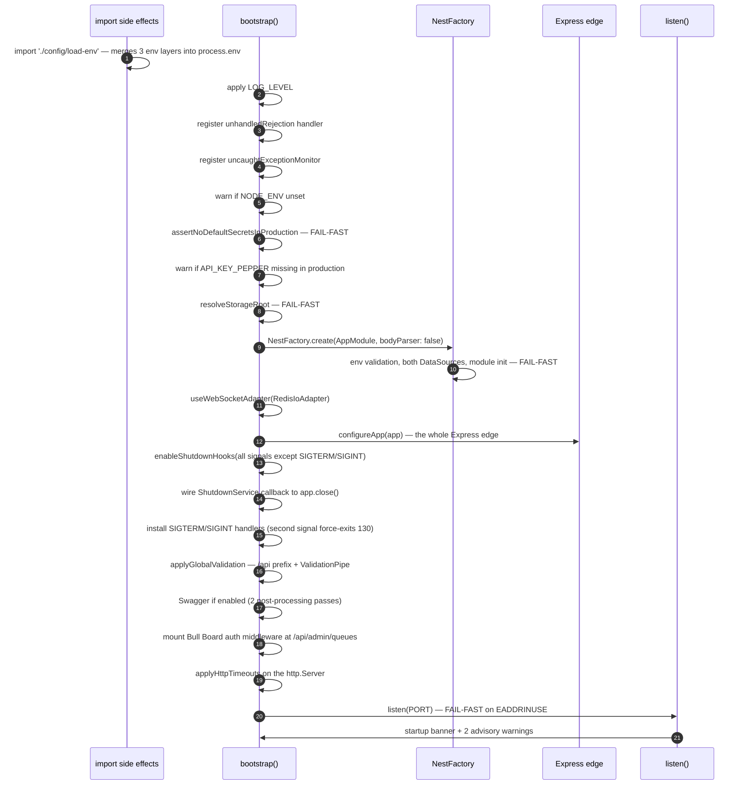
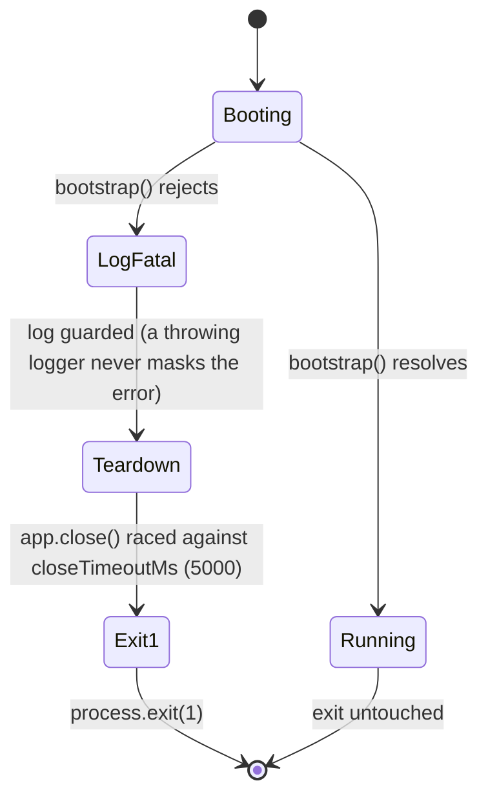
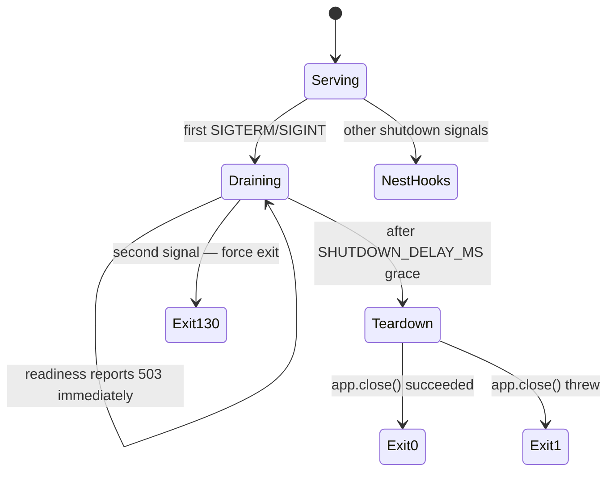

# Bootstrap and Process Lifecycle

> **Source of truth:** `src/main.ts`, `src/config/bootstrap-fatal.ts`, `src/config/bootstrap-security.ts`, `src/config/process-error-monitor.ts`, `src/common/services/shutdown.service.ts`, `src/config/http-timeouts.ts`, `src/config/storage-root.ts`, `docker-entrypoint.sh`
> **Band:** Orientation · **Depends on:** 03-architecture-overview.md · **Jarcube class:** PORTABLE

## Purpose

The full boot sequence, the four things that can refuse to start, how a failed boot is guaranteed not
to leave a zombie, and how the process drains on a signal. This subsystem is small in line count and
disproportionately valuable: most of it exists because a specific production failure was observed, and
the comments name the issue numbers.

## Boot sequence

Order in `src/main.ts` is exact. Steps marked **fail-fast** can terminate the process.



### Why `load-env` is an import, not a call

`src/config/load-env.ts` runs `loadEnvironment()` as a module side effect, and `src/main.ts` imports it
first. A statement in `bootstrap()`'s body would be too late: ES imports are hoisted, so the entire
module graph evaluates before the function body runs, and any module reading `process.env` at import
time — the comment names the webhook Worker's `@Processor` connection — would see pre-dotenv defaults.

### Why `bodyParser: false`

Nest's default parser is disabled at `NestFactory.create` so `configureApp` can install parsers with an
explicit size cap, the `rawBody` capture, and `inflate: false`. See 03-architecture-overview.md.

## The four fail-fast gates

| Gate | Source | Triggers when |
| --- | --- | --- |
| Default secrets in production | `src/config/bootstrap-security.ts:assertNoDefaultSecretsInProduction` | A required secret is empty, a known placeholder, or an explicit `API_MASTER_KEY` under 32 chars |
| Storage root unwritable | `src/config/storage-root.ts:resolveStorageRoot` | The media root cannot be created or written, and is not the known-bad historical value |
| Env validation | `src/config/env.validation.ts:validateEnv` | Any invalid value — see 05-configuration-and-env.md |
| Port bind | `listen()` → `src/config/bootstrap-fatal.ts:runBootstrapOrExit` | Address in use, or any other listen failure |

### Secret enforcement is a deny-list, not an allow-list

This is subtle and worth internalising. `assertNoDefaultSecretsInProduction` runs **before**
`NestFactory.create`, so `NODE_ENV` has not been through boot validation yet and is still an arbitrary
string. Recognising only `'production'` meant every unrecognised value — a `prod` typo, a `staging`
deployment — skipped the guard silently.

So the logic inverts: only `development`, `test`, and unset/blank skip the guard. Everything else is
treated as production.

```
nodeEnv === 'development' || nodeEnv === 'test' || !nodeEnv  → skip
anything else                                                → enforce
```

Unset skipping the guard is deliberate (a local `node dist/main` sets no `NODE_ENV`), but it means a
production deployment must set the variable. The runtime image and the Helm chart both do.

Note the asymmetry: `src/common/services/shutdown.service.ts` makes the **opposite** choice for the same
variable — unset keeps the production drain window. The comments call this out explicitly so the two are
not mistaken for mirrors of each other.

**Checked secrets, and only when actually in use:**

| Variable | Checked when | Exemption |
| --- | --- | --- |
| `DATABASE_PASSWORD` | `DATABASE_TYPE=postgres` | `POSTGRES_BUILTIN=true` **and** host unset or `postgres` |
| `S3_ACCESS_KEY` / `S3_SECRET_KEY` | `STORAGE_TYPE=s3` | `MINIO_BUILTIN=true` **and** `S3_ENDPOINT` hostname is `minio` |
| `API_MASTER_KEY` | whenever set | none; also enforces a 32-char floor |
| `REDIS_PASSWORD` | whenever set | only a known placeholder *value* is rejected — passwordless private-network Redis is supported |
| `ALLOW_DEV_API_KEY` | `=== 'true'` | none; it seeds the publicly documented `dev-admin-key` as ADMIN |

The built-in exemptions require **both** the built-in flag and an internal host. A host-pinned external
datastore with the built-in flag still gets its weak credential enforced, because it is reachable.

Forbidden values (`FORBIDDEN_PROD_SECRETS`): `openwa`, `minioadmin`, `your-secure-password`,
`dev-master-key`, `dev-admin-key`, `changeme`, `change-me`, `password`, `secret`, `admin`, `123456`,
`qwerty`, `root`, `test`, `demo`.

### Storage-root resolution has a historical-bug migration

`resolveStorageRoot` probes **writability**, not existence, and creates the directory if missing. The
distinction matters: `StorageService`'s own check is `if (!existsSync(root)) mkdirSync(root)`, which is a
silent no-op for a root that exists but is owned by another user — so the failure surfaced much later,
on the first media write.

It also carries a fossil migration. In v0.2.0–v0.7.3 `GET /infra/status` read a config key that never
existed and returned `./uploads` on every request, so any dashboard Infrastructure save in that window
persisted that value into `data/.env.generated`, which survives every upgrade. Both spellings
(`./uploads` and `uploads`, since `path.join` normalises) are recognised.

The rule:

| Configured root | Writable? | Outcome |
| --- | --- | --- |
| anything | yes | returned untouched, including a writable `./uploads` |
| `./uploads` or `uploads` | no | warn and fall back to `./data/media` |
| anything else | no | **throw** with resolved path and uid in the message |

A writable `./uploads` is deliberately left alone so a bare-metal install already using it is never
relocated out from under its existing media.

## Advisory warnings (not enforced)

Three things warn without changing behaviour. Each exists because the silent version was worse.

| Warning | Condition | Why advisory rather than fatal |
| --- | --- | --- |
| `NODE_ENV` unset | `src/config/bootstrap-security.ts:isNodeEnvUnset` | Unset is the deliberate local-dev default, but it degrades four controls at once: the default-secret guard is skipped, wildcard CORS is allowed, Swagger UI is served, validation error detail is exposed. |
| `API_KEY_PEPPER` unset in production | `isApiKeyPepperMissingInProduction` | Enabling a pepper re-hashes keys and invalidates existing ones, so it must stay opt-in. Without it, hashes are plain SHA-256 — still functional. |
| CSP upgrade trap | `isDashboardCspUpgradeTrapLikely` | Cannot distinguish a TLS proxy from direct HTTP at boot (`trust proxy` is off), so it fires for both and the text tells a proxied operator to ignore it. |

## Environment-gated behaviour

Five functions in `src/config/bootstrap-security.ts` share one shape: an explicit `'true'`/`'false'`
wins, and unset falls back to an environment-derived default. Learning the shape once covers all five.

| Function | Env var | Unset default |
| --- | --- | --- |
| `isSwaggerEnabled` | `ENABLE_SWAGGER` | on outside production, off in production |
| `isValidationErrorDetailEnabled` | `VALIDATION_ERROR_DETAIL` | on outside production, off in production |
| `isUpgradeInsecureRequestsEnabled` | `CSP_UPGRADE_INSECURE_REQUESTS` | **on in production only** |
| `resolveCorsPolicy` | `CORS_ORIGINS` | `['*']`; wildcard refused in production |
| `resolveBodyLimit` | `BODY_SIZE_LIMIT` | `25mb`; unparseable falls back to the default |

`resolveBodyLimit` deserves a note: an unparseable value (`unlimited`, `none`, a typo) resolves to a
null limit downstream, which **silently disables the cap**. So the pattern is deliberately
`/^\d+(\.\d+)?\s?(b|kb|mb|gb|tb|pb)?$/i` with a fallback rather than a pass-through.

`resolveCorsPolicy` couples credentials to specificity: `credentials` is only `true` with an explicit
allowlist, never with a wildcard, matching the CORS spec. In production a wildcard collapses to
`{ origins: [], allowAnyOrigin: false, credentials: false }` — same-origin only.

## Process error handling

Two handlers, deliberately different in severity and effect.

### `registerUncaughtExceptionMonitor`

Uses `uncaughtExceptionMonitor`, **not** `uncaughtException`. The distinction is the whole point:
`uncaughtExceptionMonitor` does not install a swallowing handler, so Node still prints its default
message and exits 1. The crash posture is unchanged — the container restart policy still fires, and the
process never continues on corrupted post-exception in-memory state (the engine/reconnect/limiter maps
could be mid-mutation). All this adds is the fatal stack routed through the structured log pipeline,
which a raw stderr print misses.

The body is guarded so a throw inside the monitor — a poisoned error whose `.stack` getter throws, a
`String()`-incompatible value, a downed logger — cannot mask the original error or change the exit code.

### `registerUnhandledRejectionHandler`

Node terminates on an unhandled rejection by default. For a long-running gateway that would let one
stray rejection kill every session, so this logs and stays up.

One class is downgraded to WARN: a Puppeteer rejection left behind when the page an `evaluate` was
waiting on goes away. whatsapp-web.js re-runs `inject()` from an async `framenavigated` listener it never
awaits, so a navigation or an engine teardown turns a still-pending evaluate into an ownerless
rejection. Matched by:

```
/execution context was destroyed|window\.require is not a function/i
```

Two alternatives, one cause. Only the first mirrors the wwebjs adapter's
`isExecutionContextDestroyedError` — deliberately duplicated rather than imported, because that module
eagerly pulls in whatsapp-web.js and this one loads during bootstrap where the engine must stay lazy.
The second is monitor-only on purpose: the adapter uses its own predicate to advise about a stale
browser profile, and a missing `window.require` is not evidence of that, so teaching it there would
produce a confidently wrong advisory.

Note the parameter shape: `warn`'s second argument is structured **context**, not a trace string. A
stack passed positionally type-checks and then replaces the logger name for the whole line, so the
stack goes in `{ reason: detail, action: 'page_context_lost_rejection' }`.

## Fatal boot contract

`src/config/bootstrap-fatal.ts:runBootstrapOrExit` wraps `bootstrap()`.



Why a real `process.exit(1)` rather than `process.exitCode`: `listen()` runs the full module init before
binding, and the detached session auto-start (`SessionService.onApplicationBootstrap`) is already
launching engines. Setting `exitCode` alone leaves the event loop held open by those handles — a zombie
serving no HTTP while still running WhatsApp sessions, and Docker's `restart: unless-stopped` never
fires because the container stays "running". Puppeteer's own `exit` handlers kill browser children as
the process goes down.

Every step is independently guarded: a throwing logger or a wedged teardown degrades to losing that one
step while the exit still proceeds. The exit is the guarantee an orchestrator relies on.

## Graceful shutdown

Signals are split. `app.enableShutdownHooks()` is called with **all signals except SIGTERM and SIGINT**,
so Nest owns the rest and those two route through the bounded drain instead.

An important API detail: `enableShutdownHooks` with an *empty* array registers **all** signals, so the
filtered list must be non-empty for the exclusion to hold. It is.



`src/common/services/shutdown.service.ts:ShutdownService`:

| Behaviour | Detail |
| --- | --- |
| Readiness | `markShuttingDown()` flips a flag the readiness probe reads, returning 503 so the load balancer stops routing before teardown |
| Idempotence | Two flags: `shuttingDown` and `shutdownScheduled`. A repeated signal never schedules a second grace timer, a second `app.close()`, or a second exit |
| Grace | `SHUTDOWN_DELAY_MS` if a valid non-negative integer; otherwise 3000, or 0 for explicit `development`/`test` |
| Cap | 30,000 ms, so a misconfigured value cannot exceed a typical SIGKILL window |
| Exit code | 0 when teardown completed, **1 when it threw** — an orchestrator must not read a resource-leaking shutdown as clean |

The `SHUTDOWN_DELAY_MS` default is the inverse of the secret-guard choice: **unset keeps the full 3s
production drain**, and only an explicit `development`/`test` skips it. That way an ad-hoc run that never
sets `NODE_ENV` still drains, while `nest start --watch` hot reloads and dev Ctrl+C are not slowed.

The second-signal force-exit (code 130) is gated on a dedicated "a signal already arrived" flag rather
than `isShuttingDown()`, because an admin restart also sets the latter. A first real signal arriving
during an admin-restart grace still drains gracefully instead of hard-exiting.

A teardown that *hangs* never reaches the exit at all. That case is bounded externally, by the
second-signal force-exit or the orchestrator's SIGKILL deadline.

## HTTP server timeouts

`src/config/http-timeouts.ts:applyHttpTimeouts` writes three timeouts and returns what it actually
applied, which boot logs.

| Env var | Server property |
| --- | --- |
| `REQUEST_TIMEOUT_MS` | `requestTimeout` |
| `HEADERS_TIMEOUT_MS` | `headersTimeout` |
| `KEEPALIVE_TIMEOUT_MS` | `keepAliveTimeout` |

Two traps it exists to avoid:

1. **Node requires `headersTimeout > keepAliveTimeout`.** It logs a warning and self-corrects otherwise,
   which is invisible to the operator. So a too-low value is bumped to `keepAliveTimeout + 1000` and the
   applied value is returned and logged rather than failing boot.
2. **The target must be `app.getHttpServer()`**, not `app.getHttpAdapter().getInstance()`. The latter is
   the Express *application* — a function with no such properties — so writing onto it is completely
   inert. The comment in `src/main.ts` is emphatic about this.

## Container lifecycle

`docker-entrypoint.sh` and the `Dockerfile` add a layer below the Node process: `dumb-init` as PID 1 for
correct signal forwarding and zombie reaping, and a privilege drop to a non-root user. Detail:
74-docker-and-compose.md.

## File Inventory

| Path | Lines | Role |
| --- | --- | --- |
| `src/main.ts` | 232 | The sequence itself |
| `src/config/load-env.ts` | 104 | Three-layer env merge, runs on import |
| `src/config/bootstrap-security.ts` | 254 | 8 exported gates: CORS, Swagger, validation detail, CSP, body limit, pepper, NODE_ENV, secrets |
| `src/config/bootstrap-fatal.ts` | 99 | Log, bounded teardown, real exit |
| `src/config/process-error-monitor.ts` | 97 | Exception monitor + rejection classifier |
| `src/config/storage-root.ts` | — | Writability probe + fossil migration |
| `src/config/http-timeouts.ts` | — | Timeout applicator with the ordering fix |
| `src/config/app-validation.ts` | 39 | Prefix + validation contract |
| `src/common/services/shutdown.service.ts` | — | Drain state machine |
| `docker-entrypoint.sh` | — | PID 1 and privilege drop |

Unit specs sit beside each: `src/config/bootstrap-security.spec.ts` (451 lines),
`src/config/bootstrap-fatal.spec.ts` (99), `src/config/process-error-monitor.spec.ts` (130).

## Configuration

| Env var | Default | Effect |
| --- | --- | --- |
| `PORT` | `2785` | Listen port |
| `BASE_URL` | `http://localhost:$PORT` | Advertised public URL in the banner |
| `LOG_LEVEL` | `info` | Applied before anything logs; invalid falls back to INFO |
| `NODE_ENV` | unset | Degrades four controls when unset; enforced as production for any unrecognised value |
| `SHUTDOWN_DELAY_MS` | `3000` (0 for dev/test) | Drain window, capped at 30,000 |
| `REQUEST_TIMEOUT_MS` / `HEADERS_TIMEOUT_MS` / `KEEPALIVE_TIMEOUT_MS` | see `src/config/configuration.ts` | HTTP server timeouts |
| `ENABLE_SWAGGER` | env-derived | Swagger UI at `/api/docs` |
| `VALIDATION_ERROR_DETAIL` | env-derived | Field-level validation messages |
| `CSP_UPGRADE_INSECURE_REQUESTS` | production only | CSP directive |
| `CORS_ORIGINS` | `*` (refused in production) | Origin allowlist |
| `BODY_SIZE_LIMIT` | `25mb` | Per-request body cap |
| `INFLIGHT_BODY_BUDGET_BYTES` | `4 × BODY_SIZE_LIMIT` | Aggregate in-flight cap |
| `API_MASTER_KEY` | unset | Seeds an ADMIN key; 32-char floor in production |
| `API_KEY_PEPPER` | unset | HMAC key hashing; warns when unset in production |
| `ALLOW_DEV_API_KEY` | `false` | Refused in production |
| `STORAGE_LOCAL_PATH` | `./data/media` | Media root; must be writable or boot fails |

Full list: APPENDIX-A-env-vars.md.

## Events Emitted / Consumed

None. This subsystem predates and outlives the event system.

## Failure Modes & Edge Cases

| Scenario | Behaviour |
| --- | --- |
| Weak secret in production | Boot throws with the offending variable names listed |
| `NODE_ENV=prod` (typo) with weak secrets | Enforced, because the guard is a deny-list |
| Storage root owned by another user | Boot throws with resolved path and uid |
| Storage root is the `./uploads` fossil, unwritable | Warn, fall back to `./data/media`, state that old media is unrecoverable |
| `EADDRINUSE` after full init | Log, bounded 5s teardown, `exit(1)` — never a zombie |
| Uncaught exception | Structured log, then Node's default print and exit 1 |
| Ownerless Puppeteer rejection | WARN with the stack in context; process stays up |
| Any other unhandled rejection | ERROR; process stays up |
| Double Ctrl+C | Second signal exits 130 immediately |
| Teardown throws | Exit 1 |
| Teardown hangs | Not bounded here; bounded by second signal or SIGKILL |
| `headersTimeout <= keepAliveTimeout` | Bumped to `keepAliveTimeout + 1000`, logged |
| No dashboard build | Startup line says the UI is disabled; API still serves `/api` |

## Jarcube Portability

**Classification:** PORTABLE

**Rationale:** Entirely transport-independent. Every mechanism here — the deny-list secret guard, the
real-exit fatal contract, the readiness-first drain with an exit code that mirrors teardown, the
`uncaughtExceptionMonitor` choice, the `headersTimeout` normalisation, the writability probe — is a
generic Node/Nest production concern, and each one encodes a lesson that is cheaper to copy than to
relearn.

**Prerequisites:** none. This is the single best first port: small, self-contained, immediately useful,
and it establishes the config plumbing that later waves need.

**Cloud API caveats:** none. The only OpenWA-specific coupling is the engine-teardown reasoning in the
zombie-prevention comments, which still applies to any process holding long-lived external connections.

**Specific recommendations for Jarcube:**

- Copy `runBootstrapOrExit` verbatim. Any Nest app that initialises before binding has the zombie
  problem.
- Copy the deny-list `NODE_ENV` treatment. The "a `prod` typo silently skipped every production guard"
  failure is not hypothetical.
- Copy the `ShutdownService` readiness-503-then-drain shape, including the exit code mirroring teardown
  success.
- Adopt `uncaughtExceptionMonitor` over `uncaughtException` if Jarcube currently swallows.

## Open Questions

- `MAX_SHUTDOWN_DELAY_MS` is 30,000. Whether that is below the deployment's actual SIGKILL deadline
  (Kubernetes `terminationGracePeriodSeconds`, Docker's 10s default) is a chart/compose question —
  followed up in 75-kubernetes-helm.md and 74-docker-and-compose.md.
- The startup banner reads `process.env.BASE_URL` directly rather than through `ConfigService`. Whether
  that is intentional or a leftover was not determined.
