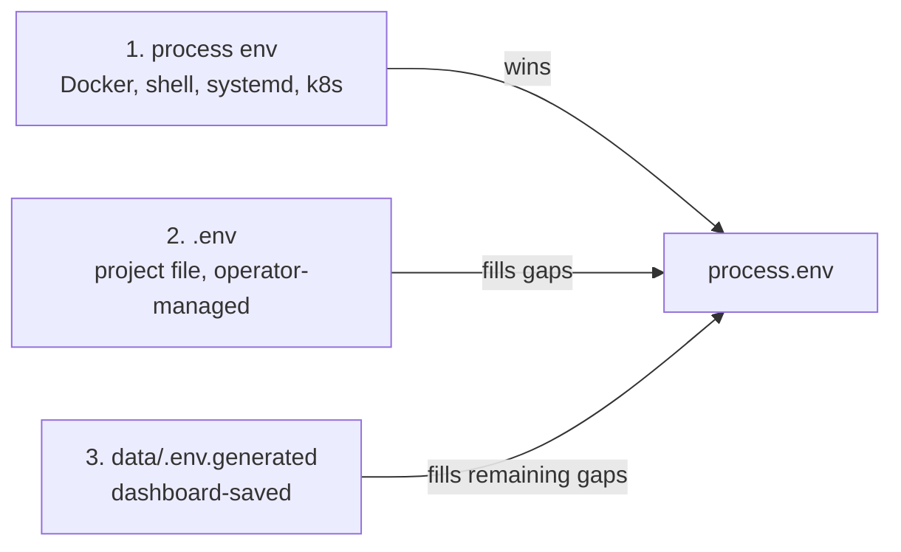
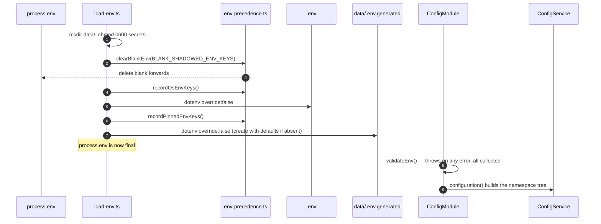

# Configuration and Environment

> **Source of truth:** `src/config/load-env.ts`, `src/config/env-precedence.ts`, `src/config/env.validation.ts`, `src/config/configuration.ts`, `src/config/feature-flags.ts`
> **Band:** Orientation · **Depends on:** 04-bootstrap-and-lifecycle.md · **Jarcube class:** PORTABLE

## Purpose

How a value gets from an operator's hand into a running service, and every trap that path contains.
This is one of the highest-value docs in the set for a port: OpenWA's config layer is unusually
hardened, and each hardening exists because a specific silent misconfiguration was observed in the
field. The comments name the issues.

## The three-layer merge

`src/config/load-env.ts` runs `loadEnvironment()` as an import side effect. Later sources never
override earlier ones (`dotenv.config({ override: false })`).



The rationale is stated in the source: explicit env vars from the host or orchestrator must always win,
so an operator can override dashboard-saved config without hand-editing `data/.env.generated`.

On first run, `data/.env.generated` does not exist and is created with a minimal default set
(`DATABASE_TYPE=sqlite`, `REDIS_ENABLED=false`, `QUEUE_ENABLED=false`, `STORAGE_TYPE=local`,
`STORAGE_LOCAL_PATH=./data/media`) via `src/common/utils/secret-file.ts:writeSecretFile`, i.e. mode
0600. Pre-existing `data/.env.generated` and `data/.api-key` are best-effort `chmod 0600`'d on every
boot, because earlier versions wrote them with umask permissions.

## The blank-shadowing trap

This is the single most important thing in this doc, and the least obvious.

The bundled compose files forward operator values with `- KEY=${KEY:-}`. That pattern forwards a real
value when one is set, and renders an **empty string** when none is. An empty string still occupies
`process.env`, so under `override: false` it **blocks both file layers from supplying a value** — the
dashboard's saved selection silently never applies, and the code sees an empty string rather than the
default it would have chosen.

The fix is `src/config/env-precedence.ts:clearBlankEnv`, called before anything else, which deletes any
key in `BLANK_SHADOWED_ENV_KEYS` whose value is blank. A real non-empty value is untouched and keeps
top precedence.

`BLANK_SHADOWED_ENV_KEYS` currently lists **over 180 keys**. The governing rule, stated in the source,
is that **every** `${KEY:-}` forward in `docker-compose.yml` belongs in the list — being
dashboard-managed is explicitly *not* a further condition, because `data/.env.generated` is documented
as hand-editable and `saveConfig` preserves keys it does not own.

`src/config/env-precedence.spec.ts` derives the expected set from the compose file and fails when the
two drift. That spec is what keeps the list honest, and it is the reason the list is a flat array
literal rather than a computed set.

**Known cost of getting this wrong:** the comments record that `AUTO_START_SESSIONS` gained a compose
forward in v0.12.0 without a matching entry here, so the blank forward shadowed the file and auto-start
silently stayed off. Sessions sat at `disconnected` with no engine and no error to go on.

## Two precedence snapshots

After the merge, all three layers are indistinguishable inside `process.env` — a file value looks
exactly like an orchestrator override. Two different questions need to distinguish them, and they need
**different** answers, so there are two snapshots taken at two different moments.

| Snapshot | Taken | Answers | Absent-snapshot default |
| --- | --- | --- | --- |
| `recordOsEnvKeys` / `isOsProvidedEnv` | after blank-clearing, **before** any dotenv load | "Did the host supply this?" — used by the save-config boot guard | **true** (every key counts as host-supplied) |
| `recordPinnedEnvKeys` / `isEnvPinned` | after `.env`, **before** `data/.env.generated` | "Can the dashboard change this at all?" — drives the Infrastructure page's "pinned by environment" warning | **false** |

The opposite defaults are deliberate, and the reasoning is worth internalising: the save guard must
assume an override it cannot see (fail safe), while a user-facing warning must never be invented (fail
quiet). Same variable, two questions, two correct answers.

A project `.env` pins exactly as hard as an orchestrator variable does for the *dashboard* question,
which is why `pinnedEnvKeys` is snapshotted after `.env` loads and `osEnvKeys` before it.

Because `clearBlankEnv` runs before both snapshots, a blank compose forward is already gone and
correctly does not count as a pin.

## Boot validation

`src/config/env.validation.ts:validateEnv` is wired as `ConfigModule`'s `validate` callback, so a
misconfigured deployment is rejected at boot rather than coercing silently or failing on first use. It
is hand-rolled to avoid a `joi` dependency.

### The decimal-integer rule

The most generally useful idea here. Numeric knobs are read downstream with `parseInt(raw, 10)`, which
silently truncates spellings `Number()` would accept:

| Written | `Number()` | `parseInt(x, 10)` | Consequence |
| --- | --- | --- | --- |
| `1e6` | 1000000 | **1** | Validated one value, configured another |
| `0x100` | 256 | **0** | Same, and 0 is often an opt-out sentinel |

So validation requires `/^\d+$/` — plain decimal digits — which makes the validated value and the
parsed value necessarily identical. `src/config/configuration.ts:resolveNonNegativeIntEnv` applies the
same rule on the read side.

The related trap: `Number('')` is `0`. A blank value — exactly what a `${KEY:-}` forward renders — would
pass every `Number.isFinite(x) && x >= 0` guard and land on the opt-out sentinel, disabling a memory
cap, a reaper, or a retry backoff. `resolveNonNegativeIntEnv` treats blank as unset and reserves `0`
for an explicit opt-out.

### Validator families

| Validator | Rule | Applied to |
| --- | --- | --- |
| `checkEnum` | Must be a registered id | `ENGINE_TYPE` (`whatsapp-web.js`, `baileys`), `STORAGE_TYPE` (`local`, `s3`), `DATABASE_TYPE` (`sqlite`, `postgres`) |
| `checkPort` | Integer in `[1, 65535]` | `PORT`, `DATABASE_PORT`, `REDIS_PORT` |
| `checkNonNegativeInt` | `>= 0`, decimal | 18 keys where `0` is a documented opt-out |
| `checkPositiveInt` | `>= 1`, decimal | 22 keys where `0` would be a self-DoS |
| `checkInt` | Signed decimal | `AUDIT_RETENTION_DAYS` only, where `<= 0` disables retention |

The enum whitelist exists because the factories *swallow* unknown values: `engine.factory` falls back to
whatsapp-web.js on an unknown `ENGINE_TYPE`, and storage falls back to local. A typo would silently
select the default forever.

The positive-vs-non-negative split is not stylistic. `0` for `RATE_LIMIT_SHORT_LIMIT` disables that
throttling tier — a self-DoS. `0` for `WEBHOOK_TIMEOUT` aborts every delivery immediately. `0` for
`WEBHOOK_MAX_PAYLOAD_BYTES` rejects every dispatch, i.e. a total silent webhook outage. `0` for
`INFLIGHT_BODY_BUDGET_BYTES` refuses every request carrying a body. `0` for
`PUPPETEER_PROTOCOL_TIMEOUT_MS` arms no timer at all, so a wedged renderer holds the request forever.

### `NODE_ENV` is checked raw, not trimmed

`nodeEnvAllowed = ['production', 'development', 'test']`, and the check reads `config.NODE_ENV`
**verbatim** rather than through the trimming `str()` helper. The reason: every production hardening in
the repo compares `process.env.NODE_ENV` exactly, so a padded `' production '` that only matches after
trimming would validate clean here and still take the permissive branch at runtime — blessing the exact
downgrade this check exists to prevent.

Unset stays legal because it is the standard default for a plain `node dist/main`. All packaged runtimes
set it: the image carries `ENV NODE_ENV=production`, the chart sets it, and both compose files set it.

### Cross-field guards

These are the interesting ones — validations no single-field schema could express.

| Guard | Rule | Why |
| --- | --- | --- |
| SQLite path collision | `DATABASE_NAME` must not resolve to the `main` DB file | Two TypeORM connections on one SQLite file run separate migration ledgers and synchronize policies against the same tables. Both paths are resolved exactly like the runtime and normalised to absolute, so `./data/../data/main.sqlite` is caught. |
| Postgres name leaking into SQLite | For SQLite, `DATABASE_NAME` must contain a separator or a `.sqlite`/`.db` suffix | A bare `openwa` becomes the SQLite file *path*, opening a file named `openwa` under the read-only app rootfs → `SQLITE_CANTOPEN` boot-loop. |
| Postgres + synchronize | `DATABASE_SYNCHRONIZE=true` is refused with `DATABASE_TYPE=postgres` | The Postgres data connection always runs migrations. `synchronize` re-syncs from entities on every boot and immediately **drops the migration-created `body_ts` generated tsvector column** (the Message entity does not declare it), so `/search` returns 501 after every restart. |
| Postgres schema identifier | `/^[A-Za-z_][A-Za-z0-9_]{0,62}$/`, and no `pg_` prefix | The migrations use raw `CREATE TABLE "<schema>"."..."` DDL. A typo would only fail at migration time. |
| Postgres required fields | `DATABASE_HOST`, `DATABASE_USERNAME`, `DATABASE_PASSWORD` required | Would otherwise fail on first query. |
| Lease vs heartbeat | `SESSION_LEASE_HEARTBEAT_MS * 2 < SESSION_LEASE_TTL_MS`, strictly | At exactly half, two renewals span the whole TTL, so one missed renewal lands on the expiry instant — a tie any scheduling jitter turns into a lapse. Peers then adopt sessions from a healthy node with nothing in the logs explaining why. Defaults are substituted for whichever key is unset, so a lone oversized heartbeat cannot slip through. |
| `NODE_URL` shape | Must parse as an absolute URL; embedded credentials refused | `localhost:2785` parses with scheme `localhost:` and only fails at the first forward, as a 500 on a request that had nothing wrong with it. Credentials parse fine but undici's fetch rejects them outright, so every forward would 503 permanently with the credentials sitting in `sessions.nodeUrl`. |
| `PUPPETEER_PROTOCOL_TIMEOUT_MS` ceiling | `<= 2147483647` (`MAX_TIMER_MS`) | Above that a `setTimeout` overflows its 32-bit signed field, warns `TimeoutOverflowWarning`, and **fires after 1 ms**. An operator reaching for "effectively unlimited" by typing a row of nines gets the shortest possible timeout and the browser never finishes launching. Rejected rather than clamped, so they learn the value they wrote is not the value they would get. |
| `BAILEYS_WA_VERSION` | `major === 2`, `minor >= 2000`, either `.` or `,` separators | A malformed pin would be accepted and then fail obscurely inside Baileys. |

### An array literal that must stay an array literal

`src/config/env.validation.ts` contains a one-element `for (const key of ['AUDIT_RETENTION_DAYS'])`
loop with a comment forbidding its simplification. `src/config/docs-env-example.spec.ts` derives the
keys it requires `.env.example` to document by **scanning `'KEY',` array elements in this file**.
Collapsing the loop into a bare call would silently drop the knob out of that documentation gate.

This is a good example of the repo's general habit: the shape of the code is load-bearing for a
meta-test. Worth knowing before "tidying" anything in `src/config/`.

## The ConfigService namespace tree

`src/config/configuration.ts` default-exports a factory returning one nested object. `ConfigService.get`
reads dotted paths into it.

| Namespace | Covers | Detailed in |
| --- | --- | --- |
| `port`, `dataDir` | Listen port, persistent state root | 04-bootstrap-and-lifecycle.md |
| `http.*` | Three timeouts + `inflightBodyBudgetBytes` | 04-bootstrap-and-lifecycle.md |
| `search.*` | `enabled`, `provider`, `limitMax` | 61-search.md |
| `stats.cacheTtlMs` | Memoisation of `/stats` aggregates | 64-metrics-and-stats.md |
| `features.*` | The five feature flags | this doc |
| `sendPacing.*` | Warm-up schedule, caps, breaker | 30-message-send-pipeline.md |
| `redis.*` | Host, port, credentials, connect timeout | 72-cache-redis.md |
| `queue.enabled`, `cache.enabled` | Opt-ins | 55-queue-bullmq.md, 72-cache-redis.md |
| `database.*` | The `main` connection (always SQLite) | 70-database-design.md |
| `dataDatabase.*` | The `data` connection, both engines | 70-database-design.md |
| `engine.*` | Type, Puppeteer options, session paths, Baileys auth dir | 11-engine-factory-registry.md, 13-adapter-wwebjs.md |
| `sessions.maxConcurrent` | Concurrency cap on running engines | 20-session-lifecycle.md |
| `webhook.*` | 8 knobs: timeout, retry, concurrency, queue depth, payload caps, drain | 53-webhooks.md |
| `api.rateLimit.*` | Three named throttler tiers | 52-rate-limiting.md |
| `websocket.*` | Frame bucket, handshake window, socket cap | 54-websocket-events.md |
| `security.trustedProxies` | Proxy allowlist for client-IP resolution | 51-security-controls.md |
| `plugins.*` | Dirs, catalog URL, download cap, capability timeout, storage cap | 57-plugin-system.md |
| `ingress.allowUnsigned` | Unsigned provider ingress opt-in | 56-integration-fabric.md |
| `status.*` | Status media cap, orphan sweep, grace | 36-status-stories.md |
| `chatMedia.*` | Archive flags, cap, TTL, sweep, grace | 34-media-pipeline.md |
| `session.*` | Node identity, lease TTL/heartbeat, takeover sweep, proxy timeout | 23-session-ownership-and-takeover.md |
| `automation.maxPerSession` | Autoreply rule cap | 62-automation-rules.md |
| `mediaConversion.*` | ffmpeg path, timeout, output cap, concurrency | 34-media-pipeline.md |
| `template.renderMaxChars` | Rendered-template ceiling | 35-templates.md |
| `storage.*` | Type, local path, S3 settings | 73-storage-adapters.md |

### The recurring fail-safe parse

Most byte and millisecond knobs use this inline IIFE:

```ts
// src/config/configuration.ts — the shape repeated ~20 times
(() => {
  const n = parseInt(process.env.SOME_KNOB ?? '', 10);
  return Number.isFinite(n) && n > 0 ? n : DEFAULT;
})()
```

`Number.isFinite` rather than `??` is the point: `parseInt('abc', 10)` is `NaN`, and `NaN ?? x` is
`NaN`, not `x`. A `NaN` cap silently disables the check it was supposed to enforce, because
`payloadBytes > NaN` is always false. Whether the guard is `> 0` or `>= 0` encodes whether `0` is a
legal opt-out for that specific knob, and the comment at each site says which.

### Named constants worth knowing

| Constant | Value | Why it exists |
| --- | --- | --- |
| `DEFAULT_DATA_DIR` | `./data` | Relative on purpose: the image sets `WORKDIR /app` and mounts the volume at `/app/data`, so it resolves onto the volume without the config knowing whether it is containerised. |
| `DEFAULT_PLUGINS_DIR` | `./data/plugins` | Must be the same tree as the plugin registry. |
| `LEGACY_PLUGINS_DIR` | `./plugins` | The ≤ 0.12.1 default, still scanned as a fallback. |
| `MAX_TIMER_MS` | `2147483647` | Node's timer ceiling. Duplicated in `src/config/env.validation.ts`; a spec asserts the two agree. |
| `PINNED_BROWSER_LOCALE` | `en-US` | WhatsApp Web renders its chrome in the browser's language, and the wwebjs onboarding-modal detector matches visible English text. Without a pin the language differs between the amd64 (Chrome for Testing) and arm64 (Debian chromium) images. |

Two subtleties around those last two:

**There is deliberately no `DATA_DIR` knob.** Every other data path (`DATABASE_NAME`,
`MAIN_DATABASE_NAME`, `SESSION_DATA_PATH`, `BAILEYS_AUTH_DIR`, `STORAGE_LOCAL_PATH`) carries its own
override and none would follow it, so a knob by that name would move part of the state while appearing
to move all of it. `PLUGIN_STATE_DIR` is that objection answered rather than repeated: it reaches
exactly one consumer, so it is named for what it actually moves.

**`withPinnedBrowserLocale` is applied after the `PUPPETEER_ARGS` override, not baked into the default
string.** `PUPPETEER_ARGS` *replaces* the defaults, so a deployment customising args for an unrelated
reason would otherwise silently lose the locale pin and the onboarding detector with it. An explicit
`--lang` always wins. It returns a **new** array and never mutates the input, because the resolved args
object is shared by every session and pushing per-session flags onto a shared array leaked proxy
settings across sessions once already.

`PUPPETEER_ARGS` also splits on `/[\s\S,]+/`-style delimiters (`/[\s,]+/`) to accept both commas
(`.env`, compose) and spaces (the dashboard Infrastructure form persists space-separated). A single
glued token like `"--no-sandbox --disable-gpu"` would silently neuter `--no-sandbox`.

## Feature flags

`src/config/feature-flags.ts` centralises five flags so their env names and defaults live in one place.

| Flag | Env var | Semantics | Default |
| --- | --- | --- | --- |
| `autoStartSessions` | `AUTO_START_SESSIONS` | `=== 'true'` (opt-in) | off |
| `storeEphemeralMessages` | `STORE_EPHEMERAL_MESSAGES` | `!== 'false'` (opt-out) | **on** |
| `resolveLidToPhone` | `RESOLVE_LID_TO_PHONE` | `=== 'true'` (opt-in) | off |
| `simulateTyping` | `SIMULATE_TYPING` | `!== 'false'` (opt-out) | **on** |
| `simulateTypingMaxMs` | `SIMULATE_TYPING_MAX_MS` | `Number(x) || 5000` | 5000 |

The `Number(x) || 5000` parse is called out in the source as intentionally different from `parseInt`:
`0`, negatives, empty, and non-numeric all fall back to 5000, whereas `parseInt` would keep a literal
`0`.

`resolveFeatureFlags(configService?)` prefers the `ConfigService` snapshot and falls back to a live
`process.env` read when `ConfigService` is absent — a unit test constructing a service without the
global `ConfigModule`. Env vars do not change during a process lifetime, so the two are equivalent in
production; the fallback exists purely to preserve live-read behaviour for tests that mutate
`process.env`.

`sendPacing` is deliberately **not** a feature flag: every field needs clamping because a bad value
decides whether messages are refused outright. See `src/modules/message/send-pacing.config.ts` and
30-message-send-pipeline.md.

## Flow



Note the ordering constraint: **validation runs after the merge**, so it validates the effective value,
not the operator's literal input. And `clearBlankEnv` runs before both snapshots, so a blank forward is
invisible to them.

## File Inventory

| Path | Lines | Role |
| --- | --- | --- |
| `src/config/load-env.ts` | 104 | The three-layer merge, secret-file permissions, first-run creation |
| `src/config/env-precedence.ts` | 302 | `BLANK_SHADOWED_ENV_KEYS` (~180 entries) and the two snapshots |
| `src/config/env.validation.ts` | 477 | Fail-fast validation, five validator families, seven cross-field guards |
| `src/config/configuration.ts` | 539 | The `ConfigService` namespace tree, ~24 namespaces |
| `src/config/feature-flags.ts` | — | Five flags, centralised |
| `src/modules/message/send-pacing.config.ts` | — | Pacing config with clamping, imported by `configuration.ts` |
| `src/modules/events/ws-rate-limit.ts` | — | WS limits, imported by `configuration.ts` |
| `src/database/load-cli-env.ts` | — | Env loading for the TypeORM CLI, which never runs `ConfigModule` |
| `.env.example` | — | Documented knob reference, gated by `src/config/docs-env-example.spec.ts` |
| `.env.minimal` | — | Smallest working configuration |

Specs: `src/config/env.validation.spec.ts` (441), `src/config/configuration.spec.ts` (401),
`src/config/env-precedence.spec.ts` (360), `src/config/feature-flags.spec.ts` (112),
`src/config/docs-env-example.spec.ts` (93).

## Configuration

The whole doc is configuration. The complete identifier list with defaults, validation, consumer, and
production implications is APPENDIX-A-env-vars.md.

Worth stating once here: **`.env.example` lists far fewer variables than the code reads.** The example
file documents 12 assignments; `src/config/env.validation.ts` and `src/config/configuration.ts` between
them reference ~181 distinct identifiers, and `BLANK_SHADOWED_ENV_KEYS` alone lists over 180. Do not
treat `.env.example` as the surface. `src/config/docs-env-example.spec.ts` enforces documentation only
for the keys it can derive by scanning array literals, which is a subset.

## Events Emitted / Consumed

None directly. `src/modules/infra` emits audit events when configuration is saved through the
dashboard — see 66-infra-management.md.

## Failure Modes & Edge Cases

| Scenario | Behaviour |
| --- | --- |
| Blank `${KEY:-}` compose forward for a listed key | Cleared; file layers supply the value |
| Blank forward for an **unlisted** key | Shadows both file layers silently. The spec derived from compose is what prevents this |
| `1e6` in a numeric knob | Rejected at boot (`parseInt` would read `1`) |
| `abc` in a numeric knob | Rejected at boot (would become `NaN` and disable the guard) |
| `NODE_ENV=' production '` | Rejected — checked raw, because the readers compare verbatim |
| `NODE_ENV=prod` | Rejected by validation; note the secret guard treats it as production anyway |
| `DATABASE_NAME=openwa` with SQLite | Rejected with an explanatory message; would otherwise `SQLITE_CANTOPEN` boot-loop |
| `DATABASE_NAME` pointing at the main DB file | Rejected; resolved absolute so relative spellings are caught |
| `DATABASE_SYNCHRONIZE=true` with Postgres | Rejected; would drop the FTS tsvector column every boot |
| `SESSION_LEASE_HEARTBEAT_MS >= TTL/2` | Rejected; sessions would be adopted from healthy nodes silently |
| `PUPPETEER_PROTOCOL_TIMEOUT_MS` above `MAX_TIMER_MS` | Rejected; would fire after 1 ms |
| `NODE_URL=localhost:2785` | Rejected; parses with scheme `localhost:` |
| `NODE_URL` with credentials | Rejected; undici rejects them, and they would be persisted to the DB |
| `PUPPETEER_ARGS` set without `--lang` | Locale pin appended afterwards, so the onboarding detector keeps working |
| `PUPPETEER_ARGS` as one glued token | Split on whitespace and commas, so `--no-sandbox` is not neutered |
| Dashboard saves a key pinned by `.env` | `isEnvPinned` drives a warning; the save persists but does not take effect |
| Unit test with no snapshot taken | `isOsProvidedEnv` → true (fail safe), `isEnvPinned` → false (never invent a warning) |

All validation errors are **collected**, not thrown on first failure, so one boot attempt reports every
problem.

## Jarcube Portability

**Classification:** PORTABLE

**Rationale:** Entirely transport-independent, and unusually dense in hard-won lessons. Nothing here
knows anything about WhatsApp.

**Prerequisites:** none. Along with 04-bootstrap-and-lifecycle.md this is the natural first wave.

**Cloud API caveats:** none.

**Specific recommendations for Jarcube:**

1. **Copy the decimal-integer rule.** The `1e6 → parseInt → 1` and `'' → Number → 0` traps are generic
   and silent. `resolveNonNegativeIntEnv` is ~5 lines and prevents a whole class of bug.
2. **Copy the fail-safe parse shape**, specifically `Number.isFinite` over `??`. A `NaN` limit disables
   the guard it was meant to enforce, and it does so quietly.
3. **Adopt the two-snapshot precedence model** only if Jarcube has a UI that writes config. If it does,
   the "can the dashboard change this at all?" question is unavoidable and the opposite-defaults
   reasoning is the correct answer.
4. **Take the blank-shadowing fix if Jarcube uses compose `${KEY:-}` forwards.** Check first: if the
   compose files use plain `${KEY}` or `env_file`, the trap does not exist and the machinery is
   unnecessary.
5. **Adopt cross-field validation as a category.** The lease/heartbeat and synchronize/migrations guards
   are the kind of thing that cannot be expressed in a per-field schema and cause the most confusing
   production failures.
6. **Do not copy `BLANK_SHADOWED_ENV_KEYS` itself.** It is a 180-entry list specific to OpenWA's
   compose files. Copy the mechanism and the derive-from-compose spec instead.

## Open Questions

- `.env.example` documenting 12 assignments against ~181 read identifiers is a large gap. Whether
  `src/config/docs-env-example.spec.ts` is intended to eventually cover all of them, or deliberately
  covers only knobs deemed operator-facing, is not determinable from the code.
- `dataDatabase.type` is typed `process.env.DATABASE_TYPE || 'sqlite'` (a plain string) while
  `src/app.module.ts` reads it as `'sqlite' | 'postgres'`. Validation makes this safe in practice, but
  the config object itself does not carry the narrowed type.
- `WEBHOOK_TIMEOUT` and `WEBHOOK_RETRY_DELAY` appear in `configuration.ts` and the validators but are
  absent from `BLANK_SHADOWED_ENV_KEYS`. Whether they are forwarded by compose was not checked; if they
  are, they would be subject to the blank-shadowing trap.
