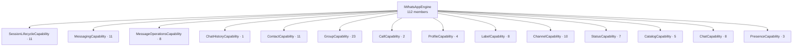
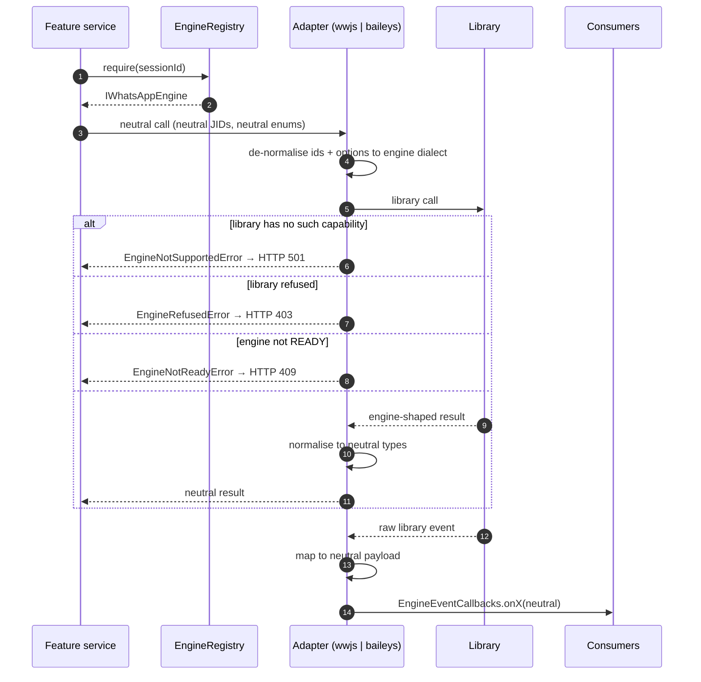

# The Engine Abstraction — `IWhatsAppEngine`

> **Source of truth:** `src/engine/interfaces/whatsapp-engine.interface.ts`, `src/engine/index.ts`, `src/engine/types/whatsapp-web-js.types.ts`, `src/engine/types/baileys.types.ts`, `src/engine/identity/wa-id.ts`
> **Band:** Engine layer · **Depends on:** 03-architecture-overview.md · **Jarcube class:** ENGINE-COUPLED

## Purpose

One TypeScript file defines everything OpenWA is allowed to ask a WhatsApp client to do: 112 methods
across 14 capability slices, 20 event callbacks, and 49 supporting types. Nothing above the engine
layer imports `whatsapp-web.js` or `@whiskeysockets/baileys` — the interface is an anti-corruption
layer, and its hardest job is not method coverage but **dialect normalisation**. The two libraries
disagree about how to spell a WhatsApp id, what a group-membership write returns, whether a mute
timestamp is seconds or milliseconds, whether a refusal throws or resolves `false`, and whether a
"who may add members" flag is a boolean or one of two opposite-sensed strings. A naive abstraction
picks whichever library it wrote first and leaks that library's answer; this one names a neutral
answer per concept and makes each adapter convert in both directions.

This document is the implementer's view. It enumerates every member, the exact shape of every type
the contract passes, and the places where the contract deliberately refuses to unify something —
because unifying it would mean inventing a claim the protocol does not make.

## File Inventory

Line counts are as measured at the commit in 00-INDEX.md and drift.

| Path | Lines | Role |
| --- | --- | --- |
| `src/engine/interfaces/whatsapp-engine.interface.ts` | 1423 | The whole contract: 14 slices, 112 members, 20 callbacks, 49 supporting types |
| `src/engine/identity/wa-id.ts` | 192 | The shared neutral-dialect implementation the contract's identity rule refers to |
| `src/engine/types/whatsapp-web-js.types.ts` | 182 | whatsapp-web.js shapes the library's own `.d.ts` does not declare (or declares wrongly) |
| `src/engine/types/baileys.types.ts` | 55 | The Baileys adapter's construction config and its two injected ports |
| `src/engine/index.ts` | 4 | The engine package's public surface for code outside `src/engine` — two symbols |

Adapters, events, identity and message mapping each get their own doc: 13-adapter-wwebjs.md,
14-adapter-baileys.md, 15-engine-events.md, 16-identity-and-lid.md, 17-message-mapping.md.
Per-engine availability of every member below is 12-engine-capability-matrix.md.

### What `src/engine/index.ts` chooses not to export

Four lines, and the comment states the policy: outside consumers get `BaileysStoredMessage` (a
TypeORM entity other modules must register) and `inboundMediaMaxBytes` (the media cap the message
module also enforces). Everything else — adapters, the interface itself, the identity helpers — is
reached by deep import inside `src/engine`, or not at all. The interface is imported directly by the
factory and the registry, which is why 11-engine-factory-registry.md is the only doorway a feature
service uses.

## Data Model / Contract

### The neutral identity dialect

The file's opening comment is the load-bearing part of the whole abstraction. Every JID an engine
**emits** in a neutral field (`from`, `to`, `chatId`, `author`, contact and chat `id`) is in the
neutral dialect:

| Form | Meaning |
| --- | --- |
| `<phone>@c.us` | A user known by phone. The raw `@s.whatsapp.net` form folds into this. |
| `<id>@g.us` | A group. |
| `<lid>@lid` | A user known **only** by privacy id — the phone is genuinely unknown. A first-class state, not an error. |
| `status@broadcast` | The status/story pseudo-chat. |
| `<id>@newsletter` | A channel / newsletter. |
| `<id>@broadcast` | A broadcast list. |

Two forms are never emitted: `@s.whatsapp.net`, and any id carrying a `:device` suffix.

Resolution rule: prefer `@c.us`, resolving a lid to its phone when the mapping is known; fall back
to `@lid` only when it cannot be resolved. Ids the engine **accepts** may be neutral and the adapter
de-normalises to its own dialect — the inbound and outbound conformance rollout is per-engine, which
the comment says explicitly rather than claiming it is finished. `src/engine/identity/wa-id.ts` holds
the shared implementation, including `src/engine/identity/wa-id.ts:ChatKind`:

```
'individual' | 'group' | 'channel' | 'status' | 'broadcast' | 'unknown'
```

`ChatKind` is the only type the interface imports from outside itself.

### Lifecycle status

`src/engine/interfaces/whatsapp-engine.interface.ts:EngineStatus` — 7 states, string-valued:

| Value | Meaning |
| --- | --- |
| `disconnected` | Not connected; may be reconnectable without a re-pair |
| `initializing` | `initialize()` in flight |
| `qr_ready` | A QR (or a pairing code, on request) is available |
| `authenticating` | Credentials accepted, readiness not yet reached |
| `ready` | Live |
| `action_required` | An operator must act; does **not** clear on its own |
| `failed` | Terminal |

`action_required` is worth internalising: it is not a degraded `ready` and not a recoverable
`disconnected`. Once the operator has acted the session must be stopped and started again. See
20-session-lifecycle.md.

### Send payloads

| Type | Fields |
| --- | --- |
| `Quotable` | `quotedMessageId?: string` |
| `MediaInput` (extends `Quotable`) | `mimetype`, `data: Buffer \| string` (buffer, base64 or URL), `filename?`, `caption?`, `mentions?: string[]`, `ptt?: boolean` |
| `ContactCard` (extends `Quotable`) | `name`, `number` |
| `LocationInput` (extends `Quotable`) | `latitude`, `longitude`, `description?`, `address?` |
| `PollInput` (extends `Quotable`) | `name`, `options: string[]` (WhatsApp accepts 2–12), `allowMultipleAnswers?` |
| `CustomLinkPreview` | `url`, `title` (required — WhatsApp renders nothing without one), `description?` |
| `MessageResult` | `id`, `timestamp: number` |

`Quotable` is a **property on the payload, not a parameter on the methods**, and the comment names
the reason: the parity gate reads call-shaped members out of this file, so a new method would demand
a capability-matrix row while a property demands nothing. The quoted id is engine-specific and
deliberately un-harmonised — whatsapp-web.js matches the serialized message id, Baileys looks the raw
key id up in its own store and can only quote something it has already persisted.

`MediaInput.filename` precedence is stated: a caller-supplied name wins; a document send falls back
to `'file'` when omitted (whatsapp-web.js first derives the URL basename); image/video/audio sends
carry no filename at all.

### Inbound message

`MessageType` is the neutral vocabulary each adapter maps its library's native tokens onto:

```
'text' | 'image' | 'video' | 'audio' | 'voice' | 'document' | 'sticker' | 'location'
| 'contact' | 'poll' | 'call' | 'revoked' | 'masked' | 'unknown'
```

`masked` is not a parse failure. It is a message WhatsApp deliberately withheld from linked and
companion devices — high-security business OTPs are the named case — so the payload is absent by
design. `unknown` covers any type the active engine reports that maps to no first-class kind.

`IncomingMessage`:

| Field | Type | Note |
| --- | --- | --- |
| `id` / `from` / `to` / `chatId` | `string` | Neutral dialect |
| `body` | `string` | |
| `type` | `MessageType` | |
| `timestamp` | `number` | |
| `fromMe` / `isGroup` | `boolean` | |
| `kind` | `ChatKind` | Derived from `chatId`; the full discriminator `isGroup` only approximates |
| `isStatusBroadcast?` | `boolean` | Set by the adapter so neutral code need not match `status@broadcast` itself |
| `ephemeralDuration?` | `number` | Per-chat disappearing timer in seconds; known values 86400 / 604800 / 7776000 |
| `author?` | `string` | The participant WID in a group, where `from` is the group JID |
| `mentionedIds?` | `string[]` | Surfaced for command targeting |
| `call?` | `{ video, missed }` | Set for `call` (call-log) messages |
| `isLidSender?` | `boolean` | Sender identified by privacy id rather than phone |
| `senderPhone?` | `string \| null` | Best-effort MSISDN when inline resolution is on (`RESOLVE_LID_TO_PHONE`); `null` when unmappable |
| `contact?` | `MessageContact` | Sync fields only — no network |
| `backgroundColor?` / `font?` | `string` / `number` | Text status styling, only from engines that expose it |
| `media?` | see below | |
| `quotedMessage?` | `{ id, body }` | |
| `location?` | `{ latitude, longitude, description?, address?, url? }` | |

`media` is `{ mimetype, filename?, data?, omitted?, sizeBytes? }`. `data` is base64 and **absent**
when the blob was dropped — a size cap, a timeout, a disabled download, or a failed one — in which
case `omitted` is `true` and `sizeBytes` is always set. That is the contract that lets a consumer
tell "no media" from "media we chose not to carry". Caps live in
`src/engine/adapters/inbound-media-cap.ts:capInboundMedia`; see 34-media-pipeline.md.

`MessageContact` carries only already-resolved fields — `id`, `number`, `name`, `pushName`,
`shortName`, `type`, `isMyContact`, `isWAContact`, `isBusiness`, `isEnterprise`, `verifiedName`,
`verifiedLevel`, `isBlocked`, `labels` — and the doc comment says why the async getters (profile
pic, about text, formatted number) are excluded: they hit WhatsApp per message and risk a
rate-limit or a ban. Label **ids** only, for the same reason.

### Contacts, groups, membership

| Type | Fields |
| --- | --- |
| `Contact` | `id`, `name?`, `pushName?`, `number`, `isMyContact`, `isBlocked`, `profilePicUrl?` |
| `Group` | `id`, `name`, `participantsCount?`, `isAdmin?`, `linkedParentJID?: string \| null` |
| `GroupParticipant` | `id`, `number`, `name?`, `isAdmin`, `isSuperAdmin` |
| `GroupInfo` | `id`, `name`, `description?`, `owner?`, `createdAt?`, `participants: GroupParticipant[]`, `isReadOnly?`, `isAnnounce?`, `announce?`, `locked?`, `ephemeralSeconds?`, `memberAddMode?`, `linkedParentJID?` |
| `GroupJoinInfo` | `id`, `name`, `description?`, `owner?`, `createdAt?`, `participantCount?` |
| `GroupMembershipRequest` | `participantId`, `addedById?`, `method?`, `requestedAt?` |
| `ParticipantOperationResult` | `id`, `success`, `status?`, `message?` |
| `GroupMemberAddMode` | `'all' \| 'admins'` |
| `GroupMembershipRequestMethod` | `'invite_link' \| 'non_admin_add' \| 'linked_group_join'` |

Three of these encode a decision worth copying.

**`GroupJoinInfo` is deliberately not `GroupInfo`.** A non-member has no participant list — WhatsApp
discloses at most a count — so reusing `GroupInfo` would force an empty array that reads as "this
group has no members", a different and wrong claim.

**`ParticipantOperationResult` is per participant, not per batch.** whatsapp-web.js `addParticipants`
resolves a `{[id]: {code, message}}` object; Baileys `groupParticipantsUpdate` resolves
`[{status, jid}]`. Both map verbatim. whatsapp-web.js remove/promote/demote confirm only the batch,
so an install-time patch (`scripts/patch-wwebjs-participant-arity.js`) makes the page report which
requested ids resolved to real members; on a tree without the patch the marker is absent and the
adapter falls back to one batch-confirmed entry per requested participant, which is all the library
reports there. `status` carries the engine's own code when it gave one — 200 ok, 403
invite-only/not-admin, 404 not registered or not a member, 409 already a member. 18-upstream-patching.md
covers the patch set.

**`GroupMemberAddMode` exists because the engines disagree and one of them disagrees with itself.**
Baileys uses a boolean where `true` means everyone; whatsapp-web.js carries WhatsApp's raw
`'all_member_add'` / `'admin_add'` strings while typing the field as a boolean with the opposite
sense. `src/engine/types/whatsapp-web-js.types.ts:GroupMetadataRaw` types it `string | boolean` for
exactly that reason.

### Reactions, labels, status, channels, catalog

| Type | Fields |
| --- | --- |
| `ReactionSender` | `senderId`, `emoji`, `timestamp` |
| `MessageReaction` | `emoji`, `senders: ReactionSender[]` |
| `Label` | `id`, `name`, `hexColor` |
| `LabelInput` | `id` (caller-supplied), `name?`, `color?: number` |
| `Status` | `id`, `contact: { id, name?, pushName? }`, `type: 'text'\|'image'\|'video'\|'voice'`, `caption?`, `mediaUrl?`, `media?`, `backgroundColor?`, `font?`, `timestamp: Date`, `expiresAt: Date` |
| `StatusPostOptions` | `recipients?: string[]`, `backgroundColor?`, `font?`, `caption?` |
| `StatusResult` | `statusId`, `timestamp: Date`, `expiresAt: Date` |
| `Channel` | `id`, `name`, `description?`, `inviteCode?`, `subscriberCount?`, `picture?`, `verified?`, `createdAt?` |
| `ChannelMessage` | `id`, `body`, `timestamp`, `hasMedia`, `mediaUrl?` |
| `Catalog` | `id`, `name`, `description?`, `productCount`, `url` |
| `Product` | `id`, `name`, `description?`, `price`, `currency`, `priceFormatted`, `imageUrl?`, `url`, `isAvailable`, `retailerId?` |
| `ProductQueryOptions` | `page?`, `limit?` |
| `PaginatedProducts` | `products: Product[]`, `pagination: { page, limit, total, totalPages }` |

`LabelInput` is keyed on a **caller-supplied** id, and the comment defends that at length: WhatsApp's
app state carries one `label_edit` write indexed by label id, and whether it creates or updates
depends only on whether that id already exists. There is no server-assigned id to hand back, so
inventing one would invent a contract the protocol does not have — and could silently overwrite an
existing label. `LabelInput.color` is WhatsApp's colour **index** (0–19), not the `hexColor` the read
path returns, because neither library exposes the index-to-hex mapping and a translation table here
would be guesswork that silently sets the wrong colour.

`StatusPostOptions.recipients` is where the two engines genuinely cannot be unified: it is
**required** on Baileys (which 400s on an absent or empty list) and **ignored** by whatsapp-web.js,
which broadcasts to the account's own status-privacy audience. 36-status-stories.md carries the
consequences for the HTTP surface.

`Status.type` includes `voice` for an audio status posted as a voice note; before voice status posting
landed, such a status read back as `text`, because anything that was not an image or a video
collapsed to it.

### Chats and presence

| Type | Definition |
| --- | --- |
| `ChatSummary` | `id`, `name`, `isGroup`, `kind: ChatKind`, `unreadCount`, `timestamp`, `lastMessage?` |
| `ChatState` | `'typing' \| 'recording' \| 'paused'` |
| `PresenceState` | `'available' \| 'unavailable' \| 'composing' \| 'recording' \| 'paused'` |
| `ParticipantPresence` | `id`, `state: PresenceState`, `lastSeen?: number` (Unix **seconds**) |
| `PresenceUpdateEvent` | `chatId`, `participants: ParticipantPresence[]`, `groupOnlineCount?` |
| `DeliveryStatus` | `'pending' \| 'sent' \| 'delivered' \| 'read' \| 'failed'` |
| `CallLinkType` | `'audio' \| 'video'` |
| `CallOutcome` | `'accepted' \| 'rejected' \| 'missed'` |

`ParticipantPresence.lastSeen` absent is **the common case, not an error** — most contacts hide
last-seen. `PresenceUpdateEvent.participants` is a list even for a 1:1 chat, where it holds exactly
one entry, so consumers need one shape.

`CallLinkType` uses `audio` as the neutral spelling: Baileys agrees, whatsapp-web.js calls it
`voice`, and WhatsApp's own URL path is `/voice/`.

`CallOutcome` deliberately does **not** map WhatsApp's `terminate`. WhatsApp uses that both for a
caller hanging up before answer and for either side ending an answered call, and the event carries
nothing that separates the two — reporting it as either would be wrong half the time. Telling them
apart needs call-duration tracking, which is its own piece of work.

### Mutation events

| Type | Fields | Note |
| --- | --- | --- |
| `RevokedMessage` | `id`, `revokedId?`, `chatId`, `from`, `to`, `type: 'revoked'`, `body: ''`, `timestamp` | `body` is typed as the empty string literal |
| `EditedMessage` | `messageId`, `chatId`, `body`, `senderId`, `from`, `to`, `fromMe`, `isGroup`, `type`, `hasMedia`, `author?`, `mentionedIds?`, `timestamp` | `timestamp` is when the **edit** happened |
| `ReactionEvent` | `messageId`, `chatId`, `reaction`, `senderId` | |
| `GroupEvent` | `kind: 'join'\|'leave'\|'update'\|'join_request'`, `groupId`, `actorId?`, `participantIds: string[]`, `changes?: { subject?, description?, announce?, locked? }`, `timestamp` | |
| `IncomingCallEvent` | `callId`, `from`, `isVideo`, `isGroup`, `timestamp` | `callId` is the handle `rejectCall` accepts while ringing |
| `CallOutcomeEvent` | `callId`, `from`, `outcome`, `isVideo`, `isGroup`, `timestamp` | |
| `AccountRestriction` | `kind: 'reachout_timelock'\|'tos_block'\|'proxy_block'`, `code`, `expiresAt?` | |

**`RevokedMessage.revokedId` is the field consumers must match on**, and the reason is an engine
asymmetry that will silently corrupt storage if missed. On whatsapp-web.js the `id` is the revocation
*notification*, a distinct message, so `id !== revokedId`, and `revokedId` may be `undefined` when
the original is not in the local store. On Baileys the revoke arrives as a protocolMessage whose key
already points at the original, so `id === revokedId`. Match on `revokedId`, fall back to `id`.

`RevokedMessage.body` is empty **by contract**: the engine layer never emits a localized display
string, so the dashboard renders "message deleted" itself.

`EditedMessage.mentionedIds` reflects the edited message's *latest* content, because an edit
replaces content rather than merging it.

`AccountRestriction.kind` is a discriminator, not a lowest common denominator, and the difference is
load-bearing for clearing. `reachout_timelock` (Baileys) leaves the account connected and existing
chats working — WhatsApp only blocks *starting new conversations* — and the library reports it
first-class, including when it lifts. `tos_block` / `proxy_block` (whatsapp-web.js) are
connection-level refusals derived from the `WAState` on the library's `disconnected` event, the only
channel that carries it. So a `reachout_timelock` can only be cleared by an explicit lift signal,
whereas a connection-scoped kind is disproved the moment the session reaches `ready` again — the
block would have prevented that. `code` keeps the engine's own token verbatim so a new upstream value
surfaces instead of being flattened. 22-session-reconnect-and-liveness.md covers the consuming store.

## Capability slices

The surface is one interface per consumer domain, composed at the end. All 14 slices live in the same
file on purpose: the parity gate reads the method inventory straight out of this file's text, so
every declaration stays here, indented as a member, with its doc comment attached.



`src/engine/interfaces/whatsapp-engine.interface.ts:IWhatsAppEngine` declares nothing of its own —
the comment states that a member belongs to the slice its consumer domain forms, so an engine-wide
member would imply a domain with no other surface. Adapters implement the union unchanged; a consumer
that touches one domain can narrow to its slice.

## Method inventory

Every member, by slice. Availability per engine is 12-engine-capability-matrix.md; a member listed
here may still answer HTTP 501 on one engine.

### Session lifecycle — `SessionLifecycleCapability` (11)

| Member | Signature | Contract note |
| --- | --- | --- |
| `initialize` | `initialize(callbacks: EngineEventCallbacks): Promise<void>` | The only place callbacks are supplied |
| `disconnect` | `disconnect(): Promise<void>` | Closes the browser, **keeps** credentials — reconnect needs no QR |
| `logout` | `logout(): Promise<void>` | Clears session data; a re-pair is required |
| `destroy` | `destroy(): Promise<void>` | Graceful teardown |
| `forceDestroy` | `forceDestroy(): Promise<void>` | Force-kill **this engine's own** resources first (e.g. SIGKILL a wedged Chromium), then best-effort graceful teardown. Never a process-wide `pkill` |
| `getStatus` | `getStatus(): EngineStatus` | Cached — not proof of life |
| `probeLiveness` | `probeLiveness?(): Promise<boolean>` | **Optional.** A real round trip; failure or timeout must be reported as dead |
| `getQRCode` | `getQRCode(): string \| null` | |
| `requestPairingCode` | `requestPairingCode(phoneNumber: string): Promise<string>` | 8-char code; both adapters throw `EngineNotReadyError` (409) unless status is `qr_ready` |
| `getPhoneNumber` | `getPhoneNumber(): string \| null` | |
| `getPushName` | `getPushName(): string \| null` | |

`probeLiveness` is the one optional method, and its optionality is a real design statement: a wedged
connection can keep reporting `ready` from cache, so `getStatus()` alone proves nothing; but an
engine whose transport already self-detects death (Baileys' keepalive emits a close event within
~35s) may return a cheap local check instead. The session watchdog polls it periodically —
22-session-reconnect-and-liveness.md.

### Outbound messaging — `MessagingCapability` (11)

| Member | Signature |
| --- | --- |
| `sendTextMessage` | `sendTextMessage(chatId, text, mentions?, options?: { linkPreview?, customPreview? } & Quotable): Promise<MessageResult>` |
| `sendImageMessage` | `sendImageMessage(chatId, media: MediaInput): Promise<MessageResult>` |
| `sendVideoMessage` | `sendVideoMessage(chatId, media: MediaInput): Promise<MessageResult>` |
| `sendAudioMessage` | `sendAudioMessage(chatId, media: MediaInput): Promise<MessageResult>` |
| `sendDocumentMessage` | `sendDocumentMessage(chatId, media: MediaInput): Promise<MessageResult>` |
| `sendLocationMessage` | `sendLocationMessage(chatId, location: LocationInput): Promise<MessageResult>` |
| `sendContactMessage` | `sendContactMessage(chatId, contact: ContactCard): Promise<MessageResult>` |
| `sendStickerMessage` | `sendStickerMessage(chatId, media: MediaInput): Promise<MessageResult>` |
| `sendPollMessage` | `sendPollMessage(chatId, poll: PollInput): Promise<MessageResult>` |
| `replyToMessage` | `replyToMessage(chatId, quotedMsgId, text, mentions?): Promise<MessageResult>` |
| `forwardMessage` | `forwardMessage(fromChatId, toChatId, messageId): Promise<MessageResult>` |

Link previews are the asymmetry an implementer must get right. `linkPreview: false` suppresses the
preview on **both** engines. Otherwise they diverge: whatsapp-web.js builds one in-page by default,
while on Baileys a preview is **opt-in** — only `linkPreview: true` produces one, because generating
it is a blocking outbound fetch per URL. `customPreview` states the metadata so nothing is fetched at
all, which also means a preview can be attached for a URL this server could not reach.

`mentions` on both `sendTextMessage` and `replyToMessage` only tags participants; the text must also
carry the matching `@<number>` token or WhatsApp renders no tag. 30-message-send-pipeline.md and
31-message-types-catalog.md cover the HTTP layer above these.

### Message operations — `MessageOperationsCapability` (8)

| Member | Signature | Contract note |
| --- | --- | --- |
| `reactToMessage` | `reactToMessage(chatId, messageId, emoji): Promise<void>` | |
| `getMessageReactions` | `getMessageReactions(chatId, messageId): Promise<MessageReaction[]>` | |
| `deleteMessage` | `deleteMessage(chatId, messageId, forEveryone?): Promise<void>` | |
| `editMessage` | `editMessage(chatId, messageId, body, mentions?): Promise<MessageResult>` | Own text messages only; the engine's refusal surfaces as-is. `mentions` **replaces** tags — omitting it drops whatever the original carried |
| `starMessage` | `starMessage(chatId, messageId, star): Promise<void>` | Private, account-local; no group-admin restriction |
| `votePoll` | `votePoll(chatId, pollMessageId, options: string[]): Promise<void>` | Option **texts**, not ids. The list replaces the current selection; `[]` clears the vote |
| `pinMessage` | `pinMessage(chatId, messageId, durationSeconds): Promise<void>` | Duration is **required** and must be 86400 / 604800 / 2592000 |
| `unpinMessage` | `unpinMessage(chatId, messageId): Promise<void>` | Takes no duration |

`votePoll` names options by text because nothing else is available: whatsapp-web.js matches by name
and no engine surfaces a stable per-option id through this interface. The consequence is stated
rather than hidden — a poll with duplicate option texts selects **all** matching options, and
WhatsApp permits duplicates.

`pinMessage`'s duration is required rather than defaulted so neither adapter has to invent a value.
WhatsApp recognises exactly three windows.

`votePoll` lives here rather than with `sendPollMessage` because it mutates an existing poll message
— the same shape of act as `reactToMessage` — instead of composing one.

### Chat history — `ChatHistoryCapability` (1)

```
getChatHistory(
  chatId: string,
  limit?: number,
  includeMedia?: boolean,
  mediaMaxBytes?: number,
  signal?: AbortSignal,
): Promise<IncomingMessage[]>
```

Its own slice because it is the engine's only media-bearing read path, and the media-budget
parameters are a download concern no other member shares. Newest first. `mediaMaxBytes` tightens the
declared-size pre-gate below the global `MEDIA_DOWNLOAD_MAX_BYTES` — the status seed uses it to skip
downloads the store would discard as over-cap anyway. Inline media is additionally bounded in
aggregate by `CHAT_HISTORY_MEDIA_BUDGET_BYTES`: once the running base64 total crosses the budget,
later media messages carry the `omitted` marker instead of a download. `signal` (a client disconnect,
typically) stops the read loop early and returns what was collected.

### Contacts and addressbook — `ContactCapability` (11)

| Member | Signature | Contract note |
| --- | --- | --- |
| `getContacts` | `getContacts(): Promise<Contact[]>` | |
| `getContactById` | `getContactById(contactId): Promise<Contact \| null>` | |
| `checkNumberExists` | `checkNumberExists(number): Promise<boolean>` | |
| `getNumberId` | `getNumberId(number): Promise<string \| null>` | Returns the **already-neutralised** `<phone>@c.us`, so it round-trips to a send on any engine |
| `resolveContactPhone` | `resolveContactPhone(contactId): Promise<string \| null>` | Best-effort MSISDN; `null` for a lid the account has never seen |
| `getProfilePicture` | `getProfilePicture(contactId): Promise<string \| null>` | Accepts a **group** JID too — which is why there is no `getGroupPicture` |
| `blockContact` | `blockContact(contactId): Promise<void>` | |
| `unblockContact` | `unblockContact(contactId): Promise<void>` | |
| `getBlockedContacts` | `getBlockedContacts(): Promise<string[]>` | **Ids only** |
| `upsertContact` | `upsertContact(contactId, firstName, lastName?): Promise<void>` | wwjs addresses by phone, Baileys by JID; the adapters convert. An empty `lastName` is normal |
| `deleteContact` | `deleteContact(contactId): Promise<void>` | Does not block, does not delete the chat |

`getBlockedContacts` returning bare ids is the clearest example of the abstraction refusing to
over-promise: whatsapp-web.js resolves full `Contact` models, but Baileys' blocklist query answers
bare JIDs, and inventing the other fields on one engine would make the two engines claim different
things about the same account.

### Groups — `GroupCapability` (23)

| Member | Signature |
| --- | --- |
| `getGroups` | `getGroups(): Promise<Group[]>` |
| `getGroupInfo` | `getGroupInfo(groupId): Promise<GroupInfo \| null>` |
| `createGroup` | `createGroup(name, participants: string[]): Promise<Group>` |
| `addParticipants` | `addParticipants(groupId, participants): Promise<ParticipantOperationResult[]>` |
| `removeParticipants` | `removeParticipants(groupId, participants): Promise<ParticipantOperationResult[]>` |
| `promoteParticipants` | `promoteParticipants(groupId, participants): Promise<ParticipantOperationResult[]>` |
| `demoteParticipants` | `demoteParticipants(groupId, participants): Promise<ParticipantOperationResult[]>` |
| `leaveGroup` | `leaveGroup(groupId): Promise<void>` |
| `setGroupSubject` | `setGroupSubject(groupId, subject): Promise<void>` |
| `setGroupDescription` | `setGroupDescription(groupId, description): Promise<void>` |
| `getGroupInviteCode` | `getGroupInviteCode(groupId): Promise<string>` |
| `revokeGroupInviteCode` | `revokeGroupInviteCode(groupId): Promise<string>` |
| `joinGroupViaInviteCode` | `joinGroupViaInviteCode(inviteCode): Promise<string>` |
| `getGroupJoinInfo` | `getGroupJoinInfo(inviteCode): Promise<GroupJoinInfo>` |
| `setGroupMessagesAdminsOnly` | `setGroupMessagesAdminsOnly(groupId, adminsOnly): Promise<void>` |
| `setGroupInfoAdminsOnly` | `setGroupInfoAdminsOnly(groupId, adminsOnly): Promise<void>` |
| `setGroupPicture` | `setGroupPicture(groupId, media: MediaInput): Promise<void>` |
| `deleteGroupPicture` | `deleteGroupPicture(groupId): Promise<void>` |
| `setGroupMemberAddMode` | `setGroupMemberAddMode(groupId, mode: GroupMemberAddMode): Promise<void>` |
| `setGroupEphemeral` | `setGroupEphemeral(groupId, durationSec): Promise<void>` |
| `getGroupMembershipRequests` | `getGroupMembershipRequests(groupId): Promise<GroupMembershipRequest[]>` |
| `approveGroupMembershipRequests` | `approveGroupMembershipRequests(groupId, participants?): Promise<ParticipantOperationResult[]>` |
| `rejectGroupMembershipRequests` | `rejectGroupMembershipRequests(groupId, participants?): Promise<ParticipantOperationResult[]>` |

The membership-write contract is spelled out once and applies to all four writes plus the two
approval methods: they resolve **one result per participant**, so a partial refusal (one invite-only
number among several) is visible instead of flattened into a blanket success. They **throw** only
when the operation failed for every requested participant — the account lacks admin rights, say — or
the batch itself was refused.

The approval methods add one wrinkle: omitting `participants` acts on **every** pending request, and
in that case the all-failed and no-outcome guards do not apply, because approving an empty queue is a
no-op that resolves `[]`.

`setGroupEphemeral(0)` disables the timer; known values are 86400 / 604800 / 7776000. Reading the
current group picture needs no method — `getProfilePicture` takes a group JID. `getGroupJoinInfo` is
read-only, which is what makes it safe to call on an untrusted invite code. 38-groups.md covers the
HTTP surface.

### Calls — `CallCapability` (2)

| Member | Signature | Contract note |
| --- | --- | --- |
| `rejectCall` | `rejectCall(callId): Promise<void>` | Only a **currently ringing** call; the adapter caches the engine's live handle for the ringing window. Unknown or expired `callId` → not-found (404) |
| `createCallLink` | `createCallLink(type: CallLinkType, startTime: number): Promise<string>` | `startTime` is absolute epoch **milliseconds**; both engines take seconds on the wire and each adapter converts |

Call **events** arrive through `EngineEventCallbacks` (`onCall` / `onCallOutcome`), not through this
slice. `createCallLink` reconciles two different return shapes — whatsapp-web.js resolves the finished
link or `''` on failure, Baileys resolves only the bare token and the adapter assembles it behind the
library's prefix — and a WhatsApp-side failure **throws** rather than returning an empty or
prefix-only link, which would look like a working link and is not one. 40-calls.md.

### Own profile — `ProfileCapability` (4)

| Member | Signature |
| --- | --- |
| `setProfileName` | `setProfileName(name): Promise<void>` |
| `setProfileStatus` | `setProfileStatus(status): Promise<void>` |
| `setProfilePicture` | `setProfilePicture(media: MediaInput): Promise<void>` |
| `deleteProfilePicture` | `deleteProfilePicture(): Promise<void>` |

Distinct from `ContactCapability`, which reads and writes other parties. A URL payload in
`setProfilePicture` is fetched server-side. `deleteProfilePicture` is idempotent: deleting a picture
that is not there is a no-op, not an error. Only whatsapp-web.js can report a refusal, and only as an
explicit `false` — its page helper also returns `undefined` when it did not attempt the delete, which
is **not** a refusal. Baileys resolves void and has no refusal signal at all.

### Labels — `LabelCapability` (8)

| Member | Signature |
| --- | --- |
| `getLabels` | `getLabels(): Promise<Label[]>` |
| `getLabelById` | `getLabelById(labelId): Promise<Label \| null>` |
| `getChatLabels` | `getChatLabels(chatId): Promise<Label[]>` |
| `addLabelToChat` | `addLabelToChat(chatId, labelId): Promise<void>` |
| `upsertLabel` | `upsertLabel(label: LabelInput): Promise<void>` |
| `deleteLabel` | `deleteLabel(labelId): Promise<void>` |
| `getChatsByLabel` | `getChatsByLabel(labelId): Promise<ChatSummary[]>` |
| `removeLabelFromChat` | `removeLabelFromChat(chatId, labelId): Promise<void>` |

A non-business account has no labels at all. `upsertLabel` is one operation rather than two because
the engines express create and update through a single app-state write; only fields that are set
change. `deleteLabel` removes the label from every chat it was on. 39-contacts-labels-profile.md.

### Channels / newsletters — `ChannelCapability` (10)

| Member | Signature |
| --- | --- |
| `getSubscribedChannels` | `getSubscribedChannels(): Promise<Channel[]>` |
| `getChannelById` | `getChannelById(channelId): Promise<Channel \| null>` |
| `subscribeToChannel` | `subscribeToChannel(inviteCode): Promise<Channel>` |
| `unsubscribeFromChannel` | `unsubscribeFromChannel(channelId): Promise<void>` |
| `getChannelMessages` | `getChannelMessages(channelId, limit?): Promise<ChannelMessage[]>` |
| `createChannel` | `createChannel(name, description?): Promise<Channel>` |
| `deleteChannel` | `deleteChannel(channelId): Promise<void>` |
| `muteChannel` | `muteChannel(channelId, mute): Promise<void>` |
| `demoteChannelAdmin` | `demoteChannelAdmin(channelId, userId): Promise<void>` |
| `transferChannelOwnership` | `transferChannelOwnership(channelId, newOwnerId): Promise<void>` |

Note the argument to `subscribeToChannel`: an **invite code**, not a channel id. That choice is why
one engine cannot satisfy it today — see 12-engine-capability-matrix.md.

`createChannel` makes the account the owner, which is what makes `deleteChannel` possible later:
neither engine can delete a channel it does not own. `deleteChannel` is irreversible and its
subscribers lose it. `muteChannel` does not affect subscription.

There is deliberately **no promote counterpart** to `demoteChannelAdmin`: neither library has one, so
an admin is promoted from the WhatsApp app and can then be demoted here. `transferChannelOwnership`
is irreversible through this API; the whatsapp-web.js option to also dismiss yourself as admin in the
same call is not exposed, because the page function it relies on no longer exists and it sits inside
a branch that swallows its own errors — it would fail silently rather than refuse.
37-channels-newsletters.md.

### Status / stories — `StatusCapability` (7)

| Member | Signature |
| --- | --- |
| `getContactStatuses` | `getContactStatuses(): Promise<Status[]>` |
| `getContactStatus` | `getContactStatus(contactId): Promise<Status[]>` |
| `postTextStatus` | `postTextStatus(text, options: StatusPostOptions): Promise<StatusResult>` |
| `postImageStatus` | `postImageStatus(media: MediaInput, options: StatusPostOptions): Promise<StatusResult>` |
| `postVideoStatus` | `postVideoStatus(media: MediaInput, options: StatusPostOptions): Promise<StatusResult>` |
| `postVoiceStatus` | `postVoiceStatus(media: MediaInput, options: StatusPostOptions): Promise<StatusResult>` |
| `deleteStatus` | `deleteStatus(statusId): Promise<void>` |

`options` is **required** on all four posts (not optional) because Baileys needs the recipient list.
WhatsApp plays a status voice note only for Ogg/Opus and neither engine transcodes — the media
conversion endpoints exist to produce it. 34-media-pipeline.md.

### Catalog — `CatalogCapability` (5)

| Member | Signature |
| --- | --- |
| `getCatalog` | `getCatalog(): Promise<Catalog \| null>` |
| `getProducts` | `getProducts(options?: ProductQueryOptions): Promise<PaginatedProducts>` |
| `getProduct` | `getProduct(productId): Promise<Product \| null>` |
| `sendProduct` | `sendProduct(chatId, productId, body?): Promise<MessageResult>` |
| `sendCatalog` | `sendCatalog(chatId, body?): Promise<MessageResult>` |

`sendProduct` and `sendCatalog` sit here rather than in `MessagingCapability` on the stated reasoning
that they ship a catalog entity into a chat and their consumer is the commerce domain, so a
messaging-only dependency need not carry them. 41-catalog-products.md.

### Chat list management — `ChatCapability` (8)

| Member | Signature | Return contract |
| --- | --- | --- |
| `getChats` | `getChats(): Promise<ChatSummary[]>` | |
| `sendSeen` | `sendSeen(chatId, messageIds?): Promise<boolean>` | `messageIds` names exactly which messages to acknowledge; per-message engines (Baileys) need it, chat-level engines (wwjs) ignore it |
| `markUnread` | `markUnread(chatId): Promise<boolean>` | |
| `deleteChat` | `deleteChat(chatId): Promise<boolean>` | |
| `archiveChat` | `archiveChat(chatId, archive): Promise<boolean>` | `false` = the engine could not act |
| `pinChat` | `pinChat(chatId, pin): Promise<boolean>` | `false` = the engine **declined** |
| `muteChat` | `muteChat(chatId, muteUntil: number \| null): Promise<void>` | Void — no declined outcome exists |
| `clearChatMessages` | `clearChatMessages(chatId): Promise<boolean>` | `false` = the engine could not act |

The boolean-versus-void split is not cosmetic. `archiveChat`, `clearChatMessages` and `deleteChat`
return boolean because Baileys implements them as app-state modifications keyed to the chat's **last
message**, so a chat with no known history cannot be acted on at all. `muteChat` returns void because
the Baileys `mute` modification carries no `lastMessages` and therefore has no such failure mode.
`pinChat` returns boolean for a different reason again: WhatsApp allows at most three pinned chats and
whatsapp-web.js reports that refusal, while Baileys writes a patch WhatsApp says nothing back about
and so always resolves `true` in both directions. Unpinning always resolves `true`.

`muteChat`'s `muteUntil` is absolute epoch **milliseconds**, and the doc comment records that this
was *measured, not inferred*: WhatsApp's `MuteAction.muteEndTimestamp` is unsuffixed while sibling
millisecond fields are spelled `…Ms`, so it reads as seconds — and sending seconds left the chat
unmuted (the instant had already passed in 1970) while the same instant in milliseconds muted it to
the expected minute. Getting it backwards is silent: the send still answers 200 and the mute either
never applies or lands tens of thousands of years out and reads as permanent. There is no portable
"forever" sentinel (wwjs uses -1 internally, Baileys has none), so callers pass a far-future
timestamp. `null` unmutes now.

Pinning a chat is `pinChat`; pinning a message *inside* a chat is `MessageOperationsCapability.pinMessage`.
26-chat-operations.md.

### Presence — `PresenceCapability` (3)

| Member | Signature | Contract note |
| --- | --- | --- |
| `sendChatState` | `sendChatState(chatId, state: ChatState): Promise<void>` | Best-effort: an engine without a presence concept should no-op |
| `setOnlinePresence` | `setOnlinePresence(available: boolean): Promise<void>` | **Not** best-effort |
| `subscribeToPresence` | `subscribeToPresence(chatId): Promise<void>` | Per chat, deliberately |

`setOnlinePresence` breaks the best-effort pattern on purpose. A linked device that announces itself
online routes notifications away from the phone, so a headless bot that never goes offline suppresses
the phone's own alerts — the caller asked for a specific visibility and a swallowed failure would
leave the account silently online. The setting belongs to the connection and resets on reconnect
(Baileys re-announces per its `markOnlineOnConnect` socket option), so callers re-issue it.

`subscribeToPresence` is per chat rather than subscribe-all because WhatsApp emits an update on
*every* transition — each time someone starts and stops typing — so subscribing to everything turns
an idle account into a firehose. The subscription lasts for the life of the connection and must be
re-established after a reconnect. **There is no matching read:** presence cannot be queried, only
received, which is why the gateway serves the last reported state. 25-presence-and-chat-state.md.

## Events Emitted / Consumed

`EngineEventCallbacks` is supplied once, to `initialize()`. All 20 members are optional, so an
adapter never has to check for a handler it does not use and a consumer never has to supply one.

| Callback | Payload | Direction note |
| --- | --- | --- |
| `onQRCode` | `(qr: string)` | |
| `onReady` | `(phone: string, pushName: string)` | |
| `onMessage` | `(message: IncomingMessage)` | Inbound |
| `onMessageCreate` | `(message: IncomingMessage)` | Messages the **account** created, including sends composed on a linked phone — which `onMessage` never delivers. Backs `message.sent` |
| `onMessageAck` | `(messageId: string, status: DeliveryStatus)` | Neutral status, never a native ack code |
| `onMessageRevoked` | `(message: RevokedMessage)` | |
| `onMessageReaction` | `(event: ReactionEvent)` | |
| `onMessageEdited` | `(message: EditedMessage)` | |
| `onGroupEvent` | `(event: GroupEvent)` | `kind` selects `group.join` / `group.leave` / `group.update` / `group.join_request` |
| `onCall` | `(event: IncomingCallEvent)` | The ring itself |
| `onHistoryMessages` | `(messages: IncomingMessage[])` | Bulk initial-sync history. Predates the live session: persist, do **not** dispatch |
| `onDisconnected` | `(reason: string)` | Recoverable; triggers reconnection |
| `onStateChanged` | `(state: EngineStatus)` | |
| `onActionRequired` | `(reason: string)` | Operator action needed; does not self-clear |
| `onAccountRestriction` | `(restriction: AccountRestriction \| null)` | `null` is a positive **lift**, not "unknown" |
| `onPresenceUpdate` | `(event: PresenceUpdateEvent)` | Push-only after subscription |
| `onCallOutcome` | `(event: CallOutcomeEvent)` | Must never re-enter `onCall` |
| `onError` | `(reason: string)` | Terminal; engine already moved to `failed` |
| `onCredentialTeardownStarted` | `(operation: Promise<void>)` | Fired **synchronously** |
| `claimStuckAuthRecovery` | `() => boolean` | **Synchronous by contract** |

Four of these carry non-obvious rules.

**`onCallOutcome` must be distinct from `onCall`.** If an outcome re-entered the ring path, a call
being declined would look like a fresh incoming call and, with auto-reject on, be answered.

**`onActionRequired` currently has exactly one trigger:** the whatsapp-web.js onboarding-modal
fallback. A newly linked account shows a "What's new" modal that must be acknowledged; the adapter
dismisses it automatically, and this fires only if that dismissal fails — so a headless deployment is
told rather than left to be logged out ~5 minutes later.

**`onAccountRestriction` is purely informational.** The adapter does not change its own status or
reconnect behaviour because of a restriction, so a misread cannot turn a recoverable session into a
dead one. Consumers decide what a restriction is worth.

**`onCredentialTeardownStarted` is the one callback not guarded on engine liveness.** It fires the
instant a credential teardown begins — the moment the adapter kicks off the call that ends in an
`fs.rm` of this session's on-disk auth directory — and the argument is the *same* promise the adapter
is about to await. A logout that captured the engine registers its destructive promise even as a
concurrent `stop()`/`delete()` evicts that engine, because the `rm` targets the session **name**'s
auth dir and would otherwise race a recreated session under that same name. The lifecycle tracks the
promise keyed by the immutable captured name so `start()`/`delete()`/reconnect can wait — bounded and
fail-closed — before touching that path. Adapters that never remove credentials on their own simply
never invoke it. 21-session-fences-and-races.md.

**`claimStuckAuthRecovery` is a synchronous atomic claim, and the synchrony is the contract.** It
grants exactly one automatic credential-reset attempt per reconnect episode, for the stuck-auth case
(a session that authenticated but never reached readiness). The claim is owned by the session
lifecycle rather than the adapter, because an automatic reconnect builds a *fresh* adapter — an
instance-local budget would reset every generation and wipe the auth directory forever. Once spent it
returns `false` and the adapter **must** fail terminally (`failed` + `onError`) without touching the
auth dir. The adapter does not await it: the race between the stuck-auth timeout and a concurrent
start or reconnect is resolved inside one event-loop turn. When the callback is absent (standalone or
test use) the adapter falls back to its own instance-local one-shot boolean.

Full event catalog including the HTTP/WebSocket names these become: APPENDIX-B-events.md and
15-engine-events.md.

## Flow



## Call Chain

- `src/engine/engine.factory.ts:EngineFactory` → `createEngine` on the selected plugin → an adapter
  instance typed only as `IWhatsAppEngine`. The factory adds session-name safety and private-dir
  hardening (11-engine-factory-registry.md).
- `src/modules/session/session-engine-lifecycle.service.ts` → `initialize(callbacks)` races a
  deadline, owns the status writes, and is the only caller that supplies callbacks
  (20-session-lifecycle.md).
- `src/engine/engine-registry.service.ts:EngineRegistry` → `require(id)` — the narrow port ~10 feature
  services use to reach a live engine, adding identity (not just presence) checks.
- Feature service (e.g. `src/modules/group/group.service.ts`, `src/modules/label/label.service.ts`) →
  a slice member. Adds DTO validation, session scoping, audit, and event emission.
- Adapter → library, adding dialect conversion, refusal normalisation and the 501 contract
  (13-adapter-wwebjs.md, 14-adapter-baileys.md).

## Supporting engine-specific type declarations

These two files are not part of the neutral contract; they are what the adapters need in order to
*produce* it, and both exist because a library's own typings are absent or wrong.

`src/engine/types/whatsapp-web-js.types.ts` (182 lines):

| Symbol | Why it exists |
| --- | --- |
| `SerializedWid` | WA Web build 2.3000.x renamed `_serialized` to the minifier-mangled `$1`, breaking every read at once. Both properties are optional; exactly one is present per build |
| `readWid` | The single reader for that pair. Every raw-Wid read goes through it, because a site reading `_serialized` alone yields `undefined`, which `String()` turns into the literal id `"undefined"` — an id that looks real and addresses nothing |
| `GroupMetadataRaw` | The parent-community link field has moved across versions, so three candidates are declared defensively; also `announce`, `restrict`, `ephemeralDuration`, and the `string \| boolean` `memberAddMode` |
| `GroupChat` | Group methods and their real return shapes: `setSubject`/`setDescription`/`setMessagesAdminsOnly`/`setInfoAdminsOnly`/`setAddMembersAdminsOnly`/`setPicture`/`deletePicture` resolve **`false`** on refusal rather than throwing |
| `MessageWithReactions` | `react` / `hasReaction` / `getReactions` |
| `BusinessClient` | Label and channel methods, including `createChannel`, which resolves a result object on success and an error **string** on failure without throwing |
| `WwjsChannelData` / `WwjsChannelMessage` | Channel shapes; the message id is typed `SerializedWid` precisely so the `$1` rename stays readable |

`src/engine/types/baileys.types.ts` (55 lines):

| Symbol | Role |
| --- | --- |
| `BaileysMessageStore` | The persistence port the adapter depends on instead of the concrete Nest service, so it stays unit-testable with a fake. `put` (idempotent by id), `getMessage`, `getMessages` (order and length are **not** guaranteed to match the input), `clearSession` |
| `BaileysAdapterConfig` | `sessionId` (name — keys the auth dir), `dbSessionId` (UUID — keys FK-bound rows), `authDir`, proxy, `messageStore?`, `lidMappingStore?` |
| `BaileysLogger` | A minimal pino-compatible logger, declared locally so a silent logger can be passed without taking a `pino` dependency |

The `sessionId` / `dbSessionId` split is a real trap for an implementer: one is the on-disk key and
one is the database key, and they are not interchangeable.

## Configuration

The interface itself reads no configuration; these are the variables its documented behaviour refers
to.

| Env var | Default | Effect on this contract |
| --- | --- | --- |
| `ENGINE_TYPE` | `whatsapp-web.js` | Which adapter implements the interface (11-engine-factory-registry.md) |
| `RESOLVE_LID_TO_PHONE` | `false` | Whether `IncomingMessage.senderPhone` is populated inline |
| `MEDIA_DOWNLOAD_MAX_BYTES` | 50 MiB | Per-blob inbound cap behind `media.omitted` |
| `CHAT_HISTORY_MEDIA_BUDGET_BYTES` | 25 MiB | Aggregate cap for one `getChatHistory` call |

Full list: APPENDIX-A-env-vars.md. Loading and validation: 05-configuration-and-env.md.

## Failure Modes & Edge Cases

| Scenario | Contracted behaviour |
| --- | --- |
| Capability the active engine cannot deliver | `EngineNotSupportedError` → **HTTP 501** (`src/common/errors/engine-not-supported.error.ts`) |
| Media send to a `@newsletter` chat on whatsapp-web.js | `ChannelMediaNotSupportedError` → HTTP 501. Text to a channel still works |
| WhatsApp refused a well-formed operation (not admin, foreign message) | `EngineRefusedError` → HTTP 403 |
| Operation needs a live client but the session is not `ready` | `EngineNotReadyError` → HTTP 409 |
| `requestPairingCode` outside `qr_ready` | 409 on both adapters |
| `rejectCall` with an unknown or expired `callId` | 404 |
| Membership write partially refused | Resolves with per-participant `success: false` rows; does **not** throw |
| Membership write refused for every participant | Throws |
| Baileys chat with no known history, `archiveChat` / `clearChatMessages` / `deleteChat` | Resolves `false` |
| `pinChat` beyond WhatsApp's 3-chat cap | wwjs resolves `false`; Baileys resolves `true` and cannot see the cap |
| Media over cap, timed out, disabled, or failed | `media.omitted = true` with `sizeBytes` set; `data` absent |
| Revoked message reconciliation | Match `revokedId`, fall back to `id`; the two engines put different values in `id` |
| Call `terminate` | Not surfaced as an outcome at all — see `CallOutcome` |
| A message WhatsApp withheld from linked devices | `type: 'masked'`, not a parse error |
| Sender identified only by privacy id | `isLidSender: true`, `chatId` stays `<lid>@lid`, `senderPhone` may be `null` |
| Stuck-auth recovery budget exhausted | Adapter must fail terminally without touching the auth dir |

Error classes and their status mapping in full: APPENDIX-C-errors.md. The specs that hold the 501
contract honest: 12-engine-capability-matrix.md and 96-testing-strategy.md.

## Jarcube Portability

**Classification:** ENGINE-COUPLED

**Rationale:** This is the least portable document in the set, and the reason is structural rather
than a matter of effort. The contract's whole value is that it normalises the dialects of two
*reverse-engineered WhatsApp Web clients*. Jarcube's WhatsApp transport is Meta's official Cloud API
(`QuantumMind-backend/src/whatsapp/whatsapp.service.ts`, with the HTTP client in
`QuantumMind-backend/src/whatsapp/util/index.ts`), which has no session, no QR, no pairing code, no
Chromium, no local message store, and no linked-device semantics. Concretely:

- **The lifecycle slice does not exist.** There is nothing to `initialize`, `disconnect`,
  `forceDestroy` or `probeLiveness`; a Cloud API bot is a per-bot access token plus a
  `hub.verify_token` webhook handshake. `getQRCode` / `requestPairingCode` have no analogue at all.
- **Groups, labels, channels, status, presence, calls and catalog are largely absent from the Cloud
  API.** Porting the slice signatures would create 60-plus methods that answer 501 forever, which is
  worse than not having them.
- **The identity dialect collapses.** Cloud API addresses a plain phone number and a
  `phone_number_id`; there is no `@c.us`, no `@g.us`, no `@lid`, no device suffix. `ChatKind`,
  `senderPhone`, `isLidSender` and the whole lid-resolution apparatus have nothing to resolve.
- **The refusal taxonomy inverts.** OpenWA's 403/409/501 split encodes "WhatsApp Web said no" versus
  "this library has no symbol for it". Cloud API returns Graph API error codes, which need their own
  mapping table, not this one.

**Prerequisites:** none — nothing here should be ported wholesale. If Jarcube ever gains a second
WhatsApp transport (an OpenWA instance behind
`QuantumMind-backend/src/messaging/providers/whatsapp-openwa.provider.ts` is already how it reaches
one today), the relevant reading order is 11-engine-factory-registry.md then
12-engine-capability-matrix.md, and only then this document.

**Cloud API caveats:** the parts of the contract that *are* transport-independent are the small
neutral vocabularies, not the method list. `MessageType`, `DeliveryStatus`, `ChatState`,
`PresenceState`, `MessageResult`, and the `media.omitted` + `sizeBytes` convention all describe
WhatsApp-the-product rather than WhatsApp-the-client, and Cloud API has equivalents for every one of
them. Jarcube's own `QuantumMind-backend/src/messaging/interfaces/messaging-provider.interface.ts`
already declares narrower versions (`OutboundMessage.type` with 8 members, `InboundMessage.type` with
5), so this is a widening exercise rather than a new concept.

**Specific recommendations for Jarcube:**

- **Steal the `omitted` + `sizeBytes` convention.** Jarcube's `InboundMessage.mediaUrl` is a single
  optional field, so "no media" and "media we declined to fetch" are indistinguishable. Two extra
  fields fix that permanently and cost nothing.
- **Steal the "one interface per consumer domain, composed at the end" structure**, not the domains
  themselves. Jarcube's `MessagingProvider` is a single 4-member interface today; when it grows past
  a dozen members the slice pattern is what keeps a workflow-engine consumer from depending on
  channel administration.
- **Steal the explicit return-shape discipline.** The boolean-versus-void split on `ChatCapability`,
  and `createCallLink` throwing rather than returning `''`, both exist because a falsy success looks
  like a working result. Jarcube's `SendResult` already has a `status` discriminator, which is the
  same instinct; keep it and never add a method that returns a bare optional on failure.
- **Do not port the identity dialect.** A Cloud API deployment that carries `@c.us` suffixes around
  is paying the cost of an abstraction it will never use.
- **Do port the doc-comment habit.** The `muteChat` milliseconds note and the `RevokedMessage.revokedId`
  note are each one paragraph that prevents a silent data bug. Jarcube's provider interface already
  has this instinct in its `ProviderContext` comment.

Module-by-module verdicts across the whole tree: 98-jarcube-porting-analysis.md.

## Open Questions

- The identity contract says full inbound and outbound neutral-dialect conformance "is being rolled
  out per-engine". Which specific members are not yet conformant on which engine cannot be read off
  this file — it needs an adapter-by-adapter audit (13-adapter-wwebjs.md, 14-adapter-baileys.md).
- `IncomingMessage.backgroundColor` and `font` are documented as set "only by engines that expose
  it", but the interface does not say which. Determining that requires reading both adapters.
- `Channel.picture` is declared `string | undefined` with no statement of whether it is a URL or
  base64. Neither the interface nor `src/engine/types/whatsapp-web-js.types.ts` says, and
  `WwjsChannelData` has no `picture` field at all — so the value's provenance is an adapter question.
- `Catalog.url` and `Product.url` are non-optional, which implies every engine can always produce
  them. Whether that holds for a catalog with no public storefront was not determined from these
  files.
- `MessageContact.type` is documented as "whatsapp-web.js contact type token" — an engine-specific
  string on an otherwise neutral type. Whether the Baileys adapter populates it, and with what, is
  not stated here.
