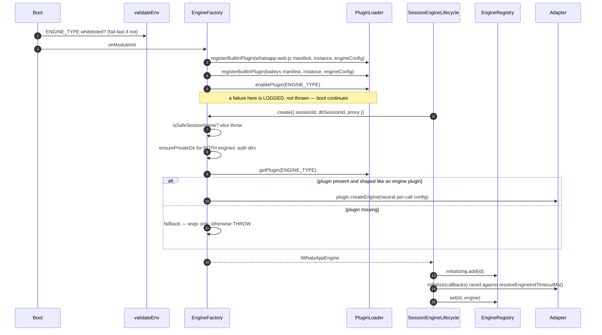
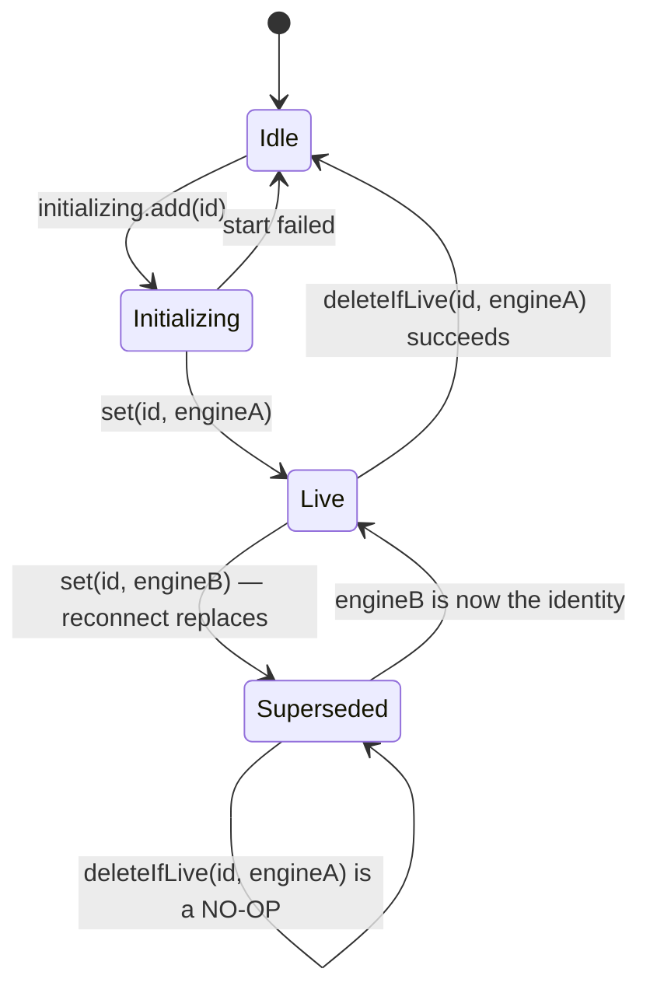

# Engine Factory, Registry and Module Wiring

> **Source of truth:** `src/engine/engine.factory.ts`, `src/engine/engine-registry.service.ts`, `src/engine/engine.module.ts`, `src/engine/builtin/whatsapp-web-js/index.ts`, `src/engine/builtin/baileys/index.ts`, `src/engine/engine-init-timeout.ts`, `src/engine/wa-web-version.ts`
> **Band:** Engine layer · **Depends on:** 10-engine-abstraction.md · **Jarcube class:** ENGINE-COUPLED

## Purpose

Everything between "the deployment picked an engine" and "this session has a live engine object".
That is five separate mechanisms with almost nothing in common except that all of them are load-bearing:
the `ENGINE_TYPE` selection (which routes through the plugin system rather than a switch statement),
the registration of the two built-in engines as plugins, the per-session registry that tracks live
instances by **identity** rather than presence, the init deadline that stops a wedged Chromium from
holding a session in `initializing` forever, and the WhatsApp Web version pin that exists because
whatsapp-web.js's own build auto-selection can authenticate and then never reach ready.

The thread running through all five is the same: a silent wrong answer is treated as worse than a
loud failure. The factory refuses to build the wrong engine, the registry refuses to let a superseded
engine evict its replacement, the boot validator refuses an `ENGINE_TYPE` typo, and the version
resolver logs every time it degrades.

## File Inventory

Line counts are as measured at the commit in 00-INDEX.md and drift.

| Path | Lines | Role |
| --- | --- | --- |
| `src/engine/engine.factory.ts` | 280 | Engine selection, built-in plugin registration, per-session construction, auth-dir purge, dashboard query methods |
| `src/engine/engine-registry.service.ts` | 128 | The live-engine map with identity semantics; the narrow port ~10 feature services use |
| `src/engine/engine.module.ts` | 19 | `@Global` module: providers, exports, the `'data'` TypeORM feature registration |
| `src/engine/builtin/whatsapp-web-js/index.ts` | 118 | The default engine as a plugin: config namespacing, feature list, real library version |
| `src/engine/builtin/baileys/index.ts` | 96 | The Baileys engine as a plugin |
| `src/engine/engine-init-timeout.ts` | 46 | The outer init deadline and the wwjs auth window it is derived from |
| `src/engine/wa-web-version.ts` | 211 | WhatsApp Web build resolution, settle rule, failure backoff, trust warning |
| `src/engine/engine.factory.spec.ts` | 262 | Factory unit specs |
| `src/engine/engine-registry.service.spec.ts` | 166 | Registry unit specs |
| `src/engine/wa-web-version.spec.ts` | 231 | Version-pin unit specs |

Related, not owned here: `src/config/env.validation.ts` (the `ENGINE_TYPE` whitelist),
`src/core/plugins/plugin-lifecycle.ts` and `src/core/plugins/plugin-loader.service.ts` (the
registration mechanism — 57-plugin-system.md), and
`src/modules/session/session-engine-lifecycle.service.ts` (the only caller of `initialize()` —
20-session-lifecycle.md).

## Data Model / Contract

`src/engine/engine.factory.ts:EngineCreateOptions` is the entire per-session input:

| Field | Type | Meaning |
| --- | --- | --- |
| `sessionId` | `string` | The session **NAME**. The on-disk auth-directory key — the same key `purgeSessionData` removes |
| `dbSessionId` | `string` | The session **UUID** (`Session.id`). The DB-row key for FK-bound stores, e.g. `baileys_stored_messages` |
| `proxyUrl?` | `string` | |
| `proxyType?` | `'http' \| 'https' \| 'socks4' \| 'socks5'` | Defaults to `http` when a URL is present |

The two ids are not interchangeable and mixing them is a real failure mode: the name keys files on
disk that survive a session delete-and-recreate, while the UUID keys rows that a foreign key would
cascade. `src/engine/types/baileys.types.ts:BaileysAdapterConfig` carries both for the same reason.

`src/engine/wa-web-version.ts:WebVersionPin` is the other contract shape:
`{ webVersion: string; webVersionCache: { type: 'remote'; remotePath: string } }`.

## Flow



## `ENGINE_TYPE` → adapter

The engine id is read **once**, in the constructor:

```ts
// src/engine/engine.factory.ts
this.engineType = this.configService.get<string>('engine.type') ?? 'whatsapp-web.js';
```

`engine.type` comes from `src/config/configuration.ts` as `process.env.ENGINE_TYPE || 'whatsapp-web.js'`.
Two ids are registered, and they are the plugin manifest ids: `whatsapp-web.js` and `baileys`.

Because it is read once and cached on the instance, **`ENGINE_TYPE` is a deploy-level switch, not a
runtime one**. `src/core/plugins/plugin-lifecycle.ts` enforces the same thing from the other side:
`enablePlugin` rejects any engine plugin that is not the configured active engine, with the message
"Set engine.type and restart to switch engines". Its stated reasoning is that the factory reads
`engine.type`, not plugin status, so enabling a second engine at runtime would show two active
engines in the dashboard and desync the factory.

### Why `src/config/env.validation.ts` whitelists it

`src/config/env.validation.ts:validateEnv` runs `checkEnum('ENGINE_TYPE', ['whatsapp-web.js', 'baileys'])`,
and the comment above it names the exact reason:

> Whitelist the registered engine/storage ids so a typo fails fast at boot instead of silently
> falling back to the default (engine.factory swallows an unknown `ENGINE_TYPE` → legacy wwebjs).

That is worth tracing, because "swallows" is precise rather than loose. With `ENGINE_TYPE=bailys`:

1. Both plugins register normally.
2. `enablePlugin('bailys')` throws `Plugin bailys not found` — and the factory **catches and logs**
   it rather than rethrowing, so boot continues.
3. On the first `create()`, `getPlugin('bailys')` returns `undefined`.
4. `createFallbackEngine` runs.

Step 4 is where the guard matters. The fallback carries its own refusal:

```ts
// src/engine/engine.factory.ts — createFallbackEngine
if (this.engineType !== 'whatsapp-web.js') {
  throw new Error(
    `Engine '${this.engineType}' is unavailable and has no direct fallback; cannot start the session.`,
  );
}
```

So a typo does not silently run whatsapp-web.js — the fallback refuses. But without the boot
whitelist, the operator's mistake surfaces as a per-session start failure minutes later, on the first
session start, with a message about a fallback rather than about a misspelled variable. The whitelist
moves the same information to boot, where it is actionable. `src/config/env.validation.spec.ts` pins
both directions (`'bailys'` throws, both real ids do not).

There is a second, blanker reason the whitelist earns its place. `src/config/env-precedence.ts`
lists `ENGINE_TYPE` in `BLANK_SHADOWED_ENV_KEYS`, because the bundled compose files forward the
operator's choice as `- ENGINE_TYPE=${ENGINE_TYPE:-}` — which renders as an *empty* variable when the
host sets nothing. An empty value must fall through to `data/.env.generated` (where a dashboard engine
switch is persisted) rather than pinning the default. 05-configuration-and-env.md covers the
three-layer precedence.

### The two selection outcomes, exhaustively

| `ENGINE_TYPE` | `enablePlugin` | `getPlugin` | Result |
| --- | --- | --- | --- |
| `whatsapp-web.js` | ok | present | wwjs adapter via plugin |
| `baileys` | ok | present | Baileys adapter via plugin |
| `whatsapp-web.js`, plugin somehow absent | — | missing | legacy fallback constructs the wwjs adapter directly, with a `engine_fallback` warning |
| `baileys`, plugin absent | — | missing | **throws** — never silently runs wwjs |
| anything else | throws (logged) | missing | rejected at boot by `validateEnv`; if that were bypassed, the fallback throws |

## Registration of the built-in engines

Both engines are registered as **plugins**, not as Nest providers, in
`src/engine/engine.factory.ts` under `OnModuleInit`. The manifest for each is a literal
`PluginManifest` with `type: PluginType.ENGINE` and `provides: ['whatsapp-engine']`:

| Manifest field | whatsapp-web.js | baileys |
| --- | --- | --- |
| `id` | `whatsapp-web.js` | `baileys` |
| `name` | WhatsApp Web.js Engine | Baileys Engine |
| `version` | `1.0.0` (the **adapter's** version, not the library's) | `1.0.0` |
| `main` | `index.ts` | `index.ts` |

`src/core/plugins/plugin-loader.service.ts:registerBuiltInPlugin` forwards to
`src/core/plugins/plugin-lifecycle.ts:registerBuiltInPlugin`, which does three things worth knowing:

- It merges config as `{ ...suppliedConfig, ...persistedOverrides }` — env-derived defaults stay live
  each boot so a changed `.env` wins, while an operator's persisted overrides win for the keys they
  actually set. The comment notes engine config is wholly env-derived, so it is never frozen to a
  first-boot snapshot.
- It marks the entry `builtIn: true`, which is what routes `enablePlugin` to the in-process path
  instead of the worker sandbox (58-plugin-sandbox.md).
- It restores persisted per-session activation and config, so a restart does not silently widen a
  built-in the operator had restricted.

### The double-supplied config, and why

The engine config sub-tree (`engine.*` from `src/config/configuration.ts`) is handed over **twice**:
once to `registerBuiltInPlugin` (where it becomes `context.config` when `onLoad` runs) and once to
each plugin's constructor. The factory comment states the reason: if `enablePlugin` fails before
`onLoad` runs, `this.context` stays unset, and without the constructor copy `sessionDataPath`,
`executablePath` and `authDir` would silently drop to their defaults. Both plugins encode the
preference explicitly:

```ts
// src/engine/builtin/baileys/index.ts
const engineConfig = (this.context?.config ?? this.registeredConfig ?? {}) as { baileys?: { authDir?: string } };
```

`context.config` is preferred because it carries the persisted-override merge; the constructor copy is
the fallback.

The blob is passed **opaque**. Each plugin reads only its own namespace —
`src/engine/builtin/whatsapp-web-js/index.ts:WhatsAppWebJsPlugin` reads `sessionDataPath` and
`puppeteer.*`, `src/engine/builtin/baileys/index.ts:BaileysPlugin` reads `baileys.authDir` — so the
factory never assembles browser-shaped fields. The per-call config the factory passes to
`createEngine` carries only engine-neutral fields: `sessionId`, `dbSessionId`, `proxyUrl`, `proxyType`.

### `IEnginePlugin` and the structural check

`src/core/plugins/plugin.interfaces.ts:IEnginePlugin` is small: `type: PluginType.ENGINE`,
`createEngine(config): unknown`, `getFeatures(): string[]`, and an optional
`getEngineLibrary(): { name, version }`.

Note `createEngine` returns `unknown`. The factory narrows it with a structural predicate rather than
an `instanceof`:

```ts
// src/engine/engine.factory.ts — isEnginePlugin
typeof instance === 'object' && instance !== null &&
'type' in instance && instance.type === PluginType.ENGINE &&
'createEngine' in instance && typeof instance.createEngine === 'function'
```

That is what would let a third-party engine plugin satisfy the contract without importing OpenWA's
classes. The cast back to `IWhatsAppEngine` at the call site is unchecked — the type system does not
verify that a plugin's engine actually implements all 112 members; the capability matrix and its
parity specs do (12-engine-capability-matrix.md).

### `getFeatures()` is advisory, and honest about it

Each plugin returns a coarse feature-token list for the dashboard. wwjs returns 15 tokens; Baileys
returns 11. The wwjs list carries a comment that is the pattern worth noting:

> No `'catalog'`: whatsapp-web.js has no catalog/product API, so the adapter 501s those methods —
> advertising the feature here would promise clients a capability the engine cannot deliver.

These tokens are **not** the capability matrix and do not gate anything; they feed
`getAvailableEngines()`. The real per-method truth is 12-engine-capability-matrix.md.

### `getEngineLibrary()` — the distinction operators need

Both plugins `require('<library>/package.json').version` inside a try/catch and fall back to
`'unknown'`. The point is that the manifest version (`1.0.0`, the adapter's) and the library version
(e.g. whatsapp-web.js 1.34.7) are different facts, and an operator debugging a WhatsApp-side breakage
needs the second one. `getAvailableEngines()` surfaces both:

| Field | Source |
| --- | --- |
| `id` / `name` | manifest |
| `enabled` | `pluginLoader.isPluginEnabled(id)` |
| `features` | `getFeatures()` |
| `library` | `getEngineLibrary?.()` — optional, so absent for a plugin that does not report it |

`getCurrentEngine()` returns the cached `engineType` string. 66-infra-management.md and
65-settings-and-health.md consume both.

## Per-session construction and its two guards

`create()` runs two hardening steps before it touches the plugin system.

**Session-name safety.** `src/common/utils/path-safety.ts:isSafeSessionName` is asserted at the top:

```ts
// src/engine/engine.factory.ts
if (!isSafeSessionName(options.sessionId)) {
  throw new Error(`Refusing to create an engine for an unsafe session name: ${JSON.stringify(options.sessionId)}`);
}
```

The comment explains why this is duplicated rather than left to the DTO: the session name becomes the
on-disk auth-directory key (`path.join(authDir, sessionId)` for Baileys, `session-${sessionId}` for
wwjs), so a name containing `.`, `/` or `\` could traverse outside it. Normal creation validates via
`CreateSessionDto`, but alternate paths — data import, seeding — can reach this sink with a raw name.
The assertion is at the sink, so the traversal cannot materialise regardless of source.

**Private credential directories.** `src/common/utils/private-dir.util.ts:ensurePrivateDir` is called
for **both** engines' auth dirs on every create, whichever engine this session runs and whichever
construction path serves it. The rationale is symmetric to `purgeSessionData` below: a whatsapp-web.js
profile and a Baileys `creds.json` each hold everything needed to take over the linked account, so
read access to the data volume must not be enough.

The two path derivations are private and mirror the adapters exactly:

| Engine | Directory | Note |
| --- | --- | --- |
| whatsapp-web.js | `path.join(path.resolve(sessionDataPath), 'session-' + name)` | Resolved, mirroring `clearLocalAuth` in the adapter |
| baileys | `path.join(authDir, name)` | `authDir` left **unresolved**, as the adapter does |

That asymmetry is deliberate and copied from the adapters rather than normalised, so the factory and
the adapter can never disagree about which directory belongs to a session.

## `purgeSessionData` — why both engines are wiped

`src/engine/engine.factory.ts:purgeSessionData` removes a session's persistent on-disk directories on
delete. Three decisions in it are non-obvious.

**It derives paths from config, not from a live adapter.** On delete the engine is frequently not even
loaded — a stopped session has none — and the directory survives independently of any instance.
Otherwise recreating a session under the same name would reload a stale store.

**It purges both engine shapes, not just the active one.** `ENGINE_TYPE` is a deploy-level switch, so
a session that ever ran under both engines leaves a live auth dir for each. Removing only the active
engine's would strand the other's WhatsApp credentials on disk after "delete" — able to silently
re-link if the engine is ever switched back, and carried into backups.

**Session START deliberately does not purge the inactive engine's residue.** An operator trialling the
other engine keeps the previous engine's link so switching back does not force a re-pair. The residue
goes only when the session itself is deleted.

Each `rm` is isolated: an unsafe name is refused up front (the same guard as `create()`, but logging a
warning and returning rather than throwing, because this is a cleanup path), and one engine's failure
is logged per-engine — it neither fails the delete nor skips the other engine's purge.

## Tracking live engines — `EngineRegistry`

`src/engine/engine-registry.service.ts:EngineRegistry` is the single source of truth for which engine
instance is live for a session, keyed by session **DB id**.

Its existence is an architectural fix, and the class comment says so: roughly ten feature services
previously injected the whole `SessionService` — a 2k-line lifecycle owner — purely to reach its
private `engines` map, which coupled every feature module to start/stop/delete/reconnect semantics
they never call. The registry is the narrow port between lifecycle and consumers.

### Identity, not presence

This is the part to internalise. Every engine callback captures its own engine instance. Once a
session is stopped (engine removed) or restarted/reconnected (engine **replaced**), a late callback
from the superseded engine must not mutate a session that now belongs to a different — or no —
engine. So the registry offers two identity-aware operations rather than leaving each of ~20 call
sites to re-derive the check:

| Member | Semantics |
| --- | --- |
| `isLive(id, engine)` | True only while `engine` is *still* the registered engine for `id`. Closes both the post-stop and the stale-generation windows a bare `has()` does not |
| `deleteIfLive(id, engine)` | Reconciles the map only if `engine` is still the registered one. Guards against a superseded engine's teardown evicting its live replacement — described in the source as the single most repeated invariant in the lifecycle paths |



### The rest of the surface

| Member | Note |
| --- | --- |
| `get` / `set` / `has` / `delete` / `clear` / `size` / `keys` / `entries` | Map-compatible surface, used by the lifecycle owner |
| `[Symbol.iterator]()` | Iterates a **snapshot** (`[...this.engines]`), because every caller tears engines down while iterating |
| `require(id, onMissing?)` | The consumer-facing accessor. Callers pass their own error so each API surface keeps the status and message it already documented — some 400 "not started", some 404 "not connected". Default is `BadRequestException('Session is not started')` |
| `initializing: ReadonlySet`-like `Set<string>` | Exposed **directly**, deliberately |
| `activeIds()` | `[...new Set([...engines.keys(), ...initializing])]` |

Two of those deserve a note.

`initializing` is a public `readonly Set` rather than being wrapped in add/remove methods, and the
comment defends it: the lifecycle owner needs the full `Set` surface including `clear()`, and this is
a *reservation ledger*, not an invariant that benefits from being funnelled through methods the way
engine identity is. Its purpose is that a session mid-construction is not yet in `engines` and would
otherwise look idle — and be orphaned or double-started — to concurrency accounting and to the infra
import pre-flight.

`activeIds()` is what the infra import pre-flight reads to refuse a full-replace restore that would
orphan a running engine (66-infra-management.md).

The `require(id, onMissing)` shape is why ~10 feature services can share one accessor without any of
them changing its documented HTTP status. `src/common/openapi/engine-status-responses.ts` documents
the resulting statuses on the OpenAPI surface.

## Module wiring

`src/engine/engine.module.ts` is 19 lines and every one is a decision:

```ts
@Global()
@Module({
  imports: [TypeOrmModule.forFeature([BaileysStoredMessage, LidMapping], 'data')],
  providers: [EngineFactory, BaileysMessageStoreService, LidMappingStoreService, EngineRegistry],
  exports: [EngineFactory, LidMappingStoreService, EngineRegistry],
})
export class EngineModule {}
```

- **`@Global`** so the ~10 feature services that only need a live engine can inject `EngineRegistry`
  directly instead of importing `SessionModule` to reach the lifecycle owner. The comment notes it is
  a DI singleton, which is what makes it a safe single source of truth.
- **`forFeature(..., 'data')`** — the second, non-default connection. OpenWA runs two data sources;
  71-migrations.md covers the split.
- **`BaileysStoredMessage`** is registered here even when `ENGINE_TYPE=whatsapp-web.js`, because the
  entity and its migrations are unconditional; only the adapter is lazy.
- `BaileysMessageStoreService` is a provider but **not** exported: it reaches the Baileys adapter only
  by being handed to `BaileysPlugin`'s constructor by the factory.

## Init timeout handling

`src/engine/engine-init-timeout.ts` holds two functions and exists because of a layering problem the
header states outright: the **outer** deadline is engine-agnostic (the session lifecycle applies it to
every engine) while the value it must clear is set by whatsapp-web.js. Deriving it inside the session
service meant the lifecycle owner imported the wwjs adapter just to size a timeout.

| Function | Returns |
| --- | --- |
| `src/engine/engine-init-timeout.ts:resolveAuthTimeoutMs` | `WWEBJS_AUTH_TIMEOUT_MS` when it is a positive safe integer, else `undefined` (keep whatsapp-web.js's own 30 000 ms default) |
| `src/engine/engine-init-timeout.ts:resolveEngineInitTimeoutMs` | `Math.max(60_000, (authTimeout ?? 30_000) + 30_000)` |

The validation in `resolveAuthTimeoutMs` is tighter than it looks: after `/^\d+$/`, it also requires
`Number.isSafeInteger`, because a huge digit string parses to `Infinity` and an over-2^53 value loses
precision — both pass the shape check and would make whatsapp-web.js's inject loop wait effectively
forever.

The derivation has three properties worth stating:

1. **The outer deadline must exceed the inner auth wait.** whatsapp-web.js polls for WA Web's JS to
   bootstrap inside `initialize()`; a shorter outer deadline would SIGKILL a legitimately slow init
   mid-auth. Hence `+ 30_000` for launch, navigation and post-inject overhead.
2. **60 s is a floor for the hang case**, so a small configured auth window still leaves room to tell
   "slow" from "wedged".
3. **`WWEBJS_AUTH_TIMEOUT_MS` can only raise the deadline, never lower it.** A Baileys session whose
   operator set the variable for whatsapp-web.js gets a *more* generous deadline, never a shorter
   one. Giving the two engines separate windows would need its own env var and is a behaviour change,
   which the comment declines to make here.

### How the deadline is applied

`src/modules/session/session-engine-lifecycle.service.ts` races `initialize()` against it, and the
surrounding code is where the subtlety lives:

- `engine.initialize()` has **no internal timeout** — whatsapp-web.js calls `page.goto(..., { timeout: 0 })`
  and its web-version-cache fetch has none either. Under container memory pressure the await never
  settles, which was observed in production as a session wedged in `INITIALIZING` with no logged error
  and `GET /sessions/:id/qr` 400ing forever.
- `Promise.race` cannot cancel the loser, so the init promise gets a bare `.catch(() => undefined)` to
  swallow a late rejection.
- **Only the timeout branch mutates state.** A real rejection (Chromium cannot launch) propagates
  untouched so `start()`'s catch keeps owning the `FAILED` + reason write.
- On timeout the engine is evicted from the registry **before** teardown, because `forceDestroy()`
  fires `onStateChanged` synchronously while the engine is still live — so removing it first makes the
  liveness check fail and prevents a redundant `DISCONNECTED` write. The comment explicitly warns
  **not** to port that reorder to `delete()`/`stop()`/`forceKill()`, where `has(id)` staying true for
  the duration of the teardown await is the only deterministic block on a concurrent `start()`.
- The failure surfaces as HTTP **504** with remediation text naming `WWEBJS_AUTH_TIMEOUT_MS`, rather
  than a bare 500.

21-session-fences-and-races.md covers the ordering rules in full.

## The WhatsApp Web version pin

`src/engine/wa-web-version.ts` decides which WhatsApp Web build the whatsapp-web.js engine loads. It
is deliberately free of whatsapp-web.js imports — env, `fetch` and the app logger only — so the infra
status endpoint can import it without pulling in the heavy library and breaking engine lazy-loading.

### Why a pin exists at all

whatsapp-web.js's own auto-select can latch onto a bleeding-edge build that authenticates and then
never reaches ready, producing a disconnect loop. So OpenWA pins to the
`wppconnect-team/wa-version` registry's known-good build instead
(`src/engine/wa-web-version.ts:WA_VERSION_REGISTRY_URL`).

### Resolution order

`src/engine/wa-web-version.ts:resolveWebVersionPin`:

| `WWEBJS_WEB_VERSION` | Behaviour |
| --- | --- |
| an exact version string | Pin it exactly. **No network call** |
| `off` | No pin — whatsapp-web.js native auto-select |
| unset, `auto`, or `latest` | Resolve the current known-good build from the registry and pin it; if the fetch fails, fall back to native auto-select |

`WWEBJS_WEB_VERSION_REMOTE_PATH` overrides the HTML URL template (`{version}` placeholder), defaulting
to the registry's own `html/{version}.html` path.

### The settle rule

`src/engine/wa-web-version.ts:pickSettledWebVersion` is a pure function (`now` is passed in) that does
**not** simply take the registry's `currentVersion`. It walks `versions[]` and picks the newest entry
that is:

- a string starting with a digit,
- not `beta === true`,
- released at least `WEB_VERSION_SETTLE_MS` (12 hours) ago,
- not already expired.

Falling back to `currentVersion` when nothing qualifies — a freshly reset registry, or every build
still too new — so the hardening never *defeats* pinning. The stated reason for the 12-hour floor is
that `currentVersion` tracks the latest build, which can be minutes old and unvalidated, and a build
the ecosystem has had time to validate is far less likely to hang before QR readiness.

### Caching and failure backoff

`src/engine/wa-web-version.ts:resolveCurrentWebVersion` has four states in module-level variables:

| State | Behaviour |
| --- | --- |
| `cachedCurrentVersion` set | Return immediately — a **successful** resolve is cached for the process lifetime |
| `inFlight` set | Return the shared promise — concurrent callers do not fan out into several fetches |
| `lastFailureAt` within `FAILURE_BACKOFF_MS` (60 s) | Return `null` **instantly, without a network call** |
| otherwise | Fetch with a 5 s `AbortController` deadline |

A failure is **not** cached permanently: a single transient outage must not permanently defeat the
pin. But an un-backed-off failure would re-stall every `/infra/status` poll and every session start on
a firewalled host, hence the 60-second window. `__resetWebVersionCache()` exists for tests only.

### Two logging decisions that are the opposite of each other

`warnRemoteTrustOnce` fires **once per process**. The pinned HTML is fetched over the network and
executed inside the authenticated `web.whatsapp.com` origin with **no integrity check**, so pinning is
a trust decision the operator must make knowingly. The warning names the version, the remote path, and
both opt-outs (`WWEBJS_WEB_VERSION=off`, or an operator-controlled `WWEBJS_WEB_VERSION_REMOTE_PATH`).
Once-only, because it runs on every session (re)start and the decision does not change.

`warnResolveFailed` fires **every attempt**, and the comment defends the asymmetry: the state is
ongoing rather than a one-time decision, and an operator diagnosing a session days into a container's
life reads a bounded log window — a warning emitted only at first failure would have scrolled away
exactly when it is needed. Repetition is already bounded by the `lastFailureAt` backoff, so at most
one warning per 60 seconds. Without it the degradation is invisible: the fetch is swallowed, the pin
resolves `undefined`, and the adapter logs only inside `if (versionPin)`.

### What the dashboard shows

`src/engine/wa-web-version.ts:getEffectiveWebVersionInfo` reports `{ version, source }` where source
is `pinned` (operator-set exact), `auto` (registry-resolved) or `native` (whatsapp-web.js selects).
`src/modules/infra/infra-status.controller.ts` consumes it — and calls `resolveCurrentWebVersion`
itself when the source is `auto`, so the status endpoint can show a version the engine has not been
started to resolve yet. This is distinct from the whatsapp-web.js *library* version that
`getEngineLibrary()` reports; conflating the two is the most common misreading.

## Call Chain

- `src/main.ts` → `src/config/env.validation.ts:validateEnv` — whitelists `ENGINE_TYPE` before any
  module initialises (04-bootstrap-and-lifecycle.md).
- `src/engine/engine.factory.ts:EngineFactory` `onModuleInit` →
  `src/core/plugins/plugin-loader.service.ts:registerBuiltInPlugin` ×2 →
  `src/core/plugins/plugin-lifecycle.ts:registerBuiltInPlugin` — adds the persisted-override merge and
  the registry entry.
- `EngineFactory.onModuleInit` → `enablePlugin(ENGINE_TYPE)` — adds the mutual-exclusion check;
  a failure is logged, never thrown.
- `src/modules/session/session-engine-lifecycle.service.ts` → `EngineFactory.create(options)` — adds
  name safety and private-dir hardening → `plugin.createEngine(...)` — adds per-engine config
  namespacing → the adapter constructor.
- Same service → `engine.initialize(callbacks)` raced against
  `src/engine/engine-init-timeout.ts:resolveEngineInitTimeoutMs` — adds the wedged-init 504.
- `src/engine/adapters/wwebjs-lifecycle.ts` → `src/engine/wa-web-version.ts:resolveWebVersionPin` —
  adds the build pin and its trust warning (whatsapp-web.js only).
- Feature service → `src/engine/engine-registry.service.ts:EngineRegistry` `require(id, onMissing)` —
  adds the liveness guard while preserving each surface's documented status.
- Session delete → `EngineFactory.purgeSessionData(name)` — adds both-engine credential removal.

## Configuration

| Env var | Default | Effect |
| --- | --- | --- |
| `ENGINE_TYPE` | `whatsapp-web.js` | Selects the adapter. Whitelisted at boot; blank falls through to `data/.env.generated` |
| `SESSION_DATA_PATH` | `./data/sessions` | whatsapp-web.js auth root; `session-<name>` per session |
| `BAILEYS_AUTH_DIR` | `./data/baileys` | Baileys multi-file auth root; `<name>` per session |
| `PUPPETEER_HEADLESS` | `true` | Read from the engine blob by the wwjs plugin |
| `PUPPETEER_ARGS` | `--no-sandbox,--disable-setuid-sandbox,--disable-dev-shm-usage,--disable-gpu` | Split on commas **and** whitespace, because the dashboard persists space-separated |
| `PUPPETEER_EXECUTABLE_PATH` | unset | System Chromium; required on Alpine/ARM/custom bases |
| `PUPPETEER_PROTOCOL_TIMEOUT_MS` | unset | Left undefined rather than defaulted, so unset means "whatever puppeteer-core says" instead of pinning today's number |
| `WWEBJS_AUTH_TIMEOUT_MS` | unset (library default 30 000) | Raises the wwjs auth wait **and** the outer init deadline; can only raise |
| `WWEBJS_WEB_VERSION` | unset (= `auto`) | Exact version, `off`, or auto-resolve |
| `WWEBJS_WEB_VERSION_REMOTE_PATH` | wa-version `html/{version}.html` | Operator-controlled pin source |
| `MAX_CONCURRENT_SESSIONS` | `0` (unlimited) | Bounds concurrently running or **initializing** engines — which is why `initializing` is public on the registry |

Full list: APPENDIX-A-env-vars.md.

## Events Emitted / Consumed

None directly. The factory and registry are structural; the callbacks the lifecycle supplies to
`initialize()` are 10-engine-abstraction.md and 15-engine-events.md, and the canonical event catalog is
APPENDIX-B-events.md.

## Failure Modes & Edge Cases

| Scenario | Behaviour | Pinned by |
| --- | --- | --- |
| `ENGINE_TYPE` typo | Boot **fails** with the allowed values named | `src/config/env.validation.spec.ts` |
| `ENGINE_TYPE` blank (compose `${ENGINE_TYPE:-}`) | Falls through to `.env` then `data/.env.generated` | `src/config/env-precedence.spec.ts` |
| `enablePlugin` fails at boot | Logged as `engine_enable_failed`; boot continues; the next `create()` takes the fallback path | `src/engine/engine.factory.spec.ts` |
| Plugin missing, engine is wwjs | Legacy fallback builds the adapter directly, warns `engine_fallback` | `src/engine/engine.factory.spec.ts` |
| Plugin missing, engine is baileys | **Throws** — never silently runs the wrong engine | `src/engine/engine.factory.spec.ts` |
| Attempt to enable the non-active engine at runtime | Rejected with "Set engine.type and restart" | 57-plugin-system.md |
| Unsafe session name reaching `create()` | Throws before any directory is created | `src/engine/engine.factory.spec.ts` |
| Unsafe session name reaching `purgeSessionData` | Warns and returns — no `rm` | `src/engine/engine.factory.spec.ts` |
| One engine's auth-dir `rm` fails on delete | Logged per engine; the delete still succeeds and the other engine is still purged | `src/engine/engine.factory.spec.ts` |
| `initialize()` never settles | 504 after `resolveEngineInitTimeoutMs()`, engine evicted then force-destroyed, status `DISCONNECTED` | 20-session-lifecycle.md |
| Superseded engine's teardown races its replacement | `deleteIfLive` is a no-op | `src/engine/engine-registry.service.spec.ts` |
| Late callback from a stopped engine | `isLive` returns false | `src/engine/engine-registry.service.spec.ts` |
| Feature service asks for an engine that is not started | Caller-supplied error (400 or 404), never a 500 | `src/engine/engine-registry.service.spec.ts` |
| wa-version registry unreachable | `null` after a 5 s abort, warned every attempt, at most once per 60 s; native auto-select is used | `src/engine/wa-web-version.spec.ts` |
| Registry reachable but every build too fresh | Falls back to `currentVersion` — pinning is never defeated by the settle rule | `src/engine/wa-web-version.spec.ts` |
| A remote pin takes effect | Warned once per process, naming both opt-outs | `src/engine/wa-web-version.spec.ts` |
| Engine switched, then the session deleted | Both engines' credentials removed | `src/engine/engine.factory.spec.ts` |

## Jarcube Portability

**Classification:** ENGINE-COUPLED

**Rationale:** Four of the five mechanisms here have no counterpart under Meta's official Cloud API,
because they exist to manage a *stateful local client process*.
`QuantumMind-backend/src/whatsapp/whatsapp.service.ts` holds a per-business-id record of
`{ accessToken, jarcubeBotId, whatsappCloud }` built lazily on the first inbound webhook — a
credential cache, not a lifecycle. Specifically:

- **The init deadline is meaningless.** There is no Chromium to launch, no WhatsApp Web page to
  inject, and nothing that can wedge in `initializing`. `src/engine/engine-init-timeout.ts` should not
  be ported.
- **The WhatsApp Web version pin is meaningless.** Cloud API is a versioned Graph API endpoint
  (`graphAPIVersion: "v15.0"` in Jarcube today); Meta versions the contract and deprecates on a
  schedule. There is no reverse-engineered build to pin and no third-party registry to trust. Nothing
  in `src/engine/wa-web-version.ts` transfers — and the *reason* it exists (an unpinned client can
  authenticate then never reach ready) cannot occur.
- **`purgeSessionData` is meaningless.** There are no on-disk WhatsApp credentials to strand, so the
  both-engines purge, the `isSafeSessionName` sink guard, and `ensurePrivateDir` all address risks
  Jarcube does not carry.
- **`ENGINE_TYPE` selection is redundant** with something Jarcube already has and arguably does
  better: `QuantumMind-backend/src/messaging/messaging-provider.registry.ts` resolves a provider per
  channel *per bot* through a feature flag, where OpenWA's switch is process-wide and needs a restart.

**Prerequisites:** none. Nothing in this doc is on a porting critical path.

**Cloud API caveats:** the one mechanism that transfers cleanly is the **registry's identity
discipline**, and it transfers for a reason unrelated to WhatsApp.
`QuantumMind-backend/src/whatsapp/whatsapp.service.ts` caches provider objects in a mutable
`private bots` record keyed by `businessId`, and its refresh condition is
`if (!accessToken || whatsappCloud)` — which rebuilds the entry whenever a `whatsappCloud` instance is
already present, so the cache never actually serves a hit on the happy path. Whatever the intent, the
lesson `EngineRegistry` encodes applies: when a long-lived object is cached per tenant and can be
*replaced*, presence in the map is not the same question as identity, and any callback that captured
the old object needs an identity check before it mutates shared state.

**Specific recommendations for Jarcube:**

- **Copy `isLive` / `deleteIfLive`, not the class.** Jarcube's `SocketStateService` and the `bots`
  record are both per-tenant caches of replaceable objects. Two three-line helpers written once beat
  the same comparison spelled out at each call site.
- **Copy the "reservation ledger" idea** (`initializing`) if Jarcube ever gains an async provider
  handshake. A tenant mid-setup that is invisible to concurrency accounting is the bug it prevents.
- **Copy the `require(id, onMissing)` shape.** It is the cheapest way to share one accessor across
  many controllers without any of them changing its documented HTTP status — which matters more in
  Jarcube, where several controllers already have different conventions.
- **Copy the boot-time enum whitelist**, generalised. Jarcube's `DEFAULT_PROVIDER_BY_CHANNEL` fallback
  in the registry means an unknown provider id silently resolves to the channel default, which is the
  same class of silent-fallback bug `checkEnum('ENGINE_TYPE', …)` was added to close. A boot
  assertion that every configured provider id is registered costs one line.
- **Do not copy the double-supplied config pattern.** It exists to survive a plugin `onLoad` that
  never ran; Jarcube's providers are plain Nest providers with constructor injection and cannot hit
  that failure.
- **Copy the *shape* of `getEngineLibrary()`, not the method:** report the upstream API version a
  provider is actually talking to, separately from the provider's own version. Jarcube hardcodes
  `graphAPIVersion: "v15.0"` inline, so nothing surfaces it to an operator debugging a Meta
  deprecation.

Module-by-module verdicts: 98-jarcube-porting-analysis.md. Wave ordering: 99-jarcube-port-roadmap.md.

## Open Questions

- `enablePlugin` failing at boot is caught and logged, so the process starts with no enabled engine
  and every session start then takes the fallback path. Whether the health or readiness probe reflects
  that state was not determined from these files — 65-settings-and-health.md.
- `registerBuiltInPlugin` merges persisted overrides over the env-derived engine blob, and the comment
  states engine config has no persisted overrides. Whether the dashboard's Infrastructure form can in
  practice write a key under the `engine` plugin id (which would then win over `.env`) needs
  66-infra-management.md to confirm.
- `getFeatures()` returns hand-maintained token lists that no spec appears to bind to the capability
  matrix — the wwjs list omits `catalog` by comment, but nothing enforces that the two stay
  consistent. Whether a gate exists elsewhere was not established; the parity specs in
  12-engine-capability-matrix.md do not read these lists.
- `resolveEngineInitTimeoutMs` is shared by both engines and `WWEBJS_AUTH_TIMEOUT_MS` can only raise
  it. Whether a Baileys-only deployment ever needs more than the 60 s floor is not answerable from the
  source.
- The wwjs auth dir is `path.resolve`d and the Baileys one is not. Both the factory and the adapters
  agree, so nothing is broken, but whether the asymmetry is deliberate or historical is not stated
  anywhere in these files.
