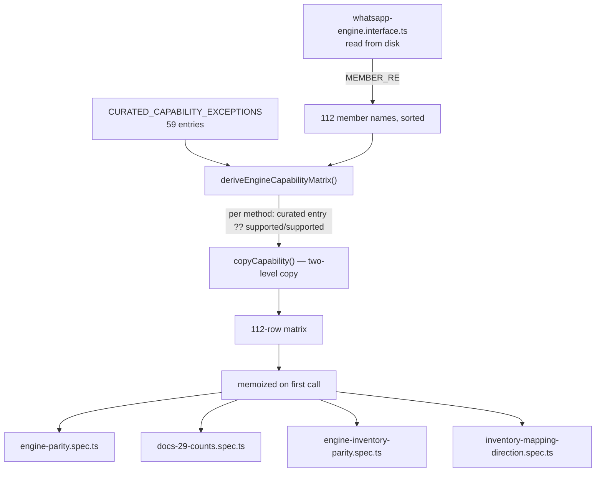

# Engine Capability Matrix and the Parity Gates

> **Source of truth:** `src/engine/engine-capability-matrix.ts`, `src/engine/engine-parity.spec.ts`, `src/engine/docs-29-counts.spec.ts`, `src/engine/engine-inventory-parity.spec.ts`, `src/engine/inventory-mapping-direction.spec.ts`, `src/common/errors/engine-not-supported.error.ts`
> **Band:** Engine layer · **Depends on:** 10-engine-abstraction.md, 11-engine-factory-registry.md · **Jarcube class:** ENGINE-COUPLED

## Purpose

Two adapters implement one 112-member interface, and neither implements all of it. The capability
matrix is the machine-readable statement of which member really works on which engine, and — the part
that makes it more than a table — a set of four specs that refuse to let the statement drift from the
code. The naive version of this artefact is a hand-maintained markdown table, which is wrong within a
release: someone adds an interface method, updates the adapter, and the table silently keeps claiming
112 when there are 113. The naive *second* version is a fully derived table, which cannot work either,
because introspection cannot tell whether a method that exists actually delivers.

So the matrix is deliberately **half derived, half curated**, and the gates police the seam. It also
carries the artefact this whole subsystem's honesty rests on: `evidence`, a source-traced citation of
the library symbol that was inspected, so a "not available" row tells a contributor where to start
rather than just closing the question.

OpenWA ships its own operator-facing document describing the same matrix, at:

```
docs/29-engine-capability-matrix.md
```

That document is for someone deciding which engine to deploy. This one is about the implementation
underneath it — the derivation, the 501 contract, and exactly what each gate enforces. Where a figure
appears in both, this doc recomputes it from `src/engine/engine-capability-matrix.ts` rather than
restating the prose.

## File Inventory

Line counts are as measured at the commit in 00-INDEX.md and drift.

| Path | Lines | Role |
| --- | --- | --- |
| `src/engine/engine-capability-matrix.ts` | 515 | The curated exception table, the interface reader, the lazy derivation and its cache |
| `src/engine/engine-parity.spec.ts` | 280 | The throws ⇔ not-available invariant, both directions, plus five fences that stop the scan failing open |
| `src/engine/docs-29-counts.spec.ts` | 206 | Binds every count-shaped claim in OpenWA's own §29 document to the matrix and to `scripts/` |
| `src/engine/engine-inventory-parity.spec.ts` | 223 | Binds the §29.5 hand-filled "OpenWA exposure" and event columns to real adapter code |
| `src/engine/inventory-mapping-direction.spec.ts` | 183 | Closes the direction blind spot using the TypeScript compiler API |
| `src/common/errors/engine-not-supported.error.ts` | 16 | `EngineNotSupportedError` → HTTP 501 |
| `src/common/errors/channel-media-not-supported.error.ts` | 18 | `ChannelMediaNotSupportedError` → HTTP 501, the one conditional 501 |

## Data Model / Contract

```ts
// src/engine/engine-capability-matrix.ts
export type CapabilityStatus = 'supported' | 'not-available';
export type RootCause = 'adapter-gap' | 'library-limitation' | 'uncertain';
export interface AdapterCapability { status: CapabilityStatus; rootCause?: RootCause }
export interface MethodCapability { wwjs: AdapterCapability; baileys: AdapterCapability; evidence?: string }
```

Note what is **not** modelled: there is no `partial`, no `degraded`, no `planned`. A cell is either
"this genuinely works end to end" or "a caller gets a 501". That binary is what makes the gate in
`src/engine/engine-parity.spec.ts` possible at all.

### `status`

`supported` means the capability works end to end. `not-available` covers **two** distinct situations,
and the file is explicit that both belong in the same bucket:

1. The adapter method throws `EngineNotSupportedError` or `ChannelMediaNotSupportedError` at the
   boundary → HTTP 501.
2. The adapter *claims* support but the underlying library cannot deliver — the phantom-support case,
   surfaced by source verification. The named historical example is the whatsapp-web.js catalog
   methods, which logged "not implemented" and returned `null`/`[]` without throwing.

Case 2 is why introspection alone cannot produce this column. An adapter body can exist, compile, and
still not deliver.

### `rootCause`

Present only when `status === 'not-available'`, and its whole purpose is to tell a contributor whether
the work is *in this repo*:

| Value | Meaning | Fixable here? |
| --- | --- | --- |
| `adapter-gap` | The underlying library **has** the capability; only the OpenWA wiring is missing | Yes — a PR that calls the symbol `evidence` names |
| `library-limitation` | The library exposes no first-class symbol for the operation | Not without a raw-proto or fork effort, or an event-cache hack |
| `uncertain` | The source trace was inconclusive; needs a live spike | Needs investigation first |

At the measured commit: **23** `library-limitation` cells, **2** `adapter-gap` cells, **0**
`uncertain`. The two fixable ones are wwjs `subscribeToChannel` and Baileys `getChannelMessages`.

### `evidence` — the field that carries the weight

`evidence` cites the library symbol or symbols that were **inspected**, so an engineer can open the
exact file and start wiring immediately. It is:

- **Required** when at least one adapter cell is `not-available`. A "no" without a citation is an
  opinion; with one it is a finding.
- **Optional but common** on a `supported` row, where it annotates the symbols the adapter now calls.
  Such a row stays curated until its evidence stops being worth a contributor's attention — which is
  why 35 of the 59 curated rows are `supported` on both engines.

What goes in it, in practice:

- The library symbol and its signature, with the declaration file and line (`groupParticipantsUpdate`
  … `Socket/groups.js:140-156`).
- The **return shape**, because that is usually the reason the row is curated at all — per-participant
  array versus batch object, boolean-on-refusal versus void, a reason string instead of a throw.
- **Measured** evidence where a source read was not conclusive. The `createGroup` and
  `transferChannelOwnership` rows carry live measurements including WA Web build numbers and response
  latencies, because the distinguishing signal was timing: a 4–9 ms local rejection against a
  352–531 ms known-server baseline taken in the same page is what proves the failure never reached
  WhatsApp. Two rows also record *negative* results — subscribing the target, promoting it, restarting
  the session, varying the build, changing the participant id shape — so the next person does not
  repeat them.
- A statement of what the fix would actually require when it is not a one-liner. The Baileys
  `getChannelMessages` row says the work is a `BinaryNode` → `ChannelMessage` parser, because the
  library returns a raw node and exposes no parser. The Baileys `votePoll` row says a hand-built
  `PollUpdateMessage` with HMAC-SHA256 vote encryption keyed by the poll creation's `messageSecret`.

Evidence is **hand-curated and must be reviewed** as adapters are wired or libraries change. No gate
verifies that a citation is still accurate — only that a `not-available` cell still throws. That limit
is stated in the file's own header rather than left to be discovered.

## How the matrix is derived



**Membership is derived.** `src/engine/engine-capability-matrix.ts:readInterfaceMethods` reads
`src/engine/interfaces/whatsapp-engine.interface.ts` from disk and applies
`src/engine/engine-capability-matrix.ts:MEMBER_RE`:

```
/^\s{2}([a-zA-Z][a-zA-Z0-9]*)\??\s*\(/
```

Two-space indent means "a member of a top-level interface". The `\??` is load-bearing: without it
`probeLiveness?()` does not match, the matrix silently omits it, and every optional method added to
the interface gets a permanent free pass. `src/engine/engine-parity.spec.ts` has a dedicated test for
exactly that regex, asserting it matches both an optional and a required declaration and still rejects
a nested member (four-space indent) and a non-call property.

**The default is supported/supported.** A method with no curated entry is assumed to plainly work on
both engines, which is the common case and costs no line. Adding a plain supported/supported entry to
the curated table is therefore a no-op by construction.

**Availability truth is curated.** `src/engine/engine-capability-matrix.ts:CURATED_CAPABILITY_EXCEPTIONS`
holds 59 entries: every row that is more than the default — any `not-available` cell, or a `supported`
row worth annotating.

**Derivation copies, never aliases.** `src/engine/engine-capability-matrix.ts:copyCapability` makes a
two-level copy so a consumer mutating a row (or a cell on it) cannot write through into the curated
table that every future derivation reads.

**Derivation is lazy and memoized.** `src/engine/engine-capability-matrix.ts:engineCapabilityMatrix`
derives on first call and caches. The reason is stated: deriving at module load meant *importing* this
module read the interface source from disk at import time — harmless for the spec and docs gates that
are its only consumers today, but a runtime import from a dist-only deployment image would have
crashed at import. Lazy derivation moves that failure to call time, where the named error in
`readInterfaceMethods` still states the fix. Two candidate paths are tried — the file among its
sources (ts-jest / ts-node) and `dist/engine` reaching back to `../../src/engine` inside a checkout —
and the file says outright that a dist-only image cannot read it, and that making the matrix a
build-time artefact is the fix *if* such a consumer ever appears. It has not.

## The 501 contract

`src/common/errors/engine-not-supported.error.ts:EngineNotSupportedError` extends NestJS's
`NotImplementedException`, so it maps to **HTTP 501** through the framework's built-in exception
handler — no custom global filter is required, and none is registered for it. The message is
`Operation not supported by the active engine: <method>`, and the constructor takes the method name,
which is what makes the parity gate's literal-argument scan possible.

`src/common/errors/channel-media-not-supported.error.ts:ChannelMediaNotSupportedError` is the second
501, and the only **conditional** one: a media send (image/video/audio/document/sticker) targeting a
channel (`<id>@newsletter`) on whatsapp-web.js. The library constructs the channel message and calls a
WhatsApp Web page method that a recent build removed, so the send crashes with a `TypeError`. Text to a
channel still works; only media is affected. Because the method is otherwise supported, this throw
must **not** flip a matrix cell — which is why the gate needs an explicit conditional-site registry
(below).

The wider status vocabulary the engine layer maps onto, for contrast:

| Error | Status | Meaning |
| --- | --- | --- |
| `EngineNotSupportedError` | 501 | The active engine cannot do this at all |
| `ChannelMediaNotSupportedError` | 501 | Supported method, refused for one target kind |
| `EngineNotReadyError` | 409 | Would work, but the session is not `ready` |
| `EngineRefusedError` | 403 | Well-formed, and WhatsApp said no |

Full mapping: APPENDIX-C-errors.md.

### Why 501 and not an empty answer

This is the point of the whole artefact. A `not-available` capability that returns `null` or `[]`
instead of throwing is what the source calls **phantom support**: the caller reads an empty result as
an answer. A dashboard shows "no labels" for an account that has labels; an integration concludes a
catalog is empty. `src/engine/engine-parity.spec.ts` checks the `not-available` ⇒ throws direction
specifically to catch that, and the file records that the wwjs catalog rows were the live example until
their stubs were replaced with explicit 501s.

The known limit is stated honestly: the throw-heuristic cannot see a non-throwing stub. If a future row
must stay non-throwing while `not-available`, the gate cannot verify it — keep it hand-tracked, or make
the adapter throw. Two rows (`getContactStatus`, `getContactStatuses`) were on that hand-tracked list
until the whatsapp-web.js implementation landed.

## The full capability table

<!-- COUNT:capabilities=112 -->

112 capability keys — one per `IWhatsAppEngine` member — in the derivation's own order (sorted).
`✅` = supported. `❌` = not available → HTTP 501, annotated with its `rootCause`. Evidence is
condensed here; the unabridged strings, including the measurement transcripts, are in
`src/engine/engine-capability-matrix.ts`. A `—` in the evidence column means the row is a **derived
default** with no curated entry, which is itself the claim: nothing about it needed annotating.

| capability | whatsapp-web.js | baileys | evidence |
| --- | --- | --- | --- |
| `addLabelToChat` | ✅ | ✅ | — |
| `addParticipants` | ✅ | ✅ | wwjs `addParticipants` resolves a per-participant `{code,message}` object, or a reason **string** on batch refusal; baileys `groupParticipantsUpdate(…,'add')` resolves per-jid `[{status}]`. Both mapped; per-participant outcomes surface on the HTTP `results` field, a total refusal throws |
| `approveGroupMembershipRequests` | ✅ | ✅ | wwjs `approveGroupMembershipRequests(groupId,{requesterIds,sleep})` — `requesterIds` null means every pending request; baileys `groupRequestParticipantsUpdate(…,'approve')` has no act-on-all form, so an omitted list enumerates `groupRequestParticipantsList` first |
| `archiveChat` | ✅ | ✅ | wwjs the **Client** `archiveChat`/`unarchiveChat` (boolean), not `Chat.archive()` which resolves void; baileys `chatModify({archive,lastMessages})` needs the chat's last message, so a chat with no known history resolves `false` rather than throwing |
| `blockContact` | ✅ | ✅ | — |
| `checkNumberExists` | ✅ | ✅ | — |
| `clearChatMessages` | ✅ | ✅ | wwjs `Chat.clearMessages()` → boolean; the injected `sendClearChat` returns `false` for an unknown chat; baileys `chatModify({clear:true,lastMessages})` — same last-message requirement as `archiveChat` |
| `createCallLink` | ✅ | ✅ | baileys `createCallLink(type,{startTime},timeoutMs)` resolves the bare `link_create` token, assembled behind the library's audio/video prefixes; wwjs `createCallLink(startTime,callType)` resolves the finished link or an empty string |
| `createChannel` | ✅ | ✅ | — |
| `createGroup` | ❌ library-limitation | ✅ | baileys `groupCreate(subject,participants)` → `GroupMetadata`. wwjs `createGroup` exists and is typed, but its injected evaluate reaches a WA Web internal that no longer exposes `findImpl` — **measured live on two builds** (one auto-resolved, one pinned), both a `TypeError` reaching the caller as a bare 500. Bare and `@c.us`-qualified participant ids fail identically, so id shape is not the variable; `findImpl` is in neither the installed library nor any OpenWA patcher, so it is the page's and cannot be patched around |
| `deleteChannel` | ✅ | ✅ | — |
| `deleteChat` | ✅ | ✅ | — |
| `deleteContact` | ✅ | ✅ | wwjs `deleteAddressbookContact(phoneNumber)` (the parameter is misspelled upstream but positional, so harmless); baileys `removeContact(jid)`. wwjs addresses by **phone**, baileys by **JID** — the adapter converts |
| `deleteGroupPicture` | ✅ | ✅ | wwjs `GroupChat.deletePicture()` → boolean, `false` → `EngineRefusedError`; baileys `removeProfilePicture(groupJid)` — the same call used for the own account, aimed at the group JID |
| `deleteLabel` | ❌ library-limitation | ✅ | baileys the same `addLabel` write with `deleted:true`; whatsapp-web.js has no label delete at all |
| `deleteMessage` | ✅ | ✅ | — |
| `deleteProfilePicture` | ✅ | ✅ | baileys `removeProfilePicture(ownJid)`, resolving void; wwjs `deleteProfilePicture()` forwards a page helper that returns `undefined` when `canDelete()` is false, `true` on HTTP 200 and `false` on a server status error — so only explicit `false` is a refusal |
| `deleteStatus` | ✅ | ✅ | — |
| `demoteChannelAdmin` | ❌ library-limitation | ✅ | baileys `newsletterDemote(jid,userJid)` via the DEMOTE WMex query. wwjs `demoteChannelAdmin` exists and is typed, but its page body calls a function WA Web no longer provides — measured live: `TypeError`, while `muteChannel` answered 200 on the same session. A module probe shows the module resolves and only the function is missing, and the alternative page path is `undefined` too. Neither library has a promote counterpart |
| `demoteParticipants` | ✅ | ✅ | wwjs `demoteParticipants` confirms only the **batch** (`{status:200}`); a non-200 now throws at the adapter. baileys `groupParticipantsUpdate(…,'demote')` is per-jid |
| `destroy` | ✅ | ✅ | — |
| `disconnect` | ✅ | ✅ | — |
| `editMessage` | ✅ | ✅ | wwjs `Message.edit(content,options?)`; baileys the `edit?: WAMessageKey` field on the text content variant, via `sendMessage(jid,{text,edit:key})` |
| `forceDestroy` | ✅ | ✅ | — |
| `forwardMessage` | ✅ | ✅ | — |
| `getBlockedContacts` | ✅ | ✅ | wwjs `getBlockedContacts()` returns full `Contact` models, mapped to neutral ids via `readWid`; baileys `fetchBlocklist()` returns bare jids — an unanswered query would resolve `[]` because `query()` swallows its timeout, so the adapter bounds it with its own deadline |
| `getCatalog` | ❌ library-limitation | ✅ | baileys `getCollections(jid)` → first collection synthesized into catalog metadata in `src/engine/adapters/baileys-catalog.ts`; wwjs has **no** `Client.getCatalog` (0 hits) — the adapter throws |
| `getChannelById` | ✅ | ✅ | — |
| `getChannelMessages` | ✅ | ❌ **adapter-gap** | baileys `newsletterFetchMessages(jid,count,since,after)` returns a **raw `BinaryNode`** of `<message_updates>` — the adapter is unwired *and* the library exposes no parser, so the BinaryNode → `ChannelMessage` mapping is the work; wwjs `Channel.fetchMessages` |
| `getChatHistory` | ✅ | ❌ library-limitation | baileys has only `fetchMessageHistory(count,oldestKey,oldestTs)`, which returns a sync-token string — the messages arrive later via the `messaging-history.set` event. There is no synchronous per-chat fetch; wwjs `Chat.fetchMessages` |
| `getChatLabels` | ✅ | ❌ library-limitation | baileys has no `getChatLabels` in its declarations; `ChatLabelAssociation` is a type with no query function, only add/remove writes; wwjs `getChatLabels` |
| `getChats` | ✅ | ✅ | — |
| `getChatsByLabel` | ✅ | ❌ library-limitation | wwjs `getChatsByLabelId(labelId)`; baileys exposes label **writes** only, with no query at all — listing a label's chats needs an app-state cache fed by the label-association sync events |
| `getContactById` | ✅ | ✅ | — |
| `getContactStatus` | ✅ | ❌ library-limitation | baileys `fetchStatus` is the **about/profile text**, not 24-hour stories; the library has no story getter |
| `getContactStatuses` | ✅ | ❌ library-limitation | baileys `fetchStatus` is about text only; no story enumeration in the library |
| `getContacts` | ✅ | ✅ | — |
| `getGroupInfo` | ✅ | ✅ | — |
| `getGroupInviteCode` | ✅ | ✅ | — |
| `getGroupJoinInfo` | ✅ | ✅ | — |
| `getGroupMembershipRequests` | ✅ | ✅ | wwjs returns **raw page-context store objects** (`{id,addedBy,parentGroupId,requestMethod,t}`), wids read through `readWid` for the `$1` rename; baileys returns bare wire attrs (`{jid,request_method,request_time}`) |
| `getGroups` | ✅ | ✅ | — |
| `getLabelById` | ✅ | ❌ library-limitation | baileys has no label getter — only the `Label` interface, a colour enum and the action body; derivable only from an app-state-sync cache; wwjs `getLabelById` |
| `getLabels` | ✅ | ❌ library-limitation | baileys exposes only label writes; derivable only from an app-state-sync event cache; wwjs `getLabels` |
| `getMessageReactions` | ✅ | ❌ library-limitation | baileys has no reaction getter; reactions exist only as event-augmented `WAMessage.reactions` via the `messages.reaction` event, and the adapter does not persist them into its store; wwjs `Message.getReactions` |
| `getNumberId` | ✅ | ✅ | — |
| `getPhoneNumber` | ✅ | ✅ | — |
| `getProduct` | ❌ library-limitation | ✅ | baileys cursor-walks `getCatalog` then finds by id (`src/engine/adapters/baileys-catalog.ts`); wwjs has no `Client.getProduct` — only a page-internal helper, not a public method |
| `getProducts` | ❌ library-limitation | ✅ | baileys `getCatalog({jid,limit,cursor})` cursor-walked in full, then page/limit sliced at the adapter; wwjs has no `Client.getProducts` (0 hits) |
| `getProfilePicture` | ✅ | ✅ | — |
| `getPushName` | ✅ | ✅ | — |
| `getQRCode` | ✅ | ✅ | — |
| `getStatus` | ✅ | ✅ | — |
| `getSubscribedChannels` | ✅ | ❌ library-limitation | baileys has no enumerate-newsletters function: 18 of its 19 newsletter members are per-jid (metadata needs a key, subscribers returns the count of **one**). Only the newsletter event surfaces jids opportunistically, which is incremental rather than list-all; wwjs `getChannels` |
| `initialize` | ✅ | ✅ | — |
| `joinGroupViaInviteCode` | ✅ | ✅ | wwjs `acceptInvite(inviteCode)` → the group id; baileys `groupAcceptInvite(code)` → `string \| undefined`, and `undefined` is mapped to a thrown error |
| `leaveGroup` | ✅ | ✅ | — |
| `logout` | ✅ | ✅ | — |
| `markUnread` | ✅ | ✅ | — |
| `muteChannel` | ✅ | ✅ | — |
| `muteChat` | ✅ | ✅ | baileys `chatModify({mute: <epoch milliseconds> \| null})` → `MuteAction.muteEndTimestamp`; wwjs `muteChat(chatId,unmuteDate)`/`unmuteChat(chatId)`, which floors `getTime()/1000` before the page write |
| `pinChat` | ✅ | ✅ | baileys `chatModify({pin})` → a pin action indexed by jid; wwjs `pinChat`/`unpinChat` resolve the **new** pin state and enforce a page-side maximum of 3 |
| `pinMessage` | ✅ | ✅ | wwjs `Message.pin(duration)` → boolean; the injected helper returns `false` for a non-number duration and for an unknown message, so the adapter maps `false` → `EngineRefusedError`. baileys `sendMessage(jid,{pin:key,type:PIN_FOR_ALL,time})` — **not** `chatModify({pin})`, which pins the chat in the list |
| `postImageStatus` | ✅ | ✅ | — |
| `postTextStatus` | ✅ | ✅ | — |
| `postVideoStatus` | ✅ | ✅ | — |
| `postVoiceStatus` | ✅ | ✅ | — |
| `probeLiveness` | ✅ | ✅ | Both implement it, at different depths — which is what the interface's optional marker allows. wwjs races a real `getState()` round trip against a 10 s timeout and answers alive inside the bounded navigation re-inject window; baileys returns a local check (`status === READY && sock != null`) because its keepalive already emits a close event within ~35 s. So a wedged wwjs page is caught **here**, a wedged baileys socket by the transport |
| `promoteParticipants` | ✅ | ✅ | wwjs `promoteParticipants` confirms only the batch; a non-200 now throws at the adapter. baileys `groupParticipantsUpdate(…,'promote')` is per-jid |
| `reactToMessage` | ✅ | ✅ | — |
| `rejectCall` | ✅ | ✅ | wwjs `Call.reject()` on the live `Call` cached from the client `call` event; baileys `rejectCall(callId,callFrom)` with the raw `from` JID cached from the `offer` call event |
| `rejectGroupMembershipRequests` | ✅ | ✅ | Same shapes as `approveGroupMembershipRequests`, with the Reject page action / the `'reject'` update action |
| `removeLabelFromChat` | ✅ | ✅ | — |
| `removeParticipants` | ✅ | ✅ | wwjs `removeParticipants` confirms only the batch; a non-200 now throws at the adapter instead of being discarded. baileys `groupParticipantsUpdate(…,'remove')` is per-jid |
| `replyToMessage` | ✅ | ✅ | — |
| `requestPairingCode` | ✅ | ✅ | — |
| `resolveContactPhone` | ✅ | ✅ | — |
| `revokeGroupInviteCode` | ✅ | ✅ | — |
| `sendAudioMessage` | ✅ | ✅ | — |
| `sendCatalog` | ❌ library-limitation | ❌ library-limitation | **The only row unavailable on both.** baileys' `AnyMessageContent` has no catalog key — only a single-`product` send and product-catalog CRUD; wwjs has no `Client.sendCatalog` (0 hits) |
| `sendChatState` | ✅ | ✅ | — |
| `sendContactMessage` | ✅ | ✅ | — |
| `sendDocumentMessage` | ✅ | ✅ | — |
| `sendImageMessage` | ✅ | ✅ | — |
| `sendLocationMessage` | ✅ | ✅ | — |
| `sendPollMessage` | ✅ | ✅ | — |
| `sendProduct` | ❌ library-limitation | ✅ | baileys `{product: WASendableProduct}` on the regular content union — the adapter resolves the product via `getCatalog` then sends the snapshot with `businessOwnerJid` = self; wwjs has no `Client.sendProduct` (Product/Order are inbound-only parsers) |
| `sendSeen` | ✅ | ✅ | — |
| `sendStickerMessage` | ✅ | ✅ | — |
| `sendTextMessage` | ✅ | ✅ | — (but see the conditional 501 on `customPreview`, below) |
| `sendVideoMessage` | ✅ | ✅ | — |
| `setGroupDescription` | ✅ | ✅ | wwjs `GroupChat.setDescription` → boolean, `false` → `EngineRefusedError`; baileys `groupUpdateDescription(jid,description?)` |
| `setGroupEphemeral` | ❌ library-limitation | ✅ | wwjs exposes **no** ephemeral setter — 0 hits in its declarations, only a create-time `messageTimer` option; the adapter throws. baileys `groupToggleEphemeral(jid,expiration)` |
| `setGroupInfoAdminsOnly` | ✅ | ✅ | wwjs `GroupChat.setInfoAdminsOnly` (sets the metadata `restrict` flag); baileys `groupSettingUpdate(jid,'locked'\|'unlocked')` |
| `setGroupMemberAddMode` | ✅ | ✅ | wwjs `GroupChat.setAddMembersAdminsOnly` → boolean, `false` → `EngineRefusedError`; baileys `groupMemberAddMode(jid,'admin_add'\|'all_member_add')`. Not a `groupSettingUpdate` option on either engine. The **read** side disagrees three ways: baileys reports a boolean where `true` = everyone, wwjs stores WhatsApp's raw strings while its own typings declare a boolean with the **opposite** sense — both normalised to `'all'\|'admins'` at the adapter |
| `setGroupMessagesAdminsOnly` | ✅ | ✅ | wwjs `GroupChat.setMessagesAdminsOnly` (sets the metadata `announce` flag); baileys `groupSettingUpdate(jid,'announcement'\|'not_announcement')` |
| `setGroupPicture` | ✅ | ✅ | wwjs `GroupChat.setPicture(MessageMedia)` → boolean — the **GroupChat** method, not `Client.setProfilePicture` which targets the own account; baileys `updateProfilePicture(groupJid, …)` |
| `setGroupSubject` | ✅ | ✅ | wwjs `GroupChat.setSubject` → boolean, `false` → `EngineRefusedError`; baileys `groupUpdateSubject(jid,subject)` |
| `setOnlinePresence` | ✅ | ✅ | wwjs `sendPresenceAvailable()`/`sendPresenceUnavailable()`; baileys `sendPresenceUpdate('available'\|'unavailable')` with **no jid** — the global whole-account form. Connection-scoped on both: resets on reconnect |
| `setProfileName` | ✅ | ✅ | wwjs `setDisplayName` → boolean, `false` → throws; baileys `updateProfileName(name)` |
| `setProfilePicture` | ✅ | ✅ | wwjs `setProfilePicture(MessageMedia)` → boolean, `false` → throws; baileys `updateProfilePicture(ownJid, …)` |
| `setProfileStatus` | ✅ | ✅ | wwjs `setStatus(status)`; baileys `updateProfileStatus(status)` |
| `starMessage` | ✅ | ✅ | wwjs `Message.star()`/`unstar()` resolve **void**, so there is no refusal signal to map (unlike pin); baileys `chatModify({star:{messages:[{id,fromMe}],star}})` — needs the stored key's `fromMe`, since the same id means different messages depending on direction |
| `subscribeToChannel` | ❌ **adapter-gap** | ✅ | wwjs `subscribeToChannel(channelId)` takes a **channel id**, not the interface's invite code, and `getChannelByInviteCode(inviteCode)` is the bridge. The adapter used to pass the invite code straight in and fabricate a `Channel` from the returned boolean; it now throws honestly, pending a verified two-step wiring. baileys `newsletterMetadata('invite',code)` + `newsletterFollow` |
| `subscribeToPresence` | ❌ library-limitation | ✅ | baileys `presenceSubscribe(toJid)` plus the `presence.update` event carrying a per-participant map; whatsapp-web.js has only `sendPresenceAvailable`/`sendPresenceUnavailable`, which publish the **account's own** presence — it exposes no subscribe and emits no presence event |
| `transferChannelOwnership` | ❌ library-limitation | ✅ | baileys `newsletterChangeOwner(jid,newOwnerJid)` via the CHANGE_OWNER WMex query — refusal **verified live as a real server round trip** (418 ms, WhatsApp code named). wwjs `transferChannelOwnership` exists and its page action is present, but it rejects **locally** with contact-not-found-in-subscriber-list in 4–9 ms against a 352–531 ms known-server baseline in the same page, unchanged by subscribing the target, promoting it to admin, or restarting the session. The only repopulation path — the newsletter metadata collection's `update` — is `undefined` |
| `unblockContact` | ✅ | ✅ | — |
| `unpinMessage` | ✅ | ✅ | wwjs `Message.unpin()` → boolean; it passes duration 0 explicitly so the injected non-number guard does not bite — `false` → `EngineRefusedError`. baileys `sendMessage(jid,{pin:key,type:UNPIN_FOR_ALL})`; `time` is ignored when unpinning |
| `unsubscribeFromChannel` | ✅ | ✅ | wwjs `unsubscribeFromChannel(channelId,options?)` → boolean, `false` → `EngineRefusedError`; baileys `newsletterUnfollow(jid)` |
| `upsertContact` | ✅ | ✅ | wwjs `saveOrEditAddressbookContact(phone,firstName,lastName,syncToAddressbook=false)` — `lastName` is positional and required, so an absent one is passed as `''`; baileys `addOrEditContact(jid,{firstName,fullName,saveOnPrimaryAddressbook})` |
| `upsertLabel` | ❌ library-limitation | ✅ | baileys `addLabel(jid,{id,name?,color?,deleted?})` emits one `label_edit` app-state patch indexed by label id, so create and update are the same write; whatsapp-web.js exposes label reads and chat-label assignment and **nothing that edits a label itself** |
| `votePoll` | ✅ | ❌ library-limitation | wwjs `Message.vote(selectedOptions)` matches options **by name** and throws a bare **string** on a non-poll target; baileys has no vote-send helper at all — only `decryptPollVote` for receiving, so sending needs a hand-built `PollUpdateMessage` with HMAC-SHA256 vote encryption keyed by the poll creation's `messageSecret` |

### Recount

Derived from `src/engine/engine-capability-matrix.ts` at the measured commit:

| Figure | Value |
| --- | --- |
| Capability keys (interface members) | **112** |
| Adapter cells | **224** |
| Supported cells | **199** |
| Not-available cells | **25** — 13 wwjs, 12 baileys |
| Methods carrying at least one not-available cell | **24** |
| Methods supported on **both** engines | **88** |
| Methods unavailable on **both** | **1** (`sendCatalog`) |
| Root causes | 23 `library-limitation`, 2 `adapter-gap`, 0 `uncertain` |
| Curated entries | **59** — 24 with a not-available cell, 35 annotating a supported row |
| Derived defaults (no curated entry) | **53** |

The two-per-engine asymmetry is worth stating plainly: **whatsapp-web.js is weaker on writes**
(labels, group creation, ephemeral timers, channel administration, presence subscription, commerce),
while **Baileys is weaker on reads** (chat history, label queries, reaction queries, story reads,
channel enumeration). That is not a coincidence — Baileys is a protocol client with no
self-maintained store, and whatsapp-web.js inherits whatever the WhatsApp Web page happens to expose
in the build it loaded.

### The conditional 501

One throw site names a *condition* rather than a method:

| Site | Meaning |
| --- | --- |
| `sendTextMessage(customPreview)` | wwjs `sendTextMessage` **is** supported. It refuses only when `customPreview` is passed, because whatsapp-web.js takes a boolean `linkPreview` and cannot represent a custom card |

"Supported with a refused option" is not "not-available", so this must not flip a matrix cell. It is
pinned in `src/engine/engine-parity.spec.ts:CONDITIONAL_THROW_SITES` so that deleting the throw
without updating the list fails the fence — and the fence also checks the reverse, so a stale entry
whose throw site no longer exists is caught too.

## What each parity spec enforces

Four specs, and they do not overlap. Read them as a chain: the first binds the matrix to the adapters,
the second binds the prose figures to the matrix, the third binds the hand-filled inventory columns to
real code, the fourth binds the *direction* of those columns.

### 1. `src/engine/engine-parity.spec.ts` — the throws ⇔ not-available biconditional

The core assertion is `it.each(methods)('%s: throws ⇔ not-available')`: for every interface method and
each of the two adapters, the observed throw behaviour must equal `status === 'not-available'`.

- **`throws` ⇒ `not-available`** catches an adapter that started refusing without the matrix being
  updated.
- **`not-available` ⇒ `throws`** is the one that catches phantom support — a cell could be marked
  `not-available`, quietly stop throwing, and nothing would go red.

No engine is instantiated and no Chromium or socket is opened. It reads method bodies via
`Class.prototype.method.toString()` and matches
`/this\.unsupported\(|EngineNotSupportedError|ChannelMediaNotSupportedError/`. A **missing** method
counts as effectively unavailable.

That prototype scan has a hole the spec closes explicitly: once an adapter method forwards to a
delegate module, its throw becomes invisible to `toString()` and **both** directions stop applying —
so a genuinely unsupported method could be marked `supported` and the gate would say nothing. That is
not hypothetical; nearly every wwjs unsupported-throw now lives in a `wwebjs-*` module. So the spec
builds a **delegate throw registry** by scanning every adapter file for
`new EngineNotSupportedError('literal')` / `this.unsupported('literal')` and bucketing by filename.

Five fences stop that widened scan from failing open:

| Fence | What it refuses |
| --- | --- |
| Registry non-vacuity | An empty registry (which would collapse the scan back to prototype-only with nothing turning red). Requires ≥5 wwjs entries, and asserts the known-positive: `getCatalog`'s throw lives in `src/engine/adapters/wwebjs-catalog.ts` **and** is absent from the adapter's own prototype body |
| Literal-argument completeness | A construction site the literal registry cannot see — a template literal, a variable argument — which would be invisible to both directions while still refusing at runtime. It counts *every* construction site per file and requires the non-literal count to be exactly one where the `private unsupported(method: string)` helper is present, zero otherwise |
| Literal-is-a-method-name | A literal that names no interface method: either an unregistered conditional refusal, or a typo. The error message names both fixes |
| Engine attribution | An adapter file whose name carries no engine prefix and is not attributed in `UNPREFIXED_FILE_ENGINES`. Checked **both** ways, so a rename or deletion leaving a stale entry fails too. The attributions were read off the import graph, not guessed: `src/engine/adapters/safe-link-preview.ts` is reached only from the Baileys messaging module — the old "else wwjs" default credited it to the wrong engine |
| Shared modules carry no throw | A throw inside a module **both** adapters import (`src/engine/adapters/message-mapper.ts`, `src/engine/adapters/vcard.ts`, `src/engine/adapters/inbound-media-cap.ts`). `'shared'` is not an attribution — it is the statement that no correct attribution exists. Crediting such a refusal to both engines makes the invariant demand `not-available` from the engine that never refuses; crediting it to neither demands `supported` from the engine that does. Both press a false cell into the matrix, so the throw is refused where it stands, with the fix named (move it into that engine's own delegate) |

Two more assertions guard the derivation itself:

- **`matrix keys exactly match the interface methods`** (no missing, no stale). This is the *binding*
  between the two independent readers: the spec walks the interface with its own copy of `MEMBER_RE`
  and the matrix module walks it with its own. If either drifted, the derived keys and the spec's
  inventory would disagree here.
- **`curated exceptions name interface methods`** — the stale-curation fence. Derivation only reads an
  exception for a name found on the interface, so a curated entry whose method was renamed or removed
  would otherwise vanish without a signal, taking its `rootCause` and `evidence` knowledge with it.
  It fails instead, so the knowledge is re-homed deliberately. A non-vacuity check (`curated.length > 0`)
  stops an emptied table from passing trivially while every not-available cell silently became the
  supported/supported default.

### 2. `src/engine/docs-29-counts.spec.ts` — the prose cannot lie about the matrix

OpenWA's §29 document states the same three figures in ten places: the intro, the architecture prose,
a mermaid node, two section headings, the §29.4 totals and the §29.8 summary. All ten are hand-written
restatements. The spec's docblock records what happened without it: adding one interface method updated
the matrix and one summary and left the other six behind, and nothing noticed — the parity gates
compare the matrix to the interface, and no check read the prose.

Three tests:

**`states the same figures everywhere it states them`.** `recount()` reads the matrix **value** (not
the file text, because the matrix is derived and no longer carries one row per method) and computes
methods / cells / supported / neutral. Fourteen labelled regexes then bind each phrasing to one of
those figures. Two details matter:

- A **phrasing that stopped matching is treated as drift**, not as a skip: "the claim did not
  disappear, the check did."
- `neutral` is `bothSupported + 2`. The REST caller's view counts the two store-backed status reads as
  engine-neutral rather than wwjs-only, and the document states that adjustment explicitly where it
  uses the figure.
- Non-vacuity: `rows.length > 80`, so a truncated matrix cannot make the whole document "agree".

**`states the install-time patch counts the scripts directory actually contains`.** The patch figures
come from a different source — `scripts/` — and drifted the same way. They are now derived from disk
by filename prefix (`patch-wwebjs-*` / `patch-baileys-*`), so adding a patcher updates the expectation
rather than requiring someone to remember the prose. It also checks a **spelled-out** number — the
§29.3 opening sentence writes the total as a word rather than digits, and a `WORDS` lookup table maps
`four`…`ten` back to integers — because that phrasing and the per-library split both drifted while the
digit-shaped claims held. At the measured commit `scripts/` carries 8 patchers, 6 on whatsapp-web.js
and 2 on Baileys. 18-upstream-patching.md covers the patch set itself.

**`summarises its own tables with the numbers those tables contain`.** Three claims restate something
the *document* contains rather than the matrix, so a matrix-derived check cannot see them drift — and
they did: demoting one cell moved the not-available span, marking three rows moved the
patch-dependency count, and a prose split kept the pre-demotion numbers. Each is recounted from the
table it summarises: the not-available span cross-checked between two sections, the wwjs
patch-dependency count recounted from the `✅🔧ⁿ` marks the §29.4 table actually carries (excluding the
one Baileys mark), and the §29.5.2 wired/not-exposed split recounted from that table's rows. All four
selectors carry a non-vacuity guard, because a reworded table would otherwise make every comparison
pass.

### 3. `src/engine/engine-inventory-parity.spec.ts` — the hand-filled columns have code behind them

§29.4 is gated by spec 1 and the symbol *lists* in §29.5 are gated by a separate upstream-surface
snapshot check. What nothing watched was the two columns a human fills in: the "OpenWA exposure"
column (which library symbol the adapters use) and the events column (which library events the
adapters subscribe to). Both had drifted — symbols marked used that appear only inside a comment, and
events marked consumed with no listener at all. Those are precisely the marks a reader triaging
backlog work trusts most.

Per engine, four assertions:

| Assertion | Mechanism |
| --- | --- |
| Every ✅/⚙️ symbol appears in adapter **code**, not just a comment | Comments stripped; usage must be a **property access** (`.symbol`), never a bare word — so a method naming itself in its own `EngineNotSupportedError('x')` cannot satisfy the gate |
| Every ✅/⚙️ symbol is reached **through a library handle** | The weaker name check was satisfied by our own identically-named methods. This one requires the symbol to hang off `this.client()` / `this.sock()` / `getSocket()` / a client-or-socket-shaped local, tolerating casts and computed dispatch. It found two rows a name search had blessed for as long as they existed: Baileys `star` (`starMessage` actually goes through `chatModify`) and wwjs `sendSeen` (the adapter calls the `Chat` model method, not the `Client` one) |
| Every interface method named in a ✅ cell is `supported` in the matrix for that engine | Cross-binds the inventory to the capability table |
| Every ✅ event mark matches a registered listener | Registered events are scraped as `.on('event')` across the adapter corpus |

Two meta-tests keep it from failing open. The parser test asserts the row and event counts equal the
gated `scripts/upstream-surface.snapshot.json` symbol counts, so a parser that stopped matching fails
rather than passing vacuously. The scrubber test runs on a **synthetic** sample — a comment mention, a
block-comment mention, an apostrophe inside a double-quoted string, a self-naming throw, a real call,
a real `.on()` — so it never depends on the repo, and asserts the real corpus is over 50 000
characters with at least 20 registered events.

One deliberate omission is documented in the source: string literals are **not** stripped, because
doing so properly needs a tokenizer and a regex attempt collapses on an apostrophe inside a
double-quoted string, silently eating code — which fails **open**, the one direction a drift gate must
never fail.

The spec also names its own blind spots, which is why spec 4 exists:

- **Under-mapping.** A row listing four interface methods when the symbol really serves eight still
  passes. The check is "the claim has code behind it", not "the claim is exhaustive".
- **Direction.** Mapping symbol A to method B instead of C passes as long as both exist.

### 4. `src/engine/inventory-mapping-direction.spec.ts` — direction, via the compiler

A row saying "`groupMetadata` → `getGroupInfo`, `getGroups`" claims both interface methods reach that
symbol. Thirteen rows were wrong: `logout` credited to `initialize` and `disconnect` (where the only
mentions are in comments), `setProfilePicture` credited to `setGroupPicture` (whose own code comment
says the opposite), `archiveChat` credited to `clearChatMessages` (which calls `Chat.clearMessages()`),
and ten more.

Regex cannot answer this, because the call usually sits in a private helper — the real question is
reachability through the adapter's own call graph. So the spec imports `typescript` and walks the
adapter ASTs:

1. For every method declaration in every adapter file, record: library symbols reached through a
   handle, `this.…` calls it makes, string literals it contains, and whether it does computed dispatch
   through a handle.
2. Handle detection unwraps parentheses, `as` casts and non-null assertions — `(this.client() as X).m()`
   and `this.sock!.m()` are real call sites, and missing either produced false positives.
3. `reachers(symbol, engine)` seeds with direct reachers, credits split computed dispatch (a helper
   holds `handle[op](…)` while its caller supplies the literal), then closes transitively over
   `this.…()` calls until the set stops growing.
4. Assert **one way only**: no row names an interface method that cannot reach its symbol.

The one-way choice is argued in the source. Over-listing is a false claim — a reader is told a method
uses a symbol it cannot reach. Under-listing is merely incomplete, and the sibling spec already
documents exhaustiveness as a non-goal.

Non-vacuity: `GRAPH.size > 150` (an empty walk would make every assertion pass) and more than 20
parsed rows per engine.

### What no gate checks

Stated plainly, because a green run should not be read as more than it is:

- **Evidence accuracy.** Nothing verifies a citation still points at a real library symbol, or that a
  measurement still reproduces.
- **`rootCause` correctness.** `adapter-gap` versus `library-limitation` is a human judgement.
- **Non-throwing phantom stubs.** If a `not-available` row stops throwing while still returning
  `null`/`[]`, spec 1 catches it *only because* it demands a throw. A row deliberately kept
  non-throwing is outside the gate and must be hand-tracked.
- **Exhaustiveness of the inventory mapping** (spec 3's documented non-goal).
- **The `getFeatures()` token lists** on the two plugins, which are a separate hand-maintained surface
  — see 11-engine-factory-registry.md.

## Call Chain

- `src/engine/engine-capability-matrix.ts:engineCapabilityMatrix` → `deriveEngineCapabilityMatrix` →
  `readInterfaceMethods` (reads `src/engine/interfaces/whatsapp-engine.interface.ts` from disk) +
  `CURATED_CAPABILITY_EXCEPTIONS` → `copyCapability` per row → memoized result.
- `src/engine/engine-parity.spec.ts` → the matrix **and** `WhatsAppWebJsAdapter.prototype` /
  `BaileysAdapter.prototype` bodies + every file in `src/engine/adapters` → the biconditional.
- `src/engine/docs-29-counts.spec.ts` → the matrix value + `scripts/` directory listing + OpenWA's own
  §29 document text → 14 + 8 + 3 claim comparisons.
- `src/engine/engine-inventory-parity.spec.ts` → §29.5 tables +
  `scripts/upstream-surface.snapshot.json` + scrubbed adapter sources → exposure and event marks.
- `src/engine/inventory-mapping-direction.spec.ts` → `typescript` AST of `src/engine/adapters` + §29.5
  tables + the matrix → direction.
- Runtime path, for contrast: adapter method →
  `src/common/errors/engine-not-supported.error.ts:EngineNotSupportedError` → NestJS
  `NotImplementedException` → **HTTP 501**. The matrix is not consulted at runtime; it is a
  documentation and gating artefact.

## Configuration

None. The matrix reads no environment variables and has no feature flag. Which column applies at
runtime is decided by `ENGINE_TYPE` — 11-engine-factory-registry.md and APPENDIX-A-env-vars.md.

## Events Emitted / Consumed

None. Event **parity** between the two adapters is enforced by spec 3's event-mark assertion, but the
events themselves are 15-engine-events.md and APPENDIX-B-events.md.

## Failure Modes & Edge Cases

| Scenario | What happens |
| --- | --- |
| An interface method is added | It appears in the derived matrix as supported/supported the moment it compiles. If the adapters do not implement it, spec 1 fails on `throws ⇔ not-available` (a missing method counts as unavailable) |
| An interface method is removed | It drops out of the derivation. If a curated entry named it, the stale-curation fence fails |
| An interface method is renamed | Both above at once: a new default row plus a stale curated entry |
| An **optional** method is added | Caught, because `MEMBER_RE` carries `\??`. A dedicated test pins that regex |
| An adapter starts throwing 501 without a matrix update | Spec 1 fails |
| A `not-available` cell stops throwing | Spec 1 fails from the other direction |
| A refusal moves from the adapter into a delegate module | The delegate registry sees it; the literal-argument fence ensures it stayed literal |
| A refusal is constructed with a template literal or a variable | The literal-argument fence fails — it is invisible to both directions otherwise |
| A refusal is added to a **shared** adapter module | Refused outright by the shared-modules fence, with the fix named |
| A new unprefixed adapter file appears | The attribution fence names it and demands an entry or a prefix |
| A count-shaped figure in the §29 prose drifts | `docs-29-counts.spec.ts` fails, naming the claim and both values |
| A §29 phrasing is reworded | Also fails — a check that stopped matching is treated as drift |
| A patch script is added or removed | The `scripts/`-derived patch counts fail until the prose (digits **and** spelled-out words) is updated |
| An inventory ✅ names a symbol only mentioned in a comment | Spec 3 fails (property-access requirement) |
| An inventory ✅ names an OpenWA method of the same name as a library symbol | Spec 3's library-handle assertion fails |
| An inventory ✅ names an interface method that is `not-available` for that engine | Spec 3 cross-check fails |
| An inventory row over-lists a method that cannot reach its symbol | Spec 4 fails |
| An inventory row **under**-lists | Passes. Documented non-goal |
| `evidence` becomes stale or wrong | **Not caught.** Human review only |
| The matrix is imported from a dist-only image with no `src/` beside it | `readInterfaceMethods` throws a named error at **call** time (not import time) stating the fix |

## Jarcube Portability

**Classification:** ENGINE-COUPLED

**Rationale (the artefact):** the *content* of this matrix is worthless to Jarcube. Every row is a
statement about `whatsapp-web.js` or `@whiskeysockets/baileys`, and
`QuantumMind-backend/src/whatsapp/whatsapp.service.ts` talks to Meta's official Cloud API through
`QuantumMind-backend/src/whatsapp/util/index.ts`. The 25 not-available cells are about two
reverse-engineered clients; Cloud API's gaps are entirely different ones (no group administration, no
labels, no presence subscription, no stories, template-gated outbound messaging, 24-hour customer
service windows). The derivation is likewise coupled: it reads a specific interface file with a regex
tuned to that file's indentation.

**Rationale (the pattern) — and this is the part worth stealing.** The mechanism is not
multi-engine-specific at all. It is: *a capability claim that is half derived from code and half
curated, where a spec enforces the biconditional between the claim and the code's observable
behaviour.* That is valuable in a **single-transport** system, and Jarcube already has the exact shape
of problem it solves. `QuantumMind-backend/src/messaging/interfaces/messaging-provider.interface.ts`
declares `supportsFeature(feature: ProviderFeature): boolean`, and today it is implemented as a
hardcoded array literal per provider:

- `QuantumMind-backend/src/messaging/providers/whatsapp-official.provider.ts` returns
  `['text','media','buttons','cta_url']`.
- `QuantumMind-backend/src/messaging/providers/whatsapp-openwa.provider.ts` returns `['text','media']`
  with a comment explaining that whatsapp-web.js cannot send native `cta_url` buttons so the URL goes
  out as plain text.

Those two lists are exactly what OpenWA's `getFeatures()` is — an ungated, hand-maintained claim — and
they carry the same risk. Nothing binds them to `sendMessage`'s real behaviour. A provider can grow a
`cta_url` branch and never update the list, or drop one and keep advertising it, and no test fails.
Worse, the OpenWA provider's own comment documents a **silent degradation** (a CTA becomes plain text),
which is Jarcube's version of phantom support: the caller believes a button was sent.

**Prerequisites:** none. This is a standalone pattern port; nothing else has to move first.

**Cloud API caveats:** Jarcube's capability axis is not "which client library" but "which provider,
and under which Meta policy". Template-gated sends and the 24-hour window are *conditional*
capabilities, which map onto the conditional-throw concept
(`CONDITIONAL_THROW_SITES` / `ChannelMediaNotSupportedError`) rather than onto a `not-available` cell.
Get that distinction right up front or the matrix will grow a `partial` status, which is precisely what
`CapabilityStatus` refuses to have.

**Specific recommendations for Jarcube:**

- **Derive the feature list, curate only the exceptions.** Enumerate `OutboundMessage['type']` (8
  members today) as the row space, default every provider to supported, and hand-curate only the cells
  that are not. That is the whole derived/curated split, and it makes adding a message type
  automatically appear in every provider's row.
- **Write the biconditional spec.** For each provider and each feature, assert that
  `supportsFeature(f) === false` **iff** `sendMessage` refuses that type. Jarcube's providers already
  return `SendResult { status: 'failed', error }` rather than throwing, so the observable is a returned
  status rather than a thrown class — the assertion shape is identical.
- **Kill the silent CTA degradation, or make it a declared capability.** Right now `cta_url` on the
  OpenWA provider reports unsupported *and* still delivers something different from what was asked.
  Pick one: refuse it (`status: 'failed'`), or declare a `cta_url_as_text` capability so a caller can
  make the choice. OpenWA's `EngineNotSupportedError`-over-empty-stub decision is the same call, made
  the other way.
- **Adopt the `evidence` field verbatim.** For Jarcube it would cite the Graph API endpoint or the Meta
  policy document that makes a cell false. That is the difference between "buttons don't work on this
  provider" and "buttons require an approved template — endpoint X, policy Y" — the second is
  actionable, the first generates a support ticket.
- **Adopt `rootCause`, renamed.** `adapter-gap` versus `library-limitation` becomes "our wiring is
  missing" versus "Meta does not offer it", which is exactly the triage question a Jarcube backlog
  groomer asks.
- **Adopt the non-vacuity habit.** Every gate in these four specs asserts its own selectors found
  something before asserting anything about them. Jarcube's provider specs would be trivially
  satisfiable by an empty registry otherwise, and `MessagingProviderRegistry.listByChannel()` returning
  `{}` is a realistic failure given that providers self-register on construction.
- **Do not port the AST direction spec.** It exists to police a 976-line hand-written inventory table
  mapping library symbols to interface methods. Jarcube has no such table and should not create one.
- **Do not port the docs-count spec as written**, but do adopt its principle if any Jarcube figure gets
  restated in prose: bind the number to its source, and treat a phrasing that no longer matches as
  drift rather than as a skip. That single decision is what stopped six of ten restatements from
  rotting.

Module-by-module verdicts: 98-jarcube-porting-analysis.md. The provider abstraction Jarcube already
has is assessed there too.

## Open Questions

- `RootCause` declares `'uncertain'` and no row uses it. Whether it is aspirational or a value that
  existed and was resolved away cannot be determined from the file.
- `docs-29-counts.spec.ts` computes `neutral = bothSupported + 2`, describing the `+2` as "the two
  store-backed status reads". Which two members those are is not named in the spec, and the matrix
  itself carries no marker for them — it has to be inferred from the §29 prose.
- `evidence` mixes two very different kinds of claim: static source reads ("0 hits in the declarations")
  and live measurements with build numbers and latencies. Nothing distinguishes them structurally, so a
  reader cannot filter for "claims that could have gone stale when WhatsApp Web updated". Whether that
  was considered is not recorded.
- The matrix module's header notes a dist-only deployment image cannot read the interface source and
  that a build-time artefact is the fix "if such a consumer ever appears". Whether the OpenWA runtime
  image ships `src/` was not verified here — 74-docker-and-compose.md would settle it.
- `src/engine/engine-inventory-parity.spec.ts` and `src/engine/inventory-mapping-direction.spec.ts`
  both parse OpenWA's own §29 markdown with index-based section slicing. That makes two production-gating
  specs depend on the heading text of a document in the same repo. Whether a heading rename is intended
  to fail the build (the parser guards suggest yes) or is an accepted fragility is not stated.
- Two `adapter-gap` cells are, by their own definition, fixable in this repo. Whether either has an open
  issue or an owner is not visible from the source.
