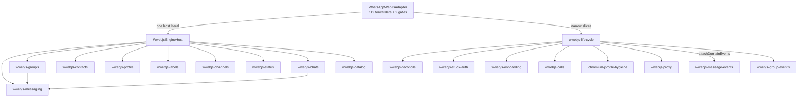
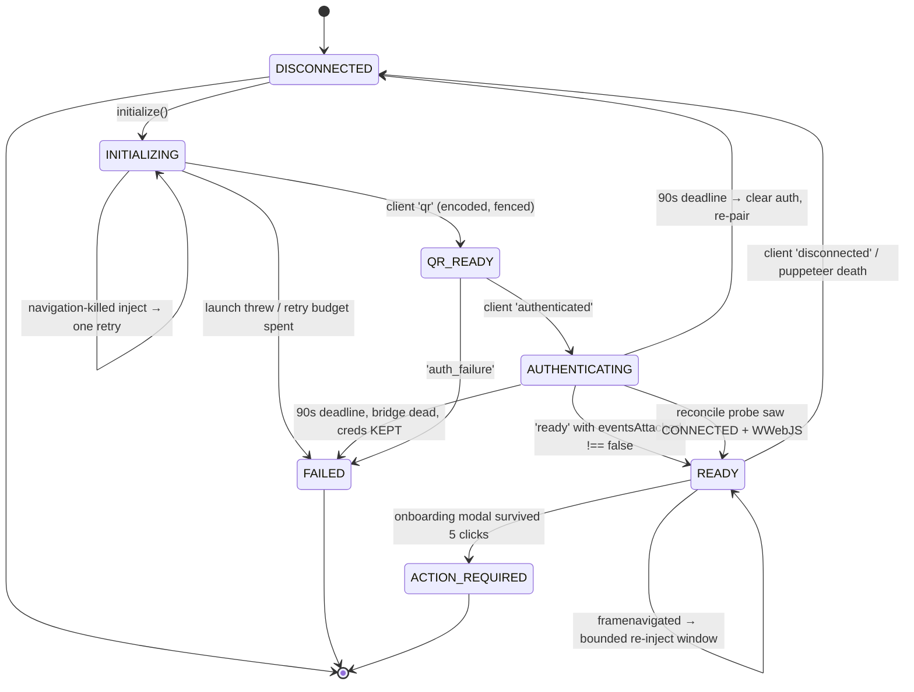
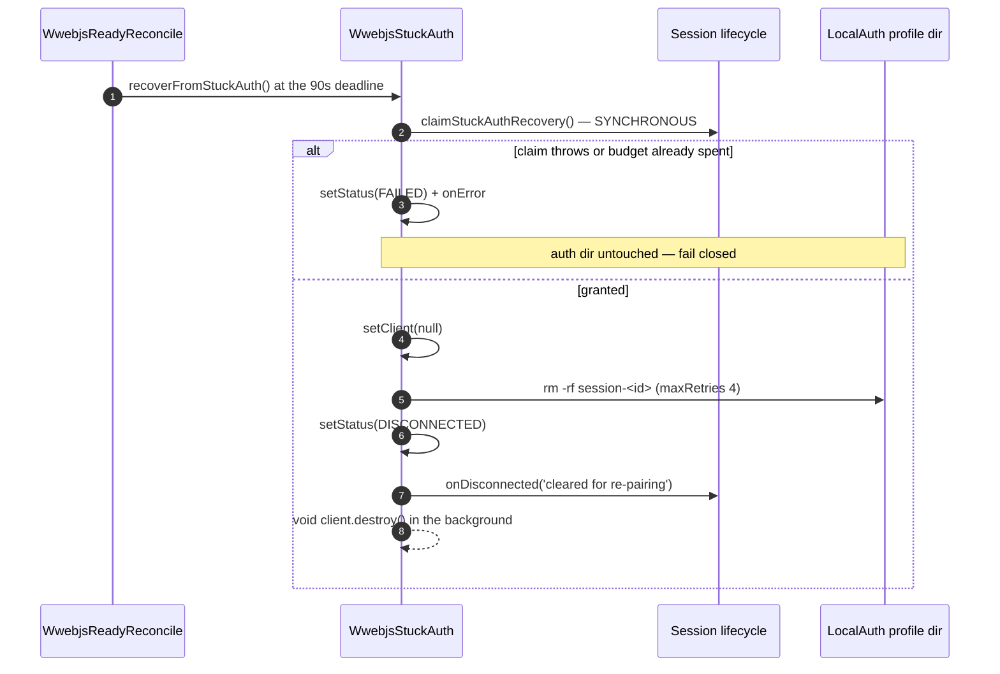
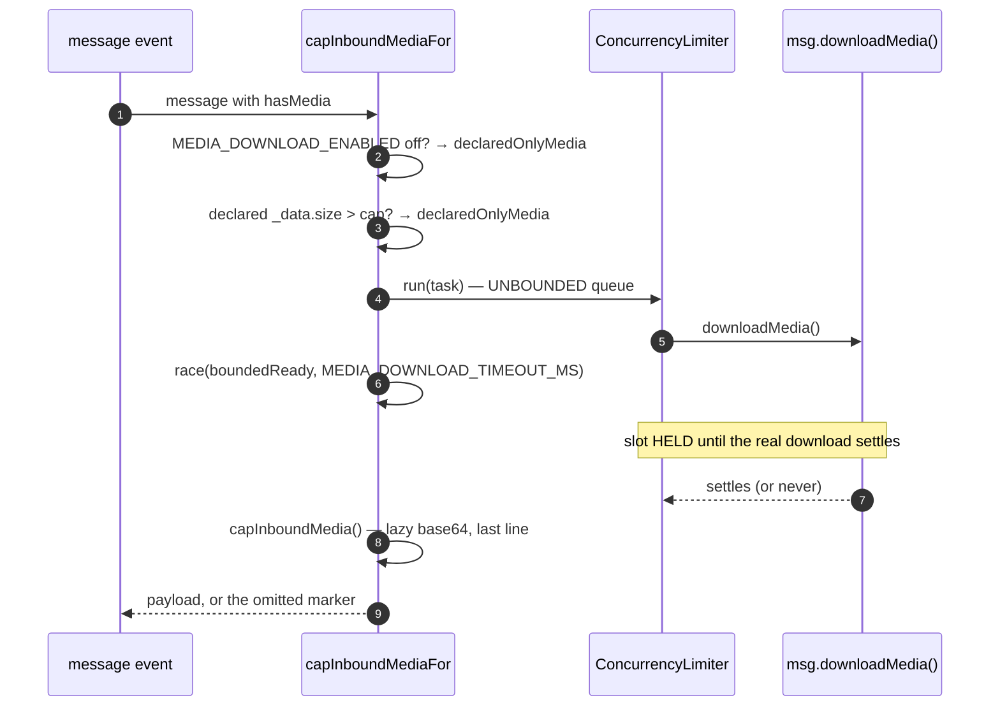

# The whatsapp-web.js Adapter

> **Source of truth:** `src/engine/adapters/whatsapp-web-js.adapter.ts`, `src/engine/adapters/wwebjs-lifecycle.ts`, `src/engine/adapters/wwebjs-reconcile.ts`, `src/engine/adapters/wwebjs-stuck-auth.ts`, `src/engine/adapters/wwebjs-onboarding.ts`, `src/engine/adapters/wwebjs-proxy.ts`, `src/engine/adapters/chromium-profile-hygiene.ts`
> **Band:** Engine layer · **Depends on:** 10-engine-abstraction.md, 11-engine-factory-registry.md, 12-engine-capability-matrix.md · **Jarcube class:** ENGINE-COUPLED

## Purpose

This adapter drives a real Chromium, logged into `web.whatsapp.com`, and reads WhatsApp's own
minified page bundle through Puppeteer `evaluate` calls. That is the whole source of its difficulty:
the thing it automates is a **web app that ships without warning**, and every OpenWA operation is one
`page.evaluate` away from a `TypeError` on a function WhatsApp renamed last Tuesday. A naive adapter
treats the library as an API and reports its failures verbatim; this one is built almost entirely out
of the machinery needed to tell four situations apart that all look identical from the outside — the
page is *dead*, the page is *reloading*, the page is *there but its Node bridge never attached*, and
the *stored credentials* are no longer usable.

The library itself makes that harder, not easier. whatsapp-web.js 1.34.7 never observes the Chromium
process or page it drives, so a crashed browser leaves a client reporting `READY` forever. It emits
`ready` from a page-side edge that a warm profile can miss entirely. It resolves `undefined` from
`sendMessage` for two opposite outcomes. And it re-injects after a navigation but registers that
handler only *after* the first inject succeeds, so a reload landing during startup is caught by
nothing upstream. Each of those has a named counterweight in this file set, and each counterweight is
bounded, because the failure mode of an unbounded grace is a session that reports `READY` and answers
409 forever.

Per-member availability is 12-engine-capability-matrix.md; the neutral contract every method here
implements is 10-engine-abstraction.md. This document is the adapter's own anatomy.

## File Inventory

Line counts are as measured at the commit in 00-INDEX.md and drift. Twenty-one files, ~6,050 lines,
excluding the two adapter specs (`whatsapp-web-js.adapter.spec.ts` alone is 7,522 lines) and the 15
focused behaviour specs that sit alongside them.

| Path | Lines | Role |
| --- | --- | --- |
| `src/engine/adapters/wwebjs-lifecycle.ts` | 989 | Connection lifecycle: launch, the navigation retry, client-event wiring, Puppeteer death detection, four flavours of teardown, the liveness probe |
| `src/engine/adapters/whatsapp-web-js.adapter.ts` | 974 | The `IWhatsAppEngine` face: 112 thin forwarders, the one host literal, inbound media capping, the two ready gates |
| `src/engine/adapters/wwebjs-messaging.ts` | 865 | Sends, the `@c.us` → `@lid` resolution cache, quotes, history, reactions, delete/edit/pin/vote |
| `src/engine/adapters/wwebjs-groups.ts` | 608 | 23 group members, per-participant result mapping, member-add-mode decoding |
| `src/engine/adapters/wwebjs-onboarding.ts` | 382 | The "What's new" modal watcher, its in-page probe, and the `ACTION_REQUIRED` fallback |
| `src/engine/adapters/wwebjs-chats.ts` | 295 | Chat list, archive/pin/mute/read/unread/delete/clear, own presence |
| `src/engine/adapters/wwebjs-channels.ts` | 254 | Channel/newsletter reads and writes, with the transport-death split |
| `src/engine/adapters/wwebjs-message-events.ts` | 224 | `message` / `message_create` / `message_ack` / revoke / reaction / edit → neutral events (15-engine-events.md) |
| `src/engine/adapters/wwebjs-status.ts` | 221 | Status posting and reading, and `toStatusResult`'s narrower absent-message case |
| `src/engine/adapters/wwebjs-reconcile.ts` | 199 | Post-authentication readiness reconciliation and the one-shot dead-bridge page reload |
| `src/engine/adapters/wwebjs-contacts.ts` | 168 | Contacts, number existence, avatars, block/unblock, addressbook writes |
| `src/engine/adapters/wwebjs-labels.ts` | 157 | Business label reads and chat assignment |
| `src/engine/adapters/wwebjs-group-events.ts` | 132 | `group_join` / `group_leave` / `group_update` / `group_membership_request` → neutral events |
| `src/engine/adapters/wwebjs-calls.ts` | 115 | The `call` event, the live-call cache, `rejectCall` |
| `src/engine/adapters/wwebjs-stuck-auth.ts` | 110 | Authenticated-but-never-ready recovery and the LocalAuth profile removal |
| `src/engine/adapters/chromium-profile-hygiene.ts` | 103 | Orphaned-Chromium sweep and stale `Singleton*` removal — the OS cleanup, not the protocol |
| `src/engine/adapters/wwebjs-profile.ts` | 94 | Own-account profile writes plus `createCallLink` |
| `src/engine/adapters/wwebjs-catalog.ts` | 46 | Five honest 501s — whatsapp-web.js has no catalog API at all |
| `src/engine/adapters/wwebjs-backport-check.ts` | 45 | Startup guard for the message-id backport (18-upstream-patching.md) |
| `src/engine/adapters/wwebjs-proxy.ts` | 42 | Proxy URL validation and the credential split Chromium requires |
| `src/engine/adapters/wwebjs-host.ts` | 27 | The shared host interface the domain delegates are allowed to see |

Shared with the Baileys adapter and documented separately: `src/engine/adapters/message-mapper.ts`,
`src/engine/adapters/vcard.ts`, `src/engine/adapters/inbound-media-cap.ts` (17-message-mapping.md) and
`src/engine/identity/wa-id.ts` (16-identity-and-lid.md).

## Data Model / Contract

### Construction config

`src/engine/adapters/whatsapp-web-js.adapter.ts:WhatsAppWebJsConfig`:

| Field | Type | Note |
| --- | --- | --- |
| `sessionId` | `string` | Session **name**. Keys the LocalAuth profile dir, the `--openwa-session=` marker arg, and the lid-mapping provenance |
| `sessionDataPath` | `string` | Parent of `session-<sessionId>` — the Chromium profile *and* the credential store, in one directory |
| `puppeteer.headless` | `boolean?` | Defaults true |
| `puppeteer.args` | `string[]?` | **Replaces** the default arg list rather than extending it |
| `puppeteer.executablePath` | `string?` | Absent means Puppeteer's bundled Chromium |
| `puppeteer.protocolTimeoutMs` | `number?` | Per-CDP-command budget. Range-checked at the sink |
| `proxy` | `{ url, type }?` | Per-session egress |
| `lidMappingStore` | `LidMappingStore?` | Threaded in so the send path can persist learned `phone → lid` pairs |

`protocolTimeoutMs` is validated **at the sink**, not only in the config layer, and the source says
why: a plugin config written through `PUT /api/plugins/whatsapp-web.js/config` is merged over the env
blob at every boot, so it can carry a value the config layer never saw. Both bounds are load-bearing
— `0` arms no timer at all (whatsapp-web.js's `CallbackRegistry` guards with `if (timeout)`), so a
wedged renderer holds the CDP command and the HTTP request behind it forever; above
`src/config/configuration.ts:MAX_TIMER_MS` Node's timer overflows and fires after 1 ms, so the browser
never launches. Out of range, the field is dropped and puppeteer-core's own 180 000 ms applies.

### The host pattern

Every domain delegate takes exactly one constructor argument: a host object. The adapter builds **one
object literal** of closures in its constructor and hands the same literal to all ten domain
delegates, so a delegate reaches lifecycle state only through the seams the interface names.

`src/engine/adapters/wwebjs-host.ts:WwebjsEngineHost`:

| Member | What it grants |
| --- | --- |
| `ensureReady()` | The two-part readiness gate (below) |
| `getClient()` | The live client, non-null by the caller's contract (call after `ensureReady`) |
| `logger` | The adapter's own logger instance, so spies keep observing it |
| `isPageTransportError(error)` | Classify a dead page/transport |
| `reportIfPageTransportError(error, context)` | Classify **and** report as a session death |
| `ensureNotChannelRecipient(chatId)` | The conditional 501 for media to a channel |
| `getNumberId(number)` | Recipient resolution, reached through the contacts delegate |
| `capInboundMediaFor(msg, maxBytesOverride?)` | The bounded media download |
| `config` | Read-only, for the send path's lid persistence |
| `getCallbacks()` | Read **per event** — `initialize()` installs the bag after the delegates exist |
| `getSelfWid()` | Own wid, or `undefined` while no client exists |

The lifecycle delegate gets a *different, wider* host
(`src/engine/adapters/wwebjs-lifecycle.ts:WwebjsLifecycleHost`) because it coordinates the four
sibling collaborators: `scheduleReadyReconcile` / `clearReadyReconcile`, `startOnboardingWatcher` /
`clearOnboardingWatcher`, `clearLiveCalls`, `clearLocalAuth`, `attachDomainEvents`, `emitState`. The
onboarding watcher, the reconciler, the stuck-auth handler and the call cache each get their own
narrow slice. Least privilege stays checkable: a delegate cannot grow a dependency the interface does
not declare.

Construction order is deliberate and stated: the four collaborators are built **before** the
lifecycle delegate, whose host closes over them — but every closure reads adapter state live, so no
closure carries an initialization requirement. The one exception is documented in the code itself:
`this.host` is built in the constructor body, not as a field initializer, because `config` is a
parameter property and field initializers run before it is assigned.

### State aliasing

Connection state lives on `src/engine/adapters/wwebjs-lifecycle.ts:WwebjsLifecycle` — `client`,
`status`, `qrCode`, `tearingDown`, `logoutInitiated`, `disconnectReported`. The adapter exposes
private getter/setter pairs that alias those fields **by reference**, and the reason is honest: an
unmodified spec pokes `adapter.client` / `adapter.status` / `adapter.liveCalls` through a cast, and the
aliases keep that working byte-identically after the extraction. The same pattern covers
`liveCalls`, owned by `src/engine/adapters/wwebjs-calls.ts:WwebjsCalls`.

## Decomposition by domain

Two boundaries in that graph are decisions rather than convenience.

**Connection-state events stay in the lifecycle; domain events do not.** `qr`, `authenticated`,
`ready`, `disconnected` and `auth_failure` drive latches that nothing else may touch, so they are
wired inside `src/engine/adapters/wwebjs-lifecycle.ts:setupEventHandlers`. Everything that is pure
payload mapping — messages, groups, calls — goes through the single
`src/engine/adapters/whatsapp-web-js.adapter.ts:attachDomainEvents` seam.

**Three refusals are declared inline on the adapter, not in a delegate**, and the code says exactly
why: the parity gate reads method bodies off the prototype, so a throw hidden behind a delegate call
is invisible to it and the `not-available` matrix row would go unverified. `upsertLabel`,
`deleteLabel` and `subscribeToPresence` therefore throw `EngineNotSupportedError` in the adapter body.
The delegate-throw registry in `src/engine/engine-parity.spec.ts` is what lets every *other* refusal
live in a `wwebjs-*` module — see 12-engine-capability-matrix.md.

## Chromium and Puppeteer lifecycle

An adapter instance is **single-use**. `tearingDown` and `disconnectReported` latch and are never
reset; a reconnect builds a fresh adapter (20-session-lifecycle.md). That single fact is what makes
`claimStuckAuthRecovery` a session-owned callback rather than an instance boolean — see below.

### The launch sequence

`src/engine/adapters/wwebjs-lifecycle.ts:initialize` does the work in a fixed order, and every step
has a reason to be where it is:

1. **Backport check.** `src/engine/adapters/wwebjs-backport-check.ts:isBackportMissing` reads the
   installed `whatsapp-web.js` `Message.js` for `_normalizeId(` or `.$1` — the patcher's own
   stand-down predicate, so the two can never disagree about what "patched" means — and logs
   `BACKPORT_MISSING_MESSAGE` when absent. Any uncertainty (package unresolvable, sources pruned)
   reads as **not missing**: an install that cannot be inspected is not evidence of a broken one.
2. **Puppeteer args.** Either the caller's list verbatim, or the seven-flag default
   (`--no-sandbox`, `--disable-setuid-sandbox`, `--disable-dev-shm-usage`,
   `--disable-accelerated-2d-canvas`, `--no-first-run`, `--no-zygote`, `--disable-gpu`).
3. **Proxy wiring** (below).
4. **The marker arg.** `--openwa-session=<sessionId>` is appended unconditionally. Chromium ignores
   unknown flags; this exists purely as a `ps` label for the orphan sweep.
5. **Version pin.** `src/engine/wa-web-version.ts:resolveWebVersionPin` — auto-resolved by default,
   `WWEBJS_WEB_VERSION=off` to leave the first-party build. The mechanics and the trust warning are
   11-engine-factory-registry.md; 18-upstream-patching.md covers why pinning exists at all.
6. **Auth timeout.** `src/engine/engine-init-timeout.ts:resolveAuthTimeoutMs`, opt-in; unset keeps
   whatsapp-web.js's 30 000 ms.
7. **One or two attempts** at `src/engine/adapters/wwebjs-lifecycle.ts:runInitAttempt`.

`runInitAttempt` is the full sequence — `new Client(...)`, `setupEventHandlers()`, the two hygiene
sweeps, `client.initialize()`, then the Puppeteer death listeners — and it is extracted precisely so
the retry repeats *all* of it. The source names both halves of the reason: a second attempt without
`setupEventHandlers()` would have no `qr`/`authenticated`/`ready` handlers at all, and one without the
pre-launch sweeps would trip over attempt 1's stale `Singleton` files.

Three Puppeteer signal options are set to `false` (`handleSIGINT`, `handleSIGTERM`, `handleSIGHUP`).
Left at their defaults, Puppeteer handles SIGINT with a synchronous `process.exit(130)`, skipping the
graceful drain entirely, and kills Chromium at SIGTERM time, defeating the drain window. OpenWA owns
signal handling in `src/main.ts` (04-bootstrap-and-lifecycle.md). Puppeteer's unconditional `exit`
hook still SIGKILLs the browser when the process really exits, so nothing is orphaned by a clean
shutdown — which is exactly why the orphan sweep only ever finds victims of a *hard* kill.

### The navigation-killed retry

A WhatsApp Web reload landing mid-`inject()` rejects `initialize()`, and nothing upstream retries:
whatsapp-web.js registers its own re-inject handler **only after** the first inject succeeds. The
`onError` channel is terminal end to end, so without a retry the session simply dies at startup.

`src/engine/adapters/wwebjs-lifecycle.ts:isNavigationShapedInitRejection` decides whether one more
try is worth it. It matches two shapes — "execution context was destroyed" and "window.require is not
a function" (an evaluate landing on a document whose WA bundle has not booted). It is deliberately
**separate** from `src/engine/adapters/wwebjs-lifecycle.ts:isExecutionContextDestroyedError`, the
stale-profile advisory classifier, because that advisory names a remedy (delete the profile) that is
wrong for the `window.require` shape.

Two guards bound the retry:

- `src/engine/adapters/wwebjs-lifecycle.ts:INIT_RETRY_MIN_REMAINING_MS` (20 s) against
  `src/engine/engine-init-timeout.ts:resolveEngineInitTimeoutMs`. A retry the outer race SIGKILLs
  mid-launch would surface as a bare 504 with no reason, which is worse than today's terminal shape.
- `src/engine/adapters/wwebjs-lifecycle.ts:resetForInitRetry` must confirm attempt 1's browser is
  actually gone. It is deliberately **not** `beginClientTeardown()`: that would latch `tearingDown`
  (making the adapter single-use) and write `DISCONNECTED`, whose `disconnectReported` latch would
  permanently drop the retry's own `qr` and `authenticated` events. It clears the reconcile timer,
  calls `removeAllListeners()` on the failed client (neither `authenticated` nor `ready` carries a
  source-client identity fence), and races a **direct** `destroy()` against a 5 s bound.

The return value of `resetForInitRetry` distinguishes two outcomes that matter: a **fast** rejection
means the browser was already gone, so relaunching is safe; a **timeout** means a live, wedged
Chromium still holds the profile, and the retry is abandoned rather than launching a second Chromium
into the same LocalAuth profile — corrupting the only credential copy would force an irreversible
re-pair, and the marker-based orphan sweep is explicitly best-effort, so it cannot be trusted as the
escalation for a *live* browser.

### Death detection

whatsapp-web.js 1.34.7 never listens to its own Puppeteer handles, so a dead Chromium is invisible to
it. `src/engine/adapters/wwebjs-lifecycle.ts:attachPuppeteerLifecycleListeners` attaches four
listeners through a loose cast (the typings do not declare `pupBrowser` / `pupPage`):

| Handle | Event | Meaning |
| --- | --- | --- |
| `pupBrowser` | `disconnected` | Browser process closed or crashed |
| `pupPage` | `error` | Renderer crash ("Aw Snap") |
| `pupPage` | `close` | Tab closed |
| `pupPage` | `framenavigated` | **Not death** — the page is healing |

The first three route through `src/engine/adapters/wwebjs-lifecycle.ts:handlePuppeteerDeath`, which
takes the same path as the library's own `disconnected` event and ignores calls during teardown or
once the status is already `DISCONNECTED`/`FAILED` — a real crash usually fires page `error` and
browser `disconnected` together, so first signal wins.

There is a second, much earlier death signal:
`src/engine/adapters/wwebjs-lifecycle.ts:reportIfPageTransportError`. A wedged page can fire no
events while still reporting `CONNECTED` (whatsapp-web.js #5728), so the watchdog takes minutes to
notice, whereas an *operation* failing with a dead-transport signature is immediate.
`PAGE_TRANSPORT_ERROR_PATTERN` matches protocol error / target closed / detached frame / session
closed / connection closed. `PROTOCOL_TIMEOUT_PATTERN` excludes the one shape that is *not* death —
a per-command CDP budget expiring means the renderer is slow, not gone — and it matches the full
Puppeteer phrase rather than a bare "timed out", because a broad exclusion would also swallow a
genuine death whose message happens to mention a timeout. Detection is side-channel only: the error
still propagates to the caller unchanged.

### The navigation re-inject window

This is the adapter's most carefully bounded piece of state, and it exists because one event —
WhatsApp Web's ~5-minute first reload on a fresh pairing, a service-worker update — makes three
different observers lie at once. During the reload `window.WWebJS` is gone, so every delegate
`evaluate` dies as a raw `TypeError` 500 under a status that still says `READY` (and five raw send
failures latch the send breaker for its 15-minute cooldown), while `getState()` *rejects*, so the
liveness probe reads a healing page as dead.

Two timestamps, never timers — several suites pin exact Jest timer counts, and a timer would also
outlive the single-use adapter:

| Bound | Value | Why |
| --- | --- | --- |
| `src/engine/adapters/wwebjs-lifecycle.ts:NAVIGATION_REINJECT_GRACE_MS` | 60 s | Floor: the pre-boot phase alone takes tens of seconds on a slow host, and upstream's re-inject then polls up to 30 s for `window.WWebJS`. Ceiling: one watchdog interval, so a page that navigates and then wedges loses at most one probe to the grace |
| `src/engine/adapters/wwebjs-lifecycle.ts:NAVIGATION_EPISODE_CAP_MS` | 3 × grace | A page stuck in a navigation **loop** re-stamps the rolling grace faster than it expires, which would suppress the watchdog forever and leave a zombie session `READY` that only ever answers 409 |

`src/engine/adapters/wwebjs-lifecycle.ts:isInNavigationReinjectWindow` requires **both** bounds, and
the source is explicit that this window is consulted only *after* the `READY`-status gates: a teardown
or a LOGOUT drops the status first, and the grace must never outrank that. The window closes on the
library's re-emitted `ready` (the only completion edge it offers — cleared *before* the guards in the
`ready` handler, since `markReadyFromClientInfo` early-returns while already `READY`), on an observed
`CONNECTED` from the probe, and on teardown.

The `framenavigated` stamp itself refuses three shapes: a non-main frame, a URL containing
`post_logout=1`, and a client whose undeclared `lastLoggedOut` runtime field is set. In all three the
credential teardown driven by `disconnected('LOGOUT')` must win. The log line carries
`graced: <boolean>` so it never claims a grace the episode cap has already expired.

### Profile hygiene

`src/engine/adapters/chromium-profile-hygiene.ts` is explicitly *not about WhatsApp*, and its
docblock says so: it cleans up after the operating system and the container, changes when Docker or
Puppeteer changes, and therefore lives outside the adapter that implements the protocol. Both
functions are best-effort by contract — debug-level logs, never throw, so a hostile `ps` or an
unreadable profile dir can never block a start.

`src/engine/adapters/chromium-profile-hygiene.ts:killOrphanedChromiumProcesses` runs `ps -eo
pid=,args=` with no shell (the args array is handed to `ps` verbatim, so nothing is injectable) and
`maxBuffer` raised to 8 MiB because full command lines on a busy host exceed the 1 MiB default. Three
filters make it safe:

- **Token-exact marker match.** A plain substring test would let restarting session `sales` SIGKILL
  the *live* browser of sibling `sales2` — their markers share a prefix.
- **Never this process.**
- **Must look like a browser** (`/chrome|chromium|headless/i`), so a `grep --openwa-session=…`
  probing the process table is not killed.

`ESRCH` is swallowed silently: the process exited between the `ps` and the kill.

`src/engine/adapters/chromium-profile-hygiene.ts:removeStaleSingletonFiles` removes
`SingletonLock` / `SingletonSocket` / `SingletonCookie` from the profile dir. Both sweeps run
**after** any orphan is killed and **before** this attempt's browser exists, so neither can pull files
out from under a running Chromium. On the retry path the sweep is also the escalation for attempt 1's
browser, when the bounded destroy did not finish it.

## The page-injection model

Nothing above the engine layer knows a browser exists. Inside the adapter there are four distinct
ways the page is reached, and mixing them up is how a subtle bug gets written.

| Mechanism | Where | Constraint |
| --- | --- | --- |
| Library model methods (`Chat.archive()`, `GroupChat.setSubject()`) | Most delegates | The library's own injected helpers; return shapes are documented in `src/engine/types/whatsapp-web-js.types.ts` |
| A patched page helper (`matched`, `eventsAttached`) | Groups, lifecycle, reconcile | Present only on a patched tree. Absence is `undefined` and means "unpatched", never "false" |
| A raw `pupPage.evaluate` with a stringified function | Onboarding, reconcile | The function is serialised into the browser, so it **may not close over anything** |
| Raw `_data` reads | Messaging, message mapper | Fields the public wrapper does not expose (`notifyName`, `size`, `isVideoCall`, `callDuration`) |

The third row carries a real constraint that shapes the onboarding code:
`src/engine/adapters/wwebjs-onboarding.ts:probeOnboardingModal` and
`src/engine/adapters/wwebjs-onboarding.ts:collectDialogDiagnostics` are exported free functions with
every constant inlined in the body, because `page.evaluate` stringifies them. Being plain functions is
also what makes the DOM matching unit-testable directly, rather than only through a mocked `evaluate`
that proves nothing about the matching.

The second row is a convention worth naming, because both patch-dependent markers follow it: a
`false` value is a real signal, and `undefined` means the tree is unpatched and the legacy behaviour
applies. `src/engine/adapters/wwebjs-lifecycle.ts` reads `eventsAttached === false` explicitly rather
than testing falsiness, for exactly that reason.

Two id-reading rules run through every page interaction, both consequences of WhatsApp Web 2.3000.x
renaming `id._serialized` to the minifier-mangled `id.$1`:

- Read through `src/engine/types/whatsapp-web-js.types.ts:readWid`, or read `$1` explicitly as a
  fallback. `src/engine/adapters/whatsapp-web-js.adapter.ts:capInboundMediaFor` does the latter and
  says why: this is the diagnostic path for the same build whose rename makes downloads fail, so its
  warnings must carry a real id.
- **Never** `String()` the object branch. That manufactures the literal id `"undefined"` — an id that
  looks real and addresses nothing.

## Readiness: three mechanisms, one status

`READY` is written by three different paths, and each exists because the one before it can miss.

**1. The library's `ready` event.** Guarded, because whatsapp-web.js can emit `ready` *before* its
message listeners attach: its post-auth callback runs once per `hasSynced` trigger, and any run that
finds `window.WWebJS` already defined skips the attach and bare-emits `ready` — including while the
first run's attach is still in flight (observed live). Promoting on that emit binds `READY` to a
session whose inbound bridge may never come up. The patched `eventsAttached` flag distinguishes the
cases.

**2. `src/engine/adapters/wwebjs-reconcile.ts:WwebjsReadyReconcile`.** Armed by `authenticated`,
disarmed by any exit. A 2 s self-rescheduling tick, at most one probe in flight, with the deadline
checked at the **top** of every tick rather than after the probe — a wedged page can make `getState()`
never resolve, which is the very condition this exists for, and checking after the probe would let it
defeat the 90 s ceiling.

`src/engine/adapters/wwebjs-reconcile.ts:isClientRuntimeReady` requires four things: `getState() ===
CONNECTED`, a readable `info.wid.user`, `eventsAttached !== false`, and an in-page
`typeof window.WWebJS !== 'undefined'`.

**3. `src/engine/adapters/wwebjs-reconcile.ts:maybeReloadDeadBridge`.** One-shot. A `CONNECTED` page
whose bridge never attached gets its page reloaded, because whatsapp-web.js re-runs injection on every
`framenavigated` and a fresh page walks the whole pipeline again — the cheapest full reinjection that
keeps the saved session intact.

The grace before that reload is the subtle part.
`src/engine/adapters/wwebjs-reconcile.ts:READY_RECONCILE_BRIDGE_RELOAD_GRACE_MS` is 45 s, and the
comment argues both bounds: whatsapp-web.js clears `eventsAttached` in its constructor and sets it
only once `attachEventListeners()` resolves, and in between it evaluates LoadUtils, polls up to 30 s
for `window.WWebJS`, then builds ClientInfo and InterfaceController. So a `false` flag is the
**normal** reading for most of a minute on a loaded host, and reloading on it aborts a healthy attach
— the page navigates out from under the in-flight `inject()`, which then dies before re-exposing the
bridge and cannot be retried. It must exceed upstream's own 30 s poll and stay well under the 90 s
deadline. The source explicitly warns against "harmonizing" it with
`NAVIGATION_REINJECT_GRACE_MS`, which happens to be a different 45–60 s figure bounded by something
else entirely.

### The deadline fork

At `src/engine/adapters/wwebjs-reconcile.ts:READY_RECONCILE_TIMEOUT_MS` (90 s) the reconciler chooses
between two very different diagnoses, and the split is what stops it from destroying recoverable
credentials:

| Observation | Verdict | Credentials |
| --- | --- | --- |
| Last probe saw `CONNECTED` **and** `eventsAttached === false` | Bridge dead → `FAILED` + `onError` | **Kept.** The link and the credentials are fine; only this browser instance is broken. Restart the session |
| Anything else | Stuck after the QR scan → `recoverFromStuckAuth()` | Cleared |

Wiping the only copy of the credentials for a `CONNECTED` session would trade a restart-fixable fault
for a forced re-pair. That asymmetry is the whole reason `lastProbeStateConnected` is tracked.

## Stuck-auth recovery

`src/engine/adapters/wwebjs-stuck-auth.ts:recoverFromStuckAuth` clears the LocalAuth profile and
disconnects, so the session lifecycle re-pairs with a fresh QR instead of hanging at
`authenticating` forever.

Four decisions in that sequence are load-bearing.

**The budget is session-owned and claimed synchronously.** An automatic reconnect builds a *fresh*
adapter, so an instance-local budget would reset every generation and wipe the auth directory forever.
`claimStuckAuthRecovery` is the session's one-shot claim, and the adapter does not await it — the race
between the stuck-auth deadline and a concurrent start or reconnect resolves inside one event-loop
turn. When the callback is absent (standalone or test use) the adapter falls back to its own
instance-local `recoveryAttempted` boolean.

**It fails closed.** A callback that throws is treated exactly like a spent budget: `FAILED` +
`onError`, with the auth dir untouched. A wedged claim path can never wipe the only copy of the
credentials.

**Clearing comes first, teardown second.** The client is nulled and the profile removed *before* the
wedged Chromium is destroyed, and the destroy is fire-and-forget — a hung `destroy()` must not block
or skip the recovery.

**`maxRetries: 4` on the `fs.rm`.** `src/engine/adapters/wwebjs-stuck-auth.ts:clearLocalAuth` mirrors
LocalAuth's own default because on a WhatsApp-initiated unlink the library never closes the browser,
so Chromium is still rotating IndexedDB files while this walks the tree, and a bare `rm` reports
`ENOTEMPTY`. Node's default is **0** retries, which is why the failure surfaced here and never on the
library's removal of the same directory.

The success path logs a warning, not an info line, and the reason is worth copying: this is the only
copy of the session's WhatsApp credentials, removal is not recoverable, and without an explicit log
the sole trace is a session that silently stops reconnecting — indistinguishable from a WhatsApp-side
logout or an untouched profile.

### Credential teardown, and why LOGOUT is special

`disconnected('LOGOUT')` means whatsapp-web.js is *about to* delete the profile. The only site that
emits that reason is its `framenavigated` listener, which emits and **then** awaits
`authStrategy.logout()` → `LocalAuth.logout()` → `fs.rm(userDataDir)`, with the browser still open.
That `rm` happens whatever the listener does, so it must be surfaced to the lifecycle **above** the
duplicate-event latch — otherwise a `stop()`/`destroy()` that latched first hides an in-flight `rm`,
the session-name fence sees nothing pending, and a later `start()` under the same name can have its
freshly written profile deleted by it.

Because the library's own `rm` cannot be given a handle, the adapter registers an **idempotent
stand-in**: `clearLocalAuth()` with `force: true` races it safely and gives the lifecycle something to
await. Two guards keep it to one registration: `logoutInitiated` (this adapter's own `logout()`
already registered the wider `client.logout()` promise, which covers the same `rm` and settles no
earlier) and `credentialTeardownStarted` (upstream's listener resets its `lastLoggedOut` flag only
after three awaits and never checks for the main frame, so one unlink can raise the event more than
once). Sitting above the duplicate latch is what makes the second guard reachable.
21-session-fences-and-races.md covers the consuming fence.

## The onboarding modal

A freshly linked account is shown a "What's new on WhatsApp Web" modal with a Continue button. Left
unacknowledged, WhatsApp **unlinks the companion device ~5 minutes later**, surfacing as
`disconnected: LOGOUT`. whatsapp-web.js exposes no API for this (upstream #3550 open), so
`src/engine/adapters/wwebjs-onboarding.ts:WwebjsOnboardingWatcher` reaches the page directly.

| Constant | Value | Rationale |
| --- | --- | --- |
| Probe interval | 5 s | |
| Lifetime cap | 5 min | The modal is one-shot per account, so the loop self-terminates rather than polling forever |
| Probe timeout | 5 s | |
| `src/engine/adapters/wwebjs-onboarding.ts:ONBOARDING_MODAL_MAX_DISMISS_CLICKS` | 5 | Five, not three: a multi-step flow is clicked through one screen per tick, and three screens inside one run must not read as stuck. Five failed clicks still trips in ~25 s, far inside the unlink deadline |

The loop is a self-rescheduling `setTimeout` that schedules the **next** tick up front, so a hung
`page.evaluate` cannot stall it, and it is `unref`'d. `startOnboardingWatcher` is idempotent because
the `ready` event and the reconcile path share one funnel.

### Why the button, never the heading

`probeOnboardingModal` treats a **visible control whose exact label is the confirm label** as the
presence signal, and its docblock spells out the trap: `textContent` on a `div` concatenates every
descendant, so a chat-list row previewing the words "what's new" — an ordinary English message —
satisfies a heading-only test. Treating that as a stuck modal would take a perfectly healthy session
out of `READY` and block every send. The heading regex is then checked on an ancestor **within 8
levels**, bounded for the same reason: matching against `<body>` would just be the loose text test
again. The regex matches both apostrophes (`what[’']?s new`) because WhatsApp Web renders the
typographic U+2019 and older builds an ASCII quote — matching only ASCII means never recognising the
real modal.

Localisation is handled without carrying WhatsApp's translation table.
`src/engine/adapters/wwebjs-onboarding.ts:resolveOnboardingContinueLabels` reads
`WWEBJS_ONBOARDING_CONTINUE_LABELS` **per probe, not cached**, so an operator can correct a running
deployment through the infra config without a restart. Supplying labels *drops the heading requirement
for those labels only*, and the source defends that as a deliberate, operator-opted-in loosening: the
English heading regex would reject a localised modal anyway, so requiring both would make the setting
inert. The default `Continue` keeps the heading requirement, so the out-of-the-box false-positive
surface is unchanged.

### Diagnostics, and the one status transition

When the probe finds nothing to click, a second evaluate runs
`src/engine/adapters/wwebjs-onboarding.ts:collectDialogDiagnostics` and reports which dialogs *are* on
screen, so a modal whose title or language the detector does not recognise appears in the logs instead
of failing silently until the companion is unlinked. It is observational only, scoped to
`[role="dialog"]` / `[aria-modal="true"]` containers (a chat-list row is not a dialog, so ordinary
conversation content never enters the report), bounded (3 dialogs, 5 buttons each, truncated strings),
and every captured string is stripped of control characters — page-controlled text going straight into
a log line could otherwise forge extra log entries. Signatures are deduplicated in a `Set`, so the
warning fires once per *distinct* unrecognised dialog rather than once per 5 s tick.

The dispatch is `result.dismissed === false`, not falsiness: a probe that clicked needs no
diagnostics, and an absent or garbled result says the page is in no state to answer a second evaluate.

`src/engine/adapters/wwebjs-onboarding.ts:reportActionRequired` is the only path to
`ACTION_REQUIRED`, and it is guarded twice. A teardown or failure that latched first keeps its status
and the callback stays silent — but the reason is still logged at debug, or this path would be
indistinguishable from "no modal". And a **rejected** evaluate never moves the session: a page that
navigated, closed, or timed out says nothing about the modal, and a status change there would take a
healthy session out of `READY`, blocking every send for a reason the operator cannot act on. A page
that is genuinely gone surfaces through the Puppeteer death listeners instead.

## Proxy wiring

Chromium's proxy support forces a split that has nothing to do with WhatsApp, and
`src/engine/adapters/wwebjs-proxy.ts` isolates it.

`src/engine/adapters/wwebjs-proxy.ts:isSupportedProxyUrl` accepts `http:`, `https:`, `socks4:`,
`socks5:` and nothing else — defence in depth for a stored proxy that bypassed DTO validation (loaded
from the DB on restart). The host is deliberately **not** SSRF-blocked: a per-session proxy is
operator-chosen egress, and a loopback proxy sidecar is a legitimate setup.

`src/engine/adapters/wwebjs-proxy.ts:buildProxyLaunchConfig` returns
`src/engine/adapters/wwebjs-proxy.ts:ProxyLaunchConfig`:

| Field | Consumer |
| --- | --- |
| `serverArg` | `--proxy-server=<scheme>//<host>` — **credential-less**, because Chromium ignores credentials embedded in this flag |
| `proxyAuthentication` | whatsapp-web.js's own option → `page.authenticate`, the only way Chromium authenticates a proxy. HTTP/HTTPS only |
| `socksAuthUnsupported` | Chromium cannot authenticate a SOCKS proxy **at all** |

The third field exists so the caller can *warn* rather than fail with an opaque navigation timeout.
An invalid URL is ignored with a warning and the launch proceeds direct — a stored proxy value must
not be able to break the Chromium launch or smuggle a non-proxy scheme. Contrast the Baileys side,
where `src/engine/adapters/baileys-lifecycle.ts:createProxyAgent` **throws** on an unsupported scheme,
failing the session closed; that adapter has a Node-layer agent and no CDP auth timing to work around
(14-adapter-baileys.md).

## Send-path identity resolution

WhatsApp has migrated some contacts to privacy-id addressing, for which `sendMessage` throws
`No LID for user` on the phone WID but accepts the `@lid` that `getNumberId` returns.
`src/engine/adapters/wwebjs-messaging.ts:resolveSendId` handles that, and its caching policy is
asymmetric on purpose:

- Groups, channels and already-`@lid` targets return unchanged.
- Any **server-confirmed** resolution is cached — a distinct `@lid`, *or* a confirmed non-migrated
  `@c.us`. `getNumberId` is a rate-limited existence probe, so re-probing per message is the cost
  being avoided.
- A `null` or thrown lookup is **not** cached, so an unregistered or transiently flaky contact keeps
  being retried.
- Any resolution failure falls back to the original id, so a send is never blocked on it.
- A learned `phone → lid` pair is written through to the shared mapping table, fire-and-forget
  (16-identity-and-lid.md). The map itself is unbounded, and the code names the condition under which
  that would need an LRU: a session addressing a truly unbounded set of fresh numbers.

`src/engine/adapters/wwebjs-messaging.ts:sendResolved` wraps every send with one stale-id retry, and
its error mapping is the interesting part. Four remaps turn page-side bare `Error`s into typed HTTP
answers:

| Detector | Becomes | Why |
| --- | --- | --- |
| `reportIfPageTransportError` | (side channel) | The page is gone; the error still propagates |
| `src/engine/adapters/wwebjs-messaging.ts:isQuoteUnresolvedError` | `MessageNotFoundError` → 404 | Checked **before** the LID branch: re-resolving the recipient would not make the quoted message appear |
| `src/engine/adapters/wwebjs-messaging.ts:isNoLidForUserError`, re-resolution gave the same id | `RecipientUnreachableError` → 400 | The recipient is unreachable rather than stale; the bare error would be an opaque 500 |
| `isNoLidForUserError`, fresh id differs | one retry | Logged as possibly duplicating: wwjs can throw *after* the message is on the wire |

Both remaps also cover the retry attempt, because without that the identical failure would be a 404
on the first attempt and a 500 on the second. The quote remap matters for a second reason the source
names: `countsTowardSendBreaker` classifies anything that is not an `HttpException` as an
account-standing failure, so a caller retrying a stale quoted id would trip the send breaker on a
fault that is purely their own (30-message-send-pipeline.md).

`src/engine/adapters/wwebjs-messaging.ts:quoteOptions` opts **out** of the library's
`ignoreQuoteErrors`, which defaults to true. Left alone, an unresolvable quoted id sends the message
anyway, unquoted, and reports success — a caller who asked for a reply and got a loose message has no
signal that anything went wrong. One narrower drop is *not* covered and is documented as upstream
behaviour that cannot be switched off from here: a message that resolves but whose `canReplyMsg` is
false sends unquoted.

`src/engine/adapters/wwebjs-messaging.ts:toMessageResult` refuses to guess. `client.sendMessage()` can
resolve `undefined` for two opposite outcomes — the chat could not be resolved so nothing was sent, or
the message went out and only its id could not be read back — and nothing available can tell them
apart. An absent message is therefore reported as a **failed** send: a false negative is visible and
retryable, while claiming delivery for a message that never left is not recoverable. A present
`Message` is different, because wwjs only builds one from a real message model, so its presence proves
the send happened and an unreadable id carries the empty sentinel that is persisted as NULL rather
than a fabricated id a later ack could mis-match.

## Inbound media

`src/engine/adapters/whatsapp-web-js.adapter.ts:capInboundMediaFor` is the most intricate function in
the adapter, and every layer answers a bound the layer above cannot provide.

**The queue is unbounded, and that is a fix rather than an oversight.** A cap equal to the active
slots made admission a constant `active + queued` whatever the batch size, so a burst lost the media
of everything past the eighth. The same defect was repaired on the Baileys side.

**The slot is held until the *real* download settles, not until the timeout race resolves.**
`msg.downloadMedia()` cannot be aborted, so freeing the slot when the wall clock fires would admit a
fresh download while the abandoned one is still materialising in heap — letting in-flight downloads
exceed `INBOUND_MEDIA_CONCURRENCY`. The caller still unblocks on the race and emits the message
without media.

**The caller's own wait is bounded too**, and the comment explains why that is not redundant: the wait
spans the queue as well as the download, and both are unbounded — the queue by design, and the wait
for a slot because a slot is held until its download really settles, which a hung page never does. The
inner race only starts once the message is admitted, so it cannot cover the waiting. Without the outer
bound, a burst behind stuck slots parks forever and those messages are never emitted **at all** —
strictly worse than the media loss the unbounded queue set out to fix.

A page-side throw takes the same `null` sentinel as a timeout, because it is the same "no usable
media" outcome; without that it would arrive as a rejection, get adopted by the race, and rethrow past
the only exit that builds the marker — leaving every call site to emit with no `media` field at all.
The `slotHeld` rejection handler is documented as defensive-only and deliberately kept: nothing is
expected there, but an unhandled rejection from a fire-and-forget promise is not an acceptable way to
find that out.

`src/engine/adapters/wwebjs-messaging.ts:declaredOnlyMedia` builds the marker from the sender-declared
`_data`, keeping the `media` field present with `omitted: true` and `sizeBytes` set — the contract that
lets a consumer tell "no media" from "media we chose not to carry". The caps themselves live in
`src/engine/adapters/inbound-media-cap.ts` (17-message-mapping.md, 34-media-pipeline.md).

## The two ready gates

`src/engine/adapters/whatsapp-web-js.adapter.ts:ensureReady` is called by every delegate method and
answers two different 409s:

1. Status is not `READY`, or there is no client → a plain `EngineNotReadyError`.
2. `isInNavigationReinjectWindow()` → the same **retryable** 409 with the reload named, so an operator
   can tell this state from a plain disconnect. Without it, every delegate `evaluate` in that window
   would die as a raw `TypeError` 500 and five raw send failures would latch the send breaker for its
   15-minute cooldown.

`src/engine/adapters/whatsapp-web-js.adapter.ts:ensureNotChannelRecipient` is the conditional 501:
whatsapp-web.js crashes building a channel media message because WhatsApp Web removed
`Msg.avParams`. Text to a channel still works. Failing fast with
`src/common/errors/channel-media-not-supported.error.ts` beats surfacing the raw `TypeError` as a 500
— and because the method is otherwise supported, this must not flip a capability-matrix cell
(12-engine-capability-matrix.md).

Most delegates add a third layer: a local `withPage(context, op)` (in
`src/engine/adapters/wwebjs-channels.ts`, `src/engine/adapters/wwebjs-profile.ts`) or an inline
equivalent, which converts a dead-transport error into `src/common/errors/engine-transport.error.ts`
(503) plus an early death signal, and lets everything else propagate unchanged. The distinctions are
finer than they look: `src/engine/adapters/wwebjs-contacts.ts` separates "contact absent" (a page-side
`TypeError` on null from `WWebJS.getContact`, which reads `contact.isBusiness` off `Contact.find` with
no try/catch → 404) from "page dead" (503), and `src/engine/adapters/wwebjs-labels.ts` separates
"label absent" (a page-side dereference of a label that is not there — including every id on a
personal account, whose label collection is empty → 404) from the same 503.

## Call Chain

- `src/engine/engine.factory.ts:EngineFactory` → `new WhatsAppWebJsAdapter(config)`
  (11-engine-factory-registry.md).
- `src/modules/session/session-engine-lifecycle.service.ts` → `initialize(callbacks)` under an outer
  deadline; the only caller that supplies callbacks (20-session-lifecycle.md).
- `src/engine/adapters/whatsapp-web-js.adapter.ts:WhatsAppWebJsAdapter` → `this.lifecycle.initialize()`
  → `runInitAttempt` → `killOrphanedChromiumProcesses` + `removeStaleSingletonFiles` →
  `client.initialize()` → `attachPuppeteerLifecycleListeners`.
- `setupEventHandlers` → `attachDomainEvents(client)` →
  `src/engine/adapters/wwebjs-message-events.ts:registerWwebjsMessageEvents` +
  `src/engine/adapters/wwebjs-group-events.ts:registerWwebjsGroupEvents` + the `call` handler
  (15-engine-events.md).
- Feature service → adapter forwarder → delegate → `host.ensureReady()` → `host.getClient()` →
  library model method → neutral result. Each hop adds one thing: the forwarder adds nothing but the
  prototype surface the parity gate reads, the gate adds the 409s, the delegate adds dialect
  conversion and refusal classification.
- Watchdog → `probeLiveness()` → `client.getState()` raced against 10 s, with the navigation window as
  the one alive-despite-failure exception (22-session-reconnect-and-liveness.md).

## Configuration

| Env var | Default | Effect |
| --- | --- | --- |
| `WWEBJS_WEB_VERSION` | auto-resolve | Pin a WhatsApp Web build; `off` uses the first-party build |
| `WWEBJS_WEB_VERSION_REMOTE_PATH` | wa-version registry | Operator-controlled copy of the pinned HTML |
| `WWEBJS_AUTH_TIMEOUT_MS` | unset (library's 30 000) | First-boot init wait on slow hosts |
| `WWEBJS_ONBOARDING_CONTINUE_LABELS` | unset | Extra confirm-button labels, comma-separated. Read per probe |
| `MEDIA_DOWNLOAD_ENABLED` | `true` | `false`/`0`/`no` disables inbound download entirely |
| `MEDIA_DOWNLOAD_MAX_BYTES` | 50 MiB | Per-blob cap behind `media.omitted` |
| `MEDIA_DOWNLOAD_TIMEOUT_MS` | 30 000 | Per-download wall clock, used twice per message here |
| `INBOUND_MEDIA_CONCURRENCY` | 4 | Concurrent inbound downloads |
| `CHAT_HISTORY_MEDIA_BUDGET_BYTES` | 25 MiB | Aggregate cap for one `getChatHistory` |
| `WEBHOOK_CONTACT_DETAILS` | `false` | Opt into the full `MessageContact` field set on inbound messages |

Full list: APPENDIX-A-env-vars.md. Loading and validation: 05-configuration-and-env.md.

## Events Emitted / Consumed

Consumed from the whatsapp-web.js client, by owner:

| Library event | Registered in | Neutral outcome |
| --- | --- | --- |
| `qr` | lifecycle | `onQRCode` + `QR_READY` |
| `authenticated` | lifecycle | `AUTHENTICATING` + arms the reconciler |
| `ready` | lifecycle | `onReady` + `READY`, or ignored when `eventsAttached === false` |
| `disconnected` | lifecycle | `onAccountRestriction` (mapped states) then `onDisconnected` |
| `auth_failure` | lifecycle | `onError` + `FAILED` — terminal, no reconnect |
| `message`, `message_create`, `message_ack`, `message_revoke_everyone`, `message_reaction`, `message_edit` | `src/engine/adapters/wwebjs-message-events.ts` | 15-engine-events.md |
| `group_join`, `group_leave`, `group_update`, `group_membership_request` | `src/engine/adapters/wwebjs-group-events.ts` | 15-engine-events.md |
| `call` | `src/engine/adapters/wwebjs-calls.ts` | `onCall` |
| Puppeteer `pupBrowser.disconnected`, `pupPage.error`, `pupPage.close` | lifecycle | `onDisconnected` |
| Puppeteer `pupPage.framenavigated` | lifecycle | *No event* — stamps the re-inject window |

`src/engine/adapters/wwebjs-lifecycle.ts:WA_STATE_RESTRICTIONS` maps exactly **three** of WhatsApp
Web's twelve states — `TOS_BLOCK` and `SMB_TOS_BLOCK` → `tos_block`, `PROXYBLOCK` → `proxy_block` —
and the omissions are argued: `UNPAIRED`/`UNPAIRED_IDLE`/`LOGOUT` are unlinks, `CONFLICT` is another
device taking over, `DEPRECATED_VERSION` is our own client being too old, `TIMEOUT` is a fault. None is
a statement about the account's standing, and reporting them as restrictions would be the false
positive that makes the signal worthless to act on. The `WAState` on `disconnected` is the *only*
channel the library offers for account standing: no dedicated event, error type or cause code.

`onActionRequired` has exactly one trigger in the whole codebase: the onboarding fallback above.

Full catalog: APPENDIX-B-events.md.

## Failure Modes & Edge Cases

| Scenario | Behaviour |
| --- | --- |
| Backport missing on the installed tree | Error-level log at `initialize()`; the session still starts. Sends then fail with "the engine returned no message" |
| Navigation kills the first inject | One full retry, if >20 s of the init budget remains and attempt 1's browser is confirmed dead |
| Attempt 1's browser cannot be destroyed within 5 s | Retry **abandoned**; the original error is rethrown |
| "Execution context was destroyed" during init | `FAILED`, with a two-part message: the raw Puppeteer text first (operators search on it), then a short remedy pointer. The full profile path goes to the log, not the dashboard card |
| Page navigates post-`READY` | Bounded grace: `probeLiveness` answers alive, `ensureReady` answers a retryable 409 naming the reload |
| Page navigation **loop** | Episode cap expires; the probe tells the truth and the watchdog takes over |
| Browser/renderer/tab death | `DISCONNECTED` + `onDisconnected` via the Puppeteer listeners; first signal wins |
| Any operation fails with a dead-transport signature | Reported as a death immediately — except inside the navigation window, where it is logged as graced |
| A CDP per-command timeout | **Not** death (`PROTOCOL_TIMEOUT_PATTERN`); the error propagates |
| `ready` before the message bridge attached | Ignored on a patched tree; the attach's own completion re-emits. Unpatched trees keep the legacy behaviour |
| `CONNECTED` but bridge never attached | One page reload after a 45 s grace; then `FAILED` with **credentials kept** |
| Authenticated but never ready, 90 s | Auth cleared, re-pair — unless the bridge-dead diagnosis applies |
| Stuck-auth budget already spent | `FAILED` + `onError` naming `WWEBJS_WEB_VERSION`, auth dir untouched |
| Onboarding modal clicked 5× and still present | `ACTION_REQUIRED` + `onActionRequired`. Requires a stop/start after the human acknowledges it |
| Onboarding probe cannot reach the page | Debug log only. Never moves the session |
| Unrecognised dialog on screen | One warning per distinct signature, naming `WWEBJS_ONBOARDING_CONTINUE_LABELS` |
| `disconnected('LOGOUT')` | Credential-teardown stand-in registered (once), a warning that reconnect cannot restore the link, then `DISCONNECTED` |
| Duplicate native `disconnected` | No-ops before log/status/callback, so no second reconnect is scheduled |
| Late `qr` or `authenticated` after teardown, or after a LOGOUT re-inject | Dropped. The `qr` handler fences again **after** the `await` on the encode, re-proving the source client |
| `logout()` with no live client | **Throws.** Resolving would report a confirmed unlink for a request that never reached WhatsApp, and the caller writes an audit row on success |
| `logout()` where the unlink fails | Falls back to `destroy()` so the session dies locally, then **rethrows** |
| `requestPairingCode` outside `QR_READY` | 409. Gated on the status, not on the client existing: the client is assigned before `client.initialize()`, so for the whole launch a client exists while `pupPage` is null and the library throws a raw `TypeError` |
| Media send to `@newsletter` | `ChannelMediaNotSupportedError` → 501 |
| Send to a migrated contact | One re-resolution and retry; then 400. The retry may duplicate and says so in the log |
| Orphan sweep finds a sibling session's browser | Cannot happen: token-exact marker match |
| `sendMessage` resolves `undefined` | Reported as a failed send |
| Inbound media over cap / timed out / failed / disabled | `omitted: true` with `sizeBytes`; the `media` field stays present |

Specs pinning this behaviour: `src/engine/adapters/whatsapp-web-js.adapter.spec.ts` plus the focused
set — `src/engine/adapters/wwebjs-protocol-timeout.spec.ts`,
`src/engine/adapters/wwebjs-chat-transport-death.spec.ts`,
`src/engine/adapters/wwebjs-lookup-failure.spec.ts`,
`src/engine/adapters/wwebjs-inbound-burst.spec.ts`,
`src/engine/adapters/wwebjs-backport-201832.spec.ts`,
`src/engine/adapters/wwebjs-backport-check.spec.ts`,
`src/engine/adapters/wwebjs-quoted-send.spec.ts`,
`src/engine/adapters/wwebjs-member-add-mode.spec.ts`,
`src/engine/adapters/wwebjs-newsletter-preview.spec.ts`. 96-testing-strategy.md.

## Jarcube Portability

**Classification:** ENGINE-COUPLED

**Rationale:** this is the single least portable file set in the entire doc set, and not by degree.
Every mechanism above exists because OpenWA drives a **headless browser against a web app that ships
without notice**. Jarcube's WhatsApp transport is Meta's official Cloud API
(`QuantumMind-backend/src/whatsapp/whatsapp.service.ts`, HTTP client in
`QuantumMind-backend/src/whatsapp/util/index.ts`): a per-bot access token, a
`hub.verify_token` webhook handshake, and a versioned Graph API contract with a deprecation policy.
There is no browser, no page, no injection, no QR, no LocalAuth profile, no `_serialized` rename, no
onboarding modal, and no upstream library reading a minified bundle. Concretely, of the 21 files here,
**nineteen have no analogue at all** — the two that do are the shared mapper and the media cap, which
are 17-message-mapping.md's subject and classify separately.

Do not port any of it. But three *patterns* in it are worth taking, and the third is the one that
would actually change Jarcube's behaviour today.

**Prerequisites:** none. Nothing here should be ported wholesale, and nothing downstream depends on it
being ported first.

**Cloud API caveats:** the closest Cloud API analogue to any of this is webhook-delivery health, not
connection health. A Cloud API integration has no "is my client alive" question; it has "is Meta
delivering to my endpoint, and are my tokens valid". So the *bounded-grace* pattern below maps onto
token refresh and webhook retry windows rather than onto page reloads. `EngineStatus` itself does not
map: `qr_ready`, `authenticating` and `action_required` describe states a Cloud API bot cannot be in.

**Specific recommendations for Jarcube:**

- **Steal the bounded-grace discipline, in both halves.** Every grace here has a *rolling* bound and a
  *per-episode* bound, because the rolling bound alone can be re-stamped forever by a loop. Jarcube
  will hit the same shape the first time it retries a Graph API 5xx or refreshes a token on failure:
  a per-attempt backoff without an episode cap turns a persistent fault into an infinite quiet retry.
  `NAVIGATION_REINJECT_GRACE_MS` + `NAVIGATION_EPISODE_CAP_MS` is the whole idea in two constants.
- **Steal "an ambiguous success is a failure".** `toMessageResult` refuses to report delivery it
  cannot confirm, and the argument generalises exactly: a false negative is visible and retryable,
  a false positive is not recoverable. Jarcube's
  `QuantumMind-backend/src/messaging/interfaces/messaging-provider.interface.ts` already returns a
  `SendResult` with a status discriminator rather than a bare optional, which is the same instinct —
  keep it, and never add a path that reports success for a Graph API response it could not parse.
- **Steal the destructive-operation fence, and this is the concrete one.** Three separate mechanisms
  here exist so that one irreversible act — deleting the only copy of a credential — cannot happen by
  accident: the claim is *synchronous* (so a concurrent start cannot interleave), it *fails closed*
  (a throwing claim is treated as a spent budget), and the budget is owned by the **caller's**
  lifecycle rather than the object doing the deleting (because that object is recreated per attempt,
  which would reset an instance-local budget forever). Any Jarcube operation that revokes a token,
  deletes a bot's credentials, or unregisters a webhook wants all three.
- **Steal the four-way health taxonomy, renamed.** "Dead / recovering / present-but-not-wired /
  credentials-invalid" is not browser-specific. For Jarcube it reads: endpoint unreachable / Meta
  retrying / webhook verified but no subscription / token expired. Collapsing those into one
  "unhealthy" flag is what makes an integration undebuggable, and it is the mistake this adapter
  spends most of its length avoiding.
- **Steal the marker convention.** `undefined` means "this capability is not present in the
  environment", `false` means "present and reporting no". Jarcube will meet the same shape reading
  optional Graph API response fields, where treating an absent field as `false` invents a claim.
- **Do not port the host-literal pattern here** — port it from 14-adapter-baileys.md instead, which
  states the least-privilege argument more cleanly. The idea is worth having (one literal, many narrow
  structural interfaces) but Jarcube's providers are nowhere near the size that justifies it yet.

Module-by-module verdicts: 98-jarcube-porting-analysis.md.

## Open Questions

- The adapter reads `msg._data.notifyName`, `_data.size`, `_data.mimetype`, `_data.filename`,
  `_data.isVideoCall` and `_data.callDuration` off the raw payload. None is in whatsapp-web.js's
  public typings, so none is covered by the upstream-surface snapshot check
  (`scripts/check-upstream-surface.mjs`, 18-upstream-patching.md), which reads only `Client` methods
  and `Events` values. Whether a `_data` field rename would be caught by anything before it reached
  production could not be determined from the code.
- `getSelfWid()` reads `this.client?.info?.wid?._serialized` **directly**, not through `readWid`. On a
  build carrying the `$1` rename that would yield `undefined`, and the value is used in
  `message_revoke_everyone` to pick `chatId` between `after.to` and `after.from`. Whether
  `client.info.wid` is normalized by the backport (it is a `ClientInfo` field, not a structure `id`)
  is not stated in either the adapter or the patcher.
- `NAVIGATION_REINJECT_GRACE_MS` is sized against "one watchdog interval (60 s)", but the watchdog's
  interval is configured in the session module, not here. Whether the two are bound by anything other
  than this comment could not be determined from these files —
  22-session-reconnect-and-liveness.md would settle it.
- `resolvedSendIds` is documented as unbounded, "bounded in practice by distinct recipients per
  session". Every other long-lived map in the engine surface has an explicit LRU cap
  (`LID_MAPPING_CACHE_MAX`, `BAILEYS_SESSION_STORE_MAX_ENTRIES`, `BAILEYS_MESSAGE_STORE_LIMIT`, all
  5000). Whether this one was assessed and deliberately exempted, or simply not revisited, is not
  recorded.
- `sendSeen(chatId)` drops the interface's `messageIds` parameter, and the comment says whatsapp-web.js
  offers only a chat-level `sendSeen`. The inventory-parity spec separately found that the adapter
  calls the `Chat` model method rather than the `Client` one
  (12-engine-capability-matrix.md). Whether the `Chat` method has a per-message form that was
  considered is not stated here.
- The onboarding probe's launch-arg counterpart is documented — "the launch args pin `--lang` so the
  page has a deterministic locale" — but no `--lang` flag appears in the default arg list in
  `src/engine/adapters/wwebjs-lifecycle.ts`. Either the comment describes an intended change or the
  flag is expected to come from a caller-supplied `puppeteer.args`; the code does not say which.
