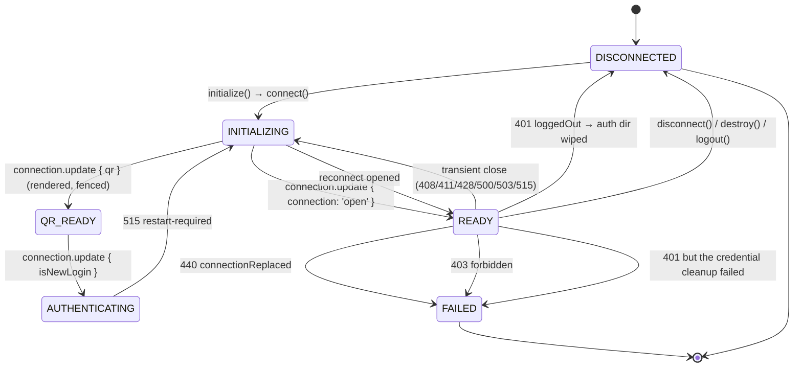
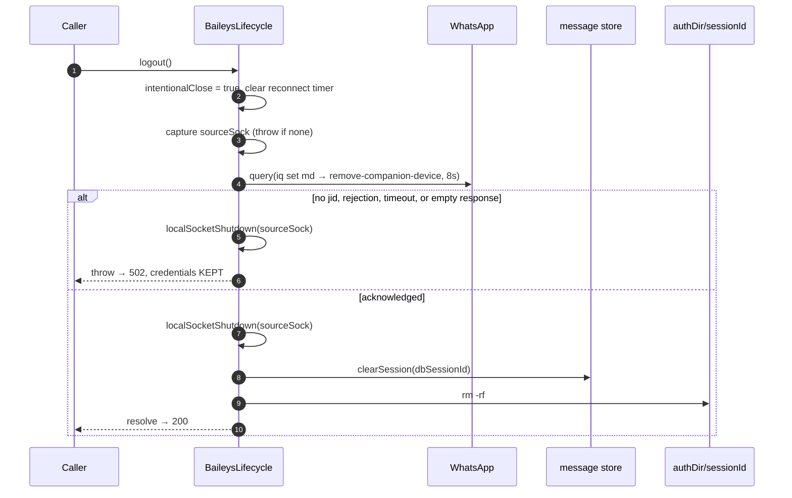
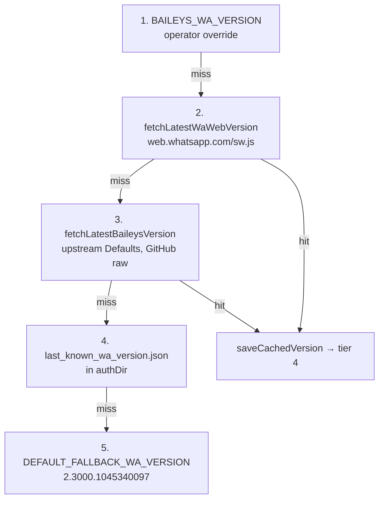

# The Baileys Adapter

> **Source of truth:** `src/engine/adapters/baileys.adapter.ts`, `src/engine/adapters/baileys-lifecycle.ts`, `src/engine/adapters/baileys-session-store.ts`, `src/engine/adapters/baileys-message-store.service.ts`, `src/engine/adapters/baileys-version-resolver.ts`, `src/engine/adapters/baileys-query-deadline.ts`, `src/engine/adapters/baileys-history.ts`
> **Band:** Engine layer · **Depends on:** 10-engine-abstraction.md, 11-engine-factory-registry.md, 12-engine-capability-matrix.md · **Jarcube class:** ENGINE-COUPLED

## Purpose

Baileys speaks WhatsApp's multi-device protocol over a WebSocket. No browser, no page, no DOM — which
removes every failure mode 13-adapter-wwebjs.md spends its length on and introduces a different set,
because a protocol client with **no store of its own** cannot answer any question about the past. It
knows what arrived while it was connected and nothing else, so half of this adapter is the state the
library declines to keep: a per-session in-memory snapshot of contacts and chats, a persisted table of
raw message protos, and a cross-session `lid → phone` mirror.

The other half is bounding a library that swallows its own timeouts. Baileys' `query()` catches its
60-second `defaultQueryTimeoutMs` and **resolves `undefined`** rather than throwing, and every group
and profile write discards the result and returns void — so a call resolves identically whether
WhatsApp confirmed the change or never answered at all. For those, a clock owned by OpenWA is the only
discriminator that exists.

Everything else here follows from three properties of the transport. It is *cheap to tear down*
(`destroy()` ends the socket synchronously, so `forceDestroy` is just `destroy`). It is *honest about
death* (the keepalive surfaces a close within ~35 s, so the liveness probe can be a local check). And
it is *pinned to a WhatsApp Web protocol version* that must be resolved fresh on every connect, from
five tiers, because a stale version is a connection that never opens.

Per-member availability is 12-engine-capability-matrix.md; the neutral contract is
10-engine-abstraction.md. Event translation is 15-engine-events.md.

## File Inventory

Line counts are as measured at the commit in 00-INDEX.md and drift. Nineteen files, ~6,364 lines,
excluding `src/engine/adapters/baileys.adapter.spec.ts` (5,538 lines) and the 20 focused behaviour
specs beside it.

| Path | Lines | Role |
| --- | --- | --- |
| `src/engine/adapters/baileys-events.ts` | 905 | Socket event handlers, inbound processing, media capping, the live-call cache (15-engine-events.md) |
| `src/engine/adapters/baileys-lifecycle.ts` | 841 | Connect/reconnect, the multi-file auth store wiring, QR, the IQ-acked logout, terminal-close taxonomy |
| `src/engine/adapters/baileys.adapter.ts` | 777 | The `IWhatsAppEngine` face: forwarders, the one host literal, the label writes, 13 honest 501s |
| `src/engine/adapters/baileys-messaging.ts` | 735 | Sends, sticker transcoding, safe link previews, quoted/forward/react via the store |
| `src/engine/adapters/baileys-groups.ts` | 523 | 23 group members plus the IQ-refusal decoder |
| `src/engine/adapters/baileys-contacts.ts` | 467 | Contacts, own profile, chat-list operations — all reading the session store |
| `src/engine/adapters/baileys-session-store.ts` | 435 | The in-memory snapshot the library does not keep: contacts, chats, last messages, lid→pn, ephemeral timers |
| `src/engine/adapters/baileys-message-mapper.ts` | 414 | Content-type, body, location, context and status mapping (17-message-mapping.md) |
| `src/engine/adapters/baileys-version-resolver.ts` | 225 | Five-tier WhatsApp Web protocol version resolution with a disk cache |
| `src/engine/adapters/baileys-channels.ts` | 195 | Channel/newsletter operations plus the w:mex refusal decoder |
| `src/engine/adapters/baileys-history.ts` | 167 | `messaging-history.set` capture and the post-connect name hydration |
| `src/engine/adapters/baileys-catalog.ts` | 155 | Business catalog: the cursor walk under one whole-request budget |
| `src/engine/adapters/baileys-message-store.service.ts` | 142 | The persisted `WAMessage` store: upsert, batch read, per-session eviction |
| `src/engine/adapters/baileys-status.ts` | 115 | Status posting and deletion |
| `src/engine/adapters/baileys-group-mapper.ts` | 96 | `GroupMetadata` → neutral `Group`/`GroupInfo`, with phone-twin preference |
| `src/engine/adapters/baileys-query-deadline.ts` | 56 | `withQueryDeadline` and the 30 s per-call budget |
| `src/engine/adapters/baileys-logger.ts` | 55 | Silent by default; a JSON-lines wire logger behind one env var |
| `src/engine/adapters/baileys-stored-message.entity.ts` | 34 | The `baileys_stored_messages` TypeORM entity |
| `src/engine/adapters/baileys-host.ts` | 27 | The single host surface every delegate receives |

Shared with the whatsapp-web.js adapter: `src/engine/adapters/message-mapper.ts`,
`src/engine/adapters/vcard.ts`, `src/engine/adapters/inbound-media-cap.ts` (17-message-mapping.md).
Baileys-only but documented elsewhere: `src/engine/adapters/safe-link-preview.ts`
(17-message-mapping.md), `src/engine/identity/wa-id.ts` and the LID store (16-identity-and-lid.md).

## Data Model / Contract

### Construction config

`src/engine/types/baileys.types.ts:BaileysAdapterConfig`:

| Field | Purpose |
| --- | --- |
| `sessionId` | Session **name**. Keys the on-disk auth dir (`authDir/sessionId`) and the version cache |
| `dbSessionId` | Session **UUID**. Keys the FK-bound `baileys_stored_messages` rows |
| `authDir` | Parent of the per-session multi-file auth directory |
| `proxyUrl` | Per-session egress; one agent for the WS *and* media transfers |
| `messageStore` | Injected port, not the concrete Nest service |
| `lidMappingStore` | Injected port for the cross-session `lid → phone` table |

The `sessionId` / `dbSessionId` split is the trap an implementer hits first: one is the on-disk key and
one is the database key, and they are not interchangeable. Every `messageStore` call in the adapter
passes `dbSessionId`; every filesystem path is built from `sessionId`.

Both stores are declared as **interfaces** (`src/engine/types/baileys.types.ts:BaileysMessageStore`,
`src/engine/identity/lid-mapping-store.service.ts:LidMappingStore`) rather than Nest services, so the
adapter stays unit-testable with a fake. `src/engine/index.ts` exports the entity and the media cap and
nothing else — everything here is reached by deep import inside `src/engine` (10-engine-abstraction.md).

### The host pattern

`src/engine/adapters/baileys-host.ts:BaileysEngineHost` is one object literal of ~50 closures, built in
the adapter constructor and handed to all nine delegates. Its docblock states the argument precisely:
a new cross-cutting member is added **once** here instead of to up to eight per-delegate bags, while
each delegate still declares its own narrow `Host` interface that the literal satisfies
*structurally*. Least privilege therefore stays enforceable — a delegate cannot accidentally grow a
dependency on the full surface — without the boilerplate of nine hand-maintained literals.

Two members are getters rather than plain properties, each for a stated reason:

- `connectedAt` reads through an arrow closure that captures the adapter, because an object-literal
  getter's `this` is the literal itself.
- `liveCalls` is a getter so the events delegate exists by first read. The literal is built *before*
  the delegates, and the earlier wiring captured `this.events.liveCalls` eagerly — a stable readonly
  reference owned by `src/engine/adapters/baileys-events.ts:BaileysEvents`. The indirection defers the
  capture. Construction order then guarantees safety: the lifecycle delegate is built last and only
  *uses* the bag during socket events.

`src/engine/adapters/baileys-events.ts:BaileysEvents` is constructed first, before messaging, because
the messaging delegate's own-send echo maps through `events.mapMessage`.

### State aliasing

`sock` and `connectedAt` live on `src/engine/adapters/baileys-lifecycle.ts:BaileysLifecycle` and are
aliased by adapter accessors — the same pattern, and the same justification, as the wwjs side: an
unmodified spec pokes `adapter.sock` through a cast.

## Socket lifecycle



`intentionalClose` is the single-use latch. `initialize()` checks it **and does not re-arm it**: a
retired adapter — one whose session was stopped or deleted during the service's pre-initialize window
— would otherwise open a fresh socket that no caller is tracking. `connectInner()` re-checks it after
its auth and version awaits, as a fence against a teardown landing during that I/O.

### The connect sequence

`src/engine/adapters/baileys-lifecycle.ts:connectInner`, in order:

1. **Proxy agent first**, before any auth-state I/O, so an unusable proxy value fails the session with
   `engine_error` instead of silently connecting direct.
   `src/engine/adapters/baileys-lifecycle.ts:createProxyAgent` accepts `http:`/`https:` (an
   `HttpsProxyAgent`) and `socks4:`/`socks5:` (a `SocksProxyAgent`) and **throws** on anything else.
   The scheme set matches the create-session DTO validator; a pre-validation DB row fails closed.
   Contrast the wwjs side, which ignores a bad proxy and launches direct — there, breaking the
   Chromium launch is the worse outcome.
2. **Lazy library load.** `@whiskeysockets/baileys` is ESM-only, so it is `await import`ed on first
   connect and memoised, never loaded at boot. Every delegate reaches it through `host.loadLib()`.
   That laziness is what lets the infra status endpoint import version resolution without pulling the
   engine in (11-engine-factory-registry.md).
3. **Multi-file auth state** (below).
4. **Version resolution** (below), with the proxy agent as its dispatcher.
5. **The Baileys logger**, one instance shared by the key-store wrapper and the socket.
6. **Previous-socket teardown** (below).
7. **`makeWASocket`** with the options table below.
8. **Sixteen `sock.ev` listeners.**

### Socket options that are decisions

| Option | Value | Why |
| --- | --- | --- |
| `browser` | `src/engine/adapters/baileys-lifecycle.ts:BAILEYS_BROWSER` = `[BAILEYS_BROWSER_NAME ?? 'OpenWA', 'Chrome', '120.0.0']` | The linked-device identity shown in WhatsApp → Linked Devices. Applies only to pairings made after the change |
| `shouldSyncHistoryMessage` | `() => true` | Baileys defaults it to `() => !!syncFullHistory`, so leaving both unset disables **all** history and app-state sync — no contacts, no chats, no recent history, and no `lid → phone` mappings ever arrive, because the address-book app-state sync only runs once history sync is enabled |
| `syncFullHistory` | `BAILEYS_SYNC_FULL_HISTORY === 'true'` | Keeps the full-archive download opt-in. With it false, WhatsApp sends the recent window plus the full contact/app-state snapshot |
| `markOnlineOnConnect` | `BAILEYS_MARK_ONLINE_ON_CONNECT !== 'false'` | Baileys defaults to true, so every reconnect broadcasts `available` — and WhatsApp suppresses the paired phone's push notifications while any linked device is online, so a 24/7 gateway permanently silences the phone. Gates only the on-connect presence; the typing API still sends per-chat presence |
| `getMessage` | reads the message store by `key.id` | Baileys defaults this to `async () => undefined`. Without a real implementation, WhatsApp's message-retry protocol — triggered whenever a recipient fails to decrypt on the first attempt — has nothing to resend, so the recipient sits on "waiting for this message" indefinitely instead of the retry resolving in seconds |
| `printQRInTerminal` | `false` | QR is rendered to a PNG data URL instead |
| `agent` / `fetchAgent` | the same proxy agent | The WS and media transfers share one egress |
| `logger` | `src/engine/adapters/baileys-logger.ts:createBaileysLogger` | Silent unless `BAILEYS_LOG_LEVEL` is set |

`getMessage` is the load-bearing reason the message store exists at all — see below.

### Previous-socket teardown

An internal reconnect overwrites `this.sock` **without** going through `disconnect`/`logout`/`destroy`,
so the previous socket's WebSocket and all sixteen `ev` listeners would leak on every reconnect. The
lifecycle removes each listener by name and then calls `end(undefined)`.

The ordering is the subtle part, and it is spelled out: `connection.update` is detached **before**
`end()`, because Baileys' own `end()` synchronously emits a synthetic
`connection.update { connection: 'close' }` — which, if still wired, would re-enter
`handleConnectionUpdate` and schedule a spurious second reconnect.

### The close taxonomy

`src/engine/adapters/baileys-lifecycle.ts:handleConnectionUpdate` branches on
`lastDisconnect.error.output.statusCode`:

| Code | Verdict | Auth dir | Reasoning |
| --- | --- | --- | --- |
| any, with `intentionalClose` | `DISCONNECTED`, return | kept | The caller already knows |
| 401 `loggedOut` | terminal → `handleRemoteLoggedOut()` | **wiped** | Credentials are invalid server-side. Leaving them makes the next `connect()` reload the stale creds and silently retry them instead of emitting a QR — the session sticks with no QR |
| 440 `connectionReplaced` | `FAILED` + `onError` | kept | Another live instance took over. Reconnecting would fight it — two instances endlessly replacing each other. The **link** is still valid |
| 403 `forbidden` | `FAILED` + `onError` | kept | An authorization-level refusal (banned/blocked). Retrying is pointless and risks worsening the account's standing. Not dead credentials, so the operator keeps the files for inspection |
| everything else (408/411/428/500/503/515/undefined) | transient | kept | Reconnect with capped backoff and **no attempt ceiling** |

Two behaviours on the transient path are easy to get wrong and are handled explicitly.

**The status drops to `INITIALIZING` immediately**, not at the reconnect attempt. The socket is dead
*now*, but the attempt runs only after the backoff (up to 60 s + jitter). Staying `READY` across that
window makes `probeLiveness()` report a live session and lets sends fail against a dead socket.
`setStatus` no-ops on an unchanged status, so the duplicate closes Baileys can emit per drop do not
flap `onStateChanged`.

**A duplicate close is ignored *without* burning an attempt.** The `reconnectTimer` check sits
deliberately *before* the counter increment.

`src/engine/adapters/baileys-lifecycle.ts:scheduleReconnect` is 1 s doubling to a 60 s cap plus up to
1 s jitter, and the absence of a ceiling is argued: a long network outage must not kill the session,
and only 401/403/440 are terminal. A failed attempt inside the timer is *just a failed attempt* — it
warns and schedules the next one, because the outage may outlast any fixed budget.
`src/engine/adapters/baileys-lifecycle.ts:RECONNECT_STABILITY_RESET_MS` (5 min) restarts the counter
when the previous close was long enough ago that the connection had clearly been healthy in between,
so a new incident does not inherit an old one's attempt count.

### Logout: why it is a hand-built IQ

`src/engine/adapters/baileys-lifecycle.ts:logout` does **not** call `sock.logout()`, and the reason is
the difference between a 200 and a 502. Baileys' own `logout()` resolves on a **WebSocket write
flush**, not on an IQ ack, and transmits nothing at all when `creds.me` is unset — so a resolved
promise proves nothing about the unlink. Completion of an engine-native unlink requires a *tagged IQ
result* from the server.



Four guards, each closing a specific way this could lie:

- **No live socket → throw.** An optional-chained send would resolve as though the unlink had been
  sent: the caller writes an audit row on success, the credentials get wiped, and the device stays
  listed under the account holder's Linked Devices with nothing left to retry with. This is reachable
  — a WhatsApp-side logout nulls the socket while the engine stays registered for the whole reconnect
  backoff.
- **No `creds.me` id → throw.** The companion identity is required to address the unlink.
- **Empty `query()` result → throw.** `query()` resolves without a result when WhatsApp did not
  acknowledge.
- `src/engine/adapters/baileys-lifecycle.ts:BAILEYS_LOGOUT_ACK_TIMEOUT_MS` = 8 s, sized above the
  typical round trip but well under the service's 10 s teardown deadline, so a wedged transport
  surfaces as a retryable 502 rather than wedging the session.

Every failure exit still runs
`src/engine/adapters/baileys-lifecycle.ts:localSocketShutdown`, so no orphan socket is left in the
service map after it evicts the engine on 502 — and that helper is **identity-safe**: it nulls
`this.sock` only if it still points at the captured socket, because a concurrent reconnect may have
swapped in a fresh one. Failure before acknowledgement must **not** remove auth state; the link may
still be valid and the creds are needed to retry.

`src/engine/adapters/baileys-lifecycle.ts:handleRemoteLoggedOut` handles the WhatsApp-initiated case
and the ordering is the point: status, socket and call-cache teardown happen **synchronously before
any await**, so the session watchdog never processes a `READY` socket that is already dead. The
credential removal is then registered through `onCredentialTeardownStarted` the instant it begins —
explicitly *not* guarded on this engine still being live, because the `rm` targets the session
**name**'s auth dir and would race a recreated session under that same name
(21-session-fences-and-races.md). A failed removal is terminal: `FAILED` + `onError`, not a clean
disconnect, because the credentials did not actually get wiped and a reconnect with known-invalid auth
would loop forever.

### QR and pairing

QR arrives as a raw ref string on `connection.update { qr }` and is rendered to a PNG data URL, so the
stored value matches the wwjs contract (the dashboard does ``). Two guards:

- Baileys keeps rotating the QR every 20–60 s until the socket ends, **including after the link was
  accepted**, so a refresh in that window must not put the session back at `QR_READY`. The handler
  skips a `qr` while already `AUTHENTICATING`.
- `src/engine/adapters/baileys-lifecycle.ts:handleQrCode` fences again *after* the render await, on
  three conditions: the socket was replaced, `ws.isOpen` is false, or the status moved to
  `AUTHENTICATING`. Publishing then would stamp `QR_READY` on a dead socket for the whole backoff, or
  reopen the pairing guard on a socket committed to a restart.

`isNewLogin` moves to `AUTHENTICATING` rather than leaving `QR_READY`, and the reason is a real
hazard: WhatsApp accepted the scan and will ask for a restart (a 515 close), and a repeat pairing
request in that window would pass the guard and **overwrite the just-linked `creds.me`**.

`src/engine/adapters/baileys-lifecycle.ts:requestPairingCode` therefore gates on `QR_READY` **and**
`sock.ws.isOpen`, and the docblock argues both operands. `this.sock` is assigned the moment
`makeWASocket` returns, before the WebSocket is open, and Baileys' `sendNode` throws a raw Boom 428
until it is. The status alone is not enough either: Baileys emits its close `connection.update` only
after `await ws.close()` resolves, and `ws` leaves a black-holed socket in CLOSING for its 30 s close
timeout — so the status keeps reading `QR_READY` for up to half a minute after the connection stopped
carrying anything. `ws.isOpen` is the same predicate Baileys' own `sendRawMessage` tests. It matters
beyond the status code: `requestPairingCode` writes `creds.me` and emits `creds.update`, which is
persisted, **before** it sends — so a request in that window leaves the next connect trying to log in
as a device that was never registered. The whatsapp-web.js engine needs no equivalent operand, because
its page and browser death listeners drop the status in the same tick.

### Liveness

`src/engine/adapters/baileys-lifecycle.ts:probeLiveness` is `status === READY && sock != null` — a
local check, no round trip — and the docblock is careful about what that does and does not cover.
Genuine dead-connection detection is owned by Baileys' keepalive, which surfaces a close (408) within
~35 s of a silent drop, and the close handler then drops the status for the whole backoff. But the
status **trails** the dead transport: that close only fires after `await ws.close()` resolves, which on
a black-holed socket waits out ws's 30 s timeout. Acceptable for the watchdog, whose next interval
catches it; explicitly *not* sufficient for a request guard, which is why `requestPairingCode` adds
`ws.isOpen`. Compare 12-engine-capability-matrix.md, where the same optional interface method is
implemented at two very different depths.

## The multi-file auth store

`b.useMultiFileAuthState(authPath)` gives Baileys a directory of JSON files under
`authDir/<sessionId>`: `creds.json` plus one file per Signal session, pre-key, sender key and
app-state sync key. `creds.update` triggers `saveCreds()`, fire-and-forget with a warning on failure.

One wrapper is applied, and it fixes a live incident:

```ts
// src/engine/adapters/baileys-lifecycle.ts
state.keys = b.makeCacheableSignalKeyStore(state.keys, baileysLogger);
```

Without it every session read and write hits disk directly with no protection against a
write-then-immediate-read race. The observed symptom was a freshly established Signal session
appearing "missing" moments later, so Baileys discarded it and started a brand-new PreKey handshake on
the very next send — visible as repeated "Closing session" log spam, with the recipient stuck on
"waiting for this message" until a slow WhatsApp-side retry rescued it. The official caching layer
keeps just-written state visible in memory immediately, regardless of disk I/O timing.

`src/engine/adapters/baileys-lifecycle.ts:clearAuthState` removes the directory with `recursive` and
`force`, logs the outcome, and **rethrows** on failure. Completion of both an engine-native unlink (a
200) and the `loggedOut` close path *requires* cleanup, so a removal failure must propagate as "the
operation is incomplete" rather than be swallowed. The version resolver's disk cache
(`last_known_wa_version.json`) lives in `authDir`, not the per-session dir, so it survives a re-pair.

## Why a message store exists at all

Baileys ships no store. That is not an omission the library expects you to tolerate — four separate
capabilities are impossible without one, and one of them is a protocol obligation.

| Consumer | Without a store |
| --- | --- |
| `getMessage` (socket option) | WhatsApp's message-retry protocol has nothing to resend, so a recipient whose first decrypt failed stays on "waiting for this message" indefinitely |
| `replyToMessage` | Quoting needs the original `WAMessage`, not just its id |
| `forwardMessage` | Same |
| `reactToMessage` / `deleteMessage` / `starMessage` / `pinMessage` by id | All need the `WAMessageKey`, and `star` needs the key's `fromMe` — the same id means different messages depending on direction |

`src/engine/adapters/baileys-message-store.service.ts:BaileysMessageStoreService` implements the
injected `BaileysMessageStore` port over the
`src/engine/adapters/baileys-stored-message.entity.ts:BaileysStoredMessage` entity on the `data`
connection.

| Column | Note |
| --- | --- |
| `id` | Generated UUID PK |
| `sessionId` | The session **UUID** (`dbSessionId`), with a CASCADE FK to `sessions` |
| `waMessageId` | `msg.key.id` |
| `serializedMessage` | `JSON.stringify(msg, BufferJSON.replacer)` — the raw proto, buffers included |
| `createdAt` | `@CreateDateColumn`, but **written explicitly** on every upsert |

Two indexes: `(sessionId, waMessageId)` unique — serving both lookup and dedup — and
`(sessionId, createdAt)` for eviction ordering. The entity comment names the reason the relation
declares CASCADE explicitly: both the `synchronize: true` SQLite path and the migration path must
clean up stored messages when the parent session row is deleted. It is deliberately engine-specific
and lives in the engine layer, not the neutral `messages` table (70-database-design.md,
27-message-projection.md).

Three implementation details each fix a real defect:

**`createdAt` is set explicitly rather than left to `datetime('now')`.** SQLite's default stores
second precision (`…:11`) while the JS `Date` bound param serialises as `…:11.000`, and SQLite
string-compares `'…:11' < '…:11.000'` as **true** — so every same-second row was over-evicted and the
store got wiped to ~0.

**A missing parent session row is dropped, not thrown.**
`src/engine/adapters/baileys-message-store.service.ts:isMissingParentSessionError` recognises a
foreign-key violation across both drivers (Postgres `23503`, SQLite `SQLITE_CONSTRAINT*` plus the
message text), checking the TypeORM wrapper *and* `driverError`. An orphaned adapter — the sessions row
deleted or recreated during reconnect churn while this adapter kept emitting `messages.upsert` — has no
valid parent to store under, so the write is dropped rather than throwing the FK error on every
message. The warning fires **once per session**, tracked in a `Set`, and says explicitly which
capabilities are lost for messages received under that id.

**`getMessages` is one query for the whole batch.** The read-receipt path resolves up to a hundred ids
at a time, and a `findOne` apiece would be a hundred sequential round trips for one request. The
interface documents that order and length are *not* guaranteed to match the input
(10-engine-abstraction.md).

`src/engine/adapters/baileys-message-store.service.ts:enforceLimit` keeps the newest
`BAILEYS_MESSAGE_STORE_LIMIT` (default 5000) rows per session, and its cutoff is deterministic on
`(createdAt, id)` — it selects the row at offset `limit` and deletes everything strictly older plus
everything at the same instant with a lower id. `clearSession` is called on a successful logout.

## The session store

`src/engine/adapters/baileys-session-store.ts:BaileysSessionStore` is the second half of "the library
keeps nothing": a per-session, in-memory snapshot fed entirely from `sock.ev`, mapped to the neutral
`Contact` / `ChatSummary` on read. It holds no socket — pure data.

Five maps, all bounded by `src/engine/adapters/baileys-session-store.ts:LruMap` (insertion-ordered
`Map`, read or write re-inserts at the recent end, `set` evicts while over the cap):

| Map | Fed by | Miss path after eviction |
| --- | --- | --- |
| `contacts` | `contacts.upsert`, `contacts.update`, `messaging-history.set`, harvested `pushName` | Name lookups degrade to the raw user-part |
| `chats` | `chats.upsert`, `chats.update`, `messaging-history.set`, `hydrateNames` | Falls out of `getChats()` until the next event |
| `lastMessages` | every inbound and history message, newest wins | `lastMessage` reads null; callers treat it as "nothing known" |
| `lidToPn` | `messaging-history.set`, `lid-mapping.update`, message keys, contact records | Falls back to the contacts map, then the persisted cross-session table |
| `ephemeralByChat` | inbound messages | Falls back to `Chat.ephemeralExpiration`, then undefined — never forces a timer |

The cap is `BAILEYS_SESSION_STORE_MAX_ENTRIES`, default
`src/engine/adapters/baileys-session-store.ts:SESSION_STORE_MAP_CAP_DEFAULT` (5000, matching every
other per-session bound in the tree), `0` for unbounded. The reason a cap is needed at all is stated:
contacts, chats, last messages and lid mappings all grow from **peer-controlled traffic**, so without
one a chatty account leaks an entry per distinct peer ever seen. `ephemeralByChat` gets **double** the
cap because it is keyed under both the raw and the neutral JID — two entries per chat.

Every read has a defined miss path, which is what makes eviction cost a re-resolution rather than data
loss. That property is the licence to bound the maps at all.

### The ephemeral-timer cache, and why it exists

`Chat.ephemeralExpiration` — the field that *should* carry a chat's disappearing-messages timer — was
measured absent for a long-standing timer after a reconnect: **0 of 159 cached chats carried it**. So
`src/engine/adapters/baileys-session-store.ts:extractEphemeralDuration` reads the message instead:
`WAMessage.ephemeralDuration` first (populated on history-synced messages, typically absent on a live
1:1 upsert), then `contextInfo.expiration`, which WhatsApp stamps on every message in a disappearing
chat, found by a depth-4 walk that unwraps the ephemeral / view-once / document-with-caption envelopes.

Only a **positive** value is cached or returned. A non-positive or absent value means "no live timer on
*this message*" and is left untouched, because a single non-ephemeral message must not clear a known
timer — WhatsApp keeps stamping it while the timer is on. And on read, `0` / `null` / absent all mean
"no known timer", so the caller omits the per-message `ephemeralExpiration` entirely. That keeps a
stale-empty or boot-window cache from ever forcing a message to disappear.

The entry is written under **both** the raw and the neutral JID so an outbound send addressed in either
dialect resolves to the same value; `getEphemeralExpiration` tries raw, engine and neutral keys.

### Identity folding

Two methods sit at the dialect boundary and are used constantly by every other Baileys delegate:

- `src/engine/adapters/baileys-session-store.ts:toNeutralJid` delegates to
  `src/engine/identity/wa-id.ts:toNeutralJid` with `resolvePhone` as the lid resolver.
- `src/engine/adapters/baileys-session-store.ts:toEngineJid` folds a neutral `@c.us` back to
  `@s.whatsapp.net`, and the docblock names two independent reasons. The maps are keyed by Baileys' raw
  dialect while the app now hands over neutral ids, so lookups must fold first — and the outbound
  group-participant operations must fold because **only `@s.whatsapp.net` encodes to the single-byte
  protocol token**, whereas a raw `c.us` server suffix would go on the wire as an unknown string.

`src/engine/adapters/baileys-session-store.ts:resolvePhone` is the four-tier lid resolution: a `user`
id already carries its phone as the user-part; a `lid` tries the session map (device-stripped, then
verbatim), then the contact record's `phoneNumber`, then the persistent cross-session table, where
`null` (cached negative) and `undefined` (never seen) both collapse to `null`. Full model:
16-identity-and-lid.md.

`src/engine/adapters/baileys-session-store.ts:recordKeyLidMappings` learns pairs from the message key
itself, and the field names matter: Baileys v7 replaced 6.7.x's
`senderLid`/`senderPn`/`participantLid`/`participantPn` with `remoteJidAlt` (DM) and `participantAlt`
(group), where the "Alt" is always the *other dialect of the same field*.
`src/engine/adapters/baileys-session-store.ts:lidPnPair` sorts a JID and its Alt by which one ends in
`@lid`. This is still the only place a fresh `@lid` sender's number is revealed on the key.

`isMyContact` is worth one note because it is a correctness fix, not a mapping detail. Baileys
distinguishes `name` (what *you* saved) from `notify` (the pushname the contact set themselves), so
`isMyContact: Boolean(c.name)` is the honest reading. Reporting `true` for everyone told an automation
that every chat partner was in the addressbook.

## History sync

Baileys' `messaging-history.set` is the **only** pre-connection history source, and it arrives as a
full re-sync on each connect. The lifecycle fans one event out five ways: contacts, chats, lid
mappings, the message capture, and a debug line carrying `syncType`, `isLatest`, `progress` and the
named/lid/mapping counts — which is the only visibility into whether the sync actually delivered.

`src/engine/adapters/baileys-history.ts:captureHistoryMessages` does three things per message:

1. **Harvests `pushName` into contacts.** History `contacts` carry no names, so the messages are the
   only name source. Only for `fromMe !== true`.
2. **Seeds the chat's last-message preview and sort time** via `recordMessage`, or history-only chats
   read "No messages yet".
3. **Maps media-free** through `src/engine/adapters/baileys-history.ts:mapHistoryMessage` and hands the
   batch to `onHistoryMessages`.

The media-free choice is not a shortcut — downloading media for thousands of messages would be
ruinous, so the *type* is kept and the payload dropped. `mapHistoryMessage` returns `null` for
protocol, reaction, sender-key and empty messages, which carry nothing for a chat view, and it
normalises the content **once** so the real inner type and body surface: without that a
disappearing-chat message maps to `unknown` with an empty body. It reuses
`src/engine/adapters/baileys-message-mapper.ts:extractBaileysBody` — the same extractor the live path
uses — and the same `extractEphemeralDuration`, so the history sink can apply the
`STORE_EPHEMERAL_MESSAGES` opt-out symmetrically with `onMessage`.

`onHistoryMessages` is dispatch-free by contract: persist, do not dispatch (10-engine-abstraction.md,
27-message-projection.md).

`src/engine/adapters/baileys-history.ts:hydrateNames` runs on every `open` and exists because Baileys
6.7.x often **skips the initial app-state sync** — the state machine goes Online before it runs — and
the PUSH_NAME sync can fail to decrypt, so names never arrive. Two best-effort steps, each in its own
try/catch: `groupFetchAllParticipating()` under a query deadline (group subjects are reliable), then
`resyncAppState(ALL_WA_PATCH_NAMES, false)`. DM push-names still arrive via `contacts.update` on live
messages, so neither step is fatal.

The deadline on the group fetch is there for a specific ambiguity the code names: an unanswered query
and an account with no groups both yield `{}`, and `query()` resolves rather than throwing, so neither
the catch nor an empty result can tell them apart. Without a clock the step finishes silently — no
warn, because nothing threw, and no debug, because there was nothing to hydrate.

`resyncAppState` is also the target of `scripts/patch-baileys-appstate.js`, whose unbounded loop would
otherwise burn one 60-second query per pass for the life of the socket (18-upstream-patching.md).

## Version resolution

Baileys must be told which WhatsApp Web protocol version to present, and a stale one is a connection
that never opens. `src/engine/adapters/baileys-version-resolver.ts:BaileysVersionResolver` walks five
tiers on **every connect** and stops at the first success:



| Tier | Details |
| --- | --- |
| 1 | `src/engine/adapters/baileys-version-resolver.ts:resolveFromEnv` — accepts `2.3000.xxxxxxxxx` with `.` or `,` separators, requires `major === 2 && minor >= 2000 && patch >= 0`. A malformed value warns with the expected format and **advances** rather than failing |
| 2 | `src/engine/adapters/baileys-version-resolver.ts:resolveFromWaWeb` — passes the proxy as `dispatcher` and an `AbortSignal.timeout`. Requires `isLatest === true`; `false` warns and advances |
| 3 | `src/engine/adapters/baileys-version-resolver.ts:resolveFromBaileys` — Baileys does **not** forward `signal` here, so the call is raced against a manual `unref`'d timer, and the loser's rejection is defused |
| 4 | `src/engine/adapters/baileys-version-resolver.ts:resolveFromDiskCache` — `authDir/last_known_wa_version.json`, written by tiers 2 and 3. Warns when used |
| 5 | `src/engine/adapters/baileys-version-resolver.ts:DEFAULT_FALLBACK_WA_VERSION`, with a warning. The comment says to refresh it during major bumps or when WhatsApp deprecates older client revisions |

`src/engine/adapters/baileys-version-resolver.ts:VERSION_RESOLVER_TIMEOUT_MS` is 5 s per remote tier.
Tier 3's defused rejection is documented as defence against the library changing rather than a live
bug: that call currently catches everything and resolves a frozen stub, so it cannot reject — but
racing abandons the loser without cancelling it, and an abandoned rejection would surface as an
unhandled rejection.

Both cache writes and the cache read are wrapped and silent on failure — a non-blocking best effort.
Note this is an entirely separate mechanism from `src/engine/wa-web-version.ts`, which pins the
whatsapp-web.js **page HTML** from the wa-version registry; the two share only a motivation
(11-engine-factory-registry.md, 18-upstream-patching.md).

## Query deadlines

`src/engine/adapters/baileys-query-deadline.ts:withQueryDeadline` exists because of one library
decision with a comment of its own in Baileys' source: `query()` catches its
`defaultQueryTimeoutMs` and **resolves `undefined` instead of throwing**. Callers downstream split two
ways, and the module states both:

- Those that can still tell the cases apart **from the value** — `onWhatsApp` resolves `undefined`
  where a real answer is an array — check the value directly and do not use this.
- Those that cannot, because the library discards the result. **Every group and profile write is in
  this second group**: `groupLeave`, `groupUpdateSubject`, `groupSettingUpdate` and their siblings all
  `await groupQuery(...)` and return void, so the call resolves identically whether WhatsApp confirmed
  the change or never answered at all.

For the second group a clock is the only discriminator there is. The shape follows
`src/engine/adapters/inbound-media-cap.ts:withInboundDownloadTimeout`: an `unref`'d timer, cleared in a
`finally`, and the abandoned call's late rejection defused so it cannot surface unhandled. On expiry it
rejects with `src/common/errors/engine-transport.error.ts` carrying a caller-supplied detail string.

`src/engine/adapters/baileys-query-deadline.ts:BAILEYS_QUERY_BUDGET_MS` is 30 s, and its bounds are
argued rather than picked: anchored to `MEDIA_DOWNLOAD_TIMEOUT_MS`, this repo's existing figure for one
bounded WhatsApp round trip; it must stay **under** Baileys' 60 s `defaultQueryTimeoutMs` to be
observable at all, and under `session.proxyTimeoutMs` so a multi-node deployment does not race two
deadlines against each other (23-session-ownership-and-takeover.md).

The trade is stated plainly: a WhatsApp IQ normally answers in well under a second, so reaching the
budget means something is wrong — but a genuinely slow write that succeeds just after the deadline
**will** be reported as unconfirmed. An honest "not confirmed" beats a "done" for a change WhatsApp
never acknowledged, and every write bounded here is safe to repeat.

Abandoning the call does **not** cancel it; the underlying query settles on Baileys' own clock and is
discarded. The module notes that this is harmless because nothing loops on it, and that where an
unanswered query *does* drive a loop (`resyncAppState`) a deadline would hide the leak rather than stop
it — so that one is fixed in the library instead, by `scripts/patch-baileys-appstate.js`.

`src/engine/adapters/baileys-catalog.ts` applies the same figure differently: one **whole-request**
budget spent across every page of the cursor walk (`CATALOG_PAGE_SIZE` = 50) rather than per query, for
the same "under 60 s, under `proxyTimeoutMs`" reasons.

### Refusal decoding

Two separate decoders, deliberately not merged, because WhatsApp reports refusals on two channels with
incompatible shapes:

`src/engine/adapters/baileys-groups.ts:refusedStatusCode` reads the **IQ error** channel. A numeric
`data` is the whole discriminator, and it is sufficient because `query()` runs
`assertNodeErrorFree(result)` before returning, and that throws `new Boom(text, { data: +code })`. The
docblock records a removed second branch that read `output.statusCode` whenever `data !== undefined` —
it did the opposite of its purpose, because Boom's constructor destructures `data = null`, so **no**
Boom ever has `data === undefined` and the guard was always true. Every transport Boom matched, so
`Boom('Connection Closed', { statusCode: 428 })` returned 428, landing inside the 4xx window, and a
dead socket was reported as `403 admin rights or permissions may be missing`.

`src/engine/adapters/baileys-channels.ts:wmexRefusalCode` reads the **w:mex** channel, where a refusal
is a GraphQL error inside a *successful* IQ that never passes through `assertNodeErrorFree`. Its
discriminator is a non-null **object** `data`, which is safe only in that file: Boom defaults `data` to
null so every transport failure carries null, and so does `executeWMexQuery`'s other throw for an
unanswered query. It stays local rather than folded into `refusedStatusCode` because `promiseTimeout`'s
Boom **also** carries an object `data` alongside a 4xx `DisconnectReason` code and must never be read
as a refusal.

## Inbound media

The same three-layer bound as the wwjs side, with one advantage and one extra hazard.
`src/engine/adapters/baileys-events.ts` pre-gates on the declared `fileLength` — and here that is a
*robust* bound, because Baileys integrity-checks content against the declared size, so an honest
over-cap sender's media is never decrypted into heap at all. It then **streams** with a running-total
abort (`downloadMediaMessage(msg, 'stream', …)`, keeping the library's expired-media re-upload retry
via `updateMediaMessage`), so a sender who *understates* `fileLength` still cannot materialise an
over-cap blob. `src/engine/adapters/inbound-media-cap.ts:capInboundMedia` is the last line, with lazy
base64.

The extra hazard is the slow-loris: a trickling sender never trips the byte cap, so the download is
also wrapped in `withInboundDownloadTimeout`, which **destroys the stream** on expiry — an abort the
wwjs side cannot perform, which is exactly why that adapter must hold its concurrency slot instead.

The queue is unbounded for the same reason and with the same recorded history:
`handleMessagesUpsert` submits a whole upsert synchronously, so admission is decided before any
download finishes, and a queue capped at the active slots admitted a constant `2n` regardless of batch
size — a 40-message upsert lost the media of 32. On any limiter rejection the message is re-processed
with `skipMedia`, so the body and metadata are emitted rather than lost, and the log distinguishes
"limiter closed during teardown" from a real download failure, because reporting the first as
saturation sent operators to look at concurrency settings for a problem that was never there.

One deliberate divergence from wwjs: the outbound **sent echo** passes `skipMediaDownload`, because the
API caller already holds the media and the REST send path persists it. The wwjs echo *does* download,
because a phone-composed send has no other source.

## Call Chain

- `src/engine/engine.factory.ts:EngineFactory` → `new BaileysAdapter(config)`
  (11-engine-factory-registry.md).
- `src/modules/session/session-engine-lifecycle.service.ts` → `initialize(callbacks)` →
  `src/engine/adapters/baileys-lifecycle.ts:BaileysLifecycle` → `connect()` → `connectInner()`.
- `connectInner` → `createProxyAgent` → `loadLib()` → `useMultiFileAuthState` →
  `src/engine/adapters/baileys-version-resolver.ts:BaileysVersionResolver` → `makeCacheableSignalKeyStore`
  → previous-socket teardown → `makeWASocket` → 16 `ev` listeners.
- Socket event → `host.handleX` → `src/engine/adapters/baileys-events.ts:BaileysEvents` → session-store
  write + neutral callback (15-engine-events.md).
- Feature service → adapter forwarder → delegate → `host.ensureReady()` → `toEngineJid` →
  `withQueryDeadline(sock.method(...))` → refusal decode → neutral result.
- `messaging-history.set` → `src/engine/adapters/baileys-history.ts:captureHistoryMessages` →
  `onHistoryMessages` (persist, do not dispatch).
- Send → `src/engine/adapters/baileys-messaging.ts` → `emitOwnSendEcho` → `events.mapMessage` →
  `onMessageCreate`, plus `putStoredMessage` so a later reply/forward/react can resolve it.

## Configuration

| Env var | Default | Effect |
| --- | --- | --- |
| `BAILEYS_WA_VERSION` | unset | Tier-1 protocol version override, `2.3000.xxxxxxxxx` |
| `BAILEYS_BROWSER_NAME` | `OpenWA` | Device name in WhatsApp → Linked Devices. Applies to new pairings only |
| `BAILEYS_SYNC_FULL_HISTORY` | `false` | `true` downloads the full archive rather than the recent window |
| `BAILEYS_MARK_ONLINE_ON_CONNECT` | `true` | `false` keeps the gateway invisible so the phone still gets push notifications |
| `BAILEYS_LOG_LEVEL` | `silent` | `trace`…`error`. JSON lines to stdout under context `baileys-wire`, independent of the app log level |
| `BAILEYS_MESSAGE_STORE_LIMIT` | 5000 | Rows retained per session |
| `BAILEYS_SESSION_STORE_MAX_ENTRIES` | 5000 | Per-map LRU cap; `0` = unbounded |
| `LID_MAPPING_CACHE_MAX` | 5000 | Cross-session lid mirror cap (16-identity-and-lid.md) |
| `MEDIA_DOWNLOAD_ENABLED` / `MEDIA_DOWNLOAD_MAX_BYTES` / `MEDIA_DOWNLOAD_TIMEOUT_MS` / `INBOUND_MEDIA_CONCURRENCY` | see 17-message-mapping.md | Shared inbound media bounds |
| `STORE_EPHEMERAL_MESSAGES` | see 27-message-projection.md | Whether disappearing messages are persisted |

Full list: APPENDIX-A-env-vars.md.

`src/engine/adapters/baileys-logger.ts` deserves one note: an unrecognised `BAILEYS_LOG_LEVEL` falls
back to `createSilentLogger()` rather than erroring, and the wire logger writes straight to
`process.stdout` so a run can be captured with
`BAILEYS_LOG_LEVEL=trace node dist/main > baileys-wire.log`. `createSilentLogger` is also passed
explicitly into `downloadMediaMessage`, so a media download never spams the app log.

## Events Emitted / Consumed

Sixteen `sock.ev` listeners, registered in `connectInner`:

| Socket event | Handled by | Effect |
| --- | --- | --- |
| `creds.update` | lifecycle | `saveCreds()`, fire-and-forget |
| `connection.update` | lifecycle | QR, `isNewLogin`, open/close, `reachoutTimeLock` |
| `messages.upsert` | events | 15-engine-events.md |
| `messages.update` | events | `onMessageAck` |
| `contacts.upsert` / `contacts.update` | events + store | Diagnostic log, then `upsertContacts` |
| `chats.upsert` / `chats.update` | store | `upsertChats` with a count log |
| `messaging-history.set` | store + history | Contacts, chats, lid mappings, message capture, sync diagnostics |
| `lid-mapping.update` | store | `addLidMappings` — the post-v7 replacement for `chats.phoneNumberShare`, whose `{ lid, jid }` payload this shape directly replaces |
| `group-participants.update` / `groups.update` / `group.join-request` | events | `onGroupEvent` |
| `call` | events | `onCall` / `onCallOutcome` |
| `presence.update` | events | `onPresenceUpdate` |

`reachoutTimeLock` is the account-restriction channel, and Baileys reports it first-class rather than
inferring it from failures — including the **lift**, so `isActive: false` is a positive "no
restriction" and is forwarded as `null`.
`src/engine/adapters/baileys-lifecycle.ts:reportReachoutTimelock` handles both directions, and the
handler covers two channels with one path: the same event arrives whether WhatsApp pushed the change or
`src/engine/adapters/baileys-lifecycle.ts:probeAccountRestriction` pulled it, because Baileys routes
its own query result back through `connection.update`. That probe runs once per connection precisely
because WhatsApp only *pushes* a timelock when it changes, so a gateway starting while already
restricted would never hear about it. It is best-effort at debug level: an account or server that does
not answer must not turn a healthy connection into a logged failure.

A timelock does **not** close the connection — the account stays linked and existing chats keep
working, only starting new conversations is blocked — so nothing in that path touches status or
reconnects. `expiresAt` guards against `NaN`: `time_enforcement_ends` is a server string Baileys parses
with `parseInt`, so a malformed value yields an Invalid Date whose `getTime()` is `NaN`, which would
serialise to `null` and read as "no expiry known". Same outcome, reached deliberately. `code` defaults
to `'DEFAULT'`, which is **Baileys' own** "no specific enforcement type" value, not a placeholder.

Full catalog: APPENDIX-B-events.md.

## Failure Modes & Edge Cases

| Scenario | Behaviour |
| --- | --- |
| Unsupported proxy scheme | `createProxyAgent` **throws** — the session fails closed rather than connecting direct |
| Reconnect overwrites the socket | Previous socket's 16 listeners removed by name, `connection.update` detached **first**, then `end()` |
| Duplicate close per drop | Ignored without burning a backoff attempt |
| Close >5 min after the previous one | Backoff counter reset |
| Transient close | `INITIALIZING` immediately; retries forever |
| 401 `loggedOut` | Synchronous teardown, then the auth dir is wiped and the removal is registered as a tracked credential teardown |
| 401 whose cleanup fails | `FAILED` + `onError` — not a clean disconnect, because the creds are still there |
| 440 / 403 | `FAILED` + `onError`, call cache cleared, auth **kept** |
| `logout()` with no socket / no `creds.me` / no ack | Throws → 502, credentials kept, socket still stopped locally |
| `logout()` where the auth removal fails | Throws → the operation is incomplete |
| Concurrent reconnect during `logout()` | `localSocketShutdown` is identity-safe and leaves a fresh socket alone |
| QR refresh after the link was accepted | Ignored while `AUTHENTICATING` |
| QR render outraces a drop or a link | Post-await fence on socket identity, `ws.isOpen`, and status |
| `requestPairingCode` before the WS is open | 409, on `ws.isOpen` — the status alone lags by up to 30 s |
| Message-store write with no parent session row | Dropped; warned once per session, naming the lost capabilities |
| Store over `BAILEYS_MESSAGE_STORE_LIMIT` | Deterministic `(createdAt, id)` eviction |
| `getMessage` called with a key carrying no id | Returns null rather than letting an undefined criterion reach the ORM |
| A group/profile write WhatsApp never answers | `EngineTransportError` after 30 s — reported as unconfirmed, never as done |
| An IQ refusal | 4xx-class WA code decoded by `refusedStatusCode` → `EngineRefusedError` (403) |
| A w:mex refusal | Decoded by `wmexRefusalCode`; the two channels stay separate |
| `groupFetchAllParticipating()` unanswered vs. no groups | Both yield `{}`; the deadline is the only discriminator |
| App-state resync loop on an unanswered query | Bounded by `scripts/patch-baileys-appstate.js`, not here |
| History sync never runs | `hydrateNames` backfills group subjects and retriggers the app-state sync; both non-fatal |
| Live message tagged `append` around a reconnect | Emitted anyway — gated on the message timestamp vs. `connectedAt`, not the batch tag (15-engine-events.md) |
| Session-store map eviction | Costs a re-resolution; never data loss |
| No known ephemeral timer | `ephemeralExpiration` omitted, so nothing is forced to disappear |
| A label write aimed at a channel | `ChatLabelsUnsupportedError` — WhatsApp has no concept of labelling a channel, and forwarding it reported success while nothing was labelled |
| A label write aimed at a neutral `@c.us` | Folded to `@s.whatsapp.net` first, or `chatModify` would label a phantom chat the phone never reads |
| A sticker send whose bytes are not WebP | Transcoded, animated-aware; already-WebP input passes through byte-identical |
| 13 unimplemented members | `src/engine/adapters/baileys.adapter.ts:unsupported` → `EngineNotSupportedError` → 501 (12-engine-capability-matrix.md) |

Specs: `src/engine/adapters/baileys.adapter.spec.ts` plus
`src/engine/adapters/baileys-session-store.spec.ts`,
`src/engine/adapters/baileys-message-store.service.spec.ts`,
`src/engine/adapters/baileys-version-resolver.spec.ts`,
`src/engine/adapters/baileys-transport-status.spec.ts`,
`src/engine/adapters/baileys-write-deadline.spec.ts`,
`src/engine/adapters/baileys-wmex-refusal.spec.ts`,
`src/engine/adapters/baileys-refused-status.spec.ts`,
`src/engine/adapters/baileys-inbound-burst.spec.ts`,
`src/engine/adapters/baileys-history.spec.ts`,
`src/engine/adapters/baileys-sticker-webp.spec.ts`,
`src/engine/adapters/baileys-voice-waveform.spec.ts`,
`src/engine/adapters/baileys-quoted-send.spec.ts`,
`src/engine/adapters/baileys-send-seen.spec.ts`,
`src/engine/adapters/baileys-group-lid-twins.spec.ts`,
`src/engine/adapters/buffer-json-parity.spec.ts`. 96-testing-strategy.md.

## Jarcube Portability

**Classification:** ENGINE-COUPLED

**Rationale:** every mechanism here is a compensation for driving a **reverse-engineered protocol
client**. Jarcube's transport is Meta's official Cloud API
(`QuantumMind-backend/src/whatsapp/whatsapp.service.ts`), which has no socket, no pairing, no Signal
key store, no protocol-version negotiation, and no local history. Four of the largest pieces have no
counterpart whatsoever:

- **The multi-file auth store.** Cloud API authenticates with a per-bot access token in a header.
  There is no key material to persist, no `creds.update`, and nothing whose removal is irreversible.
- **Version resolution.** Cloud API is a versioned Graph API with a published deprecation policy; you
  pin `v21.0` in a URL and it stays working. Five tiers of best-effort discovery answer a question
  that does not exist.
- **The session store.** Cloud API is stateless webhooks plus REST. There is no "the library keeps no
  contacts" problem, because there is no library keeping anything.
- **The reconnect state machine.** There is no connection to reconnect.

**Prerequisites:** none. Nothing here should be ported wholesale.

**Cloud API caveats:** the one place where the *shape* recurs is Jarcube's own OpenWA provider,
`QuantumMind-backend/src/messaging/providers/whatsapp-openwa.provider.ts`, which reaches an OpenWA
instance over HTTP. That provider inherits none of this adapter's machinery — it is on the far side of
OpenWA's REST surface — but it does inherit the *consequences*: a 409 while a session reconnects, a 501
for a capability Baileys lacks, a 502 from an incomplete logout. Reading the failure-mode table above
as "what the OpenWA provider can receive" is the useful framing.

**Specific recommendations for Jarcube:**

- **Steal the query-deadline pattern, and steal the reasoning about when to apply it.** The valuable
  part is not the timer; it is the two-way split in
  `src/engine/adapters/baileys-query-deadline.ts`'s docblock: *if the outcome is readable from the
  return value, check the value; if the library discarded it, a clock is your only discriminator.*
  Jarcube meets the same fork every time it calls the Graph API through
  `QuantumMind-backend/src/whatsapp/util/index.ts` — a response body that carries `messages[0].id` is
  self-describing, a 200 with an empty body is not. And take the honesty with it: report a
  post-deadline success as **unconfirmed**, not as done.
- **Steal "the deadline must be smaller than the layer below it".** `BAILEYS_QUERY_BUDGET_MS` is
  explicitly sized under Baileys' own 60 s timeout *and* under the node-proxy timeout, because a
  deadline larger than the one beneath it is unobservable and two deadlines of similar size race. Any
  Jarcube HTTP client sitting behind a gateway timeout has exactly this constraint.
- **Steal the store-limit determinism, verbatim.** `enforceLimit` orders on `(createdAt, id)` rather
  than `createdAt` alone, and the SQLite precision bug that forced it will recur in any Jarcube table
  that evicts on a timestamp under SQLite. That is a one-line fix that took a wiped store to find.
- **Steal the FK-violation-is-not-an-error distinction.** `isMissingParentSessionError` separates "the
  parent row is gone, drop the write and warn once" from "persistence is broken, propagate". Jarcube's
  bot-scoped tables have the same parent/child shape, and treating the two identically means either a
  log flood or a swallowed real failure.
- **Steal the injected-port habit.** Both stores here are consumed as interfaces
  (`BaileysMessageStore`, `LidMappingStore`) rather than as Nest services, which is what makes a
  6,300-line adapter unit-testable with fakes. Jarcube's providers already take a `ProviderContext`,
  which is the same instinct at a smaller scale.
- **Do not port the host-literal pattern yet, but note the argument.** One literal satisfying nine
  narrow structural interfaces is the right answer at this size. Jarcube's
  `QuantumMind-backend/src/messaging/interfaces/messaging-provider.interface.ts` has four members;
  adopting this now would be ceremony. Revisit it when a provider grows past a handful of
  collaborators.
- **Do not port the reconnect backoff.** It is deliberately ceilingless because a WhatsApp Web socket
  outage must not kill a session. An HTTP client retrying a Graph API call forever is a different and
  worse decision — there, a bounded retry plus a dead-letter is correct.

Module-by-module verdicts: 98-jarcube-porting-analysis.md.

## Open Questions

- `DEFAULT_FALLBACK_WA_VERSION` is a hardcoded `[2, 3000, 1045340097]` with a comment asking for manual
  refresh. Nothing in `scripts/` or the spec suite appears to warn when it ages, so how a stale
  fallback would be noticed before it stops connecting is not determined by these files.
- `isBlocked` on a mapped contact is hardcoded `false` with the comment "blocklist state is not tracked
  in this slice", while `getBlockedContacts()` **is** implemented via `fetchBlocklist()`. Whether the
  two were meant to be reconciled — the blocklist is fetchable, so the flag could be populated — is
  not recorded.
- `src/engine/adapters/baileys.adapter.ts:ownJidForAppState` falls back to `'status@broadcast'` when
  `sock.user.id` is absent, for a `label_edit` patch whose jid Baileys never reads. Since `ensureReady`
  already ran, whether that fallback is reachable at all is unclear from the code.
- The session store's `lidToPn` map, the persistent `lid_mappings` table, and
  `src/modules/session/session-lid-resolver.service.ts`'s own cache are three caches over the same
  fact, each with its own cap and eviction policy. Whether that layering is intentional or
  accumulated is not stated in any of the three (16-identity-and-lid.md).
- `hydrateNames` calls `resyncAppState` on every `open`, and `scripts/patch-baileys-appstate.js` exists
  because that function can spin. The patcher's own note says a later connect re-runs the sync anyway —
  but whether calling it on *every* reconnect is load-bearing or merely defensive is not argued
  anywhere in the adapter.
- `shouldSyncHistoryMessage: () => true` accepts every history message unconditionally. The callback's
  argument (the message) is ignored, so a deployment that wanted to skip, say, media-heavy history has
  no seam. Whether filtering was considered is not recorded.
- `BAILEYS_LOGOUT_ACK_TIMEOUT_MS` (8 s) is described as "well under the service's 10s teardown
  deadline". That deadline lives in the session module, not here, and nothing binds the two beyond this
  comment — 20-session-lifecycle.md would settle whether it is enforced.
