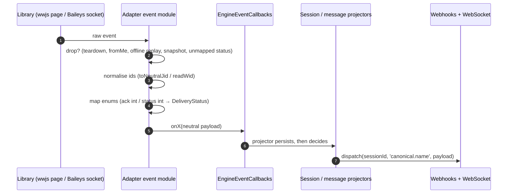
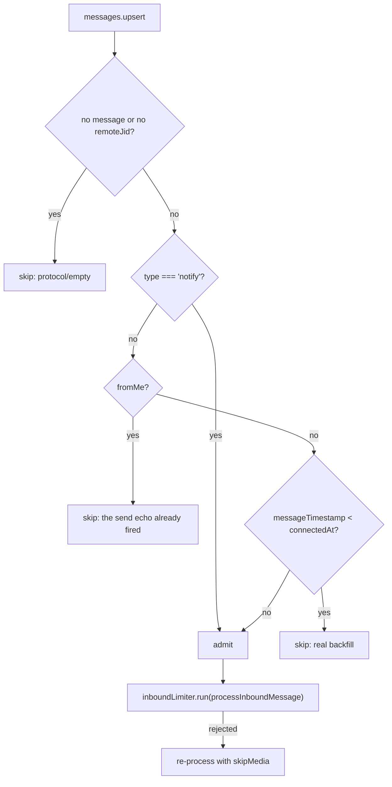

# Engine Events — Raw Library to Canonical

> **Source of truth:** `src/engine/interfaces/whatsapp-engine.interface.ts`, `src/engine/adapters/wwebjs-message-events.ts`, `src/engine/adapters/wwebjs-group-events.ts`, `src/engine/adapters/baileys-events.ts`, `src/engine/adapters/wwebjs-calls.ts`, `src/engine/adapters/wwebjs-lifecycle.ts`, `src/engine/adapters/baileys-lifecycle.ts`
> **Band:** Engine layer · **Depends on:** 10-engine-abstraction.md, 13-adapter-wwebjs.md, 14-adapter-baileys.md · **Jarcube class:** ENGINE-COUPLED

## Purpose

Two libraries emit around forty differently-shaped events between them; OpenWA publishes **23**
canonical event names. This document is the complete map between those two sets, and the reason it
needs to be a document rather than a table is that the translation is not one-to-one in either
direction. One library event can produce two canonical events (`messages.upsert` splits on `fromMe`).
Two library events can produce one (`group_join` and `group-participants.update` both become
`group.join`). Some library events produce **none** and exist purely to suppress a lie
(`framenavigated`). And several are dropped deliberately — WhatsApp's call `terminate`, Baileys'
full-metadata `groups.update` snapshots, replayed offline call offers — because publishing them would
state something false rather than merely something noisy.

A naive translation layer forwards everything and lets consumers filter. That fails here for three
specific reasons this file set spends most of its length on: an event that is *ambiguous* upstream
(`terminate`) cannot be made unambiguous downstream; an event that is a *snapshot* rather than a delta
(`groups.update` from `groupFetchAllParticipating`) would fabricate a change on every reconnect; and an
event that is a *replay* of something long dead (`call` with `offline: true`) would, with auto-reject
on, cause the gateway to act on last week's call.

There are three hops. The adapters map raw library payloads onto the 20 `EngineEventCallbacks` members
— that is this document's subject. The session and message bands then map those callbacks onto the 23
canonical names, which is covered by 20-session-lifecycle.md and 27-message-projection.md; the last hop
is included in the tables here so the chain is readable end to end, but the *reasoning* for it lives
there. Payload field-by-field detail is APPENDIX-B-events.md.

## File Inventory

Line counts are as measured at the commit in 00-INDEX.md and drift.

| Path | Lines | Role |
| --- | --- | --- |
| `src/engine/adapters/baileys-events.ts` | 905 | Every Baileys inbound handler: messages, groups, calls, presence, plus the live-call cache |
| `src/engine/adapters/wwebjs-message-events.ts` | 224 | Six whatsapp-web.js message-domain client events |
| `src/engine/adapters/wwebjs-group-events.ts` | 132 | Four group-notification client events plus the on/off and recipient-id decoders |
| `src/engine/adapters/wwebjs-calls.ts` | 115 | The whatsapp-web.js `call` event and its live-call cache |
| `src/engine/interfaces/whatsapp-engine.interface.ts` | 1423 | Declares `EngineEventCallbacks` — 20 optional members, all payload types |

Connection-state events are **not** in the two `wwebjs-*-events.ts` registrars, and that boundary is
deliberate: `qr` / `authenticated` / `ready` / `disconnected` / `auth_failure` drive lifecycle latches
that nothing else may touch, so they stay in `src/engine/adapters/wwebjs-lifecycle.ts`. The Baileys
equivalent is `connection.update`, handled in `src/engine/adapters/baileys-lifecycle.ts`. See
13-adapter-wwebjs.md and 14-adapter-baileys.md.

The downstream hop, for reference: `src/modules/session/session-engine-event-wiring.ts`,
`src/modules/session/session-engine-leaf-events.ts`,
`src/modules/session/session-engine-lifecycle.service.ts`,
`src/modules/session/session-status-broadcaster.ts`,
`src/modules/session/message-projector.service.ts`,
`src/modules/session/message-mutation-projector.ts`.

## Data Model / Contract

`src/engine/interfaces/whatsapp-engine.interface.ts:EngineEventCallbacks` is supplied once, to
`initialize()`. All 20 members are optional, so an adapter never checks for a handler it does not use
and a consumer never supplies one it does not want. Both adapters read the bag **live, per event**,
never capturing it — `initialize()` installs it *after* the delegates are constructed, so a captured
reference would be the empty default forever. That is why every delegate host carries `getCallbacks()`
(wwjs) or a `getOnX()` accessor per callback (Baileys) rather than the bag itself.

| Callback | Payload | wwjs source | Baileys source |
| --- | --- | --- | --- |
| `onQRCode` | `string` (PNG data URL) | `qr` | `connection.update { qr }` |
| `onReady` | `(phone, pushName)` | `ready` | `connection.update { connection: 'open' }` |
| `onMessage` | `IncomingMessage` | `message` | `messages.upsert` (`!fromMe`) |
| `onMessageCreate` | `IncomingMessage` | `message_create` (`fromMe` only) | `messages.upsert` (`fromMe`) + the send echo |
| `onMessageAck` | `(messageId, DeliveryStatus)` | `message_ack` | `messages.update` |
| `onMessageRevoked` | `RevokedMessage` | `message_revoke_everyone` | `messages.upsert` → `protocolMessage` REVOKE |
| `onMessageReaction` | `ReactionEvent` | `message_reaction` | `messages.upsert` → `reactionMessage` |
| `onMessageEdited` | `EditedMessage` | `message_edit` | `messages.upsert` → `protocolMessage` MESSAGE_EDIT |
| `onGroupEvent` | `GroupEvent` (4 kinds) | `group_join` / `group_leave` / `group_update` / `group_membership_request` | `group-participants.update` / `groups.update` / `group.join-request` |
| `onCall` | `IncomingCallEvent` | `call` | `call` (status `offer`) |
| `onCallOutcome` | `CallOutcomeEvent` | — | `call` (status `accept`/`reject`/`timeout`) + `rejectCall` |
| `onPresenceUpdate` | `PresenceUpdateEvent` | — | `presence.update` |
| `onHistoryMessages` | `IncomingMessage[]` | — | `messaging-history.set` |
| `onDisconnected` | `string` | `disconnected` + Puppeteer death | `connection.update` close (transient/401) |
| `onStateChanged` | `EngineStatus` | `setStatus` funnel | `setStatus` funnel |
| `onActionRequired` | `string` | onboarding-modal fallback | — |
| `onAccountRestriction` | `AccountRestriction \| null` | `disconnected` `WAState` | `connection.update { reachoutTimeLock }` |
| `onError` | `string` | `auth_failure`, init failure, bridge-dead, spent recovery budget | `connection.update` close 440/403, failed cleanup |
| `onCredentialTeardownStarted` | `Promise<void>` | `disconnected('LOGOUT')` | `handleRemoteLoggedOut` |
| `claimStuckAuthRecovery` | `() => boolean` | consumed by stuck-auth | — |

Four rows have no wwjs source and one has no Baileys source. Those are capability gaps, not wiring
gaps, and 12-engine-capability-matrix.md carries the evidence: whatsapp-web.js exposes no presence
event, no call-outcome signal, and no bulk history callback; Baileys has no onboarding modal to fail to
dismiss and no session-owned stuck-auth budget because it has no page to get wedged.

## Flow

Every adapter handler is wrapped so a malformed payload is **logged and dropped, never thrown back
into the emitter**. Both event modules state that rule explicitly, and it matters: an exception
escaping a `client.on` handler or a `sock.ev` handler would take down the whole event bridge for the
rest of the session, so one bad message would silence every later one.

## The complete translation table

Two library events collapse and several split, so the table is organised by canonical outcome. `—`
means the engine has no source for that row.

### Messages

| Canonical | Callback | whatsapp-web.js | Baileys |
| --- | --- | --- | --- |
| `message.received` | `onMessage` | `message` | `messages.upsert`, `!fromMe`, non-protocol/non-reaction |
| `message.sent` | `onMessageCreate` | `message_create` filtered to `fromMe` | `messages.upsert` with `fromMe`, plus `emitOwnSendEcho` on the send path |
| `message.ack` | `onMessageAck` | `message_ack` → `wwebjsAckToDeliveryStatus` | `messages.update` → `mapBaileysStatus` |
| `message.failed` | `onMessageAck` with `failed` | `ack < 0` | `status === 0` (ERROR) |
| `message.revoked` | `onMessageRevoked` | `message_revoke_everyone` | `protocolMessage` type REVOKE |
| `message.reaction` | `onMessageReaction` | `message_reaction` | `reactionMessage` content type |
| `message.edited` | `onMessageEdited` | `message_edit` | `protocolMessage` type MESSAGE_EDIT |
| `status.received` | `onMessage` with `isStatusBroadcast` | `message` on `status@broadcast` | `messages.upsert` on `status@broadcast` |

`status.received` is not a separate engine event on either side. Both adapters set
`IncomingMessage.isStatusBroadcast` so engine-neutral code never has to match the literal
`status@broadcast`, and `src/modules/session/message-projector.service.ts` routes on that flag
(36-status-stories.md).

### Groups

| Canonical | wwjs event | Baileys event | Note |
| --- | --- | --- | --- |
| `group.join` | `group_join` | `group-participants.update` with `action: 'add'` | |
| `group.leave` | `group_leave` | `group-participants.update` with `action: 'remove'` | |
| `group.update` | `group_update` | `groups.update` (deltas only) | |
| `group.join_request` | `group_membership_request` | `group.join-request` with `action: 'created'` | The library event name uses a hyphen; the canonical name an underscore |

All four are one callback, `onGroupEvent`, discriminated by `GroupEvent.kind`. The session band fans
that back out into four names in `src/modules/session/session-engine-leaf-events.ts`.

### Calls, presence, session

| Canonical | Callback | whatsapp-web.js | Baileys |
| --- | --- | --- | --- |
| `call.received` | `onCall` | `call`, `!fromMe`, first sighting of the id | `call` status `offer`, not `offline`, not self, first sighting |
| `call.accepted` | `onCallOutcome` | — | `call` status `accept` |
| `call.rejected` | `onCallOutcome` | — | `call` status `reject`, **and** a successful local `rejectCall` |
| `call.missed` | `onCallOutcome` | — | `call` status `timeout` |
| `presence.update` | `onPresenceUpdate` | — | `presence.update` |
| `session.qr` | `onQRCode` | `qr` | `connection.update { qr }` |
| `session.authenticated` | `onReady` | `ready` | `connection.update { connection: 'open' }` |
| `session.disconnected` | `onDisconnected` | `disconnected`, Puppeteer death, transport-error death | close 401, transient close |
| `session.restriction` | `onAccountRestriction` | `disconnected` `WAState` | `connection.update { reachoutTimeLock }` |
| `session.status` | `onStateChanged` | every `setStatus` | every `setStatus` |
| `session.reconnect_loop` | *none* | — | — |

`session.reconnect_loop` is the one canonical event with **no engine source at all**: it is raised by
`src/modules/session/session-engine-lifecycle.service.ts` from its own reconnect bookkeeping
(22-session-reconnect-and-liveness.md).

### Canonical name count

The authoritative list is `src/modules/webhook/dto/webhook.dto.ts:WEBHOOK_EVENTS` — **23** names.
`src/modules/events/dto/ws-messages.dto.ts:SUBSCRIBABLE_EVENTS` carries **21** of them; `message.failed`
and `session.reconnect_loop` are webhook-only. `WEBHOOK_RESERVED_EVENTS` — the named export for
subscription targets declared without an emit source — is currently **empty**, and its comment records
that its former occupants (`group.join`/`leave`/`update`) are now dispatched by both engines. It is
kept as an export so the catalog/emitter drift guard can whitelist a future undeployed event without
changing its imports.

The shell heuristic often used to enumerate these —
`grep -rhoE "'(session|message|group|call|contact|chat|presence|label|channel|status|poll)\.[a-z.-]+'" src --include='*.ts' | sort -u` —
returns 28 lines, and that figure is quoted in 00-INDEX.md. It is not 28 events. Six of the 28 are not
canonical event names:

| Line | What it actually is |
| --- | --- |
| `'chat.acme.com'` | A hostname fixture in `src/core/plugins/plugin-net.spec.ts` |
| `'message.entity.ts'` / `'session.entity.ts'` | Filename assertions in `src/database/data-source.spec.ts` |
| `'session.id'` | A QueryBuilder select alias in `src/modules/session/session-ownership.service.ts` |
| `'session.connected'` | Appears only in `src/modules/events/events.gateway.spec.ts`, as an event that must be **rejected** |
| `'session.ready'` | Appears only in `src/modules/webhook/webhook-delivery.service.spec.ts` |

And `'group.join-request'` in that output is the **Baileys library** event, not a canonical name. The
heuristic also *misses* two real names, because `[a-z.-]` excludes the underscore: `group.join_request`
and `session.reconnect_loop`. Net: 21 real names found, 2 missed, 6 false positives — 23. Reading the
two exported arrays is the reliable method, and both are already gated by drift specs
(`src/modules/events/events.gateway.spec.ts` asserts every subscribable event has a matching
`emit*` producer).

## Message events in detail

### whatsapp-web.js `message`

`src/engine/adapters/wwebjs-message-events.ts:registerWwebjsMessageEvents` builds the base with
`src/engine/adapters/message-mapper.ts:buildIncomingMessageBase` (17-message-mapping.md) and then
layers four async enrichments, each in its own try/catch so one failure does not lose the message:

| Enrichment | Source | Guard |
| --- | --- | --- |
| Sender contact | `msg.getContact()` → `src/engine/adapters/message-mapper.ts:mapContactFields` | Only **synchronous** fields. The async getters (profile pic, about, formatted number) would hit WhatsApp on every message |
| Location | `msg.location` for `MessageTypes.LOCATION` | |
| Media | `host.capInboundMediaFor(msg)` | 13-adapter-wwebjs.md |
| Quoted message | `msg.getQuotedMessage()` | |

The contact merge is `{ ...incomingMessage.contact, ...mapContactFields(contact, full) }` — merged over
the base rather than assigned, so the `notifyName` push name the base already carries is not lost — and
an empty result is skipped so no empty `contact` object is emitted. `WEBHOOK_CONTACT_DETAILS=true` opts
into the full field set.

Call-log detail is attached on the live path too via
`src/engine/adapters/wwebjs-messaging.ts:extractWwebjsCall`, so a missed or video incoming call renders
a labelled bubble instead of a generic "Call". That function reads `_data.isVideoCall` and
`_data.callDuration` off the raw payload because the public wrapper exposes neither, and its `missed`
rule is `!fromMe && !callDuration`: an incoming call with no recorded duration was never answered, and
an outgoing call is never "missed".

### whatsapp-web.js `message_create`

Filtered to `fromMe`, and the filter is the whole point: `message_create` fires for every message the
account creates — **including ones composed on a linked phone**, which `message` never delivers — while
incoming messages are already handled above. So this is the single source for `message.sent`, covering
API sends and phone-composed self-messages alike.

It downloads media through the same capped path, and the comment names the consequence of not doing so:
the base builder is synchronous and carries none, so a phone-sent image would persist and render as a
bare paperclip marker even though the media is downloadable right there. This is the one place the two
adapters deliberately diverge — the Baileys echo passes `skipMediaDownload`, because its own-send echo
comes from the send path where the caller already holds the bytes.

### The `$1` rename, event by event

WhatsApp Web 2.3000.x renamed `id._serialized` to the minifier-mangled `id.$1`. The install-time
backport (18-upstream-patching.md) covers structure constructors and `msg.id`, but **three event
payloads assign keys straight through**, outside that normalisation, so each reads `$1` explicitly.
The failure each one prevents is different, and that is why they are worth listing separately:

| Site | Field | What an unreadable id would do |
| --- | --- | --- |
| `message_ack` | `msg.id` | Reaches the ack UPDATE as `undefined`, which TypeORM sends as `waMessageId = NULL` — matching nothing, since `x = NULL` is never true. The ack silently advances no row **and burns its one-shot retry**, so the message stays at SENT with only a misleading log. Including the `ack < 0` that is the only signal a send failed |
| `message_revoke_everyone` | `before.id` → `revokedId` | `Client.js` overwrites the normalized id with a raw spread of `protocolMessageKey`, which neither the structure constructor nor the injected serializer normalizes — so this is the one place a **patched** build still hands over a raw MsgKey. Losing it strands the revocation: the UPDATE falls back to the notification's own id, matches no row, and the deleted body stays put |
| `message_reaction` | `reaction.msgId` | `Reaction` assigns `this.msgId = data.parentMsgKey` straight through. Falls back to `''` rather than `undefined`, because TypeORM **drops** an undefined condition from a where-clause — which would match an arbitrary row and emit another message's reactions. Empty string finds nothing and returns cleanly |

The two sentinels differ on purpose. `message_ack` **drops** the event, because an ack with no id is
unusable. `message_reaction` emits with `''`, because the empty string is a safe non-match while
`undefined` is actively dangerous. `src/engine/adapters/wwebjs-group-events.ts:wwebjsGroupRecipientIds`
does the same for `recipientIds`, which are also assigned straight through from the wire and can
therefore arrive as raw id objects rather than strings; entries resolving to nothing are dropped rather
than forwarded as the string `"undefined"`.

### whatsapp-web.js `message_edit`

whatsapp-web.js keeps `message.timestamp` at the **original** creation time, so the adapter stamps the
edit at receipt (`Math.floor(Date.now() / 1000)`) — consumers need occurrence time to order multiple
edits. The otherwise-normal fields are projected through `buildIncomingMessageBase` and then
`src/engine/adapters/message-mapper.ts:buildEditedMessage`, which is **shared** with the Baileys
adapter specifically so the two cannot drift on identity, direction, group, type or filter fields
(17-message-mapping.md).

### Baileys `messages.upsert`

`src/engine/adapters/baileys-events.ts:handleMessagesUpsert` is the busiest handler in the tree, and
its admission logic is where the subtlety sits.

**The `append` gate is on the timestamp, not the batch tag**, and the comment records the incident that
forced it. `type: 'append'` usually means real history-sync backfill, but Baileys can also tag a
genuinely new **customer** message `append` when it arrives in the same window as a reconnect's
state-sync handshake — a strict `type !== 'notify'` filter silently drops that message, observed as
"the first message after a reconnect gets ignored". A message sent after this connection opened is live
regardless of the tag; true backfill always predates it.

`connectedAt` therefore carries a deliberate 10-second backward buffer, set in
`src/engine/adapters/baileys-lifecycle.ts`: `messageTimestamp` is WhatsApp's clock and `Date.now()` is
ours, so without the buffer a message sent right at reconnect time could land a couple of seconds
"before" `connectedAt` and be misjudged as history.

`fromMe` on the non-notify path is excluded **unconditionally, regardless of timestamp**, because the
send path already emitted `onMessageCreate` for it and a second fire would duplicate `message.sent`.

`src/engine/adapters/baileys-events.ts:processInboundMessage` then routes on the **normalised** content
type. Normalisation happens once, at the top: a live disappearing message (also view-once,
document-with-caption, edited) arrives wrapped, so a raw `getContentType` returns the outer wrapper key
and every downstream type/body/media/location check would miss the real content.
`normalizeMessageContent` leaves `protocolMessage` and `reactionMessage` untouched, which is what keeps
the two early-return branches below matching.

| Content type | Outcome |
| --- | --- |
| `protocolMessage` REVOKE | `onMessageRevoked`, return — **never** `onMessage` |
| `protocolMessage` MESSAGE_EDIT | `onMessageEdited`, return |
| `protocolMessage` other (ephemeral, history sync) | Silently skipped |
| `reactionMessage` | `onMessageReaction`, return |
| anything else | `onMessageCreate` (`fromMe`) or `onMessage`, then persist to the store and seed the chat preview |

The REVOKE branch is where the two engines' `RevokedMessage.id` semantics diverge, and the payload says
so: the protocolMessage's key already points at the **original** deleted message, so `id` already *is*
the original, and `revokedId` is mirrored from it so that field is the reliable cross-engine handle. On
whatsapp-web.js `id` is the revocation *notification* and `revokedId` may be `undefined` when the
original is not in the local store. **Match on `revokedId`, fall back to `id`** — getting this wrong
silently corrupts storage (10-engine-abstraction.md).

The MESSAGE_EDIT branch normalises the **inner** `editedMessage` separately, so captions, type, PTT,
media presence and mentions all describe the edited value rather than the outer protocol envelope. Its
timestamp comes from `src/engine/adapters/baileys-events.ts:toEditUnixSeconds`, which exists because
protocol-message edit timestamps are **milliseconds** while the enclosing message timestamp is
**seconds**.

`src/engine/adapters/baileys-events.ts:handleMessagesUpdate` maps `update.status` through
`src/engine/adapters/baileys-message-mapper.ts:mapBaileysStatus` and emits only when both a status and
an id are present — an unknown status yields `null` and the ack is skipped rather than published as a
guess.

### Ack ladders, side by side

Both integers collapse PLAYED into `read`, so no consumer ever sees an engine-specific code.

| Neutral | whatsapp-web.js `MessageAck` | Baileys `WebMessageInfo.Status` |
| --- | --- | --- |
| `failed` | `-1` ERROR | `0` ERROR |
| `pending` | `0` PENDING | `1` PENDING |
| `sent` | `1` SERVER | `2` SERVER_ACK |
| `delivered` | `2` DEVICE | `3` DELIVERY_ACK |
| `read` | `3` READ, `4` PLAYED | `4` READ, `5` PLAYED |
| *(no ack)* | — | anything else → `null` |

Note the off-by-one: the same neutral status sits at a different integer on each engine, and the
`failed` sentinel is negative on one and zero on the other. That is precisely why
`src/engine/adapters/wwebjs-messaging.ts:wwebjsAckToDeliveryStatus` and `mapBaileysStatus` exist as
separate pure functions rather than one shared table. 32-message-status-acks.md covers the consuming
ladder.

## Group events in detail

### whatsapp-web.js

Four `client.on` registrations, all funnelling into one private handler. Three decoders carry the
interesting behaviour.

`src/engine/adapters/wwebjs-group-events.ts:wwebjsGroupUpdateChanges` reduces a `group_update`
notification to the neutral `changes` delta:

| Notification type | Neutral field | Source |
| --- | --- | --- |
| `subject` | `subject` | `body` verbatim |
| `description` | `description` | `body` verbatim |
| `announce` | `announce` | `body` parsed as on/off |
| `restrict` **or** `locked` | `locked` | `body` parsed as on/off |
| anything else (e.g. `picture`) | *(empty delta)* | |

The subtype is compared **as a string**, not against the `GroupNotificationTypes` enum, because the
runtime `gp2` subtypes can exceed it — the `locked` case is a rename of `restrict` that the enum does
not carry. `src/engine/adapters/wwebjs-group-events.ts:parseWwebjsOnOff` accepts `on`/`true` and
`off`/`false` and returns `undefined` for anything else, in which case the update is emitted **without
that change** rather than with a guess. An uninterpretable update is still emitted with empty changes,
never dropped: the occurrence happened, and only the delta is unknown.

`join_request` has a special case worth noting. A **self-request** carries no recipients — the author
*is* the user asking to join — so `participantIds` is backfilled from `actorId`. A request naming
nobody at all is unactionable and dropped.

Timestamps come from the notification itself, which unlike `message_edit` *is* the occurrence time, with
receipt time as the fallback when absent or non-positive.

### Baileys

Three separate socket events, three handlers, and one of them has to distinguish a delta from a
snapshot.

`src/engine/adapters/baileys-events.ts:handleGroupParticipantsUpdate` maps only `add` → `join` and
`remove` → `leave`. `promote`, `demote` and `modify` (a phone-number-change rewrite) change no
membership and are skipped. The event carries no timestamp, so it is stamped at receipt.

Participant coercion is `src/engine/adapters/baileys-events.ts:toNeutralGroupParticipantId`, and it
handles two wire shapes because Baileys v7 changed them: entries used to be plain JID strings and are
now parsed objects `{ id, phoneNumber?, lid?, ... }`. The preference order is
`phoneNumber` → `id` → `lid`, and the reason it is not just "normalise `id`" is stated: a lid `id` with
a *known* phone resolves to the same neutral `@c.us` via the mapping, but the inline `phoneNumber`
needs no lookup at all. The same "prefer the phone-dialect twin" rule applies to actors (`authorPn`
over `author`), join-request participants (`participantPn` over `participant`) and callers
(`callerPn` over `from`) — so a neutral id never depends on whether the `lid → pn` mapping happens to
have been learned yet (16-identity-and-lid.md).

`src/engine/adapters/baileys-events.ts:handleGroupsUpdate` carries the snapshot filter, and it is the
clearest example in this band of an event that must be *dropped* rather than forwarded. The same
`groups.update` event carries two completely different things:

- **Real deltas** from `Utils/process-message.js`'s `emitGroupUpdate`, shaped
  `{ id, ...oneChangedField, author? }`.
- **Full metadata snapshots**, because `groupFetchAllParticipating()` emits its entire result set
  through this event — and the adapter calls that on every connect (`hydrateNames`) and on every REST
  `getGroups()`.

Without the filter, every reconnect and every `GET /groups` would flood consumers with bogus
`group.update` webhooks whose `changes` were fabricated from a snapshot. Snapshots are recognised by
their full-metadata markers — `participants`, `creation`, `subjectTime`, `owner` — using `in` checks,
because presence is the signal and the values are unused.

Field mapping is `subject` → `subject`, `desc` → `description`, `announce` → `announce`,
`restrict` → `locked`, each type-checked. Entries about fields the neutral shape does not model
(`inviteCode`, `memberAddMode`, `joinApprovalMode`) still emit with **empty changes** — explicit parity
with the wwjs adapter, which emits uninterpretable updates the same way rather than dropping them.

`src/engine/adapters/baileys-events.ts:handleGroupJoinRequest` accepts only `action: 'created'`,
because the wwjs event has no revoke/reject counterpart and only the shared signal is surfaced. Its
docblock carries an honest upstream scope caveat: Baileys rc13 emits this event **only** from the
NON_ADMIN_ADD stub; the direct self-request stub is unhandled with an upstream TODO, so an invite-link
self-request may produce no event on this engine at all. The REST list endpoint still sees it
(38-groups.md).

## Call events in detail

Neither library gives a clean call lifecycle, and the two adapters end up at very different depths.

### whatsapp-web.js

`src/engine/adapters/wwebjs-calls.ts:WwebjsCalls` handles the single `call` event. Three filters, in
order: teardown (a call landing during or after teardown is dropped, mirroring the `qr`/`authenticated`
guards); a malformed call missing `id` or `from` (never cached, never emitted); and `fromMe` (outgoing,
not incoming).

Then a deduplication that exists because of *how* the library fires: whatsapp-web.js fires this handler
from a patched `internalCallMap.set()`, which runs on **every write** to that map — including updates
to a call already ringing. So the same call id can arrive more than once.
`src/engine/adapters/wwebjs-calls.ts:cacheLiveCall` caches first and returns whether the id was new;
only a new id emits, otherwise one call surfaces as several `call.received` events.

The cache exists at all because the wwebjs `Call` object is only usable **while the call is live**, so
`rejectCall` must act on a handle captured at event time. TTL is
`src/engine/adapters/wwebjs-calls.ts:LIVE_CALL_TTL_MS` = 2 minutes: calls ring for roughly a minute, so
that covers the window with margin without pinning dead calls for long. Lifecycle teardown clears the
map so a late `rejectCall` reports not-found on a dead client.

There is **no** `onCallOutcome` on this engine.

### Baileys

`src/engine/adapters/baileys-events.ts:handleCallEvents` sees the whole lifecycle and routes it:

| `call.status` | Handling |
| --- | --- |
| `offer` | Candidate `call.received` (four more filters below) |
| `accept` / `reject` / `timeout` | `src/engine/adapters/baileys-events.ts:reportCallOutcome` → `accepted` / `rejected` / `missed` |
| `terminate` | **Evict the cache entry, publish nothing** |
| `ringing`, `preaccept`, `transport`, `relaylatency` | Transport chatter, ignored, entry stays rejectable |

`src/engine/adapters/baileys-events.ts:CALL_OUTCOMES` is the three-entry map, and the docblock states
the structural rule that makes it safe: an ended call takes its own path and **returns**, so it can
never fall through to the offer handling — a declined call arriving there would be published as a fresh
incoming call and, with auto-reject enabled, answered as one.

`terminate` is the deliberate non-mapping. WhatsApp uses it both for a caller hanging up **before**
answer and for either side ending an **answered** call, and the event carries nothing that separates
them, so publishing it as an outcome would be wrong roughly half the time. But it does end the call, so
the handle is dropped — a `rejectCall` arriving afterwards must report not-found rather than act on a
dead call. Telling the two apart would need call-duration tracking, which is its own piece of work
(40-calls.md).

Four filters guard the `offer` path:

1. **`call.offline`** — Baileys replays offers for calls missed while disconnected. Those calls are long
   dead; emitting `call.received` (and, with `autoRejectCalls`, rejecting a stale call) would be wrong.
   The same hazard is filtered on the outcome path, or last week's declined call would be announced as
   if it just happened.
2. **Self-calls.** `WACallEvent` has no `fromMe` flag, so the adapter compares neutralised `from` and
   `chatId` against its own id. Null-safe: with no socket user there is no own id, so nothing is
   skipped.
3. **Duplicate ids.** Baileys maps both the `offer` and `offer_notice` wire tags onto status `offer`
   with the same call id, so a single call can reach the loop twice.
   `src/engine/adapters/baileys-events.ts:cacheLiveCall` caches first and emits only for a new id. A
   repeat offer still **refreshes** the entry, so a long-ringing call stays rejectable for a full TTL
   from the most recent signal.
4. **An outcome for a call this session never saw ring** is dropped, because it is not actionable — it
   belongs to another device's conversation, or predates the connection — and would arrive with no
   caller identity beyond the raw jid.

The Baileys cache stores more than the wwjs one: `{ callFrom, expiresAt, from, isVideo, isGroup }`. The
raw `callFrom` is what `sock.rejectCall()` needs verbatim; the **published** identity is cached
alongside it so a rejection issued through the API can report the same shape the engine-observed
outcomes do, because the call event is long gone by then. Expiry is lazy — inserting a call drops
already-expired entries — so a session that receives calls but never rejects them cannot grow the map
without bound, and there is no per-entry timer to clean up.

`src/engine/adapters/baileys-events.ts:rejectCall` closes a real gap: a rejection made *here* produces
no inbound `reject` signal to observe, so without an explicit emit the one outcome the caller
definitely knows about — the one they asked for — would be the only one never published. It is emitted
**after** the socket accepted the rejection, and the entry is already evicted, so a server echo
arriving later cannot publish a second time. The entry is evicted on **any** attempt, since a
rejected or ended call will not become rejectable again, and an unknown or expired id maps to
`src/common/errors/call-not-found.error.ts` (404).

## Presence

Only Baileys has this. `src/engine/adapters/baileys-events.ts:handlePresenceUpdate` maps
`presence.update` onto `PresenceUpdateEvent`, and four decisions in it are worth naming:

- **The per-participant map is preserved, not flattened**, even for a 1:1 chat where it holds exactly
  one entry, so consumers need one shape.
- **`src/engine/adapters/baileys-events.ts:PRESENCE_STATES` is checked, not trusted.** The value
  crosses a library boundary and lands straight in a public webhook payload, so an unknown state added
  upstream is **dropped** rather than published as if this gateway understood it. An entry with no
  state says nothing, and forwarding it as a guessed `unavailable` would report a contact offline on
  the strength of a malformed payload.
- **An empty participant list emits nothing.**
- **`lastSeen` absent is the common case, not an error.** WhatsApp withholds it whenever the contact's
  privacy settings do, which is the default for most accounts, and it is never substituted with a
  guess. It is also validated with `Number.isFinite`.

`groupOnlineCount` is picked from whichever participant entry carries it. There is no read side —
presence cannot be queried, only received — which is why the gateway serves the last reported state
(25-presence-and-chat-state.md).

## Events that produce nothing

Worth an explicit list, because "no event fired" is a design decision here rather than an omission:

| Signal | Why nothing is published |
| --- | --- |
| Puppeteer `framenavigated` | The page is healing, not dead. Stamps the re-inject window instead (13-adapter-wwebjs.md) |
| Call `terminate` | Ambiguous upstream — hang-up-before-answer and end-of-answered-call are indistinguishable |
| Call `ringing` / `preaccept` / `transport` / `relaylatency` | Transport chatter with no user-visible meaning |
| `call` with `offline: true` | A replay of a call that ended while disconnected |
| `groups.update` full snapshots | A snapshot is not a change; forwarding it fabricates one per reconnect and per `GET /groups` |
| `group-participants.update` `promote`/`demote`/`modify` | No membership change; the neutral `GroupEvent` has no kind for them |
| `group.join-request` with `action !== 'created'` | No wwjs counterpart, so only the shared signal is surfaced |
| `protocolMessage` other than REVOKE/MESSAGE_EDIT | Ephemeral settings, history-sync notifications |
| `senderKeyDistributionMessage` | Carries nothing for a chat view (filtered in the history mapper) |
| A late `qr` / `authenticated` after teardown or a reported disconnect | Would resurrect a finished adapter and publish a QR that links a phantom device |
| A duplicate native `disconnected` | Would schedule a second reconnect |
| `messages.upsert` non-notify with `fromMe` | The send echo already fired |
| An ack whose message id cannot be read | Would null the UPDATE's where-clause and burn the one-shot retry |
| An unknown presence state | Would publish a state this gateway does not understand |

## Call Chain

- `src/engine/adapters/whatsapp-web-js.adapter.ts:attachDomainEvents` →
  `src/engine/adapters/wwebjs-message-events.ts:registerWwebjsMessageEvents` +
  `src/engine/adapters/wwebjs-group-events.ts:registerWwebjsGroupEvents` +
  `src/engine/adapters/wwebjs-calls.ts:WwebjsCalls` — pure mapping, no lifecycle latches.
- `src/engine/adapters/wwebjs-lifecycle.ts:setupEventHandlers` → the five connection-state events, which
  own the latches (`tearingDown`, `disconnectReported`, `logoutInitiated`).
- `src/engine/adapters/baileys-lifecycle.ts:connectInner` → 16 `sock.ev.on` registrations, of which 11
  forward into `src/engine/adapters/baileys-events.ts:BaileysEvents` and 5 into the store or history
  delegate.
- Adapter → `EngineEventCallbacks.onX(neutral)` → `src/modules/session/session-engine-event-wiring.ts`
  (QR, calls, presence, restriction), `src/modules/session/session-engine-leaf-events.ts` (groups),
  `src/modules/session/session-status-broadcaster.ts` (status),
  `src/modules/session/session-engine-lifecycle.service.ts` (ready, disconnected, reconnect loop),
  `src/modules/session/message-projector.service.ts` (received/sent/ack/failed/revoked/status),
  `src/modules/session/message-mutation-projector.ts` (reaction, edited).
- Projector → `src/modules/webhook/webhook.service.ts` `dispatch(sessionId, name, payload)` and
  `src/modules/events/events.gateway.ts` `emitToRooms(...)` → 53-webhooks.md, 54-websocket-events.md.

The projectors are where **persist-then-publish** ordering, filtering and idempotency live
(27-message-projection.md). `onHistoryMessages` is the one callback whose contract is
persist-and-**not**-publish.

## Configuration

| Env var | Default | Effect on event translation |
| --- | --- | --- |
| `WEBHOOK_CONTACT_DETAILS` | `false` | Whether inbound `message` payloads carry the full `MessageContact` field set or just `{ name, pushName }` |
| `RESOLVE_LID_TO_PHONE` | `false` | Whether `IncomingMessage.senderPhone` is resolved inline (16-identity-and-lid.md) |
| `MEDIA_DOWNLOAD_ENABLED` / `MEDIA_DOWNLOAD_MAX_BYTES` / `MEDIA_DOWNLOAD_TIMEOUT_MS` / `INBOUND_MEDIA_CONCURRENCY` | see 17-message-mapping.md | Whether an inbound event carries media or the `omitted` marker |
| `STORE_EPHEMERAL_MESSAGES` | see 27-message-projection.md | Whether disappearing messages survive the projector |
| `BAILEYS_SYNC_FULL_HISTORY` | `false` | How much arrives through `onHistoryMessages` |
| `BAILEYS_LOG_LEVEL` | `silent` | `trace` prints the raw decoded WA wire frames — the only way to see what a handler was given |

Full list: APPENDIX-A-env-vars.md.

## Events Emitted / Consumed

Consumed: 11 whatsapp-web.js client events plus 4 Puppeteer handle events; 16 Baileys socket events.
Emitted: 20 `EngineEventCallbacks` members, which the session and message bands turn into 23 canonical
names. Full payload shapes, delivery channels and filterability: APPENDIX-B-events.md.

## Failure Modes & Edge Cases

| Scenario | Behaviour |
| --- | --- |
| A handler throws | Logged and dropped. Never rethrown into the emitter, which would kill the bridge for the rest of the session |
| Contact lookup fails on an inbound message | Logged; the message is still emitted without the contact enrichment |
| Media download fails on an inbound message | Logged; emitted with the `omitted` marker (wwjs) or re-processed with `skipMedia` (Baileys) |
| Quoted-message lookup fails | Logged; emitted without `quotedMessage` |
| An id cannot be read after the `$1` rename | Per-site: `message_ack` drops, `message_reaction` emits `''`, `revokedId` falls back to `id`, `recipientIds` drops the entry |
| A group update carries an uninterpretable subtype or body | Emitted with an empty `changes` delta |
| `groups.update` carries a full snapshot | Skipped entirely |
| A live message tagged `append` right after a reconnect | Emitted — the timestamp gate, not the tag, decides |
| A message whose timestamp precedes `connectedAt` by <10 s | Still treated as live, by the clock-skew buffer |
| The same call id arrives twice | One `call.received`; the repeat refreshes the TTL |
| A call outcome for a call never seen ringing | Dropped |
| A rejection issued through the API | `call.rejected` emitted locally after the socket accepts it, exactly once |
| An unknown presence state | Dropped |
| Presence with an empty participant map | No event |
| A late `qr` whose render outraces a teardown | Post-await fence re-proves the source client before publishing |
| A duplicate native `disconnected` | No-ops before log, status and callback |
| A restriction that lifts | `onAccountRestriction(null)` — a positive lift, not "unknown" |
| A malformed `time_enforcement_ends` | `expiresAt` omitted rather than serialised as `NaN` → `null` |
| Bulk history arrives | `onHistoryMessages` — persist, do **not** dispatch |
| A Baileys `group.join-request` from an invite-link self-request | May produce **no** event: upstream emits only from the NON_ADMIN_ADD path |

Specs: `src/engine/adapters/baileys-events.spec.ts`,
`src/engine/adapters/baileys-inbound-burst.spec.ts`,
`src/engine/adapters/wwebjs-inbound-burst.spec.ts`,
`src/engine/adapters/create-call-link.spec.ts`,
`src/engine/adapters/channel-admin-demote.spec.ts`,
`src/engine/adapters/membership-requests.spec.ts`,
`src/engine/adapters/own-presence.spec.ts`,
`src/modules/events/events.gateway.spec.ts` (the subscribable-event ⇔ producer drift guard). The
event-mark column of OpenWA's own `docs/29-engine-capability-matrix.md` is gated by
`src/engine/engine-inventory-parity.spec.ts`, which scrapes `.on('event')` across the adapter corpus —
12-engine-capability-matrix.md. Also 96-testing-strategy.md.

## Jarcube Portability

**Classification:** ENGINE-COUPLED

**Rationale:** the *left column* of every table here is worthless to Jarcube. Meta's Cloud API delivers
a single POST to one webhook endpoint carrying a `changes[].value` envelope with `messages[]`,
`statuses[]`, `contacts[]` and `errors[]`. There is no `client.on`, no `sock.ev`, no page bridge, no
socket to reconnect, and no `_serialized`/`$1` rename to defend against. Jarcube's inbound path is
already built on that shape (`QuantumMind-backend/src/whatsapp/whatsapp.controller.ts` handles the
`hub.verify_token` handshake and the delivery POST;
`QuantumMind-backend/src/message-handler/message-handler.service.ts` consumes it).

The *right column* is a different matter. `message.received`, `message.sent`, `message.ack` and
`message.failed` all exist in a Cloud API integration, and the mapping questions this document answers
recur almost unchanged: which raw signals are the same event, which are replays, which are ambiguous,
and which must be dropped.

**Prerequisites:** none.

**Cloud API caveats:** Cloud API has its own versions of the two hardest problems here.

- **Redelivery.** Meta retries a webhook that did not 200 within its window, so the *same* status
  update arrives more than once. That is structurally the `offer`/`offer_notice` duplicate and the
  `internalCallMap.set()` re-fire: an idempotency key derived from the payload, checked before
  publishing, is the same fix. OpenWA's own webhook layer already has one
  (`src/modules/webhook/utils/idempotency.util.ts`, 53-webhooks.md).
- **Batching.** One Cloud API POST can carry several `messages` and several `statuses`, exactly as one
  `messages.upsert` carries a batch — so a per-item try/catch, not a per-request one, is what stops one
  bad item from losing the rest.

**Specific recommendations for Jarcube:**

- **Steal the drop list, as a discipline.** The single most valuable thing in this document is the
  *Events that produce nothing* table. For each one there is a named reason publishing would be a
  false statement rather than merely noise. Jarcube has the same category and it is currently
  unexamined: Cloud API `statuses[].status: 'deleted'`, `errors[]` entries attached to an otherwise
  successful message, and `messages[].type: 'system'` (a customer changing their phone number) are all
  signals that mean something other than what a naive forwarder would say about them.
- **Steal "ambiguous upstream stays ambiguous downstream."** `terminate` is not published because the
  event does not carry what would be needed to publish it truthfully. Jarcube's analogue is a Graph API
  error code that maps to several causes; inventing a specific reason downstream is the mistake this
  refuses to make.
- **Steal the snapshot-versus-delta check.** Meta sends full `contacts[]` profile data alongside
  message deliveries, and treating that as a contact-changed event would fire on every message. The
  `in`-marker test in `handleGroupsUpdate` is the pattern: recognise the shape, not the values.
- **Steal the per-item error containment.** Every handler here logs and drops rather than throwing,
  because one exception in an event handler silences the whole bridge. In Jarcube's controller the same
  mistake has a worse consequence: throwing means the endpoint does not 200, so Meta **retries the
  entire batch**, replaying every item that already succeeded.
- **Steal the "one interface, all optional" callback shape** if Jarcube ever grows a second inbound
  transport. All 20 members being optional is what lets a provider implement three of them without
  stubbing seventeen.
- **Steal the two-array-plus-drift-spec pattern for the event catalog.** `WEBHOOK_EVENTS` and
  `SUBSCRIBABLE_EVENTS` are exported constants with a spec asserting every subscribable event has a
  producer, and `WEBHOOK_RESERVED_EVENTS` exists purely so an intentionally-undeployed event can be
  whitelisted without editing imports. Jarcube's event names are currently string literals at their
  emit sites, which is the state this pattern exists to leave behind.
- **Do not port the ack-integer tables.** Cloud API sends `sent`/`delivered`/`read`/`failed` as
  strings, which is already the neutral vocabulary. Keep the enum, drop the translation.
- **Do not port the id-rename defences.** They exist because a minifier renamed a property in a page
  bundle. A versioned REST API cannot do that to you.

Module-by-module verdicts: 98-jarcube-porting-analysis.md.

## Open Questions

- 00-INDEX.md states "28 canonical events", derived from the shell heuristic above. The real figure is
  23 (`WEBHOOK_EVENTS`). Whether the 28 was intended as a rough magnitude or is a genuine error in the
  manifest is not something this document can settle; the recount is in *Canonical name count* above.
- `IncomingMessage.backgroundColor` and `font` are documented in the interface as set "only by engines
  that expose it". Reading both adapters: **only Baileys** populates them, from
  `extendedTextMessage.backgroundArgb` and `.font` via
  `src/engine/adapters/baileys-message-mapper.ts:extractBaileysContext`. The wwjs message events never
  set either. Whether whatsapp-web.js exposes the fields at all and simply is not wired, or genuinely
  cannot, was not determined here — that is an evidence question for
  12-engine-capability-matrix.md.
- `MessageContact.type` is populated only on the wwjs path, from
  `src/engine/adapters/message-mapper.ts:mapContactFields` behind `WEBHOOK_CONTACT_DETAILS`. The
  Baileys inbound path sets `contact` to `{ pushName }` and nothing else, so a consumer reading `type`
  gets a value on one engine and `undefined` on the other. Whether that asymmetry is accepted or
  overlooked is not recorded in either adapter.
- `src/engine/adapters/wwebjs-calls.ts` caches only `{ call, expiresAt }`, while the Baileys cache also
  stores the published identity so `rejectCall` can emit an outcome. Since whatsapp-web.js has no
  `onCallOutcome` at all, an API-issued rejection on that engine publishes nothing. Whether the
  asymmetry is deliberate (no outcome channel exists, so nothing to emit into) or simply not yet done
  is not stated.
- The `groups.update` snapshot filter tests four markers but the docblock lists five
  (`participants`/`creation`/`subjectTime`/`owner`/`size`). `size` is declared on the parameter type and
  named in the comment but is not in the `in` chain. Whether that is deliberate — the other four always
  co-occur — or an oversight cannot be read off the file.
- The Baileys `group.join-request` upstream caveat (only the NON_ADMIN_ADD path emits) is recorded in a
  comment with an upstream file and line. Whether that has been re-verified against the currently
  installed Baileys, or is a note from an older version, is not dated.
