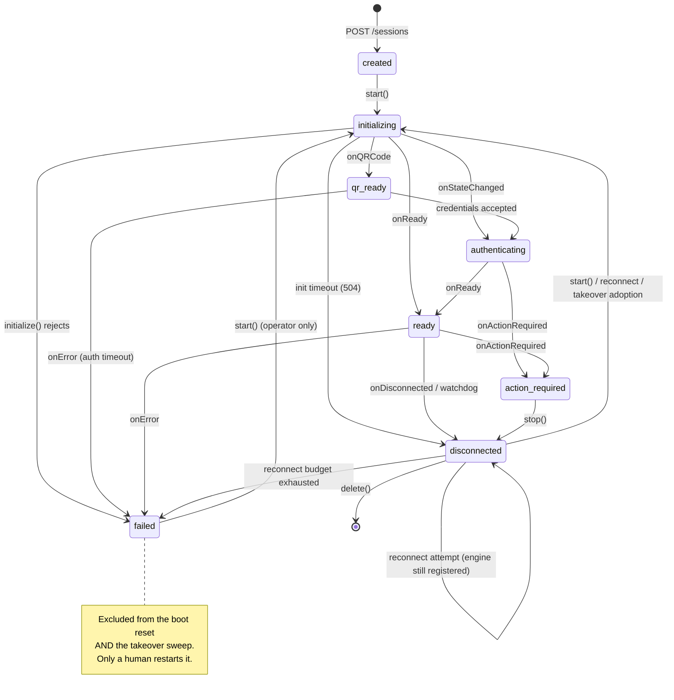
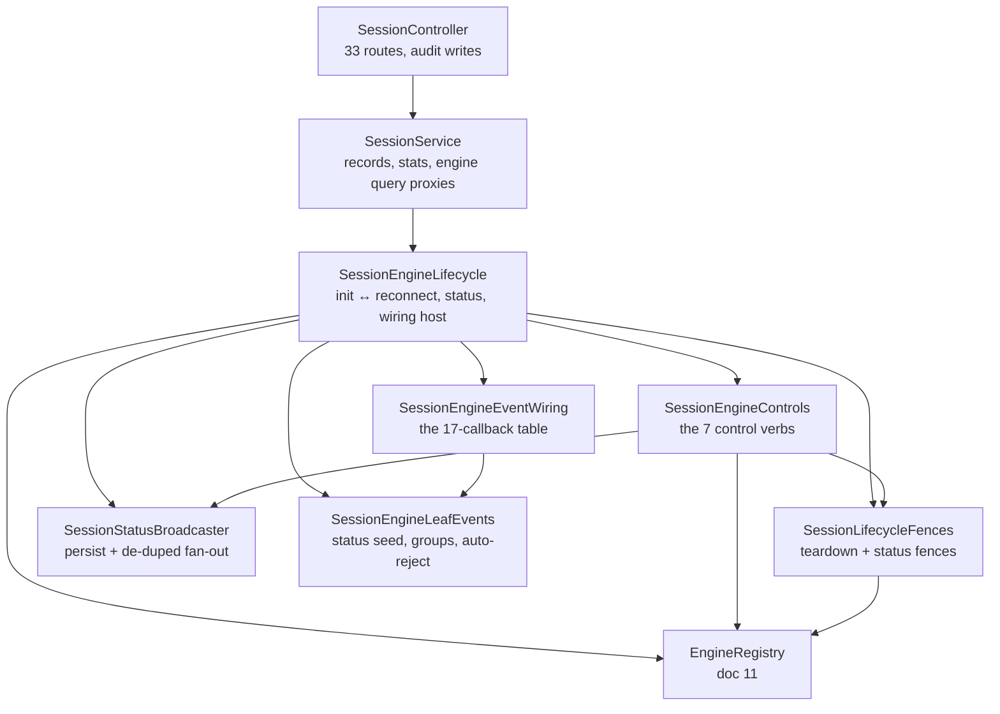
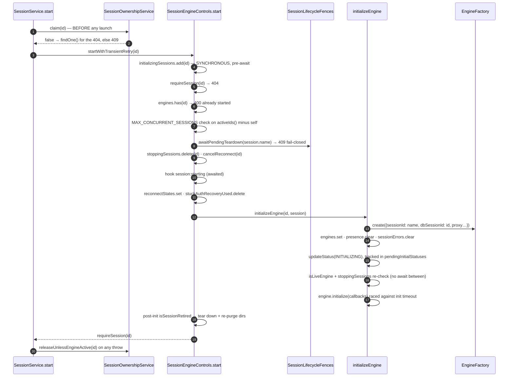

# Session Lifecycle

> **Source of truth:** `src/modules/session/entities/session.entity.ts`, `src/modules/session/session.service.ts`, `src/modules/session/session-engine-lifecycle.service.ts`, `src/modules/session/session-engine-controls.ts`, `src/modules/session/session-engine-event-wiring.ts`, `src/modules/session/session.controller.ts`, `src/modules/session/session.module.ts`
> **Band:** Session domain · **Depends on:** 10-engine-abstraction.md, 11-engine-factory-registry.md · **Jarcube class:** ENGINE-COUPLED

## Purpose

A WhatsApp session is a long-lived, stateful, externally-owned resource that outlives any single HTTP
request and can die without telling anyone. This module is the state machine that keeps a database row,
an in-process engine object, an OS-level browser or socket, and an on-disk credential directory in
agreement about whether that session is up. It is the largest module in OpenWA — 57 files, 17,641 lines
as measured — and roughly a third of that line count is defensive: fences, identity checks, and bounded
waits that exist because a naive implementation gets each of them wrong in a way that either orphans a
Chromium process or opens a second connection to one WhatsApp account.

This doc covers the shape: the status enum, the entity, the service split, the seven control verbs, the
controller surface, and the file map. The concurrency reasoning is deliberately factored out into
21-session-fences-and-races.md, because it is the part worth reading twice.

## The status enum

`src/modules/session/entities/session.entity.ts:SessionStatus` — eight values, persisted as a
`varchar(50)` with a `created` default.

| Value | Meaning | Engine present? |
| --- | --- | --- |
| `created` | Row exists, never started | no |
| `initializing` | Engine object constructed, `initialize()` in flight | yes |
| `qr_ready` | Engine is showing a QR / pairing challenge | yes |
| `authenticating` | Credentials accepted, WhatsApp Web still booting | yes |
| `ready` | Linked and serving | yes |
| `disconnected` | Not connected — stopped, or mid-reconnect-backoff | **maybe** |
| `action_required` | Engine is alive but a human must act | yes |
| `failed` | Terminal. Nothing automatic recovers it | no (evicted) |

Two of those rows are the ones that surprise people.

`disconnected` does not imply "no engine". A session dropped by WhatsApp keeps its engine registered
throughout the reconnect backoff, which can be up to an hour. A session stopped through
`POST /sessions/:sessionId/stop` carries the identical status with no engine. The API answers this
explicitly rather than making callers guess: `engineLoaded` on
`src/modules/session/dto/session-response.dto.ts:SessionResponseDto` is computed per request from the
live registry, and its own doc comment states that `status` alone does not imply it.

`failed` is terminal by design and by exclusion. It is left out of the boot reset's `activeStatuses`
(`session.service.ts:onModuleInit`) **and** out `TAKEOVER_STATUSES`
(`src/modules/takeover/session-takeover.service.ts:TAKEOVER_STATUSES`), so a session pushed into it
leaves every automatic recovery path on every node until an operator restarts it. That is intentional —
an engine error a human should see must not be quietly retried elsewhere — and it is why every write of
`failed` is ownership-fenced. See 21-session-fences-and-races.md and 23-session-ownership-and-takeover.md.



Transition ownership is enumerated upstream in `docs/31-session-lifecycle-design.md` §31.2, and that
table is accurate against the code as read. The one detail worth restating here because it is easy to
misread: **no individual reconnect attempt writes `failed`.** Only exhaustion of the whole chain does
(`session-engine-lifecycle.service.ts:scheduleReconnect`, the `exhausted` branch). A loop that marked
each failed attempt terminal would turn every transient blip into an operator-visible dead session.

## Data Model / Contract

### `sessions` columns

`src/modules/session/entities/session.entity.ts:Session`. Full DDL, indexes and dialect notes live in
70-database-design.md; this is the lifecycle reading of each column.

| Column | Type | Lifecycle role |
| --- | --- | --- |
| `id` | uuid PK | The key everything in-process is keyed by (engines, reconnect state, errors, presence) |
| `name` | varchar(100), UNIQUE | The **on-disk auth-directory key**. Not the UUID. This is why the credential fence is name-scoped |
| `status` | varchar(50) | The enum above |
| `phone` | varchar(20) null | Doubles as the "has ever linked" flag: boot auto-start and the takeover sweep both key on `phone IS NOT NULL` |
| `pushName` | varchar(100) null | Display name from `onReady` |
| `config` | json, default `{}` | Opaque operator blob. Exactly three keys are read; see below |
| `proxyUrl` / `proxyType` | varchar null | Per-session egress, passed to `EngineFactory.create` |
| `connectedAt` / `lastActiveAt` | timestamp null | Written by `onReady` and by the message projector |
| `nodeId` | varchar(190) null | Which process hosts the engine, or NULL |
| `claimedAt` | timestamp null | When the claim was taken |
| `nodeUrl` | varchar(2048) null | Where the owner answers HTTP, for request forwarding |
| `leaseExpiresAt` | timestamp null | When the claim stops being honoured |
| `createdAt` / `updatedAt` | timestamp | TypeORM-managed |

Two fields on the entity are **not columns**, and the comments say why:

| Field | Source | Why transient |
| --- | --- | --- |
| `lastError?: string` | `src/modules/session/session-error-store.service.ts:SessionErrorStore` | Describes *this process's* attempt. A restart that clears it is correct |
| `restriction?: AccountRestriction \| null` | `src/modules/session/session-restriction-store.service.ts:SessionRestrictionStore` | Describes the account, but both engines re-report it within one connect, so it self-seeds |

Both are attached at read time by `session.service.ts:attachRuntimeState`, which chains the two stores'
`attachTo` projections. 22-session-reconnect-and-liveness.md covers both stores.

### The three-key `config` contract

`config` is documented as an opaque blob an operator may put anything into, and it is never echoed back
(it sits alongside the credential-bearing `proxyUrl`). The tunable surface is exactly:

| Key | Range | Read when | Resolver |
| --- | --- | --- | --- |
| `autoRejectCalls` | strict `true` only | every incoming call | `src/modules/session/session-engine-leaf-events.ts:maybeAutoRejectCall` |
| `maxReconnectAttempts` | 0–20, `null` = unlimited | once per `start()` | `session-engine-lifecycle.service.ts:resolveReconnectConfig` |
| `reconnectBaseDelay` | 1000–300000 ms | once per `start()` | same |

`src/modules/session/dto/session-config.dto.ts:UpdateSessionConfigDto` mirrors those bounds as
`class-validator` constraints so a bad value becomes a 400 that names the range instead of a silent
clamp — while `resolveReconnectConfig` remains the authority at use time for rows written before the
endpoint existed. `SessionConfigResponseDto` reports the **resolved** values, not the stored ones, so a
legacy row holding `maxReconnectAttempts: 900` reports `20`.

The asymmetry is documented rather than papered over: `autoRejectCalls` takes effect immediately
because the row is re-read on every call; the reconnect pair lands on the next `start()` because it is
read once into `reconnectStates`. `updateConfig` deliberately does not force a restart nobody asked for.

Note the coercion discipline in `resolveReconnectConfig`. The bounds exist because an operator-supplied
value feeds `setTimeout` and a terminal comparison: a non-numeric `reconnectBaseDelay` makes the delay
`NaN` (fires at 0 — a relaunch storm), and `attempts >= NaN` is always false (an unbounded loop). The
default for `maxAttempts` is `Number.POSITIVE_INFINITY`, not a number — a long-lived session must keep
retrying with the backoff parked at the 1 h cap rather than dying permanently after ~2.5 minutes. An
explicit `0` is preserved and means "reconnect disabled", which is why the exhaustion message
special-cases it instead of saying "failed after 0 attempts".

## The service split

One module, six collaborators, one rule each. The split is unusual and the source explains it: the four
plain classes are **not** Nest providers, because `SessionEngineLifecycle`'s constructor signature is
frozen by its specs, so they are constructed inside that constructor and handed shared state **by
reference**.



| Unit | Nest provider? | Owns |
| --- | --- | --- |
| `session.controller.ts:SessionController` | controller | HTTP surface, OpenAPI contract, audit rows |
| `session.service.ts:SessionService` | yes | CRUD, stats, boot/shutdown hooks, engine query proxies, ownership release policy |
| `session-engine-lifecycle.service.ts:SessionEngineLifecycle` | yes | `initializeEngine`, the reconnect state machine, `handleEngineReady` / `handleEngineDisconnected`, and **sole writer of `EngineRegistry`** |
| `session-engine-controls.ts:SessionEngineControls` | no — plain class | `start` / `stop` / `logout` / `forceKill` / `delete` / `shutdown` / `stopOrphanEngines` |
| `session-lifecycle-fences.ts:SessionLifecycleFences` | no | the four fences — doc 21 |
| `session-status-broadcaster.ts:SessionStatusBroadcaster` | no | `updateStatus`: persist, then de-duped WS + webhook |
| `session-engine-event-wiring.ts:SessionEngineEventWiring` | no | the 17 engine callbacks and their per-callback gating |
| `session-engine-leaf-events.ts:SessionEngineLeafEvents` | no | connect-time status seed, group fan-out, call auto-reject |

### Why `init` and `reconnect` share one file

`initializeEngine`'s `onDisconnected` schedules a reconnect; `executeReconnect` calls
`initializeEngine`. That is mutual recursion, and splitting it would require `forwardRef()`, which this
codebase avoids on principle. So the 1,103-line service keeps both, and everything that *can* be
extracted was.

### Why the delegates are non-`async`

`SessionEngineLifecycle` keeps same-named one-line forwarders onto the extracted units, and every
promise-returning one is deliberately **not** `async`:

```ts
// src/modules/session/session-engine-lifecycle.service.ts
/** Delegate: SessionEngineControls.start. */
start(id: string): Promise<Session> {
  return this.controls.start(id);
}
```

An `async` wrapper would adopt the inner promise and add settlement hops. The retirement-race specs
assert against the exact microtask profile of the pre-extraction inline methods, so the wrapper shape is
load-bearing, not stylistic. Same reason `updateStatus` is a plain delegate: `initializeEngine` awaits
the broadcaster's *own* promise object so it can be tracked by identity in `pendingInitialStatuses`.

## Process lifecycle hooks

`SessionService` implements three Nest hooks. 04-bootstrap-and-lifecycle.md covers the surrounding boot
and drain; this is what the session module does inside them.

### `onModuleInit` — the boot reset

No engine survives a restart, so every active-looking status is a lie after a boot. The update sets
`disconnected` across `READY`, `INITIALIZING`, `QR_READY`, `AUTHENTICATING`, `ACTION_REQUIRED` — note
`FAILED` is absent, deliberately.

The scope is the interesting part. The `where` is `claimableWhere()` cross-multiplied with those
statuses, so a row held by a **live peer** is left alone. Resetting all of them assumed "somewhere" was
always here — true of a single process, destructive the moment a second boots beside a live one, which
would report a peer's serving sessions as disconnected.

### `onApplicationBootstrap` — order matters

1. **Watchdog first.** It must run even when auto-start is disabled, so it cannot sit behind the
   early-return below. Its `onDead` callback is wired straight to
   `engineLifecycle.handleEngineDisconnected`, so a watchdog-proven death takes the identical path an
   engine-reported drop takes.
2. `ownership.onLeaseLoss(...)` → `stopOrphanEngines`. Tears down locally, never writes the row: the row
   is no longer ours. The teardown report is discarded on purpose — nobody is waiting on a lease loss.
3. `ownership.setEngineLiveness(id => engineLifecycle.isEngineActive(id))`.
4. `ownership.startHeartbeat()` — regardless of auto-start, because an API-started session needs its
   lease renewed too.
5. Only then, if `autoStartSessions` is on, launch `autoStartSessions()` **detached**.

That detachment is the sharpest lesson in the file. Nest binds the HTTP listener only after every
`onApplicationBootstrap` hook settles. One engine init is at least 60 s
(`src/engine/engine-init-timeout.ts`) plus a 2 s throttle, so ten authenticated sessions kept the port
**closed** — not unhealthy, closed — for ten minutes. Every liveness probe in that window is a
connection refusal, and no probe budget covers a bound that scales with session count. The run is
stored in `autoStartRun` and awaited by `onModuleDestroy`, so a launch in flight is still accounted for.
Its `.catch` logs instead of rejecting, because a transient DB error during the scan used to abort boot.

The loop itself is sequential with `session.service.ts:AUTOSTART_THROTTLE_MS` (2,000 ms) between
launches, scoped to `claimableWhere()` — without that scope every replica races to launch the same
engines, which is one WhatsApp account opened twice, not merely duplicated work — and it re-checks a
`shuttingDown` flag each iteration so a SIGTERM mid-run never launches a browser nothing will destroy.

### `onModuleDestroy` — reverse order

`shuttingDown = true` → `watchdog.stop()` → `ownership.stopHeartbeat()` → `await autoStartRun` →
`await engineLifecycle.shutdown()` → `await ownership.releaseAll()`.

Claims are released **last**, only after the engines are actually down, so a peer never claims a session
this process is still holding open. `shutdown()` clears every reconnect timer first (so nothing
reschedules mid-teardown) then destroys engines in parallel under `Promise.allSettled`, each isolated
and 10 s-bounded, so one wedged Chromium can neither stall the drain nor abort the others.

## The seven control verbs

All seven live in `session-engine-controls.ts`. `SessionService` wraps five of them with claim
management; `shutdown` and `stopOrphanEngines` are internal.

| Verb | Engine required? | Terminal status write | Distinctive failure |
| --- | --- | --- | --- |
| `start` | must be absent | `FAILED` on init rejection | 400 already starting/started, 400 cap, 409 teardown pending, 409 foreign claim, 504 init timeout / auth timeout |
| `stop` | optional | `DISCONNECTED` | 502 `SESSION_STOP_INCOMPLETE` after both graceful and forced teardown fail |
| `logout` | **required** | `DISCONNECTED` + `phone = null` | 502 `SESSION_LOGOUT_INCOMPLETE` |
| `forceKill` | **required** | `DISCONNECTED` | 400 not started |
| `delete` | optional | row removed | 409 at either credential fence |
| `shutdown` | — | — | never throws |
| `stopOrphanEngines` | — | — | never throws; reports `{stopped, notRunning, failed}` |

### `start`

The order is exact and each step's position is argued in the source.



The claim comes first because launching first and discovering the session belongs elsewhere would
*already* have opened a second connection to the account. The claim is a conditional UPDATE, so a
non-existent id matches zero rows too — hence the `findOne()` to surface the documented 404 rather than
a misleading 409.

`session.service.ts:startWithTransientRetry` adds exactly one retry, after
`SESSION_START_RETRY_DELAY_MS` (2,000 ms), for a *transient* failure only.
`session.service.ts:isTransientLaunchFailure` is a deliberate allow-list rather than a message regex:

- `EngineTransportError` (503) → transient. Infrastructure died mid-launch.
- any other `HttpException` → **not** transient. The 409 not-ready family reflects session state, the
  504 auth-timeout family reflects the account or proxy, a 4xx is a refusal.
- `SQLITE_BUSY` / `SQLITE_LOCKED` read from `error.code`, not the message — better-sqlite3 reports lock
  contention with the message `database is locked` and TypeORM rewrites the message while copying the
  driver's properties, so the token never appears in any message text.
- otherwise a connection-error regex on the message.

The retry re-claims before its second attempt, because the lease may have lapsed while the first
attempt ran and the retry must not 409 on the session it already owns.

### `stop`, `logout`, `forceKill`

All three follow the same skeleton — stop mark, cancel reconnect, `awaitInitialStatus`, bounded
teardown, `deleteIfLive`, `updateStatus(DISCONNECTED)` — and differ in the teardown verb and in what
they promise the caller.

`stop` uses `engine.disconnect()` and **escalates**: a failed graceful disconnect is retried as
`forceDestroy()`, and only if *that* also fails does it settle local state and throw the retryable 502
`SESSION_STOP_INCOMPLETE`. The map is reconciled regardless of outcome, because a wedged engine must not
keep holding a concurrency slot or read as "already started".

`logout` is the only verb that requires a live engine for a reason that is not bookkeeping: it is a
network round-trip asking WhatsApp to remove the companion device, so it cannot be performed after
teardown. Its 200 contract is precise and the controller repeats it verbatim: 200 means the
engine-native unlink completed *and* the required local credential cleanup completed — for Baileys a
valid companion identity, an acknowledged `remove-companion-device` IQ, and removal of the on-disk auth
dir; for whatsapp-web.js `Client.logout()` including `LocalAuth.logout()` settled. It is explicitly
**not** an independent observation that the handset no longer lists the device. Both outcomes clear
`phone`, so boot auto-start cannot resurrect a session into a credential state that can never reach
READY.

`forceKill` refuses without an engine rather than resolving, so the controller cannot write a
`SESSION_FORCE_KILLED` audit row for a kill that never happened.

### `delete`

Two credential fences, an explicit child-row transaction, and a `parentDeleted` flag gating cleanup.

The transaction deletes children before the parent: `Message`, `MessageBatch`, `Webhook`, `Template`,
`BaileysStoredMessage`, then `manager.remove(session)`. For messages and batches this is load-bearing —
they carry a plain `sessionId` with no FK, so nothing else would ever remove them. The rest do declare
`ON DELETE CASCADE` which fires on both dialects, and the explicit deletes stay anyway: depending on a
pragma neither the file nor a test pins is a thinner guarantee than an explicit delete.

Only a **committed** delete clears the in-memory maps (`broadcaster.clear`, `sessionErrors.clear`,
`sessionRestrictions.clear`, `presence.clear`, `stuckAuthRecoveryUsed.delete`). A 409 from either fence
leaves them intact, because the session still exists. `pendingTeardowns` is never cleared here at all —
it is name-keyed and self-removing. Fence detail in 21-session-fences-and-races.md.

### `stopOrphanEngines`

The one stop path that bypasses the session row entirely, for the infra import's full-replace restore
(66-infra-management.md). Every other path keys through the row, so an engine orphaned by a restore was
previously unstoppable until a process restart. It reports three buckets, and the distinction between
`stopped` and `failed` is real: an engine is removed from the map either way so it stops holding a
concurrency slot, but only a *completed* teardown counts as stopped — a throw or timeout means the
process may still be alive, and the caller flags `restartRequired` instead of claiming a clean stop.

## The 17-callback wiring table

`session-engine-event-wiring.ts:buildCallbacks` returns the `EngineEventCallbacks` object handed to
`engine.initialize()`. Five callbacks are deliberately **ungated** by `isLiveEngine`; the rest gate at
entry.

| Callback | Gated? | Effect |
| --- | --- | --- |
| `onQRCode` | yes | relink warning (once per engine), webhook, WS, hook, `persistStatus(QR_READY)` |
| `onReady` | via handler | `handleEngineReady` |
| `onMessage` | **no** — projector gates | `messages.handleInboundMessage` |
| `onHistoryMessages` | yes | persist only, no dispatch |
| `onMessageCreate` | **no** — projector gates | `messages.handleOwnSendEcho` |
| `onMessageAck` | **no** — projector gates | `messages.handleMessageAck` |
| `onMessageRevoked` | **no** — projector gates | `messages.handleMessageRevoked` |
| `onMessageReaction` | yes | queued mutation |
| `onMessageEdited` | yes | queued mutation |
| `onGroupEvent` | yes | `leafEvents.dispatchGroupEvent` |
| `onCall` | yes | WS + webhook, then opt-in auto-reject **after** dispatch |
| `onDisconnected` | yes | `handleEngineDisconnected(id, engine, reason)` |
| `onStateChanged` | yes | `EngineStatus` → `SessionStatus` map, then `persistStatus` |
| `onActionRequired` | yes | record reason in the error store, `session:error` hook |
| `onCallOutcome` | yes | one of `call.accepted` / `call.rejected` / `call.missed` |
| `onPresenceUpdate` | yes | store-decided de-dup, then WS + webhook |
| `onAccountRestriction` | yes | store-decided de-dup, WS + webhook + audit |
| `onError` | yes | terminal: reason, `cancelReconnect`, `persistStatus(FAILED)`, `evictAndForceDestroy` |
| `onCredentialTeardownStarted` | **no** — must not be | `trackPendingCredentialTeardown(sessionName, …)` |
| `claimStuckAuthRecovery` | synchronous claim | one-shot credential-reset budget |

The four message callbacks are ungated here because `MessageProjector` performs the identical
`engines.isLive` check at its own entry — see 27-message-projection.md.
`onCredentialTeardownStarted` is ungated for a stronger reason, covered in
21-session-fences-and-races.md: a logout that captured this engine must register its destructive promise
*even as* a concurrent stop or delete evicts it.

`persistStatus` is a local closure that adds the **ownership** axis on top of the liveness axis — it
refuses the write and logs `status_write_skipped_not_owned` when this node no longer owns the session.
That is 21 and 23 territory; the point here is that the two fences are orthogonal and both are applied.

Note also that the callback table is rebuilt per engine start, closing over `id`, the engine object, and
`session.name` as an **immutable snapshot**, plus `previouslyLinked` (whether the row carried a phone).
That last one drives a one-shot warning when a previously-linked session asks for a QR again — a
whatsapp-web.js revocation that happened while the engine was down otherwise leaves no trace anywhere.

## Call Chain

- `session.controller.ts:start` → `session.service.ts:start` — adds the ownership claim, the transient
  retry, and the release-on-failure policy
- → `session-engine-lifecycle.service.ts:start` (non-async delegate) →
  `session-engine-controls.ts:SessionEngineControls` `start` — adds the synchronous reservation, the
  duplicate/cap checks, the credential fence, the hook, and the post-init retirement guard
- → `session-engine-lifecycle.service.ts:initializeEngine` — adds engine construction, per-session state
  reset, the tracked INITIALIZING write, the pre-initialize re-validation, and the init deadline
- → `src/engine/engine.factory.ts:EngineFactory` `create` — 11-engine-factory-registry.md
- Engine callback → `session-engine-event-wiring.ts:buildCallbacks` closure → liveness gate → ownership
  gate → `session-status-broadcaster.ts:SessionStatusBroadcaster` `updateStatus` — adds persistence then
  de-duped WS + webhook
- Watchdog tick → `session-liveness-watchdog.service.ts:probe` →
  `session-engine-lifecycle.service.ts:handleEngineDisconnected` — the same handler the engine's own
  `onDisconnected` uses

## Controller surface

`session.controller.ts:SessionController` is class-annotated `@SessionScoped()`, which tells
`ApiKeyGuard` that its `:sessionId` param is a WhatsApp session id to enforce a key's `allowedSessions`
against. 50-auth-and-api-keys.md covers the guard.

| Route | Role | Notes |
| --- | --- | --- |
| `POST /sessions` | OPERATOR + `@RequireUnscopedKey()` | A scoped key cannot create — the new session is outside its allowlist by construction |
| `GET /sessions` | any | Scoped to `allowedSessions`; `limit` / `offset` |
| `GET /sessions/:sessionId` | any | |
| `GET`/`PATCH /sessions/:sessionId/config` | any / OPERATOR | Audits the *resulting* state, not the patch |
| `DELETE /sessions/:sessionId` | OPERATOR | 204; 409 on either fence or a live foreign claim |
| `POST /sessions/:sessionId/start` \| `stop` \| `logout` \| `force-kill` | OPERATOR | Documented 400/404/409/502 shapes |
| `GET /sessions/:sessionId/qr` | OPERATOR | 24-qr-and-pairing-flow.md |
| `POST /sessions/:sessionId/pairing-code` | OPERATOR | 24-qr-and-pairing-flow.md |
| `GET /sessions/:sessionId/groups` \| `chats` | any | 38-groups.md, 26-chat-operations.md |
| `POST /sessions/:sessionId/chats/{read,unread,archive,mute,pin,delete,typing}` | OPERATOR | 26-chat-operations.md |
| `DELETE /sessions/:sessionId/chats/:chatId/messages` | OPERATOR | 26-chat-operations.md |
| `POST /sessions/:sessionId/presence/subscribe`, `PUT …/presence`, `GET …/presence/:chatId` | OPERATOR / VIEWER | 25-presence-and-chat-state.md |
| `GET /sessions/stats/overview` | any | Scoped aggregate |

Every audit row is written **after** the service resolves, which is why the 502 paths explicitly note
"no success audit is written". `transformSession` reads `isActive(session.id)` at response time, so a
session that just finished reconnecting reports its engine in the same response that reports its status.

`getStats` aggregates with a grouped `COUNT` rather than reusing `findAll`, because `findAll` is bounded
by `DEFAULT_LIST_LIMIT` for the HTTP routes and reusing it would silently undercount `total` on any
deployment with more sessions than that cap.

## Module wiring

`session.module.ts:SessionModule` registers `Session` and `Message` on the `data` connection, imports
`WebhookModule` / `StatusStoreModule` / `ChatMediaModule` / `AutomationModule` (none import back, so no
`forwardRef`), and does two unusual things:

- Registers `SessionProxyInterceptor` as a global `APP_INTERCEPTOR`, because any controller may carry a
  session dimension. Inert unless `NODE_URL` is set. See 23-session-ownership-and-takeover.md.
- Binds `PLUGIN_SESSION_PORT` to `SessionService` with `useExisting`, **not** a factory. The comment
  names the bug: Nest runs lifecycle hooks once per non-alias provider, so a factory returning the same
  instance ran `onModuleInit` / `onApplicationBootstrap` / `onModuleDestroy` **twice**. 57-plugin-system.md.

Exports are narrow: `SessionService`, `MessageProjector`, `SessionOwnershipService`.

## File Inventory

All 57 files in `src/modules/session/`, plus the two out-of-module files this band owns. Line counts as
measured; they drift.

### Lifecycle core

| Path | Lines | Role | Doc |
| --- | --- | --- | --- |
| `src/modules/session/session-engine-lifecycle.service.ts` | 1103 | Init ↔ reconnect, status, wiring host, unit construction | 20, 21, 22 |
| `src/modules/session/session-engine-controls.ts` | 662 | The 7 control verbs | 20, 21 |
| `src/modules/session/session.service.ts` | 821 | Records, stats, boot/drain hooks, engine query proxies | 20 |
| `src/modules/session/session.controller.ts` | 770 | 33 routes, OpenAPI contract, audit | 20, 24, 25, 26 |
| `src/modules/session/session.module.ts` | 54 | Providers, global interceptor, plugin port alias | 20 |
| `src/modules/session/entities/session.entity.ts` | 103 | `Session` + `SessionStatus` | 20 |
| `src/modules/session/session-engine-event-wiring.ts` | 399 | The 17-callback table | 20, 21 |
| `src/modules/session/session-engine-leaf-events.ts` | 208 | Status seed, group fan-out, call auto-reject | 20, 36-status-stories.md, 40-calls.md |
| `src/modules/session/session-status-broadcaster.ts` | 62 | Persist + de-duped WS/webhook | 20, 24 |

### Concurrency and recovery

| Path | Lines | Role | Doc |
| --- | --- | --- | --- |
| `src/modules/session/session-lifecycle-fences.ts` | 198 | The four fences | 21 |
| `src/modules/session/reconnect-policy.ts` | 124 | Pure backoff decision | 22 |
| `src/modules/session/session-liveness-watchdog.service.ts` | 190 | Active probe supervisor | 22 |
| `src/modules/session/session-error-store.service.ts` | 51 | Transient `lastError` | 22 |
| `src/modules/session/session-restriction-store.service.ts` | 130 | Transient `restriction` + gauge | 22 |

### Ownership and routing

| Path | Lines | Role | Doc |
| --- | --- | --- | --- |
| `src/modules/session/session-ownership.service.ts` | 392 | Lease claim / renew / release, `nodeOwnsSession` | 23 |
| `src/modules/session/session-proxy.interceptor.ts` | 239 | Forward a request to the owning node | 23 |
| `src/modules/takeover/session-takeover.service.ts` | 152 | Adoption sweep | 23 |
| `src/modules/takeover/takeover.module.ts` | 15 | Sits above Session + Message to break the cycle | 23 |

### Presence and projection

| Path | Lines | Role | Doc |
| --- | --- | --- | --- |
| `src/modules/session/presence-store.service.ts` | 83 | Bounded per-session presence cache | 25 |
| `src/modules/session/message-projector.service.ts` | 627 | Inbound, echo, ack, revoke fan-out | 27 |
| `src/modules/session/message-history-projector.ts` | 97 | Pre-connection backfill, persist-never-dispatch | 27 |
| `src/modules/session/message-mutation-projector.ts` | 129 | Reactions and edits on a per-message queue | 27 |
| `src/modules/session/message-row.mapper.ts` | 60 | `metadata` builder + storable id chokepoint | 27 |
| `src/modules/session/session-lid-resolver.service.ts` | 76 | `@lid` → phone read-through cache | 16-identity-and-lid.md, 27 |

### Metrics (outside the module)

| Path | Lines | Role | Doc |
| --- | --- | --- | --- |
| `src/common/metrics/session-reconnect-metrics.ts` | 30 | Two monotonic counters | 22 |
| `src/common/metrics/session-restriction-metrics.ts` | 39 | Gauge with a registered live recount | 22 |

### DTOs — `src/modules/session/dto/`

| Path | Lines | Role | Doc |
| --- | --- | --- | --- |
| `src/modules/session/dto/index.ts` | 14 | Barrel | 20 |
| `src/modules/session/dto/create-session.dto.ts` | 67 | Name pattern, opaque config, proxy validation | 20 |
| `src/modules/session/dto/session-config.dto.ts` | 96 | `UpdateSessionConfigDto` + `SessionConfigResponseDto` | 20 |
| `src/modules/session/dto/session-response.dto.ts` | 142 | `SessionResponseDto`, `AccountRestrictionDto`, `QRCodeResponseDto` | 20, 24 |
| `src/modules/session/dto/session-actions-response.dto.ts` | 68 | `{success}`, group summary, stats overview | 20, 26 |
| `src/modules/session/dto/request-pairing-code.dto.ts` | 24 | Pairing request + response | 24 |
| `src/modules/session/dto/presence.dto.ts` | 73 | Own presence, subscribe, participant, chat presence | 25 |
| `src/modules/session/dto/send-chat-state.dto.ts` | 24 | typing / recording / paused | 25 |
| `src/modules/session/dto/chat-summary.dto.ts` | 28 | OpenAPI mirror of the engine `ChatSummary` | 26 |
| `src/modules/session/dto/mark-chat-read.dto.ts` | 67 | Chat id + bounded `messageIds` | 26 |
| `src/modules/session/dto/mark-chat-unread.dto.ts` | 22 | Split from read on purpose | 26 |
| `src/modules/session/dto/archive-chat.dto.ts` | 25 | Strict boolean | 26 |
| `src/modules/session/dto/mute-chat.dto.ts` | 35 | Epoch **ms** or explicit null | 26 |
| `src/modules/session/dto/pin-chat.dto.ts` | 25 | Strict boolean | 26 |
| `src/modules/session/dto/delete-chat.dto.ts` | 17 | Chat id only | 26 |

### Specs

| Path | Lines | Pins |
| --- | --- | --- |
| `src/modules/session/session.service.spec.ts` | 6341 | The lifecycle corpus: INV-1, INV-2, INV-4, INV-5, INV-10, cap, claim-holding |
| `src/modules/session/logout-teardown-race.spec.ts` | 475 | INV-8 — the module's most complete race corpus |
| `src/modules/session/session-lifecycle-fences.spec.ts` | 174 | All four fences in isolation |
| `src/modules/session/session-ownership.service.spec.ts` | 525 | Claim / renew / release / suspend |
| `src/modules/session/session-ownership-status-fence.spec.ts` | 149 | The ownership fence on engine status writes, and `nodeOwnsSession`'s default |
| `src/modules/session/session-proxy.interceptor.spec.ts` | 360 | Forward target, hop marker, header relay |
| `src/modules/session/session-liveness-watchdog.service.spec.ts` | 292 | Probe cadence, threshold, observe-only |
| `src/modules/session/session-restriction-store.service.spec.ts` | 209 | De-dup, expiry, READY disproof |
| `src/modules/session/reconnect-policy.spec.ts` | 203 | INV-9 |
| `src/modules/session/reconnect-config.spec.ts` | 56 | `resolveReconnectConfig` clamps |
| `src/modules/session/presence-store.service.spec.ts` | 165 | Change detection, eviction |
| `src/modules/session/message-projector.service.spec.ts` | 514 | Dedup oracle, ack ladder, hook veto semantics |
| `src/modules/session/message-row.mapper.spec.ts` | 89 | Omitted-media synthesis, empty-id sentinel |
| `src/modules/session/session-lid-resolver.service.spec.ts` | 135 | Cache, miss caching, definitive-null persistence |
| `src/modules/session/session-status-broadcaster.spec.ts` | 105 | De-dup on repeat status |
| `src/modules/session/session.controller.spec.ts` | 344 | Route wiring, audit ordering |
| `src/modules/session/dto/create-session.dto.spec.ts` | 36 | Name + proxy validation |
| `src/modules/session/dto/session-config.dto.spec.ts` | 84 | Bounds, explicit null |
| `src/modules/session/dto/mark-chat-read.dto.spec.ts` | 61 | `null` vs absent `messageIds` |
| `src/modules/session/dto/request-pairing-code.dto.spec.ts` | 19 | Digits-only pattern |
| `src/modules/takeover/session-takeover.service.spec.ts` | 251 | INV-6, INV-7, stagger, shutdown re-check |

That is 37 root files + 19 DTO files + 1 entity = **57**, matching the count in 00-INDEX.md. 96-testing-strategy.md covers the specs as a suite.

## Configuration

| Env var | Default | Effect |
| --- | --- | --- |
| `AUTO_START_SESSIONS` | see 05-configuration-and-env.md | Gates boot auto-start **and** the takeover sweep |
| `MAX_CONCURRENT_SESSIONS` | `0` (unlimited) | Counted over `activeIds()` — running plus initializing, minus self |
| `NODE_ID` | hostname | Ownership identity; stable across restarts by design |
| `NODE_URL` | unset | Enables request forwarding; empty makes the interceptor fully inert |
| `SESSION_LEASE_TTL_MS` | `60000` | Worst-case delay before a peer may adopt |
| `SESSION_LEASE_HEARTBEAT_MS` | `20000` | Renewal cadence, comfortably under the TTL |
| `SESSION_TAKEOVER_SWEEP_MS` | `30000` | Adoption sweep cadence |
| `SESSION_PROXY_TIMEOUT_MS` | `60000` | Ceiling on one forwarded request |
| `WWEBJS_AUTH_TIMEOUT_MS` | see `src/engine/engine-init-timeout.ts` | Feeds the derived init deadline |
| `STATUS_SEED_ON_READY` | `false` | Opt-in connect-time status backfill; off because eager `status@broadcast` reads got freshly paired accounts revoked |
| `STORE_EPHEMERAL_MESSAGES` | `true` | Gates persistence of disappearing messages on both live and history paths |
| `RESOLVE_LID_TO_PHONE` | `false` | Inline `@lid` → phone resolution on inbound |

Full list: APPENDIX-A-env-vars.md.

## Events Emitted / Consumed

Emitted by this band's lifecycle paths (payloads in APPENDIX-B-events.md):

| Event | Source | Notes |
| --- | --- | --- |
| `session.status` | `SessionStatusBroadcaster` | De-duped against the last dispatched value |
| `session.qr` | `onQRCode` | 24-qr-and-pairing-flow.md |
| `session.authenticated` | `handleEngineReady` | |
| `session.disconnected` | `handleEngineDisconnected` | |
| `session.reconnect_loop` | `scheduleReconnect` | Every 5th consecutive attempt |
| `session.restriction` | `onAccountRestriction` + `reportRestrictionLifted` | `active: true` / `false` |

Plugin hooks executed: `session:created`, `session:starting`, `session:ready`, `session:qr`,
`session:disconnected`, `session:error`, `session:deleted`. 59-hooks-system.md.

Audit actions written: `SESSION_CREATED`, `SESSION_STARTED`, `SESSION_STOPPED`, `SESSION_LOGGED_OUT`,
`SESSION_FORCE_KILLED`, `SESSION_DELETED`, `SESSION_CONFIG_UPDATED`, `SESSION_QR_GENERATED`,
`SESSION_DISCONNECTED` (terminal unlinks only), `SESSION_RESTRICTED`, `SESSION_RESTRICTION_LIFTED`.
63-audit-logging.md.

## Failure Modes & Edge Cases

| Scenario | Behaviour | Pinned by |
| --- | --- | --- |
| Two concurrent `POST /start` | Second gets 400 "already starting" from the synchronous reservation | `session.service.spec.ts` |
| Concurrent same-name `POST /sessions` | The `findOne` pre-check is a TOCTOU; the UNIQUE violation is translated to 409 | `session.service.spec.ts` |
| Chromium never finishes booting | Init deadline → evict, force-destroy, `DISCONNECTED`, diagnostic 504 | `session.service.spec.ts` |
| `initialize()` rejects for real | Propagates untouched so `start()` owns `FAILED` + reason | `session.service.spec.ts` |
| whatsapp-web.js throws the bare string `auth timeout` | Matched as string **and** as an `Error` with that message; mapped to a diagnostic 504 naming the proxy | — |
| Transient DB error while persisting `INITIALIZING` | One retry after 2 s, claim held throughout | `session.service.spec.ts` |
| `stop` on a session a live peer runs | 409 before any write | `session-ownership.service.spec.ts` |
| Both graceful and forced teardown fail | 502 `SESSION_STOP_INCOMPLETE`, status still settled to `disconnected`, no success audit | `session.service.spec.ts` |
| `logout` unlink incomplete | 502 `SESSION_LOGOUT_INCOMPLETE`, `phone` cleared anyway | `logout-teardown-race.spec.ts` |
| `delete` for an id with no row | The entry-time stop mark is reclaimed by `discardStopMarkForMissingSession` — otherwise it would outlive the process | `session.service.spec.ts` |
| WhatsApp unlinks the device while connected | `TERMINAL_UNLINK_REASONS` → audit row + `phone = null` (ownership-fenced), one last QR shown | — |
| Engine dies silently, no disconnect event | Watchdog proves it dead after 2 consecutive failed probes | `session-liveness-watchdog.service.spec.ts` |
| Session set `ACTION_REQUIRED` and its page dies | Probed but **observe-only**: logged once, never reconnected — the status is operator-owned | `session-liveness-watchdog.service.spec.ts` |
| SIGTERM during boot auto-start | The in-flight launch settles and is torn down; nothing further starts | `session.service.spec.ts` |
| Poisoned `config.reconnectBaseDelay` | Coerced and clamped to 1000–300000 | `reconnect-config.spec.ts` |

## Jarcube Portability

**Classification:** ENGINE-COUPLED

**Rationale:** The subject of this doc is the management of an unofficial WhatsApp client's process
lifetime. Jarcube's `QuantumMind-backend/src/whatsapp/whatsapp.service.ts` speaks Meta's official Cloud
API: a bot is a row with an access token and a phone-number id, there is no engine to launch, no browser
to SIGKILL, no credential directory to `fs.rm`, no QR, no pairing, and no reconnect state machine
because there is no connection to lose. Roughly 80% of this band has no counterpart and should not be
invented.

**Prerequisites:** none — nothing here should be ported wholesale.

**Cloud API caveats:** the entire eight-state machine collapses. A Cloud API bot has at most three
meaningful states: token absent, token present but unvalidated, token validated. There is no
`qr_ready`, no `authenticating`, no `initializing`, and no `disconnected` — a webhook either arrives or
does not. Attempting to keep the enum would produce columns that never leave one value.

**Specific recommendations for Jarcube:**

- **Do port the transient-vs-deliberate failure classification.** `session.service.ts:isTransientLaunchFailure`
  is a generic idea worth stealing exactly as designed: an allow-list, with `error.code` read separately
  from the message because a driver's code survives ORM wrapping while its message text does not. Meta's
  Graph API has the same shape — a 5xx or a rate-limit is retryable, a 400 `invalid_parameter` is a
  refusal — and Jarcube currently has no such classifier.
- **Do port the detached-bootstrap lesson.** Any per-tenant warm-up in `onApplicationBootstrap` holds
  the HTTP port closed. If Jarcube ever adds per-bot warm-up (a token validation sweep, a template
  sync), it belongs detached with the run handle awaited on shutdown, exactly as `autoStartRun` is.
- **Do port the "resolved, not stored" config projection.** Reporting what the system will actually do
  rather than what someone once wrote is transport-independent, and Jarcube's
  `QuantumMind-backend/src/config/configuration.ts` has the same class of tunables.
- **Do not port** the status enum, the seven control verbs, `initializeEngine`, the init deadline, or
  the credential purge. There is nothing on the other side for them to control.
- **Consider a reinterpretation** rather than a port for `engineLoaded`: the honest Cloud API analogue
  is "have we successfully called Graph for this bot recently", which is a health cache, not a registry.

## Open Questions

- The startup reset in `onModuleInit` uses `claimableWhere()` cross-multiplied with `status IN (...)`,
  which TypeORM renders as an OR of three AND-clauses. Whether that query is index-supported on
  PostgreSQL for a large `sessions` table was not determined from the code; the migration in
  `src/database/migrations` does not obviously index `nodeId` or `leaseExpiresAt`. Flagged for
  70-database-design.md rather than answered here.
- `session.entity.ts` declares `nodeUrl` as `varchar(2048)`, while `session-proxy.interceptor.ts` does
  no length validation of its own before `new URL(ownerNodeUrl)`. Whether boot env validation bounds
  `NODE_URL` to that length was not traced; 05-configuration-and-env.md would be the place.
- `session.service.ts` documents `messageRepository` as a dead dependency in both itself and the
  lifecycle service. `SessionModule` still registers `Message` on `TypeOrmModule.forFeature`. Whether
  any remaining consumer in the module needs that registration, or whether it is residue, was not
  determined.
