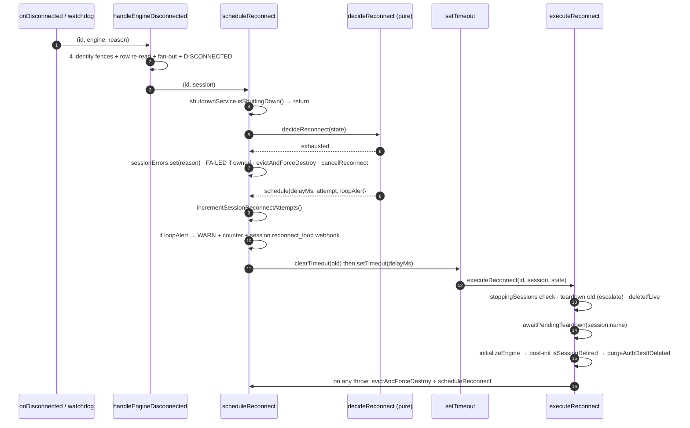
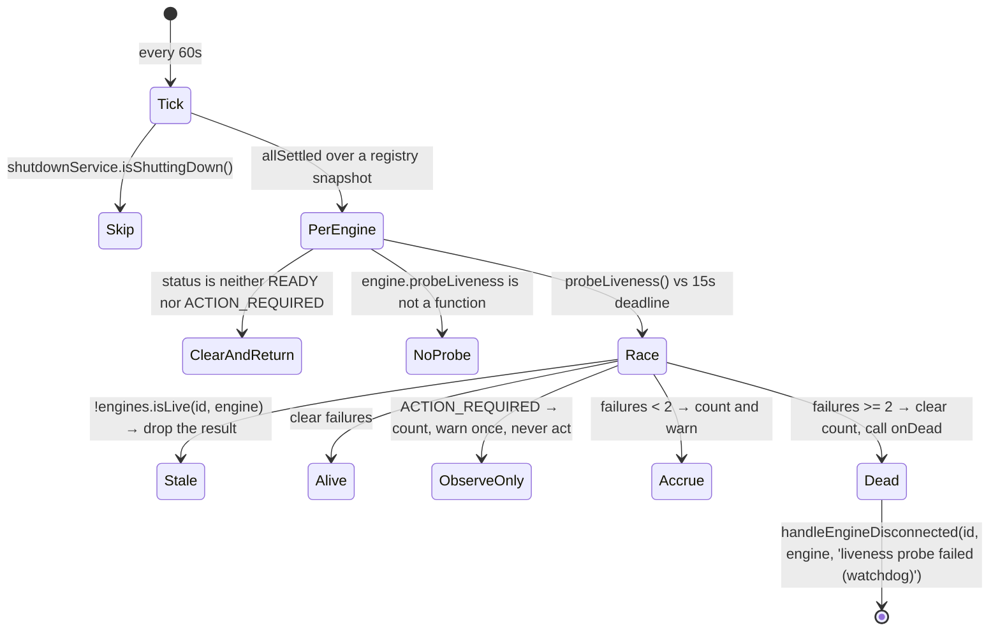

# Session Reconnect and Liveness

> **Source of truth:** `src/modules/session/reconnect-policy.ts`, `src/modules/session/session-liveness-watchdog.service.ts`, `src/modules/session/session-restriction-store.service.ts`, `src/modules/session/session-error-store.service.ts`, `src/common/metrics/session-reconnect-metrics.ts`, `src/common/metrics/session-restriction-metrics.ts`
> **Band:** Session domain · **Depends on:** 20-session-lifecycle.md, 21-session-fences-and-races.md · **Jarcube class:** ENGINE-COUPLED

## Purpose

An unofficial WhatsApp client drops its connection routinely, for reasons ranging from a network blip to
WhatsApp deciding the account is misbehaving — and sometimes it dies without saying anything at all. This
subsystem answers four questions a naive gateway gets wrong: *when* to retry (a pure backoff decision,
separated from its effects), *how to notice* a death that produced no event (an active probe with a
failure budget), *why the session is down* in terms an operator can act on (two in-memory stores, both
deliberately not columns), and *how loud to be about it* (one signal per episode, not per attempt).

The design choice worth internalising is the split in `reconnect-policy.ts`: the rules are the subtle
part and the effects are the untestable part, so the rules live in a pure function over explicit state
with `now` and `jitter` injected. Every branch — including ones that only occur after hours of uptime —
is directly reachable in a test.

## The reconnect decision

`src/modules/session/reconnect-policy.ts:decideReconnect` is the whole rule set. It takes mutable state,
an injected clock, and injected jitter; it returns a discriminated union; and it mutates the state exactly
as the original inline code did so the caller keeps one source of truth for the session's streak.

```ts
// src/modules/session/reconnect-policy.ts
export function decideReconnect(
  state: ReconnectAttemptState,
  now: number = Date.now(),
  jitter: number = Math.random() * 1000,
): ReconnectDecision
```

| Type | Shape | Meaning |
| --- | --- | --- |
| `src/modules/session/reconnect-policy.ts:ReconnectAttemptState` | `{attempts, maxAttempts, baseDelay, lastAttemptAt?}` | Owned by the caller; the policy only reads and derives |
| `src/modules/session/reconnect-policy.ts:ReconnectExhausted` | `{kind: 'exhausted', reason}` | Give up. `reason` surfaces via `lastError` |
| `src/modules/session/reconnect-policy.ts:ReconnectScheduled` | `{kind: 'schedule', delayMs, attempt, loopAlert, stabilityReset}` | Schedule attempt `attempt` after `delayMs` |

The caller adds the one field the policy must not own: `src/modules/session/session-engine-lifecycle.service.ts:ReconnectState`
extends the state interface with `timer: NodeJS.Timeout | null`, because a timer is a side effect and the
policy stays free of them.

### Rule 1 — the stability reset

```
if lastAttemptAt !== undefined && now - lastAttemptAt >= 300_000:
    attempts = 0
    stabilityReset = true
```

`RECONNECT_STABILITY_RESET_MS` is 300,000 ms. An attempt budget covers **one continuous bad stretch**:
once five minutes have passed since the last *scheduled* attempt, the session demonstrably stayed up, so
the next drop restarts the budget. Without it, a long-lived session slowly accrues attempts toward an
explicit cap across unrelated transient drops and one day wedges `FAILED` for no current reason.

Note the anchor is `lastAttemptAt` — when an attempt was *scheduled* — not when the session last reached
`READY`. That is a slightly conservative reading (a session that reconnected instantly and stayed up
still waits five minutes from the schedule time), and it means the reset is independent of whether
`onReady` ever fired.

### Rule 2 — budget exhaustion

```
if attempts >= maxAttempts:
    kind: 'exhausted'
```

The message branches, and the branch is a real usability fix:

| `maxAttempts` | Reason text |
| --- | --- |
| `0` | `Auto-reconnect is disabled (max attempts set to 0); the session was left disconnected — restart it manually.` |
| anything else | `Reconnection failed after N attempts — restart the session.` |

`0` means auto-reconnect was disabled, not that zero attempts were tried and failed, and saying "failed
after 0 attempts" is actively misleading.

### Rule 3 — exponential backoff with jitter and a hard clamp

```
delayMs = clamp(baseDelay * 2^attempts + jitter, 0, 3_600_000)
attempts++
lastAttemptAt = now
```

`src/modules/session/reconnect-policy.ts:clampReconnectDelay` does two jobs at once, and only one of them
is obvious. The visible one is the 1 h ceiling (`RECONNECT_DELAY_CAP_MS`). The load-bearing one is
`Number.isFinite(rawDelay) ? rawDelay : baseDelay` plus the upper bound: `setTimeout`'s delay field is
32-bit, so a value that overflows it **fires immediately** — turning a backoff into a relaunch storm at
exactly the moment the system is least healthy.

With the default unlimited budget the delay parks at the cap once the exponent outgrows it. At
`baseDelay = 5000`, that is attempt 10 (`5000 × 2^9 = 2,560,000`) reaching the cap at attempt 11.

Jitter is `Math.random() * 1000` in production, added **before** clamping, and injected so it can be
pinned in a test.

### Rule 4 — loop alerting cadence

```
loopAlert = attempts > 0 && attempts % 5 === 0
```

`RECONNECT_LOOP_ALERT_INTERVAL_ATTEMPTS` is 5. One signal per ongoing episode, not spam per attempt. The
reasoning is worth stating because it explains why the alert exists at all: a broken-forever setup retries
**without limit by design** (the default budget is `Infinity`), so there is no terminal event to alert on
— the 5th / 10th / 15th consecutive attempt *is* the operator-facing tell. The streak resets via the
stability window or via `onReady`, so a later episode re-arms the alert from attempt 5 again.

### Effects, applied by the lifecycle

`session-engine-lifecycle.service.ts:scheduleReconnect` is the effect half. It only applies what the
decision calls for.



Everything in `executeReconnect` marked with a fence is covered in 21-session-fences-and-races.md
(W-24 through W-32). Two points belong here:

- The reconnect chain is **self-perpetuating through its own catch**. A failed attempt calls
  `scheduleReconnect` again, which is what makes the budget the only terminator.
- On the exhausted path, `sessionErrors.set` runs **unconditionally** while the `FAILED` status write is
  ownership-fenced. The in-memory error is per-process and harmless either way; the status is not.

### Config resolution

`session-engine-lifecycle.service.ts:resolveReconnectConfig` sits between the operator-supplied `config`
blob and the policy. Read once per `start()` into `reconnectStates`.

| Knob | Source key | Bounds | Default |
| --- | --- | --- | --- |
| `baseDelay` | `reconnectBaseDelay` | 1000–300000 ms | 5000 |
| `maxAttempts` | `maxReconnectAttempts` | `floor(clamp(v, 0, 20))` | `Number.POSITIVE_INFINITY` |

The `Infinity` default is deliberate and reverses an earlier behaviour: a long-lived session must keep
retrying, with the backoff parked at the 1 h cap, rather than dying permanently after roughly 2.5 minutes.
An explicit `0` is preserved as "disabled". The clamp is what makes rule 3 safe against a poisoned value —
see W-32 in 21-session-fences-and-races.md.

Pinned by `src/modules/session/reconnect-policy.spec.ts` (203 lines) and
`src/modules/session/reconnect-config.spec.ts` (56 lines).

## The liveness watchdog

`src/modules/session/session-liveness-watchdog.service.ts:SessionLivenessWatchdog` exists because the
engine layer is **event-driven**. An engine that dies *without* emitting a disconnect — a killed Chromium,
a silently wedged socket — would otherwise sit `READY` forever, serving 200s to a session that cannot
send anything.

It is a self-contained supervisor: one timer, one failure counter, and exactly one outward effect
(`onDead`). That separation is what makes the probe timeout, the failure threshold, and the observe-only
rules testable with a fake clock instead of a live engine.

### Cadence

| Constant | Value | Why |
| --- | --- | --- |
| `SESSION_WATCHDOG_INTERVAL_MS` | 60,000 | Probe cadence |
| `SESSION_WATCHDOG_PROBE_TIMEOUT_MS` | 15,000 | A wedged connection can hang the probe itself |
| `SESSION_WATCHDOG_MAX_FAILURES` | 2 | Consecutive failures before the session is treated as dead |

`start()` is idempotent, and the interval is `unref()`'d — the watchdog must never keep the process alive
on its own. `stop()` clears the timer *and* forgets all accrued failures, and is itself idempotent so a
second `onModuleDestroy` stays safe.

The wiring in `session.service.ts:onApplicationBootstrap` starts the watchdog **first**, before the
auto-start early-return, so it runs even on a deployment with auto-start disabled — sessions can be
started through the API at any time.

### The probe



Five details that each encode a decision:

1. **Only `READY` is expected to answer.** Anything else is owned by the QR or reconnect flows. A status
   outside `READY` / `ACTION_REQUIRED` **deletes** the counter, because any accrued failures belong to a
   previous READY stretch.
2. **Feature detection, not assumption.** `typeof engine.probeLiveness !== 'function'` returns early —
   `probeLiveness?()` is optional on the engine interface, and an engine whose transport already
   self-detects death may skip the probe entirely. See 12-engine-capability-matrix.md.
3. **The probe is raced.** A timeout and a probe error both count as "not proven alive", never as alive.
4. **A stale result is dropped.** `engines.isLive(id, engine)` after the race, mirroring the callback gate
   (W-64).
5. **`allSettled` inside the tick** keeps a failing session from ever throwing into the timer, and probes
   run in parallel so a slow one cannot delay or abort the others. The registry is iterated as a
   **snapshot** — the iterator in `src/engine/engine-registry.service.ts` returns one deliberately,
   because callers tear engines down while iterating.

### `ACTION_REQUIRED` is probed but observe-only

The sharpest judgement call in the file. A session in `ACTION_REQUIRED` has a live engine and a human who
has to act, and clearing that status is theirs to do (stop, then start). Acting on a failed probe would
hand the session to the reconnect path and **silently drop the very status that asked for attention**. So
the probe result only reaches the log.

But not probing at all was worse: a page that died while waiting for the operator left no trace anywhere.
So it probes, counts, and warns exactly once per unresponsive stretch (`if (failures === 1)`) — at a 60 s
interval an unbounded log would bury everything else — while the count keeps rising so the recovery branch
can report that the page came back rather than leaving the earlier warning as the last word.

The counter hygiene that makes this safe is W-65: every path out of `ACTION_REQUIRED` passes through a
status that hits the delete branch, or through `onReady` which clears it, so an observe-only count can
never be inherited by a READY stretch and push it over the threshold early.

### Death takes the ordinary path

`onDead` is wired straight to `session-engine-lifecycle.service.ts:handleEngineDisconnected`, so a
watchdog-proven death is indistinguishable downstream from an engine-reported drop: the same four identity
fences, the same row re-read, the same webhook / WS / hook fan-out, the same `DISCONNECTED` write, the same
reconnect scheduling. The reason string is `liveness probe failed (watchdog)`, which is *not* in
`TERMINAL_UNLINK_REASONS`, so it is not audited and does not clear `phone`.

Pinned by `src/modules/session/session-liveness-watchdog.service.spec.ts` (292 lines).

## The two transient stores

Both are `@Injectable()` maps that back a non-column field on the `Session` entity, and both explain in
their own doc comments why a column would be wrong. They are attached at read time by
`session.service.ts:attachRuntimeState`, which chains the two `attachTo` projections.

### `SessionErrorStore` — why the session last failed

`src/modules/session/session-error-store.service.ts:SessionErrorStore`. A single
`Map<string, string>` with `set` / `get` / `clear` / `attachTo`.

Not a column because it describes the **current process's attempt**: a restart that clears it is correct.
A session whose reason was "Chromium failed to launch" should not still say so after a successful restart.

Two properties are contractual:

- **Every method is synchronous by contract.** Two writers sit in synchronous void engine callbacks, and
  one runs three statements before an `engines.delete(id)` whose ordering the surrounding comment
  explicitly forbids reordering (W-9). An async setter would silently reorder that.
- **`attachTo` is status-conditional.** `lastError` is populated only while the status is `FAILED` or
  `ACTION_REQUIRED`; any other status clears it. So a recovered session never shows a stale reason even
  while the entry is still held — which decouples the *entry's* lifetime from the *projection's*
  correctness.

Writers, all eight of them:

| Writer | Reason recorded |
| --- | --- |
| `initializeEngine` init-timeout branch | `engine.initialize() timed out after Nms` |
| `start()`'s catch in controls | the thrown error's message |
| `onError` (engine wiring) | the engine's reason |
| `onActionRequired` (engine wiring) | what the operator must do |
| `scheduleReconnect` exhausted branch | the policy's `reason` |
| `initializeEngine` entry | **clears** — a fresh start starts clean |
| `handleEngineReady` | **clears** — success |
| `delete()` committed path | **clears** — unbounded-growth hygiene |

### `SessionRestrictionStore` — what WhatsApp is restricting

`src/modules/session/session-restriction-store.service.ts:SessionRestrictionStore`. Holds
`AccountRestriction` values from `src/engine/interfaces/whatsapp-engine.interface.ts`.

Not a column for a subtler reason than the error store. A restriction is a fact about the **account**, not
about our attempt, so losing it on restart *would* matter — except that both engines re-report it on the
next connection (Baileys is asked directly on every connect; whatsapp-web.js re-blocks the very next link
attempt), so the state re-seeds itself within one session start. **That self-healing is what makes the
column unnecessary.**

Only **active** restrictions are held: a lift removes the entry rather than storing a negative, so
`get` returning nothing means "not restricted" and the map's size is the restricted-session count.

| Kind | Connection-scoped? | Carries `expiresAt`? |
| --- | --- | --- |
| `reachout_timelock` | **no** — the account is fully connected while it applies; only new conversations are blocked | yes |
| `tos_block` | yes — a refusal of the connection itself | no |
| `proxy_block` | yes | no |

Four behaviours follow from that table:

**De-dup on change, refresh on repeat.** `set()` returns whether this is *new news* — a change of `kind`
or `code` — which is what callers gate their operator-facing signals on. Both engines repeat themselves
(whatsapp-web.js on every reconnect attempt, the Baileys probe on every connect), so an un-deduped webhook
would fire on a loop for one unchanged fact. The stored entry is refreshed either way, so a re-report with
a later `expiresAt` updates what the API serves without being announced as new.

**Read-side expiry.** `inForce()` withholds an entry whose stated end has passed, so an expired timelock
stops badging the session immediately rather than waiting for the next reconnect to clear it. The entry
**stays stored** — `set` / `clear` own the lift signal, and the engine re-report self-heals the map — it
just stops being reported. `get`, `size`, `attachTo` and the gauge all read through `inForce`, so they can
never disagree.

**READY disproves some restrictions, not all.**
`session-restriction-store.service.ts:clearIfDisprovedByReady` drops `tos_block` and `proxy_block` because
a session that is now linked and ready cannot still be under a refusal *of the connection*, and keeps
`reachout_timelock` because READY says nothing about it. `handleEngineReady` calls it and, if something
was dropped, routes the announcement through `reportRestrictionLifted`.

**Not cleared on restart.** `initializeEngine` clears `sessionErrors` but deliberately **not**
`sessionRestrictions`: a restriction describes the account, not this attempt, so a restart does not resolve
it — and clearing it per attempt would make it flicker off and on through a reconnect loop, re-announcing
one unchanged block on every pass.

**One announcement shape, two paths.** `session-engine-lifecycle.service.ts:reportRestrictionLifted` is
shared by the engine reporting a lift and by READY disproving one, so the two cannot drift into announcing
the same thing differently. The caller has already removed the entry and passes what was removed, since
the payload describes the restriction that *ended*. The log line says "no longer in force" rather than
"WhatsApp lifted it", because only one of the two paths is WhatsApp saying so.

`attachTo` here is **not** status-conditional, unlike the error store's: a reachout timelock applies to a
perfectly `READY` session.

Pinned by `src/modules/session/session-restriction-store.service.spec.ts` (209 lines).

## Metrics

Two modules, and the interesting part of each is the choice of instrument type. 64-metrics-and-stats.md
covers the Prometheus surface.

### `session-reconnect-metrics.ts` — two counters

`src/common/metrics/session-reconnect-metrics.ts` holds two process-local monotonic counters:

| Function | Incremented at |
| --- | --- |
| `incrementSessionReconnectAttempts` | every scheduled attempt, in `scheduleReconnect` |
| `incrementSessionReconnectLoopAlerts` | every emitted loop alert (every 5th consecutive attempt) |

Plain in-process counters rather than a `COUNT(*)` over a table, and the reason is precise: **reconnect
scheduling is not persisted at all.** There is no durable source to count, and a pruned or rotated one
would be **non-monotonic** — which makes it invalid as a Prometheus `counter`, because a prune looks like
a counter reset to `rate()` and `increase()`. An in-process counter only resets on restart, which those
functions already handle correctly.

### `session-restriction-metrics.ts` — a gauge with a registered recount

`src/common/metrics/session-restriction-metrics.ts`. A gauge, not a counter: what an operator alerts on is
"an account is restricted **right now**", and a restriction applied, lifted and re-applied is one fact
recurring, not a total to accumulate.

The dependency direction is deliberate. The value is *mirrored* here rather than read from the store at
render time, so the metrics module does not have to depend on the session module for one number. But the
mirror is the **fallback**, not what a scrape normally reads:

```ts
export function getRestrictedSessionCount(): number {
  return recount ? recount() : restrictedSessions;
}
```

`src/common/metrics/session-restriction-metrics.ts:registerRestrictedSessionRecount` is called once, from
the store's constructor, with `() => this.countInForce()`. The reason it exists is the read-side expiry
above: **an expiry is not a mutation.** A timelock that lapses on its own fires nothing, so the mirror
would keep reporting the pre-expiry count — exactly when an alert on `> 0` is still firing — while every
read path already reported the session as unrestricted. Registering a function rather than importing the
store keeps the dependency pointing one way: the session module knows about metrics, not the reverse.

## Call Chain

- Engine `onDisconnected` → `session-engine-event-wiring.ts` liveness gate →
  `session-engine-lifecycle.service.ts:handleEngineDisconnected` — adds four identity fences, the row
  re-read, terminal-unlink auditing, the fan-out, and the `DISCONNECTED` write
- → `scheduleReconnect` — adds the shutdown gate, the metric increments, and the loop-alert webhook
- → `reconnect-policy.ts:decideReconnect` — the pure decision, mutating the caller's state
- → `setTimeout` → `executeReconnect` — adds teardown escalation, the credential fence, and the post-init
  retirement guard
- → `initializeEngine` — back into the start path (20-session-lifecycle.md)
- Watchdog interval → `session-liveness-watchdog.service.ts:tick` → `probe` — adds the status filter,
  feature detection, the probe race, and the failure budget
- → `handleEngineDisconnected` — the identical handler, so a probed death and a reported death converge
- Read path: `session.controller.ts:findOne` → `session.service.ts:findOne` → `attachRuntimeState` →
  `SessionErrorStore` `attachTo` → `SessionRestrictionStore` `attachTo` →
  `dto/session-response.dto.ts:SessionResponseDto` `fromEntity`

## Configuration

| Env var | Default | Effect |
| --- | --- | --- |
| `session.config.maxReconnectAttempts` (per-session, not env) | unlimited | Attempt cap, 0–20; `0` disables reconnect |
| `session.config.reconnectBaseDelay` (per-session, not env) | `5000` | Backoff base, 1000–300000 ms |
| `SHUTDOWN_DELAY_MS` | `3000` | Indirect: the drain window during which reconnect and the watchdog both stand down |
| `WWEBJS_AUTH_TIMEOUT_MS` | see `src/engine/engine-init-timeout.ts` | Feeds the init deadline a reconnect attempt is bounded by |

There is deliberately **no** env var for the watchdog cadence, the probe timeout, the failure threshold,
the stability window, the loop-alert interval, or the delay cap — all six are module constants. That is a
defensible choice (they are safety limits, not tuning knobs) but it does mean a deployment with unusually
slow engines cannot widen the probe budget without a code change.

Full list: APPENDIX-A-env-vars.md.

## Events Emitted / Consumed

| Event | Direction | When |
| --- | --- | --- |
| `session.disconnected` | out | Every disconnect, engine-reported or watchdog-proven, with `{sessionId, reason}` |
| `session.reconnect_loop` | out | Every 5th consecutive attempt, with `{sessionId, attempts, nextDelayMs}` |
| `session.status` | out | The `DISCONNECTED` and `FAILED` transitions, via the de-duped broadcaster |
| `session.restriction` | out | On a *changed* restriction (`active: true`) and on a lift (`active: false`) |
| `session:disconnected` hook | out | Alongside the webhook |
| `session:error` hook | out | From `onError` and `onActionRequired` |

Audit rows: `SESSION_DISCONNECTED` **only** for `TERMINAL_UNLINK_REASONS`, `SESSION_RESTRICTED`,
`SESSION_RESTRICTION_LIFTED`. The unlink filter is the interesting one — see the table below.

Full list: APPENDIX-B-events.md.

## Terminal unlinks are audited; ordinary drops are not

`session-engine-lifecycle.service.ts:TERMINAL_UNLINK_REASONS` = `LOGOUT`, `UNPAIRED`, `UNPAIRED_IDLE`,
`logged out`.

Everything `handleEngineDisconnected` does with `reason` is ephemeral — a log line, a webhook, a socket
emit, a plugin hook — and the only DB write is the status. So once the process restarts, a WhatsApp unlink
is **indistinguishable over the API** from a network drop: both read `disconnected` with a null
`lastError`. Auditing the unlinks, and only those, fixes that without producing per-attempt flood, because
a flapping connection retries with `TIMEOUT` / `NAVIGATION` and never with one of these four.

The exclusions are as deliberate as the inclusions: not `CONFLICT` (another device took over, and takeover
is recoverable), not `DEPRECATED_VERSION` (our own client is too old), not `TIMEOUT` (a fault, and the
single most common reconnect-storm reason).

Both engines are covered and they spell it differently — `'logged out'` is the only reason the Baileys
adapter passes to this callback, emitted for a WhatsApp-originated `loggedOut` (401) close. Baileys' other
two terminal closes (403 forbidden, 440 connectionReplaced) report through `onError` instead and are not
unlinks. 15-engine-events.md covers the translation.

A terminal unlink also clears `phone` — ownership-fenced, fire-and-forget, with no `await` allowed between
the surrounding identity fences — so the next boot does not resurrect a session that can only land on a
QR. The reconnect scheduled below it still runs and shows one QR now; `session` was captured before the
write, so its `previouslyLinked` flag is unaffected.

## File Inventory

| Path | Lines | Role |
| --- | --- | --- |
| `src/modules/session/reconnect-policy.ts` | 124 | The four backoff rules as a pure function, plus the four constants and two clamp helpers |
| `src/modules/session/session-liveness-watchdog.service.ts` | 190 | Interval supervisor, probe race, failure budget, observe-only rules, three cadence constants |
| `src/modules/session/session-error-store.service.ts` | 51 | Transient `lastError`, synchronous by contract, status-conditional projection |
| `src/modules/session/session-restriction-store.service.ts` | 130 | Transient `restriction`, change de-dup, read-side expiry, READY disproof, gauge publication |
| `src/common/metrics/session-reconnect-metrics.ts` | 30 | Two monotonic counters and their getters |
| `src/common/metrics/session-restriction-metrics.ts` | 39 | Mirrored gauge plus the registered live recount |
| `src/modules/session/session-engine-lifecycle.service.ts` | 1103 | `scheduleReconnect` / `executeReconnect` / `cancelReconnect`, `resolveReconnectConfig`, `TERMINAL_UNLINK_REASONS`, `reportRestrictionLifted` |

Specs:

| Path | Lines | Pins |
| --- | --- | --- |
| `src/modules/session/reconnect-policy.spec.ts` | 203 | All four rules with injected clock and jitter |
| `src/modules/session/reconnect-config.spec.ts` | 56 | Coercion and clamp behaviour, incl. the `Infinity` default and explicit `0` |
| `src/modules/session/session-liveness-watchdog.service.spec.ts` | 292 | Cadence, threshold, feature detection, stale-result drop, observe-only |
| `src/modules/session/session-restriction-store.service.spec.ts` | 209 | Change de-dup, read-side expiry, READY disproof, gauge recount |
| `src/common/metrics/session-reconnect-metrics.spec.ts` | — | Counter monotonicity |

## Failure Modes & Edge Cases

| Scenario | Behaviour | Pinned by |
| --- | --- | --- |
| Transient drop on a session up for hours | Stability reset zeroes `attempts`; backoff restarts at `baseDelay` | `reconnect-policy.spec.ts` |
| `maxReconnectAttempts: 0` | One `exhausted` decision with the "disabled" wording; no attempt made | `reconnect-policy.spec.ts` |
| Broken-forever setup, default budget | Retries indefinitely; delay parks at 1 h; one alert every 5 attempts | `reconnect-policy.spec.ts` |
| Computed delay overflows 32-bit ms | Clamped to 1 h, so the timer cannot fire immediately | `reconnect-policy.spec.ts` |
| `reconnectBaseDelay: "soon"` | Coerced → not finite → 5000 | `reconnect-config.spec.ts` |
| Engine dies with no event | Two consecutive failed probes → `handleEngineDisconnected` | `session-liveness-watchdog.service.spec.ts` |
| Probe itself hangs | 15 s deadline; counts as not-alive, never as alive | `session-liveness-watchdog.service.spec.ts` |
| Engine has no `probeLiveness` | Skipped; relies on engine events alone | `session-liveness-watchdog.service.spec.ts` |
| Session in `ACTION_REQUIRED` with a dead page | Counted and warned **once**; never reconnected | `session-liveness-watchdog.service.spec.ts` |
| Page recovers while `ACTION_REQUIRED` | Explicit recovery log, so the earlier warning is not the last word | `session-liveness-watchdog.service.spec.ts` |
| Probe result arrives after a restart | Dropped on `isLive` | `session-liveness-watchdog.service.spec.ts` |
| Disconnect during the drain window | No reconnect scheduled; session left `DISCONNECTED` | `session.service.spec.ts` |
| Engine re-reports an unchanged restriction | `set()` returns false; no webhook, no audit; entry refreshed | `session-restriction-store.service.spec.ts` |
| Timelock's `expiresAt` passes with no event | Reads and gauge both report unrestricted immediately | `session-restriction-store.service.spec.ts` |
| Session reaches READY under a `tos_block` | Restriction dropped and a lift announced | `session-restriction-store.service.spec.ts` |
| Session reaches READY under a `reachout_timelock` | Restriction survives — READY does not disprove it | `session-restriction-store.service.spec.ts` |
| Reconnect exhausts after the lease lapsed | `lastError` set locally; `FAILED` write suppressed | `session-ownership-status-fence.spec.ts` |

## Jarcube Portability

**Classification:** ENGINE-COUPLED

**Rationale:** The reconnect machine and the watchdog exist because a persistent, reverse-engineered
connection can drop or die silently. Jarcube's Cloud API integration
(`QuantumMind-backend/src/whatsapp/whatsapp.service.ts`) has no persistent connection at all: it makes
outbound HTTPS calls to Graph and receives inbound webhooks. There is nothing to reconnect and nothing to
probe. Both stores are also engine-shaped — `AccountRestriction` is the engines' vocabulary, and
`lastError` describes an engine attempt.

**Prerequisites:** none. Nothing here should be ported as-is.

**Cloud API caveats:** the closest Cloud API analogue to "the session is down" is "the access token was
revoked or the phone number was deregistered", and Meta reports that as a 401/403 on the next call —
synchronously, to the caller, with a specific error code. That is a *classification* problem, not a
*supervision* problem, and it is solved with the retry classifier recommended in 20-session-lifecycle.md
rather than with a watchdog.

**Specific recommendations for Jarcube:**

- **Do port the pure-policy/effect split, as a technique.** `reconnect-policy.ts` is the best small
  example in the repo of separating a subtle decision from untestable side effects with `now` and
  `jitter` injected. Jarcube has at least two places with the same shape — Graph API retry and any
  webhook redelivery backoff — and the technique makes "what happens on the 11th attempt after four hours"
  a two-line test instead of an unreachable branch.
- **Do port the three clamps verbatim in spirit.** Non-finite → default, upper bound below `setTimeout`'s
  32-bit range, and a lower bound. Any backoff computed from operator-supplied config needs all three, and
  the failure mode (a huge delay firing immediately) is silent and catastrophic.
- **Do port the "one alert per episode" cadence.** `attempts % N === 0` with a stability reset is a
  general answer to alert fatigue on retry loops, and it is four lines. Jarcube's message handler retries
  AI calls; the same rule applies.
- **Do port the counter-vs-gauge reasoning and the registered recount.** "A pruned table is not a valid
  Prometheus counter" and "an expiry is not a mutation, so a mirrored gauge goes stale exactly when the
  alert fires" are both transport-independent instrumentation lessons, and the recount-registration
  pattern keeps the metrics module from depending on the domain module. Directly applicable to
  `QuantumMind-backend`.
- **Do port the "transient field, not a column" reasoning** for anything that describes *this process's*
  attempt. The status-conditional projection in `SessionErrorStore` `attachTo` is the part that makes it
  safe: the entry's lifetime and the projection's correctness are decoupled, so a stale entry cannot
  produce a stale answer.
- **Do not port** the watchdog, the reconnect state machine, `TERMINAL_UNLINK_REASONS`, or
  `AccountRestriction`. A Cloud API bot has no companion device to unlink and no connection to probe.

## Open Questions

- The stability reset anchors on `lastAttemptAt` (when an attempt was *scheduled*) rather than on when the
  session last reached `READY`. For a session that reconnects on the first attempt and then stays up for
  four minutes before dropping again, the second drop inherits `attempts = 1`. Whether anchoring on
  `onReady` was considered is not stated; `handleEngineReady` does zero `reconnectState.attempts`
  directly, which covers the common case, so the two mechanisms overlap rather than conflict. The residual
  case — reconnect succeeded but `onReady` never fired — was not traced.
- Six safety limits are hard-coded constants with no env override: the watchdog interval, probe timeout,
  failure threshold, stability window, loop-alert interval, and delay cap. Whether that is a deliberate
  "these are not knobs" position or simply un-parameterised is not stated in the source.
- `SESSION_WATCHDOG_MAX_FAILURES` is 2 at a 60 s interval, so a session is declared dead roughly 60–75 s
  after it stops answering. Whether that interacts badly with the 60 s default `SESSION_LEASE_TTL_MS` — a
  node whose probes are failing is likely also renewing leases slowly — was not analysed anywhere in the
  code. The two subsystems do not consult each other.
- `src/common/metrics/session-reconnect-metrics.spec.ts` exists but its line count was not measured; the
  table above leaves it blank rather than guessing.
