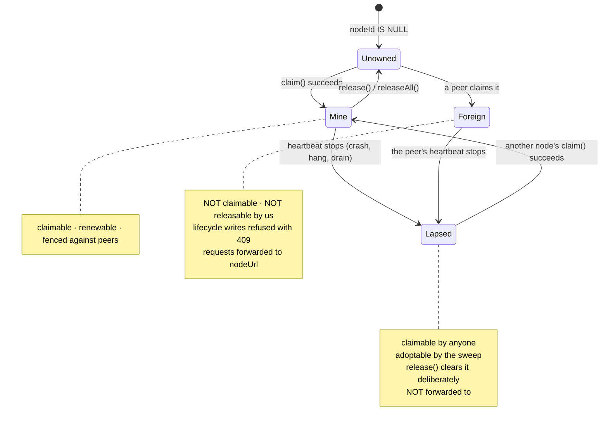
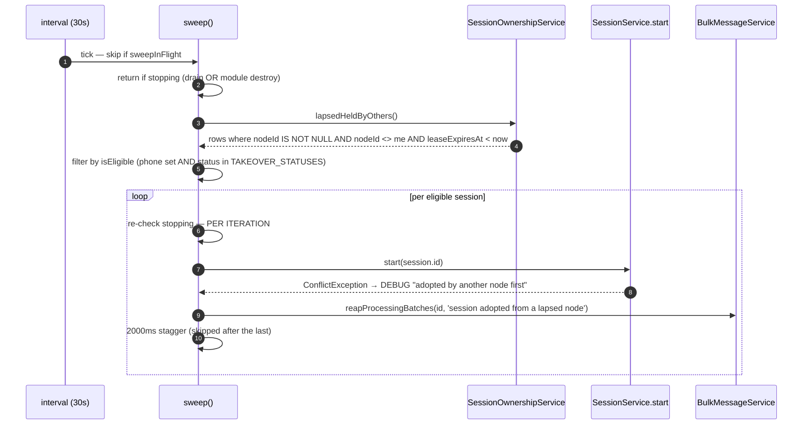
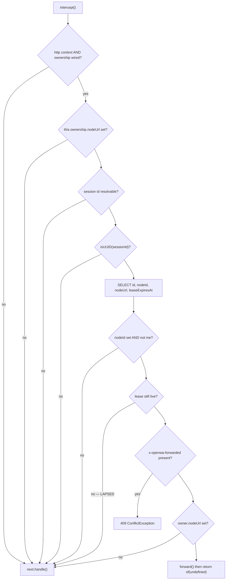

# Session Ownership and Takeover

> **Source of truth:** `src/modules/session/session-ownership.service.ts`, `src/modules/takeover/session-takeover.service.ts`, `src/modules/takeover/takeover.module.ts`, `src/modules/session/session-proxy.interceptor.ts`, `src/modules/session/entities/session.entity.ts`
> **Band:** Session domain · **Depends on:** 20-session-lifecycle.md, 21-session-fences-and-races.md · **Jarcube class:** NEEDS-REDESIGN

## Purpose

A WhatsApp session's engine runs in exactly one process. Two engines on one account is not a
double-work problem — it is WhatsApp seeing two companion devices claiming the same identity, which ends
in a `CONFLICT` close at best and a ban risk at worst. Nothing in the schema recorded *which* process
hosted a session, so a booting process had to assume every active-looking row was its own leftover and
reset it: correct with one process, destructive the moment a second boots beside a live peer.

This subsystem adds three things on top of four columns: a **lease** that says who hosts a session and
until when, an **adoption sweep** that picks up sessions whose holder died, and a **request forwarder**
that routes a session-scoped HTTP call to the node holding the engine. It is deliberately a lease and not
a lock, because a process that dies without releasing would otherwise strand its sessions forever.

The ownership service's own doc comment is honest about scope, and that honesty is worth carrying
forward: *"this establishes ownership. It does not yet route a request to the owning node, nor fence every
lifecycle path."* Since then the forwarder and several fences have landed; what remains unfenced is
enumerated under Open Questions rather than glossed.

OpenWA's `docs/13-horizontal-scaling.md` covers the deployment shapes — Swarm, Kubernetes, Traefik and
Nginx upstreams, capacity planning, and three session-affinity strategies. This doc covers the
implementation of the third strategy (session claim), which is the one the code actually does.

## Data Model / Contract

Four columns on `src/modules/session/entities/session.entity.ts:Session`. All nullable; all NULL is a
valid, meaningful state ("nobody holds this").

| Column | Type | Meaning |
| --- | --- | --- |
| `nodeId` | varchar(190) null | Which process hosts the engine, or NULL when nobody does |
| `claimedAt` | timestamp null | When the claim was taken |
| `nodeUrl` | varchar(2048) null | Where the owner answers HTTP, written at claim time from `NODE_URL`. NULL when routing is unconfigured — a peer then answers 409 instead of forwarding |
| `leaseExpiresAt` | timestamp null | When the claim stops being honoured. A running owner keeps extending it |

The four states a row can be in, from any *other* node's point of view:



The distinction between **Foreign** and **Lapsed** is the load-bearing one, and it recurs in six places.
A live foreign claim is protected; a lapsed one is fair game.

## The claim rule, expressed once

`src/modules/session/session-ownership.service.ts:claimableWhere` is the single expression of "takeable":

```ts
claimableWhere(now = new Date()): Array<Record<string, unknown>> {
  return [{ nodeId: IsNull() }, { nodeId: this.nodeId }, { leaseExpiresAt: LessThan(now) }];
}
```

Nobody holds it, **or** this process already holds it, **or** the holder's lease lapsed. Returned as a
`where` fragment rather than inlined, so the same rule drives three places that must not disagree:

| Consumer | Use |
| --- | --- |
| `session.service.ts:onModuleInit` | The boot reset — leave a live peer's rows alone |
| `session.service.ts:autoStartSessions` | The boot scan — without this every replica races to launch the same engines |
| `session-ownership.service.ts:claim` | The conditional UPDATE's `andWhere` |

Three disagreeing copies of this predicate is the bug the extraction prevents.

### `nodeId` — stable across restarts, deliberately not the pid

```ts
get nodeId(): string {
  return this.configService?.get<string>('session.nodeId') || process.env.NODE_ID || hostname();
}
```

A restarted process must recognise its **own previous rows** in order to reset them, and a pid never
matches after a restart. The hostname is stable for the lifetime of a container or host; `NODE_ID`
overrides it where that is not the right boundary.

The corollary is documented and matters operationally: a container **recreate** changes the hostname, so
the new boot does not recognise the old identity's rows. Those become lapsed-held-by-others and are picked
up by the sweep rather than by the boot reset — which is one of the two cases the sweep exists for.

### The claim is a conditional UPDATE, not a read-then-write

```ts
.where('id = :id', { id: sessionId })
.andWhere('("nodeId" IS NULL OR "nodeId" = :me OR "leaseExpiresAt" < :now)', {
  me: this.nodeId,
  now: leaseParam(now),
})
```

Two processes racing on the same free session cannot both succeed: the second's UPDATE matches no row,
because the first has already written its own `nodeId` and a future expiry. Deciding on the read alone
would let both pass. `claim()` returns `(result.affected ?? 0) > 0`.

That single-statement atomicity is what makes the whole design work without a distributed lock, and it is
also why `SessionService.start` calls `findOne()` on a false claim: the UPDATE matches zero rows for a
**non-existent id** too, so the 404 has to be surfaced separately or every bad id would 409.

### `leaseParam` — the silent-never-matches trap

```ts
function leaseParam(at: Date): string | Date {
  return (DateTransformer.to(at) as string | Date | null) ?? at;
}
```

Raw SQL bypasses the column's `DateTransformer`, and the stored form is not a `Date` on every dialect —
SQLite keeps an ISO string. An untransformed parameter compares against the wrong representation and the
clause **silently never matches**. The consequence is not a wrong answer but a missing capability: an
expired claim would never be taken over, so every session a crashed process was holding would be stranded
forever, with no error anywhere. Used by `claim`, `release`, `lapsedHeldByOthers`, `isHeldByOtherNode`,
and `heldByOtherNodes`.

## Lease TTL and heartbeat

| Setting | Env | Default | Rationale from the source |
| --- | --- | --- | --- |
| Lease TTL | `SESSION_LEASE_TTL_MS` | 60,000 | Worst-case delay before a peer may take over from a process that died without releasing |
| Heartbeat | `SESSION_LEASE_HEARTBEAT_MS` | 20,000 | Comfortably under the TTL so a single missed tick — a slow query, a brief DB blip — never costs a live process its sessions |

A 3× ratio, so two consecutive missed ticks are survivable. The interval is `unref()`'d: never hold the
process open, because a lease that stops being renewed **is** what shutdown means.

### `renew()` does two jobs

```mermaid
sequenceDiagram
  autonumber
  participant T as heartbeat (20s)
  participant R as renew()
  participant P as engineLiveness probe
  participant DB as sessions
  participant H as onLeaseLost handler

  T->>R: tick
  R->>R: held = [...owned]; return if empty
  R->>P: filter held → live (engine, in-flight start, or pending reconnect)
  R->>DB: UPDATE leaseExpiresAt WHERE id IN (live) AND nodeId = me
  R->>DB: SELECT id WHERE id IN (held) AND nodeId = me → kept
  Note over R,DB: on ANY query error: warn and RETURN.<br/>A failed renewal is never read as loss.
  R->>R: if lossDetectionSuspended > 0 → return (re-checked HERE, post-query)
  R->>R: lost = held - kept; drop from owned
  R->>H: onLeaseLost(lost) — wrapped in try/catch
  H->>H: stopOrphanEngines(lost) — local teardown only, never a row write
```

**Renewal is scoped to what is actually alive.** The `engineLiveness` probe — wired by
`session.service.ts:onApplicationBootstrap` to `session-engine-lifecycle.service.ts:isEngineActive` —
filters `held` down to `live` before the UPDATE. A claim whose engine is gone (a failed start, an
exhausted reconnect) must be **allowed to lapse**: renewing it unconditionally pinned such sessions to
the node forever — unstartable on any peer, and invisible to the takeover sweep, which only sees lapsed
leases. The id stays in `owned` so the loss is still *noticed* once a peer takes the row; the filter
suppresses renewal, not detection.

**Detection is the second job, and it exists because renewal is the only regular contact with the row.**
A lease can lapse while the process is perfectly healthy — a slow query or a long pause is enough — after
which a peer may legitimately take the session.

Three error-handling decisions, each with a stated cost:

- **A failed query returns early and concludes nothing.** Reading loss from a failed query would tear
  down every healthy engine on the node the first time the database hiccuped, which is far worse than a
  late renewal. The TTL absorbs a transient blip.
- **The suspension check is re-done after the queries**, not only at entry. The tick this protects
  against is precisely one that was already in flight when the suspension was taken. Renewing was
  harmless; concluding loss is not.
- **A throwing loss handler is caught and logged at ERROR.** `renew()` is interval-driven, so a throwing
  handler would surface as an unhandled rejection and could stop the loop entirely. The ids are already
  out of `owned`, so bookkeeping stays consistent; what a failure here means is that an engine may still
  be running for a session this node no longer owns, which is worth an error rather than a crash.

### `suspendLossDetection` — the SQLite single-connection trap

The subtlest mechanism in the file, and the one most likely to be deleted by someone who does not know
why it exists.

On SQLite **every TypeORM query runner shares one connection.** So a heartbeat tick can execute *inside*
a replace-all data import's open transaction — after its `DELETE`, before its re-inserts commit — and see
**no rows at all**. Concluding loss there tears down engines that never stopped, and does so even when the
import later rolls back and every row comes straight back.

```ts
suspendLossDetection(): () => void {
  this.lossDetectionSuspended++;
  let released = false;
  return () => {
    if (released) return;
    released = true;
    this.lossDetectionSuspended--;
  };
}
```

Three design choices in nine lines:

- **A counter, not a flag**, so overlapping spans cannot resume each other early.
- **Returns a release function rather than exposing `resume()`**, so the count cannot be unbalanced by a
  caller that forgets which spans it opened; releasing the same token twice is a no-op.
- **Held across the import's whole transaction**, and re-checked post-query as noted above.

66-infra-management.md owns the import side of this contract.

### Release semantics

| Method | Predicate | Purpose |
| --- | --- | --- |
| `release(sessionId)` | `nodeId = me OR leaseExpiresAt < now` | Hand one session back so a peer can take it without waiting for the TTL |
| `releaseAll()` | `id IN (owned) AND nodeId = me` | Drop everything on the way down |

`release()` clearing a **lapsed foreign** claim is deliberate and non-obvious. A stop, logout or delete of
a session whose crashed owner's lease has expired must actually leave it **down**: a row still naming the
dead node reads as an abandoned orphan to the takeover sweep, which would adopt and restart the session
the operator just stopped. A **live** foreign claim is left alone — releasing that would strand a peer's
running engine.

`releaseAll()` runs **last** in `session.service.ts:onModuleDestroy`, only after
`engineLifecycle.shutdown()` has actually brought the engines down, so a peer never claims a session this
process is still holding open.

### Who releases, and when

`session.service.ts:releaseUnlessEngineActive` is the single policy, gated on `isEngineActive`:

| Path | Releases? |
| --- | --- |
| `start()` throws (any reason) | yes, unless something is still alive locally |
| `stop()` succeeds | yes — stop is the deliberate end of this process's ownership |
| `stop()` throws | **no** — this catch also carries the foreign-node 409, and a blanket release would delete the peer's claim |
| `logout()` 200 or 502 | yes |
| `forceKill()` success or failure | yes |
| `delete()` success | yes, via an explicit `ownership.release(id)` after the lifecycle delete |

The `isEngineActive` gate is what makes "yes" safe. A `start()` that began before a `stop()` and is still
mid-launch owns the claim now, so releasing under it would leave a **live engine on an unclaimed row** that
no heartbeat renews and any peer may start a second time. An "already starting/started" refusal likewise
means this node genuinely runs the engine. W-42 through W-44 in 21-session-fences-and-races.md.

## The two ownership fences on lifecycle writes

### `assertNotHeldElsewhere` — the coarse fence

`session.service.ts:assertNotHeldElsewhere` calls `isHeldByOtherNode` and throws
`ConflictException("Session {id} is running on another node")`.

Applied to **`stop()` and `delete()` only**, and the asymmetry is reasoned:

- `start()` is fenced by the claim itself.
- `logout()` and `forceKill()` require a **local engine**, so they cannot act on a peer's session.
- `stop()` and `delete()` can: neither needs an engine here. Without the fence, a request landing on the
  wrong node — routine when ownership is configured but request routing is not — writes `DISCONNECTED`
  over a peer's live session, or deletes its row and credentials outright, while the peer's engine keeps
  running.

`isHeldByOtherNode` is the scoped counterpart of `heldByOtherNodes`: the single-id verbs only need one
answer, and scanning every claim to get it would grow with the whole deployment. A **lapsed** foreign
claim reads false — the holder may be gone, and taking over is exactly what the claim rule allows.

### `nodeOwnsSession` — the fine fence

`src/modules/session/session-ownership.service.ts:nodeOwnsSession` gates individual **status writes** from
engine callbacks. It is fully treated as W-38/W-39 in 21-session-fences-and-races.md; the two facts that
belong here:

- `owns()` is a **synchronous in-memory `Set` lookup**, because its callers are engine callbacks on the
  hot path and an extra suspension point there would re-open the retirement race the surrounding
  `isLiveEngine` fence closes. The set is also the right authority: it is what `renew()` clears the moment
  it observes the claim is gone.
- The no-ownership default is **TRUE**, and the comment is careful that this serves direct-construction
  specs rather than production — `SessionOwnershipService` is an unconditional `SessionModule` provider,
  so a running gateway always has one and the fence is live single-node too. Inverting it would silence
  every engine-driven status write everywhere instead of fencing a few.

## The takeover sweep

`src/modules/takeover/session-takeover.service.ts:SessionTakeoverService`. Boot auto-start runs exactly
once, so it misses two cases, **both observed live**:

1. A peer that crashes **after** this node booted.
2. A container recreate whose new boot lands **before** the old identity's lease expires. The claim is
   correctly refused, and nothing ever retried — the session sat disconnected until someone called
   `POST /start`.

The sweep is the retry. Every tick it looks for lapsed-lease sessions and starts them **through the
ordinary `SessionService.start` path**, so the claim stays race-safe against peers doing the same.

### Why it lives in its own module

`src/modules/takeover/takeover.module.ts` imports both `SessionModule` and `MessageModule`. Adopting a
session also reconciles its in-flight bulk batches via `BulkMessageService`, which sits in
`MessageModule`, which already imports `SessionModule`. Importing `MessageModule` back from
`SessionModule` would close the cycle, so the sweep sits **above** both — the lowest place both are
reachable without a cycle and without `forwardRef()`.

### Eligibility

```ts
const TAKEOVER_STATUSES = new Set<SessionStatus>([
  SessionStatus.READY, SessionStatus.INITIALIZING, SessionStatus.AUTHENTICATING,
  SessionStatus.ACTION_REQUIRED, SessionStatus.DISCONNECTED,
]);
```

Plus `Boolean(session.phone)` — only authenticated sessions, because an engine is worth relaunching
exactly when saved credentials can restore the link without a human scanning anything.

The two omissions are the interesting part:

| Omitted | Why |
| --- | --- |
| `QR_READY` | An unpaired session on a dead node has nothing to resume; restarting it elsewhere just renders a QR nobody asked for |
| `FAILED` | It marks a session an operator must look at, and silently relocating it would hide that (`INV-7`) |

`ACTION_REQUIRED` **is** adopted, which is a slightly surprising inclusion given the watchdog treats that
status as operator-owned (22-session-reconnect-and-liveness.md). The distinction is coherent: the
watchdog refuses to *clear* the status by reconnecting, whereas the sweep is relocating a session whose
host is gone — the status travels with it.

### One pass



Four guards, each answering a real failure:

- **`sweepInFlight`** — at most one sweep at a time. A slow start (a Chromium launch) must not stack a
  second sweep; the claim would refuse, but the log noise and DB churn are pointless.
- **`stopping` re-checked per iteration.** Clearing the interval stops the *next* sweep; it does nothing
  about one already running, which is neither aborted nor awaited. Without the signal, a tick could
  construct and register an engine **after** the shutdown path emptied the registry — nothing would tear
  it down — and claim a lease for a process about to exit, pinning the session to a dead node until the
  lease lapsed. It is re-checked per iteration because each adoption costs a browser launch plus a 2 s
  stagger, so the loop spans a large part of the sweep interval.
- **`stopping` unions two signals.** `shuttingDown` (set by `onModuleDestroy`, which runs at
  `app.close()`) **and** `shutdownService.isShuttingDown()` (the earlier drain signal). `onModuleDestroy`
  fires *after* the bounded shutdown delay, and throughout that window the timer is still armed — so the
  drain signal is the one that actually matters. Same source `session-engine-lifecycle` and the watchdog
  already consult.
- **`ConflictException` is expected, not exceptional.** A peer won the race — the claim doing its job — so
  it logs at DEBUG. Anything else logs at WARN.

`TAKEOVER_START_STAGGER_MS` is 2,000 ms, matching the boot auto-start's Chromium stagger, and the sweep is
gated by the **same** `autoStartSessions` feature flag: a deployment that opted out of automatic engine
starts must not get spontaneous ones from the sweep either.

`bulkMessages.reapProcessingBatches` closes a real gap: the dead node's in-flight batches can never
complete, so they are surfaced as FAILED now rather than sitting in PROCESSING until some node reboots.
33-bulk-messaging.md.

Pinned by `src/modules/takeover/session-takeover.service.spec.ts` (251 lines), including
`'skips sessions not worth resuming: unauthenticated, mid-pairing, or operator-flagged failed'`.

## Node URL routing and the proxy interceptor

`src/modules/session/session-proxy.interceptor.ts:SessionProxyInterceptor` is registered as a **global**
`APP_INTERCEPTOR` in `session.module.ts`, because any controller may carry a session dimension.

The lease records *where* each session runs; this is the piece that acts on it. A request landing on the
wrong node — a load balancer round-robining across replicas knows nothing about session placement — is
forwarded to the owner's `nodeUrl` and the owner's response relayed back.

**An interceptor rather than middleware, deliberately:** it runs *after* the API-key guard, so a node only
spends outbound work on requests that authenticated here first. The owner authenticates them again — both
nodes share the auth database.

**Entirely inert unless routing is configured.** Without `NODE_URL` on this node the interceptor never even
looks up the session, so single-node deployments pay nothing.

### The decision ladder



The four "proceed locally" outcomes are each a deliberate semantic, not a fallthrough:

| Condition | Behaviour | Why |
| --- | --- | --- |
| Owner's lease **lapsed** | proceed locally | The session is adoptable, and handling it here — a `POST /start` claims it — **is** the takeover semantic, not an error |
| Live owner with **no `nodeUrl`** | proceed locally | Unreachable; the engine-level "held by another node" 409 answers it — precise, if unrouteable |
| Non-UUID session id | proceed locally | Cannot name a routed session; let it take its normal 404 |
| No session id on the route | proceed locally | Nothing to route |

The non-UUID note carries a **correction of an earlier comment**, and it is worth preserving because the
false version leads somewhere wrong: `sessions.id` is `varchar` on **both** dialects (see the PostgreSQL
branch of `src/database/migrations/1770108659848-AddMessageStatus.ts` and the `gen_random_uuid()::varchar`
default a `uuid` column could not take), so a non-UUID id simply matches nothing. An earlier comment
claimed Postgres would raise a 500 here. It would not — and reasoning from that claim leads to
conclusions about the 105 unvalidated `@Param('sessionId')` routes that do not hold.

### Session id resolution

`sessionIdOf` prefers `params.sessionId`; failing that, it reads the `SESSION_SCOPED_KEY` metadata set by
`src/modules/auth/decorators/auth.decorators.ts` and, when present, uses `params.id`. That is how a
controller whose param is `:id` but whose resource *is* a session (`SessionController` itself) participates
in routing. 50-auth-and-api-keys.md owns the decorator.

### `forwardTarget` — origin un-influenceable by construction

The security-critical function, covered as W-54/W-55 in 21-session-fences-and-races.md. Summary: the
request target is caller-controlled and HTTP/1.1 allows the absolute form, so `new URL(originalUrl, base)`
discards the base and would let an authenticated caller aim this node's forwarder at any origin **with the
credentials of the call attached**. The rebuild uses URL *setters* on a clone of the owner's origin,
because `new URL('//elsewhere/x', base)` would resolve its authority from the path.

### What crosses the hop

| Direction | Carried |
| --- | --- |
| Request headers | `x-api-key`, `authorization`, `content-type`, `accept`, plus the hop marker and an appended `x-forwarded-for` |
| Request body | Re-serialised `JSON.stringify(request.body ?? {})` for non-GET/HEAD |
| Response headers | `content-type`, `content-disposition`, `x-content-type-options`, four `retry-after*` variants, nine `x-ratelimit-*` variants, plus `x-openwa-served-by: <ownerNodeId>` |

Three notes on that table:

- **The body is re-serialised, not streamed.** It has already been parsed by this hop's JSON body-parser,
  and re-serialising is byte-equivalent for the JSON API surface because there are **no multipart session
  routes**. That is a stated precondition, not an assumption — a future multipart session route would
  break it.
- **`x-forwarded-for` relays the inbound chain and appends the immediate peer.** The owner
  re-authenticates the forwarded call (`allowedIps`) and throttles per client IP, so the chain must carry
  what this hop observed — without it every forwarded call shows up as *this node's* address. The owner
  only honours the chain when this node is in its `TRUSTED_PROXIES`. 52-rate-limiting.md.
- **The throttle headers are relayed because the answer comes from the owner's counters.** Without them a
  forwarded 429 arrives with no indication of when to retry. The suffixed names are the ones the throttler
  actually sets — there is no bare `Retry-After`.

`fetch` is called with `redirect: 'manual'` and `AbortSignal.timeout(SESSION_PROXY_TIMEOUT_MS)`
(default 60,000 ms — engine operations can legitimately take tens of seconds: a send with typing
simulation, a media fetch — but a peer must not hold a caller forever when the owner hangs).

`forwardTarget` is called **inside** the `try`, on purpose: a `NODE_URL` that is not a usable absolute URL
makes it throw, and that is an unreachable-owner condition — the 503 below names the node and the setting
— not a 500 on a request that had nothing wrong with it. Boot validation rejects such a value too.

On any failure: `503` with a message naming the owner node and its `NODE_URL`.

Pinned by `src/modules/session/session-proxy.interceptor.spec.ts` (360 lines) and a session-proxy e2e
spec, which is where the `of(undefined)` / `EmptyError` behaviour (W-57) is verified end to end.

## Call Chain

- Boot: `session.service.ts:onModuleInit` → `session-ownership.service.ts:claimableWhere` — scopes the
  reset so a live peer's rows survive
- Boot: `onApplicationBootstrap` → `onLeaseLoss` + `setEngineLiveness` + `startHeartbeat` — the three
  wires that make the lease self-correcting, all before the auto-start early-return
- `session.controller.ts:start` → `session.service.ts:start` → `session-ownership.service.ts:claim` —
  claims **before** any engine is launched
- Heartbeat → `renew()` → `isEngineActive` probe → UPDATE + SELECT → `onLeaseLost` →
  `session-engine-lifecycle.service.ts:stopOrphanEngines` — local teardown only, never a row write
- Sweep → `lapsedHeldByOthers` → `isEligible` → `session.service.ts:start` (the ordinary path, so the
  claim is race-safe) → `BulkMessageService` `reapProcessingBatches`
- Any session-scoped request → `SessionProxyInterceptor` `intercept` → owner lookup → `forwardTarget` →
  `fetch` → header relay → `of(undefined)`
- Drain: `onModuleDestroy` → `stopHeartbeat` → `await autoStartRun` → `engineLifecycle.shutdown()` →
  `releaseAll()` — release strictly last

## Configuration

| Env var | Default | Effect |
| --- | --- | --- |
| `NODE_ID` | `hostname()` | Ownership identity. Stable across restarts by design; a container recreate changes it |
| `NODE_URL` | unset | Where this node answers for peers. **Empty disables request forwarding entirely** and is the correct single-node setting |
| `SESSION_LEASE_TTL_MS` | `60000` | Worst-case delay before a peer may adopt |
| `SESSION_LEASE_HEARTBEAT_MS` | `20000` | Renewal cadence |
| `SESSION_TAKEOVER_SWEEP_MS` | `30000` | Adoption sweep cadence |
| `SESSION_PROXY_TIMEOUT_MS` | `60000` | Ceiling on one forwarded request |
| `AUTO_START_SESSIONS` | see 05-configuration-and-env.md | Gates the sweep as well as boot auto-start |
| `TRUSTED_PROXIES` | see 52-rate-limiting.md | The owner must trust the forwarding node for the relayed `x-forwarded-for` to count |

All five numeric settings are resolved in `src/config/configuration.ts` under the `session` key with the
same guard shape — `parseInt`, then `Number.isFinite(n) && n > 0`, else the default. 05-configuration-and-env.md.

Full list: APPENDIX-A-env-vars.md.

## Events Emitted / Consumed

This subsystem emits **no** webhook or WebSocket events of its own. That is a deliberate consequence of
`INV-6`: lease loss tears down local engines and does not touch the row, so from the API's point of view
nothing happened to the session — a peer picks it up and *its* status writes are the ones consumers see.

Observable signals are log lines and one relay header:

| Signal | Level | Where |
| --- | --- | --- |
| `Session is held by another node` | WARN | failed `claim()` |
| `Lost the claim on N session(s); another node now holds them` | WARN | `renew()` |
| `Failed to renew session leases` | WARN | `renew()` catch |
| `Failed to release engines for lost sessions` | ERROR | `onLeaseLost` catch |
| `Released N session claim(s) on shutdown` | INFO | `releaseAll()` |
| `Adopted session X from lapsed node Y` (`action: session_takeover`) | INFO | sweep |
| `Takeover sweep failed` | WARN | sweep catch |
| `Forwarding to session owner 'X' failed` | WARN | interceptor |
| `x-openwa-served-by: <ownerNodeId>` | — | every forwarded response |

76-observability-ops.md covers log shape; APPENDIX-B-events.md covers the event catalog this doc does not
contribute to.

## File Inventory

| Path | Lines | Role |
| --- | --- | --- |
| `src/modules/session/session-ownership.service.ts` | 392 | Claim / release / renew, `claimableWhere`, `leaseParam`, `suspendLossDetection`, the six query helpers, `nodeOwnsSession` |
| `src/modules/takeover/session-takeover.service.ts` | 152 | The adoption sweep, `TAKEOVER_STATUSES`, the stagger, the two shutdown signals |
| `src/modules/takeover/takeover.module.ts` | 15 | Sits above `SessionModule` + `MessageModule` to break the cycle |
| `src/modules/session/session-proxy.interceptor.ts` | 239 | `forwardTarget`, the decision ladder, header allow-lists, the 503 path |
| `src/modules/session/entities/session.entity.ts` | 103 | The four ownership columns and their doc comments |
| `src/modules/session/session.service.ts` | 821 | Claim-scoped boot reset and auto-start scan, `assertNotHeldElsewhere`, `releaseUnlessEngineActive`, the three bootstrap wires |
| `src/config/configuration.ts` | — | The `session` config block: `nodeId`, `nodeUrl`, and the four numeric settings |

Specs:

| Path | Lines | Pins |
| --- | --- | --- |
| `src/modules/session/session-ownership.service.spec.ts` | 525 | Conditional claim, `leaseParam`, renew filtering, loss detection, suspension, release predicates |
| `src/modules/session/session-ownership-status-fence.spec.ts` | 149 | The fine fence on engine status writes, and `nodeOwnsSession`'s TRUE default |
| `src/modules/takeover/session-takeover.service.spec.ts` | 251 | Eligibility (`INV-7`), stagger, `sweepInFlight`, per-iteration shutdown re-check, batch reaping |
| `src/modules/session/session-proxy.interceptor.spec.ts` | 360 | `forwardTarget` against absolute-form and `//` inputs, hop-marker verification, header relay, 503 |

## Failure Modes & Edge Cases

| Scenario | Behaviour | Pinned by |
| --- | --- | --- |
| Two nodes claim one free session | Conditional UPDATE — exactly one wins; the loser 409s | `session-ownership.service.spec.ts` |
| `claim()` for a nonexistent id | Zero rows affected; `SessionService` surfaces the 404 via `findOne()` | `session.service.spec.ts` |
| Owner crashes hard | Lease lapses at TTL; the sweep adopts within one sweep interval | `session-takeover.service.spec.ts` |
| Container recreate, old lease still live | New identity's claim refused; the sweep retries once it lapses | `session-takeover.service.spec.ts` |
| Claim held but the engine died | `engineLiveness` filter suppresses renewal; the claim lapses for a peer | `session-ownership.service.spec.ts` |
| DB blip during renewal | Warn and return; nothing concluded lost | `session-ownership.service.spec.ts` |
| Replace-all import empties `sessions` on SQLite | Loss detection suspended; no teardown | `session-ownership.service.spec.ts` |
| `onLeaseLost` handler throws | Caught, ERROR-logged; the heartbeat keeps running | `session-ownership.service.spec.ts` |
| `stop()` on a live peer's session | 409 before any write | `session-ownership.service.spec.ts` |
| `stop()` on a **lapsed** holder's session | Allowed; `release()` clears the lapsed foreign claim so the sweep will not re-adopt it | `session-ownership.service.spec.ts` |
| Request lands on a non-owner with routing on | Forwarded; response relayed with `x-openwa-served-by` | `session-proxy.interceptor.spec.ts` |
| Owner unreachable | 503 naming the node and its `NODE_URL` | `session-proxy.interceptor.spec.ts` |
| Live owner with no `nodeUrl` | Proceeds locally; the engine-level 409 answers | `session-proxy.interceptor.spec.ts` |
| Absolute-form request target | Origin rebuilt from the owner's `nodeUrl` | `session-proxy.interceptor.spec.ts` |
| Forged `x-openwa-forwarded` on a live non-owner | Retryable 409 | `session-proxy.interceptor.spec.ts` |
| Shutdown mid-sweep | Loop returns at the next iteration; adopted sessions go through the normal drain | `session-takeover.service.spec.ts` |
| A `FAILED` session on a dead node | **Never** adopted — a human decides (`INV-7`) | `session-takeover.service.spec.ts` |
| A `QR_READY` session on a dead node | Never adopted — nothing to resume | `session-takeover.service.spec.ts` |

## Jarcube Portability

**Classification:** NEEDS-REDESIGN

**Rationale:** The concept applies and the mechanism does not. Jarcube's Cloud API integration has no
per-tenant process to place: `QuantumMind-backend/src/whatsapp/whatsapp.service.ts` makes stateless
outbound Graph calls, and inbound traffic arrives as webhooks any replica can serve. There is nothing to
claim, so a lease over `bots` would be ceremony. The forwarder is worse than useless — it would add a hop
to requests that are already correctly served wherever they land.

But Jarcube is not entirely stateless per tenant, and that is where the redesign lives.
`QuantumMind-backend/src/socket/socket-state.service.ts` holds per-connection state, and
`QuantumMind-backend/src/socket/socket.adaptor.ts` exists because that state has to be shared across
replicas. Anything Jarcube adds that is *genuinely* single-writer-per-tenant — a scheduled campaign
runner, a per-bot rate-limit budget, a long-running import — needs exactly this lease, and inventing it
badly is the expensive outcome.

**Prerequisites:** a concrete single-writer requirement. Porting the lease before one exists would add a
heartbeat, four columns, and a sweep to guard nothing.

**Cloud API caveats:** the `FAILED`-is-not-adopted rule (`INV-7`) has no analogue, because there is no
per-tenant process whose failure a human must inspect. A Cloud API bot with a revoked token fails
*per request*, visibly, to the caller. Similarly `TAKEOVER_STATUSES` collapses: there is no
`AUTHENTICATING` or `QR_READY` to be in.

**Specific recommendations for Jarcube:**

- **Port the lease pattern, not the columns — and only when a single-writer need appears.** The five
  properties worth copying exactly: (1) a **lease, not a lock**, so a crashed holder recovers in bounded
  time without a clean shutdown; (2) a **conditional UPDATE** as the claim, so no distributed lock is
  needed; (3) **claim before you act**, never after; (4) **renew only what is still alive**, so a claim
  that no longer covers work can lapse; (5) **never conclude loss from a failed query**.
- **Port `claimableWhere` as a technique.** One expression of the eligibility predicate, consumed by every
  place that needs it. Three hand-written copies drifting apart is the actual bug, and it is a
  language-independent one.
- **Port `suspendLossDetection` if Jarcube ever does a replace-all import on a single-connection
  database.** The failure — a health check inside someone else's transaction seeing an empty table and
  acting on it — generalises well beyond leases, and the counter-plus-release-token shape is the right
  API for it.
- **Do not port the proxy interceptor.** If Jarcube ever does need it, port `forwardTarget`'s reasoning
  (the absolute-form request target is a general Express hazard, and "un-influenceable by construction,
  not by validation" is the right framing) and the `of(undefined)` / `EmptyError` fix, which is a pure
  Nest gotcha that will bite any interceptor that writes the response itself.
- **Do adopt the `x-forwarded-for` and rate-limit-header relay discipline** for any Jarcube service that
  proxies to another: the throttle answer belongs to whoever counted, so its headers must travel.
- **Do not port** `TAKEOVER_STATUSES`, the sweep, `nodeOwnsSession`, or the `phone IS NOT NULL`
  eligibility rule. All four are statements about a WhatsApp companion device.

## Open Questions

- **Ownership does not fence every lifecycle path, and the service says so.** As read: `start()` is
  fenced by the claim, `stop()` and `delete()` by `assertNotHeldElsewhere`, engine status writes by
  `nodeOwnsSession`. **Not** fenced: the entire session-scoped chat, presence, message-send and group
  surface. Those all go through `engines.require(id)`, so on a non-owner they answer 400 "not started"
  rather than a 409 or a forward — which is correct-by-accident (no engine, no action) but produces a
  misleading status code, and it is why the forwarder exists. Whether a deployment with `NODE_ID` set but
  `NODE_URL` unset is considered supported was not determined; the code degrades to "400 everywhere but
  the owner" rather than refusing to boot.
- **The lease TTL and the watchdog threshold are independent.** A node whose engine probes are failing is
  plausibly also renewing leases slowly, and at defaults (60 s TTL, 60 s watchdog interval, 2 failures)
  the two windows are comparable. Whether a node can lose a lease *because* it is unhealthy, and have the
  sweep adopt a session whose engine is still alive locally, is not reasoned about anywhere in the source.
  The `onLeaseLoss` → `stopOrphanEngines` wire is what makes that survivable, but the ordering is not
  guaranteed by anything.
- **`releaseAll()` filters on `nodeId = me` while `release()` also clears lapsed foreign claims.** The
  asymmetry is presumably intentional (shutdown should only relinquish what it holds), but no comment
  states it, and a process whose own lease lapsed during a slow drain would fail to clear its rows —
  leaving them as lapsed-held-by-self, which the sweep on a *restarted* instance with a *new* hostname
  would then adopt. Whether that path was considered was not determined.
- **The forwarder re-serialises the request body**, and the correctness argument is "there are no
  multipart session routes". That is true as read, but it is a precondition enforced by nothing. A future
  media-upload route under `/sessions/:sessionId/…` would silently corrupt forwarded requests. No test was
  found asserting the absence of multipart session routes.
- **`nodeUrl` is `varchar(2048)` and is fed straight to `new URL()` and `fetch`.** Boot validation
  presumably constrains `NODE_URL`, but the interceptor does no length or scheme check of its own before
  use, and the value it reads comes from the *database* (the owner's row), not from this node's env — so a
  peer with a hostile or malformed `NODE_URL` is trusted. In a deployment where all nodes are equally
  trusted that is fine; it is worth stating that the trust boundary is the database, not the config file.
