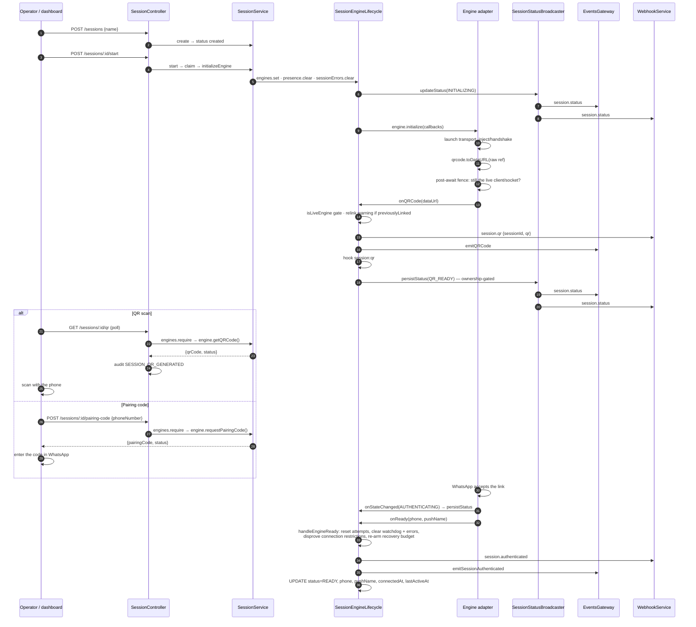

# QR and Pairing Flow

> **Source of truth:** `src/modules/session/session.service.ts`, `src/modules/session/session.controller.ts`, `src/modules/session/dto/request-pairing-code.dto.ts`, `src/modules/session/dto/session-response.dto.ts`, `src/modules/session/session-status-broadcaster.ts`, `src/modules/session/session-engine-event-wiring.ts`, `src/common/openapi/engine-status-responses.ts`
> **Band:** Session domain · **Depends on:** 20-session-lifecycle.md, 22-session-reconnect-and-liveness.md · **Jarcube class:** ENGINE-COUPLED

## Purpose

Linking a session is the one operation in OpenWA that cannot be completed by an API call. A human has to
hold a phone, and the challenge they answer expires in seconds and is regenerated repeatedly. So the
onboarding surface has an unusual job: publish a short-lived secret to whoever is watching, in three
different ways at once (a poll, a WebSocket push, a webhook), while making sure a challenge from a dead
connection is never served as if it were current — because a QR from a superseded engine links a *phantom
device* that nothing will ever tear down.

This doc covers the two link mechanisms (QR scan and 8-character pairing code), the three publication
channels, the status broadcast that drives them, and the precondition rules — which are stricter and more
interesting than they look, because on both engines the session status **trails the transport**.

## The two link mechanisms

| | QR scan | Pairing code |
| --- | --- | --- |
| Route | `GET /sessions/:sessionId/qr` | `POST /sessions/:sessionId/pairing-code` |
| Direction | Gateway → operator, continuously | Operator → gateway, on demand |
| Wire form | PNG data URL | 8 uppercase alphanumerics |
| Delivered by | poll + WebSocket + webhook | HTTP response only |
| Precondition | an engine exists and holds a QR | `qr_ready` **and** a live transport |
| Regenerated | yes, repeatedly, by the engine | no — one request, one code |
| Engine support | both | both |

Both are the same underlying WhatsApp multi-device link; the code path just differs in who initiates. The
pairing code exists because a QR requires a camera and a screen in the same room, which a headless
deployment often cannot arrange.

## The onboarding sequence



The QR arm is a **loop**, not a single step: WhatsApp expires each challenge in roughly 20 seconds, and
each engine emits a fresh `onQRCode` when it does. Every emission re-publishes on all three channels, and
`persistStatus(QR_READY)` is de-duped by the broadcaster (W-37), so the status event fires once per stage
while the QR events fire once per challenge.

## `GET /qr` — the read path

`session.service.ts:getQRCode` is short, and every branch is a distinct answer:

```ts
const session = await this.findOne(id);                       // 404 if no row
const engine = this.engines.require(id, () => new BadRequestException(
  'Session is not started. Call POST /sessions/:sessionId/start first.'));
const qrCode = engine.getQRCode();
if (!qrCode) {
  if (session.status === SessionStatus.READY) {
    throw new BadRequestException('Session is already authenticated, no QR code needed');
  }
  throw new BadRequestException('QR code is not ready yet. Please wait...');
}
return { qrCode, status: session.status };
```

| Situation | Answer |
| --- | --- |
| No such session | 404 |
| Never started / stopped | 400 `Session is not started. Call POST …/start first.` |
| Started, engine has no QR yet | 400 `QR code is not ready yet. Please wait...` |
| Already linked | 400 `Session is already authenticated, no QR code needed` |
| QR available | 200 `{qrCode, status}` |

Three things are worth noticing.

**The status is read from the row, the QR from the engine.** They are two sources, and the response carries
both, so a caller can see "the row says `qr_ready` and here is the challenge that goes with it". The
`status` in the response is whatever `findOne` returned, not a value derived from the QR's presence.

**The 400 for "not ready yet" is a poll-friendly answer, not an error condition.** This is the shape a
dashboard polls against, and it is why the route is documented as `400: QR code not ready or session
already authenticated` — one status code for two very different situations, distinguished only by the
message. That is a real wart: a client cannot branch on it programmatically. The pairing route's 409
family (below) is the better-designed sibling.

**The route is `OPERATOR`-gated and audited.** `AuditAction.SESSION_QR_GENERATED` is written on every
successful read — which means a polling dashboard produces one audit row per poll. 63-audit-logging.md.

### The QR is a data URL, and that is an engine contract

Both adapters run the raw WhatsApp reference through `qrcode.toDataURL()` before publishing, because the
dashboard renders ``. `src/modules/session/dto/session-response.dto.ts:QRCodeResponseDto`
documents it as `data:image/png;base64,...`. A caller receives a renderable image, never the raw ref — so
a non-browser consumer that wants the ref has no way to get it.

### The cached QR dies with the connection that produced it

This is the part that matters most and lives in the adapters rather than in the session module. Both
engines clear their cached `qrCode` when the status leaves `QR_READY`, and the Baileys adapter enforces it
in the status **funnel** rather than at each exit:

```ts
// src/engine/adapters/baileys-lifecycle.ts (setStatus)
if (status !== EngineStatus.QR_READY) {
  this.qrCode = null;
}
```

The comment names the bug the funnel fixes: every close sub-branch (intentional, 401, 440, 403, transient),
the accepted link, and every teardown route through `setStatus`, and the exits that did not clear it by
hand **kept serving a dead QR over `GET /qr` for the whole reconnect backoff** — up to an hour of handing
operators a challenge that could never be accepted.

Both adapters also fence the *publication* across the `toDataURL` await, which is a macrotask:

| Engine | Post-await fence |
| --- | --- |
| whatsapp-web.js | `this.client !== sourceClient \|\| tearingDown \|\| disconnectReported \|\| getStatus() === FAILED` |
| Baileys | `this.sock !== sock \|\| !sock?.ws.isOpen \|\| this.status === AUTHENTICATING` |

The whatsapp-web.js version captures the source client into a local specifically so identity can be
re-proved, and reads the status through `getStatus()` rather than `this.status` so the pre-await guard's
type narrowing does not elide the comparison — `setStatus(FAILED)` can run on another tick during the
await. The Baileys version includes `AUTHENTICATING` because publishing then would *reopen the pairing
guard on a socket committed to a restart*.

The failure both prevent is the sharp one: **a late QR publishing from a finished adapter links a phantom
device** that the lifecycle has no engine to tear down. 13-adapter-wwebjs.md and 14-adapter-baileys.md own
the adapter detail.

### The relink warning

`session-engine-event-wiring.ts:buildCallbacks` takes `previouslyLinked` — whether the session row carried
a `phone` when this engine started — and warns **once per engine start** when such a session asks for a QR
again:

> Previously linked session is asking for a QR again: its stored credentials are missing or no longer
> accepted…

It exists because a whatsapp-web.js revocation that happened while the engine was **down** leaves no other
trace: the engine simply boots into the QR screen, with no `LOGOUT`, no auth failure, and no audit row.
The warning is careful to enumerate the innocent explanations too — a `LOGOUT` close, the stuck-auth
recovery, or starting a session under a different `ENGINE_TYPE` than it was linked with all land here and
each has already logged its own warning.

One-shot per engine start via a `relinkWarned` latch, not per QR — otherwise it would fire every ~20
seconds. A lifecycle reconnect builds a new callback table from the row, which still carries the phone, so
it warns again on the next generation.

## `POST /pairing-code` — the write path

### The DTO

`src/modules/session/dto/request-pairing-code.dto.ts:RequestPairingCodeDto`:

| Field | Validation |
| --- | --- |
| `phoneNumber` | `@IsString` `@IsNotEmpty` `@Matches(/^[0-9]{6,15}$/)` |

Digits only — no `+`, spaces, or dashes — with 6–15 covering E.164. The message names the correct form and
gives an example, because "invalid phone number" for a value that differs only by a `+` is the kind of 400
that costs an hour.

`RequestPairingCodeDto` and `PairingCodeResponseDto` live in the same file. The response is
`{pairingCode: string, status: string}` — note `status` is typed `string` here, unlike
`QRCodeResponseDto`'s `SessionStatus` enum. See Open Questions.

### The service guard

```ts
const session = await this.findOne(id);
const engine = this.engines.require(id, () => new BadRequestException('Session is not started. …'));
if (session.status === SessionStatus.READY) {
  throw new BadRequestException('Session is already authenticated, no pairing needed');
}
const pairingCode = await engine.requestPairingCode(phoneNumber);
return { pairingCode, status: session.status };
```

The service checks only the two states it can answer definitively — no row (404), no engine (400), already
linked (400). Everything else is delegated to the engine, and **the engine's guard is the strict one.**

### Why `qr_ready` is necessary but not sufficient

Both adapters gate `requestPairingCode` on `QR_READY` **plus** a transport-liveness operand, and the
reasoning differs per engine in a way that is instructive about how leaky these libraries are.

**whatsapp-web.js** gates on `this.client && status === QR_READY`:

> `this.client` is assigned before `client.initialize()`, so for the whole Chromium launch — seconds on a
> modest host — a client is present while its `pupPage` is still null, and whatsapp-web.js's
> `requestPairingCode` reaches `exposeFunctionIfAbsent(this.pupPage, …)` and throws a raw `TypeError` that
> surfaces as a **500**.

And `QR_READY` is not merely a proxy for readiness — it is *the precise window this can work in*, because
the library emits `qr` only once the Store is injected and the in-page socket reports UNPAIRED, which are
exactly the preconditions the pairing flow needs.

**Baileys** gates on `this.sock?.ws.isOpen && status === QR_READY`, and needs the extra operand because
**the status trails the transport by up to 30 seconds**:

> Baileys emits its `connection.update { connection: 'close' }` only after `await ws.close()` resolves, and
> `ws` leaves a black-holed socket in CLOSING for its 30 s close timeout, so the status keeps reading
> `QR_READY` for up to half a minute after the connection stopped carrying anything.

And the consequence of getting it wrong is not a failed request but a **corrupted credential state**:

> `requestPairingCode` writes `creds.me` and emits `creds.update`, which we persist, **before** it sends —
> so a request in that window leaves the next connect trying to log in as a device that was never
> registered.

That is the sharpest single fact in this doc. A pairing request against a closing Baileys socket does not
merely fail; it writes credentials for a device WhatsApp never saw, and the session then fails to link on
every subsequent connect until the credentials are purged. `ws.isOpen` is the same predicate Baileys' own
`sendRawMessage` tests and the same liveness check `handleQrCode` makes before publishing.

whatsapp-web.js needs no equivalent operand: its page and browser death listeners fire
`handlePuppeteerDeath`, which drops the status **in the same tick**, so there the status is not the stale
value it is on Baileys.

### The 409 contract

Both guards throw `EngineNotReadyError`, which maps to 409. The route declares
`src/common/openapi/engine-status-responses.ts:PAIRING_NOT_READY_409` rather than the generic
`ENGINE_NOT_READY_409`, and the reason the constant is *separate* is worth stating: the generic wording
points the caller at `ready`, which is the wrong state here. Both engines accept a pairing request only
while the session is `qr_ready`, and a session that reads `ready` is already linked and answers **400**.

The constant's text covers four cases, and the last one is the honest admission:

| Case | Answer |
| --- | --- |
| Engine still connecting, or reconnecting after a drop | 409 — wait for `qr_ready` |
| A code was already accepted; session is moving to `ready` | 409 — wait for `ready` in this case |
| Session reads `ready` | 400 — already linked |
| Session reads `qr_ready` but the Baileys socket has begun closing | **409 while the status still says `qr_ready`** — retry; the status follows within the WebSocket's 30 s close timeout |

The last row is the same shape as the reload window `ENGINE_NOT_READY_409` names, and for the same reason:
a caller that treats the documented status as *sufficient* would read a legitimate retryable 409 as a bad
state and give up. The whole reason these two constants are separate and hand-written is that the contract
had already fallen behind the code once when the text was duplicated per controller.

Note the routes' HTTP semantics differ: `POST /pairing-code` returns **201** (no `@HttpCode` override),
while every other `POST` on the controller is explicitly `@HttpCode(HttpStatus.OK)`. See Open Questions.

## Status broadcast

`src/modules/session/session-status-broadcaster.ts:SessionStatusBroadcaster` is the single fan-out point
for every status transition, and it is what makes the dashboard's live onboarding view possible without
polling.

```ts
async updateStatus(id: string, status: SessionStatus): Promise<void> {
  await this.sessionRepository.update(id, { status });
  this.logger.debug(...);
  if (this.lastDispatchedStatus.get(id) !== status) {
    this.lastDispatchedStatus.set(id, status);
    this.eventsGateway.emitSessionStatus(id, status);
    void this.webhookService.dispatch(id, 'session.status', { sessionId: id, status });
  }
}
```

Three properties:

- **The DB write is unconditional; only the fan-out is de-duped.** So the row is always correct even when
  a transition is signalled twice, and consumers see it once. The de-dup exists because some engines
  signal one transition via **both** `onStateChanged` and a dedicated callback (`onQRCode`,
  `onDisconnected`) — W-37.
- **The webhook dispatch is fire-and-forget (`void`); the DB write is awaited.** That ordering is what lets
  `initializeEngine` track the returned promise by identity for the pre-initialize fence (W-4), which is
  also why `updateStatus` is exposed as a non-`async` delegate on the lifecycle.
- **`lastDispatchedStatus` is owned here** and aliased by reference from the lifecycle, so specs poking it
  through the lifecycle land on this instance. Cleared only on a committed delete (W-22).

### The three publication channels

| Channel | QR | Status | Consumer |
| --- | --- | --- | --- |
| Poll | `GET /qr` | `GET /sessions/:sessionId` | any HTTP client |
| WebSocket | `EventsGateway` `emitQRCode` | `emitSessionStatus` | the dashboard's sessions page |
| Webhook | `session.qr` | `session.status` | subscribed integrations |

The QR is pushed over the WebSocket specifically so clients can render it live instead of polling — the
comment in the wiring says so. 54-websocket-events.md owns the gateway and its subscribe protocol;
53-webhooks.md owns delivery, filtering, and HMAC; 81-dashboard-sessions.md owns the dashboard's
consumption of both.

### What `onReady` does besides writing the row

`session-engine-lifecycle.service.ts:handleEngineReady` is the end of onboarding and resets six things, all
of which matter to a *re*-link:

| Action | Why |
| --- | --- |
| `session.authenticated` webhook + `emitSessionAuthenticated` | the "you're linked" signal, carrying `{phone, pushName}` |
| `session:ready` hook | plugins |
| `reconnectState.attempts = 0` | a successful link ends the episode |
| `watchdog.clear(id)` | a fresh READY stretch starts the failure budget clean |
| `sessionErrors.clear(id)` | drop any stale failure reason |
| `sessionRestrictions.clearIfDisprovedByReady(id)` + announce | being linked and ready **is** what a connection-level block prevents, so `tos_block` / `proxy_block` are disproved; a `reachout_timelock` survives |
| `stuckAuthRecoveryUsed.delete(id)` | READY proves the recovery succeeded, so the one-shot budget re-arms for a future episode |
| `UPDATE status, phone, pushName, connectedAt, lastActiveAt` | fire-and-forget with a WARN on failure |

The status backfill (`seedStatuses`) is also triggered here but **only when `STATUS_SEED_ON_READY=true`**,
and the default-off reasoning is a WhatsApp behaviour worth knowing during onboarding specifically:

> On affected freshly paired whatsapp-web.js accounts, fetching `status@broadcast` before WhatsApp Web's
> first scheduled reload makes WhatsApp **revoke the companion** at that reload.

So an eager read during the most fragile window of a session's life can undo the link that was just
established. Live status events are unaffected when the backfill is disabled. 36-status-stories.md.

## Call Chain

- `session.controller.ts:getQRCode` → `session.service.ts:getQRCode` — adds the 404, the three 400 branches,
  and the audit row
- → `src/engine/engine-registry.service.ts:require` → `engine.getQRCode()` — a cached-value read, no I/O
- `session.controller.ts:requestPairingCode` → `session.service.ts:requestPairingCode` — adds the 404, the
  not-started 400, and the already-linked 400
- → `engine.requestPairingCode(phoneNumber)` → the adapter's strict guard (`QR_READY` + transport liveness)
  → 409 `EngineNotReadyError`, or the library call
- Engine `qr` event → `qrcode.toDataURL` → adapter post-await fence → `onQRCode` →
  `session-engine-event-wiring.ts:buildCallbacks` liveness gate → relink warning → webhook + WS + hook →
  `persistStatus(QR_READY)` (ownership-gated) → `SessionStatusBroadcaster` `updateStatus`
- Engine `ready` → `session-engine-lifecycle.service.ts:handleEngineReady` — the eight resets above

## Data Model / Contract

| DTO | Fields | Notes |
| --- | --- | --- |
| `src/modules/session/dto/request-pairing-code.dto.ts:RequestPairingCodeDto` | `phoneNumber: string` | digits only, 6–15 |
| `src/modules/session/dto/request-pairing-code.dto.ts:PairingCodeResponseDto` | `pairingCode: string`, `status: string` | 8 uppercase alphanumerics, e.g. `ABCD1234` |
| `src/modules/session/dto/session-response.dto.ts:QRCodeResponseDto` | `qrCode: string`, `status: SessionStatus` | `qrCode` is a `data:image/png;base64,…` URL |

Engine contract methods used (10-engine-abstraction.md, 12-engine-capability-matrix.md):

| Method | Signature | Supported on |
| --- | --- | --- |
| `getQRCode` | `(): string \| null` | both |
| `requestPairingCode` | `(phoneNumber: string): Promise<string>` | both |

## Configuration

| Env var | Default | Effect on onboarding |
| --- | --- | --- |
| `ENGINE_TYPE` | see 05-configuration-and-env.md | Which adapter links the session. **Starting a previously linked session under a different value lands on a QR**, because the auth dirs are per-engine-shape |
| `WWEBJS_AUTH_TIMEOUT_MS` | see `src/engine/engine-init-timeout.ts` | whatsapp-web.js's internal pre-QR auth budget; exhausting it throws the bare string `auth timeout`, mapped to a diagnostic 504 |
| `STATUS_SEED_ON_READY` | `false` | Off because an eager `status@broadcast` read can get a freshly paired account revoked at WhatsApp Web's first reload |
| per-session `proxyUrl` | unset | An unreachable proxy silently blocks the WhatsApp WebSocket, so **no QR is ever delivered** and the start times out at ~30 s with a 504 |

The proxy row is the single most common onboarding failure, and the DTO says so at the boundary:
`src/modules/session/dto/create-session.dto.ts:CreateSessionDto` documents that `proxyUrl` must be a real,
reachable proxy and that an unreachable value produces exactly this symptom. The 504's message names the
proxy and the `WWEBJS_AUTH_TIMEOUT_MS` knob rather than reporting a generic timeout.

Full list: APPENDIX-A-env-vars.md.

## Events Emitted / Consumed

| Event | Direction | Payload | Cadence |
| --- | --- | --- | --- |
| `session.qr` | out | `{sessionId, qr}` — `qr` is the data URL | once per challenge (~20 s) |
| `session.status` | out | `{sessionId, status}` | once per **changed** status |
| `session.authenticated` | out | `{sessionId, phone, pushName}` | once per successful link |

Hooks: `session:qr` (`{sessionId}`), `session:ready` (`{phone, pushName}`).
Audit: `SESSION_QR_GENERATED` on every successful `GET /qr`.

Full list: APPENDIX-B-events.md.

## File Inventory

| Path | Lines | Role |
| --- | --- | --- |
| `src/modules/session/session.service.ts` | 821 | `getQRCode`, `requestPairingCode` — the four-branch guards |
| `src/modules/session/session.controller.ts` | 770 | Both routes, their OpenAPI contracts, the QR audit row |
| `src/modules/session/dto/request-pairing-code.dto.ts` | 24 | Request + response for the pairing code |
| `src/modules/session/dto/session-response.dto.ts` | 142 | `QRCodeResponseDto` (and `SessionResponseDto`, owned by 20-session-lifecycle.md) |
| `src/modules/session/session-status-broadcaster.ts` | 62 | Persist + de-duped WS/webhook fan-out, `lastDispatchedStatus` |
| `src/modules/session/session-engine-event-wiring.ts` | 399 | `onQRCode`: liveness gate, relink warning, three-channel publish, `persistStatus` |
| `src/modules/session/session-engine-lifecycle.service.ts` | 1103 | `handleEngineReady` — the eight onboarding resets |
| `src/common/openapi/engine-status-responses.ts` | — | `PAIRING_NOT_READY_409`, and the `ENGINE_NOT_READY_409` it deliberately differs from |
| `src/engine/adapters/wwebjs-lifecycle.ts` | — | `qr` handler with the client-identity post-await fence; `requestPairingCode`'s `pupPage` reasoning |
| `src/engine/adapters/baileys-lifecycle.ts` | — | `handleQrCode`, the `setStatus` QR-cache funnel, `requestPairingCode`'s `ws.isOpen` operand |

Specs:

| Path | Lines | Pins |
| --- | --- | --- |
| `src/modules/session/dto/request-pairing-code.dto.spec.ts` | 19 | The digits-only pattern |
| `src/modules/session/session-status-broadcaster.spec.ts` | 105 | De-dup on a repeated status |
| `src/modules/session/session.controller.spec.ts` | 344 | Route wiring and audit ordering |
| `src/engine/adapters/baileys.adapter.spec.ts` | — | `toDataURL` is awaited and the emitted value is a data URL, not the raw ref |

## Failure Modes & Edge Cases

| Scenario | Behaviour | Notes |
| --- | --- | --- |
| `GET /qr` before start | 400 `Session is not started…` | |
| `GET /qr` while `initializing` | 400 `QR code is not ready yet. Please wait...` | Same status code as "already authenticated" — see Open Questions |
| `GET /qr` after linking | 400 `Session is already authenticated…` | |
| `GET /qr` during reconnect backoff | 400 not-ready — the cached QR was cleared by the status funnel | Prevents serving a dead challenge for up to an hour |
| QR renders after the client is replaced | Dropped by the post-await identity fence | Otherwise links a phantom device |
| Late `qr` from a re-injected client after `LOGOUT` | Dropped by the pre-await latch (`tearingDown` / `disconnectReported` / `FAILED` / `!client`) | The browser is still alive and keeps serving QRs until the lifecycle replaces the engine |
| Previously linked session shows a QR | One WARN naming the four innocent explanations | Latched per engine start |
| Pairing before `qr_ready` | 409 `PAIRING_NOT_READY_409` | Not 400 — the state is transient and retryable |
| Pairing while a code is already accepted | 409, and the guidance is "wait for `ready`" | |
| Pairing on a Baileys socket that has begun closing | **409 while the status still reads `qr_ready`** | Up to 30 s; retry |
| Pairing on whatsapp-web.js during Chromium launch | 409 from the `QR_READY` gate | Without the gate: a raw `TypeError` surfacing as 500 |
| `phoneNumber: "+628123456789"` | 400 naming the digits-only rule with an example | |
| Unreachable per-session proxy | No QR ever delivered; start times out ~30 s → 504 naming the proxy | The most common onboarding failure |
| Session started under a changed `ENGINE_TYPE` | Lands on a QR; the relink warning names this as one explanation | Auth dirs are per-engine-shape |
| Two clients poll `GET /qr` concurrently | Both get the same cached value; two audit rows | The read is a cached-value read, no engine I/O |

## Jarcube Portability

**Classification:** ENGINE-COUPLED

**Rationale:** This is the least portable subsystem in the entire doc set. QR pairing and the 8-character
pairing code are the multi-device linking protocol of an **unofficial** WhatsApp client. Meta's Cloud API
has no linking step at all: a bot is provisioned in Meta's Business Manager, and
`QuantumMind-backend/src/whatsapp/whatsapp.service.ts` receives a permanent access token and a
phone-number id. There is no challenge, no camera, no companion device, and no expiry — so there is
nothing to publish, nothing to poll, and nothing to fence.

**Prerequisites:** none. Do not port.

**Cloud API caveats:** the entire concept is absent. The nearest structural analogue to onboarding is the
webhook verification handshake — Meta `GET`s the callback URL with `hub.mode`, `hub.verify_token` and
`hub.challenge`, and the endpoint must echo the challenge — which Jarcube already implements. That is a
one-shot server-to-server exchange, not a human-in-the-loop flow with a repeatedly-regenerating secret, so
none of this band's machinery applies to it.

**Specific recommendations for Jarcube:**

- **Do not port** the QR route, the pairing route, `QRCodeResponseDto`, `PairingCodeResponseDto`,
  `PAIRING_NOT_READY_409`, or the relink warning. Each is a statement about a companion device.
- **Do port the de-duped broadcaster shape.** `SessionStatusBroadcaster` is 62 lines and its three
  properties — unconditional DB write, de-duped fan-out, awaited-write-plus-fire-and-forget-dispatch —
  generalise to any status a Jarcube entity changes and multiple channels must learn about.
  `QuantumMind-backend/src/socket/socket-state.service.ts` and the webhook path have exactly this shape,
  and the de-dup matters as soon as two code paths can signal one transition.
- **Do port the "the status trails the transport" lesson**, which is the transferable insight here even
  though the transports differ. Any precondition check on a cached status value is only as fresh as
  whatever updates that value. If Jarcube caches "this bot's token is valid", a request guard must not
  treat that cache as authoritative — the same reason Baileys needs `ws.isOpen` alongside `QR_READY`.
- **Do port the separate-constant discipline for error text.** `ENGINE_NOT_READY_409` versus
  `PAIRING_NOT_READY_409` exists because one generic message pointed callers at the wrong state, and the
  file's own header explains that eleven duplicated copies are how the contract fell behind the code.
  Shared, hand-written response constants are cheap and transport-independent.
- **Do carry over the "one 400 for two different situations" critique as a thing to avoid.** `GET /qr`
  answers "not ready yet" and "already authenticated" with the same status code, distinguished only by
  prose. A machine consumer cannot branch on that. Jarcube's own error contracts should use distinct
  codes or a stable machine code (which OpenWA does elsewhere — `SESSION_STOP_INCOMPLETE`,
  `SESSION_NAME_TEARDOWN_PENDING`) whenever a client needs to tell two cases apart.

## Open Questions

- **`GET /qr` uses one status code for two situations.** "Not ready yet" is transient and should be
  retried; "already authenticated" is terminal and should not. Both are 400 with only the message to
  distinguish them, and neither carries a machine `code` the way the session lifecycle's 409/502 shapes
  do. Whether that was a deliberate compatibility decision or simply predates the machine-code convention
  is not determinable from the source.
- **`PairingCodeResponseDto.status` is typed `string`** with the example `'qr_ready'`, while
  `QRCodeResponseDto.status` is typed `SessionStatus` with an `enum` in its schema. The published OpenAPI
  therefore describes the same field differently on two neighbouring routes. No comment explains the
  asymmetry, and both are populated from the same `session.status` value.
- **`POST /pairing-code` returns 201**, since it carries no `@HttpCode` override while every other `POST`
  on `SessionController` sets `HttpStatus.OK` explicitly. A pairing code is not a created resource, so 201
  is arguably wrong, but it is the contract clients have. Whether it is intentional was not determined.
- **`SESSION_QR_GENERATED` is audited per successful read, not per generated challenge.** A dashboard
  polling `GET /qr` produces an audit row per poll, while the *engine* generating a fresh QR produces none.
  Whether the audit is meant to record "an operator looked at a QR" (which it does) or "a QR was issued"
  (which it does not) is not stated; the action name suggests the latter.
- **Nothing in the session module validates that a pairing `phoneNumber` matches the number the session
  eventually links as.** `onReady` writes whatever `phone` the engine reports. A caller could request a
  code for one number and have someone link a different one, and the row would simply record the number
  that linked. Whether that is considered acceptable (the code is single-use and delivered only to an
  authenticated caller) was not determined.
