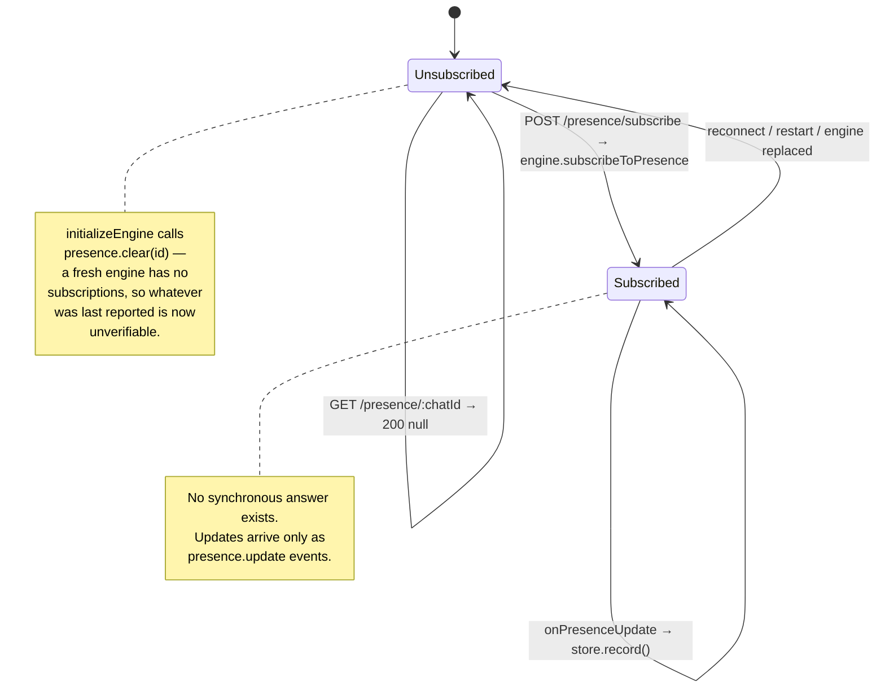
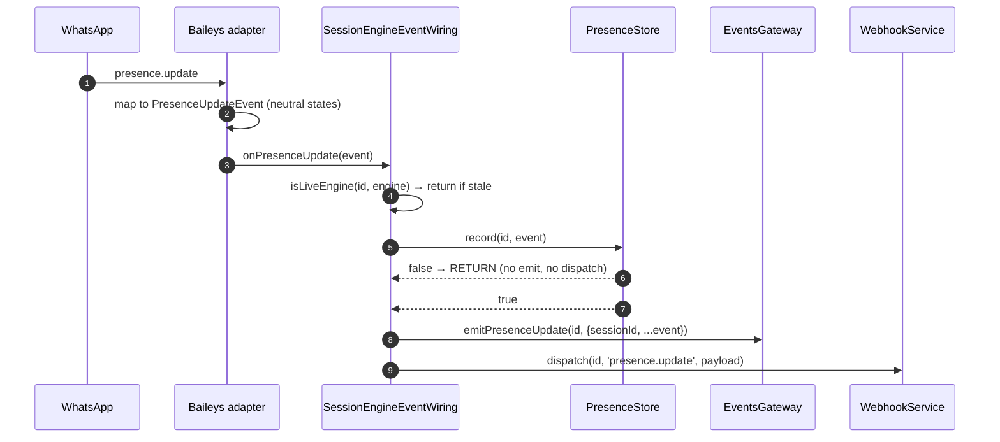

# Presence and Chat State

> **Source of truth:** `src/modules/session/presence-store.service.ts`, `src/modules/session/dto/presence.dto.ts`, `src/modules/session/dto/send-chat-state.dto.ts`, `src/modules/session/session-engine-event-wiring.ts`, `src/modules/session/session.service.ts`, `src/modules/session/session.controller.ts`
> **Band:** Session domain · **Depends on:** 20-session-lifecycle.md, 10-engine-abstraction.md · **Jarcube class:** ENGINE-COUPLED

## Purpose

Presence is the only data in OpenWA that **cannot be queried, only received**. Neither engine exposes a
read: you subscribe to a chat, WhatsApp starts pushing transitions, and the gateway's own memory is the
sole thing that can answer a `GET`. That single constraint shapes every decision here — why the store is
in memory, why a read of an unsubscribed chat is `200 null` rather than `404`, why the store rather than
the caller decides what counts as a change, and why the API documents that subscriptions do not survive a
reconnect instead of silently replaying them.

There are four separate concepts under this heading, and conflating them is the usual mistake:

| Concept | Direction | Scope | Route |
| --- | --- | --- | --- |
| **Chat presence** — who is online/typing in a chat | inbound | per chat, subscribed | `POST …/presence/subscribe`, `GET …/presence/:chatId` |
| **Own global presence** — do we appear online | outbound | account-wide | `PUT …/presence` |
| **Chat state** — show *our* typing indicator | outbound | per chat, fire-and-forget | `POST …/chats/typing` |
| **Participant presence** — one entry in a chat presence report | inbound | per participant | (payload shape) |

The first three are three different engine methods with three different failure contracts. Only the first
has any storage.

## The subscription lifecycle



**The subscription belongs to the connection.** It does not survive a restart or an automatic reconnect and
has to be re-issued. That is the *engine's* contract, not a gateway choice, and both
`session.service.ts:subscribeToPresence` and the controller's OpenAPI description say so explicitly rather
than pretending otherwise by silently replaying subscriptions on reconnect. A caller re-issues after
`session.status` reports a reconnect.

The matching cleanup is a single line in `session-engine-lifecycle.service.ts:initializeEngine`:

```ts
this.presence.clear(id);
```

with the reasoning stated inline: presence subscriptions live on the socket, so a fresh engine has none —
whatever the previous connection last reported is now **unverifiable** and would be served as if it were
current. Note this is one of only two things cleared per engine start (the other is `sessionErrors`); the
restriction store is deliberately *not* cleared, for the opposite reason. 22-session-reconnect-and-liveness.md.

`presence.clear(id)` is also called on a committed `delete()` (W-22 in 21-session-fences-and-races.md),
because presence is per-connection state a deleted session can never receive again and is keyed by an id
that will never be read.

**Subscribe per chat, not to everything.** The engine contract is explicit that this is deliberate:
WhatsApp emits a presence update on **every transition** — each time someone starts and stops typing — so
subscribing to everything turns an idle account into a firehose. There is no subscribe-all in the contract,
and the controller's description repeats the warning.

**whatsapp-web.js cannot do this at all.** It exposes no presence subscribe and emits no presence event, so
`POST /presence/subscribe` answers **501** on that engine. 12-engine-capability-matrix.md carries the full
matrix; the practical consequence is that chat presence is a Baileys-only feature in a deployment that has
not switched engines.

## `PresenceStore`

`src/modules/session/presence-store.service.ts:PresenceStore` — 83 lines, an `@Injectable()` holding
`Map<sessionId, Map<chatId, ChatPresence>>`.

### Why in memory

Two reasons, and the second is the stronger one:

1. **Presence *is* ephemeral.** "Typing, three seconds ago" has no meaning after a restart, and persisting
   it would serve confident answers about a state that expired long before.
2. **It is the only thing that can answer a read at all.** Presence cannot be queried from either library,
   only received after a subscription, so a `GET` has nothing to fetch and everything to remember.

### The stored shape

`src/modules/session/presence-store.service.ts:ChatPresence`:

| Field | Type | Notes |
| --- | --- | --- |
| `chatId` | `string` | as subscribed |
| `participants` | `ParticipantPresence[]` | a list even for 1:1, where it holds exactly one entry |
| `groupOnlineCount?` | `number` | groups only, when the engine reports it |
| `observedAt` | `number` | **Unix ms this gateway received the report — not a WhatsApp timestamp** |

`observedAt` being local-receipt time rather than a WhatsApp timestamp is called out in the interface, in
the store, and in the response DTO, because the difference matters to a consumer: an old `observedAt` means
the state is **stale**, not steady.

### `record()` decides what is news

The single most consequential method in the file. It returns whether the report **changed anything a
consumer would care about**, and the caller gates its entire fan-out on that return.

```ts
record(sessionId: string, event: PresenceUpdateEvent, at = Date.now()): boolean
```

The reason the store owns the decision rather than the wiring: the store is the only thing that knows the
previous state. The wiring says so where it uses it —

> WhatsApp reports presence on every transition and freely repeats itself, so only an actual change is
> published. Without this, one watched chat with an active typist produces a continuous stream of identical
> events — enough to **drown every other webhook a consumer subscribes to**. The store is the only thing
> that knows the previous state, so it decides.

**What counts as a change** is `src/modules/session/presence-store.service.ts:samePresence`, and its
exclusions are deliberate:

```ts
function samePresence(before: ParticipantPresence[] | undefined, after: ParticipantPresence[]): boolean {
  if (!before || before.length !== after.length) return false;
  const previous = new Map(before.map(participant => [participant.id, participant.state]));
  return after.every(participant => previous.get(participant.id) === participant.state);
}
```

| Field | Counts as a change? | Why |
| --- | --- | --- |
| `participants[].state` | **yes** | the actual signal |
| `participants[].id` set / length | **yes** | a different roster |
| `participants[].lastSeen` | **no** | moves continuously while nothing observable happens |
| `groupOnlineCount` | **no** | same — drifts on its own |
| list **order** | **no** | the engines build the list by iterating an object, so a reordering is not a presence change and must not read as one |

Treating `lastSeen` or `groupOnlineCount` as news would **defeat the suppression entirely** — they are the
fields most likely to differ between two otherwise-identical reports. Order-insensitivity is enforced by
comparing through a `Map` keyed on participant id rather than by index.

### Bounded, LRU-by-observation

```ts
const MAX_CHATS_PER_SESSION = 500;
```

Presence is only reported for chats that were **explicitly subscribed**, so the map is already
caller-bounded. The cap exists so a client that subscribes in a loop cannot grow it without limit.

Eviction is oldest-observed-first, implemented by exploiting `Map` insertion order:

```ts
chats.delete(event.chatId);
chats.set(event.chatId, next);
while (chats.size > MAX_CHATS_PER_SESSION) {
  const oldest = chats.keys().next().value;
  if (oldest === undefined) break;
  chats.delete(oldest);
}
```

The delete-then-set re-insert is what keeps the map ordered by recency; without it, insertion order would
reflect *first* observation and eviction would drop the most-watched chat. The `while` (rather than `if`)
and the `undefined` break are defensive against a cap change or an empty map.

Note the cap is per **session**, and there is no global cap across sessions. A deployment with many sessions
each subscribing to many chats is bounded by `sessions × 500` entries. Each entry is small (a chat id, a
short participant array, two numbers), so this is a sane bound rather than a tight one.

### The full method surface

| Method | Returns | Called by |
| --- | --- | --- |
| `record(sessionId, event, at?)` | `boolean` — is this news | `onPresenceUpdate` in the wiring |
| `get(sessionId, chatId)` | `ChatPresence \| null` | `session.service.ts:getPresence` |
| `clear(sessionId)` | `void` | `initializeEngine`, committed `delete()` |

There is no `size()`, no eviction metric, and no per-chat clear. `record`'s injectable `at` parameter is a
test seam.

## The inbound path



Two gates, in order, and both are cheap: the identity gate (W-33) drops a report from a superseded engine,
then the store's change gate drops a repeat. Only after both does anything leave the process.

The payload is `{ sessionId, ...event }` — so `chatId`, `participants`, and optionally `groupOnlineCount`,
with the session id prepended. Note it does **not** carry `observedAt`: that field is added by the store for
the read path only. A webhook consumer's own receipt time is the equivalent.

## Data Model / Contract

### Engine contract

`src/engine/interfaces/whatsapp-engine.interface.ts:PresenceCapability` — three methods, and the failure
contracts deliberately differ:

| Method | Signature | Best-effort? |
| --- | --- | --- |
| `sendChatState` | `(chatId, state: ChatState): Promise<void>` | **yes** — engines without a presence concept should no-op |
| `setOnlinePresence` | `(available: boolean): Promise<void>` | **no** — see below |
| `subscribeToPresence` | `(chatId: string): Promise<void>` | n/a — 501 on whatsapp-web.js |

`setOnlinePresence` is explicitly **not** best-effort, unlike `sendChatState`, and the interface explains
why: the caller asked for a specific visibility, and a swallowed failure would leave the account **silently
online** — which has a real consequence, below.

### `PresenceState` — five neutral values

`src/engine/interfaces/whatsapp-engine.interface.ts:PresenceState` = `available`, `unavailable`,
`composing`, `recording`, `paused`. The DTO documents the split a consumer needs:

- `composing` / `recording` — actively typing or recording **in this chat**
- `paused` — they stopped **without sending**
- `available` / `unavailable` — reachability, not activity

### `ChatState` — three outbound values

`src/engine/interfaces/whatsapp-engine.interface.ts:ChatState` = `typing`, `recording`, `paused`.
Deliberately *not* the same vocabulary as `PresenceState`: the inbound states are WhatsApp's
(`composing`), the outbound ones are the API's (`typing`). Only three, because `paused` is how you clear an
indicator and there is no outbound `available`.

### DTOs

`src/modules/session/dto/presence.dto.ts`:

| Class | Fields | Validation |
| --- | --- | --- |
| `SetOwnPresenceDto` | `available: boolean` | `@ToStrictBoolean()` `@IsBoolean()` |
| `SubscribePresenceDto` | `chatId: string` | `@IsString` `@IsNotEmpty` `@Matches(/^[^\s@]+@[^\s@]+$/)` |
| `ParticipantPresenceDto` | `id`, `state`, `lastSeen?` | response-only |
| `ChatPresenceResponseDto` | `chatId`, `participants`, `groupOnlineCount?`, `observedAt` | response-only |

`src/modules/session/dto/send-chat-state.dto.ts:SendChatStateDto`:

| Field | Validation |
| --- | --- |
| `chatId` | `@IsString` `@IsNotEmpty` — **no pattern** |
| `state` | `@IsIn(['typing', 'recording', 'paused'])` |

Three details worth noting.

**`@ToStrictBoolean()` on `available` is not decoration.** `src/common/utils/strict-boolean.ts` exists
because under the validation pipe's implicit conversion the *string* `"false"` becomes boolean `true` — so
`{"available": "false"}` would put the account online when the caller asked for offline. The same decorator
guards `archive` and `pin` in 26-chat-operations.md for the same reason.

**The chat-id pattern is engine-neutral by design.** `localpart@host`, no whitespace, so a different
engine's JID scheme (Baileys `…@s.whatsapp.net`, whatsapp-web.js `…@c.us`) is accepted and the adapter
normalises further. It keeps the early-400 on obvious garbage without coupling the DTO to one engine.

**`SendChatStateDto.chatId` has no pattern**, unlike `SubscribePresenceDto.chatId` and every chat-operation
DTO. Its comment says only "we require a non-empty string here". See Open Questions.

`ParticipantPresenceDto.lastSeen` documents that absence is **the common case, not an error** — most
contacts' privacy settings hide last-seen. That framing matters: a consumer that treats a missing
`lastSeen` as a fault will treat most reports as faulty.

## The three routes

### `POST /sessions/:sessionId/presence/subscribe`

`OPERATOR`, `@HttpCode(OK)`, returns `{success: true}` unconditionally — the engine call resolves `void`,
and there is nothing to report because there is no synchronous answer to give.

| Status | Meaning |
| --- | --- |
| 200 | Subscribed; updates now arrive as `presence.update` events |
| 400 | Session not started |
| 404 | Session not found |
| **501** | The active engine cannot observe presence (whatsapp-web.js) |
| 409 | `ENGINE_NOT_READY_409` — an engine exists but is not `ready` |

The route's `description` is the longest in the controller and carries three facts a caller genuinely needs:
there is no synchronous answer, the subscription is connection-scoped and must be re-issued, and a broad
subscription is a firehose.

### `PUT /sessions/:sessionId/presence`

`OPERATOR`, returns `{success: true}`. Supported on **both** engines.

The description contains the one piece of WhatsApp behaviour most likely to surprise an operator:

> WhatsApp routes notifications away from the phone while a linked device announces itself online, so a
> headless bot that never goes offline **suppresses the phone's own alerts** — set `available: false` to
> hand them back.

That is why `setOnlinePresence` is not best-effort: a swallowed failure leaves the account silently online
and the phone silently quiet. The setting is connection-scoped like the subscription and resets on
reconnect (on Baileys the socket re-announces itself per its `markOnlineOnConnect` option), so callers
re-issue after `session.status` reports one.

`PUT` rather than `POST` is correct here — it is an idempotent state assignment, not an action — and it is
the only `PUT` on the controller.

### `GET /sessions/:sessionId/presence/:chatId`

`VIEWER` — the only presence route below `OPERATOR`, correctly, since it is a read.

Returns `ChatPresenceResponseDto | null`, and **`null` is a 200, not a 404**. The reasoning is stated in
both the service and the route description: "nothing reported yet" is a normal state, not a missing
resource — either the chat was never subscribed, or nothing has changed since the subscription was made.
Answering 404 would conflate an unsubscribed chat with a nonexistent session.

The controller does one transformation: `observedAt` is stored as epoch ms and served as a `date-time`,
matching every other timestamp in the API.

```ts
return presence ? { ...presence, observedAt: new Date(presence.observedAt) } : null;
```

Only 200 and 404 (session not found) are declared. There is no 400 for "not started", because the read
never touches the engine — `session.service.ts:getPresence` calls `findOne` then reads the store, so a
stopped session with remembered presence still answers. But `initializeEngine` clears the store on the next
start, and a `stop()` does not — see Open Questions.

### `POST /sessions/:sessionId/chats/typing`

Grouped with the chat routes in the controller (its path is under `/chats`), but it is a presence operation:
`sendChatState(chatId, state)`, returns `{success: true}`, declares only 200 / 404 / 409. **No 400 is
declared**, which is inconsistent with every other chat route — see Open Questions.

Best-effort by contract: an engine without a presence concept may no-op, and the route still answers
`{success: true}`.

## Call Chain

- `session.controller.ts:subscribeToPresence` → `session.service.ts:subscribeToPresence` — adds the 404 and
  the not-started 400 → `engine.subscribeToPresence(chatId)` → 501 or the library call
- `session.controller.ts:setOnlinePresence` → `session.service.ts:setOnlinePresence` → `engine.setOnlinePresence(available)`
- `session.controller.ts:getPresence` → `session.service.ts:getPresence` — adds the 404 only →
  `presence-store.service.ts:get` — **no engine involvement**
- `session.controller.ts:sendChatState` → `session.service.ts:sendChatState` → `engine.sendChatState(chatId, state)`
- Engine `presence.update` → `session-engine-event-wiring.ts:buildCallbacks` `onPresenceUpdate` →
  `isLiveEngine` gate → `presence-store.service.ts:record` change gate → `emitPresenceUpdate` +
  `dispatch('presence.update')`
- `session-engine-lifecycle.service.ts:initializeEngine` → `presence-store.service.ts:clear`
- `session-engine-controls.ts` committed `delete()` → `presence-store.service.ts:clear`

## Configuration

None. There is no env var for the per-session chat cap (500), and no way to disable the change-suppression
in `record()`. Both are module constants.

`presence.update` is filterable like any webhook event — a consumer that does not want the volume simply
does not subscribe to it. 53-webhooks.md.

Full list: APPENDIX-A-env-vars.md.

## Events Emitted / Consumed

| Event | Direction | Payload | Cadence |
| --- | --- | --- | --- |
| `presence.update` | out (webhook + WS) | `{sessionId, chatId, participants[], groupOnlineCount?}` | once per **changed** state per subscribed chat |

Consumed: the engine's `onPresenceUpdate` callback. Nothing else in the module consumes presence — no hook,
no audit row, no metric.

Note the asymmetry with `session.status`: the status de-dup lives in the broadcaster, while the presence
de-dup lives in the *store*. Both exist for the same reason (engines repeat themselves), but presence's has
to be in the store because only the store holds the previous value.

Full list: APPENDIX-B-events.md.

## File Inventory

| Path | Lines | Role |
| --- | --- | --- |
| `src/modules/session/presence-store.service.ts` | 83 | The store, `record`'s change decision, `samePresence`, the 500-chat LRU cap |
| `src/modules/session/dto/presence.dto.ts` | 73 | `SetOwnPresenceDto`, `SubscribePresenceDto`, `ParticipantPresenceDto`, `ChatPresenceResponseDto` |
| `src/modules/session/dto/send-chat-state.dto.ts` | 24 | `SendChatStateDto` — `chatId` + the three-value `state` |
| `src/modules/session/session.service.ts` | 821 | `subscribeToPresence`, `setOnlinePresence`, `getPresence`, `sendChatState` |
| `src/modules/session/session.controller.ts` | 770 | The four routes and their contracts, incl. the `observedAt` transform |
| `src/modules/session/session-engine-event-wiring.ts` | 399 | `onPresenceUpdate` — the identity gate and the store-gated fan-out |
| `src/modules/session/session-engine-lifecycle.service.ts` | 1103 | `presence.clear(id)` on every engine start |
| `src/engine/interfaces/whatsapp-engine.interface.ts` | — | `PresenceCapability`, `PresenceState`, `ParticipantPresence`, `PresenceUpdateEvent`, `ChatState` |

Specs:

| Path | Lines | Pins |
| --- | --- | --- |
| `src/modules/session/presence-store.service.spec.ts` | 165 | Change detection incl. the `lastSeen` / order exclusions, LRU eviction at the cap |
| `src/modules/session/session.controller.spec.ts` | 344 | Route wiring, the `observedAt` transform, the `null` 200 |

## Failure Modes & Edge Cases

| Scenario | Behaviour | Pinned by |
| --- | --- | --- |
| `GET /presence/:chatId` for an unsubscribed chat | **200 with a `null` body** — a normal state, not a 404 | `session.controller.spec.ts` |
| `GET /presence/:chatId` on a stopped session | Serves whatever was remembered; no engine needed | — |
| Subscribe on whatsapp-web.js | **501** — the engine exposes no presence subscribe and emits no presence event | 12-engine-capability-matrix.md |
| Reconnect after subscribing | Subscription silently gone; store cleared on the next `initializeEngine`; caller must re-subscribe | — |
| Same presence reported repeatedly | `record()` returns false; **no** emit, **no** webhook | `presence-store.service.spec.ts` |
| Only `lastSeen` changed | Not news — suppressed | `presence-store.service.spec.ts` |
| Only `groupOnlineCount` changed | Not news — suppressed, though the stored entry is refreshed | `presence-store.service.spec.ts` |
| Participants reported in a different order | Not news — comparison is by id, not index | `presence-store.service.spec.ts` |
| Participant roster grows or shrinks | News — length differs | `presence-store.service.spec.ts` |
| 501st chat subscribed for one session | Oldest-**observed** chat evicted | `presence-store.service.spec.ts` |
| Presence report from a superseded engine | Dropped by `isLiveEngine` before it reaches the store | — |
| `{"available": "false"}` | Rejected as a non-boolean rather than coerced to `true` | `@ToStrictBoolean` |
| Headless bot left `available: true` forever | The phone's own notifications stay suppressed — documented, not prevented | — |
| `sendChatState` on an engine without a presence concept | No-op, still `{success: true}` — best-effort by contract | — |
| `setOnlinePresence` fails at the engine | **Throws** — not swallowed, because a silent failure leaves the account online | — |
| Session deleted with presence held | Cleared on the committed delete | `session.service.spec.ts` |

## Jarcube Portability

**Classification:** ENGINE-COUPLED

**Rationale:** Chat presence is a capability of the WhatsApp **multi-device protocol** as reached through
Baileys. Meta's Cloud API exposes no presence at all: there is no subscribe, no `presence.update` webhook
field, no typing indicator to observe, and no last-seen. So the inbound half of this doc has no counterpart
in `QuantumMind-backend/src/whatsapp/whatsapp.service.ts` and cannot be built.

The outbound half is *nearly* portable in concept and not in fact. The Cloud API has typing indicators only
as a very recent, narrow feature and no "appear online" concept whatsoever, because a Cloud API number is
not a companion device — there is no phone whose notifications could be suppressed, which is the entire
rationale for `setOnlinePresence`.

**Prerequisites:** none. Do not port.

**Cloud API caveats:** the closest analogue to the store's *job* is a short-TTL cache of something only
observable via webhook. Jarcube does receive Cloud API status webhooks (`sent`/`delivered`/`read`), which
share presence's essential shape: push-only, ephemeral, and unqueryable. That is the place the pattern
transfers, not the API surface.

**Specific recommendations for Jarcube:**

- **Do port the "the store decides what is news" pattern.** This is the genuinely valuable idea here, and
  it is 15 lines. Any push-only, freely-repeating upstream needs de-dup, and the de-dup **must** live where
  the previous value lives — not in the caller, which would have to fetch it back. Jarcube's inbound
  webhook path in `QuantumMind-backend/src/message-handler/message-handler.service.ts` receives repeated
  Cloud API status callbacks and has the same shape.
- **Do port `samePresence`'s field exclusions as a discipline.** Deciding *explicitly* which fields
  constitute a change, and excluding the ones that drift continuously, is what makes suppression actually
  suppress. Including a monotonic timestamp in the comparison is the single easiest way to build a de-dup
  that never dedups anything, and it fails silently — the events keep flowing and nobody notices the guard
  is inert.
- **Do port the order-insensitive comparison technique** (compare through a `Map` keyed on a stable id,
  never by array index) for anything where an upstream builds a list by iterating an object. This is a
  general JSON-payload hazard.
- **Do port the bounded LRU-by-recency idiom.** The delete-then-set re-insert to exploit `Map` insertion
  order is four lines and gives a correct recency-ordered cache with no dependency. Jarcube's
  `socket-state.service.ts` holds per-connection state with, as far as this analysis went, no cap.
- **Do port "absence is a normal state, so 200 with null, not 404".** It applies to any read backed by a
  cache that may legitimately be empty, and it saves every consumer from treating a normal condition as an
  error.
- **Do port `@ToStrictBoolean` if Jarcube's validation pipe does implicit conversion.** `"false"` → `true`
  is a real, silent, semantics-inverting bug on any boolean flag, and this band uses the same guard on
  three separate DTOs.
- **Do not port** `subscribeToPresence`, `setOnlinePresence`, `PresenceState`, `ParticipantPresence`,
  `ChatPresenceResponseDto`, or the three routes. All are statements about a companion device on the
  unofficial protocol.

## Open Questions

- **`SendChatStateDto.chatId` carries no `@Matches` pattern** while `SubscribePresenceDto.chatId` and all
  six chat-operation DTOs do, using the identical engine-neutral `localpart@host` check. The comment says
  only that the adapter validates and normalises, which is equally true of the others. Whether this is a
  deliberate looseness or an omission is not determinable from the source; the practical effect is that
  garbage reaches the adapter on this one route.
- **`POST /chats/typing` declares no 400** while every other chat and presence route declares
  `400: Session not ready` or `400: Session not started`. The service does call `requireEngine`, so a
  not-started session *does* produce a 400 — it is simply undocumented, which means the published OpenAPI
  is incomplete for this route.
- **`stop()` does not clear the presence store.** Only `initializeEngine` and a committed `delete()` do. So
  a stopped session serves its last-known presence from before the stop, with an `observedAt` that is the
  only hint it is stale. Since the stated reason for clearing on start is that the data becomes
  "unverifiable" once the socket is gone, the same argument applies at stop — and stop is when the socket
  actually goes away. Whether keeping it is deliberate (`observedAt` lets a caller judge staleness) or
  simply not considered is not stated anywhere.
- **`presence.update` omits `observedAt`** while the `GET` includes it. A webhook consumer can use its own
  receipt time, and for a live push those are nearly identical — but a delayed webhook delivery (the outbox
  retrying) would carry no indication of how old the state is. Whether the omission is deliberate was not
  determined.
- **There is no per-chat unsubscribe**, on the engine contract or the API. A caller that subscribed to 500
  chats can only stop the flow by stopping the session, and the 501st subscription silently evicts the
  oldest chat's *stored state* without unsubscribing it upstream — so events for an evicted chat still
  arrive and are treated as brand-new (no previous value ⇒ `samePresence` returns false ⇒ always news).
  That means exceeding the cap converts suppression into amplification for the evicted chats. Whether that
  interaction was considered is not evident from the code or the comments.
