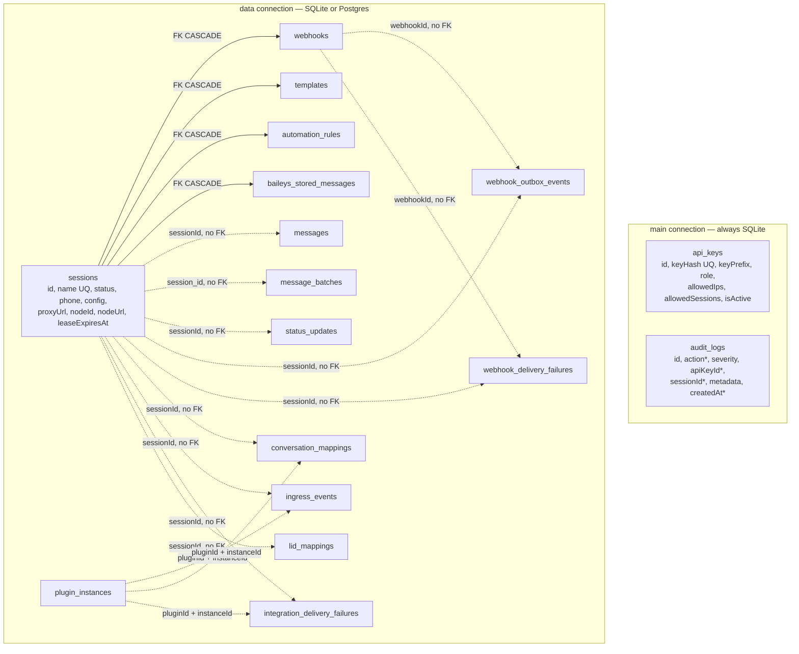
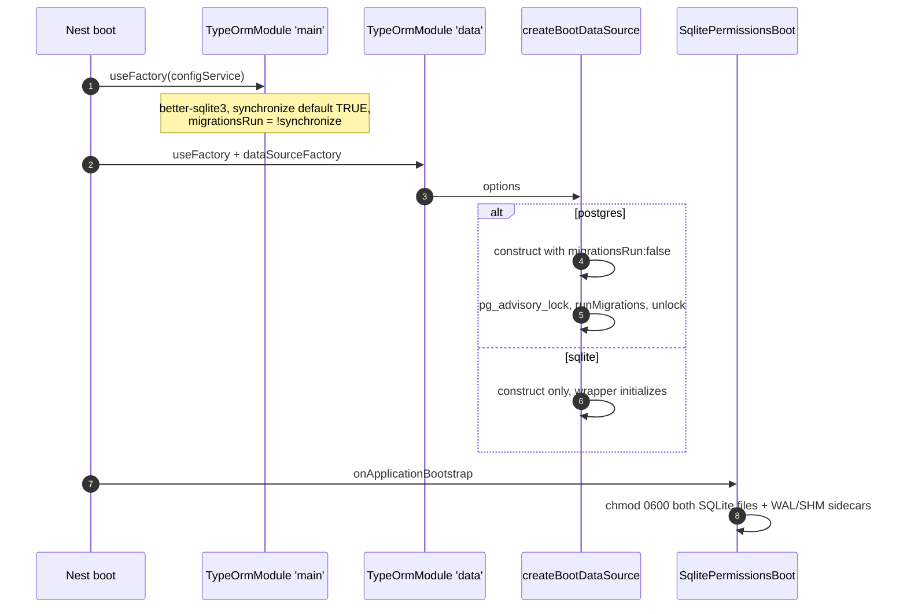

# Database Design

> **Source of truth:** `src/app.module.ts`, `src/common/utils/column-types.ts`, `src/common/transformers/date.transformer.ts`, `src/common/utils/paginate.ts`, `src/common/utils/db-errors.ts`, and the 17 `*.entity.ts` files
> **Band:** Data and infrastructure · **Depends on:** 05-configuration-and-env.md · **Jarcube class:** PORTABLE

## Purpose

Two TypeORM connections, seventeen entities, one pluggable dialect. The design decision that shapes
everything here is that **auth/audit and application data live in separate databases**, and only one
of them is pluggable: the `main` connection is hardcoded `better-sqlite3`, the `data` connection is
SQLite or Postgres. A naive implementation would use one connection, one dialect, and native
`jsonb`/`timestamp` columns — and each of those three choices has a specific, documented production
failure attached to it in this repo.

OpenWA's own `docs/` set covers the tables well in its chapter 05, *Database Design*. This doc documents
the implementation: which connection owns which entity, which type helpers are safe on which connection,
and where the entity metadata and the migration chain deliberately disagree.

<!-- COUNT:entities=17 -->

## The two connections

Both are registered in `src/app.module.ts` via `TypeOrmModule.forRootAsync`, named `main` and `data`.

| | `main` | `data` |
| --- | --- | --- |
| Driver | `better-sqlite3`, **always** | `better-sqlite3` or `postgres` (`DATABASE_TYPE`) |
| File / DSN | `database.database`, default `./data/main.sqlite` | `dataDatabase.*`, default `./data/openwa.sqlite` |
| Entities | `src/modules/auth/**`, `src/modules/audit/**` | session, webhook, message, template, engine, integration, status-store, automation globs |
| Migrations | `src/database/migrations-main/` | `src/database/migrations/` |
| `synchronize` default | **true** (`MAIN_DATABASE_SYNCHRONIZE`) | **false** (`DATABASE_SYNCHRONIZE`) |
| `migrationsRun` | `!synchronize` | `!synchronize` on SQLite; hardcoded `true` on Postgres |
| Entity count | 2 | 15 |

The `synchronize`/`migrationsRun` inversion is the same rule on both: exactly one mechanism owns the
schema, never both. The defaults differ because they answer different questions — `main` must exist on
a zero-config first boot or authentication fails outright, while `data` carries the tables whose shape
migrations have had to correct.

Two consequences that are easy to miss:

- **`jsonColumnType()` and `dateColumnType()` are DATA-CONNECTION ONLY.** They resolve the dialect from
  the global `DATABASE_TYPE`, so calling them on a `main`-connection entity would emit a
  `jsonb`/`timestamp` column on a database that is always SQLite. `src/modules/audit/entities/audit-log.entity.ts`
  therefore hardcodes `simple-json` and `datetime`, and says so in a comment.
- **A SQLite `DATABASE_NAME` that resolves to the `main` file is rejected at boot** and, separately, in
  both CLI data sources. Two TypeORM connections on one SQLite file would run two migration ledgers and
  two synchronize policies against the same tables. See 71-migrations.md.

## File Inventory

### Entity ownership

Line counts as measured; they drift.

| Entity | Table | File | Lines | Conn |
| --- | --- | --- | --- | --- |
| `ApiKey` | `api_keys` | `src/modules/auth/entities/api-key.entity.ts` | 56 | main |
| `AuditLog` | `audit_logs` | `src/modules/audit/entities/audit-log.entity.ts` | 129 | main |
| `Session` | `sessions` | `src/modules/session/entities/session.entity.ts` | 103 | data |
| `Message` | `messages` | `src/modules/message/entities/message.entity.ts` | 124 | data |
| `MessageBatch` | `message_batches` | `src/modules/message/entities/message-batch.entity.ts` | 91 | data |
| `Webhook` | `webhooks` | `src/modules/webhook/entities/webhook.entity.ts` | 63 | data |
| `WebhookOutboxEvent` | `webhook_outbox_events` | `src/modules/webhook/entities/webhook-outbox-event.entity.ts` | 69 | data |
| `WebhookDeliveryFailure` | `webhook_delivery_failures` | `src/modules/webhook/entities/webhook-delivery-failure.entity.ts` | 55 | data |
| `Template` | `templates` | `src/modules/template/entities/template.entity.ts` | 47 | data |
| `AutomationRule` | `automation_rules` | `src/modules/automation/entities/automation-rule.entity.ts` | 62 | data |
| `StatusUpdate` | `status_updates` | `src/modules/status-store/entities/status-update.entity.ts` | 60 | data |
| `PluginInstance` | `plugin_instances` | `src/modules/integration/entities/plugin-instance.entity.ts` | 40 | data |
| `IngressEvent` | `ingress_events` | `src/modules/integration/entities/ingress-event.entity.ts` | 81 | data |
| `ConversationMapping` | `conversation_mappings` | `src/modules/integration/entities/conversation-mapping.entity.ts` | 38 | data |
| `IntegrationDeliveryFailure` | `integration_delivery_failures` | `src/modules/integration/entities/integration-delivery-failure.entity.ts` | 41 | data |
| `BaileysStoredMessage` | `baileys_stored_messages` | `src/engine/adapters/baileys-stored-message.entity.ts` | 34 | data |
| `LidMapping` | `lid_mappings` | `src/engine/identity/lid-mapping.entity.ts` | 31 | data |

Two entities live in `src/engine/` rather than a module, because they are engine-specific state that
the neutral tables must not carry: the Baileys message store exists only because the library ships
none, and the LID table is a WhatsApp identity concern. Both are still swept into the `data`
connection by the `src/engine/**/*.entity` glob.

### Supporting files

| Path | Lines | Role |
| --- | --- | --- |
| `src/app.module.ts` | 328 | Registers both connections; the `main`/`data` factories live here |
| `src/common/utils/column-types.ts` | 36 | `jsonColumnType`, `dateColumnType` — data connection only |
| `src/common/transformers/date.transformer.ts` | 25 | `DateTransformer` — data connection only |
| `src/common/utils/paginate.ts` | 36 | `DEFAULT_LIST_LIMIT`, `resolveListWindow`, `paginate` |
| `src/common/utils/db-errors.ts` | 66 | `isUniqueViolation`, `isMissingTableError` |
| `src/database/sqlite-file-permissions.ts` | 58 | Re-tightens both SQLite files to 0600 on every boot |

Specs: `src/database/docs-schema-accuracy.spec.ts`, `src/database/sqlite-file-permissions.spec.ts`, and
the drift gate at `src/database/migrations/__tests__/migration-drift.spec.ts` (see 71-migrations.md).

## ERD

Only three tables carry a real foreign key. Everything else references a session by id as
*provenance*, deliberately without an FK, so the row outlives the session.

Solid edges are declared FKs with `onDelete: 'CASCADE'`; dashed edges are id references with no
constraint. The split is a policy, stated in the entity comments: operational and audit-shaped data
(`webhook_delivery_failures`, `integration_delivery_failures`, `audit_logs`) must survive the session
it references, and `lid_mappings` / `conversation_mappings` are explicitly last-write-wins caches
whose rows outlive any one session.

## Data model

### `sessions`

| Column | Type | Notes |
| --- | --- | --- |
| `id` | `varchar` PK | `@PrimaryGeneratedColumn('uuid')`, but a **varchar** column — see the uuid normalisation in 71-migrations.md |
| `name` | `varchar(100)` unique | Also the engine auth-directory key; sink-guarded by `src/common/utils/path-safety.ts:isSafeSessionName` |
| `status` | `varchar(50)` | `SessionStatus`, 8 values, default `created` |
| `phone`, `pushName` | `varchar(20)`, `varchar(100)` | nullable |
| `config` | `jsonColumnType()` | default `'{}'` |
| `proxyUrl`, `proxyType` | `varchar(255)`, `varchar(10)` | per-session proxy |
| `connectedAt`, `lastActiveAt` | `dateColumnType()` + `DateTransformer` | nullable |
| `nodeId` | `varchar(190)` | which process hosts the engine; NULL = unclaimed |
| `claimedAt`, `leaseExpiresAt` | `dateColumnType()` | the ownership lease |
| `nodeUrl` | `varchar(2048)` | where the owner answers HTTP, for peer forwarding |
| `createdAt`, `updatedAt` | `@CreateDateColumn` / `@UpdateDateColumn` | |

Two fields on the class are **not columns**: `lastError` and `restriction`. They are populated at read
time from in-memory stores, and the comments state why — they are runtime state that resets when the
engine re-initialises. Ownership semantics are in 23-session-ownership-and-takeover.md.

### `messages`

The hottest table, and the one whose indexes were tuned most deliberately.

| Column | Type | Notes |
| --- | --- | --- |
| `id` | `varchar` PK | uuid strategy |
| `sessionId` | `varchar` | **no standalone index**, on purpose |
| `waMessageId` | `varchar` nullable | NULL for transient outgoing `pending` rows |
| `chatId`, `from`, `to` | `varchar` | |
| `chatName`, `author` | `varchar` nullable | `author` is the participant JID for group posts (`from` is the group) |
| `body` | `text` nullable | |
| `type` | `varchar` default `text` | |
| `direction` | `varchar` default `outgoing` | `MessageDirection` |
| `timestamp` | `bigint` + `bigintToNumberTransformer` | |
| `metadata` | `jsonColumnType()` | carries the inline base64 media copy |
| `mediaPath`, `mediaMimetype` | `varchar` nullable | opt-in chat-media archive; see 34-media-pipeline.md |
| `status` | `varchar` default `sent`, indexed | `MessageStatus` |
| `createdAt` | `@CreateDateColumn`, indexed | |

Indexes, and the reasoning attached to each:

| Index | Shape | Why |
| --- | --- | --- |
| `UQ_messages_sessionId_waMessageId` | unique `(sessionId, waMessageId)` | The engine re-fires the inbound `message` event; a blind insert stored the same message twice. Also serves the ack-driven status UPDATE. |
| *(unnamed)* | `(sessionId, createdAt)` | Session timeline reads |
| `IDX_messages_createdAt` | `(createdAt)` | The stats aggregates range on `createdAt` alone. The composite leads with `sessionId`, so it cannot serve them — SQLite needs `ANALYZE` for a skip-scan and Postgres has none at all. |
| `IDX_messages_mediaPath` | partial, `WHERE mediaPath IS NOT NULL` | Backs the orphan sweep's chunked `mediaPath IN (...)`. The column is NULL for every row while archiving is off (the default), so a full index would mostly index NULLs. |
| *(unnamed)* | `(chatId)` | |
| — | ~~`(sessionId)`~~ | **Dropped.** Every lookup it served leads with `sessionId` in a composite already, so it was pure write-time cost on the hottest table. |

`bigintToNumberTransformer` is exported from this file and reused by `status_updates`. It exists
because a `bigint` column reads back as a **string** on Postgres (pg avoids >2^53 precision loss) and
as a **number** on SQLite. WhatsApp epoch values are far below 2^53, so the transformer coerces reads
to a number and every consumer — entity, DTO, three SDKs, dashboard — can declare `number`.

### `message_batches`

The only table using `snake_case` column names (`batch_id`, `session_id`, `current_index`,
`created_at`, …) via explicit `name:` options. Uniqueness is
`UQ_message_batches_session_id_batch_id` on `(sessionId, batchId)` — scoped to the session, because the
original global `UNIQUE(batch_id)` let one session deny a batch id to every other. See 33-bulk-messaging.md.

### `webhooks` / `webhook_outbox_events` / `webhook_delivery_failures`

| Table | Key structure | Role |
| --- | --- | --- |
| `webhooks` | `IDX_webhooks_sessionId` | Subscription. `events` defaults to `'["message.received"]'`, `filters` nullable = no filtering, `retryCount` default 3. FK CASCADE to sessions. |
| `webhook_outbox_events` | unique `(webhookId, idempotencyKey)`, plus `(state, createdAt)` | Durable pre-attempt record. `state` ∈ `pending`/`dispatched`/`failed`, nullable. |
| `webhook_delivery_failures` | `(sessionId)` and `(webhookId, idempotencyKey)` | DLQ of record, append-only, never pruned. |

The outbox carries the **retired-payload rule**, shared with `ingress_events`: `payload` is only
populated while the row is the sole durability handle. Once an outcome is recorded, the dispatch tier
(the BullMQ job, or the DLQ row) owns the payload and the column is set to NULL. A dispatched or
failed row then costs a few columns instead of a whole message body.

`state` is **nullable with no DB default**, and the comment is emphatic about why: a
`DEFAULT 'pending'` would also stamp pre-upgrade rows on a synchronize-bootstrapped database, and the
reconciler would mass-replay the entire history on deploy. NULL reads as "not watched". The same
pattern governs `ingress_events.dispatchState`. Details in 53-webhooks.md.

### `ingress_events`

| Column | Type | Notes |
| --- | --- | --- |
| `id` | `varchar` `@PrimaryColumn` | **Host-minted** `crypto.randomUUID()`, not DB-generated: the row id and the job id (= deliveryId) are decoupled on purpose |
| `instanceId`, `pluginId`, `providerDeliveryId`, `route` | `varchar` | |
| `payload` | `jsonColumnType()` nullable | headers/query/body/rawBody; retired to NULL after the outcome |
| `payloadHash` | `varchar` nullable | sha256 of rawBody, kept permanently |
| `sessionId` | `varchar` nullable | |
| `dispatchState` | `varchar` nullable | `pending`/`dispatched`/`failed` |
| `dispatchAttempts` | `int` default 0 | reconciler replay budget |
| `lastDispatchAt` | `dateColumnType()` + `DateTransformer` | |
| `createdAt` | `@CreateDateColumn` | |

Indexes: unique `(pluginId, instanceId, providerDeliveryId)` — `pluginId` is in the key because
`instanceId` is only unique *within* a plugin, so two plugins sharing an instanceId string would drop
each other's deliveries as false duplicates. Plus `(createdAt)` for retention and
`(dispatchState, createdAt)` for the reconciler sweep.

### `status_updates`

TTL store for WhatsApp Status posts. `postedAt` and `expiresAt` are both `bigint` epoch-ms through
`bigintToNumberTransformer`, `expiresAt` is indexed for the reaper, and `(sessionId, waStatusId)` is
unique. `mediaOmitted` + `omitReason` (`over_cap` / `engine_omitted` / `write_failed`) record *why* a
media blob is absent rather than leaving the reader to guess.

### `lid_mappings`

The one entity with a natural (non-uuid) primary key: `lid` is the PK. `phone` is nullable **so a
negative result can be cached** — a lid that was looked up and could not be resolved — which keeps
active lookups to one network call per unknown lid. `sessionId` is provenance only and explicitly not
an FK, because the row is a global, cross-session cache that outlives any session. Reverse lookup
(`phone` → lids) is indexed for the message from-filter.

### `plugin_instances`

`id` is a composite string `` `${pluginId}:${instanceId}` `` as `@PrimaryColumn`, with a redundant
unique index on the two parts. `secret` is the ingress HMAC secret, **stored plaintext** and masked to
`***` on API reads — and the comment notes an asymmetry worth knowing: instance `config` is *not*
secret-redacted.

### `api_keys` and `audit_logs`

`api_keys` hashes the key (`keyHash` unique, `varchar(64)`) and keeps a `keyPrefix` for display —
widened to `varchar(12)` to match what the auth service actually writes. `allowedIps` and
`allowedSessions` are `simple-array`. `audit_logs` indexes `action`, `apiKeyId`, `sessionId` and
`createdAt` individually, and `AuditAction` enumerates 40 actions across nine families. Two of them
carry a sampling rule in the source: `RATE_LIMIT_EXCEEDED` and `SEND_PACING_BLOCKED` are capped at one
row per subject per minute, because enforcing a limit must not become an audit-write flood of its own.
See 50-auth-and-api-keys.md and 63-audit-logging.md.

## Cross-dialect helpers

### `src/common/utils/column-types.ts`

Two functions, 36 lines, and one of them is a constant that used to be a branch.

`jsonColumnType()` returns `'simple-json'` on **both** dialects. That is the interesting part. The
obvious implementation returns `jsonb` on Postgres, and this repo tried it: the baseline migration had
created those columns as `text` on Postgres too, and the pg driver only auto-parses *real* json/jsonb
columns. A `jsonb`-typed entity reading an actual `text` column hands back a raw string —
`webhook.events` arrived as the literal string `'["message.received"]'`, and the dashboard's
`events.map()` threw, taking the whole page down. `simple-json` parses on read regardless of dialect,
which matches the real columns. Nothing is lost because no native JSON queries exist; all JSON
filtering happens in JS.

`dateColumnType()` does still branch: `'timestamp'` on Postgres, `'text'` on SQLite.

### `src/common/transformers/date.transformer.ts`

`DateTransformer` pairs with `dateColumnType()`. `from()` normalises a string or Date to a Date;
`to()` writes a Date on Postgres and an ISO string on SQLite. Same DATA-CONNECTION-ONLY constraint,
same reason.

There is a subtlety the migration chain has to know about: a plain `@CreateDateColumn` and a
`dateColumnType()` column are **not the same SQLite type**. TypeORM emits `datetime` for the former and
this helper resolves `text` for the latter, so `webhook_outbox_events` has to declare both spellings in
one `CREATE TABLE` (`AddWebhookOutboxEvents1786200000000` says so explicitly). Guessing one type for
both fails the drift gate.

### `src/common/utils/paginate.ts`

`DEFAULT_LIST_LIMIT = 1000` serves as both the default and the ceiling.
`resolveListWindow` clamps `limit` to `[1, 1000]` and `offset` to `>= 0`, treating non-finite input as
unset; `paginate()` slices an in-memory array with it. The reason it exists is stated plainly:
engine-backed list endpoints (contacts, groups, chats) can return the operator's entire address book,
and serialising tens of thousands of items into one JSON body is a heap/GC hazard.

The scoping rule matters for a port: **pagination is applied at the HTTP/service boundary only.** The
engine still returns the full set to in-process callers such as plugins, so clamping the response
never narrows what those consumers see.

### `src/common/utils/db-errors.ts`

Two predicates, and both are more careful than they look.

`isUniqueViolation` classifies by driver code first (`23505` on Postgres,
`SQLITE_CONSTRAINT_UNIQUE`/`SQLITE_CONSTRAINT_PRIMARYKEY` on SQLite) and falls back to a
`/UNIQUE constraint failed/i` message match **only for the bare unsuffixed `SQLITE_CONSTRAINT`**. The
comment explains why precision matters as much as recall: SQLite prefixes *every* constraint failure
with `SQLITE_CONSTRAINT`, including FK, NOT NULL and CHECK, so a prefix match would swallow a genuine
persistence failure as "already stored" — the message projector would mark a message
`isNewMessage=false` on an FK error and silently drop it, and session/template creates would answer a
misleading 409.

`isMissingTableError` keeps a table-clearing DELETE tolerant of an absent table while still surfacing
locks, I/O errors and syntax errors — the opposite of a blind `.catch(() => {})`. Postgres has a
precise code (`42P01`); SQLite is matched by message only, because its generic `SQLITE_ERROR` is shared
with syntax errors.

Both avoid `instanceof` as the sole test, and that is the load-bearing detail. better-sqlite3's native
addon is cached process-wide and builds its `SqliteError` from whichever realm loaded it first, and
each copy of TypeORM carries a distinct `QueryFailedError` class. Both set a stable `name`, so
classification is done on that. There is also a shape-specific carve-out: better-sqlite3 validates SQL
at `prepare()` time and TypeORM's query runner creates the statement *outside* its try/catch, so a
missing-table error surfaces as the raw `SqliteError`, never wrapped.

## Flow

## Call Chain

- `src/app.module.ts` → `src/config/configuration.ts` for `database.*` (main) and `dataDatabase.*` (data)
- `src/app.module.ts` → `src/database/pg-boot-migrations.ts:createBootDataSource` as the `data`
  connection's `dataSourceFactory` — adds cross-replica migration serialisation on Postgres only
- `src/database/sqlite-file-permissions.ts:SqlitePermissionsBoot` → `tightenSqliteFilePermissions` —
  adds owner-only permissions on both DB files after every DataSource has initialised
- entity → `src/common/utils/column-types.ts:jsonColumnType` / `dateColumnType` — adds dialect
  resolution; valid on `data` entities only
- service → `src/common/utils/db-errors.ts:isUniqueViolation` — adds insert-or-converge semantics
  without a driver dependency

## Configuration

| Env var | Default | Effect |
| --- | --- | --- |
| `DATABASE_TYPE` | `sqlite` | Selects the `data` dialect. Also read directly by the two column-type helpers. |
| `DATABASE_NAME` | `./data/openwa.sqlite` / `openwa` | SQLite file path, or Postgres database name |
| `MAIN_DATABASE_NAME` | `./data/main.sqlite` | The always-SQLite auth/audit file |
| `DATABASE_SYNCHRONIZE` | `false` | Entity-driven schema on `data`. Refused with Postgres. |
| `MAIN_DATABASE_SYNCHRONIZE` | `true` | Entity-driven schema on `main` |
| `POSTGRES_SCHEMA` | `public` | Sets TypeORM `schema` **and** the session `search_path` |
| `DATABASE_POOL_SIZE` | `10` | pg pool `max` |
| `DATABASE_STATEMENT_TIMEOUT_MS` | `30000` | Runtime query ceiling; boot migrations lift it per transaction |
| `DATABASE_IDLE_TIMEOUT_MS` | `30000` | pg pool idle timeout |
| `DATABASE_CONNECTION_TIMEOUT_MS` | `10000` | pg connect timeout |
| `DATABASE_SSL` / `DATABASE_SSL_REJECT_UNAUTHORIZED` | `false` / `true` | TLS to Postgres |
| `DATABASE_LOGGING` | `false` | **Logs query parameters** — message bodies and phone numbers. Never leave on. |

Full list: APPENDIX-A-env-vars.md.

`POSTGRES_SCHEMA` deserves one note: setting TypeORM's `schema` option alone does **not** set
`search_path`, and every migration in this repo issues raw unqualified DDL. Without the extra
`options: '-c search_path=<schema>,public'`, the tables would land in `public` while the migration
ledger landed in the configured schema.

## Events Emitted / Consumed

None. Entities are persistence only; the events that reference these rows are documented per-module.
Full list: APPENDIX-B-events.md.

## Failure Modes & Edge Cases

| Scenario | Behaviour |
| --- | --- |
| `DATABASE_SYNCHRONIZE=true` with Postgres | Rejected at boot. Synchronize would drop the migration-created `body_ts` generated tsvector every restart, so `/search` would 501 after each boot. |
| `DATABASE_NAME` resolving to the main SQLite file | Rejected at boot **and** by both CLI data sources |
| Bare `DATABASE_NAME=openwa` with SQLite | Rejected — it would become the SQLite *file path* under a read-only rootfs → `SQLITE_CANTOPEN` boot loop |
| A `jsonb` column against a `simple-json` entity | Raw string handed back on Postgres; historically a full dashboard crash. `jsonColumnType()` returning a constant is what prevents it. |
| `bigint` read on Postgres | String, coerced to number by `bigintToNumberTransformer`; a non-numeric read becomes null rather than `NaN` |
| Duplicate `(sessionId, waMessageId)` insert | Unique violation, classified by `isUniqueViolation`, converged by the projector |
| Non-unique SQLite constraint failure | Deliberately **not** classified as a duplicate — surfaces as a real error |
| Table-clearing DELETE on an absent table | Tolerated via `isMissingTableError`; every other failure still propagates |
| SQLite files created with umask permissions | Re-tightened to 0600 (plus `-wal`/`-shm`/`-journal`) on every boot |
| Entity metadata vs migration chain disagreement | 95 known-drift statements on `data`, 10 on `main`, pinned verbatim. See 71-migrations.md. |

## Jarcube Portability

**Classification:** PORTABLE

**Rationale:** Nothing in the type helpers, pagination or error classification knows anything about
WhatsApp. `QuantumMind-backend/` already runs NestJS + TypeORM (`QuantumMind-backend/src/database/database.providers.ts`),
so the mechanisms transfer as code rather than as ideas.

**Prerequisites:** none for the utilities. The *entities* are not a lift-and-shift: eleven of the
fifteen `data` entities describe concepts a Cloud API deployment either does not have (sessions, QR,
LID mapping, Baileys stored messages) or models differently.

**Cloud API caveats:** `sessions` has no counterpart — Meta's Cloud API has no session or pairing
concept, so the ownership/lease columns (`nodeId`, `claimedAt`, `leaseExpiresAt`, `nodeUrl`) describe a
problem Jarcube does not have. `lid_mappings` and `baileys_stored_messages` are engine artefacts and
should not be ported at all.

**Specific recommendations for Jarcube:**

1. **Take `src/common/utils/db-errors.ts` nearly verbatim.** Both predicates are dialect-portable and
   both encode a subtle correctness rule — the SQLite over-swallow and the cross-realm `instanceof`
   problem — that is easy to get wrong and silent when you do.
2. **Take `bigintToNumberTransformer`** if any table stores epoch values in a `bigint`. The
   string-on-Postgres/number-on-SQLite split is a real contract break across an SDK boundary.
3. **Take the `paginate` ceiling-as-default idea** for any list endpoint fed from an upstream API.
   The `[1, MAX]` clamp with non-finite-as-unset is five lines and removes an unbounded-response class.
4. **Copy the retired-payload rule** for any outbox/inbox table. `payload` populated only while the
   row is the sole durability handle, plus a permanent content hash, keeps a durable log from becoming
   a storage problem.
5. **Copy the nullable-state-with-no-default rule** for any lifecycle column added to an existing
   table. A `DEFAULT 'pending'` on a backfilled column is how an upgrade mass-replays history.
6. **Do not copy the two-connection split unless you need it.** OpenWA's reason is specific: the auth
   and audit store must exist and stay SQLite regardless of what the operator picked for application
   data. If Jarcube has one database, one connection is simpler and the DATA-CONNECTION-ONLY hazard
   around the type helpers disappears with it.
7. **If you keep a pluggable dialect, adopt `jsonColumnType()` returning a constant.** The dashboard
   crash it prevents is exactly the failure mode a `jsonb`-on-Postgres helper produces against columns
   that were created as `text`.

## Open Questions

- `message_batches` is the only table using `snake_case` column names. Whether that was deliberate or
  an early inconsistency later frozen by the migration chain is not determinable from the code.
- `Message.metadata` is typed `Record<string, unknown>` without `nullable` on the TypeScript side while
  the column is `nullable: true`. Reads can therefore hand back `null` against a non-optional type.
- `plugin_instances.secret` is stored in plaintext and masked on read. Whether encryption at rest was
  considered and rejected (and on what grounds) is not recorded in the source.
- `webhook_delivery_failures` is documented as append-only and never pruned, and
  `AddWebhookDeliveryFailureLookupIndex1786300000000` says so again. No retention knob for it appears
  in the config tree; whether one is intended is not stated.
