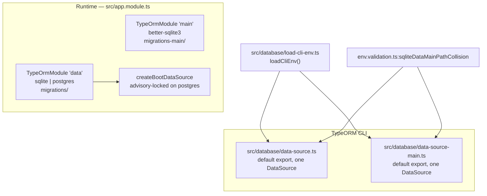

# Migrations

> **Source of truth:** `src/database/data-source.ts`, `src/database/data-source-main.ts`, `src/database/pg-boot-migrations.ts`, `src/database/load-cli-env.ts`, `src/database/sqlite-file-permissions.ts`, `src/database/migrations/`, `src/database/migrations-main/`
> **Band:** Data and infrastructure · **Depends on:** 70-database-design.md, 05-configuration-and-env.md · **Jarcube class:** PORTABLE

## Purpose

Thirty-one forward migrations on the `data` connection, one on `main`, two standalone CLI data sources,
and a gate that pins the exact disagreement between the migration chain and the entity metadata. The
problem a naive implementation gets wrong here is that OpenWA supports **two schema-management paths at
once** — `synchronize` for zero-config first boots, migrations for everything else — against **two
dialects**, and a migration therefore has to be correct on a database it did not create. Almost every
guard in this chain exists because that specific combination broke.

<!-- COUNT:migrations=31 -->

**31** forward migrations on the `data` connection, plus **1** on `main`. The count marker above is
verified against `src/database/migrations/` on every run, excluding the 20 spec files under
`src/database/migrations/__tests__`.

## File Inventory

Line counts as measured; they drift.

| Path | Lines | Role |
| --- | --- | --- |
| `src/database/data-source.ts` | 100 | CLI DataSource for the `data` connection, both dialects |
| `src/database/data-source-main.ts` | 43 | CLI DataSource for the always-SQLite `main` connection |
| `src/database/pg-boot-migrations.ts` | 106 | `createBootDataSource` — advisory-locked boot migrations |
| `src/database/load-cli-env.ts` | 20 | The app's env precedence for a CLI that never runs `ConfigModule` |
| `src/database/sqlite-file-permissions.ts` | 58 | Owner-only permissions on both SQLite files, every boot |
| `src/database/migrations/` | 31 files, 1,732 lines | The `data` chain |
| `src/database/migrations-main/` | 1 file, 70 lines | The `main` chain |
| `src/database/migrations/__tests__/migration-drift.spec.ts` | 148 | Chain-vs-entity drift gate |
| `src/database/migrations/__tests__/__fixtures__/known-migration-drift.json` | — | 95 `data` + 10 `main` pinned statements |

Per-migration and per-source specs: `src/database/data-source.spec.ts`,
`src/database/data-source-main.spec.ts`, `src/database/load-cli-env.spec.ts`,
`src/database/pg-boot-migrations.spec.ts`, `src/database/sqlite-file-permissions.spec.ts`,
`src/database/add-uuid-defaults-migration.spec.ts`, `src/database/add-integration-fabric.spec.ts`,
`src/database/add-integration-uuid-defaults.spec.ts`,
`src/database/add-webhooks-sessionid-index.spec.ts`,
`src/database/session-ownership-migrations.spec.ts`, `src/database/docs-schema-accuracy.spec.ts`, plus 18
per-migration specs under `src/database/migrations/__tests__/`.

## The dual-DataSource split

Four entry points reach a database, and they must agree about which one.



`src/database/data-source.ts` (100 lines) is the `data` CLI source. Three things about it are
deliberate:

- **The entity globs are scoped, not `**`.** Eight explicit module globs (session, webhook, message,
  template, engine, integration, status-store, automation) mirror the runtime `data` connection. A
  broad glob would sweep in the `main`-owned auth/audit entities and pollute `migration:generate`
  against the data DB with their DDL.
- **Postgres is exported as plain `DataSourceOptions`, not a `DataSource`.** The CLI's
  `loadDataSource()` rejects a file exporting more than one `DataSource` instance, so keeping the
  Postgres config as an options object leaves exactly one instance export — the default — and every
  `migration:*` command resolves it. `buildPostgresDataSourceOptions(env)` is exported as a builder so
  the schema/search_path logic is unit-testable without mutating `process.env`.
- **No `statement_timeout` in `extra`.** This connection runs migrations, and a long `CREATE INDEX` or
  backfill must not be aborted mid-flight. Pool resilience knobs (`idleTimeoutMillis`,
  `connectionTimeoutMillis`) are set; the statement ceiling is not.

`src/database/data-source-main.ts` (43 lines) is the `main` CLI source: always `better-sqlite3`, always
`./data/main.sqlite` (or `MAIN_DATABASE_NAME`), auth+audit entities, `migrations-main`, `synchronize:
false`. It exists because the default CLI source only manages the `data` connection — and the moment
`MAIN_DATABASE_SYNCHRONIZE=false` is set, the auth schema has to be managed by CLI instead.

Both re-apply `src/config/env.validation.ts:sqliteDataMainPathCollision` explicitly. The reason is
stated in both files: **the TypeORM CLI never runs `ConfigModule`'s `validate()`**, so none of the
boot-time guards apply. The one that matters for a DDL-issuing connection is the main/data file
collision, and a shared broken env must refuse *both* migration entry points, not just one.

### `src/database/load-cli-env.ts`

Twenty lines, and the smallest file in this band that fixes a real production bug. It reproduces
`src/main.ts`'s precedence for the CLI: `clearBlankEnv` first, then `.env`, then
`data/.env.generated`, both `override: false`.

Without it the migration CLI read `process.env` only. An install configured through the dashboard —
which writes `data/.env.generated` — was therefore invisible to it, so `migration:run:prod` ran against
the **default SQLite database** even on a deployment the operator had switched to PostgreSQL. `cwd` is
injectable purely for testing.

The blank-clearing step is not optional here either. Compose forwards `${KEY:-}`, which renders an
empty string that still occupies `process.env` and blocks both file layers under `override: false`. See
05-configuration-and-env.md for the full mechanism.

## Boot migrations under an advisory lock

`src/database/pg-boot-migrations.ts` (106 lines) replaces TypeORM's built-in `migrationsRun` for the
Postgres `data` connection, and only for it.

`createBootDataSource` is wired as the connection's `dataSourceFactory` in `src/app.module.ts`. For any
non-Postgres options it constructs and returns immediately, leaving `@nestjs/typeorm`'s default
construct-then-initialize path untouched. For Postgres it:

1. constructs the DataSource with `migrationsRun: false` — so `initialize()` never starts migrations
   unsynchronised;
2. initialises it;
3. opens a **separate** `pg.Client`, takes `pg_advisory_lock`, runs `runMigrations()` with the same
   transaction mode `initialize()` would have used, then unlocks;
4. on any failure, destroys the DataSource before rethrowing, so a boot retry loop cannot stack pools.

The lock key is `POSTGRES_BOOT_MIGRATION_LOCK_KEYS = [0x4f5741, 0x626f6f74]` — `"OWA"` and `"boot"` as
ASCII bytes. It uses the **two-int4 form** rather than a single bigint because a single bigint key
would exceed `Number.MAX_SAFE_INTEGER` and stop being exact in JavaScript. The values are fixed so
every process and every version agrees.

Three details in `lockClientConfig` are worth internalising, because each is a trap:

| Detail | Why |
| --- | --- |
| `options: '-c statement_timeout=0'` | `statement_timeout` applies to *any* command, **including the wait inside `pg_advisory_lock`**. A config `statement_timeout: 0` would not work: pg drops falsy values from the startup packet. The startup `options` string also overrides any role- or database-level default. |
| `connectionTimeoutMillis` mirrored from `extra` | Bounds a stuck connect the same way the pool does |
| Unlock in a `finally`, then `end()` in an outer `finally` | The lock is session-scoped, so tearing the session down releases it even when the unlock statement itself fails. No crashed boot can leave it held. |

`lock_timeout` needs no override — it never applies to advisory locks.

What this buys: replicas that boot simultaneously serialise instead of racing DDL against a shared
migrations ledger. The lock holder applies the chain; every other process waits inside
`pg_advisory_lock`, then finds a filled ledger and applies nothing. `charts/openwa/values.yaml` says
so directly — Postgres boot migrations are no longer a reason to keep `replicaCount` at 1; the
process-local state is.

The `synchronize`/`migrationsRun: true` pair is still set on the Postgres branch in
`src/app.module.ts`, and the comment explains why: it states the intent and remains the built-in
fallback if the factory is ever bypassed.

## SQLite file permissions

`src/database/sqlite-file-permissions.ts` (58 lines) is not a migration but it belongs to the same boot
step.

better-sqlite3 creates files with `0666 & umask` — usually `0644` — while every sibling secret under
`data/` was tightened to `0600`. That matters because **these files are secret stores**:
`openwa.sqlite` holds webhook and plugin-instance HMAC secrets and session proxy URLs in plaintext.
The container deployment is insulated by a named volume and a non-root user; bare-metal and bind-mount
hosts are not.

`tightenSqliteFilePermissions(paths, warn)` chmods each path plus its `-wal`, `-shm` and `-journal`
sidecars to `0600`, best-effort — a failure is logged and skipped, never allowed to fail boot.
`SqlitePermissionsBoot` applies it on `onApplicationBootstrap`, which is safe because DataSources
initialise eagerly inside their provider factories and Nest runs every `onModuleInit` before any
`onApplicationBootstrap`, so both files exist by then. It runs on **every** boot, matching the
re-tighten-on-start posture the credential directories use, so a file recreated by a restore converges
back.

## The `data` chain, chronologically

All 31 are hand-authored rather than generated (`migration:generate` produces spurious multi-table
rebuilds against this schema — see the drift gate below), all are idempotent, and all are cross-dialect.

| # | Migration | What it does |
| --- | --- | --- |
| 1 | `AddMessageStatus1770108659848` | The **baseline**: `sessions`, `webhooks`, `messages`, `message_batches`, four message indexes, and the webhooks CASCADE FK. Separate SQLite and Postgres bodies. Early-returns if `sessions` already exists, so a synchronize-built DB records it without colliding. |
| 2 | `NormalizeSynchronizeUuidColumns1770200000000` | Repairs a Postgres schema bootstrapped with `DATABASE_SYNCHRONIZE=true`. Converts 9 generated-uuid PKs and 3 session-FK columns from native `uuid` to `varchar` in lockstep, dropping and recreating the CASCADE FKs, then sets the `gen_random_uuid()::varchar` defaults. |
| 3 | `AddUuidDefaultsForPostgres1779235200000` | Adds `DEFAULT gen_random_uuid()::varchar` to `id` on the four baseline tables. No-op on SQLite. |
| 4 | `AddTemplates1779840000000` | Creates `templates` with a CASCADE FK and `IDX_templates_sessionId` |
| 5 | `AddMessageSessionWaIndex1779900100000` | `IDX_messages_sessionId_waMessageId` for the ack-driven status UPDATE |
| 6 | `AddBaileysStoredMessages1781000000000` | Creates `baileys_stored_messages` + its unique and eviction indexes |
| 7 | `AddTemplateNameUnique1781100000000` | Dedupes `(sessionId, name)` **losslessly** — earliest row keeps the name, others become `<name>-dup-<id>` — then adds the unique index |
| 8 | `AddLidMappings1781200000000` | Creates `lid_mappings` + `IDX_lid_mappings_phone` |
| 9 | `AddMessagesWaMessageIdUnique1781300000000` | Deletes duplicate `(sessionId, waMessageId)` rows (a duplicate *is* the same message), then swaps the plain index for a unique one. NULL `waMessageId` rows are exempt. |
| 10 | `AddWebhookFilters1781500000000` | Adds `webhooks.filters` as `text` on both dialects |
| 11 | `DropRedundantMessagesSessionIdIndex1781600000000` | Drops the standalone `messages(sessionId)` index by its baseline-generated name |
| 12 | `AddWebhookDeliveryFailures1781700000000` | Creates the webhook DLQ table + `(sessionId)` index. No FK — operational data outlives its session. |
| 13 | `ScopeBatchIdUniqueToSession1781800000000` | Global `UNIQUE(batch_id)` → `UNIQUE(session_id, batch_id)`, via the TypeORM schema API so SQLite's table rebuild is handled for it |
| 14 | `AddIntegrationFabric1781900000000` | Creates `plugin_instances`, `conversation_mappings`, `ingress_events`, `integration_delivery_failures` and their indexes |
| 15 | `AddMessageChatName1782000000000` | Adds `messages.chatName` |
| 16 | `WidenIngressDedupKey1782100000000` | Ingress dedup key `(instanceId, providerDeliveryId)` → `(pluginId, instanceId, providerDeliveryId)`. A pure loosening. |
| 17 | `AddWebhooksSessionIdIndex1782200000000` | `IDX_webhooks_sessionId` — dispatch looked up a session's webhooks on every event with no index on the FK column |
| 18 | `AddIntegrationUuidDefaults1782300000000` | The uuid default for the two Integration Fabric tables created after migration 3 and therefore missed by it |
| 19 | `AddMessagesFts1782400000000` | DB-native FTS. Postgres: a STORED generated `body_ts` tsvector (config `simple`) + GIN index. SQLite: an FTS5 external-content table keyed on `rowid`, trigger-maintained, backfilled once — **skipped without throwing** if the build lacks FTS5. |
| 20 | `CreateStatusUpdates1784822470680` | Creates `status_updates` + its three indexes |
| 21 | `AddMessageAuthor1784908800000` | Adds `messages.author` |
| 22 | `AddIngressEventDispatchState1785112230000` | Adds `dispatchState`, `dispatchAttempts`, `lastDispatchAt` + the `(dispatchState, createdAt)` sweep index, and backfills existing rows to `dispatched` |
| 23 | `AddMessagesCreatedAtIndex1785123853000` | `IDX_messages_createdAt` for the createdAt-only stats range scans |
| 24 | `SlimIngressEventPayload1785600000000` | Makes `payload` nullable, adds permanent `payloadHash`, and retires the payload of every existing non-`pending` row. Postgres alters in place; SQLite rebuilds the table (it cannot drop a NOT NULL). |
| 25 | `AddMessageMediaArchive1785700000000` | Adds `messages.mediaPath` and `mediaMimetype` |
| 26 | `AddSessionOwnership1785800000000` | Adds `nodeId`, `claimedAt`, `leaseExpiresAt`. Each column probed independently, so an interrupted run still completes. |
| 27 | `AddAutomationRules1785900000000` | Creates `automation_rules` with a CASCADE FK + `IDX_automation_rules_sessionId` |
| 28 | `AddSessionNodeUrl1786000000000` | Adds `sessions.nodeUrl varchar(2048)` |
| 29 | `AddMessageMediaPathIndex1786100000000` | Partial `IDX_messages_mediaPath WHERE mediaPath IS NOT NULL` |
| 30 | `AddWebhookOutboxEvents1786200000000` | Creates `webhook_outbox_events` + its unique and sweep indexes |
| 31 | `AddWebhookDeliveryFailureLookupIndex1786300000000` | `(webhookId, idempotencyKey)` for the before-insert duplicate lookup |

### `migrations-main`

One migration, `CreateAuthAuditTables1779900000000` (70 lines): `api_keys` + its unique `keyHash`
index, and `audit_logs` + its four indexes, all `IF NOT EXISTS`. It exists because the `main`
connection was previously schema-managed by `synchronize: true` with no migrations at all — so turning
synchronize off would have left a fresh install with **no `api_keys` table and total auth failure at
boot**. It runs when `MAIN_DATABASE_SYNCHRONIZE=false`, via `migrationsRun: !synchronize`.

## Five recurring patterns

Read these once and most of the chain becomes predictable.

### 1. The `hasTable` / `hasColumn` early return

Every `CREATE TABLE` migration checks first and returns if the object exists. This is the
**synchronize → migrations adoption path**: a database whose schema `synchronize` built has an empty
migrations ledger, so TypeORM tries to run the chain from scratch and collides on existing tables
(`table sessions already exists`). Early-returning lets TypeORM record the migration as applied without
re-issuing the DDL.

The corresponding `down()` uses `DROP ... IF EXISTS`, because on such a database the migration was
recorded via the early return and the named indexes were never created.

### 2. `SET LOCAL statement_timeout = 0`, Postgres-guarded

The runtime `data` pool carries a `statement_timeout` (default 30s), and boot migrations run on it. Six
migrations lift it for their own transaction: 7, 9, 17, 19, 23, 29, 31. `SET LOCAL` is
transaction-scoped and auto-reverts at COMMIT; the dialect guard is required because **SQLite rejects
the statement syntactically**.

`AddMessageMediaPathIndex1786100000000` and `AddWebhookDeliveryFailureLookupIndex1786300000000` add the
sharpest version of the reasoning: `MigrationExecutor` wraps a lone pending migration in its *own*
transaction, so no earlier migration's `SET LOCAL` is in effect. Each index migration must lift it
itself or a `CREATE INDEX` over a large `messages` table is cancelled, aborting the ledger-advancing
transaction and crash-looping the boot retries.

`CONCURRENTLY` is deliberately not used — it cannot run inside a transaction, and the migration notes
judge the boot-time blocking window acceptable for a self-hosted gateway in exchange for consistency
with the sibling index migrations.

### 3. Raw dialect-aware column probes instead of `getTable()`

Migrations 21, 22, 24, 25, 26 hand-roll a `hasColumn` helper: `information_schema.columns` on Postgres,
`PRAGMA table_info` on SQLite. The reason is specific and would be very hard to diagnose from a stack
trace. Since migration 19 added the STORED generated column `body_ts`, loading the `messages` table
metadata on Postgres makes TypeORM look the expression up in `typeorm_metadata` — a table nothing in
that migration context creates, because the schema builder only creates it for entity-declared
generated columns. The lookup fails with `relation typeorm_metadata does not exist`.

### 4. The pgcrypto version gate

`gen_random_uuid()` is core from PostgreSQL 13 and lives in pgcrypto on ≤ 12. Migrations 2, 3 and 18
all probe `current_setting('server_version_num')` with a **non-erroring catalog query** — never a
caught SQL exception, which would poison the migration transaction — and only touch pgcrypto on ≤ 12.
On 13+ nothing is touched at all, because `CREATE EXTENSION` needs a privilege managed Postgres
(RDS, Cloud SQL) often withholds, and running it unconditionally crash-loops boot there. When the role
genuinely cannot create it, the error is a written instruction rather than a raw permission denial.

### 5. Lossless dedup before a unique constraint

Migrations 7 and 9 both add uniqueness to a table that may already violate it, and they resolve it
differently on purpose:

- `templates` **renames** losers to `<name>-dup-<id>` — `substr(name,1,59) || '-dup-' || id` is ≤ 100
  chars so it cannot overflow the `varchar(100)` column on Postgres. No row is ever deleted, because two
  templates sharing a name are two different templates.
- `messages` **deletes** losers, because a duplicate `(sessionId, waMessageId)` *is* the same message.

Both keep the earliest row by `createdAt ASC, id ASC` — a stable tiebreak.

## The drift gate

`src/database/migrations/__tests__/migration-drift.spec.ts` (148 lines) is the most consequential test
in this band, and the one most worth copying.

It builds each connection's **full chain** on an in-memory SQLite DataSource, then asks TypeORM's
schema builder what it would change to match the entity metadata — via `builder.log()`, which is
TypeORM's own dry run: it computes every statement the sync *would* run and returns them without
executing one. The result is compared against a pinned snapshot at
`src/database/migrations/__tests__/__fixtures__/known-migration-drift.json`: **95 statements** for
`data`, **10** for `main`.

Two design choices in it are load-bearing.

**The snapshot is verbatim, not classified by statement shape.** On SQLite the schema builder resolves
a column change by rebuilding the whole table — `CREATE temporary_X` + `INSERT` + `DROP` + `RENAME`,
plus every index — and emits a bare `CREATE INDEX` for a new index. Those are the *same shapes* the
known drift produces, so any filter broad enough to pass the known set also passes a new column and a
new index: exactly what the gate exists to catch. Full statement text has no such blind spot.

**The comparison is a multiset, not a set.** 32 of the 95 `data` statements are repeats, because the
rebuild cycle drops and recreates the same index on more than one table pass. A set comparison would
pass a change that only alters *how many times* a statement is emitted — one rebuild pass appearing or
disappearing leaves the distinct-statement list identical.

The known drift itself is cosmetic: the baseline created dated columns as `datetime` while the entities
declare `dateColumnType()` = `text` on SQLite (both TEXT affinity, so the data is identical), plus
index-name differences where TypeORM's hash names differ from the migration-declared ones. The header
carries an explicit instruction: when it fails, read the diff before touching the snapshot —
"unexpected" statements are schema the entities declare and the migrations do not create, which reaches
production as a 500 `no such column` on the first query that touches it. Regenerate only when you have
deliberately changed the known drift, and expect the count to go **down**.

The `importMigrations` helper also throws on any non-migration file in a chain directory, which is why
the `__tests__` subdirectory is filtered explicitly.

Nine further specs in `src/database/` cover individual migrations, and
`src/database/docs-schema-accuracy.spec.ts` checks the schema documentation against the code.

## npm script pairs

Every migration command exists twice — dev against TypeScript, prod against compiled JS. The `typeorm`
script is `typeorm-ts-node-commonjs`; `typeorm:prod` is plain `typeorm`.

| Purpose | Dev | Prod |
| --- | --- | --- |
| Run data migrations | `migration:run` → `-d src/database/data-source.ts` | `migration:run:prod` → `-d dist/database/data-source.js` |
| Revert data | `migration:revert` | `migration:revert:prod` |
| Show data | `migration:show` | `migration:show:prod` |
| Run main migrations | `migration:run:main` | `migration:run:main:prod` |
| Revert main | `migration:revert:main` | `migration:revert:main:prod` |
| Show main | `migration:show:main` | `migration:show:main:prod` |
| Generate | `migration:generate` / `migration:generate:main` | — |
| Create empty | `migration:create` | — |

Generation has no prod variant, correctly — generating a migration from a compiled build is not a thing
you want. `migration:create` and `migration:generate` both take `$npm_config_name`, i.e.
`npm run migration:create --name=AddThing`.

## Flow

```mermaid
sequenceDiagram
  autonumber
  participant OP as Operator / boot
  participant ENV as loadCliEnv or load-env
  participant GUARD as sqliteDataMainPathCollision
  participant DS as DataSource
  participant LOCK as pg advisory lock
  participant LEDGER as migrations table

  OP->>ENV: process.env > .env > data/.env.generated
  ENV->>GUARD: resolved DATABASE_NAME / MAIN_DATABASE_NAME
  GUARD-->>OP: throw if the data path resolves to the main file
  OP->>DS: construct (migrationsRun:false on postgres)
  DS->>DS: initialize
  alt postgres
    DS->>LOCK: pg_advisory_lock(0x4f5741, 0x626f6f74)
    Note over LOCK: peer replicas block here
    DS->>LEDGER: runMigrations()
    DS->>LOCK: pg_advisory_unlock, then end()
  else sqlite, synchronize off
    DS->>LEDGER: migrationsRun during initialize()
  else sqlite, synchronize on
    DS->>DS: schema built from entity metadata; chain not run
  end
```

## Call Chain

- `src/app.module.ts` → `src/database/pg-boot-migrations.ts:createBootDataSource` — adds cross-replica
  serialisation for the Postgres branch only
- `src/database/pg-boot-migrations.ts:createBootDataSource` → `DataSource.runMigrations` under the lock
  — adds the guarantee that exactly one process applies the chain
- `src/database/data-source.ts` → `src/database/load-cli-env.ts:loadCliEnv` → `src/config/env-precedence.ts:clearBlankEnv`
  — adds the app's env precedence to a CLI that never runs `ConfigModule`
- `src/database/data-source.ts` → `src/config/env.validation.ts:sqliteDataMainPathCollision` — adds the
  one boot guard a DDL-issuing connection cannot do without
- `src/database/sqlite-file-permissions.ts:SqlitePermissionsBoot` → `tightenSqliteFilePermissions` —
  adds owner-only permissions after every DataSource has initialised

## Configuration

| Env var | Default | Effect |
| --- | --- | --- |
| `DATABASE_TYPE` | `sqlite` | Selects which `data` branch — and therefore whether the advisory lock is taken |
| `DATABASE_SYNCHRONIZE` | `false` | `true` means the chain does **not** run on SQLite. Refused with Postgres. |
| `MAIN_DATABASE_SYNCHRONIZE` | `true` | `false` hands the auth schema to `migrations-main` |
| `MAIN_DATABASE_NAME` | `./data/main.sqlite` | Read identically by the app and the main CLI source |
| `POSTGRES_SCHEMA` | `public` | Non-public also sets `search_path`, because the migrations issue unqualified DDL |
| `DATABASE_LOGGING` | `false` | Passed through to both CLI sources |
| `DATABASE_STATEMENT_TIMEOUT_MS` | `30000` | The runtime ceiling six migrations lift per transaction |

Full list: APPENDIX-A-env-vars.md.

## Events Emitted / Consumed

None. Full list: APPENDIX-B-events.md.

## Failure Modes & Edge Cases

| Scenario | Behaviour | Pinned by |
| --- | --- | --- |
| Two replicas boot simultaneously on Postgres | Serialised by the advisory lock; the loser finds a filled ledger | `src/database/pg-boot-migrations.spec.ts`, `__tests__/pg-boot-migrations.pg.spec.ts` |
| `statement_timeout` set and a large `CREATE INDEX` pending alone | Lifted per transaction; without it the ledger transaction aborts and boot crash-loops | the six `SET LOCAL` migrations |
| Advisory-lock wait exceeding `statement_timeout` | Prevented by `-c statement_timeout=0` in the lock client's startup options | `src/database/pg-boot-migrations.spec.ts` |
| Boot crashing while holding the lock | Session-scoped lock; `end()` in a `finally` tears the session down | — |
| `initialize()` succeeding then migrations failing | DataSource destroyed before rethrow, so retries do not stack pools | — |
| Migration chain run against a synchronize-built schema | Every create early-returns; TypeORM records it as applied | `1770108659848-AddMessageStatus.spec.ts` and siblings |
| Postgres schema built with `synchronize` (native uuid PKs) | Migration 2 converts 9 PKs + 3 FKs to varchar before the first collision | `src/database/add-uuid-defaults-migration.spec.ts` |
| PostgreSQL ≤ 12 without pgcrypto and no privilege | Actionable error naming the exact `CREATE EXTENSION` to run | — |
| SQLite build without FTS5 | Migration 19 leaves no FTS schema and returns; the search provider 501s and the app still boots | `1782400000000-AddMessagesFts.spec.ts` |
| Pre-existing `(sessionId, name)` template duplicates | Renamed, never deleted; ≤ 100 chars guaranteed | `1781100000000-AddTemplateNameUnique.spec.ts` |
| Pre-existing duplicate messages | Losers deleted; NULL `waMessageId` rows exempt | `1781300000000-AddMessagesWaMessageIdUnique.spec.ts` |
| Interrupted `AddSessionOwnership` | Each column probed independently, so a re-run completes it | `src/database/session-ownership-migrations.spec.ts` |
| Entity gains a column with no migration | Drift gate fails with the statement listed as unexpected | `__tests__/migration-drift.spec.ts` |
| Dashboard-configured Postgres, `migration:run:prod` | Targets the right DB because `loadCliEnv` reads `data/.env.generated` | `src/database/load-cli-env.spec.ts` |
| `DATABASE_NAME` = the main SQLite file, via CLI | Both CLI sources throw before connecting | `data-source.spec.ts`, `data-source-main.spec.ts` |
| SQLite files at umask permissions | Re-tightened to 0600 on every boot, best-effort | `src/database/sqlite-file-permissions.spec.ts` |

One irreversibility to note: `down()` on migrations 7 and 9 restores the index but **not** the data. The
template renames are intentionally left in place, and the deleted duplicate messages are gone. `down()`
on migration 2 is a best-effort inverse whose `USING id::uuid` validates every value, so Postgres
aborts on a non-uuid string rather than corrupting silently.

## Jarcube Portability

**Classification:** PORTABLE

**Rationale:** Every mechanism here is about TypeORM, Postgres and SQLite, not about WhatsApp. The
individual migrations are OpenWA's schema history and have no meaning in Jarcube; the machinery around
them is directly reusable, and `QuantumMind-backend/` already runs TypeORM
(`QuantumMind-backend/src/database/database.providers.ts`).

**Prerequisites:** 70-database-design.md for the connection model. Nothing else.

**Cloud API caveats:** none. No migration in this chain encodes a transport assumption.

**Specific recommendations for Jarcube:**

1. **Port the advisory-lock boot factory if Jarcube ever runs more than one replica on Postgres.**
   `createBootDataSource` is ~60 lines of real logic and it is the only thing standing between
   simultaneous boots and a raced migration ledger. Take the two-int4 key form and the
   `-c statement_timeout=0` startup option with it — both are non-obvious and both are required for it
   to actually work.
2. **Port the drift gate.** This is the highest-value item in the band. Building the chain and the
   entity metadata *both* ways and comparing is the only thing that catches "the entity declares a
   column the migrations never create", which otherwise reaches production as a 500 on the first query.
   Keep the verbatim-snapshot and multiset decisions; both blind spots they close are real.
3. **Port `loadCliEnv` if any config reaches the app from a file the CLI does not read.** A migration
   CLI that resolves a *different* database than the app is a silent, high-consequence divergence.
4. **Adopt the `SET LOCAL statement_timeout = 0` discipline** for every index-creating or backfilling
   migration, per migration rather than once at the head of the chain. The `MigrationExecutor`
   own-transaction detail means a chain-level lift does not protect a lone pending migration.
5. **Adopt the dev/prod script pair convention.** Two entry points that can disagree about which
   database they target is the failure `loadCliEnv` exists to prevent; naming them apart makes the
   distinction visible in the runbook.
6. **Do not port the `hasTable` early-return pattern unless you also support a synchronize path.** It
   is the cost of supporting two schema-management mechanisms. If Jarcube commits to migrations only,
   the guards are noise and their `down()` counterparts get simpler.
7. **Do not port `sqlite-file-permissions.ts` unless SQLite is a supported backend.** It is a real
   hardening for bare-metal SQLite and irrelevant to a Postgres-only deployment.

## Open Questions

- The drift snapshot is described as closable by "a normalizing migration at the chain tail", and the
  spec header expects the count to go down when one lands. Whether that migration is planned, and
  whether the `datetime`-vs-`text` divergence would be resolved toward the entity or the chain, is not
  stated anywhere in the source.
- `AddMessagesFts1782400000000` builds its GIN index non-`CONCURRENTLY` and the header says to run the
  upgrade in a maintenance window for very large tables. No mechanism enforces or detects that; whether
  an operator-facing pre-check is intended is not determinable from the code.
- Migrations 22 and 24 interpolate a column name into an `information_schema` query string rather than
  binding it. The values are literals in the migration source, so it is not reachable input, but the
  reason for the inconsistency with the parameterised probes in migration 2 is not recorded.
- `webhook_outbox_events.state` and `ingress_events.dispatchState` are nullable with no default and no
  backfill on the synchronize path. Whether a future migration is meant to converge those NULLs, or
  whether NULL-as-unwatched is permanent, is not stated.
