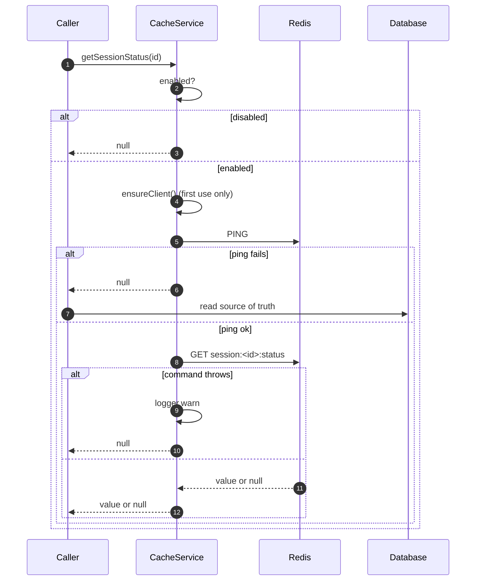

# Cache and Redis

> **Source of truth:** `src/common/cache/cache.service.ts`, `src/common/cache/cache.module.ts`, `src/common/throttler/redis-throttler.storage.ts`, `src/common/throttler/throttler-redis.client.ts`, `src/modules/events/redis-io.adapter.ts`, `src/modules/queue/queue.module.ts`
> **Band:** Data and infrastructure · **Depends on:** 05-configuration-and-env.md · **Jarcube class:** PORTABLE

## Purpose

OpenWA uses Redis in **four independent places**, each with its own client, its own connection tuning
and its own enable flag. None of them is on by default. Reading `src/common/cache/` alone gives a
misleading picture, because the cache is the *least* important of the four and the one whose absence
costs the least.

The design point worth internalising: every one of the four is **best-effort**, and each degrades in a
different direction chosen deliberately. The cache falls back to the database, the throttler fails
**open**, the queue falls back to inline dispatch, and the WebSocket adapter falls back to
single-process fan-out. A naive implementation shares one client across all four, which couples their
failure modes and — for the throttler specifically — turns a slow Redis into a stalled request path.

## File Inventory

Line counts as measured; they drift.

| Path | Lines | Role |
| --- | --- | --- |
| `src/common/cache/cache.service.ts` | 255 | The cache itself: 5 key families, lazy client, bounded teardown |
| `src/common/cache/cache.module.ts` | 11 | `@Global()` module, one provider |
| `src/common/cache/index.ts` | 2 | Barrel |
| `src/common/throttler/redis-throttler.storage.ts` | 112 | `ThrottlerStorage` over Redis, one Lua script, fails open |
| `src/common/throttler/throttler-redis.client.ts` | 46 | Client options tuned so failing open happens *immediately* |
| `src/modules/events/redis-io.adapter.ts` | 125 | Socket.IO cross-replica adapter |
| `src/modules/queue/queue.module.ts` | 84 | BullMQ connection + job options |

Specs: `src/common/cache/cache.service.spec.ts` (163),
`src/common/throttler/redis-throttler.storage.spec.ts` (114),
`src/common/throttler/redis-throttler.storage.lifecycle.spec.ts` (32),
`src/common/throttler/throttler-redis.client.spec.ts` (68).

Rate limiting itself is 52-rate-limiting.md, the queue is 55-queue-bullmq.md, and the WebSocket surface
is 54-websocket-events.md. This doc covers the Redis layer underneath them.

## The four consumers

| Consumer | Flag | Client | Redis DB | Degradation when absent |
| --- | --- | --- | --- | --- |
| Cache | `CACHE_ENABLED` **or** `REDIS_ENABLED` | own, lazy | `REDIS_CACHE_DB`, default `1` | Every read returns null; callers hit the DB |
| Throttler storage | `REDIS_ENABLED` | own, eager | default (0) | In-memory per-process counters |
| BullMQ | `QUEUE_ENABLED` | BullModule's own | default (0) | Inline/direct dispatch for webhooks and ingress |
| Socket.IO adapter | `REDIS_ENABLED` | pub + sub pair | default (0) | Plain in-memory adapter; broadcasts stay process-local |

Three things about that table are surprising and worth stating plainly.

**The cache is enabled by *either* flag.** `src/common/cache/cache.service.ts` computes
`this.enabled = process.env.REDIS_ENABLED === 'true' || configService.get('cache.enabled', false)`,
where `cache.enabled` is `CACHE_ENABLED === 'true'`. So turning on Redis for rate limiting or WebSocket
fan-out **also turns on the cache**, whether or not `CACHE_ENABLED` was ever set. The comment explains
the direct `process.env` read (the dashboard writes `REDIS_ENABLED` into `data/.env.generated`), but the
OR is a real coupling: there is no way to have `REDIS_ENABLED=true` and a disabled cache.

**Only the cache uses a non-default Redis DB index.** The throttler, queue and WS adapter all land on
DB 0 with no `db` option. The throttler namespaces its keys (`openwa:throttle:<name>:<key>`), BullMQ
namespaces by queue name, and the Socket.IO adapter uses its own channel prefix, so they coexist — but
they coexist by naming convention, not by isolation.

**`QUEUE_ENABLED` is read at module-evaluation time**, not through `ConfigService`.
`src/app.module.ts`, `src/modules/infra/infra.module.ts`, `src/modules/integration/integration.module.ts`
and `src/modules/webhook/webhook.module.ts` each carry a top-level
`if (process.env.QUEUE_ENABLED === 'true')` that decides whether `QueueModule` is imported at all. That
is a structural decision, not a runtime one — the flag cannot be flipped without a restart, and
`src/modules/integration/ingress-enqueue.service.ts` throws a written diagnostic if the flag is on but
the queue did not resolve.

## The cache

Five key families, each with a hardcoded TTL in seconds:

| Key | TTL | Written by |
| --- | --- | --- |
| `session:<id>:status` | 300 | `setSessionStatus` |
| `session:<id>:info` | 600 | `setSessionInfo` |
| `session:<id>:qr` | 60 | `setSessionQR` |
| `sessions:list` | 30 | `setSessionsList` |
| `sessions:stats` | 15 | `setSessionsStats` |

Every getter and setter follows the same three-line shape: `if (!(await this.isAvailable())) return
null` (or `return`), then the Redis call in a try/catch that logs a warning and falls back. There is no
path on which a cache failure propagates to a caller.

### Lazy client, self-healing connection

`ensureClient()` creates the single `ioredis` client on first use, not in the constructor, so a Redis
container that is not ready at boot does not fail startup. Three options carry the interesting
reasoning:

| Option | Value | Why |
| --- | --- | --- |
| `lazyConnect` | `true` | Construction does not dial |
| `enableOfflineQueue` | `false` | A command issued while disconnected **fails fast** so the caller falls back to the source of truth, instead of queueing and stalling the request until reconnect |
| `retryStrategy` | `times => Math.min(times * 500, 5000)` | Reconnect **forever** with bounded backoff |

The `retryStrategy` is a fix, and the comment names the bug: the previous implementation counted
attempts manually and gave up permanently after a fixed number, without clearing the dead client. A
Redis restart therefore left the cache dead until the whole app was restarted. Returning `null` from a
`retryStrategy` makes ioredis abandon reconnection permanently — which is exactly what happened.

`redis.connect()` is kicked off but **not awaited**: `isAvailable()` pings, so it reflects live state.
The first call while still connecting reports false; the next one, once ready, reports true.

`isAvailable()` is called on **every** cache operation, and each call issues a `PING`. That is one extra
round trip per cache read — the trade is stated implicitly by the design (a stale `available` flag was
the previous bug) but it is a real cost worth knowing before copying this shape.

### Bounded teardown

`onModuleDestroy` is the same pattern in all three hand-rolled Redis consumers (cache, throttler
storage, WS adapter), and it is worth reading once:

```ts
// src/common/cache/cache.service.ts — the shape shared by all three
try {
  await Promise.race([redis.quit().catch(() => undefined), deadline]);
} finally {
  if (timer) clearTimeout(timer);
  redis.disconnect();
}
```

Two failures are being handled at once. `redis.quit()` waits for the QUIT reply, which **never arrives
on a half-open or partitioned socket** — leaving `app.close()` blocked until the orchestrator SIGKILLs
the process. So a graceful quit races a short deadline (`CACHE_QUIT_TIMEOUT_MS = 2000`, and
`THROTTLER_REDIS_QUIT_TIMEOUT_MS` / `WS_REDIS_QUIT_TIMEOUT_MS` are both 2000 too). And with
`enableOfflineQueue: false` plus the never-give-up `retryStrategy`, a Redis that is down at shutdown
leaves the client stuck reconnecting and `quit()` rejects *instantly without closing the socket* — so
ioredis's reconnect timer would outlive teardown. `disconnect()` is idempotent, so calling it after a
clean quit is harmless, and it guarantees no live handle survives `onModuleDestroy` regardless of
connection state.

## The throttler storage

`src/common/throttler/redis-throttler.storage.ts` implements `@nestjs/throttler` v6's
`ThrottlerStorage` so hit counts aggregate across replicas behind a load balancer.

`increment()` runs one Lua script — `INCR`, then `PTTL`, arming `PEXPIRE` when the count is 1. The
`elseif ttl < 0` branch is the interesting part: a TTL-less key can only be legacy or corrupt state
(older non-atomic implementations stranded counters), so it is `SET` back to 1 with a fresh TTL rather
than merely re-armed. Repairing it in place would let an old stranded over-limit value impose a fresh
full-window block.

Two contract details:

- **Seconds, not milliseconds.** The guard sets `Retry-After: timeToBlockExpire` and
  `RateLimit-Reset: timeToExpire`, and both HTTP conventions are seconds — so the storage returns
  `ceil(ms / 1000)`, matching the default in-memory storage.
- **Fails open.** On any Redis error it returns `{ totalHits: 0, isBlocked: false, … }`. The rationale
  is explicit: rate limiting is a secondary control, and failing closed would self-DoS the gateway,
  since every request would 500 on the storage call.

`src/common/throttler/throttler-redis.client.ts` exists so that failing open happens *immediately*
rather than after a stall, and each of its four options answers a distinct way the default would betray
that:

| Option | Value | What the default would do |
| --- | --- | --- |
| `enableOfflineQueue` | `false` | Queue the command until reconnect — stalling every request for seconds **and** replaying the non-idempotent `INCR` evals late, corrupting the fixed-window counts |
| `autoResendUnfulfilledCommands` | `false` | Resend an in-flight eval after reconnect, which can double-count (if it already ran server-side) or land in a fresh window |
| `commandTimeout` | 2000 ms | Nothing would settle a dropped in-flight command; the awaiting caller would hang forever |
| `maxRetriesPerRequest` | `null` | Periodically flush a pending queue that, with the offline queue off, has nothing in it |

The constructor also attaches an `error` listener, because an ioredis client with none reports every
connection failure via an unstructured console dump. It never rethrows — the client keeps reconnecting
and `increment()` already fails open per request.

Lifecycle ownership is worth noting: the class is registered as the `ThrottlerStorage` provider by
`@nestjs/throttler` (its `ThrottlerStorageProvider` returns the configured instance), which is what
makes Nest invoke `onModuleDestroy` on it at all.

## BullMQ

`src/modules/queue/queue.module.ts` builds its connection from the same `redis.*` config namespace
(`host`, `port`, `username`, `password`, `connectTimeoutMs`) but through `BullModule`, so the client is
the library's. Job options auto-evict finished jobs so completed and failed webhook payloads do not
accumulate in Redis — and the module comment is careful about what that means: **the durable record of
a lost delivery is the `webhook_delivery_failures` row written on the final attempt, not the Redis
job.** See 53-webhooks.md and 55-queue-bullmq.md.

## The Socket.IO adapter

`src/modules/events/redis-io.adapter.ts` gates on `isWsRedisEnabled()` — the same
`REDIS_ENABLED === 'true'` check — and is installed unconditionally in `src/main.ts` via
`app.useWebSocketAdapter(new RedisIoAdapter(app))`, before the gateway's namespace is created so it
inherits the adapter. Without the flag it is inert: `super.createIOServer` returns a server with the
plain in-memory adapter and single-node pays nothing.

When enabled it creates a pub client from `wsRedisOptions()` and a `subClient` by `duplicate()` — the
`@socket.io/redis-adapter` contract requires two connections because a subscribed client cannot issue
other commands. Teardown quits both with `Promise.allSettled` and the same bounded-quit pattern
described above.

## Flow



## Call Chain

- `src/app.module.ts` → `ThrottlerModule.forRootAsync` → `src/common/throttler/throttler-redis.client.ts:createThrottlerRedisClient`
  → `src/common/throttler/redis-throttler.storage.ts:RedisThrottlerStorage` — adds cross-replica hit
  aggregation, gated on `REDIS_ENABLED`
- `src/main.ts` → `src/modules/events/redis-io.adapter.ts:RedisIoAdapter` → `isWsRedisEnabled` — adds
  cross-replica broadcast, inert without the flag
- session service → `src/common/cache/cache.service.ts:CacheService` → `isAvailable` → `ping` — adds a
  liveness check to every operation so a stale flag can never route a caller to a dead client
- `src/modules/queue/queue.module.ts` → `BullModule.forRootAsync` — adds durable webhook and ingress
  dispatch; absent, `src/modules/integration/ingress-enqueue.service.ts` falls back to direct delivery

## Configuration

| Env var | Default | Effect |
| --- | --- | --- |
| `REDIS_ENABLED` | `false` | Turns on throttler storage, the WS adapter, **and** the cache |
| `CACHE_ENABLED` | `false` | Turns on the cache alone |
| `QUEUE_ENABLED` | `false` | Read at module-eval time; decides whether `QueueModule` is imported |
| `REDIS_HOST` | `localhost` | Shared by all four |
| `REDIS_PORT` | `6379` | Shared by all four |
| `REDIS_USERNAME` / `REDIS_PASSWORD` | unset | Shared by all four |
| `REDIS_CONNECT_TIMEOUT_MS` | `5000` | `redis.connectTimeoutMs`; cache, throttler, queue |
| `REDIS_CACHE_DB` | `1` | Cache only — the only consumer that isolates by DB index |
| `REDIS_BUILTIN` | `false` | Asks `src/modules/docker/docker.service.ts` to start a bundled Redis container. See 74-docker-and-compose.md. |

Full list: APPENDIX-A-env-vars.md.

Two constants are exported for tests and worth naming: `CACHE_QUIT_TIMEOUT_MS`,
`THROTTLER_REDIS_QUIT_TIMEOUT_MS` and `WS_REDIS_QUIT_TIMEOUT_MS` are all 2000, and
`THROTTLER_REDIS_COMMAND_TIMEOUT_MS` is 2000.

## Events Emitted / Consumed

The cache emits nothing. The Socket.IO adapter is a *transport* for events rather than a producer of
them — when enabled, every canonical event broadcast reaches clients on every replica instead of only
the emitting process. Full list: APPENDIX-B-events.md.

## Failure Modes & Edge Cases

| Scenario | Behaviour |
| --- | --- |
| `REDIS_ENABLED` unset | All four consumers inert; no client is ever constructed |
| `REDIS_ENABLED=true`, `CACHE_ENABLED` unset | Cache is **on** anyway, via the OR |
| Redis down at boot | Cache client is created lazily and never dials until first use; the throttler client reconnects in the background and every `increment` fails open |
| Redis restarts mid-run | Cache heals itself via the unbounded `retryStrategy`; the previous manual attempt counter did not |
| Cache read during an outage | `isAvailable()` ping fails → null → caller reads the database |
| Cache command throws | Logged at warn, returns null/void; never propagates |
| Throttler Redis slow | `commandTimeout` (2s) rejects, storage fails open, request is allowed |
| Throttler command dropped on reconnect | Not resent (`autoResendUnfulfilledCommands: false`); `commandTimeout` settles the caller |
| TTL-less throttle key found | Count voided and re-set to 1, so stranded state cannot impose a fresh block |
| Redis down at shutdown | Bounded 2s `quit()` race then unconditional `disconnect()`, so no reconnect timer outlives teardown |
| `QUEUE_ENABLED=true` but `QueueModule` not imported | `ingress-enqueue.service.ts` throws a message naming the exact module wiring to fix |
| Queue disabled | Webhooks and ingress dispatch inline; the DLQ row remains the durable record |
| WS Redis enabled with one replica | Works, costs one extra pub/sub connection pair, gains nothing |

## Jarcube Portability

**Classification:** PORTABLE

**Rationale:** Nothing here touches WhatsApp. All four consumers are generic infrastructure concerns
that any multi-replica NestJS service faces.

**Prerequisites:** none for the cache. The throttler storage needs Jarcube's throttler tiers defined
first (52-rate-limiting.md); the WS adapter needs a Socket.IO gateway
(`QuantumMind-backend/src/socket/socket-state.service.ts` is the equivalent surface in Jarcube).

**Cloud API caveats:** none.

**Specific recommendations for Jarcube:**

1. **Port `throttler-redis.client.ts` before `redis-throttler.storage.ts`.** The options file is where
   the correctness lives. A Redis-backed throttler on default ioredis options stalls requests during an
   outage and corrupts fixed-window counts on recovery, and both failures look like "Redis was slow"
   rather than like a bug in the storage.
2. **Take the bounded-quit teardown pattern for every Redis client you own.** The half-open-socket hang
   is real and it presents as "the pod took the full termination grace period to die" — which is easy to
   misattribute to application shutdown.
3. **Take the fail-open decision for rate limiting explicitly.** It is a security posture, not an
   implementation detail. Write it down wherever Jarcube's throttler is configured.
4. **Give each concern its own client.** One shared client couples four failure modes and forces one set
   of connection options onto four workloads with opposite requirements — the throttler wants
   fail-fast, BullMQ wants an offline queue.
5. **Do not copy the `REDIS_ENABLED || CACHE_ENABLED` OR.** Two flags where one silently implies the
   other is a configuration surprise. Pick one flag per concern.
6. **Reconsider the ping-per-operation.** It is the right answer to the stale-flag bug but it doubles
   the round trips of a cache whose whole purpose is to save round trips. A short-lived availability
   memo (a few hundred ms) would keep the self-healing property at a fraction of the cost.
7. **If Jarcube is single-replica, skip all four.** The cache saves database reads on a small SQLite or
   Postgres query; the other three exist purely to make multiple replicas behave as one. Adding Redis
   to a single-node deployment adds a dependency and buys almost nothing.

## Open Questions

- The cache's five TTLs are hardcoded constants with no env override, unlike almost every other
  timing knob in the repo. Whether that is deliberate (the values are tied to the UI's refresh
  cadence) is not stated.
- `CacheService` reads flat keys (`REDIS_HOST`, `REDIS_USERNAME`, `REDIS_CACHE_DB`) through
  `configService.get`, while the other three consumers read the `redis.*` namespace
  `src/config/configuration.ts` actually defines. The flat reads resolve because `ConfigService`
  also sees `process.env`, so they work — but `REDIS_CACHE_DB` is the only Redis knob with no entry in
  the config tree, and whether that asymmetry is intentional is not stated.
- Nothing invalidates a cache entry on write; every family relies on its TTL. Whether a
  status change that must be visible sooner than 300s is handled elsewhere (e.g. by writing through
  `setSessionStatus` on every transition) could not be confirmed from this module alone.
- The throttler, queue and WS adapter all share Redis DB 0 and separate only by key prefix. Whether
  distinct DB indices were considered and rejected is not recorded.
