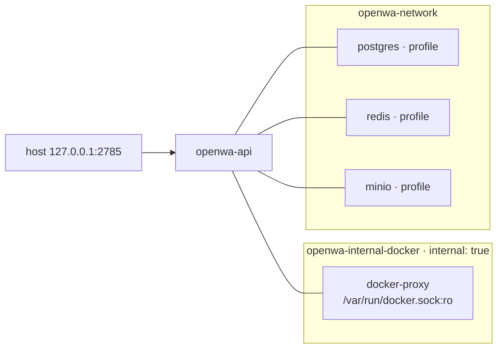

# Docker and Compose

> **Source of truth:** `Dockerfile`, `docker-entrypoint.sh`, `docker-compose.yml`, `docker-compose.dev.yml`, `docker-compose.local.yml`, `.dockerignore`, `scripts/check-dockerignore.mjs`, `src/modules/docker/`
> **Band:** Data and infrastructure · **Depends on:** 04-bootstrap-and-lifecycle.md, 05-configuration-and-env.md · **Jarcube class:** MIXED

## Purpose

Two stages, three compose files, and one architectural choice that changes the threat model of the whole
deployment: **the application can start and stop sibling containers**. Everything else here is
conventional container packaging done unusually carefully — the interesting parts are the
chown-then-drop entrypoint chain, the read-only rootfs that Chromium fights, and the socket proxy that
exists to bound what the app can ask the Docker daemon to do.

Two classifications apply, and they are labelled inline below:

| Subsystem | Class |
| --- | --- |
| `Dockerfile`, `docker-entrypoint.sh`, the three compose files, `.dockerignore` + its checker | **PORTABLE** |
| `src/modules/docker/` — the app controlling sibling containers | **NEEDS-REDESIGN** |

## File Inventory

Line counts as measured; they drift.

| Path | Lines | Role |
| --- | --- | --- |
| `Dockerfile` | 298 | Two stages: cross-platform builder, target-platform production |
| `docker-entrypoint.sh` | 30 | Root-side volume/XDG preparation, then `exec gosu` |
| `docker-compose.yml` | 533 | Production stack: proxy, API, three profiled datastores |
| `docker-compose.dev.yml` | 293 | Single-container local smoke of the **production** image |
| `docker-compose.local.yml` | 73 | Standalone variant for snap-packaged Docker |
| `.dockerignore` | 71 | Build-context rejection list |
| `scripts/check-dockerignore.mjs` | 176 | Reimplements Docker's matching and asserts both directions |
| `src/modules/docker/docker.service.ts` | 610 | dockerode client, profile specs, orchestration |
| `src/modules/docker/docker.module.ts` | 8 | One provider |
| `src/modules/docker/index.ts` | 2 | Barrel |
| `src/modules/docker/compose-network.spec.ts` | 30 | Network-segmentation regression lock |
| `src/modules/docker/compose-parity.spec.ts` | 453 | Compose service definitions vs the in-code container specs |
| `src/modules/docker/docker.service.spec.ts` | 641 | Unit coverage |
| `scripts/smoke-test-non-root.sh` | 63 | Asserts the built image runs as `openwa` |
| `scripts/smoke-test-docker-proxy.sh` | 80 | Asserts the API can reach the daemon through the proxy |

## Dockerfile — stage 1, builder

`FROM --platform=$BUILDPLATFORM node:22-slim@sha256:d649c27…`

The platform pin is the non-obvious part. The builder produces only
**architecture-independent** artefacts — the NestJS `dist/` JavaScript and the static dashboard SPA — so
it never needs to run emulated for a non-native target. On a multi-arch buildx build this avoids QEMU
emulating the entire `npm ci` + Vite build for arm64, which is slow *and* is where Vite 8's native CSS
minifier fails to install (`Cannot find module lightningcss.linux-arm64-gnu.node`). Per-arch runtime
dependencies are installed natively in stage 2.

The base is pinned by digest as well as tag, so every build starts from the same immutable image;
dependabot proposes the new digest when the tag moves, and the comment says to update both together.

Ordering inside the stage encodes two lessons:

- **`scripts/postinstall.js` is copied before `npm ci`.** `npm ci` fails outright when a lifecycle script
  file is missing. `dashboard/` is deliberately still absent at that point, so the hook cleanly no-ops.
- **`npm ci --include=dev` is required, not cosmetic.** npm omits devDependencies whenever
  `NODE_ENV=production` is present in the build env — and PaaS platforms like Coolify promote every
  `${VAR}` referenced in the compose file to a build-time variable, so `docker-compose.yml`'s
  `NODE_ENV=${NODE_ENV:-production}` leaks into this stage. A bare `npm ci` then skips `@nestjs/cli` and
  the build dies with `sh: 1: nest: not found` (exit 127). `docker-compose.dev.yml` hardcodes
  `NODE_ENV=development`, which is why the dev build never hit it.

Five npm fetch-retry settings are applied before the install. They change fetch behaviour only, not
which packages are installed, and exist because `npm ci` aborts the whole install on the first dropped
socket.

The stage ends with `npm run build && npm run dashboard:ci -- --include=dev && npm run dashboard:build &&
rm -f dist/*.tsbuildinfo`. The `tsbuildinfo` removal matters because the incremental cache is pinned
inside `dist/` and stage 2 copies `dist/` wholesale — it would otherwise ship dead compiler metadata in
every image.

## Dockerfile — stage 2, production

`ENV NODE_ENV=production` is set first, and the reason is a real hazard: an **unset** `NODE_ENV` selects
the *development* branch of the CORS, Swagger, DTO-error-detail and default-secret hardening. Both
compose files and the Helm chart set it, but a plain `docker run` of the image did not. The npm installs
below pin `--omit=dev` explicitly, so this changes nothing about which dependencies land.

### The Chromium arch split

Chrome for Testing has no linux-arm64 build, and Puppeteer's chromium snapshot is x86_64-only on Linux
too. So:

| Arch | Browser | Resolution |
| --- | --- | --- |
| amd64 | Chrome for Testing, pinned `chrome@146.0.7680.31`, downloaded into `/opt/puppeteer` | `find` the binary, `test -n` it, symlink |
| arm64 | Debian's `chromium` package (ships a native arm64 build) | symlink `/usr/bin/chromium` |

Both resolve to `/usr/local/bin/puppeteer-chrome`, which `PUPPETEER_EXECUTABLE_PATH` names. The `test -n`
guard makes a future path mismatch fail loudly at build time rather than shipping a broken image. amd64
uses Chrome for Testing specifically to avoid the Debian chromium package's SIGTRAP under strict
non-root/seccomp on Kubernetes.

`chromium-sandbox` is listed **explicitly** rather than left to Recommends, so `--no-install-recommends`
still trims everything else but keeps the setuid sandbox binary. The default forces `--no-sandbox`, so it
goes unused — but an operator who overrides `PUPPETEER_ARGS` and drops that flag would otherwise get a
chromium that cannot launch.

### Packages that carry an argument

| Package | Why it is here |
| --- | --- |
| `dumb-init` | PID 1, signal forwarding |
| `gosu` | The privilege drop |
| `sqlite3` | So an in-container `scripts/backup.sh` takes online-consistent `.backup` snapshots instead of plain-copying a live database, which can archive a torn file |
| `ffmpeg` | Backs the media-conversion endpoints, **and** repairs an existing gap: whatsapp-web.js requires `fluent-ffmpeg` at module load and calls it for video-to-webp animated stickers, so `sendSticker` with a video mimetype had been failing for want of the binary. ~210 MB, chosen as the Debian package precisely so codec CVEs arrive through the same security stream as everything else |
| `postgresql-client-17` from PGDG | Debian bookworm ships client 15, and `pg_dump` **refuses a newer server outright** — reproduced against the `postgres:16` the bundled compose file runs. So the distro package would install a `pg_dump` that cannot dump this stack's own database |
| `patch`, `curl`, `procps` | Upstream patchers, healthcheck, diagnostics |

The Postgres client is deliberately *newer* than the bundled server: the compatibility rule is
one-directional (a client may be newer than its server, never older), and `DATABASE_HOST` often points at
a managed Postgres the compose file does not control where 17 is current. Pinning to 16 would have left
every such deployment unable to back up.

The PGDG signing key is **committed** as `scripts/pgdg-ACCC4CF8.asc` rather than fetched. The reasoning is
the sharpest supply-chain argument in the repo: `signed-by` attests only that the .debs match whatever
that request returned, so a compromised host — or a build behind a TLS-intercepting proxy whose root is
in the trust store — would swap the trust anchor with nothing to notice. Committed, it is reviewed once
and diffable forever. A `sed -i 's/\r$//'` repairs CRLF endings, because apt dearmors a `signed-by`
`.asc` through apt-key, whose awk advances on the blank armor separator line — a CR there yields an empty
keyring and `NO_PUBKEY`. The `.gitattributes` rule keeps fresh clones on LF; the strip repairs the
Windows clones already on disk, which that rule cannot reach.

The Trivy accounting is recorded in the comment and is the bar each added layer was held to: 0
CRITICAL/HIGH findings under the release job's own settings, and the perl packages that arrive with
`postgresql-common` add 0 *distinct* vulnerabilities because every one is already present through
`perl-base`.

### Upstream patch application

`npm ci --omit=dev --ignore-scripts` runs first, then **eight** patchers are invoked explicitly and
fatally. `--ignore-scripts` is required because this stage has no compiler toolchain and npm still
auto-runs `node-gyp rebuild` for any package shipping a `binding.gyp` without its own install script.
The ordering is load-bearing: `patch-wwebjs-status.js` runs after the two patchers it depends on, because
its transforms were written against the tree they leave behind.

`scripts/dockerfile-patchers.spec.js` **derives the expected list from `scripts/patch-*.js`** and fails
if a patcher is added without being both copied and run here. The comment names what that gate caught: a
hand-written list loses one silently, and the Baileys patcher shipped in postinstall for a whole release
without ever reaching the image. See 18-upstream-patching.md.

### npm itself is replaced

`npm install -g npm@12.0.2`, deliberately **after** `npm ci`, so the application tree is still resolved
by the npm the lockfile was generated with and only the global CLI is swapped. npm is not on the request
path — the entrypoint runs `node dist/main` — but it stays in the image because operator runbooks drive
it, and its bundled dependency tree is what the release image scan reports. Pinned to the exact patch
release, because a floating `npm@12` would make the image's bundled npm tree depend on when the build
happened.

### The HOME problem

`useradd -r` creates `openwa` with no home directory. Chromium resolves its home from the passwd entry
via glib's `getpwuid()` — it **ignores `$HOME`** — so it tries to read and write `/home/openwa`, which
does not exist. On hardened or read-only hosts that is a **hard crash at launch**: SIGTRAP/int3, logged
as `chrome_crashpad_handler: --database is required`.

The fix is `XDG_CONFIG_HOME=/tmp/.config` and `XDG_CACHE_HOME=/tmp/.cache`, which Chromium honours
directly, bypassing the passwd lookup. `HOME=/app/data` is kept for other HOME-relative tooling. On a
read-only rootfs those XDG paths live on the tmpfs, which is why the entrypoint has to create them at
runtime rather than the Dockerfile at build time.

### Ownership, not a full chown

`RUN mkdir -p ./data/... && chown -R openwa:openwa ./data` — **only `./data`**, not all of `/app`. The
app tree needs read access only, which root-owned files already grant. A full `/app` chown walks every
production dependency file (measured at ~35 minutes on a small VPS) and duplicates their metadata into a
new image layer.

`HEALTHCHECK` curls `/api/health/ready` every 30 s with a 30 s start period. `EXPOSE 2785`.

### No `USER` directive, on purpose

`ENTRYPOINT ["dumb-init", "--", "/usr/local/bin/docker-entrypoint.sh"]`, `CMD ["node", "dist/main"]`.

The comment addresses the finding this will attract: Trivy DS-0002 flags a missing `USER`, and it should
be ignored here. The node process does **not** run as root — `docker-entrypoint.sh` ends with
`exec gosu openwa "$@"` after its chowns. Adding `USER openwa` would run the *entrypoint* as `openwa` and
break the chown-before-drop pattern that makes named-volume mounts work on first boot.

## The entrypoint chain

```mermaid
sequenceDiagram
  autonumber
  participant K as Docker / kubelet
  participant DI as dumb-init (PID 1, root)
  participant EP as docker-entrypoint.sh (root)
  participant N as node dist/main (openwa)

  K->>DI: start container
  DI->>EP: exec
  EP->>EP: mkdir data/{sessions,media,plugins}; chown -R openwa
  EP->>EP: rm -f data/sessions/*/Singleton*
  EP->>EP: mkdir XDG_CONFIG_HOME + XDG_CACHE_HOME (FATAL if it fails)
  EP->>EP: chown both XDG dirs to openwa
  EP->>N: exec gosu openwa "$@"
  Note over DI,N: gosu execs, so node replaces the shell and<br/>becomes dumb-init's direct child
  K->>DI: SIGTERM
  DI->>N: forwarded
```

Four things happen as root and nothing else does.

**The volume chown** is why root is needed at all: a named volume mounted at `/app/data` on first boot is
root-owned, and the image's build-time chown cannot reach it.

**Stale Chromium locks are cleared.** Chromium leaves `SingletonLock`, `SingletonSocket` and
`SingletonCookie` in each session profile and does not remove them on an unclean shutdown; a stale lock
blocks the next launch with "profile appears to be in use by another Chromium process" (exit code 21). No
Chromium is running at entrypoint time, so clearing them is safe and lets sessions relaunch after a
crash.

**The XDG directory creation is fatal on failure**, and the error message is three lines of operator
instruction naming the compose (`tmpfs: [/tmp]`) and Kubernetes (`emptyDir` at `/tmp`) remedies. That is
the correct severity: without writable config/cache dirs Chromium cannot launch and every session fails,
so failing at start beats failing per session.

**`gosu` performs an `exec`**, so the node process *replaces* this shell and becomes the direct child of
dumb-init — which is what lets PID 1 forward SIGTERM cleanly. A non-exec spawn would leave the shell
between them and swallow the signal.

## docker-compose.yml — the production stack

Five services. `docker-proxy` and `openwa-api` are core; `postgres`, `redis` and `minio` sit behind
`profiles: ['<name>', 'full']`, so `docker compose up` starts neither.

### Network segmentation



`openwa-api` is on both networks. `docker-proxy` is on **only** the internal one, and that network is
`internal: true` — which also denies the proxy outbound access, since it needs nothing but the locally
mounted socket. `src/modules/docker/compose-network.spec.ts` is a three-assertion regression lock on
exactly this shape: the network is internal, the proxy is on that network *only*, and the API can reach
it.

The API's port publishes to `127.0.0.1:${API_PORT:-2785}` — loopback by default, not `0.0.0.0`.

### Container hardening

| Setting | Value | Note |
| --- | --- | --- |
| `security_opt` | `no-new-privileges:true` | Blocks setuid escalation |
| `cap_drop` | `ALL` | |
| `cap_add` | `CHOWN`, `DAC_OVERRIDE`, `FOWNER`, `SETGID`, `SETUID` | Exactly the five the root entrypoint's chown + gosu drop need. After gosu setuids, the node/Chromium process keeps **no** effective capabilities. |
| `read_only` | `true` | Chromium's profile lives on the writable `/app/data` volume |
| `tmpfs` | `/tmp` | Absorbs `HOME=/tmp` and the XDG dirs |
| `pids_limit` | `${OPENWA_PIDS_LIMIT:-2048}` | |
| `mem_limit` | `${OPENWA_MEM_LIMIT:-2g}` | |
| `stop_grace_period` | `45s` | |

Two of those carry a story.

**`pids_limit: 2048`** replaced a 512 that was picked without accounting for Chromium's multi-process
model. whatsapp-web.js runs a full Chromium per session — browser, renderer, GPU, zygote, utilities — and
WhatsApp Web is process-heavy, so ~4 concurrent sessions already approached 512 and a new session's
Chromium was killed mid-spawn, surfacing in the API as `Code: null`. 2048 fits roughly 8–10 wwebjs
sessions with startup-spike headroom; Baileys is single-process and the higher ceiling is a no-op there.
It is a fork-bomb guard, not an allocation — the kernel only rejects forks once the count is reached, so a
higher limit is free for light containers. The comment says explicitly: do **not** set `-1`.

**`stop_grace_period: 45s`** exists because Docker's 10 s default is not enough: the shutdown grace
(`SHUTDOWN_DELAY_MS`, default 3 s) plus the worst-case per-engine teardown bound (~10 s) can exceed it,
and being SIGKILLed mid-teardown kills Chromium and orphans a session profile.

### The blank-forward convention

Environment entries are written `- KEY=${KEY:-}`. That renders an **empty string** when the operator has
not set the variable, which is the whole reason `src/config/env-precedence.ts:clearBlankEnv` and
`BLANK_SHADOWED_ENV_KEYS` exist — an empty string still occupies `process.env` and blocks both file
layers under `override: false`, so the dashboard's saved selection would silently never apply. The
governing rule, enforced by a spec derived from this file, is that every `${KEY:-}` forward here belongs
in that list. Read 05-configuration-and-env.md before changing a line of this section.

## docker-compose.dev.yml and docker-compose.local.yml

Neither is a hot-reload development environment, and the dev file's header says so in the first
paragraph: it builds and runs the **production image**, same Dockerfile, against SQLite with a
bind-mounted `./data`. There is no source mount and no `start:dev`. It is a single-container local smoke
test. `DATABASE_SYNCHRONIZE=true` keeps the schema zero-config for local use, which the production file
never does.

`docker-compose.local.yml` exists for one specific reason, and it is a Compose semantics problem rather
than an OpenWA one. Under snap-packaged Docker, the dev file's confinement blocks PID 1 from exec'ing
`/usr/bin/dumb-init` and the container crash-loops with `exec /usr/bin/dumb-init: operation not
permitted`. **Compose merges list fields additively**, so `security_opt`, `cap_drop` and `cap_add` cannot
be *removed* by an override file — only appended to. Hence a standalone file that defines the service
from scratch with `security_opt: [apparmor=unconfined]`, no `cap_drop` and no read-only rootfs. Same
image, same intent, minus the hardening snap rejects.

## .dockerignore and its checker

The builder ends with `COPY . .`, so anything `.dockerignore` does not reject lands in the build context,
the build cache and a builder layer. The list rejects dependencies, build output and `*.tsbuildinfo`,
coverage, **every** env variant at any depth (`.env*` and `**/.env*`), runtime data, `.git/`, private
notes under `_docs/`, ten agent/tool workspace directories, IDE and OS files, logs, and `charts/`.

`scripts/check-dockerignore.mjs` does not read the Dockerfile; it **reimplements Docker's matching
semantics** and asserts both directions. Four semantics are implemented deliberately:

- patterns anchored at the context root, with leading and trailing slashes stripped (a trailing slash
  only marks "this is a directory" and is ignored when matching);
- Go `filepath.Match` wildcards — `*`, `?`, `[...]` staying within a path segment — plus Docker's `**`,
  where `**/` matches zero or more leading segments;
- **last matching rule wins**, with `!` re-including;
- a pattern is matched against the path **and every parent directory**, which is what makes `data/`
  reject `data/main.sqlite` despite having no wildcard.

Then 26 paths must be rejected (`node_modules/`, `dist/main.js`, `.env`, `.env.production.local`, a
dashboard-local env file, `data/main.sqlite`, `data/.api-key`, `.git/HEAD`, `_docs/notes.md`, `CLAUDE.md`,
ten agent dirs, …) and 21 must survive (`package.json`, `tsconfig.build.json`, `src/main.ts`,
`dashboard/vite.config.ts`, all four copied patchers, `scripts/pgdg-ACCC4CF8.asc`, `scripts/backup.sh`,
`docker-entrypoint.sh`, and one page from `docs/`). The second list is the half most such checks omit,
and it is what stops a well-meant broadening of the ignore list from breaking the build.

Run as `npm run check:dockerignore`; runs in CI's lint job. See 97-ci-cd-and-release-gates.md.

## src/modules/docker — the app controls sibling containers

**Classification for this subsystem: NEEDS-REDESIGN.**

`DockerService` holds a `dockerode` client and can list, inspect, create, start and stop containers, pull
images and create volumes. It exists to serve the dashboard's Infrastructure page: an operator toggles
"built-in Postgres" and the application starts a Postgres container next to itself. See
66-infra-management.md.

### Connection and bootstrap

`buildDockerOptions()` returns `{ host, port, protocol: 'http' }` when `DOCKER_HOST` matches
`tcp://host:port`, and otherwise `{ socketPath: '/var/run/docker.sock' }`. In the bundled compose stack
`DOCKER_HOST=tcp://docker-proxy:2375`, so the API never touches the socket directly.

`onModuleInit` pings, then runs `bootstrapOrchestration()`, which reads `REDIS_BUILTIN`,
`POSTGRES_BUILTIN` and `MINIO_BUILTIN` and starts the corresponding profiles so containers match saved
configuration after a restart. A Docker-less deployment logs and skips — orchestration degrades, the app
boots.

`isDockerAvailable()` carries a startup-race recovery: when talking to the proxy over TCP, the proxy may
not be accepting connections when `onModuleInit` runs, because compose's `service_started` does not wait
for readiness. If the first connect failed, it retries once in the background — **only** for the
`DOCKER_HOST` case, since a socket-based or Docker-less deployment has no such race.

### The socket-proxy threat model

The socket is mounted read-only into exactly one container, `tecnativa/docker-socket-proxy:v0.4.2`, whose
env grants the minimum that keeps `DockerService` working:

| Flag | Enables |
| --- | --- |
| `PING` | health |
| `INFO` | `getSystemInfo` |
| `CONTAINERS` | list / inspect / create / start / stop |
| `IMAGES` | pull |
| `VOLUMES` | `createVolume` |
| `POST` | the proxy's single all-or-nothing method gate for non-GET |

Everything else — `AUTH`, `SECRETS`, `NETWORKS`, `PLUGINS`, `SWARM`, `TASKS`, `SERVICES`, `CONFIGS`,
`NODES`, `DISTRIBUTIONS` — is denied by default.

Two residual risks are named in the compose file and in `SECURITY.md`, and both are honest about being
accepted rather than solved:

1. **`DELETE` is admitted as a side effect of `POST`.** The pinned v0.4.2's haproxy config is
   `deny unless METH_GET || env(POST)`, and its `DELETE` env flag is never read — dead config. OpenWA
   itself never issues deletes, which is why `stopManagedService` is **stop-only**: a stop needs nothing
   beyond `POST /containers/{id}/stop`, which the feature already requires, whereas relying on delete
   would depend on an undocumented side effect any proxy upgrade may withdraw. Retention is also what the
   disable → re-enable flow wants: the named volume and container config survive and a later start simply
   restarts the retained container. The documented caveat is that a retained container keeps its original
   env, so credentials changed while disabled require a manual `docker rm`.
2. **The proxy cannot scope container-create payloads.** A compromised API container could create
   containers with host bind mounts. The stated mitigation is to disable the proxy entirely when the
   built-in datastore orchestration is not used — the compose file spells out the
   `docker-compose.override.yml` with `profiles: ['disabled']` — after which `DockerService` reports
   Docker unavailable and orchestration degrades gracefully.

`MANAGED_DOCKER_PROFILES = ['postgres', 'redis', 'minio']` bounds teardown so a caller-supplied profile
name can never reach `stopManagedService` for an unrelated container. Container specs set
`securityOpt: ['no-new-privileges:true']` and `com.openwa.*` labels, and orchestration returns an
`estimatedTime` the dashboard uses for its restart progress (15 s base, +20 Postgres, +13 Redis, +15
MinIO).

`src/modules/docker/compose-parity.spec.ts` (453 lines) is the counterpart gate to the network lock: it
loads `docker-compose.yml` and compares each profiled service's image, name, env, volumes, healthcheck
and limits against the in-code container spec `createService` would use, so `docker compose --profile
postgres up` and the dashboard toggle cannot drift into producing different containers.

## Configuration

| Env var | Default | Effect |
| --- | --- | --- |
| `API_PORT` | `2785` | Host-side published port, bound to `127.0.0.1` |
| `BIND_HOST` | `127.0.0.1` | Dev/local compose bind address |
| `OPENWA_PIDS_LIMIT` | `2048` | cgroup `pids.max`. Never `-1`. |
| `OPENWA_MEM_LIMIT` | `2g` | |
| `DOCKER_HOST` | unset | `tcp://host:port` selects TCP; otherwise the socket path |
| `POSTGRES_BUILTIN` / `REDIS_BUILTIN` / `MINIO_BUILTIN` | `false` | Bootstrap orchestration starts the matching profile |
| `NODE_ENV` | `production` (image `ENV`) | Unset selects the *development* hardening branch |
| `HOME` | `/app/data` (image), `/tmp` (compose) | |
| `XDG_CONFIG_HOME` / `XDG_CACHE_HOME` | `/tmp/.config` / `/tmp/.cache` | Chromium cannot launch without these existing and writable |
| `PUPPETEER_EXECUTABLE_PATH` | `/usr/local/bin/puppeteer-chrome` | The arch-independent symlink |
| `SHUTDOWN_DELAY_MS` | `3000` | Part of what `stop_grace_period: 45s` accommodates |

Full list: APPENDIX-A-env-vars.md.

## Events Emitted / Consumed

Orchestration actions raise audit records (`INFRA_RESTART_REQUESTED`, `INFRA_CONFIG_SAVED`) rather than
canonical events — see 63-audit-logging.md and 66-infra-management.md.
Full list: APPENDIX-B-events.md.

## Failure Modes & Edge Cases

| Scenario | Behaviour | Pinned by |
| --- | --- | --- |
| Named volume mounted root-owned on first boot | Entrypoint chowns it as root before dropping | `scripts/smoke-test-non-root.sh` |
| `/tmp` not writable on a read-only rootfs | Entrypoint **fails fatally** with the compose and Kubernetes remedies in the message | — |
| Stale Chromium `Singleton*` after an unclean stop | Cleared at entrypoint; otherwise exit code 21 on next launch | — |
| `NODE_ENV` unset on a plain `docker run` | Image `ENV` supplies `production`, so the hardening branch is taken | — |
| `NODE_ENV=production` leaking into the build | `--include=dev` keeps `@nestjs/cli`; without it, exit 127 | — |
| arm64 multi-arch build | Builder pinned to `$BUILDPLATFORM`; runtime deps installed natively | — |
| `pg_dump` against a newer server | Prevented by shipping client 17 rather than Debian's 15 | — |
| PGDG key with CRLF endings | `sed -i 's/\r$//'` before use; otherwise empty keyring and `NO_PUBKEY` | — |
| A new patcher added but not wired into the Dockerfile | Build gate fails | `scripts/dockerfile-patchers.spec.js` |
| Secret or data file entering the build context | Check fails, naming the path | `scripts/check-dockerignore.mjs` |
| A build input accidentally ignored | Same check fails from the other direction | `scripts/check-dockerignore.mjs` |
| Proxy moved onto the shared network | Spec fails | `src/modules/docker/compose-network.spec.ts` |
| Compose service and in-code spec drifting | Spec fails | `src/modules/docker/compose-parity.spec.ts` |
| Proxy not yet accepting connections at boot | One background reconnect, TCP case only | `src/modules/docker/docker.service.spec.ts` |
| Docker unavailable entirely | Orchestration disabled with a warning; the app boots | `src/modules/docker/docker.service.spec.ts` |
| Unknown profile name passed to teardown | Bounded by `MANAGED_DOCKER_PROFILES` | `src/modules/docker/docker.service.spec.ts` |
| Re-enabling a retained container after a credential change | Keeps its **original** env; documented as requiring a manual `docker rm` | — |
| Docker installed via snap | The dev file's confinement blocks dumb-init; `docker-compose.local.yml` is the standalone answer | — |
| SIGTERM during a session teardown | 45 s grace covers drain + per-engine Chromium teardown | — |

## Jarcube Portability

**Classification:** MIXED

The packaging is PORTABLE; `src/modules/docker/` is NEEDS-REDESIGN.

**Rationale (packaging):** `QuantumMind-backend/` is a NestJS service that will be containerised, and
every non-Chromium lesson in this Dockerfile applies unchanged: the digest pin, the `$BUILDPLATFORM`
split, the `--include=dev`-under-leaked-`NODE_ENV` trap, the `ENV NODE_ENV=production` default, the
partial chown, and the `.dockerignore` checker.

**Rationale (`src/modules/docker/`):** the concept — an app that provisions its own datastores through a
dashboard toggle — is a deployment-model decision, not a feature. It brings a Docker socket into the
threat model and it cannot work at all under Kubernetes, where the same chart carries no proxy sidecar.
Jarcube should decide whether it wants that capability before porting any of it.

**Prerequisites:** 05-configuration-and-env.md before touching the compose environment section — the
`${KEY:-}` convention and `BLANK_SHADOWED_ENV_KEYS` are one mechanism and porting half of it is worse
than porting neither.

**Cloud API caveats:** Jarcube speaks Meta's Cloud API over HTTPS, so there is **no Chromium**. That
removes a large fraction of this Dockerfile: the arch split, Chrome for Testing, `chromium-sandbox`, the
~15 X11/GTK libraries, `fonts-liberation`, the XDG/HOME workaround, the `Singleton*` cleanup, and the
2048 PID ceiling. The image gets substantially smaller and the entrypoint drops to the volume chown plus
`gosu`.

**Specific recommendations for Jarcube:**

1. **Take the chown-then-`exec gosu` entrypoint pattern with `dumb-init` as PID 1.** It is the correct
   answer to root-owned volume mounts, and the `exec` detail is what makes SIGTERM forwarding work at
   all. Keep the no-`USER`-directive comment with it, or someone will "fix" the Trivy finding and break
   first boot.
2. **Take `scripts/check-dockerignore.mjs` nearly verbatim.** It is 176 lines, has no dependencies, and
   is one of the few checks that catches a secret entering a build layer *and* a build input accidentally
   excluded. Swap the two path lists for Jarcube's.
3. **Take `ENV NODE_ENV=production` in the runtime stage.** An unset `NODE_ENV` selecting the permissive
   hardening branch is a security default that fails quietly, and orchestrator-set values do not help a
   plain `docker run`.
4. **Take the `--include=dev` comment along with the flag.** The PaaS-promotes-compose-variables
   mechanism is non-obvious enough that the flag looks removable without it.
5. **Take the partial `chown ./data`** rather than `chown -R /app`. A 35-minute build step and a
   duplicated dependency layer for no benefit.
6. **Take the derive-the-list-from-the-filesystem gate idea** wherever the Dockerfile has to name files
   individually. `dockerfile-patchers.spec.js` exists because a hand-maintained list lost an entry for a
   whole release.
7. **Do not port `src/modules/docker/`.** If Jarcube needs datastores, declare them in compose or a Helm
   chart and let the orchestrator own their lifecycle. If the dashboard genuinely needs to report their
   health, read a health endpoint rather than the Docker API.
8. **If you do port it, port the proxy and both caveats with it.** Mounting the socket directly into the
   API container is strictly worse than the arrangement here, and the two residual risks
   (`DELETE`-via-`POST`, unscoped create payloads) are properties of the proxy rather than of OpenWA —
   they will apply to Jarcube identically.

## Open Questions

- `docker-compose.dev.yml` is named "dev" but its own header describes it as a local smoke test of the
  production image, and `npm run dev` (concurrently + `start:dev` + Vite) is the actual development
  loop. Whether the file predates that script is not determinable from the source.
- The proxy is pinned to `tecnativa/docker-socket-proxy:v0.4.2` by tag, not digest, while the Node base
  image is digest-pinned. Whether that asymmetry is intentional is not stated.
- `stopManagedService` maps profile names to service names (`postgres`→`database`, `redis`→`cache`,
  `minio`→`storage`) with a `|| profile` fallback. Whether any caller relies on the fallback path is not
  determinable from this module alone.
- `pids_limit: 2048` is documented as fitting 8–10 whatsapp-web.js sessions, and
  `MAX_CONCURRENT_SESSIONS` bounds running engines separately. Whether the two are meant to be tuned in
  step, and what the intended ratio is, is not recorded.
