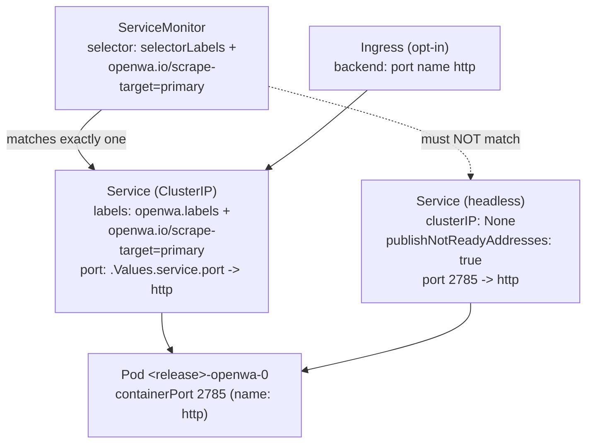
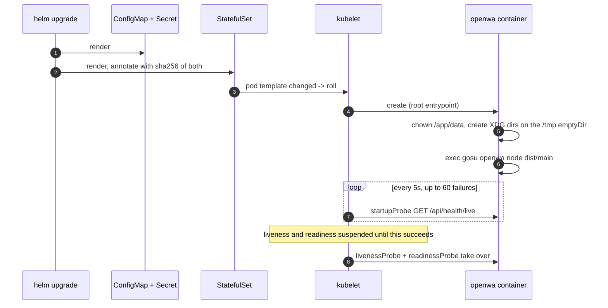

# Kubernetes and Helm

> **Source of truth:** `charts/openwa/Chart.yaml`, `charts/openwa/values.yaml`, `charts/openwa/templates/`, `scripts/check-chart-behaviour.mjs`
> **Band:** Data and infrastructure · **Depends on:** 74-docker-and-compose.md, 04-bootstrap-and-lifecycle.md · **Jarcube class:** PORTABLE

## Purpose

A deliberately small chart — nine template files, one workload, `replicaCount` fixed at 1 — plus a guard
script that is more interesting than the chart itself. The three defects this chart has actually shipped
are the reason it exists in its current shape, and none of them is a rendering error: a ServiceMonitor
selector that matched two Services, a probe budget boot could not meet, and a configuration change that
reached no running container. All three rendered into schema-valid YAML and passed `helm lint`,
`helm template` and `kubeconform`.

So the useful lesson here is not "how OpenWA runs on Kubernetes". It is that **a chart can render
perfectly and behave wrongly**, and that the only way to catch that class of defect is to render it and
assert against the resulting objects.

## File Inventory

Line counts as measured; they drift.

| Path | Lines | Role |
| --- | --- | --- |
| `charts/openwa/Chart.yaml` | 13 | `apiVersion: v2`, chart `0.1.20`, `appVersion: '0.23.3'` |
| `charts/openwa/values.yaml` | 135 | Every knob, with the reasoning inline |
| `charts/openwa/README.md` | 40 | Install quickstart |
| `charts/openwa/templates/statefulset.yaml` | 128 | The only workload. 70 of the 128 lines are probe reasoning. |
| `charts/openwa/templates/service.yaml` | 19 | ClusterIP, carries the scrape-target label |
| `charts/openwa/templates/service-headless.yaml` | 15 | StatefulSet DNS, `publishNotReadyAddresses` |
| `charts/openwa/templates/configmap.yaml` | 10 | `.Values.env` → data |
| `charts/openwa/templates/secret.yaml` | 13 | `.Values.secretEnv` → stringData, skipped when `existingSecret` is set |
| `charts/openwa/templates/servicemonitor.yaml` | 30 | Opt-in, one-Service selector |
| `charts/openwa/templates/pdb.yaml` | 13 | Opt-in, off by default |
| `charts/openwa/templates/ingress.yaml` | 33 | Opt-in |
| `charts/openwa/templates/serviceaccount.yaml` | 12 | Opt-in create, token not mounted |
| `charts/openwa/templates/_helpers.tpl` | 45 | Six named templates |
| `charts/openwa/templates/NOTES.txt` | 19 | Post-install instructions, including how to read the bootstrapped API key |
| `scripts/check-chart-behaviour.mjs` | 178 | Renders with real helm and asserts four behavioural properties |

## Why a StatefulSet with `replicaCount: 1`

`/app/data` holds session authentication state, the `main` SQLite database, media and plugins. Losing
that volume loses the linked WhatsApp sessions **and** the API keys. A StatefulSet gives the stable
identity and the `volumeClaimTemplates`-managed PVC that a Deployment would not, and a stable pod name
(`<release>-openwa-0`) is what `NOTES.txt` can then tell an operator to `exec` into to read
`/app/data/.api-key`.

`replicaCount` must stay 1, and `values.yaml` is precise about the current reason — which is *not* the
historical one:

| Concern | Status |
| --- | --- |
| Two pods launching the same session | **Solved.** The session lease prevents it. See 23-session-ownership-and-takeover.md. |
| Postgres boot migrations racing DDL | **Solved.** Replicas serialise with a session-scoped advisory lock. See 71-migrations.md. |
| API-key socket eviction | Still process-local |
| WS rate-limit buckets | Still process-local |
| The liveness watchdog and reconnect timers | Still process-local |
| In-flight bulk batches | Still process-local |

The comment is explicit that the advisory lock is enforced in-process rather than by keeping
`replicaCount` at 1 — the process-local state above is what still keeps it there. Full analysis is in
OpenWA's own `docs/` set, chapter 13 (*Horizontal Scaling*), which both `values.yaml` and `NOTES.txt`
point at.

`volumeClaimTemplates` carries a warning worth repeating because the API will not: it is **immutable** in
the StatefulSet API, so only immutable labels belong in it. The template uses `selectorLabels` only —
never the chart or app-version labels, which change on every upgrade and would make the field
un-updatable.

## The pod-template checksum

`envFrom` is read **once**, when the container is created; Kubernetes never updates it in a running
container. So without something configuration-derived in the pod template, a `helm upgrade` that changes
only `env` or `secretEnv` renders an identical pod template, **no rollout happens**, and the process
keeps its old values while the release reports success.

Two annotations solve it:

```yaml
# charts/openwa/templates/statefulset.yaml
annotations:
  checksum/config: {{ include (print $.Template.BasePath "/configmap.yaml") . | sha256sum }}
  checksum/secret: {{ include (print $.Template.BasePath "/secret.yaml") . | sha256sum }}
```

Hashing the **rendered objects** rather than `.Values` is deliberate: a change to the template itself — a
new key, a changed quoting rule — alters the ConfigMap without altering the values it was built from.

`values.yaml` also records the cost, which is a genuinely useful piece of security thinking: pod
annotations are readable by anyone with `get pods`, a wider set than `get secrets` under a common RBAC
split, so someone who can list Pods can confirm a **guessed** secret value offline. That is
uninteresting for a high-entropy `API_MASTER_KEY` and worth knowing before adding a
`DATABASE_PASSWORD`. The stated escape is `existingSecret`, which keeps the value out of the chart
entirely — at the cost of the chart no longer detecting changes to it, so restarts become
`kubectl rollout restart`.

## Probes

Three probes, and the reasoning around them is the longest comment block in the chart.

| Probe | Path | Timing | Budget |
| --- | --- | --- | --- |
| `startupProbe` | `/api/health/live` | `periodSeconds: 5`, `failureThreshold: 60`, `initialDelaySeconds` default 0 | **295 s** |
| `livenessProbe` | `/api/health/live` | `initialDelaySeconds: 30`, `periodSeconds: 10`, default threshold 3 | **50 s** |
| `readinessProbe` | `/api/health/ready` | `initialDelaySeconds: 10`, `periodSeconds: 5` | — |

The problem the `startupProbe` solves: the port is bound only after Nest has run every bootstrap hook —
migrations, the database connect retry (up to 10 attempts, 3 s apart), plugin load, the backfills — so
during boot the endpoint is not *unhealthy*, it is **closed**, and every probe is a connection refusal.
Without a `startupProbe` the liveness block governs that window and allows 50 s before the kubelet
restarts the container, which the connect retry alone can consume.

The budget arithmetic is stated as `period × (failureThreshold − 1)`, because the first probe fires at
`initialDelaySeconds` and the verdict lands on the Nth consecutive failure, not one period after it. The
comment notes that the Kubernetes docs' shorthand (`period × threshold`) would say 300 s and 60 s, and
instructs a reader not to "correct" one figure without changing the other. `probeBudget()` in
`scripts/check-chart-behaviour.mjs` implements the same formula, so the guard and the comment agree.

`initialDelaySeconds` is deliberately left at 0 on the startup probe: the first probe fires immediately,
so a fast boot is recognised in ~5 s rather than waiting out a fixed delay. The pod therefore becomes
live *sooner*, not later.

One honesty note in the source is worth preserving: Kubernetes suspends liveness and readiness until the
startup probe succeeds, and that is documented kubelet behaviour, **not** something the chart's tests
observe — rendering a manifest cannot demonstrate a runtime scheduling rule.

## The two Services, and why the label split exists



The headless Service exists for StatefulSet DNS and sets `publishNotReadyAddresses: true`, which is
correct for DNS and wrong for scraping — a pod that is still starting would produce `up=0`.

Prometheus Operator's endpoints-role discovery yields a target per address for **every** Service matching
the selector, with **no cross-Service de-duplication by pod**. So a selector of only the shared
`selectorLabels` matches both Services and produces two targets for the same pod, and two sets of series
distinguished only by the `service` label.

The fix is the `openwa.io/scrape-target: "primary"` label, added directly in `service.yaml` and
**deliberately not** in the `openwa.labels` helper — because the helper is used by the headless Service
too, and putting it there would reintroduce the double match. The ServiceMonitor's selector is
`selectorLabels` **plus** that label.

Requirements for scraping to work at all: `serviceMonitor.enabled=true`, `METRICS_TOKEN` set on the app
(without it `/api/metrics` returns 404), and `serviceMonitor.bearerTokenSecret.name` pointing at a Secret
holding that token. `additionalLabels` exists because most Prometheus Operator installations select
ServiceMonitors by a release label such as `release: kube-prometheus-stack`. See 64-metrics-and-stats.md.

## PodDisruptionBudget

Off by default, and the default is the interesting decision. With `replicaCount: 1`,
`minAvailable: 1` **blocks voluntary eviction entirely** — a node drain hangs until the pod is
rescheduled, which cannot happen while the PDB forbids removing the only pod. `values.yaml` says to opt
in only with a matching runbook. Shipping it enabled would turn every routine node upgrade into an
incident.

## Security context, and the two things it must not do

```yaml
# charts/openwa/values.yaml
containerSecurityContext:
  readOnlyRootFilesystem: true
  allowPrivilegeEscalation: false
  capabilities:
    drop: [ALL]
    add: [CHOWN, DAC_OVERRIDE, FOWNER, SETGID, SETUID]
```

This is deliberate parity with the compose hardening — same five capabilities, same read-only rootfs. Two
absences are load-bearing:

**No `runAsNonRoot`.** The image entrypoint *starts as root* to chown `/app/data` and the XDG directories,
then drops to `openwa` via `gosu`. Adding `runAsNonRoot` breaks that pattern, exactly as adding a
`USER` directive to the Dockerfile would. See 74-docker-and-compose.md.

**`automountServiceAccountToken: false`.** The app never calls the Kubernetes API, so it does not mount a
token it cannot use. The ServiceAccount is still created (for annotations — IRSA, Workload Identity), it
just carries no credential into the pod.

The read-only rootfs is why there are **two** volume mounts: the `data` PVC at `/app/data` and an
`emptyDir` at `/tmp`. The `/tmp` mount is not optional — `docker-entrypoint.sh` fails fatally if it
cannot create `XDG_CONFIG_HOME` and `XDG_CACHE_HOME` there, and its error message names the `emptyDir`
remedy specifically for this case.

`terminationGracePeriodSeconds: 45` matches the compose `stop_grace_period`, for the same reason: graceful
drain plus per-engine Chromium teardown can exceed the 30 s Kubernetes default.

Resource defaults are `512Mi`/`250m` requests and `2Gi`/`1000m` limits, with a note that headless
Chromium is memory-heavy during QR and init, and that too-tight limits present as OOMKilled loops **at
session start** rather than at boot.

## `_helpers.tpl`

| Template | Behaviour |
| --- | --- |
| `openwa.name` | Chart name, truncated to 63 |
| `openwa.fullname` | `<release>` when the release name already contains the chart name, else `<release>-<chart>` |
| `openwa.chart` | `<name>-<version>` with `+` → `_` |
| `openwa.labels` | `helm.sh/chart`, selector labels, `app.kubernetes.io/version`, `managed-by` |
| `openwa.selectorLabels` | `app.kubernetes.io/name` + `app.kubernetes.io/instance` only |
| `openwa.serviceAccountName` | The created name, or `.Values.serviceAccount.name`, or `default` |
| `openwa.secretName` | `existingSecret` when set, else `fullname` |

The `labels` / `selectorLabels` split is the axis two separate correctness rules turn on: only
`selectorLabels` may appear in `volumeClaimTemplates` (immutability) and in the PDB and Service selectors,
and only `service.yaml` may add the scrape-target label on top.

## The chart-behaviour guard

`scripts/check-chart-behaviour.mjs` renders the chart with real helm — pinned to
`alpine/helm:4.2.3` in a Docker container, in step with the CI `helm lint` / `helm template` steps — and
asserts against the **rendered objects**. Reading the objects is what makes the assertions possible at
all: "does the pod template change" is not a property of any one template file, it is a property of the
render.

Four assertions:

| Assertion | What it renders | What it checks |
| --- | --- | --- |
| `config-change-rolls-pods` | Two pairs of renders, varying `env.LOG_LEVEL` and `secretEnv.API_KEY` | The pod template differs in **both** pairs, so a config-only upgrade actually rolls |
| `render-is-deterministic` | The same render twice | The pod templates are byte-identical |
| `boot-budget-exceeds-liveness-budget` | Default render | A `startupProbe` exists and its budget exceeds the liveness budget |
| `one-scrape-target-per-pod` | `serviceMonitor.enabled=true` | Exactly one Service matches the ServiceMonitor selector **and** exposes the named port |

`render-is-deterministic` is **a control, not a feature check**, and the header is emphatic that the two
must stay together. `config-change-rolls-pods` can be satisfied by a checksum over anything that varies
per render — a timestamp, a random value — which would roll every pod on every `helm upgrade`: a *worse*
defect than the one being prevented, and one that reads as a pass. The control fails on exactly that. The
feature check alone is not evidence.

One implementation detail carries a lesson of its own. `mapAt(doc, path)` reads a YAML mapping
indentation-aware rather than with a regex per call site, because the same key sits at a different depth
in each object and **a regex written for one depth does not fail on another** — it silently matches
nothing and yields an empty mapping, which an `every()` over its entries then reports as "matches
everything". That is a false pass in a guard, which is the worst kind of bug a guard can have.

Run as `npm run check:chart`; needs Docker; runs in CI's Helm chart job. See 97-ci-cd-and-release-gates.md.

## Flow



## Call Chain

- `helm upgrade` → `charts/openwa/templates/configmap.yaml` + `secret.yaml` → `statefulset.yaml`
  checksum annotations — adds rollout-on-config-change, which `envFrom` alone cannot provide
- `charts/openwa/templates/service.yaml` (scrape-target label) → `servicemonitor.yaml` selector — adds
  single-target scraping by excluding the headless Service
- `charts/openwa/templates/statefulset.yaml` `/tmp` emptyDir → `docker-entrypoint.sh` XDG creation —
  adds the writable surface Chromium requires on a read-only rootfs
- `npm run check:chart` → `scripts/check-chart-behaviour.mjs` → `helm template` → four assertions over
  the rendered objects — adds the behaviour checks that `helm lint` and `kubeconform` structurally cannot
  make

## Configuration

Chart values, not env vars. Application configuration flows through `.Values.env` (ConfigMap) and
`.Values.secretEnv` (Secret), both loaded via `envFrom`; any variable from `.env.example` is valid, and
that file remains the canonical list.

| Value | Default | Effect |
| --- | --- | --- |
| `replicaCount` | `1` | **Must stay 1.** Process-local state, not migrations. |
| `image.repository` / `image.tag` | `ghcr.io/rmyndharis/openwa` / `""` | Empty tag falls back to `.Chart.AppVersion` |
| `env` | `NODE_ENV: production`, `LOG_LEVEL: info` | ConfigMap contents |
| `secretEnv.API_MASTER_KEY` | `""` | Empty lets the app bootstrap a key onto the PVC |
| `existingSecret` | `""` | When set, `secretEnv` is ignored and no Secret is created |
| `service.type` / `service.port` | `ClusterIP` / `80` | The **container** port is fixed at 2785 |
| `persistence.size` / `storageClass` / `accessModes` | `10Gi` / `""` / `[ReadWriteOnce]` | Empty storageClass uses the cluster default; the PVC pends if there is none |
| `resources` | 512Mi/250m → 2Gi/1000m | Too-tight limits present as OOMKilled at session start |
| `terminationGracePeriodSeconds` | `45` | Matches compose |
| `containerSecurityContext` | read-only rootfs, drop ALL, add 5 | Do **not** add `runAsNonRoot` |
| `ingress.*` | disabled | Backend targets the ClusterIP Service by port **name** |
| `serviceAccount.create` | `true` | Token is not mounted |
| `podDisruptionBudget.enabled` | `false` | `minAvailable: 1` at one replica blocks node drains |
| `serviceMonitor.enabled` | `false` | Needs `METRICS_TOKEN` or `/api/metrics` 404s |
| `serviceMonitor.additionalLabels` | `{}` | Most operators select by a release label |
| `nodeSelector` / `tolerations` / `affinity` | `{}` | Passed through |

Two warnings in `values.yaml` that belong here:

**Do not set `PORT` in `.Values.env`.** The container port, both probes and the Service `targetPort` are
all pinned to 2785; setting `PORT` breaks the pod. Use `service.port` to change the Service port.

**Never leave `DATABASE_LOGGING=true`** outside a debug session. TypeORM then logs every query *with its
parameters* — message bodies, phone numbers — into pod logs, which a wider RBAC audience can usually read
than the database itself.

Full list: APPENDIX-A-env-vars.md.

## Events Emitted / Consumed

None. Full list: APPENDIX-B-events.md.

## Failure Modes & Edge Cases

| Scenario | Behaviour | Pinned by |
| --- | --- | --- |
| `helm upgrade` changing only `env` | Pod template checksum changes → rollout | `config-change-rolls-pods` |
| `helm upgrade` changing only `secretEnv` | Same, via the second checksum | `config-change-rolls-pods` |
| A checksum accidentally over something render-varying | Every pod rolls on every upgrade — caught as a failure, not a pass | `render-is-deterministic` |
| `existingSecret` set | No Secret rendered; changes to it are invisible to the chart, so restarts need `kubectl rollout restart` | — |
| Boot longer than 50 s | Governed by the 295 s startup budget instead of the liveness budget | `boot-budget-exceeds-liveness-budget` |
| Startup probe removed | Guard fails, naming the liveness budget boot would have to fit inside | `boot-budget-exceeds-liveness-budget` |
| ServiceMonitor matching both Services | Duplicate targets and two series sets per pod — caught | `one-scrape-target-per-pod` |
| Scrape-target label moved into `openwa.labels` | Headless Service matches again; guard fails | `one-scrape-target-per-pod` |
| `serviceMonitor.enabled` without `METRICS_TOKEN` | `/api/metrics` returns 404; scrape produces nothing | — |
| Chart labels added to `volumeClaimTemplates` | Immutable field, so a subsequent upgrade cannot apply | — (comment only) |
| No `/tmp` emptyDir | Entrypoint fails fatally with the `emptyDir` remedy in the message | — |
| `runAsNonRoot` added | Entrypoint cannot chown the PVC or drop privileges; first boot breaks | — |
| No default StorageClass and `storageClass: ""` | PVC pends indefinitely | — |
| `podDisruptionBudget.enabled` at one replica | Node drains hang | — (documented default-off) |
| `PORT` set via `.Values.env` | Pod breaks — probes and targetPort are pinned to 2785 | — |
| `replicaCount` raised | Sessions stay safe via the lease, but socket eviction, WS limits and bulk batches are per-pod | — |
| PVC lost | Sessions **and** API keys lost | — (documented in `values.yaml`) |

## Jarcube Portability

**Classification:** PORTABLE

**Rationale:** Nothing in this chart is WhatsApp-specific except the Chromium memory guidance and the
`/tmp` requirement it creates. The chart is a small, well-reasoned template for a NestJS service that
owns a volume, and it carries three hard-won behavioural properties Jarcube would otherwise have to
rediscover.

**Prerequisites:** 74-docker-and-compose.md — the security context and the `/tmp` mount only make sense
against the image's chown-then-drop entrypoint. If Jarcube's image runs as non-root from the start, both
change.

**Cloud API caveats:** Jarcube speaks HTTPS to Meta, so there is no Chromium and therefore no `/tmp`
emptyDir requirement, no OOMKilled-at-session-start failure mode, and no reason for a 2Gi memory limit.
More consequentially, **the reasons for `replicaCount: 1` mostly evaporate**: no session lease, no
per-pod engine registry, no reconnect timers. Jarcube's constraints would be its own (socket eviction and
in-flight batch state, if it has them), so re-derive the replica question rather than inheriting the
answer. If Jarcube's state is genuinely externalised, a Deployment with an HPA is the right shape and
this chart's StatefulSet rationale does not transfer.

**Specific recommendations for Jarcube:**

1. **Port `scripts/check-chart-behaviour.mjs` first, and port the control assertion with it.** It is the
   highest-value item in the band. Three real defects, all of which passed every structural check, is a
   strong argument, and the `render-is-deterministic` control is what makes the rollout assertion mean
   anything.
2. **Take the rendered-object checksum annotations verbatim.** `envFrom` not updating a running container
   is the single most common Helm surprise, and "the release reported success and the process kept its
   old config" is very hard to debug from the outside.
3. **Take the `startupProbe` reasoning, not just the probe.** The distinction between *closed* and
   *unhealthy* during boot is the point, and the `period × (threshold − 1)` arithmetic is worth stating
   in the chart so nobody "corrects" it later.
4. **Take the single-scrape-target label pattern** if Jarcube exposes metrics behind a headless Service.
   The Prometheus Operator no-dedup behaviour is not intuitive and the symptom — duplicated series that
   differ only by a `service` label — is easy to misread as a Prometheus configuration problem.
5. **Take the label/selectorLabels split as a discipline.** Two independent correctness rules
   (`volumeClaimTemplates` immutability, single-Service selection) depend on it.
6. **Take `automountServiceAccountToken: false`** unless the service genuinely calls the Kubernetes API.
   It is one line and it removes a credential from the pod.
7. **Take the PDB-off-by-default decision with its comment.** A PDB that blocks node drains is worse than
   no PDB, and the failure only shows up during a cluster upgrade.
8. **Take the `DATABASE_LOGGING` warning into whatever the equivalent knob is.** Query parameters in pod
   logs is a PII exposure through a wider RBAC surface than the database itself, and that argument
   applies to Jarcube unchanged.

## Open Questions

- The chart has no `values.schema.json`, so `PORT` in `.Values.env` (documented as breaking the pod) and
  `replicaCount > 1` are both accepted at render time. Whether schema validation was considered is not
  recorded — `check-chart-behaviour.mjs` asserts behaviour, not input validity.
- `service.port` defaults to 80 while the container is fixed at 2785, and `NOTES.txt` port-forwards
  `2785:{{ .Values.service.port }}`. Whether 80 was chosen for ingress convenience is not stated.
- The chart renders no NetworkPolicy, while the compose stack invests heavily in network segmentation for
  the Docker proxy. That proxy does not exist in the chart, so the specific need is absent — but whether
  a general-purpose NetworkPolicy was considered and rejected is not determinable from the chart.
- `persistence.accessModes` defaults to `ReadWriteOnce`, which is correct at one replica and would need
  revisiting alongside `replicaCount`. No comment ties the two together.
- `Chart.yaml` version `0.1.20` against `appVersion: '0.23.3'` implies the chart is versioned
  independently. Which CI step keeps `appVersion` in step with the application release is covered in
  97-ci-cd-and-release-gates.md rather than here; the chart itself carries no assertion about it.
