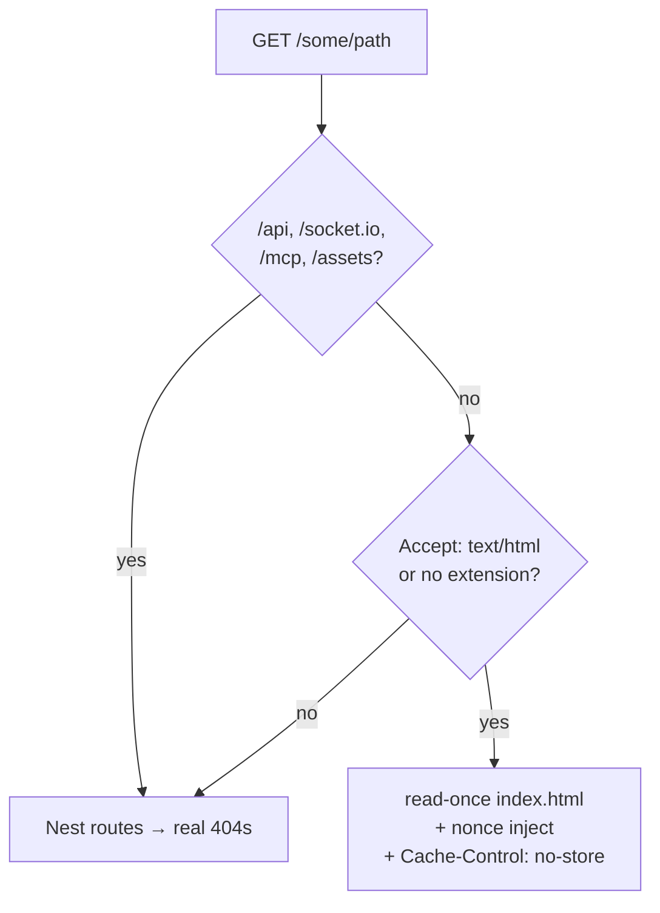
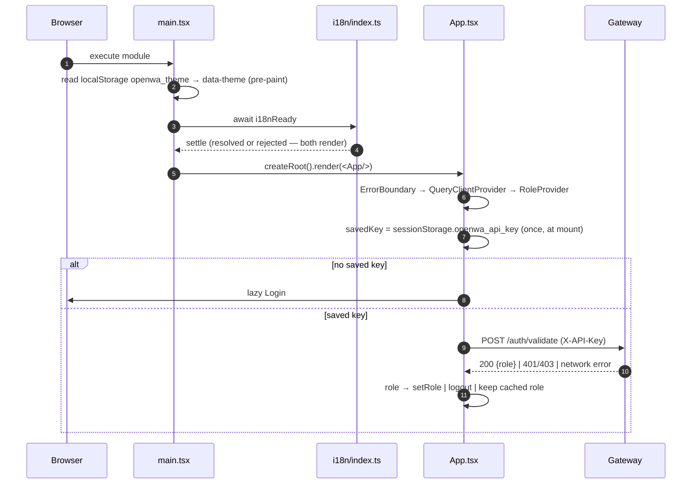

# Dashboard Architecture

> **Source of truth:** `dashboard/vite.config.ts`, `dashboard/src/main.tsx`, `dashboard/src/App.tsx`, `dashboard/src/components/Layout.tsx`, `dashboard/src/services/api.ts`, `src/configure-app.ts`
> **Band:** Dashboard · **Depends on:** 03-architecture-overview.md, 05-configuration-and-env.md · **Jarcube class:** PORTABLE

## Purpose

The shell every other dashboard doc sits inside: how the SPA is built, how it decides whether you
are logged in, how it routes, how it talks to the gateway, and — the part a naive implementation
gets wrong — how a static Vite bundle ends up being served by the same NestJS process under a
per-response CSP nonce without the two disagreeing about what that nonce is.

Three ideas carry most of the weight here, and none of them are React-specific:

1. **The document is dynamic, the assets are static.** A nonce that has to appear in both a response
   header and the HTML body cannot come from a file on disk.
2. **A redeploy invalidates the running tab's chunk manifest.** Route-level code splitting turns
   that into a blank screen unless something catches the failed `import()`.
3. **A cache keyed by resource, not by actor, leaks across logins.** Clearing it is part of logout,
   not an optimisation.

OpenWA's own `docs/17-dashboard-design.md` covers the intended information architecture, the
wireframes, and the component inventory. This doc covers what the code does.

## File Inventory

Line counts as measured; they drift.

| Path | Lines | Role |
| --- | --- | --- |
| `dashboard/src/App.tsx` | 143 | Route table, auth gate, lazy route registry, `QueryClient` construction |
| `dashboard/src/main.tsx` | 28 | Entry point: pre-paint theme apply, i18n gate, `createRoot` |
| `dashboard/src/components/Layout.tsx` | 260 | Sidebar, role-filtered nav, theme + language menus, live version probe, `<Outlet/>` |
| `dashboard/src/components/Layout.css` | 454 | Sidebar/mobile-drawer styling |
| `dashboard/src/components/RoleProvider.tsx` | 30 | Role state + `localStorage` persistence, derived `canWrite` |
| `dashboard/src/components/ErrorBoundary.tsx` | 76 | Class boundary, inline-styled so it survives a CSS failure |
| `dashboard/src/services/api.ts` | 1,355 | The whole gateway client: 13 resource namespaces plus every wire type |
| `dashboard/src/types/role.ts` | 11 | `UserRole` union and the role-context shape |
| `dashboard/src/utils/lazyWithRetry.ts` | 17 | `React.lazy` wrapper that survives a stale-chunk import failure |
| `dashboard/src/utils/chunkReload.ts` | 29 | The React-free reload-once guard behind it |
| `dashboard/src/utils/chunkReload.test.ts` | 52 | Pins reload-once, clear-on-success, rethrow-on-second-failure |
| `dashboard/src/App.css` | 170 | App-level utility classes (spinner, `animate-spin`) |
| `dashboard/src/index.css` | 518 | Design tokens, the `data-theme` cascade, resets, webfont imports |
| `dashboard/src/styles.scope.test.ts` | 76 | Fails the build when a page stylesheet leaves a rule unscoped |
| `dashboard/vite.config.ts` | 46 | React plugin, SPA fallback, `__APP_VERSION__`/`__BUILD_TIME__`, dev proxy |
| `dashboard/index.html` | 16 | The document template, carrying the CSP-nonce placeholder |
| `dashboard/package.json` | 60 | Dependency set, the seven npm scripts, `overrides` |
| `dashboard/package-lock.json` | — | Reproducible install for the Docker build stage |
| `dashboard/eslint.config.js` | 32 | Flat config: TS + react-hooks + react-refresh, four rules relaxed |
| `dashboard/tsconfig.json` | 7 | Solution file; references app + node only |
| `dashboard/tsconfig.app.json` | 33 | Browser lane: strict, `noEmit`, DOM libs, excludes `*.test.ts` |
| `dashboard/tsconfig.node.json` | 27 | Config lane: `vite.config.ts` only, node types |
| `dashboard/tsconfig.test.json` | 8 | Test lane: extends app, adds node types, includes only `*.test.ts` |
| `dashboard/src/vite-env.d.ts` | 4 | `vite/client` reference plus the two `define` globals |
| `dashboard/scripts/check-i18n-parity.mjs` | 125 | Locale key/placeholder parity gate (`npm run i18n:check`) |
| `dashboard/.npmrc` | — | Install settings for the dashboard workspace |
| `dashboard/.gitignore` | — | Ignores `dist/`, `node_modules/` |
| `dashboard/README.md` | — | Vite scaffold readme, largely upstream boilerplate |

Server-side counterparts (documented in 03-architecture-overview.md and 51-security-controls.md,
mapped here because they decide how the bundle is delivered):

| Path | Role |
| --- | --- |
| `src/config/dashboard-csp.ts` | `injectDashboardCspNonce` and the placeholder constant |
| `src/config/dashboard-csp.spec.ts` | Pins the replace-every-occurrence contract |
| `src/configure-app.ts` | Nonce middleware, helmet CSP, the SPA document handler |
| `src/app.module.ts` | `ServeStaticModule` for `/assets`, with its own fallback disabled |

## Build and serve

### Two build lanes, one artifact

`npm run build` in `dashboard/` is `tsc -b && vite build`. `tsc -b` walks the solution file, which
references **only** the app and node projects — so a type error in a `*.test.ts` cannot fail the
production build, and `npm run typecheck` exists separately to check them under
`dashboard/tsconfig.test.json`. The split is deliberate: `dashboard/tsconfig.app.json` sets
`"exclude": ["**/*.test.ts"]`, and the test lane re-adds them with node types on top of `vite/client`.

Tests run on the Node test runner (`node --experimental-strip-types --test`), not Vitest or Jest.
That constraint shows up all over the dashboard's utils: modules meant to be unit-tested are kept
free of `import.meta.env` and of any transitive import of `dashboard/src/services/api.ts`, because
the runner has no Vite transform to satisfy them. `dashboard/src/utils/sessionMutation.ts` says so in
its header comment, and uses type-only imports for exactly that reason.

### Version resolution has a trap in it

`dashboard/vite.config.ts` reads the **root** `package.json` — via `new URL('../package.json',
import.meta.url)`, not `process.cwd()` — to define `__APP_VERSION__`. The comment records why: the
dashboard is normally built from inside `dashboard/`, so cwd-relative resolution picks up
`dashboard/package.json`, which a release does not bump. The Login screen, which has no session and
therefore no `/health` response, would then display a frozen version number indefinitely.

The sidebar hides this class of drift on its own: `dashboard/src/components/Layout.tsx` renders
`__APP_VERSION__` first and then replaces it with `healthApi.check()`'s live `version`, falling back
silently on error. Login cannot, which is what makes the build-time constant load-bearing.

`APP_VERSION` in the environment still overrides both.

### Dev proxy vs production single-port

| Mode | UI origin | API | Notes |
| --- | --- | --- | --- |
| Dev | Vite on `:2886` | proxied `/api` → `localhost:2785` | `/socket.io` proxied with `ws: true` |
| Production | same origin as the API | direct `/api` | `dashboard/dist` copied into the image, served by the API process |
| Split origin | wherever you host it | `VITE_API_URL` origin + `/api` | CORS must list the UI origin |

The dev proxy covers the WebSocket transport too, so the real-time sessions and chats feeds work
against a locally running gateway rather than degrading to polling.

In the image, `Dockerfile` runs `npm run build && npm run dashboard:ci -- --include=dev && npm run
dashboard:build`, then copies `/app/dashboard/dist` into the runtime stage. The root `npm ci` happens
before `dashboard/` is copied in, so the dashboard's own dependencies are installed explicitly at
that later point. `--include=dev` is required because `vite` and `typescript` are devDependencies.
See 74-docker-and-compose.md.

### The nonce problem

`dashboard/index.html` ships a literal placeholder:

```html
<!-- dashboard/index.html -->
<meta name="openwa-csp-nonce" content="__OPENWA_CSP_NONCE__" />
```

In Vite dev this is inert. In production the API owns the document and substitutes a fresh value per
response. Three details make it work:

**The nonce is generated per request, before helmet.** `src/configure-app.ts` sets
`res.locals.cspNonce = randomBytes(18).toString('base64url')` in a middleware that must precede
helmet, because the `scriptSrc` directive is a function reading that same value.

**The document is read once and templated per response, not served from disk.**
`src/configure-app.ts` reads `index.html` into memory at startup and answers matching GETs with
`injectDashboardCspNonce(dashboardIndex, res.locals.cspNonce)` plus `Cache-Control: no-store`. A
static file handler cannot do this, which is why `ServeStaticModule` keeps `/assets` and gives up the
document.

**A cookie was considered and rejected.** The comment is explicit: a second dashboard tab would
overwrite a shared cookie and break the first tab's `srcdoc` scripts. Per-response state in
`res.locals` has no such cross-tab coupling. This matters because plugin config UIs copy the nonce
into inline scripts inside their sandboxed iframe — see 85-dashboard-plugins-and-infrastructure.md.

`src/config/dashboard-csp.ts:injectDashboardCspNonce` replaces **every** occurrence via
`split().join()` rather than `String.replace`. Today there is one placeholder; the stated reason for
the generality is that the natural next one is a `nonce=` attribute on a script tag, and a
first-occurrence-only replace would leave it reading the literal placeholder — the browser refuses
the script and nothing fails server-side.

### Why `ServeStaticModule`'s own SPA fallback is turned off

`src/app.module.ts` sets `renderPath: '/__openwa_spa_fallback_owned_by_main_ts__'`, a literal no real
request can match, because the module has no explicit off switch. Two concrete failures motivated it,
both recorded in the source:

- The built-in fallback answers **every** unmatched GET with `index.html`. A mistyped `<script src>`
  came back `200 text/html`, and the browser reported a JavaScript parse error instead of a 404 —
  a broken build presenting as a confusing symptom.
- It sends the index by absolute path, and Express's `send` refuses dot-segments. Any install path
  containing one (`~/.openwa`, a checkout under `~/.cache`) 404'd every client-side route.

The replacement handler in `src/configure-app.ts` is deliberately narrow. It answers a GET only when
the path is not under `/api`, `/socket.io`, `/mcp`, or `/assets`, **and** the request either sends
`Accept: text/html` or has no file extension. Everything else falls through to Nest and gets a real
404.



### CSP directives the dashboard depends on

| Directive | Value | Why the dashboard needs it |
| --- | --- | --- |
| `scriptSrc` | `'self'` + per-response `'nonce-…'` | The nonce path above |
| `styleSrc` | `'self'`, `'unsafe-inline'`, `fonts.googleapis.com` | Inline styles are used throughout; webfont CSS is `@import`ed |
| `fontSrc` | `'self'`, `fonts.gstatic.com` | The font files themselves |
| `imgSrc` | `'self'`, `data:`, `blob:`, `https:` | `blob:` is the outgoing image-attachment preview built with `URL.createObjectURL(file)` |
| `mediaSrc` | mirrors `imgSrc` | Chat voice notes and video arrive as `data:` URIs; without an explicit `media-src` they fall back to `default-src 'self'` and are blocked |
| `connectSrc` | `'self'` | A split-origin deployment needs this widened |
| `upgradeInsecureRequests` | production unless `CSP_UPGRADE_INSECURE_REQUESTS` opts out | An HTTP-only private-network deployment otherwise gets forced to https |

`connectSrc: ["'self'"]` is worth flagging: it is correct for the bundled single-origin setup and
silently wrong for a `VITE_API_URL` split-origin build served under this same CSP. In practice a
split deployment hosts the UI elsewhere, so the gateway's CSP does not apply — but a deployment that
serves the bundled UI *and* points it at another origin would be blocked by the browser with nothing
in the gateway logs. Details in 51-security-controls.md.

## Boot sequence



Two ordering decisions in `dashboard/src/main.tsx` are load-bearing:

**Theme is applied before React mounts.** `useTheme()` only runs inside `Layout`, so standalone
routes — Login — would flash the OS theme on reload even when the user had explicitly chosen one.
The pre-paint block mirrors `applyTheme` exactly: an explicit choice sets `data-theme`, and
`system`/absent leaves it to the media query. See 88-dashboard-i18n-a11y-theming.md.

**First paint waits for the locale.** `void i18nReady.then(render, render)` — the same handler on
both branches. The active catalogue is fetched rather than bundled, so rendering immediately would
show raw keys and swap a tick later. The rejection handler is belt-and-braces (i18next settles init
either way), and the comment says so: it exists so no future change to that contract can leave the
dashboard blank, which is a worse failure than untranslated text.

## Auth gate and role model

`dashboard/src/App.tsx:AppContent` holds the whole session concept in three pieces of state, and one
subtlety in how the first is read:

```tsx
// dashboard/src/App.tsx
const [savedKey] = useState(() => sessionStorage.getItem('openwa_api_key'));
```

Captured **once**, at mount. Reading `sessionStorage` live per render would make the `null → key`
transition on sign-in re-fire the startup re-validation effect and double the `/auth/validate`
request on every login. The effect is for genuine page refreshes with a stored key.

| Storage | Key | Lifetime | Holds |
| --- | --- | --- | --- |
| `sessionStorage` | `openwa_api_key` | tab | The API key. Tab-scoped on purpose: closing the tab ends the session |
| `localStorage` | `openwa_user_role` | device | The last known role, for optimistic nav rendering |
| `localStorage` | `openwa_theme` | device | `light` / `dark` / `system` |
| `sessionStorage` | `owa_chunk_reloaded` | tab | The reload-loop guard, cleared on the next successful chunk load |

Startup re-validation is classified by `dashboard/src/utils/authLifecycle.ts:resolveStartupValidation`
into `logout` / `role` / nothing — documented with the rest of the auth lifecycle in
86-dashboard-messagetester-and-login.md. The network-failure branch is the interesting one: it keeps
the cached role, so a transient gateway outage at page load does not eject a working operator. Only
an explicit 401/403 logs out.

`dashboard/src/components/RoleProvider.tsx:RoleProvider` derives the four booleans the rest of the app
reads (`isAdmin`, `isOperator`, `isViewer`, `canWrite = admin || operator`) from a single
`UserRole | null`. Role gating happens in two places, and both are cosmetic:

- **Route registration** — `{role === 'admin' && <Route path="api-keys" …/>}`. An unregistered path
  falls through to the `*` route and redirects to `/`.
- **Nav filtering** — `allNavItems.filter(item => !item.adminOnly || userRole === 'admin')` in
  `dashboard/src/components/Layout.tsx`.

Neither is a security boundary. The gateway enforces roles on every route (50-auth-and-api-keys.md);
the comment on the Infrastructure nav item states the intent plainly — hide it from non-admins for UX
and defence in depth, because `/infra/*` is admin-only server-side regardless.

An unrecognised role from the server falls back to `viewer`, the least-privileged value, rather than
to `null`.

### Logout clears the query cache, and that is not housekeeping

```tsx
// dashboard/src/App.tsx — handleLogout
sessionStorage.removeItem('openwa_api_key');
clearActorState(queryClient);
```

The React Query cache is keyed by **resource**, not by actor. Without a full clear, a logout followed
by a login with a differently scoped key in the same tab renders the previous actor's sessions,
messages, API keys, and audit rows from cache before any refetch lands. Query-key conventions are in
87-dashboard-hooks-and-state.md; this is the one place the convention's cost has to be paid back.

## Routing and code splitting

Eleven routes, all lazy, all through `lazyWithRetry` rather than `React.lazy`. `Plugins` is the one
default-export module; the other ten are named exports rewrapped inline.

| Path | Component | Gate |
| --- | --- | --- |
| `/` | `Dashboard` | any role |
| `/sessions` | `Sessions` | any role |
| `/chats` | `Chats` | any role |
| `/webhooks` | `Webhooks` | any role |
| `/templates` | `Templates` | any role |
| `/api-keys` | `ApiKeys` | admin |
| `/logs` | `Logs` | any role |
| `/message-tester` | `MessageTester` | any role |
| `/infrastructure` | `Infrastructure` | admin |
| `/plugins` | `Plugins` | admin |
| `*` | — | `Navigate to="/" replace` |

`Login` is not in the router at all. It renders above `BrowserRouter`, inside its own `Suspense`,
when `isAuthenticated` is false — so there is no authenticated-route tree to leak while unauthenticated.

### The stale-chunk problem

Route-level splitting means the running tab holds a manifest of hashed chunk filenames. A redeploy
replaces them. The next navigation calls `import()` for a file that no longer exists, it rejects, and
without intervention the rejection reaches the top-level `ErrorBoundary` and blanks the entire
dashboard — for a user whose only problem is that they had the tab open during a deploy.

`dashboard/src/utils/chunkReload.ts:loadChunkWithReload` handles it in ~15 lines:

| Situation | Behaviour |
| --- | --- |
| Import succeeds | Clear `owa_chunk_reloaded`, return the module |
| Import fails, no flag set | Set the flag, `window.location.reload()`, return a promise that **never settles** |
| Import fails, flag already set | Rethrow — the failure is not deploy-related, let the boundary show it |

The never-settling promise is the part worth copying: it holds Suspense until the reload navigates
away, so the fallback spinner stays on screen instead of flickering an error state during teardown.
The `sessionStorage` flag is what prevents an infinite reload loop when the cause is adblock,
offline, or a genuine 404.

The module is React-free on purpose — dependencies are injected as
`{ reload, storage }` — so `dashboard/src/utils/chunkReload.test.ts` can exercise all three branches
under the Node test runner with no DOM. `dashboard/src/utils/lazyWithRetry.ts:lazyWithRetry` is the
thin React binding that passes `window.location.reload` and `window.sessionStorage`.

## The API client

`dashboard/src/services/api.ts` is one module, 1,355 lines, and it is both the HTTP client and the
dashboard's copy of the wire contract. There is no generated client and no OpenAPI codegen in this
path; the types are hand-mirrored from the backend DTOs, with comments naming what they mirror.

### Base URL resolution

```ts
// dashboard/src/services/api.ts
const API_ORIGIN = (import.meta.env.VITE_API_URL ?? '').replace(/\/+$/, '');
export const API_BASE_URL = `${API_ORIGIN}/api`;
```

Empty `VITE_API_URL` yields `/api` — same-origin, the default single-container case. A split
deployment sets it to the API **origin** and the `/api` prefix is appended here. The comment records
that `VITE_API_URL` was documented but never read for a while, so split deployments always called
same-origin `/api` and failed with "Invalid API Key".

`API_BASE_URL` is exported specifically so the two direct `fetch` calls that bypass the client —
`/auth/validate` in `dashboard/src/App.tsx` and `dashboard/src/pages/Login.tsx` — honour it too.

When `API_ORIGIN` is set, `dashboard/src/utils/urlSecurity.ts:warnIfInsecureHttpUrl` warns (never
refuses) about an `http://` origin pointing at a non-localhost host, because API keys would travel in
cleartext. Refusing would break local dev and TLS-terminating proxies. See
86-dashboard-messagetester-and-login.md.

### Three transports, one failure path

| Function | Returns | Used for |
| --- | --- | --- |
| `request<T>` | parsed JSON, or `undefined` on 204 | everything ordinary |
| `requestText` | raw text | a plugin's HTML config-UI bundle |
| `requestBlob` | `Blob` | status media, oversized message media |

All three funnel failures through `dashboard/src/services/api.ts:handleErrorResponse`, which does
three things worth noting:

**401 navigates instead of throwing.** The stored key is removed, `window.location.assign('/')` is
called, and a never-settling promise is returned. That halts the caller's chain, so no component
flashes a generic error toast or receives an `undefined` payload while the page is already
navigating away. Same technique as the chunk reload, same reason.

**The error carries `status` and `code`, not just a message.** The `Error.message` is left unchanged
so the toast de-duplication still matches on it, and `status` plus the gateway's machine `code` ride
along as properties. This is what lets callers distinguish a permission 403 from a server 5xx, and —
critically — a reverse-proxy 502 that never reached the gateway (no `code` at all) from a genuine
gateway 502 that did. `dashboard/src/utils/sessionActions.ts:classifyUnlinkError` is the clearest
consumer; see 81-dashboard-sessions.md.

**A non-JSON body falls through to `HTTP <status>`, not `statusText`.** Two reasons given: the status
code is what the toast de-dup matches on, and `statusText` is empty over HTTP/2 anyway.

The API key is read from `sessionStorage` per request rather than closed over, so a key change takes
effect immediately. `FormData` bodies skip the `Content-Type` header so the browser can set the
multipart boundary itself.

### Resource namespaces

| Export | Backend surface | Documented in |
| --- | --- | --- |
| `sessionApi` | `/sessions/*` — lifecycle, QR, pairing, chats, messages, channels, status | 81-dashboard-sessions.md, 82-dashboard-chats.md |
| `messageApi` | `/sessions/:id/messages/*` — 11 send verbs, bulk, batch status | 86-dashboard-messagetester-and-login.md |
| `contactApi` | contacts, number check, profile pictures (single + batch), phone resolution | 82-dashboard-chats.md |
| `webhookApi` | `/webhooks`, `/sessions/:id/webhooks/*` | 83-dashboard-webhooks-and-templates.md |
| `templateApi` | `/sessions/:id/templates/*` | 83-dashboard-webhooks-and-templates.md |
| `apiKeyApi` | `/auth/api-keys/*` | 84-dashboard-apikeys-and-logs.md |
| `auditApi` | `/audit` | 84-dashboard-apikeys-and-logs.md |
| `searchApi` | `/search` | 87-dashboard-hooks-and-state.md |
| `healthApi` | `/health` | this doc (the sidebar version probe) |
| `infraApi` | `/infra/*`, `/health/ready`, export/import | 85-dashboard-plugins-and-infrastructure.md |
| `pluginsApi` | `/plugins/*`, `/infra/engines` | 85-dashboard-plugins-and-infrastructure.md |
| `pluginInstancesApi` | `/integration/plugins/:id/instances/*` | 85-dashboard-plugins-and-infrastructure.md |
| `statsApi` | `/stats/overview`, `/stats/messages` | 87-dashboard-hooks-and-state.md |

Two of these carry a comment that is really an API-design lesson:

`infraApi.healthCheck()` calls **`/health/ready`, not `/infra/health`**. The restart poll must not be
able to latch onto the process it just asked to shut down, and `/infra/health` answers 200 for the
whole drain and teardown. Readiness answers 503 as soon as draining starts. See
85-dashboard-plugins-and-infrastructure.md and 65-settings-and-health.md.

`contactApi.profilePictures` batches into one request and slices to 50 ids client-side, mirroring the
backend cap. The comment records the failure it replaced: a per-chat burst of parallel single fetches
exhausted the per-IP throttle and the sidebar filled with 429s. See 52-rate-limiting.md.

### The wire types encode real distinctions

Worth reading `dashboard/src/services/api.ts` for the type comments alone. A few that change how the
UI behaves:

| Type | The distinction it preserves |
| --- | --- |
| `Session.engineLoaded` | Whether the gateway holds a live engine *right now*. Not derivable from `status`, because `disconnected` covers both mid-reconnect (engine present) and stopped (no engine). Optional by design, not drift — this client clears it to "unknown" after a WS status push |
| `AccountRestriction` | `reachout_timelock` can sit on a perfectly `ready` session; `tos_block`/`proxy_block` refuse the connection itself and cannot |
| `Session.lastError` vs `restriction` | A fault on the gateway's side of the link vs a limit WhatsApp itself imposed |
| `SessionConfig.maxReconnectAttempts: number \| null` | `null` means unlimited, which no value in the accepted 0–20 range can express |
| `EngineHistoryMessage` vs `ChatMessage` | Live engine history carries `fromMe`; a persisted row carries `direction` + `status` |
| `SearchHit.snippet` | Carries `<mark>` markers — the comment says render as text, never as HTML |
| `MESSAGE_TYPES` + `asMessageType` | A closed union plus a coercion function, because raw WS payload fields are strings |

Several fields are marked optional purely because a dashboard can be served by a gateway that
predates them (`Session.restriction`, `InfraStatus.envPinned`). That is a deliberate
forward/backward-compatibility convention, not sloppiness, and each one names it.

## Styling and the cascade-collision gate

`dashboard/src/index.css` holds the design tokens and the `data-theme` cascade; every page and
component ships its own stylesheet next to it. That arrangement has a specific failure mode, and
`dashboard/src/styles.scope.test.ts` exists to make it impossible:

Two pages defining the same bare class — `.btn-action` — leak across each other, and which one wins
depends on lazy-load and navigation order. The last route visited wins the cascade. The test parses
every stylesheet under `dashboard/src/pages/` and fails the build if any rule is left unscoped from
that page's root class (`.sessions-page …`). It handles `@media` nesting and skips `@keyframes` and
`@font-face` bodies.

This is the same pattern as the config layer's derive-from-compose spec described in
05-configuration-and-env.md: a meta-test that makes a convention enforceable rather than remembered.

## Lint configuration

`dashboard/eslint.config.js` is flat config with TypeScript, `react-hooks`, and `react-refresh`
presets, and four rules turned off: `react-hooks/purity`, `react-hooks/incompatible-library`,
`react-hooks/set-state-in-effect`, and `react-refresh/only-export-components` downgraded to a warning
with `allowConstantExport`. The first three are the new React Compiler-era rules; the codebase has
many `setState`-in-effect patterns (the version probe in `Layout`, the config load in the session
detail modal) that are intentional.

## Failure Modes & Edge Cases

| Scenario | Behaviour |
| --- | --- |
| Redeploy while a tab is open, then navigate | One full reload, transparent to the user. Second failure surfaces in the `ErrorBoundary` |
| Redeploy + a non-deploy import failure (offline) | First failure reloads once, second rethrows. No loop |
| Stored key revoked between page loads | `/auth/validate` returns 401/403 → logout, back to Login |
| Gateway unreachable at page load with a stored key | Cached role kept, user stays in. Individual requests then fail with their own toasts |
| Any request 401s mid-session | Key cleared, hard navigate to `/`. The originating promise never settles, so no spurious toast |
| Logout → login as a different actor in one tab | `clearActorState` wipes the cache first; nothing from the previous actor renders |
| Viewer types `/api-keys` in the address bar | Route unregistered → `*` → redirect to `/`. Gateway would 403 anyway |
| Render error anywhere below `ErrorBoundary` | Inline-styled recovery screen with a reload button. Inline styles on purpose: a CSS failure must not take the recovery UI with it |
| `/health` unreachable | Sidebar keeps the build-time `__APP_VERSION__` |
| Locale catalogue fails to load | i18next settles anyway → English, or raw keys in the worst case. Never a blank page |
| Mistyped asset URL in production | Real 404, not a 200 HTML page (this is what disabling the built-in fallback bought) |
| Install path with a dot-segment | Client-side routes work (same fix) |
| `SERVE_DASHBOARD=false` | The API serves `/api` only; `main.ts` logs the reason |
| No `dashboard/dist` in the image | Same, with a distinct startup warning naming the missing path |

## Configuration

| Identifier | Where read | Effect |
| --- | --- | --- |
| `VITE_API_URL` | build time, `dashboard/src/services/api.ts` | API origin for a split-origin deployment. Empty → same-origin `/api` |
| `APP_VERSION` | build time, `dashboard/vite.config.ts` | Overrides the version baked into `__APP_VERSION__` |
| `SERVE_DASHBOARD` | runtime, `src/app.module.ts` | `false` disables SPA serving entirely |
| `CORS_ORIGINS` | runtime, `src/configure-app.ts` | Required for a split-origin dashboard |
| `CSP_UPGRADE_INSECURE_REQUESTS` | runtime, `src/configure-app.ts` | Opt out of the HTTPS upgrade for HTTP-only private networks |

Full list: APPENDIX-A-env-vars.md.

## Jarcube Portability

**Classification:** PORTABLE

**Rationale:** Nothing in this doc knows what WhatsApp is. It is a build pipeline, a routing shell, an
auth gate, and an HTTP client.

**Prerequisites:** none for the patterns. 50-auth-and-api-keys.md if the role model is ported too.

**Cloud API caveats:** none.

**What Jarcube already has, and where the gap actually is.** `QuantumMind-ui/` is Next.js 12 (pages
router) with MUI 5, Redux Toolkit, and axios — a different stack in every layer that matters here.
Concretely:

- **Serving.** Next.js owns its own document via `_document.tsx`, and Next has first-class nonce
  support through its own CSP handling. The OpenWA read-once-and-template middleware is *not* the
  thing to port; the *reasoning* is. Specifically, the rejection of a shared nonce cookie on
  multi-tab grounds applies identically to Jarcube if it ever renders sandboxed iframes from
  third-party config UIs.
- **Server state.** Jarcube has no TanStack Query and no SWR. Server data lives in Redux slices under
  `QuantumMind-ui/src/store/apps/` (20 of them). That is the largest single divergence in the whole
  dashboard band, and it is why 87-dashboard-hooks-and-state.md matters more than this doc for a port.
- **Auth.** `QuantumMind-ui/src/context/AuthContext.tsx` holds a JWT in `localStorage` (the socket
  service reads `accessToken` from it). OpenWA's tab-scoped `sessionStorage` key plus
  cache-clear-on-logout is a strictly tighter posture; the cache-clear step has a direct Redux
  analogue (dispatch a root reset action on logout) and Jarcube should have one whether or not
  anything else is ported.
- **Role gating.** Jarcube uses CASL (`QuantumMind-ui/src/configs/acl.ts`, roles `admin`/`agent`/
  `client`). That is a richer model than OpenWA's three-role enum and there is no reason to replace
  it. The transferable detail is the **fallback direction**: OpenWA maps an unrecognised role to
  `viewer`. Jarcube's `defineRulesFor` falls through to `can(['read','create','update','delete'],
  subject)` for an unknown role — the permissive branch. That is worth revisiting independently of
  this port.

**Specific recommendations:**

1. **Copy `chunkReload.ts` more or less verbatim.** Next.js has its own chunk-load-error handling, but
   the reload-once-guarded-by-storage pattern and the never-settling promise are 15 lines and prevent
   a blank screen for every user who had a tab open during a deploy. Verify Next's built-in behaviour
   first; if it already reloads, skip it.
2. **Copy the 401 handling shape from `handleErrorResponse`.** Jarcube uses axios, so this becomes a
   response interceptor. The transferable parts are (a) clearing the token before navigating and (b)
   returning a promise that never settles so no downstream `.catch` fires a toast during navigation.
3. **Attach `status` and the machine `code` to the thrown error.** This is the single highest-value
   line in the client. Message-text heuristics for distinguishing a proxy 502 from a gateway 502
   cannot be made correct, and Jarcube's Cloud API path has the same class of ambiguity (a Meta
   Graph API error vs an nginx error).
4. **Adopt the scoped-CSS meta-test if Jarcube ever leaves MUI.** With `sx`/emotion the collision
   class does not exist, so this is not currently relevant — noted so nobody ports the test into a
   codebase that cannot benefit from it.
5. **Take the version-resolution lesson, not the code.** Read the version from the artifact a release
   actually bumps, and prefer a live value from the API wherever a session exists. Jarcube's
   `package.json` version is `1.0.0` and appears not to be release-managed, so this is a latent
   version-reporting gap rather than a port.

## Open Questions

- `connectSrc: ["'self'"]` and `VITE_API_URL` are mutually exclusive for a *bundled* dashboard served
  by the gateway. Whether any supported deployment shape combines them — and therefore whether the
  CSP needs to learn about `VITE_API_URL` — is not determinable from the code.
- `dashboard/package.json` declares `@tanstack/react-table` and `yet-another-react-lightbox`. The
  lightbox is used by `dashboard/src/components/chats/MediaLightbox.tsx`; no import of
  `@tanstack/react-table` was found in `dashboard/src/`. Whether it is a leftover or a planned
  dependency is not stated anywhere.
- `dashboard/package.json` is at version `0.10.2` while the root package is at `0.23.3`. The build
  deliberately ignores the dashboard's own version, so this is inert — but whether it is intentionally
  frozen or simply unmaintained is not recorded.
- The `overrides` block pins `brace-expansion` and `socket.io-parser`. Both look like advisory
  remediations, but no comment or changelog entry names the advisories.
