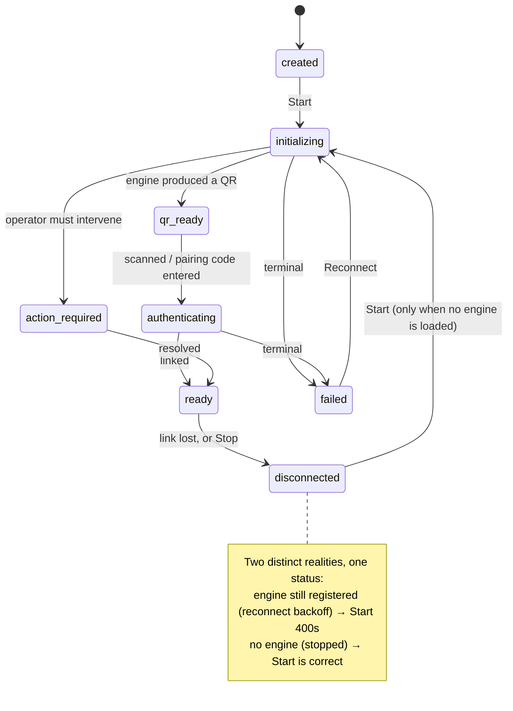
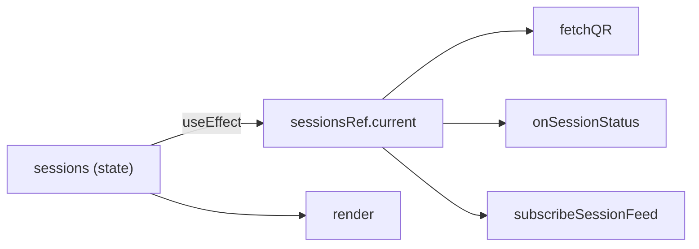
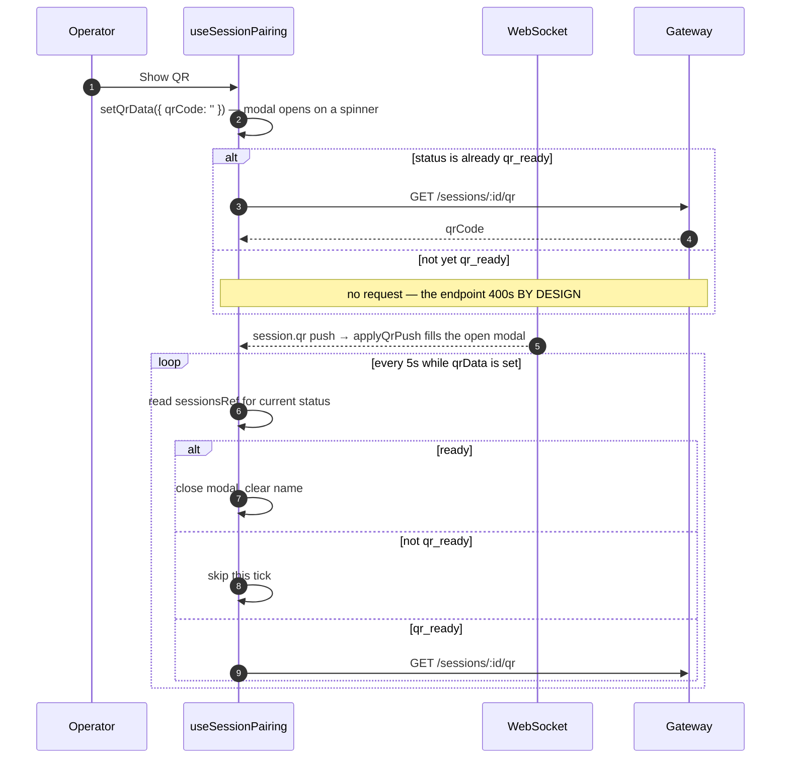
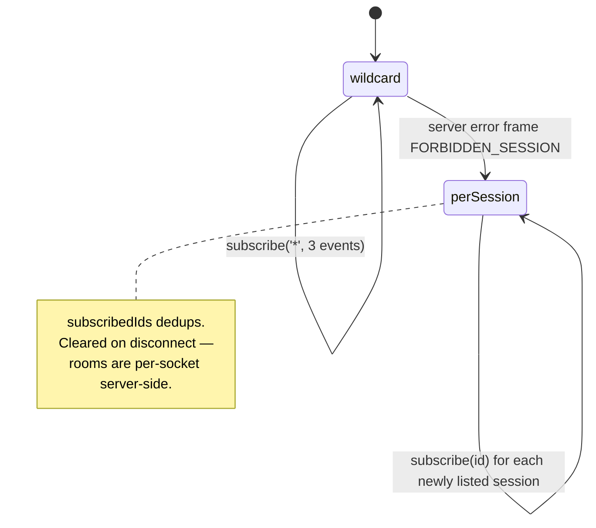
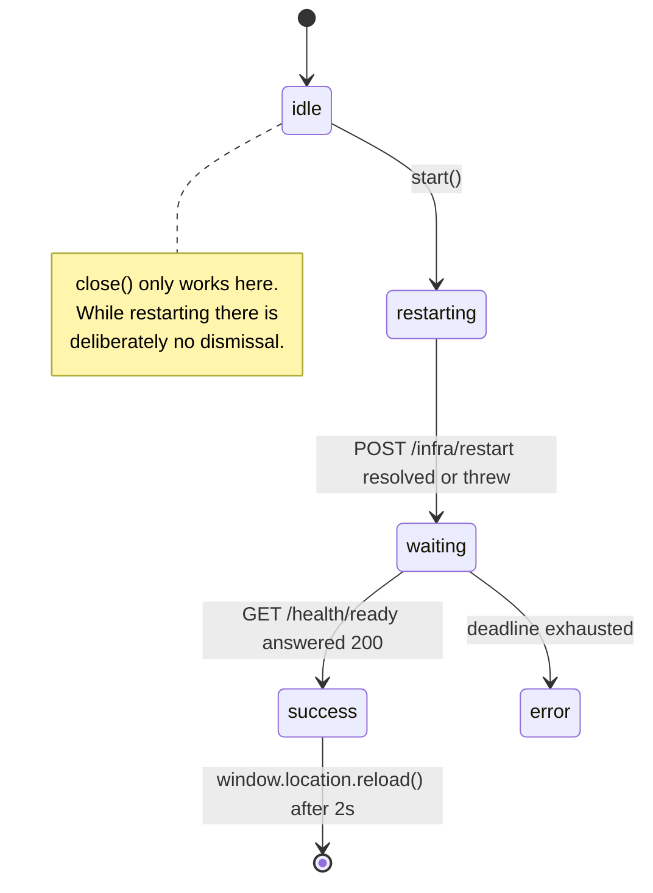

# Dashboard: Sessions

> **Source of truth:** `dashboard/src/pages/Sessions.tsx`, `dashboard/src/hooks/useSessionPairing.ts`, `dashboard/src/hooks/useSessionFeed.ts`, `dashboard/src/utils/sessionActions.ts`, `dashboard/src/utils/sessionFeedSubscription.ts`
> **Band:** Dashboard · **Depends on:** 80-dashboard-architecture.md, 20-session-lifecycle.md, 24-qr-and-pairing-flow.md · **Jarcube class:** ENGINE-COUPLED

## Purpose

The Sessions page is where OpenWA's unofficial-client nature becomes visible in the UI: QR codes,
pairing codes, an eight-state lifecycle, force-kill for a wedged Chromium, and account restrictions
imposed by WhatsApp itself. None of that exists in a Cloud API product.

What makes it worth reading closely is not the widgets. It is that the page solves one hard problem
correctly and says so in comments at every site: **status is not sufficient to decide which actions
a session offers.** `disconnected` means two different things, and the page refuses to guess. Every
other decision here — clearing a field on a WebSocket push, refetching on specific transitions,
replacing rather than merging a response — follows from that one observation.

## File Inventory

Line counts as measured; they drift.

| Path | Lines | Role |
| --- | --- | --- |
| `dashboard/src/pages/Sessions.tsx` | 898 | The page: local session list, 9 handlers, 5 modals, the card grid |
| `dashboard/src/pages/Sessions.css` | 864 | Card grid, status pills, QR/pairing modal, restriction row |
| `dashboard/src/pages/Sessions.test.ts` | 401 | 8 jsdom tests: list render, create, pairing-tab persistence, QR dismissal, restriction row, config toggle + revert |
| `dashboard/src/hooks/useSessionCreateForm.ts` | 53 | The "New Session" modal: name, `creating` flag, `handleCreate` |
| `dashboard/src/hooks/useSessionPairing.ts` | 210 | QR/pairing modal: 6 state vars, the gated 5 s poll, 8 handlers |
| `dashboard/src/hooks/useSessionFeed.ts` | 105 | The page's single `useWebSocket` call plus 4 subscription effects |
| `dashboard/src/hooks/useRestartFlow.ts` | 166 | Process-restart modal state machine (used by the Infrastructure page) |
| `dashboard/src/utils/sessionForm.ts` | 71 | Name rules, pairing-phone rule, status groups, list filter |
| `dashboard/src/utils/sessionForm.test.ts` | 98 | 10 tests, including the "unknown filter matches nothing" case |
| `dashboard/src/utils/sessionActions.ts` | 53 | Which actions a card offers; `replaceSession`; unlink-error classification |
| `dashboard/src/utils/sessionActions.test.ts` | 193 | 15 tests — the densest util spec in the dashboard |
| `dashboard/src/utils/sessionMutation.ts` | 32 | Reconcile a local mutation with the shared query cache |
| `dashboard/src/utils/sessionMutation.test.ts` | 110 | 5 tests, including "an absent cache stays absent" |
| `dashboard/src/utils/sessionFeedSubscription.ts` | 46 | Wildcard-then-per-session subscription state machine |
| `dashboard/src/utils/sessionFeedSubscription.test.ts` | 80 | 4 tests covering the scope fallback |
| `dashboard/src/utils/reconnectState.ts` | 41 | Pure WS reconnect detection (consumed by the Chats page) |
| `dashboard/src/utils/reconnectState.test.ts` | 43 | 5 tests, one per transition |
| `dashboard/src/utils/restartPoll.ts` | 25 | Readiness-poll deadline derived from the server's own estimate |
| `dashboard/src/utils/restartPoll.test.ts` | 56 | 7 tests, two of which assert on the *calling* code |
| `dashboard/src/hooks/useResolvedPhone.ts` | 22 | Lazy LID → MSISDN resolution, cached a day |
| `dashboard/src/utils/formatPhone.ts` | 59 | JID → phone extraction and cosmetic international formatting |
| `dashboard/src/utils/formatPhone.test.ts` | 59 | 13 tests, most of them about what must return `null` |

## The status model

The gateway's eight statuses, and how the page treats each. Server-side semantics are in
20-session-lifecycle.md.

| Status | Card shows | Offered actions |
| --- | --- | --- |
| `created` | info rows | View, Start, Delete |
| `initializing` | QR placeholder, "preparing", disabled button | View, Stop, Unlink, Delete, Force-kill |
| `qr_ready` | QR placeholder, "scan to connect", Show-QR enabled | as above |
| `authenticating` | info rows | as above |
| `ready` | info rows, phone populated | View, Stop, Unlink, Delete, Force-kill |
| `disconnected` | info rows | **depends on `engineLoaded`** — see below |
| `action_required` | info rows + `lastError` | View, Stop/Reconnect, Unlink, Delete, Force-kill |
| `failed` | info rows + `lastError` | View, Reconnect, Delete |



### `engineLoaded`, and why status-derived gating cannot be fixed

`dashboard/src/utils/sessionActions.ts` states the problem in a header comment and then solves it in
four short functions. Stop, Unlink, and Force-kill share one precondition — the gateway holds a live
engine to act on. Start has the exact complement; it answers 400 while one exists. So all four derive
from the server's own `engineLoaded`, which is read from the live engine map per request.

```ts
// dashboard/src/utils/sessionActions.ts
const STARTED_STATUSES_FALLBACK = new Set(['initializing', 'qr_ready', 'authenticating', 'ready', 'action_required']);

export function isSessionStarted(session: Pick<Session, 'status' | 'engineLoaded'>): boolean {
  return session.engineLoaded ?? STARTED_STATUSES_FALLBACK.has(session.status);
}
```

The fallback is not a default — it is a compatibility shim whose behaviour is chosen to be *wrong in
exactly the historical way*. A dashboard talking to a gateway that predates the field reproduces the
old status set, so it keeps the old known-bad answer for `disconnected` rather than guessing
differently. `sessionActions.test.ts` pins all three cases including "falls back to the status set
when the gateway omits `engineLoaded`".

Two consequences the comments call out:

- **Force-kill excludes `failed`.** A terminal failure already evicted the engine, so there is nothing
  to kill. The card offers Reconnect instead.
- **Force-kill now includes `disconnected` with an engine.** That is precisely the wedged case the
  button exists for, and the status-only rule used to hide it.

### The `engineLoaded: undefined` write on a status push

This is the subtlest line on the page, and it is deliberate:

```tsx
// dashboard/src/pages/Sessions.tsx — onSessionStatus
sessionsRef.current = sessionsRef.current.map(s =>
  s.id === event.sessionId ? { ...s, status: event.status as Session['status'], engineLoaded: undefined } : s,
);
```

The `session.status` WebSocket envelope carries a status and nothing else. Keeping the previous
`engineLoaded` would pair a fresh status with a stale engine answer — the card could offer Start to a
session that just acquired an engine, or Unlink to one that no longer has one. Clearing it to
"unknown" makes `isSessionStarted` fall back to the status set until an authoritative response
arrives.

And because the fallback is *knowingly wrong* for `disconnected`, that specific branch refetches:

| Pushed status | Extra work |
| --- | --- |
| `ready` | success toast |
| `disconnected` | **refetch** (only the server knows whether an engine is still registered) + warning toast |
| `action_required` | **refetch** (pick up `lastError`, i.e. what the operator must do) + warning toast |
| `failed` | **refetch** (pick up `lastError`) + error toast |
| anything else | list patch only |

A dedup guard sits in front of all of it: some engines double-signal one transition, so a push whose
status equals the current one returns early. The comparison reads `sessionsRef.current` and the ref is
updated **synchronously**, before `setSessions`, so a duplicate arriving in the same tick — before the
sync effect runs — is also caught.

## The ref-mirror pattern

`sessionsRef` shadows `sessions` and exists purely to keep callback identities stable:



Reading `sessions` inside `fetchQR` would make it a dependency, which would tear down and restart the
5-second QR polling interval on **every** sessions update. Reading it inside `onSessionStatus` would
churn the WebSocket handler identity and re-subscribe the socket. Both comments say exactly that.

`applySessionResponse` writes through the ref first and then hands the same array to `setSessions`,
so the two never disagree even within one tick.

The same discipline governs `useSessionPairing`: `applyQrPush` and `dismissQrForSession` are both
`useCallback(…, [])` built on the **functional** `setQrData` form. Reading `qrData` directly would make
each of them a dependency of `applySessionResponse`, which the page's stop/force-kill/unlink handlers
hold — rotating its identity for a reason none of those callers care about.

## Onboarding: QR and pairing code

`dashboard/src/hooks/useSessionPairing.ts` owns six state variables and the poll that feeds them.

### Why the pairing state lives in the hook, not in a panel component

Stated in the hook's docblock: the pairing panel renders only while `pairingMode` is true. A component
that unmounts on every QR ↔ Phone tab toggle would discard whatever the operator had typed.
`Sessions.test.ts` has a test named exactly for this — *"a typed pairing phone number survives
toggling to the QR tab and back"*.

### The poll is gated, twice



The gate matters because `GET /sessions/:id/qr` **400s by design** before the engine has produced a
code. Polling it unconditionally just fills the operator's console with expected failures. The
WebSocket `session.qr` push covers first display; the poll only handles refresh of an existing code.

The error path is equally specific. On a failed poll the hook re-reads the session and keeps the modal
open while the status is one of `initializing`, `qr_ready`, or `authenticating`. `authenticating` is in
that set so the modal — and the pairing panel mounted inside it — survives the brief post-link
handshake instead of being torn down mid-pairing.

### Pairing-code flow

| Step | Rule |
| --- | --- |
| Input | `onChange` strips non-digits, `maxLength={15}` |
| Validation | `dashboard/src/utils/sessionForm.ts:isValidPairingPhone` — `/^[0-9]{6,15}$/`, no `+`, no separators |
| Double-submit | Guarded by an early return on `requestingPairing`, because the button is disabled while in flight but the input's Enter handler is not |
| Display | `pairingCode.substring(0, 4)` + `-` + the rest, matching WhatsApp's own 4-4 grouping |
| Tab switch | `selectPairingTab` always clears `pairingError`, so a stale error from the other tab never shows |
| Change number | Clears code and phone, returns to the form |

`handleShowQR` resets `pairingMode`, `phoneNumber`, `pairingCode`, and `pairingError` before opening,
so a freshly opened modal can never show a code belonging to a different session.

`dismissQrForSession` is called from `applySessionResponse` on every authoritative response, so
stopping, force-killing, or unlinking a session closes *its* QR modal — and only its own, because the
functional updater compares ids. `Sessions.test.ts` pins it: *"stopping a session dismisses its own
open QR modal"*.

## The live session feed

`dashboard/src/hooks/useSessionFeed.ts` exists mainly to enforce a cardinality rule stated in its
docblock: `useWebSocket` opens **its own socket per call**, so a second call site anywhere on this
page would double every handshake, subscribe storm, and `session.status` toast. One call, wrapped.

The subscription itself is a two-state machine in
`dashboard/src/utils/sessionFeedSubscription.ts`, kept pure so it can be tested without a socket:



A session-scoped API key is not allowed to join the `'*'` room; the gateway answers with a
`FORBIDDEN_SESSION` error frame instead of an ack. `noteSessionFeedError` returns `true` **exactly
once** — on that frame, in wildcard scope — telling the caller to re-run the subscription per session.
Any other code, or a repeat, leaves state alone. The listed sessions are all joinable because the list
endpoint is already scope-filtered server-side.

Without this fallback, a scoped key gets no status or QR push at all and the QR modal sits on
"generating" forever. That is the failure the fallback exists to prevent, and it is named in the
comment.

Four effects keep it correct:

| Effect | Trigger | Why |
| --- | --- | --- |
| Fold error frame | `feedErrorFrame` changes | The handler cannot reference `subscribe` directly, so the frame is parked in state and folded in an effect where `subscribe` exists |
| Join on connect | `isConnected` | Wildcard attempt, or per-session rooms after a fallback |
| Forget dedup set | `isConnected` → false | Rooms are per-socket. A reconnect lands on a fresh socket with no subscriptions, so a retained dedup set would skip every id and no frame would ever arrive again |
| Join late arrivals | `sessions` changes, per-session mode only | Sessions created after the fallback still need rooms |

The three subscribed events are `session.status`, `session.qr`, `session.restriction`
(`SESSION_FEED_EVENTS`). Payloads and the subscribe protocol are in 54-websocket-events.md.

`onSessionRestriction` is wired as a **pure refetch signal** — no payload fields are read. The comment
gives the reason: the badge renders from the server projection (`session.restriction`), and a
restriction can arrive with no status transition at all, because the Baileys reachout timelock rides a
connect probe.

## Cache reconciliation

The Sessions page keeps its own `useState` list rather than a `useQuery`. That is a deliberate
divergence from every other page in the dashboard, and it creates an obligation: the shared
`['sessions']` cache that the Dashboard reads must be told when this page mutates something.

`dashboard/src/utils/sessionMutation.ts` is that bridge, and it has one non-obvious rule:

```ts
// dashboard/src/utils/sessionMutation.ts
queryClient.setQueryData<Session[]>(queryKey, cached => (cached ? replaceSession(cached, updated) : cached));
```

**It does not seed an absent cache.** If nothing has populated the key yet, the page holds no observer
on it, and seeding a one-row stub would shadow the real list query when it eventually mounts.
`sessionMutation.test.ts` pins this as *"an absent cache stays absent (no seeding with a one-row
list)"*.

Invalidation targets the `['sessions']` **prefix**, which matches every session-scoped key — the list,
the stats, and the per-session groups/chats/templates queries. Because the Sessions page holds no
active observer on any of them, invalidation only marks them stale: no refetch fires here, so there is
no loop, and sibling views refetch lazily on their next mount. See 87-dashboard-hooks-and-state.md for
the key conventions this depends on.

| Page event | Local state | Cache |
| --- | --- | --- |
| Mount / reload | `setSessions(data)` | invalidate prefix |
| Create | functional append | invalidate prefix |
| Delete | functional filter | invalidate prefix |
| Stop / force-kill / unlink | `applySessionResponse` | `setQueryData` replace + invalidate |
| Status push (real transition) | ref + state patch | invalidate prefix |
| Status push (duplicate) | nothing | nothing |

Every local mutation uses the **functional** `setSessions` form. The reason is stated at each site: a
WebSocket push or a fetch landing between the `await` and the `setState` would otherwise drop a row.

### Replace, never merge

`dashboard/src/utils/sessionActions.ts:replaceSession` swaps in the exact authoritative response
object. The comment records the defect it fixed: the page used to discard the response and fabricate
`{ status: 'disconnected' }`, losing server-owned fields — `phone: null`, timestamps. Five of the
fifteen tests in `sessionActions.test.ts` are about `replaceSession` alone, including "a response
whose id is absent does not drop other rows".

`handleStart` carries the same lesson from the other direction. It used to write a local
`status: 'connecting'` — **a value the gateway never emits** — while keeping every other field from
before the start, which now includes `engineLoaded`, leaving the card offering Start to a session that
had just acquired an engine.

## Error classification

`dashboard/src/utils/sessionActions.ts:classifyUnlinkError` is four lines and is the best example in
the dashboard of why 80-dashboard-architecture.md attaches the gateway's machine `code` to thrown
errors:

| Input | Verdict | Toast |
| --- | --- | --- |
| Error with `code === 'SESSION_LOGOUT_INCOMPLETE'` | `incomplete` | **warning**, showing the server's own message and retry guidance |
| Bare reverse-proxy 502 (no `code`) | `generic` | error, no retry guidance |
| JSON 502 without that exact code | `generic` | error |
| Anything else | `generic` | error |

The distinction is not cosmetic. `SESSION_LOGOUT_INCOMPLETE` means the session stopped locally while
the unlink stayed incomplete, so "start it and retry the logout" is correct advice. A proxy 502 may
never have reached the gateway at all — nothing was stopped, and that same advice would be actively
wrong. A message-text heuristic cannot tell them apart.

`handleStart` classifies one code of its own: `SESSION_NAME_TEARDOWN_PENDING` (409) means a credential
teardown for that name is still settling. It is retryable, so the page warns with the server's message
and deliberately does **not** open a QR modal — there is no engine to scan yet. Every other start
error keeps the authoritative-reload-then-QR fallback.

## Session name rules

`dashboard/src/utils/sessionForm.ts` exists because three call sites — the create button's disabled
state, the format hint, and the duplicate warning — each rebuilt the same rule from a different subset
of its clauses and drifted apart.

| Rule | Value | Why |
| --- | --- | --- |
| Format | `/^[a-z0-9-]+$/` | Names become on-disk directory names |
| Length | ≤ 50 | — |
| Duplicate | against the current list | — |
| Input coercion | `value.toLowerCase().replace(/\s+/g, '-')` in the page | Typing a space produces a legal name rather than an error |

`sessionNameIssues` returns **every** issue, not the first, because the form shows format and length
independently — a name can be both malformed and too long. `duplicate` is reported only once format
and length pass: telling someone their unusable name is also taken is noise.

An empty name is a disabled button, not a message. The page computes
`newSessionName ? sessionNameIssues(...) : []`, so the form stays quiet until you type.

### Status filter groups are the operator's model, not the engine's

```ts
// dashboard/src/utils/sessionForm.ts
const STATUS_GROUPS: Record<string, string[]> = {
  active: ['ready'],
  connecting: ['initializing', 'authenticating', 'qr_ready'],
  inactive: ['created', 'disconnected', 'action_required', 'failed'],
};
```

`inactive` deliberately includes `action_required` and `failed`: both need the operator rather than
time, which is what the group means. An unknown filter key matches **nothing** rather than everything
(`STATUS_GROUPS[filter] ?? []`) — a test asserts it, because the permissive alternative would silently
show all sessions under a typo'd filter.

## Phone display

Two layers, cheap first:

1. `dashboard/src/utils/formatPhone.ts:parsePhoneFromJid` extracts digits from a personal-account JID
   and returns `null` for everything else.
2. `dashboard/src/hooks/useResolvedPhone.ts` asks the gateway, and only when layer 1 failed.

Layer 1's `null` cases are the whole point, and thirteen tests are mostly about them. A LID privacy
id, a group id, and a status/broadcast/newsletter id are all digit-heavy but are **not** phones.
Formatting one produces a convincing fake: the comment gives the observed example, a LID
`262813461250071@lid` rendered as `+26 281 346 125 0071`. So the domain check is a whitelist —
`c.us` and `s.whatsapp.net` only — not a blacklist. Group-participant ids carry a `:device` suffix,
which is stripped.

`formatPhoneForDisplay` is explicitly cosmetic and avoids a `libphonenumber-js` dependency: WhatsApp
hands over digits already canonicalised with the country code in place, so a grouping heuristic
suffices. Country-code length prefers 2, falls back to 1 for an 11-digit number starting with `1` or
anything ≤ 6 digits, then groups as trailing-4 plus 3s from the left. The raw JID stays authoritative
wherever the exact id matters.

`useResolvedPhone` caches for a day (`staleTime: 24h`) because an @lid ↔ phone mapping is stable, and
sets `retry: false` so an unmappable id does not spam the gateway. Callers pass `enabled` inputs only
when the local formatting already returned `null`.

## Session config in the detail modal

`SessionConfig` is not on the list payload — the API never returns the config column — so it is
fetched when the detail modal opens, not N times to render the list.

The load effect is keyed on `selectedSession?.id` and starts by clearing the previous value, so a
config fetched for one session can never render against another. It carries a `cancelled` flag for the
unmount/reselect race.

On failure it **leaves the row absent** rather than defaulting the toggle to off. The comment states
why plainly: rendering it off would assert that auto-reject is disabled for a session nobody managed
to ask about.

The toggle itself is optimistic with a revert:

| Step | Action |
| --- | --- |
| 1 | Capture `previous`, apply the new value locally |
| 2 | `PATCH /sessions/:id/config` with **only** the key it owns (the endpoint merges) |
| 3 | On success, replace state with the server's response |
| 4 | On failure, restore `previous` and toast |

Two `Sessions.test.ts` cases pin both halves, the second named for the consequence: *"a rejected write
reverts the toggle instead of leaving it showing a state the gateway never accepted"* — for a call
auto-reject setting, a stuck-on toggle claims calls are being rejected when the gateway never agreed.

## The restriction badge

Rendered from `session.restriction`, and — unlike the `lastError` row — **not gated on status**. The
inline comment gives the reason: a reachout timelock applies to a session that is perfectly `ready`,
and hiding it behind a status would make it invisible exactly when the operator needs it.

The visible label is the translated `kind`. The engine's raw cause token (`TOS_BLOCK`, `BIZ_QUALITY`)
plus the enforcement end date, when WhatsApp states one, go in the `title` tooltip via
`restrictionTitle` — searchable but not readable, so it does not belong in the label. Two tests cover
present and absent.

## The restart flow (shared with Infrastructure)

`dashboard/src/hooks/useRestartFlow.ts` and `dashboard/src/utils/restartPoll.ts` live in the session
band by file layout but drive the Infrastructure page's post-save restart — the page itself is in
85-dashboard-plugins-and-infrastructure.md. They are here because the polling problem they solve is
the same class as the QR poll's: *do not latch onto the state you are trying to leave.*



Four details worth carrying:

**The restart call is expected to fail.** `POST /infra/restart` is awaited inside a `try` whose
`catch` is a no-op comment — the server may go down before it answers. `estimatedTime` is declared
outside the `try` because the poll deadline is derived from it.

**Readiness, not liveness.** Covered in 80-dashboard-architecture.md; the poll targets `/health/ready`
because `/infra/health` answers 200 throughout the drain, so the poll used to "succeed" in about three
seconds against the process it had just asked to shut down. `restartPoll.test.ts` asserts this against
the *calling* code, not just the helper.

**The deadline comes from the server's own estimate, clamped at both ends.**
`restartPollAttempts` floors at 60 attempts and caps at 300, doubling the estimate in between. The
reasoning: `estimatedTime` reaches 63 s when a restart brings up postgres, redis, and minio together,
so a fixed-60 deadline would report failure while the stack was still coming up correctly — and a
missing or absurd estimate must neither shorten the deadline nor leave the modal waiting forever.

**Every timer is tracked and cancelled on unmount.** A `Set` of poll timeouts plus the countdown
interval, torn down in a cleanup effect, so navigating away mid-restart cannot `setState` on a dead
component. The trailing `window.location.reload()` on success is intentionally kept.

The profile pair (`pending`/`previous`) is **one state object rotated by a single functional update**,
not two setters reading each other's render-scoped values — React StrictMode double-invokes updater
functions, which would make the rotation order fragile.

## Failure Modes & Edge Cases

| Scenario | Behaviour |
| --- | --- |
| Session-scoped API key | Wildcard subscribe rejected → per-session fallback, silently, once |
| WebSocket reconnect | Dedup set cleared, all rooms re-joined. Without the clear, no frame would ever arrive again |
| Duplicate `session.status` envelope | Swallowed by the ref-synchronous dedup guard; no toast, no invalidation |
| `disconnected` push | Refetch, because the status alone cannot say whether an engine is still registered |
| Show-QR before `qr_ready` | No request issued; modal opens on a spinner and waits for the WS push |
| QR poll 400s repeatedly | Modal stays open while the status is `initializing`/`qr_ready`/`authenticating` |
| Session goes `ready` while the QR modal is open | Poll closes it and reloads the list |
| Session stopped while its QR modal is open | `dismissQrForSession` closes it; another session's modal is untouched |
| Double-Enter on the pairing input | Second call returns early on `requestingPairing` |
| Double-click Unlink | Second call returns early on `unlinkingId`; the button is also disabled |
| Unlink 502 with `SESSION_LOGOUT_INCOMPLETE` | Warning + the server's retry guidance, plus an authoritative refetch |
| Unlink 502 from a proxy | Generic error, no retry guidance |
| Start on a name whose teardown is pending | 409 warning, refetch, no QR modal |
| Start fails otherwise | Refetch; QR modal opened unless the session came back `ready` |
| Config fetch fails | Toggle row absent rather than showing a fabricated `false` |
| Config write rejected | Optimistic toggle reverted, error toast |
| Gateway predates `engineLoaded` | Status-set fallback — old behaviour, old known-bad `disconnected` answer, nothing new invented |
| Gateway predates `restriction` | Field absent, no badge |
| Background refetch on a live page | No full-page spinner: `initialLoadDone` restricts it to the first load, so a restriction arriving on a live page does not read as a reload |
| Viewer role | Every mutating button absent; the gateway would refuse anyway |

## Jarcube Portability

**Classification:** ENGINE-COUPLED

**Rationale:** The page's entire reason for existing is unofficial-client onboarding and liveness. QR
codes, pairing codes, `engineLoaded`, force-kill, and WhatsApp-imposed account restrictions have no
Cloud API counterpart. `QuantumMind-backend/src/whatsapp/whatsapp.service.ts` speaks Meta's Cloud API:
per-bot access tokens, a `hub.verify_token` handshake, no session and no QR. There is nothing to
render here.

**Prerequisites:** 20-session-lifecycle.md, 24-qr-and-pairing-flow.md, and a transport in Jarcube that
has a session concept at all. Without one, this page has no subject.

**Cloud API caveats:** A Cloud API "session" is a phone-number-id plus a token. Its failure modes are
token expiry, webhook verification failure, and template rejection — an entirely different set. Do not
port the state machine; port the *shape* of the reasoning below.

**What survives the transport change.** Four patterns here are transport-independent and are the real
deliverable of this doc:

1. **Derive available actions from a server-reported precondition, not from a display status.** This
   is the central lesson and it generalises immediately. Jarcube's equivalent of `disconnected` is a
   bot whose token is present but rejected — "connected" in the UI, unusable in fact. A boolean the
   server computes per request, plus a compatibility fallback that reproduces the *old* wrong answer
   rather than a new one, is the correct shape.
2. **Clear derived server state when a partial push arrives.** The `engineLoaded: undefined` write is
   the pattern: a push that carries a subset of a resource must invalidate the fields it does not
   carry, not preserve them. Jarcube's socket events (`chat-message-bot`, `message`, `new-visitor` in
   `QuantumMind-ui/src/services/socket.services.ts`) are all partial payloads folded into Redux
   slices, so this applies directly.
3. **Subscription scope fallback.** `QuantumMind-ui/src/services/socket.services.ts` calls
   `io(url, { auth: { token } })` and subscribes to fixed global events with no room protocol and no
   reconnect resubscription. If Jarcube ever introduces per-tenant or per-bot rooms, the
   wildcard-then-per-entity fallback plus **clearing the dedup set on disconnect** is the part that is
   easy to get wrong: rooms are per-socket server-side, and a retained dedup set after a reconnect
   produces a silently dead feed. That bug is currently impossible in Jarcube only because there are
   no rooms.
4. **Classify errors on machine codes, never on message text.** Directly portable, and Jarcube needs
   it more: a Graph API error and a proxy error look similar in prose and require opposite operator
   advice.

**Explicitly do not port:** the QR poll gating, the pairing-code panel, `engineLoaded` itself,
force-kill, `AccountRestriction`, and `formatPhone.ts`. The last one is tempting and should still be
skipped — its `null` cases are all WhatsApp identity types (LID, group, broadcast, newsletter), so the
rule set has no meaning outside a WhatsApp JID space.

**One thing to port immediately, independent of everything else:** the restart-poll lesson. Any UI
that asks a backend to restart and then polls for it must poll **readiness**, not liveness, and must
derive its deadline from the server's own estimate. Jarcube has no such flow today, which is why it
is worth writing down before one is built.

## Open Questions

- `dashboard/src/utils/reconnectState.ts` is inventoried here (session-adjacent by file layout) but is
  consumed by the Chats page's cache invalidation. It has no Sessions-page caller. Whether that is
  intentional generality or a leftover from an earlier arrangement is not recorded.
- The Sessions page is the only page holding its session list in `useState` rather than a `useQuery`,
  which is what makes `sessionMutation.ts` necessary at all. No comment explains the choice; the WS
  push cadence and the ref-mirror requirement are plausible reasons but are not stated.
- `useSessionFeed` accepts `onSessionRestriction` as optional while the page always supplies it. No
  other caller exists.
- The docblock in `useSessionFeed.ts` references a "`useSessionList` rejection" — an extraction that
  was considered and declined. The reasoning is summarised there but the full argument is not in the
  tree.
- `SessionConfig` exposes `maxReconnectAttempts` and `reconnectBaseDelay`, but the detail modal only
  renders the `autoRejectCalls` toggle. Whether the other two are intentionally operator-hidden or
  simply not yet surfaced is not stated.
