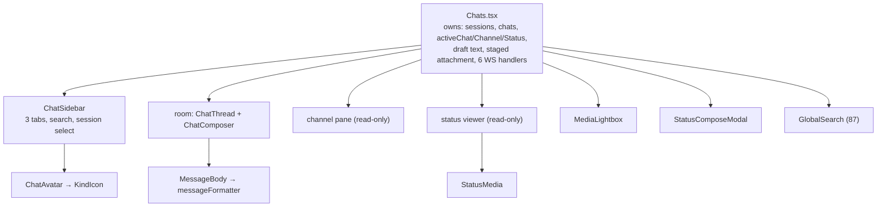
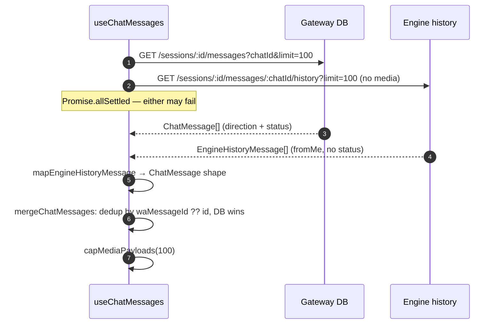
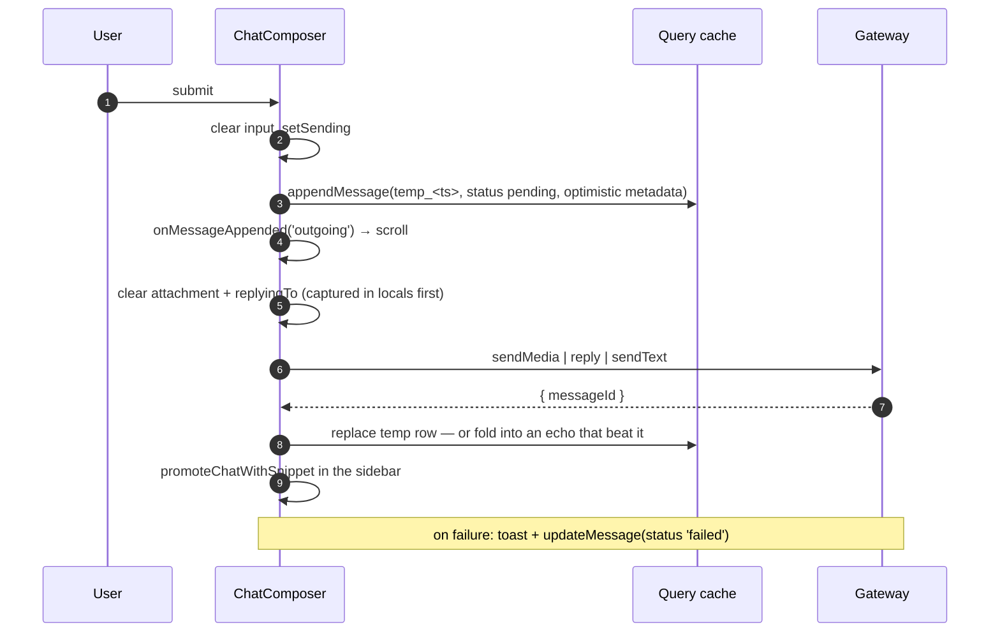
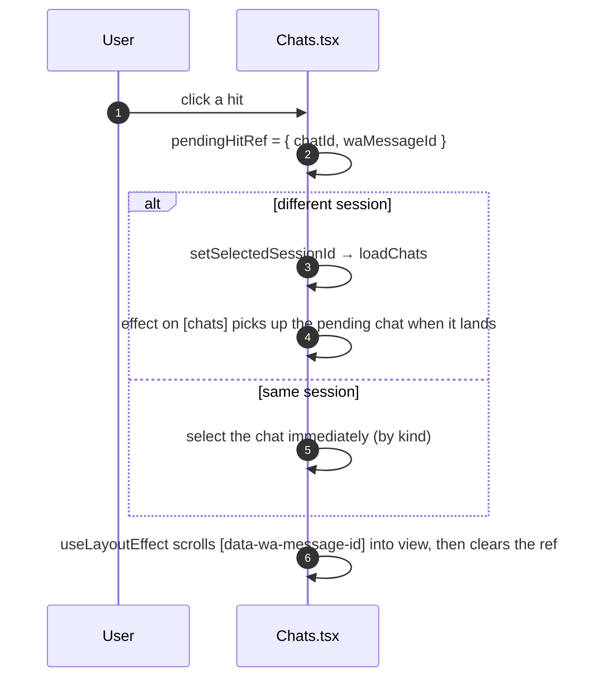

# Dashboard: Chats

> **Source of truth:** `dashboard/src/pages/Chats.tsx`, `dashboard/src/utils/chatMessages.ts`, `dashboard/src/hooks/useChatScrollPosition.ts`, `dashboard/src/components/chats/ChatComposer.tsx`, `dashboard/src/components/chats/ChatThread.tsx`
> **Band:** Dashboard · **Depends on:** 80-dashboard-architecture.md, 87-dashboard-hooks-and-state.md · **Jarcube class:** PORTABLE

## Purpose

The largest single feature in the dashboard — 23 files, roughly 6,000 lines with its stylesheet — and
the one where the interesting engineering is invisible in a screenshot. A chat UI looks like a list
and an input box. What it actually is:

- A **merge problem**. Two sources (the gateway's database and the engine's live history) describe
  overlapping sets of messages with different field shapes and different authority.
- A **convergence problem**. Six WebSocket event types, an optimistic send, and an HTTP response all
  race to describe the same message, out of order, some carrying less information than what is
  already on screen.
- A **memory problem**. Base64 media in a cache with `staleTime: Infinity` grows the tab without
  bound.
- A **scroll problem**. Media has no layout box before it decodes, so every naive scroll restore is
  clamped and lands at the top.

Each of those has a named, tested module. That is the reason this doc is worth reading even for
someone who will never render a WhatsApp message: the four problems are generic to any real-time
conversational UI, and OpenWA's answers are unusually well-documented at the source.

OpenWA's own `docs/17-dashboard-design.md` covers the intended layout and the wireframes.

## File Inventory

Line counts as measured; they drift.

| Path | Lines | Role |
| --- | --- | --- |
| `dashboard/src/pages/Chats.tsx` | 1,066 | The page: sessions, chat list, 3 tabs, 6 WS handlers, search-hit navigation, lightbox |
| `dashboard/src/pages/Chats.css` | 1,559 | The largest stylesheet in the tree: two-pane layout, bubbles, media, status viewer |
| `dashboard/src/pages/Chats.test.ts` | 528 | jsdom tests for the page's merge/append/ack behaviour |
| `dashboard/src/components/chats/ChatSidebar.tsx` | 316 | Session selector, tab bar, search, three list renderers |
| `dashboard/src/components/chats/ChatThread.tsx` | 402 | Bubble list: media, quotes, reactions, sender runs, on-demand media download, jump-to-bottom |
| `dashboard/src/components/chats/ChatComposer.tsx` | 373 | Attachment staging, emoji panel, reply banner, the whole optimistic-send flow |
| `dashboard/src/components/chats/StatusComposeModal.tsx` | 296 | Status composer: text/image, background + font, engine-gated recipient picker |
| `dashboard/src/components/chats/MediaLightbox.tsx` | 52 | `yet-another-react-lightbox` wrapper: zoom, download, counter, captions |
| `dashboard/src/components/chats/MessageBody.tsx` | 50 | Renders the parsed AST, wrapped in `linkify-react` |
| `dashboard/src/components/chats/StatusMedia.tsx` | 51 | Blob-fetches status media so the API key can travel in a header |
| `dashboard/src/components/chats/ChatAvatar.tsx` | 22 | Sidebar avatar, batch picture or generic icon |
| `dashboard/src/components/chats/KindIcon.tsx` | 11 | `ChatKind` → lucide icon |
| `dashboard/src/hooks/useChatMessages.ts` | 75 | The DB+history merge query and the three cache-write actions |
| `dashboard/src/hooks/useChannelMessages.ts` | 14 | Channel post list |
| `dashboard/src/hooks/useChatScrollPosition.ts` | 197 | Per-chat scroll memory, bottom pinning, media-decode re-pin |
| `dashboard/src/hooks/useChatScrollPosition.test.ts` | 46 | Pins `decideRestoreTarget` and `isNearBottom` |
| `dashboard/src/hooks/useContactStatuses.ts` | 10 | Stored-status query, tab-gated |
| `dashboard/src/hooks/useProfilePicture.ts` | 25 | One avatar, 1 h stale, no retry |
| `dashboard/src/hooks/useProfilePictures.ts` | 27 | The whole sidebar in one request, capped at 50 in list order |
| `dashboard/src/utils/chatMessages.ts` | 284 | Merge, dedup, delivery-rank, metadata merge, media cap, revoke/edit lookup |
| `dashboard/src/utils/chatMessages.test.ts` | 419 | The largest util spec in the dashboard |
| `dashboard/src/utils/chatList.ts` | 92 | Sidebar reducers: promote on arrival, promote on send |
| `dashboard/src/utils/chatList.test.ts` | 128 | — |
| `dashboard/src/utils/chatFilters.ts` | 71 | Per-tab search predicates and the status grouping |
| `dashboard/src/utils/chatFilters.test.ts` | 105 | Pins both status orderings |
| `dashboard/src/utils/composerSend.ts` | 84 | Send-payload and optimistic-metadata builders |
| `dashboard/src/utils/composerSend.test.ts` | 72 | — |
| `dashboard/src/utils/scrollDecision.ts` | 32 | Scroll-to-bottom vs preserve |
| `dashboard/src/utils/scrollDecision.test.ts` | 39 | — |
| `dashboard/src/utils/messageFormatter.ts` | 206 | WhatsApp markup → AST, depth-capped |
| `dashboard/src/utils/messageFormatter.test.ts` | 103 | — |
| `dashboard/src/utils/search-highlight.ts` | 35 | `<mark>` snippet → safe segments; search-param builder |
| `dashboard/src/utils/search-highlight.test.ts` | 26 | — |

## Page structure



The page owns every query and every piece of shared state; the components render and report
interactions upward. Two exceptions are called out in the source and are worth noting because they
look like leaks and are not:

- **`ChatComposer` writes to the query cache directly.** It owns the optimistic-send flow end to end,
  so the reconciliation has to happen where the temp id is known.
- **The draft text and the staged attachment live in the page, not the composer.** `ChatComposer`
  unmounts when the room closes, which would silently discard a typed draft or a picked file.

### Three tabs, three gating rules

| Tab | Query | Gating |
| --- | --- | --- |
| Chats | `sessionApi.getChats` in page state | none |
| Channels | `['channels', sessionId]` | **engine-gated** (`whatsapp-web.js` only) **and** tab-gated |
| Status | `['contact-statuses', sessionId]` | tab-gated only — both engines have status content |

The channels gate is a full `enabled: false`, not an error path. Baileys throws 501 for both channel
listing and reading, so the query never fires rather than failing per request — which is why
`ChatSidebar`'s branch order (`engineLoading` → `!supported` → `isLoading` → `error` → empty) never
depends on a request having actually run. Engine capability details are in
12-engine-capability-matrix.md and 37-channels-newsletters.md.

Tab-gating both non-default queries means selecting a session while on the Chats tab does not fire a
background `/status` or `/channels` fetch nobody is looking at.

Switching tabs closes whatever conversation is open (`switchTab` clears all three actives), so a
Chats-tab room is never left rendered underneath a Channels list.

## The merge problem

`useChatMessages` fires two requests for one chat and merges them:



`Promise.allSettled`, not `Promise.all`: only **both** failing is an error. A freshly paired session
has an empty DB and a full engine history; a session whose engine is down has the reverse.

Three rules make the merge correct:

**The DB copy wins on conflict** — it carries the authoritative delivery status. History rows are
mapped with `status: 'read'` because they are old and already seen, and no live delivery state exists
for them.

**Except for `author`.** A legacy DB row has no stable sender id, so the engine-history copy's
`author` is salvaged when the DB row lacks one. Without that, two same-named group participants
collapse into one attribution run with one colour.

**History is fetched without media, and that absence is rendered explicitly.** A history row whose
type is in `HISTORY_MEDIA_TYPES` arrives with no payload, so it is given
`{ media: { mimetype: '', omitted: true } }` — the 📎 placeholder — rather than an empty bubble. The
DB copy of a recent message still wins, so its real media survives.

Identity throughout is `waMessageId ?? id`. A DB row has `id` = UUID and `waMessageId` = the WhatsApp
id; a live WebSocket message uses the WhatsApp id for both. Anything keyed on `id` alone double-adds.

## The convergence problem

Everything that can describe one message, and what each source omits:

| Source | Carries | Omits |
| --- | --- | --- |
| Optimistic bubble | temp id, media base64, quote, `pending` | real id, real status |
| `POST send-*` response | real `messageId` | body, media, quote |
| `message.sent` echo | real id, status | media payload on a Baileys API send; quote/call as undefined leaves |
| `message.ack` | id + neutral status | everything else |
| `message.reaction` | id + reactions, **or reactions absent** | everything else |
| `message.revoked` | `id` and/or `revokedId` | body |
| `message.edited` | id, chatId, new body | everything else |
| DB refetch | everything persisted | media beyond the inline budget |

`dashboard/src/utils/chatMessages.ts:mergeOrAppend` is where they converge, and it applies three
separate merge rules, each of which exists because a specific field got destroyed:

### Delivery status advances only

```ts
// dashboard/src/utils/chatMessages.ts
const DELIVERY_RANK: Record<string, number> = { pending: 0, sent: 1, delivered: 2, read: 3 };
```

Live events and engine acks arrive out of order, and a reconnect can replay `message.sent` for a
message already shown as read. `mergeDeliveryStatus` mirrors the backend's transition rules: rank
advances only, `failed` is terminal and only reachable from `pending`/`sent`, and an unrecognised
status is ignored rather than accepted. Both the WS append path and the ack path call the same
function, so they cannot drift. Backend-side rules are in 32-message-status-acks.md.

### Metadata merges per field, with a media exception

`mergeMessageMetadata` merges field by field because a live `message.sent` echo is constructed as
`{ media, quotedMessage, call }` with undefined leaves — a wholesale `incoming ?? existing` swap
wipes the optimistic bubble's quote and call info.

Media gets one extra rule: **an incoming marker without a payload must not clobber an existing copy
holding the real base64.** Both a Baileys API-send echo and the media-less history fetch emit
`{ media: { omitted: true } }` with no `data`. The optimistic bubble is the only copy holding the
bytes until a refetch, and the cache is `staleTime: Infinity`, so there is no refetch coming. Losing
them turns a just-sent image into a permanent 📎.

### Absent is not empty

`mergeReactionSnapshot` is four lines and exists to defend one `??`:

| Incoming `reactions` | Meaning | Result |
| --- | --- | --- |
| `undefined` | The gateway holds no stored copy to snapshot from (ephemeral message, or one predating the session going live) — **unknown** | Keep what is on screen, including the local optimistic `me` reaction |
| `{}` | Every reaction was withdrawn — **known empty** | Clear the badge |

`||` would collapse the two. The comment notes that the socket layer carries the absence through
deliberately (`dashboard/src/hooks/useWebSocket.ts`) and flattening it anywhere in between makes this
function dead code — so the distinction is a contract across three layers, not a local nicety.

### Revoke and edit lookups need both candidate ids

`findRevokedIndex` tries **both** `event.id` and `event.revokedId` against **both** `m.id` and
`m.waMessageId`. The reason is asymmetry between engines: Baileys sets the two ids identically;
whatsapp-web.js resolves `revokedId` separately because its revoke event can carry an id of its own
that matches no stored row, and leaves `revokedId` undefined when the original is not in its local
store. Matching either candidate is a superset that stays correct on both engines, so it cannot
regress the Baileys path. `revokedId` is explicitly guarded against `undefined`, which would otherwise
match any row whose `waMessageId` is also undefined.

`applyMessageEdit` needs both candidates for the simpler reason that persisted rows and live rows key
differently.

### The send race

The trickiest few lines in the dashboard, in `ChatComposer`:

```tsx
// dashboard/src/components/chats/ChatComposer.tsx
const echoAlreadyAdded = prev.some(m => m.id === result.messageId || m.waMessageId === result.messageId);
if (echoAlreadyAdded) {
  return mergeOrAppend(prev.filter(m => m.id !== tempId), reconciled);
}
return prev.map(m => (m.id === tempId ? reconciled : m));
```

The realtime `message.sent` echo can arrive **before** the HTTP response. Receive-time dedup misses
it, because the optimistic placeholder is still keyed by the temp id, so the cache now holds two rows
for one message. The fix is not to drop the placeholder — the echo may carry no media payload, and
dropping it erases the attachment's base64. Instead the placeholder is folded *into* the echo's row
through `mergeOrAppend`, whose media rule keeps the payload.

## The memory problem

`useChatMessages` uses `staleTime: Infinity` — realtime events maintain the cache, so there is never a
background refetch. That makes every base64 payload that lands in a slice permanent for the slice's
lifetime, and an image held as a `data:` URI is held twice.

Three bounds, in layers:

| Bound | Value | Where |
| --- | --- | --- |
| History fetched without media | `includeMedia=false` | `useChatMessages` queryFn |
| Payloads per cached slice | `MEDIA_PAYLOAD_CACHE_LIMIT = 100` | `capMediaPayloads`, run by both `mergeChatMessages` and `mergeOrAppend` |
| Slice lifetime after last observer | `gcTime: 5 min` | `useChatMessages` |

`capMediaPayloads` strips the **oldest** payloads down to the omitted marker, so the newest stay
renderable in both the thread and the lightbox. It is count-based rather than byte-based because
payload size is already bounded upstream by the backend's media cap (34-media-pipeline.md).

The cap's value is not arbitrary, and the comment explains the constraint precisely: it **must cover
the fetch window**. The query loads a 100-message slice with media; a smaller cap would strip payloads
*inside* the window the user can scroll to, and with `staleTime: Infinity` there is no refetch path —
leaving a dead-end 📎 for media that was actually fetched.

`capMediaPayloads` returns the input array untouched when already under the cap, preserving reference
identity so nothing downstream re-renders.

### The escape hatch for stripped and oversized media

Because the placeholder would otherwise be terminal, `ChatThread` makes it a button. Clicking fetches
`GET /sessions/:id/messages/:chatId/:messageId/media` as a blob and triggers a download.

The state shape is the interesting part:

```tsx
// dashboard/src/components/chats/ChatThread.tsx
const [mediaFetch, setMediaFetch] = useState<Record<string, 'loading' | 'failed'>>({});
```

Keyed by message id, **not** one shared slot. The comment records what one shared slot did: a viewer
clicking a second placeholder before the first resolved let the second overwrite the first, after
which whichever settled first cleared the other's state — re-enabling a button whose fetch was still
open, and landing a failure marker on the wrong bubble.

## The scroll problem

`dashboard/src/hooks/useChatScrollPosition.ts` is 197 lines to solve what sounds like one line, and
every part of it is defending against a specific browser behaviour.

### Saving cannot happen at switch time

Stated at the top of the file: a layout effect runs **after** React has swapped the container's
content to the new chat. A post-swap read of `scrollTop` captures the *new* content's (possibly
clamped) value, not the leaving chat's position — so saving there and restoring later lands the
returning chat at the top.

The answer is to save continuously. The scroll listener writes the live `scrollTop` into the per-chat
`Map` on every genuine user scroll, so the map always holds each chat's last real position.

### Programmatic writes must be distinguishable from user scrolls

`programmaticWriteRef` marks the hook's own writes so the listener skips them. A genuine user scroll
does three things a programmatic one must not: cancel a pending restore, update the pin state, and
write the position map.

There is a subtlety in `writeScrollTop`: if the assignment does not change the value (or clamps to the
same value), **no scroll event fires**, so the flag would stay set and swallow the next genuine user
scroll. It is cleared immediately in that case.

### Media has no layout box before it decodes

This is the core issue, and it produces two distinct bugs the hook handles separately:

| State | On each `onMediaLoad` | Cleared by |
| --- | --- | --- |
| Pinned to bottom | Re-pin to bottom (`scrollHeight` grew, silently un-bottoming the view) | Any user scroll away from the bottom |
| Pending `saved` restore | Re-apply the saved `scrollTop` (the first write was clamped to the pre-decode height) | Any user scroll |

Without the first, a thread with images "opens at the top". Without the second, a returning visit to a
media-heavy chat lands somewhere above the saved spot. Both release on a genuine user scroll, so late
decoding never yanks a reading user.

### The append heuristic

`dashboard/src/utils/scrollDecision.ts:decideScroll` is deliberately trivial and deliberately separate:

- Outgoing always scrolls to bottom — the user wants to see what they sent.
- Incoming scrolls only when the user is already within 100 px of the bottom.

The geometry must be captured **before** the message is committed to the DOM, so `scrollHeight`
reflects the pre-append state and "near bottom" answers the user's current intent. `onMessageAppended`
snapshots first, then defers the actual scroll to `requestAnimationFrame` so the new message is in the
DOM by the time it runs.

### The listener with no dependency array

```tsx
// dashboard/src/hooks/useChatScrollPosition.ts
useEffect(() => {
  const el = containerRef.current;
  if (!el) return undefined;
  // …
  el.addEventListener('scroll', onScroll, { passive: true });
  return () => el.removeEventListener('scroll', onScroll);
});
```

No dep array, so it re-runs on every render. The comment justifies it: React runs the previous cleanup
first, so the listener must be re-attached unconditionally each run. The container ref is populated by
a child (`ChatThread` mounts it), which is why a mount-only effect would miss it.

`ChatThread` keeps a **second**, separate scroll listener for the jump-to-bottom button's visibility.
That is not duplication by accident — the comment explains that `useChatScrollPosition` intentionally
does not expose its pin state, because doing so would re-render the whole room on every scroll tick.
The button's listener tracks one boolean at a 120 px threshold.

### No DOM virtualisation

Worth stating plainly, because it is the opposite of what the file sizes suggest: the thread renders
**every** message in the slice. There is no `react-window`, no `react-virtual`, no windowing of any
kind. The bound on DOM size is the bound on the slice — a 100-message fetch window — and the bound on
memory is `capMediaPayloads`. There is no incremental "load older messages" path either; the window is
fixed at 100 and the only way to reach older content is global search.

That is a coherent design for a support/ops console and a real limitation for anything archival. It is
listed under Open Questions rather than presented as a finished decision, because nothing in the
source says whether it is intentional.

## The composer

### Attachment staging, and the FileReader race

`FileReader` is asynchronous, which creates a class of bug the codebase solves with a monotonic token
in two places (`ChatComposer` and `StatusComposeModal`):

```tsx
// dashboard/src/components/chats/ChatComposer.tsx
const myRead = ++attachmentReadSeq.current;
reader.onload = event => {
  if (attachmentReadSeq.current !== myRead) return;
  // …stage the bytes
};
```

The counter is bumped by a newer pick, a removal, and — via a cleanup effect keyed on
`activeChat.id` — leaving the conversation. That last one matters most: a late `onload` would
otherwise stage a file against whichever chat is open by then, and the file could be sent to the wrong
recipient.

The page complements it. A staged attachment is dropped when the user moves to a **different** chat,
but deliberately kept when the room merely closes (`activeChat` → `null`), so close/reopen is a
lossless round trip. Switching session drops it too, since the round trip is scoped to one session.

Size is checked **before** base64 encoding at 18 MiB. Base64 inflates ~1.33×, so 18 MiB raw stays
under the backend's 25 MiB body limit — and a 413 only arrives after the whole body has been uploaded,
so a client-side toast is both faster and avoids OOMing the tab in `FileReader`.

The image preview `blob:` URL is revoked by a single effect in the page keyed on `previewUrl`, whose
cleanup runs with the previous value on every change. One effect covers new file, remove, send, and
chat switch. It lives in the page rather than the composer because revoking on the composer's unmount
would hand a reopened room a dead blob URL for an attachment that is still staged.

### Reply and attachment are independent

`dashboard/src/utils/composerSend.ts` exists because the composer treated "has an attachment" and "is
replying" as mutually exclusive, and replying *with* an attachment silently dropped the quote with no
assertion anywhere.

| Builder | Rule |
| --- | --- |
| `quotedIdOf` | `waMessageId \|\| id` — a just-sent optimistic message has no WA id yet, and replying to your own message must not lose its quote |
| `buildMediaSendPayload` | Spreads `quotedMessageId` in **only when present** — the API rejects unknown/empty fields, and an always-present key makes every ordinary media send look like a failed reply in a request log |
| `buildOptimisticMetadata` | Media and quote both, independently |

The send branch order is what carries the fix: a reply carrying an attachment takes the `sendMedia`
branch, so the quote has to travel with the media — the `else if (currentReplyingTo)` reply branch
never sees it.

### Send flow



## The sidebar

`dashboard/src/utils/chatList.ts` holds two reducers that used to be inline `setChats` updaters, and
the extraction fixed a real bug rather than just enabling tests.

`applyIncomingToChatList` returns `{ chats, needsSidebarRefetch }` instead of firing the refetch
itself. The comment names the failure: the refetch used to be a `void loadChats(...)` **inside** the
`setChats` updater, and React double-invokes updaters under StrictMode — so every message for a chat
the sidebar did not have refetched the list twice.

Its other rules:

| Rule | Reason |
| --- | --- |
| Unread bumps only when the chat is not the active one | — |
| A location message's snippet is a localised label, not its body | The body is a multi-kilobyte base64 map thumbnail |
| An unknown chat triggers a refetch — **except** an outgoing echo addressed `@lid` | A LID-migrated contact echoes back `@lid` while the user sent to `@c.us`; the sent bubble is already reconciled in the active chat, so refetching on every such send just churns the list |
| `promoteChatWithSnippet` on an unknown chat is a no-op | The send path promotes an existing row, it never creates one |

### Profile pictures: one request, list order

`useProfilePictures` batches the whole sidebar. The failure it replaced is named in both the hook and
the API client: one `useProfilePicture` per row bursts N parallel calls and exhausts the per-IP
throttle into 429s (52-rate-limiting.md).

Two details in the 12-line hook are worth copying:

- **Ids are capped at 50 in list order, then sorted only for the query key.** Capping a sorted list
  can exclude every row currently on screen; capping in list order gives the visible top rows their
  pictures. Sorting for the key means reordering the sidebar does not refetch.
- **`staleTime: 1h`, `gcTime: 30min`, `retry: false`.** Signed CDN URLs rotate every few hours, so
  aggressive caching is correct; a null result just keeps the icon fallback and must not be retried.

The active room's avatar uses the single-id `useProfilePicture` and additionally calls `refetch()` from
the `` handler, which is the cheapest possible answer to a rotated signed URL.

### Two small rendering rules that were bugs

From `ChatSidebar`:

```tsx
// dashboard/src/components/chats/ChatSidebar.tsx
{chat.timestamp ? <span className="chat-item-time">{formatChatTime(chat.timestamp)}</span> : null}
```

A ternary rather than `&&`: a chat with no messages carries `timestamp: 0`, and React renders the
number `0` as text — so `0 && <span/>` painted a literal "0" where the time belongs, on every such
row.

And in the page: the channels zero-state ("not subscribed to any channels") is keyed on the
**unfiltered** list, so a non-matching search shows an empty list rather than claiming there are none.

## Status and channels

Both panes are explicitly read-only: no send footer, no reactions, no delete, no reply, no
mark-as-read. Statuses are ephemeral broadcast posts and channels are a broadcast feed; neither is a
two-way conversation.

### The derived-active-group pattern

Only `activeStatusContactId` is state. The open group is derived from `groupedStatuses` at render
time. The comment gives the payoff: a refetch — window focus, or a post-compose refresh — flows
straight into the open viewer instead of leaving it pinned to the snapshot captured at click time, and
a group whose items have all expired simply closes the viewer. This is a small pattern with a large
correctness benefit for any live-updating master/detail view.

### Two orderings that run in opposite directions

`dashboard/src/utils/chatFilters.ts:groupStatusesByContact` collapses the flat list to one row per
contact, and the two sorts disagree on purpose:

- **Groups: newest contact first**, so the most recently active contact heads the list.
- **Items within a group: flipped to oldest-first**, because the store returns statuses newest-first
  and the viewer opens at the newest — reading like a WhatsApp story, newest at the bottom where the
  scroll lands.

The docblock says why it is a tested function rather than an inline sort: getting either direction
wrong is invisible in a screenshot and obvious to a user.

Timestamps are compared **lexically** on ISO-8601 strings, which orders correctly and is noted as safe
because the store hands them over as strings and never as epoch numbers.

### `StatusMedia` and the header problem

`` cannot carry the `X-API-Key` header. So the bytes are fetched through
`sessionApi.getStatusMediaBlob` (which does) and re-exposed as a local object URL, revoked on unmount
or `statusId` change. The type mapping has one specific case: a **voice** status is an Ogg/Opus blob
and gets an `<audio>` element — an `` would render as a broken image.

### The status composer is engine-branched

`StatusComposeModal` is the one place in the chats band where the two engines require different UI:

| Engine | Recipients |
| --- | --- |
| Baileys | Explicit allow-list (`statusJidList`). The picker is shown and **required** |
| whatsapp-web.js | No per-recipient concept; broadcasts to the account's status-privacy audience. The picker is hidden and `recipients` is `undefined` |

`composeCanSubmit` additionally requires `currentEngine.data` to be loaded at all, because while the
engine type is unknown a Baileys submit would go out with no recipients and 400.

The recipient cap is 256, mirroring `@ArrayMaxSize(256)` on the backend DTO, so the user cannot build
a list the gateway is guaranteed to reject. The font `<select>` offers `{0,1,2,6,7,8,9,10}` — 3–5 do
not exist on the wire and the backend rejects them — while the page's read-side `STATUS_FONT` map
*does* include 3–5, because older clients still emit them. Asymmetric on purpose: accept more than you
produce. Details in 36-status-stories.md.

## Message text rendering

`dashboard/src/utils/messageFormatter.ts:parseMessageBody` parses WhatsApp markup into an AST in two
passes: code segments first (triple-backtick before single), then `*bold*`, `_italic_`, `~strike~` on
the remaining text.

The boundary rules mirror WhatsApp's own: an opener needs a boundary character (or string start)
outside and a non-whitespace character immediately inside; a closer needs the mirror. Unbalanced or
boundary-violating markers stay literal.

Two hardening measures against hostile input, both documented as such:

| Threat | Defence |
| --- | --- |
| `*_*_*_…` nesting thousands of levels deep → stack overflow, frozen tab | `MAX_FORMAT_DEPTH = 20`; past it the remainder becomes a literal text node, markers and all |
| `*a* *a* *a* …` producing thousands of sibling segments | Siblings are emitted **iteratively** (a `while` loop), not recursively |

And one that is easy to miss: `flushText` pushes nodes in a `for` loop instead of
`nodes.push(...parsed)`, because spreading a huge segment list into `push()` hits the engine's
argument-count limit and throws **the same `RangeError`** as a stack overflow — so the depth cap alone
would not have been enough.

`MessageBody` renders the AST and wraps it in `linkify-react` with `ignoreTags: ['code', 'pre']` so
code segments are not linkified, `rel="noopener noreferrer"`, and an `onClick` that stops propagation
so clicking a link does not also trigger the bubble. It is `memo`ised.

### Search snippets are never HTML

`dashboard/src/utils/search-highlight.ts:renderHighlightedSnippet` splits the backend snippet on
`<mark>`/`</mark>` and returns `{ text, marked }` segments. The body text in that snippet is **not**
HTML-escaped by the backend, so the docblock is emphatic: render each segment as a React text node —
React's escaping makes the unescaped body inert — and never use `dangerouslySetInnerHTML` on the raw
snippet. The odd/even index trick derives `marked` before filtering out empty boundary segments, so
`<mark>x</mark>` yields one segment rather than three.

## Search-hit navigation

Jumping to a search hit can require a session switch, which reloads the chat list asynchronously — so
the target chat may not exist at click time. The intent is carried across that gap in
`pendingHitRef`, and three pieces cooperate:



The scroll is a **layout** effect specifically so it runs after `useChatScrollPosition`'s own restore
on the same commit, overriding the bottom/saved jump with no visible flash. It degrades silently: the
`querySelector` is wrapped in a `try` (unexpected characters in an id make the selector invalid), and
a miss leaves the user on the right chat with the message still visible in the conversation.

A channel hit intentionally drops the message highlight — the channel pane has no per-message scroll
target — and just switches tabs.

## Mark-as-read coalescing

Every incoming message in the visible chat raises a read event, and a POST per event sprays the
gateway into 429s. `createTrailingCoalescer` (87-dashboard-hooks-and-state.md) collapses them into one
trailing call per chat after a 750 ms quiet window.

The flush-on-unmount detail is the interesting one:

```tsx
// dashboard/src/pages/Chats.tsx
useEffect(() => () => markReadCoalescer.flush(), [markReadCoalescer]);
```

Firing on the way out is safe because the RPC is fire-and-forget (a failure only raises a warning
toast), and dropping the pending call would leave the last messages of a quickly-exited chat unread.
On a session switch the flush closure still references the **previous** session — which is exactly
where those queued reads belong.

The active-chat effect keys on `activeChat?.id`, not the whole object, so a sidebar reshuffle that
mutates the `activeChat` instance does not re-fire the RPC for the same chat.

## Reconnect recovery

Because the message cache never refetches on its own, a WebSocket gap is silent data loss.
`dashboard/src/utils/reconnectState.ts:nextReconnectState` (documented in 81-dashboard-sessions.md)
detects a genuine reconnect — a connect following a disconnect *after* an initial connect — and the
page invalidates both `['messages', sessionId]` and `['contact-statuses', sessionId]`. Statuses are
included because a story posted during the gap would otherwise stay invisible until a focus refetch.

A first connect does not invalidate (nothing is cached yet), and a disconnect before any connect does
not mark a gap, which avoids a spurious invalidation from mount-time socket noise.

When the socket gives up entirely, the page renders a `role="alert"` banner with a manual reconnect
button rather than silently showing stale chats.

## Failure Modes & Edge Cases

| Scenario | Behaviour |
| --- | --- |
| DB fetch fails, history succeeds | Thread renders from history alone (status `read` throughout) |
| History fails, DB succeeds | Thread renders persisted messages only |
| Both fail | Query errors; the thread shows a load-error state |
| `message.sent` echo beats the HTTP response | Placeholder folded into the echo's row; media payload preserved |
| Baileys API-send echo with no payload | Existing base64 kept; no bare 📎 |
| Replayed lower ack after a reconnect | Rank merge refuses the downgrade |
| `message.reaction` with `reactions` absent | On-screen map kept, including the optimistic `me` entry |
| `message.reaction` with `reactions: {}` | Badge cleared |
| wwebjs revoke whose `id` matches nothing | `revokedId` candidate matches instead |
| Edit of a non-final message in an unopened chat | Sidebar summaries refetched rather than guessed |
| >100 media payloads in one slice | Oldest stripped to 📎; the button downloads them on demand |
| Media beyond the gateway's inline budget | Arrives as `{ omitted: true }`; same button |
| Two placeholder clicks in flight | Independent per-id state; neither cancels the other |
| Media decodes after a bottom restore | Re-pinned each decode while pinned |
| Media decodes after a saved restore | Saved offset re-applied each decode until the user scrolls |
| User scrolls during either | Both released; no yanking |
| Programmatic write that does not move the scroll | Flag cleared immediately, so the next user scroll is not swallowed |
| Chat with `timestamp: 0` | No time rendered (ternary, not `&&`) |
| Sidebar receives a message for an unknown chat | List refetched once |
| Outgoing echo to `@lid` for an unknown chat | Refetch suppressed |
| Second file picked while the first is reading | Token mismatch drops the stale bytes |
| Chat switched while a read is in flight | Same, via the cleanup effect |
| File over 18 MiB | Rejected client-side with a toast, before base64 |
| Hostile markup, deep nesting | Depth-capped at 20, remainder literal |
| Hostile markup, thousands of siblings | Iterative emission; no `push(...spread)` |
| Search snippet containing markup | Rendered as text nodes; never `innerHTML` |
| Search hit in another session | Session switched, chat selected when the list lands, message scrolled to |
| Search hit element not in the DOM | Silent degrade to session + chat selection |
| Channels tab on Baileys | Query never fires; "not supported" state |
| Status compose on wwebjs | Recipient picker hidden, `recipients` omitted |
| Status compose before the engine type loads | Submit disabled |
| WebSocket reconnect | Messages and statuses invalidated for the active session |
| WebSocket permanently failed | Alert banner with a manual reconnect button |
| Viewer role | Composer inputs disabled with a no-permission placeholder |

## Jarcube Portability

**Classification:** PORTABLE

**Rationale:** The four problems this doc opens with are properties of real-time conversational UIs,
not of WhatsApp. Jarcube already has a conversational product — `QuantumMind-ui/src/store/apps/chat`,
`QuantumMind-ui/src/store/apps/conversation`, and the visitor/agent flows in
`QuantumMind-ui/src/views/apps/` — so the subject matter transfers directly even though not one
component does.

**Prerequisites:** 87-dashboard-hooks-and-state.md (the cache-write actions and coalescer are used
throughout). 61-search.md if the search-hit navigation is ported.

**Cloud API caveats:** Meta's Cloud API has no "engine history" endpoint, so the dual-source merge
collapses to one source and `mergeChatMessages` becomes unnecessary. Everything downstream of it —
`mergeOrAppend`, `mergeDeliveryStatus`, `mergeMessageMetadata`, `capMediaPayloads` — still applies,
because the convergence problem comes from optimistic sends plus out-of-order webhooks, which the
Cloud API has in full. Cloud API status callbacks (`sent`/`delivered`/`read`/`failed`) map onto
`DELIVERY_RANK` almost exactly.

**What Jarcube has today, concretely.** `QuantumMind-ui` uses Redux Toolkit slices with axios
thunks, MUI components, and a `socket.io-client` wrapper
(`QuantumMind-ui/src/services/socket.services.ts`) that exposes events as RxJS `Observable`s via
`fromEvent`. There is no TanStack Query, no windowing library, and no message-merge module. That
means:

- The **hooks** here are not portable as code. `useChatMessages` becomes a slice with a thunk;
  `useChatMessagesActions` becomes three reducers.
- The **pure utils** are portable as code, essentially verbatim. `chatMessages.ts`, `chatList.ts`,
  `chatFilters.ts`, `composerSend.ts`, `scrollDecision.ts`, and `search-highlight.ts` import nothing
  but types. Dropping them into a Redux reducer is a smaller change than rewriting them.
- The **scroll hook** is portable as code with one change: it touches only refs and the DOM, so it
  works unchanged in a Next.js client component. Only `useLayoutEffect` needs the usual SSR guard.

**Specific recommendations, in priority order:**

1. **Port `mergeOrAppend` and its three sub-rules first.** Forward-only status, per-field metadata
   merge, and the payload-less-echo exception are the three bugs every conversational UI writes at
   least once. Jarcube's socket events fold into slices with what looks like a plain object spread;
   an echo carrying `{ media: undefined }` will erase an optimistic attachment there exactly as it
   did here.
2. **Port the absent-vs-empty rule as a principle, not just for reactions.** `mergeReactionSnapshot`
   is four lines whose value is that it makes a three-layer contract explicit. Any Redux reducer
   folding a partial socket payload needs the same discipline: `??` where absence means unknown, and
   a deliberate branch where an empty collection is a real claim.
3. **Port the optimistic-send race guard.** Jarcube's agent console sends and also receives its own
   echo over the socket, so the same double-add exists. The specific insight to carry: on reconciling,
   **fold** the placeholder into the echo rather than dropping it, because the placeholder may hold
   data the echo does not.
4. **Port the media-payload cap if base64 is ever cached.** If Jarcube's chat slice holds media as
   base64 or data URIs, the tab grows without bound over a long agent shift. The count-based
   oldest-first strip with a cap **at least as large as the fetch window** is the whole idea; the
   window constraint is the part that is easy to get wrong.
5. **Port the scroll hook nearly verbatim if the agent console shows images.** The clamped-restore
   and un-bottoming bugs are browser behaviours, not framework behaviours, and they are invisible
   until a user complains that threads "open at the top". No MUI component solves this.
6. **Do not port the no-virtualisation decision.** A support console with a 100-message window can get
   away with rendering everything. If Jarcube's agent view is expected to scroll long histories, it
   needs windowing, and adding it later is harder than starting with it. This is the one place where
   OpenWA's approach is a constraint rather than a lesson.
7. **Take the `0 && <span/>` and `Promise.allSettled` details for free.** Both are one-line habits
   with real failure modes: React renders `0` as text, and a two-source fetch where either source may
   legitimately be empty must not fail on the first rejection.

**Skip:** the status composer's engine branch, `StatusMedia`, `KindIcon`, the `@lid` echo suppression,
and the dual-candidate revoke lookup. All four exist solely because of WhatsApp identity semantics or
adapter asymmetry.

## Open Questions

- The message window is fixed at 100 with no pagination and no virtualisation. Whether that is an
  accepted limitation for an ops console or an unfinished feature is not stated anywhere in the source
  or in `docs/17-dashboard-design.md`.
- `handleReactMessage` detects an existing own-reaction by testing
  `sender === 'me' || sender.includes(sessionPhone)`. The `includes` branch is a substring match on a
  phone number, which could match a different participant whose id contains the session's number as a
  substring. Whether the gateway guarantees a shape that makes this safe is not determinable from the
  dashboard side.
- `handleDeleteMessage` uses `window.confirm` while every other destructive action in the dashboard
  uses the `Modal` confirm pattern. No comment explains the inconsistency.
- `imageMedia` (the lightbox source) filters to `type === 'image'` only, so a video or sticker is not
  reachable from the lightbox even though the thread renders both. Whether that is deliberate is not
  recorded.
- `MediaLightbox` sets `senderName: undefined` at the call site, so the captions plugin's title slot
  is always empty. The plumbing exists and is unused.
- `dashboard/src/utils/chatMessages.ts` re-exports `EngineHistoryMessage` from
  `dashboard/src/services/api.ts`. Given the Node-test-runner constraint described in
  80-dashboard-architecture.md, this looks like it should break the spec's import graph; it does not,
  because the re-export is type-only. Worth knowing before "simplifying" it.
