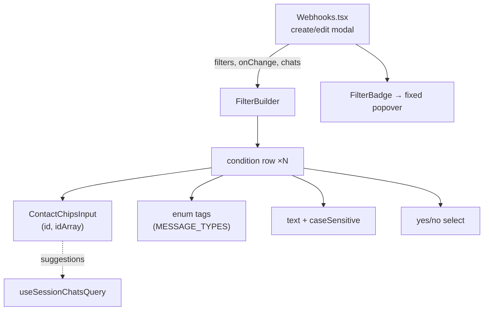
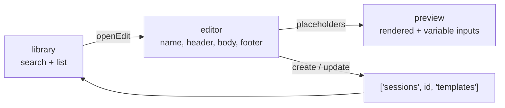

# Dashboard: Webhooks and Templates

> **Source of truth:** `dashboard/src/pages/Webhooks.tsx`, `dashboard/src/pages/Templates.tsx`, `dashboard/src/components/FilterBuilder.tsx`
> **Band:** Dashboard · **Depends on:** 80-dashboard-architecture.md, 87-dashboard-hooks-and-state.md · **Jarcube class:** PORTABLE

## Purpose

Two CRUD pages that both mirror a backend contract the dashboard cannot import, and one shared
component that is the most interesting thing here: a visual condition builder whose field registry is
a hand-maintained copy of a server-side registry.

The theme running through both pages is **duplicated contracts**. The dashboard cannot import
`src/modules/webhook/dto/webhook.dto.ts` or `src/modules/webhook/filters/filter-types.ts` — different
tsconfig, different bundle, no shared package — so it restates the event list and the filter field set
as local literals. Both restatements carry a comment saying they must stay aligned. Neither is
machine-checked. That is a real, current risk and this doc says so rather than describing the copies as
if they were derived.

Server-side behaviour lives in 53-webhooks.md and 35-templates.md. This doc covers the UI, the
duplication, and the small decisions that are not obvious.

## File Inventory

Line counts as measured; they drift.

| Path | Lines | Role |
| --- | --- | --- |
| `dashboard/src/pages/Webhooks.tsx` | 562 | Webhook list, create/edit/delete modals, test action, event reference, `FilterBadge` |
| `dashboard/src/pages/Webhooks.css` | 624 | Card list, event tags, the fixed-position filter popover |
| `dashboard/src/pages/Templates.tsx` | 427 | Three-pane workspace: library, editor, live preview |
| `dashboard/src/pages/Templates.css` | 466 | The three-column workspace grid |
| `dashboard/src/components/FilterBuilder.tsx` | 284 | Condition rows, five value editors, `ContactChipsInput` autocomplete |
| `dashboard/src/components/FilterBuilder.css` | 289 | Chips, suggestion dropdown, enum tags |

Backend counterparts these files mirror (documented in 53-webhooks.md and 35-templates.md):

| Path | What the dashboard copies from it |
| --- | --- |
| `src/modules/webhook/dto/webhook.dto.ts` | `WEBHOOK_EVENTS` → `availableEventNames` |
| `src/modules/webhook/filters/filter-types.ts` | The field registry → `MESSAGE_FIELDS` |
| `src/modules/webhook/filters/filter-validation.ts` | Which operators each field accepts |

## Webhooks

### Data flow

Unlike the Sessions page, this one is fully query-driven. Everything goes through
`dashboard/src/hooks/queries.ts` (87-dashboard-hooks-and-state.md):

| Hook | Key | Notes |
| --- | --- | --- |
| `useWebhooksQuery` | `['webhooks']` | `GET /webhooks` — all sessions in one call |
| `useSessionsQuery` | `['sessions']` | For the session dropdown and the id → name map |
| `useSessionChatsQuery` | `['sessions', id, 'chats']` | Gated on a modal being open; feeds the filter autocomplete |
| `useCreateWebhookMutation` | invalidates `['webhooks']` | |
| `useUpdateWebhookMutation` | invalidates `['webhooks']` | |
| `useDeleteWebhookMutation` | invalidates `['webhooks']` | |

`webhookApi.test` is called **directly**, not through a mutation, with a local `testingId` for the
spinner. That is correct rather than inconsistent: a test delivery changes nothing server-side that
the list displays, so there is no cache to invalidate.

### The `select` that prevents a whole-SPA crash

The most transferable line on this page is in `queries.ts`, not in the page:

```ts
// dashboard/src/hooks/queries.ts — useWebhooksQuery
select: webhooks => webhooks.map(w => ({ ...w, events: Array.isArray(w.events) ? w.events : [] })),
```

`events` is typed `string[]`, and both the list render and the edit modal call `events.map()`. A
malformed payload — an older gateway, a partially migrated row, a hand-edited database — would throw
during render, and a render throw reaches the top-level `ErrorBoundary`, which blanks the **entire
dashboard**. Normalising at the data boundary degrades that to "this webhook shows no event tags".

This is the general principle worth extracting: normalise at the single point where data enters the
app, not at each of N consumers, and prefer a degraded render over a thrown one for any array a
component maps over.

### The event list is a hand-maintained copy

`availableEventNames` in `dashboard/src/pages/Webhooks.tsx` is a 24-element literal: the 23 names in
the backend's `WEBHOOK_EVENTS` plus `'*'`. Its comment states the constraint — the API rejects unknown
event names, so offering a name the backend does not emit produces a 400 on save.

Verified against the source at the analysed commit, the two sets **agree**. Two things about that are
worth recording:

- The **order differs**. The backend lists `status.received` immediately after the `message.*` block;
  the dashboard lists it last, after `call.missed`. Set-equal, order-different — which means a
  reviewer diffing the two files side by side will not see equality at a glance.
- **Nothing enforces it.** The repo has drift guards for exactly this class of problem elsewhere:
  `src/config/env-precedence.spec.ts` derives its expectation from `docker-compose.yml`, and
  `dashboard/scripts/check-i18n-parity.mjs` derives locale expectations from `en.json`. There is no
  equivalent spec deriving `availableEventNames` from `WEBHOOK_EVENTS`. The backend has a
  catalog/emitter drift guard (the `WEBHOOK_RESERVED_EVENTS` comment references it), but it does not
  reach the dashboard.

The failure mode if they drift is asymmetric and both directions are bad in different ways: a name in
the dashboard but not the backend produces a 400 the user cannot act on, and a name in the backend but
not the dashboard is a silently unreachable feature.

### Filters are conditional on the selected events

```ts
// dashboard/src/pages/Webhooks.tsx
const supportsFilters = (events: string[]) => events.some(e => e === '*' || e.startsWith('message.'));
```

Filters only apply to the message family, and the wildcard subscribes to them too, so it counts. The
predicate is used in three places and they have to agree:

| Site | Behaviour |
| --- | --- |
| Render | Show `FilterBuilder` only when the predicate holds |
| Create | Persist `filters` only when it holds, else `null` |
| Edit | Persist `filters ?? null` when it holds, else **`null`** |

The edit case is the one that matters: removing every message event from an existing webhook **clears**
its stored filters rather than orphaning them. Without that, the filters would persist invisibly (the
UI is hidden) and would silently apply again if a message event were re-added later.

### The filter badge popover is fixed-positioned

`FilterBadge` reads the badge's `getBoundingClientRect()` and renders the popover with
`position: fixed` coordinates. The comment gives the reason: the webhook card has `overflow: hidden`,
which would clip an absolutely positioned child.

It opens on both `mouseEnter` and `focus`, and closes on `mouseLeave` and `blur`, with
`tabIndex={0}` on the badge — so the information is reachable by keyboard, not hover-only. The popover
carries `role="tooltip"`.

`conditionSummary` builds the one-line description by reusing the same translation keys the
`FilterBuilder` uses (`webhooks.filters.fields.*`, `webhooks.filters.operators.*`), each with a
`defaultValue` fallback to the raw token. So a condition on a field the dashboard's registry does not
know about still renders readably instead of showing a missing-key string — which is the graceful
degradation path for the registry drift described below.

### Test delivery reports three distinct outcomes

| Result | Toast |
| --- | --- |
| `{ success: true, statusCode }` | success, showing the status code |
| `{ success: false, error \| statusCode }` | error, showing the endpoint's own error or `Status <code>` |
| Thrown (the test call itself failed) | error, showing the client error message |

The middle case is the one people forget: a 200 from the gateway carrying `success: false` is a
**failed delivery reported successfully**, and conflating it with a thrown error loses the endpoint's
own error text.

## FilterBuilder

The most reusable component in the dashboard, and the one with the tightest coupling to the backend.

### The field registry

```ts
// dashboard/src/components/FilterBuilder.tsx
// Mirrors the backend message-family field registry (src/modules/webhook/filters/filter-types.ts).
const MESSAGE_FIELDS: FieldDescriptor[] = [ … ];
```

Eight fields, five kinds, and the operator set per field:

| Field | Kind | Operators | Value editor |
| --- | --- | --- | --- |
| `sender` | `id` | `is`, `isNot` | contact chips |
| `recipient` | `id` | `is`, `isNot` | contact chips |
| `mentions` | `idArray` | `is`, `isNot` | contact chips |
| `body` | `text` | `contains`, `equals` | text input + case-sensitivity checkbox |
| `type` | `enum` | `is`, `isNot` | multi-select tags from `MESSAGE_TYPES` |
| `isGroup` | `boolean` | `is` | yes/no select |
| `fromMe` | `boolean` | `is` | yes/no select |
| `hasMedia` | `boolean` | `is` | yes/no select |

Verified against `src/modules/webhook/filters/filter-types.ts` at the analysed commit: same eight
fields, same order. Again hand-maintained, again unenforced. `type`'s enum values are at least *not*
duplicated — they come from `MESSAGE_TYPES` in `dashboard/src/services/api.ts`, which is itself a
mirror but a single one.

Two defensive details keep drift from being fatal:

```ts
const descriptorFor = (field: string): FieldDescriptor =>
  MESSAGE_FIELDS.find(f => f.field === field) ?? MESSAGE_FIELDS[0];
```

An unknown field — a condition saved by a newer dashboard, or by the API directly — falls back to the
first descriptor rather than crashing. It renders as a `sender` row, which is wrong but recoverable;
the alternative is an exception in a `.map()` and, again, a blanked SPA.

And `changeField` resets `operator`, `value`, **and** `caseSensitive` together, because each is only
meaningful for certain kinds. Without the `caseSensitive: undefined` reset, switching `body`
(case-sensitive text) to `isGroup` (boolean) would carry a stray `caseSensitive: true` into the saved
payload.

### `null` versus an empty condition list

```ts
const emit = (next: WebhookFilterCondition[]) => onChange(next.length ? { conditions: next } : null);
```

Removing the last condition emits `null`, not `{ conditions: [] }`. Those are different claims to the
backend — no filter at all versus a filter object with nothing in it — and the second would be at best
a no-op row in the database and at worst an evaluator edge case. Collapsing to `null` means "no
filters" has exactly one representation.

### `ContactChipsInput`

A small autocomplete with four behaviours worth naming:

| Behaviour | Detail |
| --- | --- |
| Suggestions | Filtered by name **or** id, already-chosen ids excluded, capped at 8 |
| Enter | Adds the typed value, normalised |
| Backspace on empty input | Removes the last chip — the standard chips-input idiom |
| Blur | Delayed 120 ms so a click on a suggestion lands before the dropdown closes |

The suggestion buttons additionally call `e.preventDefault()` on `onMouseDown`, which stops the input
from losing focus before `onClick` fires. That plus the 120 ms blur delay are two independent
mitigations of the same classic dropdown bug; either alone is fragile.

`normalizeToJid` accepts a full JID (lowercased) or a bare phone number, stripping non-digits and
appending `@c.us`:

```ts
// dashboard/src/components/FilterBuilder.tsx
function normalizeToJid(raw: string): string | null {
  const value = raw.trim();
  if (!value) return null;
  if (value.includes('@')) return value.toLowerCase();
  const digits = value.replace(/[^0-9]/g, '');
  return digits ? `${digits}@c.us` : null;
}
```

This is the one WhatsApp-specific line in the component, and it is worth being precise about its
limits: it always produces `@c.us`, so it cannot express a `@lid` privacy id or a `@g.us` group from a
typed number. Those have to be picked from the suggestions (which carry real ids) or pasted whole. The
chips display the chat's name when the id is known and the raw id otherwise, with the full id in the
`title`.

### Structure



`FilterBuilder` is fully controlled — it holds no condition state, only `ContactChipsInput`'s local
draft text. So the create and edit modals each own their conditions and there is no state to
synchronise.

## Templates

### Three panes, one form



The editor is the same form for create and edit; `editingTemplate` decides which mutation fires and
which labels show. `resetForm` doubles as the "New template" action, which is why the button next to
the library header simply calls it.

`openEdit` scrolls the window to the top smoothly, because on a narrow viewport the three panes stack
and the editor is below the library.

### Placeholders are derived, never stored

```ts
// dashboard/src/pages/Templates.tsx
/\{\{\s*([a-zA-Z0-9_.-]+)\s*\}\}/g
```

The same pattern is used twice — once to extract the set of placeholder names, once to substitute them
in the preview. Extraction runs over header, body, and footer joined, then dedupes via a `Set` and
sorts, so the variable inputs appear in a stable order regardless of where in the template each
placeholder occurs.

Substitution falls back to the literal `{{key}}` when no value has been typed, so an unfilled preview
still shows the shape of the message rather than gaps.

The character class allows `.` and `-`, so dotted paths like `{{user.name}}` are recognised. Whether
the backend renderer resolves those as nested lookups is a server-side question — see 35-templates.md.

### The preview-values effect preserves what you typed

```tsx
useEffect(() => {
  setPreviewValues(current => {
    const next: Record<string, string> = {};
    for (const key of placeholders) next[key] = current[key] || '';
    return next;
  });
}, [placeholders]);
```

Rebuilt from the current placeholder set on every change, carrying forward existing values. So editing
the body to add a placeholder does not clear the values already typed for the others, and removing one
drops its value rather than leaving a stale key in the object. `placeholders` is memoised on `form`,
so this only runs when the derived set actually changes identity.

### Payload normalisation

`toPayload` trims everything and converts empty `header`/`footer` to **`null`**, not `''`:

| Form field | Empty → |
| --- | --- |
| `name` | trimmed (required, gated by the disabled button) |
| `header` | `null` |
| `body` | trimmed (required) |
| `footer` | `null` |

`null` and `''` are different rows in the database and would render differently in a sent message —
an empty-string header still contributes a blank line. The `MessageTemplate` type declares both as
`string \| null`, so `null` is the shape the API expects.

### Two empty states, and a third

The library distinguishes three cases, which is one more than most implementations bother with:

| Condition | Rendered |
| --- | --- |
| `templates.length === 0` | Full empty state: title + description, "create your first" |
| `filteredTemplates.length === 0` with a search term | Compact empty state: search icon, title only |
| Otherwise | The list |

Conflating the second into the first tells a user with 40 templates that they have none.

Note also that `templates.count` in the library header shows `templates.length`, the **unfiltered**
count, so the header remains a stable fact about the session while the list below it is filtered.

### Deletion is coupled to the editor

`handleDelete` calls `resetForm()` when the deleted template is the one being edited. Without that,
the editor would be left holding a form bound to a `editingTemplate` id that no longer exists, and the
next save would `PUT` to a deleted resource.

### Clipboard

`copyName` uses `dashboard/src/utils/clipboard.ts:copyToClipboard` and toasts **only on success** —
the helper returns a boolean rather than throwing. The helper itself, including its fallback path, is
documented in 84-dashboard-apikeys-and-logs.md.

## Role gating

Both pages gate on `canWrite` (`admin` or `operator`) from `dashboard/src/hooks/useRole.tsx`, and both
do it cosmetically — the gateway enforces the real thing (50-auth-and-api-keys.md).

| Page | Viewer sees |
| --- | --- |
| Webhooks | No "Add webhook" button; no edit/delete icons. **The test button stays enabled** |
| Templates | Every input `disabled`; the save button disabled and relabelled `templates.viewOnly` |

The Webhooks test button being available to a viewer is a deliberate-looking choice — a test delivery
is read-only from the dashboard's perspective — but nothing in the source says so, and whether the
gateway permits `POST /webhooks/:id/test` for a viewer role is not determinable from here. Listed
under Open Questions.

The Templates approach (disable and relabel) is more informative than the Webhooks approach (hide),
and the two pages are inconsistent about it. Neither is wrong; they were evidently written at
different times.

## Failure Modes & Edge Cases

| Scenario | Behaviour |
| --- | --- |
| `GET /webhooks` fails | `role="alert"` error banner above the list; the page still renders |
| A webhook row has a non-array `events` | Normalised to `[]` by the query `select`; row shows no tags instead of crashing the SPA |
| A saved condition uses an unknown field | Falls back to the first descriptor; the badge popover still reads correctly via `defaultValue` |
| A saved condition uses an unknown operator | Popover shows the raw token |
| Create with no session or URL | Early return; no request |
| Event list drifts ahead of the backend | 400 on save with the gateway's message in a toast |
| Event list drifts behind the backend | The event is silently unreachable from the UI |
| All message events removed on edit | Stored filters cleared to `null`, not orphaned |
| Last condition removed | `onChange(null)` — one canonical representation of "no filters" |
| Field switched from `body` to a boolean | `caseSensitive` explicitly cleared |
| Typed number in the chips input | Normalised to `<digits>@c.us`; cannot express `@lid` or `@g.us` |
| Suggestion clicked | Blur delay + `preventDefault` on mousedown both keep it from being lost |
| Test returns `success: false` | Error toast carrying the endpoint's own error, not a generic one |
| Template session switched | Form reset, so a partially typed template cannot be saved against the wrong session |
| Template search matches nothing | Compact empty state; the header count still shows the real total |
| Placeholder added while editing | Existing typed preview values preserved |
| Template being edited is deleted | Form reset, so no `PUT` to a dead id |
| Empty header/footer | Saved as `null`, not `''` |
| Clipboard unavailable | No toast (the helper returns false) |
| Viewer role | Webhooks: mutating controls hidden. Templates: inputs disabled and relabelled |

## Jarcube Portability

**Classification:** PORTABLE

**Rationale:** Webhook subscriptions with per-event selection and payload filtering, and message
templates with placeholder substitution, are both product concepts Jarcube already has. Nothing here
touches WhatsApp except `normalizeToJid`.

**Prerequisites:** 53-webhooks.md and 35-templates.md for the server contracts.

**Cloud API caveats:** One significant asymmetry. Meta's Cloud API has its own **template approval**
workflow — templates are registered with Meta, reviewed, and referenced by name and language when
sending. OpenWA's templates are purely local: rendered client-side into an ordinary text message, with
no approval step and no category. So the Templates *page* is portable while the Templates *concept* is
not: a Jarcube template editor also needs approval status, rejection reasons, category, language
variants, and a component structure (header/body/footer/buttons) that Meta validates. The
placeholder-extraction and live-preview mechanics transfer; the CRUD lifecycle does not.

**What Jarcube has today.** `QuantumMind-ui/src/pages/webhooks` and
`QuantumMind-ui/src/pages/templates` both exist, with Redux slices at
`QuantumMind-ui/src/store/apps/template`. The stack differences from
80-dashboard-architecture.md apply throughout: MUI components, Redux thunks, axios. So the value here
is in the decisions, not the JSX.

**Specific recommendations:**

1. **Port `FilterBuilder`'s architecture, and fix the drift problem on the way.** The
   descriptor-driven design — one registry of `{ field, kind, operators, enumValues }` driving both the
   operator dropdown and which value editor renders — is the right shape and scales to new fields
   without touching the component. But do **not** reproduce the hand-maintained copy. Either serve the
   registry from an API endpoint the UI fetches, or generate it at build time from the backend
   definition. Jarcube is a monorepo-adjacent set of services; a shared types package is more
   available there than it is here.
2. **Port the `select`-normalisation habit immediately.** This is the single highest-value item in the
   doc and it is one line. In Redux terms it belongs in the thunk's `fulfilled` reducer, not in the
   component. The reasoning generalises: any array a component maps over should be normalised where
   the data lands, because a render throw is a whole-app failure and a degraded render is not.
3. **Port the unknown-value fallbacks.** `descriptorFor`'s `?? MESSAGE_FIELDS[0]` and
   `t(key, { defaultValue: raw })` together mean a condition from a newer backend renders imperfectly
   instead of crashing. Forward compatibility in a UI is mostly this: never assume the server's
   vocabulary is a subset of yours.
4. **Port the `null` vs `{ conditions: [] }` distinction, and the `null` vs `''` one.** Both are the
   same lesson at different scales: pick one canonical representation of "absent" and normalise to it
   at the boundary. Jarcube's axios payloads are assembled by hand in components, which is exactly
   where `''` leaks into a database as a meaningful empty string.
5. **Port the three-empty-state pattern.** Cheap, and the "you have none" versus "none match your
   search" confusion is one of the most common UX bugs in list views.
6. **Copy the reset-coupling rules.** Deleting the entity being edited must reset the editor; switching
   the parent scope (session, here) must reset the form. Both are one line and both prevent a write to
   the wrong target.
7. **Skip `normalizeToJid`.** Jarcube's recipient identity is a phone-number-id or a visitor id, not a
   JID, so the whole function is replaced rather than adapted. Keep the *idea* that a chips input should
   accept both a picked entity and a typed raw identifier, normalising the latter.

**Add what OpenWA lacks:** a parity spec. The repo demonstrates the pattern twice
(`src/config/env-precedence.spec.ts`, `dashboard/scripts/check-i18n-parity.mjs`) and does not apply it
to the two registries in this doc. If Jarcube duplicates a contract for bundling reasons, write the
derive-and-compare test at the same time as the copy.

## Open Questions

- Nothing enforces that `availableEventNames` matches `WEBHOOK_EVENTS`, or that `MESSAGE_FIELDS`
  matches the backend field registry. Both agree at the analysed commit. Whether a guard was
  considered and rejected, or simply not written, is not recorded.
- The webhook test button is not gated on `canWrite`. Whether the gateway allows a viewer role to
  invoke `POST /sessions/:id/webhooks/:id/test` was not checked from the dashboard side; if it does
  not, a viewer gets a 403 toast from a button that looks available.
- Templates' placeholder pattern accepts dotted names (`{{user.name}}`), but whether the backend
  renderer resolves them as nested property lookups or treats the whole dotted string as a flat key is
  a server-side question this doc does not answer.
- The two pages disagree on how to present read-only mode — Webhooks hides mutating controls, Templates
  disables and relabels them. No convention is documented either way.
- `FilterBuilder` renders `id` and `idArray` kinds identically (both `ContactChipsInput`, both
  array-valued). The distinction exists in the descriptor and in the backend registry but has no
  UI consequence here, so what it is for is not determinable from the dashboard.
- The `ContactChipsInput` suggestion list is capped at 8 with no "N more" affordance, and the
  underlying chat list is whatever `GET /sessions/:id/chats` returned. For an account with many chats,
  a contact that is not in that list and not typeable as a bare number is unreachable. Whether that is
  considered acceptable is not stated.
