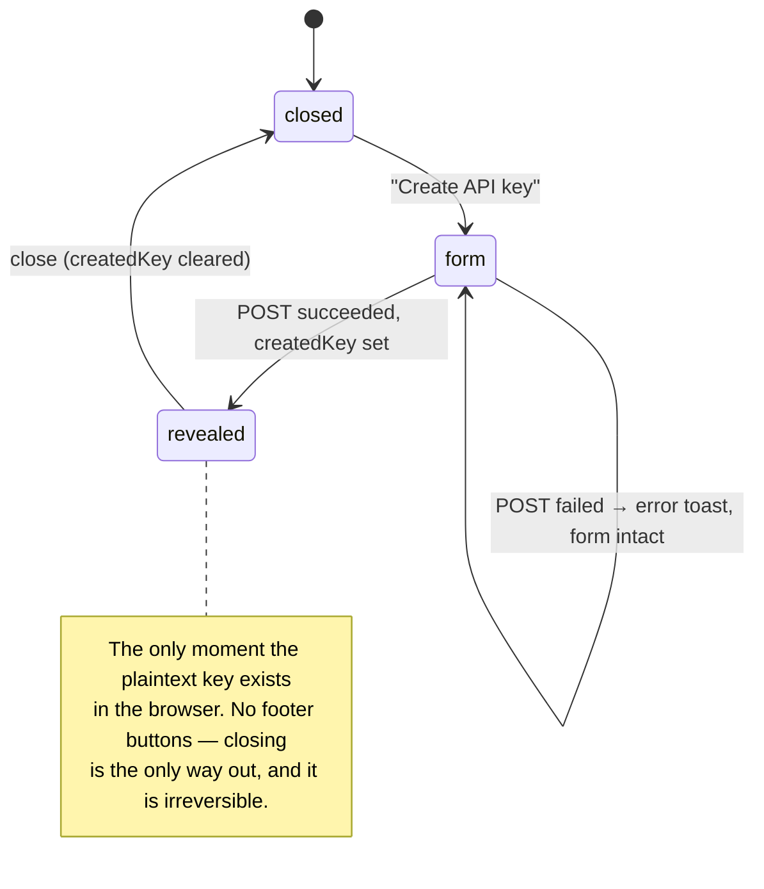
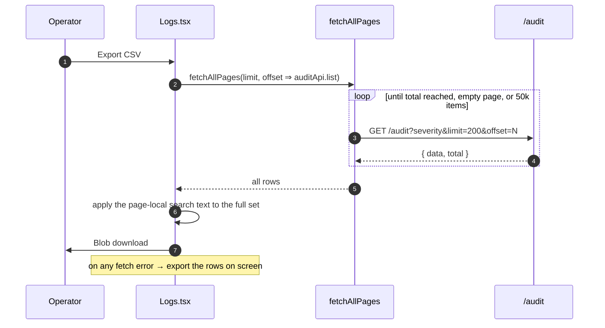

# Dashboard: API Keys and Logs

> **Source of truth:** `dashboard/src/pages/ApiKeys.tsx`, `dashboard/src/pages/Logs.tsx`, `dashboard/src/utils/csv.ts`, `dashboard/src/utils/clipboard.ts`
> **Band:** Dashboard · **Depends on:** 80-dashboard-architecture.md, 50-auth-and-api-keys.md, 63-audit-logging.md · **Jarcube class:** PORTABLE

## Purpose

Two administrative pages that look routine and each contain one thing that is not.

For **API Keys**, it is a lifecycle constraint the UI has to make legible: a plaintext key exists
exactly once, in the response to its own creation. Everything about the page — the modal that changes
shape after a successful POST, the absence of a per-row copy button, the prefix-only column — follows
from that single fact. It is also the dashboard's only consumer of `@tanstack/react-table`.

For **Logs**, it is that a CSV export of an audit trail is a **security surface**. Audit rows carry
attacker-influenced strings, and a spreadsheet evaluates a cell beginning with `=` as a formula. The
16-line `escapeCsvCell` is the most portable thing in this doc and the least likely to be written from
scratch by someone who has not been told.

Server-side models are in 50-auth-and-api-keys.md and 63-audit-logging.md.

## File Inventory

Line counts as measured; they drift.

| Path | Lines | Role |
| --- | --- | --- |
| `dashboard/src/pages/ApiKeys.tsx` | 406 | Key table (react-table), create/reveal-once modal, revoke + delete confirms, role reference |
| `dashboard/src/pages/ApiKeys.css` | 394 | Table, key cell, permission badges, confirm modal |
| `dashboard/src/pages/Logs.tsx` | 240 | Audit table, severity filter, page-local search, paginator, full-history CSV export |
| `dashboard/src/pages/Logs.css` | 357 | Grid table, severity badges, paginator |
| `dashboard/src/pages/Logs.test.ts` | 86 | jsdom render test: null-floor rows must not crash or leak `null` into the DOM |
| `dashboard/src/utils/csv.ts` | 18 | `escapeCsvCell` — formula-injection neutralisation plus structural quoting |
| `dashboard/src/utils/csv.test.ts` | 37 | Pins both concerns |
| `dashboard/src/utils/clipboard.ts` | 31 | Clipboard API with an `execCommand` fallback for non-secure contexts |

Shared modules used here and documented in 87-dashboard-hooks-and-state.md:
`dashboard/src/utils/pageWindow.ts`, `dashboard/src/utils/fetchAllPages.ts`,
`dashboard/src/components/CustomSelect.tsx`, `dashboard/src/components/Modal.tsx`,
`dashboard/src/components/PageHeader.tsx`.

## API Keys

### The reveal-once lifecycle



One `Modal` renders both states, switching on `createdKey`. Three details make the constraint legible
rather than merely enforced:

**The footer disappears in the revealed state.** `footer={!createdKey ? (…) : undefined}` — no Cancel,
no Create. There is nothing to cancel (the key exists) and nothing to submit.

**On success the form is cleared but the modal stays open.** `setNewKey({ name: '', role: 'operator' })`
runs alongside `setCreatedKey`, so closing and reopening starts clean rather than resurrecting the
previous name.

**On failure the form is left intact.** `handleCreate`'s catch only toasts. A rejected create — a
duplicate name, a validation error — must not discard what the user typed.

### No per-row copy button

The clearest comment on the page, worth quoting because the omission looks like an oversight:

```tsx
// dashboard/src/pages/ApiKeys.tsx
{/* No per-row copy: the full key only exists once (post-creation modal); the row
    only has the prefix, so a copy button here could only copy a useless fragment. */}
```

The list payload carries `keyPrefix`, never the key. A copy button in the row would produce something
that looks like a credential and is not — which is worse than no button, because the user would
discover it only when authentication failed.

The reveal toggle in the key column is honest about the same limit: hidden shows `prefix + '****'`,
revealed shows `prefix + '...'`. The ellipsis is the point — revealing does not produce a key, it just
stops pretending there are masked characters of a known length.

### The one react-table usage in the codebase

`ApiKeys.tsx` is the only file importing `@tanstack/react-table`, and it uses the new
`tableFeatures` composition API rather than the older `getCoreRowModel` shape:

```tsx
// dashboard/src/pages/ApiKeys.tsx
const features = tableFeatures({ columnVisibilityFeature, coreRowModel: createCoreRowModel() });
const columnHelper = createColumnHelper<typeof features, ApiKey>();
```

Only one feature beyond the core model: column visibility, driven by viewport width.

| Breakpoint | Columns hidden |
| --- | --- |
| < 640 px | `key` |
| < 768 px | `lastUsed` |
| ≥ 768 px | none |

`useWindowSize` is a local hook here rather than a shared one, and `Layout` has its own separate
`window.innerWidth` listener for the mobile drawer. Two independent resize listeners for two
independent breakpoint sets — noted under Open Questions as a small duplication, not a bug.

The `columns` memo depends on `[visibleKeys, t]`, which is correct and slightly subtle: the key cell
closes over `visibleKeys`, so a stale memo would freeze the reveal toggles.

Given that only one page needs a table and it needs exactly one feature, whether the dependency earns
its place is a fair question — the Logs table next door is a hand-rolled CSS grid with no library at
all. That asymmetry is documented under Open Questions.

### Actions

| Action | Availability | Effect |
| --- | --- | --- |
| Reveal | always | Local only, toggles a `Set` of ids |
| Revoke | `isActive` rows only | `POST /auth/api-keys/:id/revoke` — key stops working, row remains |
| Delete | always | `DELETE /auth/api-keys/:id` — row gone |

Both destructive actions route through one `confirmAction` state
(`{ type, id, name }`) and one confirm modal, with `Trans` interpolating the key's name in bold. Two
actions, one modal, one code path — so the confirmation cannot be present for one and forgotten for
the other.

Revoke being hidden on an already-inactive row is the only conditional: revoking twice is a no-op the
UI does not need to offer.

All three mutations come from `dashboard/src/hooks/queries.ts` and invalidate `['apiKeys']`, so the
table refreshes without local list state. No optimistic updates — appropriate for credential
operations, where showing a state the server has not confirmed is exactly wrong.

### Creation only exposes name and role

The `apiKeyApi.create` signature accepts `allowedIps`, `allowedSessions`, and `expiresAt`. The form
offers **name and role only**. The `ApiKey` type carries `allowedIps` and `allowedSessions` and the
table does not display them either.

So IP allowlisting, session scoping, and expiry are API-only features, reachable via the SDKs or curl
but not the dashboard. Since session-scoped keys are the exact reason
`dashboard/src/utils/sessionFeedSubscription.ts` has a wildcard-to-per-session fallback
(81-dashboard-sessions.md), the dashboard supports *consuming* a scoped key while offering no way to
*create* one. That is a real coverage gap rather than a bug, and it is listed under Open Questions.

## Logs

### Two filters with different reach, and three empty states

This is the page's most careful piece of thinking, and it is entirely about not lying to the operator.

| Filter | Applied | Reach |
| --- | --- | --- |
| Severity | server-side, in the query key | The whole table |
| Search text | client-side, on the fetched page | **The current page only** — the API has no text search |

Because the two have different reach, an empty result means different things and gets different
guidance:

```tsx
// dashboard/src/pages/Logs.tsx
{hasSeverityFilter && !hasSearch
  ? t('logs.empty.filteredServerDescription')
  : t('logs.empty.filteredDescription')}
```

| Condition | Message |
| --- | --- |
| No filters, no rows | "There are no logs" |
| Severity only | Server-side: no logs match at all |
| Search involved | Page-local: nothing matched **on this page**; other pages may hold it |

The comment states the failure this avoids: a page-local non-match must not read as "no such event
exists" while later pages may contain it. Most implementations render one empty state and quietly
mislead in the second and third cases.

Both filters reset `page` to 1, with a comment noting that a new search query invalidates the current
page position just as the severity filter does.

### CSV export covers the whole history, not the page



Three things here are worth carrying:

**The severity filter is honoured server-side in the export, and the search text is re-applied
client-side to the full set.** So the export matches what the operator believes they are looking at —
including the search term, which on screen only filtered one page. The export is therefore *more*
complete than the view, in the direction the operator would expect.

**Termination never compares page length to the requested size.**
`dashboard/src/utils/fetchAllPages.ts` says why: endpoints clamp `limit` server-side (audit caps at
`MAX_AUDIT_PAGE_SIZE`), so a `data.length < requested` test reads a clamped first page as "last page"
and silently truncates. It terminates on the server's own `total`, on an empty page, or on the 50,000
item safety cap instead.

**A failed export degrades to the current page rather than to nothing.** With a guard —
`if (rows.length > 0)` — so a successful walk that legitimately returns nothing does not download an
empty file.

The blob URL is revoked immediately after `a.click()`. That is the standard idiom and it works because
the click is synchronous, though it is tighter than the delayed-revoke pattern used elsewhere.

### `escapeCsvCell` — the highest-value 16 lines in the band

```ts
// dashboard/src/utils/csv.ts
export function escapeCsvCell(value: unknown): string {
  let s = value === undefined || value === null ? '' : String(value);
  if (/^[=+\-@]/.test(s)) s = `'${s}`;
  return /[",\n]/.test(s) ? `"${s.replace(/"/g, '""')}"` : s;
}
```

Two concerns, in a deliberate order.

**1. Formula injection.** A cell whose text starts with `=`, `+`, `-`, or `@` is evaluated as a formula
by Excel, LibreOffice, and Google Sheets. Audit rows carry attacker-influenced strings — request
paths, error messages, API-key names — so a logged request like `GET /=HYPERLINK("https://evil…")`
becomes a live formula in the operator's spreadsheet. Prefixing an apostrophe forces text
interpretation.

This is the part people miss. It is not a CSV-format concern at all; the quoting rules below do
nothing about it, because `=HYPERLINK(...)` contains no quote, comma, or newline and passes through
structurally intact.

**2. Structural quoting.** A value containing `"`, `,`, or a newline is wrapped in double quotes with
inner quotes doubled. Standard RFC 4180.

The order matters: neutralise first, then quote, so a value needing both gets `"'=..."` and the
apostrophe survives inside the quoted field.

The docblock is honest about the cost: this mangles the **export only**, and the dashboard UI still
shows the raw value. A leading apostrophe on an exported path is a small, visible, deliberate
distortion in exchange for not executing attacker-supplied formulas on an operator's machine.

`null` and `undefined` both become `''`, which matters because `AuditLog` has nine nullable fields and
`String(null)` would otherwise write the literal text `null` into the file.

### Nullable fields all the way down

`dashboard/src/pages/Logs.test.ts` exists specifically because the Logs page is the `AuditLog` type's
only consumer, and nine of its fields are `| null`. The test constructs a "null floor" row — the real
wire shape for infra admin operations that carry no session and no API-key linkage — and asserts two
things:

- Every fallback renders (an em-dash for a null IP).
- **No raw `null` leaks into the DOM.** That is the assertion worth copying: `assert.ok(!container.textContent?.includes('null'))` catches the entire class of `{value}` rendering
  `null` as text, without enumerating the fields.

### Pagination

`dashboard/src/utils/pageWindow.ts:pageWindow` computes a sliding window of at most five page numbers
centred on the current page and clamped into range. Its docblock names what it replaced: a frozen
`[1..5]` window that left pages beyond 5 unreachable by number and lost the active highlight
entirely once you paged past it.

The paginator renders only when `totalPages > 1`, and Prev/Next are disabled at the boundaries.

`limit` is a hard-coded `20` with no page-size selector.

### The loading condition

```tsx
if (loading && logs.length === 0) { /* full-page spinner */ }
```

Same principle as the Sessions page's `initialLoadDone` ref (81-dashboard-sessions.md), expressed more
cheaply: the spinner is for the first load only. Paging to page 2 keeps page 1's rows on screen while
the request is in flight instead of replacing the whole table with a spinner. `useLogsQuery` uses
`staleTime: 15_000` — the shortest in the dashboard, appropriate for a live audit feed.

## Clipboard

Used by both this band and Templates (83-dashboard-webhooks-and-templates.md).

`dashboard/src/utils/clipboard.ts:copyToClipboard` returns a **boolean** rather than throwing, and
tries two paths:

| Path | When |
| --- | --- |
| `navigator.clipboard.writeText` | Secure context (HTTPS or localhost) and permission granted |
| Hidden `<textarea>` + `document.execCommand('copy')` | Everything else |

The fallback exists for a specific deployment shape named in the comment: plain HTTP on a LAN IP,
where `navigator.clipboard` is simply `undefined`. That is a completely ordinary way to run OpenWA —
a gateway on a local network without TLS — and without the fallback the "copy your new API key"
button silently does nothing at the exact moment the key is visible for the only time it will ever be.

The `NotAllowedError` case (outside a user gesture) also falls through to the legacy path rather than
failing.

Callers use the boolean rather than assuming success. `ApiKeys` sets a 2-second `copied` flag driving a
check-mark swap; `Templates` toasts only on `true`. Neither claims a copy that did not happen.

## Failure Modes & Edge Cases

| Scenario | Behaviour |
| --- | --- |
| `GET /auth/api-keys` fails | `role="alert"` error banner; page renders |
| Key creation fails | Error toast, form contents preserved, modal stays on the form |
| Key creation succeeds | Modal switches to reveal; no footer buttons; form state pre-cleared |
| Reveal modal closed | `createdKey` cleared. The plaintext key is unrecoverable — by design |
| Clipboard unavailable (HTTP on a LAN IP) | `execCommand` fallback; check-mark only on real success |
| Clipboard blocked outside a user gesture | Same fallback |
| Revoke on an inactive key | Button not rendered |
| Viewport < 640 px | Key column hidden; < 768 px also hides last-used |
| `GET /audit` fails | Error banner; page renders |
| Audit row with every nullable field null | Em-dash fallbacks; no `null` in the DOM (pinned by test) |
| Search matches nothing on this page | Page-local empty state, explicitly saying other pages may match |
| Severity matches nothing at all | Server-side empty state with different guidance |
| Filter changed while on page 5 | Page reset to 1 |
| Paging to a new page | Existing rows stay visible; no full-page spinner |
| Export while another export runs | Early return on `exporting` |
| Export with `total === 0` | Button disabled |
| Export: server clamps `limit` below 200 | Walk continues correctly — termination is `total`-driven, not length-driven |
| Export exceeds 50,000 rows | Truncated at the cap rather than OOMing the tab |
| Export request fails midway | Falls back to exporting the visible page, if non-empty |
| Audit cell beginning `=`, `+`, `-`, `@` | Apostrophe-prefixed; inert in a spreadsheet |
| Audit cell containing a quote, comma, or newline | RFC 4180 quoted with doubled inner quotes |
| Audit cell that is `null`/`undefined` | Empty field, not the text `null` |

## Jarcube Portability

**Classification:** PORTABLE

**Rationale:** Credential management and audit-log viewing are transport-independent. Nothing here
knows what WhatsApp is; the only domain coupling is that a `sessionName` column exists.

**Prerequisites:** 50-auth-and-api-keys.md if the role model or key lifecycle is ported;
63-audit-logging.md for the audit entity.

**Cloud API caveats:** none for either page. Worth noting that Jarcube's per-bot Meta access tokens
are the same *category* of secret with the same reveal-once problem, so the API Keys page's
interaction model applies to token management even though the entity differs.

**What Jarcube has today.** `QuantumMind-ui` authenticates with a JWT held in `localStorage` (read by
`QuantumMind-ui/src/services/socket.services.ts` as `accessToken`) and gates with CASL
(`QuantumMind-ui/src/configs/acl.ts`). It has `@mui/x-data-grid` for tables and `papaparse` as a
dependency, so the table and CSV-generation layers are already chosen and different. That narrows the
port to logic and interaction design, which is where the value is anyway.

**Specific recommendations, in priority order:**

1. **Copy `escapeCsvCell` verbatim, today, into anything that exports user-influenced data.** This is
   the top item in the whole dashboard band by value-per-line. Jarcube has `papaparse`, which handles
   RFC 4180 quoting and **does not** neutralise formula injection — that is out of scope for a CSV
   library by design, and it is exactly the gap this function fills. Any Jarcube export containing
   visitor messages, bot names, or error strings has the same exposure. The apostrophe prefix must be
   applied to the cell value *before* handing it to `papaparse`.
2. **Copy the reveal-once interaction model for any secret.** Specifically: one modal that changes
   shape, no footer in the revealed state, form pre-cleared on success but preserved on failure, and
   **no copy button anywhere the full secret does not exist**. Jarcube mints per-bot tokens and
   webhook verify tokens; both have this shape. A copy button that yields a prefix is worse than no
   button.
3. **Copy the two-reach filter distinction and the third empty state.** Any list where one filter is
   server-side and another is client-side needs to tell the user which one came up empty. This is
   generic, cheap, and almost universally skipped.
4. **Copy `fetchAllPages`'s termination rule.** Never compare a returned page's length against the
   requested size when the server may clamp the limit. This is a genuine silent-truncation bug that is
   very easy to write and nearly impossible to notice — the export just quietly contains less than it
   should. Jarcube's list endpoints go through axios thunks; the same rule applies unchanged.
5. **Copy `pageWindow`.** Eleven lines, and it fixes a bug (`[1..5]` frozen window) that ships in a
   surprising amount of production code.
6. **Copy the clipboard fallback if Jarcube is ever served over plain HTTP.** Check first: if every
   deployment is HTTPS behind a load balancer, `navigator.clipboard` is always available and the
   fallback is dead code. OpenWA needs it because a LAN-IP HTTP deployment is a supported shape.
7. **Copy the "no raw null in the DOM" assertion style.** One line in a render test that catches an
   entire class of bug across every nullable field, without enumerating them. Applies to any Jarcube
   view over an entity with nullable columns.
8. **Do not port the table library choice.** Jarcube already has `@mui/x-data-grid`, which subsumes
   column visibility and much more. Porting `@tanstack/react-table` usage would be a regression.

## Open Questions

- The create form exposes only `name` and `role`, while `apiKeyApi.create` accepts `allowedIps`,
  `allowedSessions`, and `expiresAt`, and the `ApiKey` type carries the first two. So a session-scoped
  key — the exact case the session-feed fallback in 81-dashboard-sessions.md exists to serve — cannot
  be created from the dashboard. Whether that is a deliberate staging decision or unfinished work is
  not recorded.
- `allowedIps`, `allowedSessions`, and `expiresAt` are not displayed in the table either, so a key
  created via the API with those restrictions looks identical to an unrestricted one in the UI.
- `ApiKeys` uses `@tanstack/react-table` for one feature while `Logs` next door hand-rolls a CSS-grid
  table. No convention is documented, and the dependency is used by exactly one file.
- `ApiKeys` defines a local `useWindowSize` hook while `Layout` keeps its own `window.innerWidth`
  listener with different breakpoints. Two listeners, no shared hook. Whether a shared one was
  considered is not stated.
- The Logs page has no date-range filter and no action-name filter, though `auditApi.list` accepts an
  `action` parameter and `AuditLog` carries `metadata`, `userAgent`, `method`, `path`, and
  `statusCode` — all of which reach the CSV export but not the table. Whether the table's column set
  is deliberately minimal is not stated.
- The `pageWindow` size is fixed at 5 and `limit` at 20, both hard-coded with no user control.
- Neither page is gated on `canWrite`; `/auth/api-keys` and `/audit` are admin-only server-side and
  the routes are already admin-gated for API keys in `dashboard/src/App.tsx`. But `/logs` is
  registered for **every** role, so a viewer can reach the Logs page and will presumably see a 403
  error banner rather than a permission message. Whether the gateway permits a viewer to read
  `/audit` was not verified from the dashboard side.
