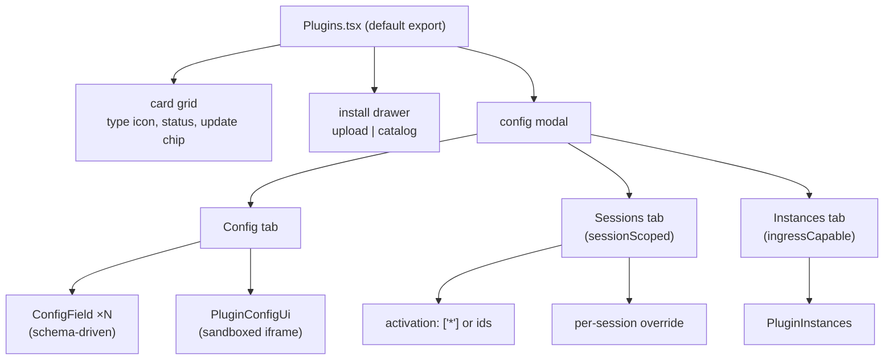
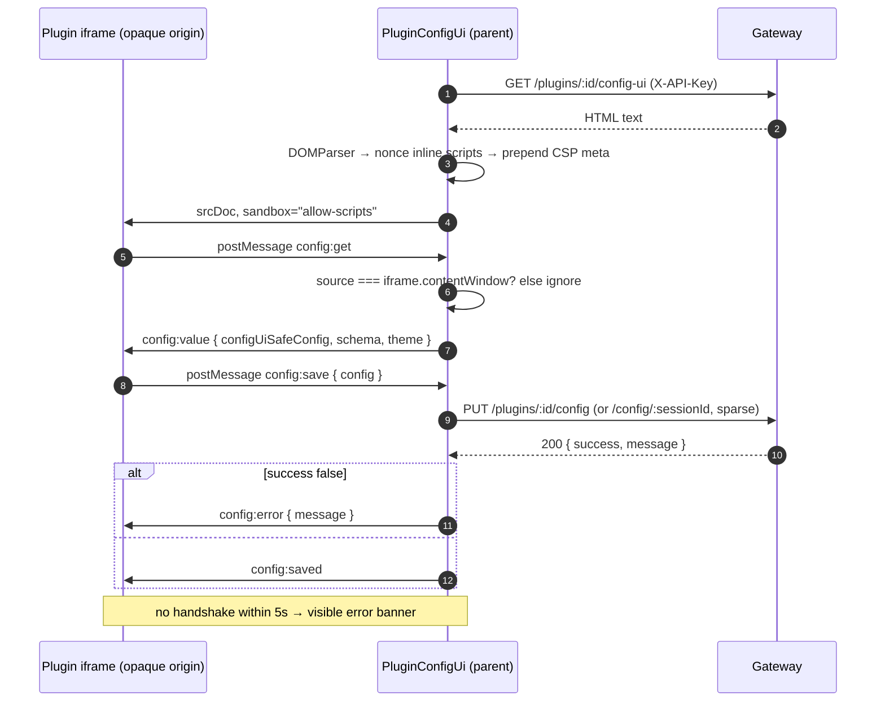
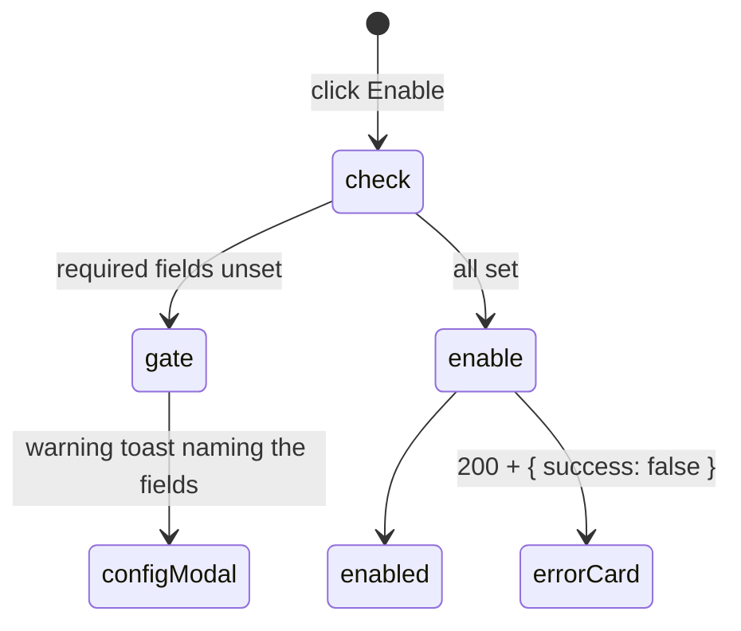
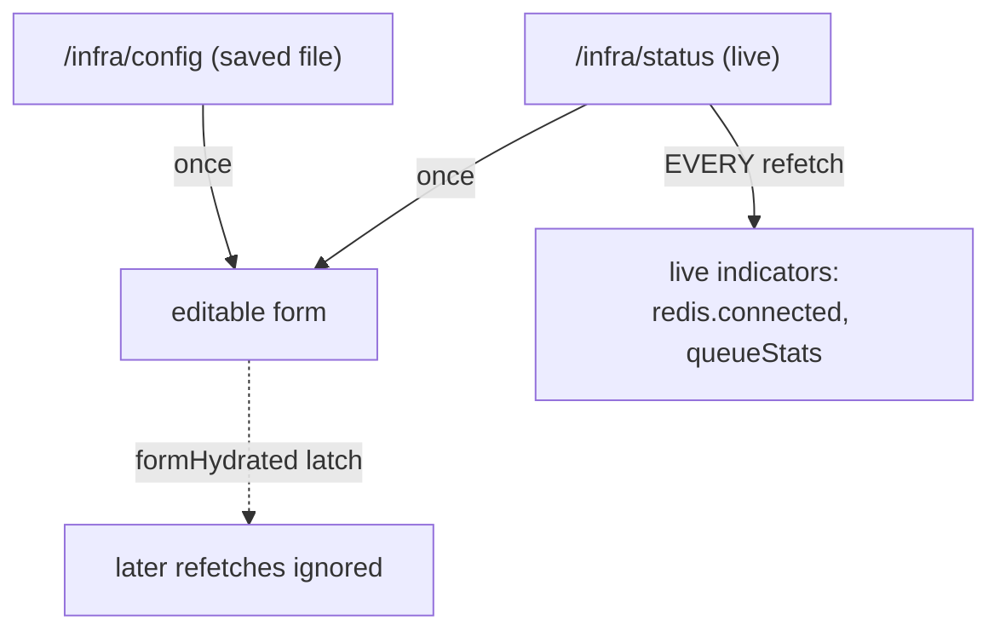
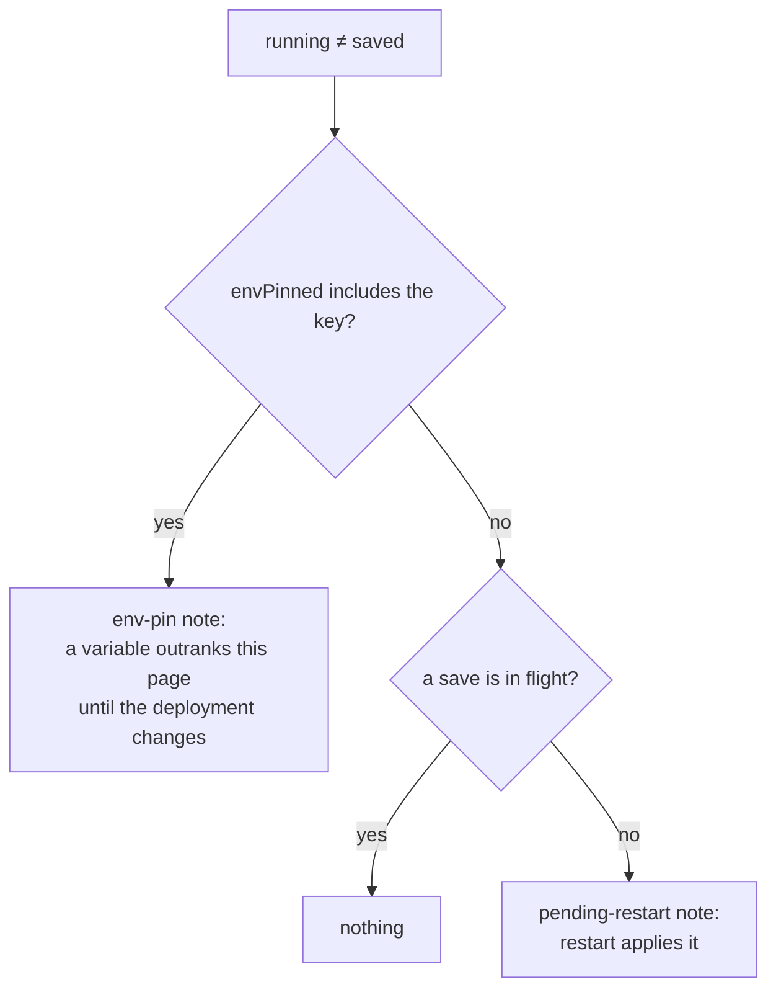

# Dashboard: Plugins and Infrastructure

> **Source of truth:** `dashboard/src/pages/Plugins.tsx`, `dashboard/src/pages/Infrastructure.tsx`, `dashboard/src/hooks/useInfraConfigForm.ts`, `dashboard/src/utils/pluginConfigRules.ts`, `dashboard/src/utils/pluginFrameSecurity.ts`
> **Band:** Dashboard · **Depends on:** 80-dashboard-architecture.md, 57-plugin-system.md, 66-infra-management.md · **Jarcube class:** PORTABLE

## Purpose

The two most dangerous pages in the dashboard, for two unrelated reasons.

**Plugins** renders untrusted, third-party HTML inside the operator's authenticated session. A plugin
can ship its own config editor, which the dashboard loads into a sandboxed iframe and talks to over
`postMessage`. Every part of that arrangement is a decision about what the plugin is allowed to see
and where it is allowed to send it. Two small modules — `pluginFrameSecurity.ts` and
`pluginConfigRules.ts:configUiSafeConfig` — are the whole boundary.

**Infrastructure** edits the running deployment's database, cache, queue, storage, and engine, then
restarts the process. Its hardest problem is not the form; it is that **"running differs from saved"
has two causes that need opposite advice** — an environment variable outranks the dashboard, or a save
is simply awaiting a restart — and telling them apart is not possible from drift alone. The page
reports the distinction correctly because the gateway supplies `envPinned`.

Server-side counterparts: 57-plugin-system.md, 58-plugin-sandbox.md, 56-integration-fabric.md,
66-infra-management.md, and 05-configuration-and-env.md for the precedence model the pin note surfaces.

## File Inventory

Line counts as measured; they drift.

| Path | Lines | Role |
| --- | --- | --- |
| `dashboard/src/pages/Plugins.tsx` | 1,296 | Card grid, install drawer (upload + catalog), config modal with 3 tabs, `ConfigField`, `PluginConfigUi`, `SessionsTab` |
| `dashboard/src/pages/Plugins.css` | 1,082 | Cards, drawer, config form, iframe frame |
| `dashboard/src/pages/Infrastructure.tsx` | 885 | Five backend cards, save + restart, data export/import, pin/pending notices |
| `dashboard/src/pages/Infrastructure.css` | 745 | Card layout, radio groups, restart modal |
| `dashboard/src/pages/Infrastructure.test.ts` | 537 | The largest page spec: pin notes, hydration guards, switch detection |
| `dashboard/src/components/PluginInstances.tsx` | 391 | Integration-fabric instance CRUD, secret-shown-once view, ingress URLs |
| `dashboard/src/components/PluginInstances.css` | 116 | Instance rows, minted-secret panel |
| `dashboard/src/hooks/useInfraConfigForm.ts` | 292 | Four config objects, two-source hydration, the engine-pin save rule |
| `dashboard/src/hooks/useConfigSave.ts` | 48 | `saving`/`savePending`, the one-way edge to the restart flow |
| `dashboard/src/hooks/useDataBackup.ts` | 132 | Export/import, the 409 stop-orphans confirm, partial-export warning |
| `dashboard/src/utils/pluginConfigForm.ts` | 33 | `emptyForField`, `coerceFieldInput` |
| `dashboard/src/utils/pluginConfigForm.test.ts` | 28 | — |
| `dashboard/src/utils/pluginConfigRules.ts` | 79 | `configUiSafeConfig`, `sparseSessionOverride`, `missingRequiredConfig` |
| `dashboard/src/utils/pluginConfigRules.test.ts` | 99 | — |
| `dashboard/src/utils/pluginFrameSecurity.ts` | 61 | `CONFIG_UI_CSP` and `injectConfigUiCsp` |
| `dashboard/src/utils/pluginFrameSecurity.test.ts` | 41 | — |
| `dashboard/src/utils/localizePlugin.ts` | 30 | Plugin-supplied i18n overlay for name, description, field labels |
| `dashboard/src/utils/localizePlugin.test.ts` | 57 | — |
| `dashboard/src/utils/importRefusal.ts` | 33 | Which 409 justifies offering a destructive retry |
| `dashboard/src/utils/importRefusal.test.ts` | 64 | — |
| `dashboard/src/utils/instanceForm.ts` | 24 | Instance id, secret, and JSON-config validation |
| `dashboard/src/utils/instanceForm.test.ts` | 27 | — |
| `dashboard/src/assets/icons/sqlite.svg` | 1 | Database card icon |
| `dashboard/src/assets/icons/postgresql.svg` | 15 | Database card icon |
| `dashboard/src/assets/icons/folder.svg` | 5 | Local-storage card icon |
| `dashboard/src/assets/icons/s3.svg` | 19 | S3-storage card icon |

The four SVGs are imported as URLs by `dashboard/src/pages/Infrastructure.tsx` and are the only image
assets under `dashboard/src/`; everything else in the UI is a lucide component. Plugin **type** icons
are lucide (`pluginTypeIcons` maps `engine`→`Cpu`, `storage`→`Database`, `queue`→`Server`,
`auth`→`Shield`, `extension`→`Zap`), so the SVGs exist specifically because a Postgres elephant and an
S3 bucket are brand marks with no lucide equivalent.

## Plugins

### Structure



`Plugins` is the **only default-export page** (`dashboard/src/App.tsx` lazy-loads it without the
named-export rewrap). Two config editors are supported and `configUi` wins over `configSchema` when
both are present.

### The open plugin is derived, not snapshotted

```tsx
// dashboard/src/pages/Plugins.tsx
const configPlugin = configPluginId ? (plugins.find(p => p.id === configPluginId) ?? null) : null;
```

Only the id is state. The same pattern as the Chats page's active status group
(82-dashboard-chats.md), and for the same reason: after a save-and-invalidate, the modal — especially
the Sessions tab's `activeSessions` and `sessionConfig` — reflects the latest server state rather than
an open-time snapshot.

That creates the mirror-image problem for **form** state, and the override-seeding effect handles it:

```tsx
// dashboard/src/pages/Plugins.tsx — SessionsTab
}, [selSession, plugin.id]);   // NOT [selSession, plugin]
```

`configPlugin` gets a new object identity on every refetch (`refetchOnWindowFocus` is on globally, see
80-dashboard-architecture.md). Keying the seed on the object would wipe an operator's in-progress edits
every time the window regained focus. Keying on `plugin.id` reseeds only on a real change of target.
This tension — derived-for-display, id-keyed-for-editing — recurs throughout both pages.

### The sandboxed config UI

This is the security centre of the dashboard. A plugin's `config-ui` entry is fetched as **text** via
`pluginsApi.getConfigUi` (`requestText`, so the API key stays in the parent), hardened, and rendered
into a `srcDoc` iframe with `sandbox="allow-scripts"`.



Six independent controls, each closing a different hole:

**1. `sandbox="allow-scripts"` only.** No `allow-same-origin`, so the frame's origin is opaque and it
cannot reach the parent's `sessionStorage` (where the API key lives) or its DOM.

**2. Per-document CSP, because `sandbox` does not restrict subresource origins.** The reasoning in
`dashboard/src/utils/pluginFrameSecurity.ts` is the sharpest security comment in the repo: a `srcdoc`
iframe **inherits the embedding page's CSP**, and the dashboard's policy allows `img-src`/`media-src`
from any `https:` origin because chat bubbles render remote media (80-dashboard-architecture.md). So a
plugin config UI could load `` and achieve silent third-party
egress with the operator's session open. `sandbox` does nothing about that. Multiple CSPs **intersect**
— a resource must satisfy every policy — so the injected `<meta>` can only tighten.

| Directive | Value | Purpose |
| --- | --- | --- |
| `img-src`, `media-src`, `font-src` | `'self' data:` | Config UIs must be self-contained; inline `data:` is the intended way to ship imagery |
| `connect-src` | `'none'` | The `postMessage` bridge is the only sanctioned channel — no fetch, XHR, WebSocket, or beacons |
| `form-action` | `'none'` | No form-post exfiltration |
| `object-src`, `frame-src`, `worker-src`, `manifest-src`, `base-uri` | `'none'` | No nested contexts, no plugin content, no base-tag hijack |
| `style-src` | `'unsafe-inline'` | Inline `<style>` keeps working; external stylesheets and `@import` stay blocked, and `url()` is still gated by the directives above |
| `script-src` | **absent** | Deliberate: scripts stay governed by the inherited parent policy plus the nonce pass. A second script rule risks double-policy surprises for zero egress gain |

`'self'` matches nothing today because the origin is opaque; the comment says it is kept so the rule
stays correct if the frame ever becomes same-origin. The documented trade-off is stated plainly: a
config UI that hot-linked remote imagery now renders without it.

**3. The CSP meta is `prepend`ed.** A `<meta>` CSP governs only markup that **follows it in document
order**, so it must precede any element capable of requesting a subresource.

**4. Nonce stamping is inline-only.** `doc.querySelectorAll('script:not([src])')` — a plugin-supplied
external `src` must still satisfy the parent's host allowlist rather than bypassing it via nonce. The
nonce is read from the `<meta name="openwa-csp-nonce">` element the API injected, and skipped when it
still reads the literal placeholder (Vite dev has no production CSP).

**5. Message origin is checked by identity, not by string.** `e.source !== frame` — comparing
`e.origin` would not work, because a sandboxed frame's origin is the string `"null"`, which any other
sandboxed frame on the page would also present. Object identity against `iframeRef.current.contentWindow`
is the only sound check.

**6. `configUiSafeConfig` — schema-declared keys only.**

```ts
// dashboard/src/utils/pluginConfigRules.ts
export function configUiSafeConfig(plugin: Plugin, sessionId?: string): Record<string, unknown> {
  const props = plugin.configSchema?.properties;
  if (!props) return {};
  // …
}
```

A plugin's stored config can hold keys its schema never declared — left by an older version, or written
by the host. Sending the raw config hands all of that to an iframe the plugin controls. Filtering by
declared properties means a plugin can only read back what it asked for, and **no schema means nothing
is sent at all** — fail closed. The docblock also notes why this is a tested pure function: it ran
inside a `postMessage` handler reachable only through an iframe, which is the least testable place in
the dashboard for the most security-relevant rule in it.

With `sessionId`, the *resolved* slice is exposed: the session's override where set, else the base.

The 5-second handshake timeout is the usability half — a config UI that never sends `config:get` (a
syntax error, a blocked script) would otherwise present as a blank rectangle.

### `sparseSessionOverride` — the hardest rule on the page

Saving a per-session override from a **full** edited config must not pin every field, or the session
stops inheriting from Global. The rule:

| Key | Included in the override? |
| --- | --- |
| Value differs from the Global base | yes |
| Value equals the Global base | **no** — keep inheriting |
| Absent from the base and equal to the empty default | **no** — an untouched optional field must not create a spurious override |
| `secret: true`, top-level | **always** — the backend restores an untouched `***` to the stored per-session value, or drops it so the host's deep-merge re-inherits from Global |
| No schema at all | input returned as-is |

The docblock is explicit about a limit rather than hiding it: secret inheritance holds for top-level
secrets and secrets nested in an **object** (deep-merged), but **not** for a `secret` column inside an
array-of-rows, because arrays are replaced wholesale at resolve time — so a first-time per-session
override that edits any cell of such an array loses the untouched rows' secrets, since they redact to
`***` and the dashboard cannot resend the real value. It then notes that no bundled plugin ships that
shape and that a plugin needing it should require re-entry. That is the right way to document a known
gap.

### `ConfigField`

Renders one schema property, recursing for nested objects and array-of-rows. Three details:

**Module-scope, not inline.** Stable component identity, so inputs keep focus across keystrokes. An
inline component definition remounts on every render and makes typing impossible.

**`React.useId()` per instance.** The comment names the bug: a hardcoded id collides on any schema with
two boolean fields, and the second label toggles the first checkbox.

**A `<label>` is used only where it names a single control.** An array renders one control per row, so
there is no single input to point at — a `<label>` there would be an orphan naming nothing, and it is
marked up as a caption `<span>` instead. Booleans build their own label/checkbox pair because caption
and control sit in different containers. This is accessibility reasoning done properly rather than
sprinkling `<label>` everywhere; see 88-dashboard-i18n-a11y-theming.md.

Enum `<select>` restores the option's **original type**:
`options.find(o => String(o) === e.target.value) ?? e.target.value` — so a numeric or boolean enum does
not silently become a string.

### `emptyForField` and `coerceFieldInput`

Small, and each line prevents a specific type confusion:

| Field | Empty value | Why |
| --- | --- | --- |
| has `default` | the default | — |
| has `enum` | `enum[0]` | A `<select>` always shows its first option, so seeding to `''` would display a value the user never picked and save `''` |
| `boolean` | `false` | — |
| `array` | `[]` | — |
| `object` | recursively seeded | — |
| `number` | **`undefined`**, never `''` | Persisting an empty string for a `type: 'number'` field hands the plugin a string where it expects a number |
| `string`/`textarea` | `''` | — |

`coerceFieldInput` is the inverse for numbers: a cleared input becomes `undefined` so the key is
omitted, not `''`.

### `missingRequiredConfig` — a gate in front of a confusing failure



The comment explains what it cures: enabling a plugin with unset required fields fails **inside the
sandbox** with a raw `"<id>: <field> is required"` error and flips the card to ERROR — a confusing
symptom for a fixable cause. So the page checks first, toasts the missing field names, and opens the
config modal. It names the whole class it fixes (after-hours `schedule`/`awayMessage`, faq-bot `rules`,
any catalog plugin with required fields).

The toast uses interpolation rather than a template literal, with a stated reason: baking the field
list into the default string would make the key untranslatable without silently dropping the list.

### `200 + { success: false }` appears four times

The plugin lifecycle endpoints report failures **in the body**, not the status. The page reads
`res.success` in four places — enable, disable, schema-config save, and the iframe's `config:save` —
and each carries a comment about what taking the absence of a throw as success did:

- **Enable/disable:** the card flipped to ERROR with no explanation, so the operator had to read the
  logs to learn why.
- **Schema save:** the modal closed on a "Saved!" toast and the edit was silently gone on the next open.
- **iframe save:** the same, plus the plugin's own editor was told its values were stored.

This is the most-repeated lesson across the whole dashboard band and it is not framework-specific: when
an API reports failure in the body, every call site must read it, and a wrapper that only rejects on
HTTP status is not enough.

### Install: upload and catalog

| Path | Endpoint | Guard |
| --- | --- | --- |
| Upload | `POST /plugins/install` (multipart) | 5 MB client-side check before upload |
| Catalog install | `POST /plugins/install-url` | Refuses an entry with no `download` URL |
| Catalog update | `POST /plugins/:id/update` | Same |

The catalog is loaded twice with different failure semantics, and the distinction is well reasoned:

```ts
// dashboard/src/pages/Plugins.tsx
const loadCatalog = async (silent = false) => { … }
```

- **On mount, `silent = true`.** This prefetch powers the per-card update chips and the Install button
  counter. An unreachable catalog just means no chips, so nothing is surfaced.
- **On first open of the Catalog tab, loud.** The lazy-load effect skips while `catalogError` is set,
  so it does not retry in a loop, and a real failure is shown where the user asked for it.

`updatesById` is a `Map` built from `entry.updateAvailable`, driving both the card chip and the button
counter from one source.

### `localizePlugin`

A plugin may ship an `i18n` map keyed by language. `localizePlugin` overlays `name`, `description`, and
per-field `title`/`description` for the active language, and is the **identity function** when there is
no matching override — including when `i18n` is present but not an object, which is a defensive check
against a malformed manifest. Field-level overrides fall back per property (`ov.title ?? field.title`),
so a partial translation degrades gracefully rather than blanking labels.

### Instances tab

`PluginInstances` (rendered for `ingressCapable` plugins) is the Integration Fabric provisioning UI —
56-integration-fabric.md. It repeats the reveal-once pattern from
84-dashboard-apikeys-and-logs.md: `minted` holds a `MintedInstance` whose `secret` carries plaintext
exactly once, on create or regenerate. Reads return `'***'`.

Validation is all in `dashboard/src/utils/instanceForm.ts`, mirroring the server DTO:

| Rule | Value | Blank means |
| --- | --- | --- |
| `instanceId` | `/^[a-zA-Z0-9_-]{1,64}$/` | invalid |
| `secret` | `>= 16` chars | auto-generate server-side |
| `config` | must parse to a plain JSON **object** (not `null`, not an array) | `undefined` — no config |

The edit path has one subtlety worth naming: a blank `sessionScope` is sent as `undefined`, not `''`.
The comment says why — sending `''` would corrupt an all-sessions (`null`) instance into a literal
empty scope the backend never clears. Same `null`-vs-`''` discipline as
83-dashboard-webhooks-and-templates.md, in a place where the consequence is worse.

A 409 on create is translated to a specific "duplicate id" message rather than shown raw.

## Infrastructure

### Refusing to render is the most important line on the page

```tsx
// dashboard/src/pages/Infrastructure.tsx
if (statusError || !infraStatus) { /* error card + retry, NO form */ }
```

The comment states the consequence exactly: without this the form would seed from component defaults
(`sqlite`/`local`/`builtIn: false`) and a Save could flip a running Postgres deployment to an external,
empty database. An unreachable `/infra/status` is therefore a hard stop, not a degraded mode.

This generalises: a form that edits live infrastructure must never fall back to hardcoded defaults when
it cannot read the current state. Blank is safer than wrong, and refusing is safer than blank.

### Two sources, one form, hydrated once each



| Source | Supplies | Guard |
| --- | --- | --- |
| `/infra/status` | The **running** selection: db type/host/builtIn, redis host/port/builtIn/enabled, storage type/path/builtIn, queue enabled | `formHydrated` ref |
| `/infra/config` | Detail fields `/status` does not expose: username, database, schema, pool size, SSL flags, S3 bucket/region/endpoint, engine headless/paths/args | `formHydrated` ref |
| `/infra/status`, again | `redis.connected` and `queueStats` — **live indicators, not form state** | none, by design |

The `formHydrated` latch exists because `refetchOnWindowFocus` is on: without it, alt-tabbing away and
back would re-seed the editable fields and wipe unsaved edits. It is only cleared by the full page
reload a completed restart performs.

The live indicators are deliberately outside the latch, seeded by a separate effect in the page whose
only write path into the hook is `setRedisConnected`. The effect's dep array is `[infraStatus]` with an
eslint suppression and a comment: `configForm` is a fresh object every render, so including it would
re-arm the effect constantly.

Note also that `builtIn` is owned **only** by the `/status` effect, never by the saved-config effect,
with the reason stated in both places: `builtIn` reflects whether OpenWA's bundled container is
*actually running*, not what was saved as intent.

### The engine radio: a three-state hydration problem

This is the most intricate piece of state logic in the dashboard, and the payoff for getting it right
is that unsetting an environment variable reveals the operator's stored choice instead of overwriting
it.

Three refs, and the save payload reads all of them:

| Ref | Meaning |
| --- | --- |
| `engineHydrated` | The radio was seeded from `/config` |
| `engineTouched` | The operator clicked a radio |
| `formHydrated` | The rest of the form is locked |

```ts
// dashboard/src/hooks/useInfraConfigForm.ts — buildSavePayload
engine:
  engineTypeKnown() &&
  !(engineHydrated.current && !engineTouched.current && infraStatus?.envPinned?.includes('ENGINE_TYPE'))
    ? { ...engineConfig }
    : { ...engineConfig, type: undefined },
```

Three distinct hazards are being avoided:

1. **`/config` never resolved.** `engineConfig.type` still holds its `useState` default
   (`whatsapp-web.js`). Sending that would persist `ENGINE_TYPE` and silently flip the engine on the
   next restart. So an unknown type is **omitted**, and the backend treats an absent `type` as "leave
   `ENGINE_TYPE` alone".
2. **`ENGINE_TYPE` is pinned by the environment.** `/config` reports the **effective** engine, so the
   seeded value is the *pin*, not a choice made here. Sending it would bake the pin into
   `data/.env.generated` over the operator's stored choice — which unsetting the variable was supposed
   to reveal. So an untouched seed under a pin also counts as unknown.
3. **A late seed overwriting a click.** `engineTouched` wins over `engineHydrated`, so if the operator
   picked a different engine before the seed resolved, the delayed seed does not revert them.

And one ordering subtlety, stated in the comment: **pin-ness is read at save time, not at seed time.**
The two queries settle independently, so the save click always sees the latest `/status`.

### `settingNote`: two causes, opposite advice



The comment records the bug this fixed: drift alone used to be reported as an environment pin, even on
a stock stack with **no variable set anywhere**. The two states look identical from the dashboard —
which is exactly why the gateway reports `envPinned` explicitly rather than letting the UI infer it.
The same reasoning appears from the server side in 05-configuration-and-env.md, where the two
precedence snapshots exist to answer this same question with deliberately opposite defaults.

The second guard is equally specific: the pending-restart note is suppressed only while a save is
literally in flight (`saving`), **not** while `savePending` is latched. Gating on `savePending` hid the
note for the whole life of the page from the first successful save — which is precisely the state it
exists to report, and precisely the state an operator who chose "Restart Later" is in.

### Backend-switch detection

`useConfigSave`'s `onSaved` computes two booleans that drive the restart modal's data-loss warning.
Both are carefully scoped, and both say what they do **not** cover:

**`dbSwitch`** is true when the type changes, when built-in↔external flips for Postgres, **or** when an
external Postgres is retargeted to a different host, port, or database — that last one detected by
comparing the edited form against the still-cached saved config, because those fields are not all on
`/status`.

**`storageSwitch`** covers a type change (local↔s3) and a built-in↔external flip only. The comment
states the gap explicitly: it does **not** warn on same-backend repointing (a new S3 bucket or endpoint,
a new local path), because region and endpoint are not on `/status` to compare reliably. That is a known
blind spot documented rather than hidden.

`useConfigSave` deliberately knows nothing about the restart flow — it hands the profile list to
`onSaved` and never reads restart state, keeping the edge one-way. The restart state machine itself is
in `dashboard/src/hooks/useRestartFlow.ts`, documented in 81-dashboard-sessions.md (including the
readiness-vs-liveness poll and the deadline derived from the server's own estimate).

### Data export and import

The migration path around a backend switch, in `dashboard/src/hooks/useDataBackup.ts`.

**Export** downloads a JSON dump of all Data-DB tables, and its one non-obvious behaviour is a
**warning on success**:

```ts
const dropped = (omitted?.messages ?? 0) + (omitted?.messageBatches ?? 0);
if (dropped > 0) toast.warning(…exportPartial…, { count: dropped });
```

The comment explains why a silent success is not acceptable here: when the export budget dropped inline
media, the archive **restores without error** and nothing else would ever tell the operator that some
history came back without its attachments. A partial backup that looks complete is worse than a failed
one.

**Import** is a replace-all, so it validates and confirms with a row count before any request:

| Step | Behaviour |
| --- | --- |
| Parse | Invalid JSON → error toast, no request |
| Shape | Missing/non-object `tables` → error toast, no request |
| Confirm | `window.confirm` showing the total row count |
| POST | `POST /infra/import-data` |
| 409 | Branch on the machine **code** — see below |
| 413 | Actionable "backup too large" message instead of a bare `Payload Too Large` |

### `importRefusal.ts` — positive matching as a safety property

The best-reasoned 30 lines in the dashboard. `POST /infra/import-data` answers 409 for several
unrelated reasons, and exactly one is an operator decision:

| Code | Meaning | Offer the retry? |
| --- | --- | --- |
| `IMPORT_WOULD_ORPHAN_ENGINES` | Live engines exist for sessions the backup would remove | **yes** — retry with `stopOrphans=true`, which stops them inside the request |
| `IMPORT_ALREADY_RUNNING` | Another restore in flight | no — wait |
| `IMPORT_NESTED_TRANSACTION` | Another transaction holds the connection | no — wait |
| no code at all | A proxy, a gateway error page, an unparsed body, **or a refusal added later** | no |

The retry is **destructive**, so it is matched **positively** rather than by excluding known codes. The
docblock's justification is worth internalising:

> A 409 with no code is the DEFAULT state, not evidence of the orphan case.

A reverse proxy, a gateway error page, and a body that never parsed all produce a code-less 409 — and
so would any refusal added later by an author who does not know a destructive confirm keys on it. The
cost of withholding is only the retry button: where the body survived, the toast still carries the
server's message; where it did not, there was no message to lose and the alternative was offering a
destructive OK under a bare "HTTP 409".

It also documents an accepted degradation: a gateway older than this code refuses orphans **without**
the code, so a split-origin dashboard (`VITE_API_URL`) pointed at one withholds the confirm for a
legitimate refusal. Deliberate and recoverable — the message still says to stop the sessions first.

Two more guards: `alreadyRetriedWithStopOrphans` prevents a confirm loop when an engine starts
mid-import, and `force=true` is **not exposed at all** — not even in the API client — because it leaves
the engines writing into the restored tables until a restart, which is the exact window `stopOrphans`
exists to close.

## Failure Modes & Edge Cases

| Scenario | Behaviour |
| --- | --- |
| `/infra/status` unreachable | Form **not rendered**; error card with a reload button |
| Window refocus with unsaved edits | `formHydrated` latch prevents re-seeding |
| Window refocus with a plugin override open | Seed effect keyed on `plugin.id`, so edits survive |
| `/infra/config` never resolves | `type` omitted from the save; `ENGINE_TYPE` left alone |
| `ENGINE_TYPE` pinned, radio untouched | `type` omitted; the stored choice is preserved |
| `ENGINE_TYPE` pinned, radio clicked | `type` sent — a deliberate choice always persists |
| Seed resolves after the operator clicked | `engineTouched` wins; the click is not reverted |
| Running ≠ saved with a pin | Env-pin note |
| Running ≠ saved without a pin | Pending-restart note, including after "Restart Later" |
| Save in flight | Pending-restart note suppressed |
| Redis disabled | Queue forced off too (it depends on Redis) |
| Save returns `{ saved: false }` | Error toast with the server message; no restart modal |
| External Postgres retargeted | `dbSwitch` true → data-loss warning + backup offer |
| S3 bucket changed, same type | **No** warning — documented blind spot |
| Export dropped inline media | Warning toast on an otherwise successful download |
| Import file not JSON, or no `tables` | Error toast, no request |
| Import 409 `IMPORT_WOULD_ORPHAN_ENGINES` | Confirm; OK retries with `stopOrphans=true` |
| Import 409, any other code | Plain error toast; no destructive retry offered |
| Import 409 with no code | Same — positive matching |
| Import 409 on the retry | Plain error; no confirm loop |
| Import 413 | "Backup too large" guidance |
| Enable with unset required fields | Warning toast naming them + config modal opens; no request |
| Enable/disable returns `success: false` | Warning toast with the server message |
| Schema save returns `success: false` | Error toast; modal stays open with the edit intact |
| iframe save returns `success: false` | `config:error` posted to the frame **and** an error toast |
| Config UI never handshakes | Error banner after 5 s |
| Config UI fetch fails | Error text instead of the iframe |
| Config UI tries remote imagery | Blocked by the injected CSP |
| Config UI tries fetch/XHR/WebSocket | Blocked by `connect-src 'none'` |
| Config UI submits a form | Blocked by `form-action 'none'` |
| `postMessage` from another frame or the opener | Ignored — `e.source !== frame` |
| Plugin has no schema | `configUiSafeConfig` returns `{}` — nothing exposed |
| Plugin config holds undeclared keys | Never sent to the iframe |
| Per-session override equal to Global | Not pinned; inheritance preserved |
| Untouched optional field with no Global value | No spurious override |
| Secret inside an array-of-rows, per-session | **Known gap**: untouched rows' secrets lost; documented, no bundled plugin affected |
| Numeric field cleared | `undefined`, so the key is omitted — never `''` |
| Enum field never touched | Seeded to `enum[0]`, matching what the `<select>` shows |
| Schema with two boolean fields | Distinct `useId`s; labels bind correctly |
| Plugin upload over 5 MB | Rejected client-side |
| Catalog unreachable on mount | Silent; no update chips |
| Catalog unreachable on tab open | Error shown; no retry loop |
| Catalog entry with no `download` | Error toast, no request |
| Instance id malformed | Local validation message |
| Instance secret 1–15 chars | Rejected; blank auto-generates |
| Instance config not a JSON object | Rejected |
| Instance `sessionScope` cleared on edit | Sent as `undefined`, so an all-sessions instance is not corrupted to `''` |
| Duplicate instance id (409) | Specific duplicate message |

## Jarcube Portability

**Classification:** PORTABLE

**Rationale:** Neither page knows what WhatsApp is. Plugins is a plugin-host UI; Infrastructure is a
runtime-config editor. The concepts are transport-independent — though see the caveat below about
whether Jarcube should have the Infrastructure concept at all.

**Prerequisites:** 57-plugin-system.md and 58-plugin-sandbox.md for the plugin host;
66-infra-management.md and 05-configuration-and-env.md for the config model. The
`ENGINE_TYPE` handling has no meaning without an engine abstraction (10-engine-abstraction.md).

**Cloud API caveats:** none for the mechanics. One conceptual note: the engine card exists because
OpenWA has two interchangeable transports. Jarcube has one (Meta's Cloud API), so that entire card and
the three-ref hydration logic around it have no subject — while the *pattern* (never persist a
selection you only inferred from an effective value) applies to any pinned-by-environment setting.

**What Jarcube has today.** `QuantumMind-backend` loads plugins — there is an
`QuantumMind-backend/uploaded-docs/plugin.js` and a feature-flags module
(`QuantumMind-backend/src/feature-flags/feature-flags.module.ts`) — and `QuantumMind-ui` has no
plugin-management or infrastructure UI. So this band is mostly **greenfield** for Jarcube, which makes
it the highest-leverage doc in the dashboard set: the decisions here are ones Jarcube has not yet made
and would otherwise make by trial and error.

Concretely, note 66-infra-management.md's classification: the infra module itself is
**NEEDS-REDESIGN** for Jarcube, because editing a running deployment's backends from a web UI assumes
OpenWA's single-container, Docker-controlling deployment model. Jarcube is a multi-service stack
(`QuantumMind-backend`, `QuantumMind-ai`, `QuantumMind-ui`) with its own compose files. So the
Infrastructure *page* should be ported only if that server-side capability is, and probably in a
read-only form first.

**Specific recommendations, in priority order:**

1. **If Jarcube ever renders third-party HTML, copy `pluginFrameSecurity.ts` before writing anything
   else.** The insight that a `srcdoc` iframe **inherits the parent CSP** — so a permissive
   `img-src https:` on the host page becomes an egress channel inside the sandbox, and `sandbox` does
   not close it — is not widely known and is not something a code review catches. The intersecting-CSP
   property means the mitigation is safe by construction: a `<meta>` CSP can only tighten. Also copy the
   `prepend` requirement and the inline-scripts-only nonce rule.
2. **Copy the `e.source !== frame` identity check.** Any `postMessage` bridge to a sandboxed frame must
   compare window identity, because the frame's origin is the string `"null"` and origin checks are
   therefore worthless. This is a one-line correctness property with a real bypass behind it.
3. **Copy `configUiSafeConfig`'s allowlist-and-fail-closed shape.** Filter by *declared* fields, and
   send nothing when there is no declaration. Applies to any untrusted-extension boundary Jarcube
   builds — bot plugins, template SDK contexts
   (`QuantumMind-templates/packages/template-sdk/src/context.ts` is the analogous surface), webhook
   transformers.
4. **Copy the `200 + { success: false }` discipline.** This is the most repeated bug in the band. If
   Jarcube's NestJS endpoints ever report a domain failure in a 200 body, every axios call site must
   read it — an interceptor that only rejects on status will silently confirm rejected writes. Better:
   don't build that API shape. If you must consume one, wrap it once.
5. **Copy `importRefusal.ts`'s positive-matching principle verbatim.** Generalised: *a destructive
   retry must be offered only on a positively identified condition, never on the absence of known-safe
   ones.* The reasoning that a code-less error is the *default* state — proxies, error pages, unparsed
   bodies, future codes — applies to every gateway-fronted API, and Jarcube's is one.
6. **Copy the "refuse to render the form" rule.** Any UI that edits live infrastructure must hard-stop
   when it cannot read the current state, rather than seeding from defaults. The failure mode
   (flipping a running Postgres to an empty external one) is unrecoverable without the backup this
   same page provides.
7. **Copy the warn-on-partial-success pattern from the export.** A successful download that quietly
   omitted data is the worst kind of backup. This applies to any Jarcube export with a budget or cap.
8. **Copy the two-cause note (`settingNote`) if Jarcube ever shows saved-vs-running config.** And copy
   the server-side prerequisite with it: the **API must report which keys are environment-pinned**,
   because the UI cannot infer it from drift. Retrofitting that later means shipping a UI that
   confidently gives wrong advice in the meantime.
9. **Copy the `formHydrated`/`engineTouched` seeding discipline for any long-lived form over
   auto-refetched data.** In Redux terms: a form slice must not be re-seeded by a background fetch once
   the user has begun editing. Jarcube has no TanStack Query and therefore no `refetchOnWindowFocus`
   today, so this is latent rather than active — but any polling added later reintroduces it.
10. **Copy `emptyForField`'s number rule and the enum seeding rule.** Two lines, two silent type bugs.
11. **Copy `ConfigField`'s label reasoning, not just its markup.** A `<label>` that names nothing is an
    accessibility defect that passes visual review; `useId` per instance prevents the two-checkbox
    collision. Both apply to any dynamic form builder, including one built on MUI.

**Skip:** the engine radio card, the SVG brand icons, and `sparseSessionOverride` unless Jarcube adopts
the same Global-plus-per-session config inheritance model. If it does, read that function's docblock
carefully first — including the array-of-rows limitation.

## Open Questions

- `sparseSessionOverride` cannot preserve untouched secrets inside an array-of-rows, and the docblock
  says no bundled plugin ships that shape. Nothing prevents a third-party plugin from declaring one,
  and there is no validation refusing it. Whether the loader rejects such a schema is a server-side
  question this doc does not answer.
- `script-src` is deliberately absent from `CONFIG_UI_CSP`, so scripts in the frame are governed by the
  inherited parent policy. In Vite dev there is no parent CSP at all, meaning a config UI's external
  script `src` is unrestricted during development. The comment addresses production reasoning; whether
  the dev gap was considered is not stated.
- Both `useDataBackup` and the Plugins delete path use `window.confirm` while most destructive actions
  in the dashboard use the `Modal` confirm pattern. For the import refusal the choice is defensible —
  the confirm doubles as the refusal *display*, showing the server's own message — but no comment
  explains the inconsistency.
- The storage-switch warning's blind spot (same-type repointing to a different bucket, endpoint, or
  local path) is documented as a limitation of `/status`. Whether extending `/status` to carry those
  fields was considered is not recorded — that would close the gap entirely.
- `Plugins.tsx` is 1,296 lines containing four components (`ConfigField`, `PluginConfigUi`,
  `SessionsTab`, `Plugins`), while the Chats page of comparable size was decomposed into a
  `components/chats/` directory (82-dashboard-chats.md). No convention is documented, and the security-
  relevant `PluginConfigUi` in particular sits in the largest file in the dashboard.
- `dashboard/src/pages/Infrastructure.test.ts` (537 lines) is the largest page spec in the tree, while
  the Plugins page — which renders untrusted HTML — has no page-level spec at all. Its security rules
  are covered by the two util specs, which is the important half, but the iframe wiring itself is not.
