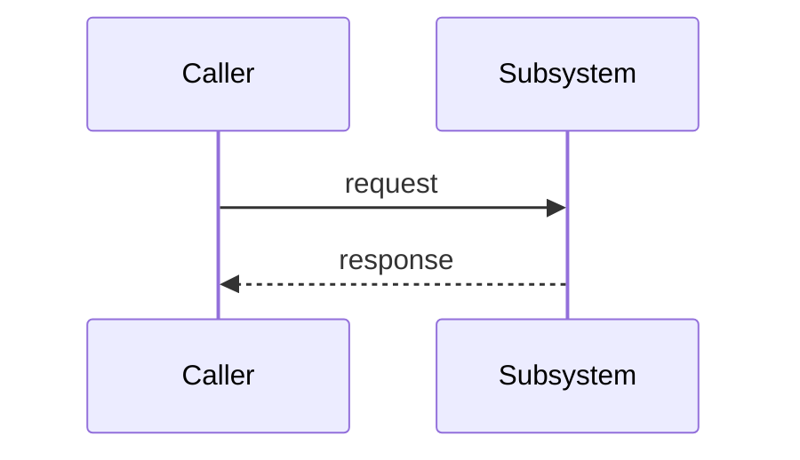

# <Title>

> **Source of truth:** `src/path/to/primary.ts`, `src/path/to/secondary.ts`
> **Band:** <band name> · **Depends on:** <doc numbers, or `none`> · **Jarcube class:** PORTABLE

<!--
  Copy this file when starting a new band doc. Delete the HTML comments.

  Rules enforced by verify-docs.mjs:
    - The three headings "## Purpose", "## File Inventory", "## Jarcube Portability" must exist.
    - The front-matter line "> **Jarcube class:** <LABEL>" must exist with exactly one of:
        PORTABLE | ENGINE-COUPLED | NEEDS-REDESIGN | SKIP | MIXED
    - Every backticked repo path must resolve on disk.
    - Every `file.ts:Symbol` citation must have Symbol present in that file.
    - Every `NN-name.md` cross-reference must resolve to a doc in this set.

  Conventions:
    - Diagrams are mermaid only. stateDiagram-v2 for lifecycles, sequenceDiagram for flows,
      graph TB for structure. No ASCII art.
    - Code excerpts only when the shape is non-obvious. Cap ~15 lines. Always name the source
      path immediately above the block. Prefer signature tables over pasted code.
    - Line counts are "as measured" and drift. Say so once, not per row.
    - Where OpenWA's own docs/NN-*.md covers a concept well, link it and spend the space on the
      implementation mapping instead of restating it.
    - Unknowns go under "## Open Questions". Never guess and never present a guess as fact.
-->

## Purpose

One paragraph: what this subsystem does, why it exists, and what problem it solves that a
naive implementation would get wrong.

## File Inventory

| Path | Lines | Role |
| --- | --- | --- |
| `src/path/to/primary.ts` | 000 | … |

## Data Model / Contract

Entities, DTOs, and interfaces with their real field names and types. Tables over prose.

## Flow

## Call Chain

- `src/path/to/controller.ts:MethodName` → `src/path/to/service.ts:methodName`
- annotate each hop with what it adds (validation, gating, persistence, fan-out)

## Configuration

| Env var | Default | Effect |
| --- | --- | --- |
| `EXAMPLE_VAR` | `false` | … |

Full list: APPENDIX-A-env-vars.md.

## Events Emitted / Consumed

| Event | Direction | Payload shape |
| --- | --- | --- |

Full list: APPENDIX-B-events.md.

## Failure Modes & Edge Cases

- What breaks, how it is detected, how it degrades, which test pins the behaviour.

## Jarcube Portability

**Classification:** PORTABLE

**Rationale:** …

**Prerequisites:** none | doc numbers / modules that must be ported first

**Cloud API caveats:** …

## Open Questions

- Anything that could not be determined from the code alone.
