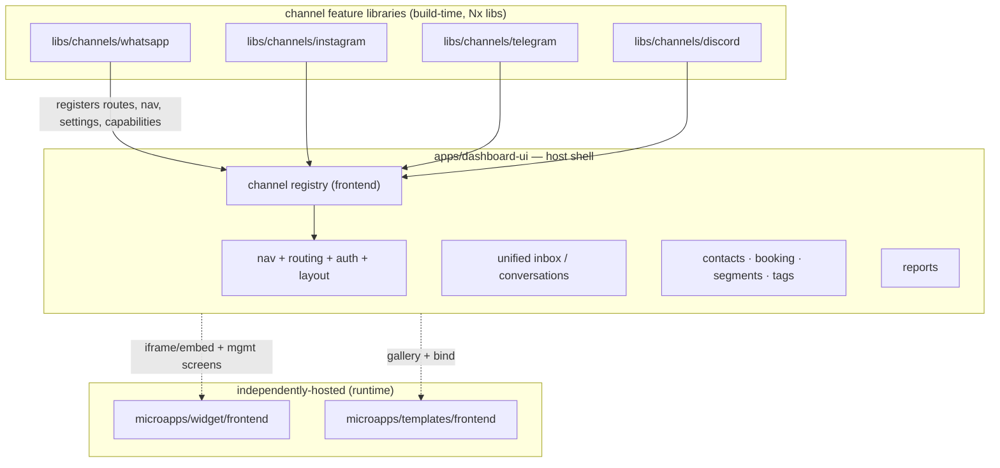
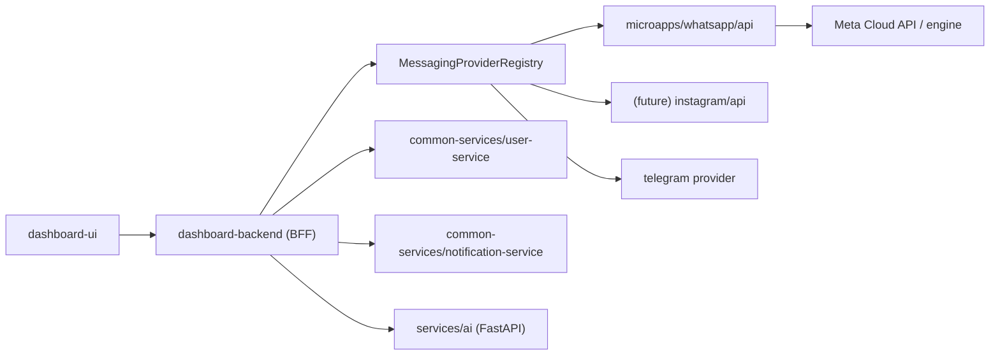

# JarCube Monorepo — Architecture & Migration Plan

> Status: **proposal for alignment**. Nothing is built yet. This doc is the working reference for
> the new Nx single-repo monorepo (`jarcube/`), modelled on `mykone-portal-main` and informed by the
> `docs/OpenWA/` analysis set.

## 1. Locked decisions

From the last round:

| # | Decision |
| --- | --- |
| 1 | **Orchestrator: Nx** (mirrors myKONE, gives tag-based `run-many` dev + caching + project graph) |
| 2 | **Fresh, separate repo** at `Cuperous-AI/jarcube/` — nothing is moved into existing `QuantumMind-*` folders; they stay as reference until each piece is re-created |
| 3 | **WhatsApp is a fresh backend service** — we cherry-pick the useful parts of OpenWA (documented in `docs/OpenWA/`), we do not clone it. Built so **Instagram / Telegram / Discord** slot in the same way later |
| 4 | This plan is written down (this file) before Phase 1 |

## 2. What we are actually building

JarCube is becoming an **all-in-one client-engagement platform**: multi-channel inbox (WhatsApp,
Instagram, Telegram, Discord, web widget), auto-replies/automation, templates, marketing
(ads/offers), CRM + booking, and reporting. The architecture has to make **adding a new channel or a
new tool a bounded, repeatable task** — not a monolith edit.

The single most important existing asset: `QuantumMind-backend/src/messaging/messaging-provider.registry.ts`.
Channels already self-register and are resolved by a feature flag per bot. The whole plan extends that
one idea — a **registry of pluggable capabilities** — up into the frontend and out into services.

## 3. Reference architecture (myKONE), distilled

- **pnpm workspace + Nx**: role-based folders (`portal/`, `microapps/**`, `packages/*`, `common-services/*`, `infra/*`), `preinstall: only-allow pnpm`, one `tsconfig.base.json`.
- **A microapp = `{ api, frontend }` pair.** Frontends compose into a portal shell via **Module Federation** against a versioned `portalInterface.ts`.
- **Shared code = `packages/*`** consumed as `@scope/*` `workspace:*` deps.
- **Nx tags** drive selective dev: `nx run-many --target=dev --projects=tag:whatsapp,tag:dashboard`.

One correction the research surfaced, straight from the Nx guidance: **runtime Module Federation is
only worth it when independent deployment is a hard requirement.** If pieces deploy together and you
mainly want faster builds and separation, **build-time Nx libraries are the right tool** and MF is
over-engineering. That distinction shapes the dashboard design below. ([Nx: micro-frontend architecture](https://nx.dev/docs/technologies/module-federation/concepts/micro-frontend-architecture) — content rephrased for licensing compliance.)

## 4. Target folder structure

Fresh repo, single Nx workspace. Reconciles your diagram with the "widget & templates are separate
apps" note: **`apps/` holds the two things that are always deployed as the product** (the dashboard
shell + its backend/BFF); **`microapps/` holds the independently-buildable / independently-hosted
apps** — the channel surfaces plus the widget and templates that ship on their own.

```
jarcube/                          # separate git repo, Nx single workspace
├── pnpm-workspace.yaml           # globs: apps/*, microapps/**/*, packages/*, services/*, common-services/*
├── nx.json                       # targetDefaults: build/dev/lint/test, caching, tags
├── tsconfig.base.json            # shared compiler options + path aliases (@jarcube/*)
├── package.json                  # preinstall: only-allow pnpm; run-many dev/build scripts
│
├── apps/
│   ├── dashboard-ui/             # the host shell (nav, auth, layout, routing, cross-cutting CRM/inbox)
│   └── dashboard-backend/        # BFF / API gateway for the dashboard (Nest) + provider registry
│
├── microapps/                    # pluggable + independently-hosted surfaces, each { api, frontend }
│   ├── whatsapp/
│   │   ├── api/                  # FRESH WhatsApp service (OpenWA-informed, not cloned)
│   │   └── frontend/             # WhatsApp channel UI (feature lib OR remote — see §6)
│   ├── widget/
│   │   ├── api/                  # widget config/session endpoints
│   │   └── frontend/             # embeddable widget (independently hosted, loaded on customer sites)
│   └── templates/
│       ├── api/                  # template hosting/registry endpoints
│       └── frontend/             # hosted interactive webview templates (independently hosted)
│       # future: microapps/instagram, microapps/telegram, microapps/discord (same shape)
│
├── packages/                     # shared @jarcube/* libraries (workspace:*)
│   ├── logger/                   # port of OpenWA/docs 76 logger patterns
│   ├── config/                   # env load/validate/precedence (OpenWA/docs 05)
│   ├── feature-flag/             # shared client of the per-channel/per-bot flag model
│   ├── access-token-verifier/    # auth token verification (myKONE portal-access-token-verifier analog)
│   ├── design-system/            # shared UI kit extracted from dashboard-ui
│   ├── messaging-core/           # channel provider interface + neutral message/event types
│   └── tsconfig/                 # shared tsconfig presets
│
├── services/
│   └── ai/                       # QuantumMind-ai (Python FastAPI) — joins compose + scripts, NOT the JS workspace
│
├── common-services/
│   ├── user-service/             # users, orgs, roles, auth
│   └── notification-service/     # email/push/in-app notifications
│
├── infra/                        # docker-compose, nginx, deploy manifests (from existing root compose + nginx/)
├── docs/                         # this plan + per-domain design docs
└── scripts/                      # workspace tooling (clean, dep-checks, generators)
```

Note on `autho/` from your diagram: folded into `common-services/user-service` (auth is a
user-service concern) unless you want a dedicated `auth/` boundary — flagged as an open decision.

## 5. Architecture principles

1. **Everything pluggable is a registry entry.** Backend channels register in `MessagingProviderRegistry`; the dashboard mirrors this with a **frontend channel registry** (below). Adding Instagram touches only its own lib/service + one registration.
2. **Neutral core, per-channel adapters.** `packages/messaging-core` defines the neutral message/event/capability types (the OpenWA `IWhatsAppEngine` normalisation lesson, generalised across channels). Each channel service adapts its platform to that neutral shape.
3. **Build-time libraries by default, runtime remotes only where independent deployment is real** (widget, templates).
4. **Shared cross-cutting via `packages/*`** — never copy-paste between channels.
5. **Nx tags per domain** (`whatsapp`, `dashboard`, `channel`, `widget`, `templates`, `crm`) for selective dev/build.

## 6. Dashboard decomposition (the core question)

Today `QuantumMind-ui` is one Next.js 12 Materio app with a flat vertical nav mixing everything
(Conversations, Bots, Agents, Templates, Social Messengers, Channel Providers, Reports…). It doesn't
scale as channels multiply. Proposed model:

### Host shell + channel feature libraries + a frontend channel registry



**Each channel is a feature library exposing one contract** — the frontend twin of the backend
provider. A `ChannelModule` provides: a connection/setup screen (QR/pairing for WhatsApp, OAuth for
Instagram), an inbox filter + message renderer, an auto-reply/automation config panel, a
templates-binding view, and a capabilities descriptor (mirrors OpenWA's capability matrix — what this
channel can/can't do, so the UI greys out unsupported actions instead of failing).

**The shell owns cross-cutting**: the unified inbox that merges all channels, contacts/CRM, booking,
segments/tags, marketing, reports, and auth/nav. It reads the channel registry to build nav and route
into each channel lib.

**Why libraries, not runtime remotes, for channels:** the channels deploy together with the dashboard,
you're one team, and Nx libraries give you the separation, independent ownership, and fast affected
builds without the runtime/version-skew cost of MF. If a channel ever needs independent deployment,
promoting a lib to an MF remote is a contained change.

**Widget and templates are the genuine remotes.** The widget is built here and loaded on *customer*
sites (chat icon); in the dashboard you configure/preview/connect it. Templates are hosted webviews
the user picks from a gallery and binds to flows. Both are independently hosted → they live in
`microapps/` with their own `api`, and the dashboard surfaces them via embed + management screens.

### Shell technology: two honest options

- **Option A — keep Next.js as the shell**, add channels as Nx libraries. Lowest risk, reuses the Materio investment, no MF machinery. Recommended for Phase 1.
- **Option B — rebuild the shell as Vite + React** to match myKONE 1:1 (enables Vite Module Federation cleanly). More work; only pays off if you truly need runtime-independent channel deployment.

Recommendation: **A now, keep B as an escape hatch.** The folder structure is identical either way;
only the shell's build tooling differs.

## 7. Backend & services architecture



- **dashboard-backend** is the BFF: auth, aggregation, and the home of the provider registry + feature flags. It routes channel operations to the right channel service.
- **Channel services** (`microapps/whatsapp/api`, later instagram/telegram) each own one platform, expose a uniform contract from `packages/messaging-core`, and register with the registry.
- **common-services** and **services/ai** are shared backends the BFF and channels call.

## 8. The fresh WhatsApp service — what to take from OpenWA

Not a clone. From `docs/OpenWA/`, cherry-pick the parts that are transport-independent and proven:

| Take | From OpenWA doc |
| --- | --- |
| Config load/validate/precedence, fail-safe env parsing | 05 |
| Bootstrap/shutdown contract (real-exit, drain, deny-list secrets) | 04 |
| Webhook delivery + HMAC + outbox + idempotency | 53 |
| Neutral message/event types + capability matrix pattern | 10, 12, 15 |
| Media pipeline (inline vs persisted, caps) | 34 |
| Templates, automation rules | 35, 62 |
| Auth/API keys, rate limiting, metrics | 50, 52, 64 |

Leave behind the engine-coupled parts (QR/session/Chromium/Baileys) unless/until you add an unofficial
transport — Jarcube's WhatsApp is Meta Cloud API first.

## 9. Phased roadmap

**Phase 0 — Scaffolding decisions (this doc).** Confirm §6 shell option, §4 folder reconciliation, and the open decisions in §10.

**Phase 1 — Nx workspace skeleton.** `create-nx-workspace` at `jarcube/`, pnpm, `preinstall` guard, `tsconfig.base.json`, root scripts, first shared lib `packages/tsconfig` + `packages/logger` to validate `workspace:*` wiring. Nothing migrated.

**Phase 2 — Shared foundations.** `packages/config`, `packages/messaging-core`, `packages/feature-flag`, `packages/access-token-verifier`. These are the contracts everything else depends on.

**Phase 3 — WhatsApp service.** `microapps/whatsapp/api` fresh, built on Phase 2 packages + the OpenWA cherry-pick list. Wired behind the provider registry.

**Phase 4 — Dashboard shell + WhatsApp channel lib.** Stand up `apps/dashboard-ui` (Option A) + `apps/dashboard-backend`, extract `packages/design-system`, implement the frontend channel registry, and land WhatsApp as the first `libs/channels/whatsapp`. This proves the whole pattern end-to-end on one channel.

**Phase 5 — Widget + templates as microapps.** Bring both in as `microapps/*` with their own `api`, surfaced in the dashboard via embed + management screens.

**Phase 6 — Second channel (Instagram/Telegram).** Repeat Phase 3+4 for one more channel to prove "adding a channel is bounded." This is the real test of the architecture.

**Phase 7 — Common services + AI + infra.** `user-service`, `notification-service`, fold AI into compose, CI, tags/targets polish.

## 10. Open decisions

1. **Shell tech**: confirm Option A (Next.js host + Nx libs) vs Option B (Vite + MF). I recommend A.
2. **`autho/`**: dedicated `auth/` boundary, or fold into `user-service`? I recommend folding in.
3. **Widget/templates placement**: `microapps/` (per this doc, since they're independently hosted) vs `apps/` (per your note). I recommend `microapps/`.
4. **Backend split**: one `dashboard-backend` BFF + separate channel services (this doc), vs keeping a single Nest backend initially and splitting later. I recommend BFF + WhatsApp service now, others later.
5. **Data store**: existing backend is MongoDB/Mongoose; OpenWA patterns assume SQL. Confirm Mongo stays the JarCube default so the WhatsApp service uses it too.
```
